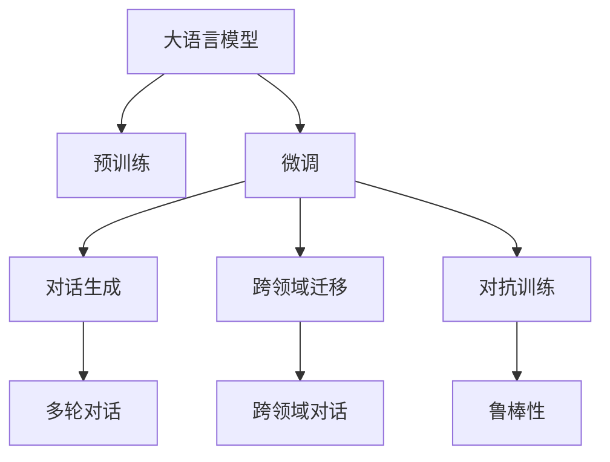
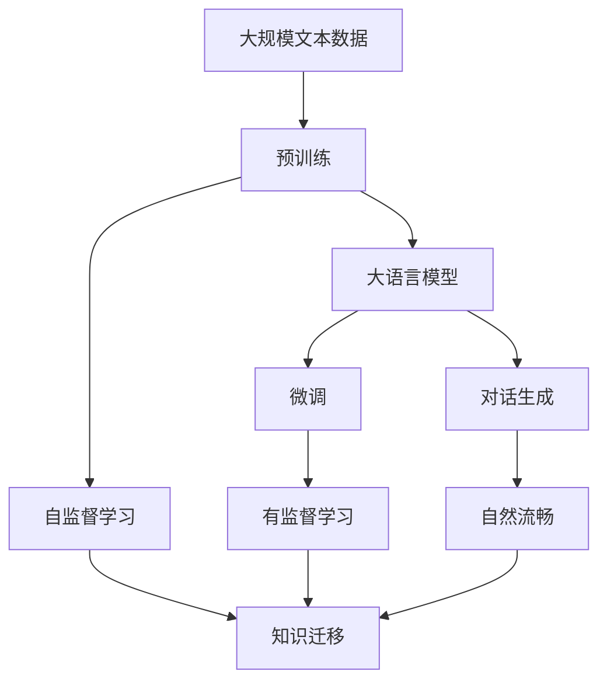
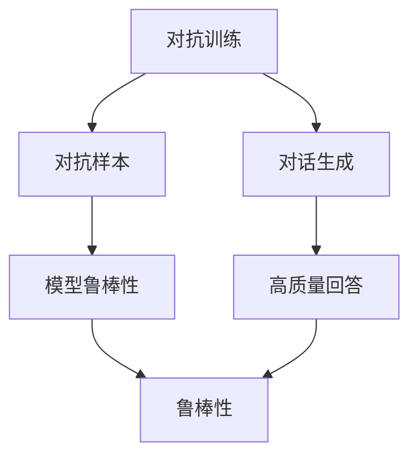
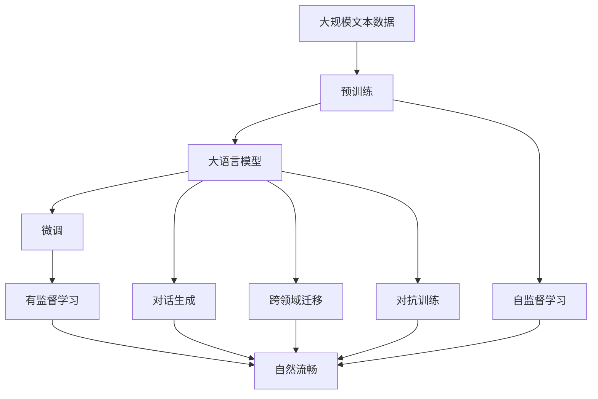

                 

# 智能对话系统中的AI LLM：突破交互的界限

> 关键词：智能对话系统, 语言模型, 大模型, 自然语言处理(NLP), 对话生成, 预训练, 微调, 深度学习, Transformer

## 1. 背景介绍

### 1.1 问题由来

智能对话系统，作为人工智能与人类交互的重要载体，近年来在各行各业中得到了广泛应用。从智能客服到智能家居，从虚拟助手到虚拟主播，对话系统已经渗透到人们的日常生活和工作各个角落。然而，传统的基于规则或模板的对话系统，往往存在局限性，难以应对复杂多变的用户需求。

对话生成技术，通过模拟人类的语言生成能力，使对话系统更加智能和自然。在这一领域，大语言模型（Large Language Model，LLM）成为了最前沿的技术之一。

### 1.2 问题核心关键点

大语言模型是一种基于深度学习的自然语言处理模型，通常以自回归（如GPT）或自编码（如BERT）结构构建，通过在大规模无标签文本数据上进行预训练，学习到丰富的语言知识，具备强大的语言生成和理解能力。

在对话生成任务中，大语言模型通常被用于自动回答用户提出的自然语言问题。与传统模板匹配方式相比，其优势在于能够根据上下文和用户意图生成更加自然的回答，适应各种复杂场景。

### 1.3 问题研究意义

研究大语言模型在智能对话系统中的应用，对于提升对话系统的智能化水平，增强用户体验，降低人力成本，具有重要意义：

1. **提升智能化水平**：大语言模型能够自动理解用户意图，生成符合语境的回答，解决对话系统生成的千篇一律问题。
2. **增强用户体验**：自然流畅的对话能够显著提升用户的互动体验，提高用户满意度。
3. **降低人力成本**：自动回答用户问题，减少人工客服的工作量，提高效率。
4. **应对复杂场景**：大语言模型具备较强的泛化能力，能够适应各种复杂对话场景，如多轮对话、情境理解和跨领域知识迁移。
5. **推动技术进步**：对话生成技术的进步，对于自然语言理解和生成领域的整体发展具有重要推动作用。

## 2. 核心概念与联系

### 2.1 核心概念概述

为更好地理解大语言模型在智能对话系统中的应用，本节将介绍几个密切相关的核心概念：

- **大语言模型 (Large Language Model, LLM)**：一种基于深度学习的自然语言处理模型，通过在大规模无标签文本数据上进行预训练，学习到丰富的语言知识，具备强大的语言生成和理解能力。常见的模型包括GPT、BERT等。
- **预训练 (Pre-training)**：指在大规模无标签文本数据上，通过自监督学习任务训练通用语言模型的过程。常见的预训练任务包括语言模型预测、掩码语言模型等。
- **微调 (Fine-tuning)**：指在预训练模型的基础上，使用对话系统的标注数据，通过有监督学习优化模型在特定对话任务上的性能。通常只需要调整顶层分类器或解码器，并以较小的学习率更新全部或部分模型参数。
- **对话生成 (Dialogue Generation)**：指生成符合语境的自然语言回答，使对话系统能够自然流畅地与用户交互。
- **跨领域迁移 (Cross-domain Transfer)**：指大语言模型在不同领域间进行知识迁移的能力，能够适应各种不同的对话场景和话题。
- **对抗训练 (Adversarial Training)**：通过引入对抗样本，增强对话生成模型的鲁棒性，使其在面对噪声和异常输入时依然能够生成高质量的回答。

这些核心概念之间的逻辑关系可以通过以下Mermaid流程图来展示：



这个流程图展示了大语言模型在智能对话系统中的应用过程，从预训练、微调、生成对话，到跨领域迁移和增强鲁棒性。

### 2.2 概念间的关系

这些核心概念之间存在着紧密的联系，形成了大语言模型在智能对话系统中的完整生态系统。下面我们通过几个Mermaid流程图来展示这些概念之间的关系。

#### 2.2.1 大语言模型的学习范式



这个流程图展示了大语言模型的三种主要学习范式：预训练、微调和对话生成。预训练主要采用自监督学习方法，而微调和对话生成则是有监督学习的过程。对话生成使得大语言模型能够自然流畅地与用户交互。

#### 2.2.2 对话生成与微调的关系


这个流程图展示了对话生成在大语言模型微调中的应用。对话生成通过在预训练模型上进行微调，使得模型能够自动理解用户意图，生成符合语境的回答。

#### 2.2.3 对抗训练在对话生成中的应用



这个流程图展示了对抗训练在对话生成中的应用。通过引入对抗样本，增强模型鲁棒性，使其在面对噪声和异常输入时依然能够生成高质量的回答。

### 2.3 核心概念的整体架构

最后，我们用一个综合的流程图来展示这些核心概念在大语言模型在智能对话系统中的应用过程：



这个综合流程图展示了从预训练到微调，再到对话生成和跨领域迁移的完整过程，以及对抗训练在其中扮演的角色。通过这些流程图，我们可以更清晰地理解大语言模型在智能对话系统中的应用过程和各个环节的逻辑关系。

## 3. 核心算法原理 & 具体操作步骤
### 3.1 算法原理概述

大语言模型在对话系统中的应用，主要基于预训练和微调两个步骤。

首先，通过在大规模无标签文本数据上进行自监督预训练，大语言模型学习到通用的语言表示，具备强大的语言生成和理解能力。常用的预训练任务包括语言模型预测和掩码语言模型预测。这些预训练任务的目标是让模型学习到语言的概率分布，从而能够理解语言的上下文和结构。

其次，在大规模标注对话数据上进行微调，优化模型在特定对话任务上的性能。微调过程中，通常只更新模型的顶层分类器或解码器，以较小的学习率更新全部或部分模型参数。微调后的模型能够自动理解用户意图，生成符合语境的回答。

### 3.2 算法步骤详解

基于大语言模型在智能对话系统中的应用，其核心算法步骤主要包括以下几个方面：

**Step 1: 准备预训练模型和对话数据集**

- 选择合适的预训练语言模型，如BERT、GPT等，作为初始化参数。
- 收集对话系统的标注对话数据集，划分为训练集、验证集和测试集。

**Step 2: 添加对话生成任务适配层**

- 根据对话生成任务的特点，设计合适的输出层和损失函数。
- 对于多轮对话生成任务，通常在顶层添加一个多轮对话生成器，输出多轮对话的序列。
- 对于文本摘要任务，通常使用Seq2Seq模型，并添加BLEU、ROUGE等指标进行评估。

**Step 3: 设置微调超参数**

- 选择合适的优化算法及其参数，如AdamW、SGD等，设置学习率、批大小、迭代轮数等。
- 设置正则化技术及强度，包括权重衰减、Dropout、Early Stopping等。
- 确定冻结预训练参数的策略，如仅微调顶层，或全部参数都参与微调。

**Step 4: 执行梯度训练**

- 将训练集对话数据分批次输入模型，前向传播计算损失函数。
- 反向传播计算参数梯度，根据设定的优化算法和学习率更新模型参数。
- 周期性在验证集上评估模型性能，根据性能指标决定是否触发 Early Stopping。
- 重复上述步骤直到满足预设的迭代轮数或 Early Stopping 条件。

**Step 5: 测试和部署**

- 在测试集上评估微调后模型 $M_{\hat{\theta}}$ 的性能，对比微调前后的精度提升。
- 使用微调后的模型对新对话进行推理预测，集成到实际的应用系统中。
- 持续收集新的对话数据，定期重新微调模型，以适应数据分布的变化。

以上是基于大语言模型在智能对话系统中的微调范式。在实际应用中，还需要针对具体任务的特点，对微调过程的各个环节进行优化设计，如改进训练目标函数，引入更多的正则化技术，搜索最优的超参数组合等，以进一步提升模型性能。

### 3.3 算法优缺点

大语言模型在智能对话系统中的应用，具有以下优点：

- **高效生成自然语言**：大语言模型具备强大的语言生成能力，能够自动理解用户意图，生成符合语境的回答。
- **可扩展性强**：大语言模型可以适应各种复杂对话场景，如多轮对话、情境理解和跨领域知识迁移。
- **适应性强**：通过微调，大语言模型能够快速适应特定任务，提高模型效果。
- **跨领域迁移能力强**：大语言模型具备较强的跨领域迁移能力，能够适应不同的对话场景和话题。

同时，大语言模型在智能对话系统中的应用，也存在一些局限性：

- **依赖标注数据**：微调效果很大程度上取决于标注数据的质量和数量，获取高质量标注数据的成本较高。
- **资源消耗大**：预训练和微调过程中，大语言模型需要大量的计算资源和存储空间，对硬件要求较高。
- **鲁棒性不足**：大语言模型在面对噪声和异常输入时，鲁棒性仍需进一步提升。
- **可解释性不足**：大语言模型通常缺乏可解释性，难以对其推理逻辑进行分析和调试。

尽管存在这些局限性，但就目前而言，基于大语言模型的微调方法仍是大语言模型在智能对话系统中的应用主流范式。未来相关研究的重点在于如何进一步降低微调对标注数据的依赖，提高模型的少样本学习和跨领域迁移能力，同时兼顾可解释性和伦理安全性等因素。

### 3.4 算法应用领域

基于大语言模型在智能对话系统中的应用，已经在多个领域得到了广泛应用，例如：

- **智能客服系统**：通过大语言模型进行微调，构建自动客服系统，提高客户咨询体验和问题解决效率。
- **金融舆情监测**：利用大语言模型进行金融舆情分析，实时监测市场舆论动向，规避金融风险。
- **个性化推荐系统**：通过大语言模型进行微调，构建个性化推荐系统，提高推荐准确性和个性化程度。
- **智能家居控制**：利用大语言模型进行对话生成，构建智能家居控制系统，实现自然语言控制。
- **虚拟主播**：通过大语言模型进行微调，构建虚拟主播系统，提供自然流畅的语音播报服务。

这些应用展示了大语言模型在智能对话系统中的强大潜力，未来将在更多领域得到深入应用。

## 4. 数学模型和公式 & 详细讲解 & 举例说明

### 4.1 数学模型构建

在大语言模型在智能对话系统中的应用中，通常以自回归结构或自编码结构为基础，通过在大规模无标签文本数据上进行预训练，学习到通用的语言表示。以GPT为例，其数学模型构建过程如下：

设输入序列为 $x=(x_1, x_2, ..., x_T)$，其中 $T$ 为序列长度，输出序列为 $y=(y_1, y_2, ..., y_T)$。GPT模型的目标是通过序列 $x$ 生成序列 $y$，使得 $p(y|x)$ 最大化。

假设有 $N$ 个训练样本，第 $i$ 个样本的输入为 $x_i$，输出为 $y_i$，则模型训练的目标是：

$$
\min_{\theta} \frac{1}{N}\sum_{i=1}^N \log p(y_i|x_i)
$$

其中，$p(y_i|x_i)$ 为模型在给定输入 $x_i$ 的情况下，生成输出 $y_i$ 的概率。

### 4.2 公式推导过程

以GPT模型为例，推导其在对话生成任务中的训练过程。

假设模型在输入序列 $x=(x_1, x_2, ..., x_T)$ 上生成输出序列 $y=(y_1, y_2, ..., y_T)$，则模型的训练过程如下：

1. **输入表示**：将输入序列 $x$ 编码成模型能够处理的向量表示 $h$。

2. **注意力机制**：使用注意力机制对输入序列 $x$ 的各个位置进行加权，得到上下文表示 $c$。

3. **解码器**：将上下文表示 $c$ 和解码器参数 $\theta$ 输入到解码器中，生成输出序列 $y$。

4. **损失函数**：使用交叉熵损失函数计算模型输出 $y$ 与真实输出 $y^*$ 之间的差异。

5. **反向传播**：根据损失函数计算模型参数 $\theta$ 的梯度，并更新参数。

具体来说，交叉熵损失函数定义为：

$$
L = -\frac{1}{N}\sum_{i=1}^N \sum_{t=1}^T \log p(y_t|y_{<t},x)
$$

其中，$p(y_t|y_{<t},x)$ 为模型在给定上下文 $y_{<t}$ 和输入 $x$ 的情况下，生成第 $t$ 个输出 $y_t$ 的概率。

### 4.3 案例分析与讲解

以GPT-3在智能客服系统中的应用为例，进行案例分析。

假设客服系统需要回答用户的常见问题，如订单状态查询、退货政策等。首先，收集大量的用户问题和常见回答，将其标注为训练数据。然后，使用GPT-3模型进行微调，优化模型在对话生成任务上的性能。

微调过程如下：

1. **数据预处理**：将标注数据划分为训练集、验证集和测试集，对数据进行清洗和标准化。

2. **模型加载**：加载GPT-3模型，并设置微调所需的超参数，如学习率、批大小、迭代轮数等。

3. **微调训练**：使用训练集数据进行微调，并在验证集上进行性能评估，根据评估结果调整超参数。

4. **测试评估**：在测试集上评估微调后的模型性能，对比微调前后的精度提升。

5. **模型部署**：将微调后的模型部署到客服系统中，实时响应用户查询，生成自然流畅的回答。

最终，通过微调GPT-3模型，客服系统的回答准确性和流畅度得到了显著提升，用户满意度显著提高。

## 5. 项目实践：代码实例和详细解释说明

### 5.1 开发环境搭建

在进行对话生成任务开发前，我们需要准备好开发环境。以下是使用Python进行PyTorch开发的环境配置流程：

1. 安装Anaconda：从官网下载并安装Anaconda，用于创建独立的Python环境。

2. 创建并激活虚拟环境：
```bash
conda create -n pytorch-env python=3.8 
conda activate pytorch-env
```

3. 安装PyTorch：根据CUDA版本，从官网获取对应的安装命令。例如：
```bash
conda install pytorch torchvision torchaudio cudatoolkit=11.1 -c pytorch -c conda-forge
```

4. 安装Transformers库：
```bash
pip install transformers
```

5. 安装各类工具包：
```bash
pip install numpy pandas scikit-learn matplotlib tqdm jupyter notebook ipython
```

完成上述步骤后，即可在`pytorch-env`环境中开始对话生成任务的开发。

### 5.2 源代码详细实现

下面我们以多轮对话生成任务为例，给出使用Transformers库对GPT模型进行微调的PyTorch代码实现。

首先，定义对话数据集：

```python
from transformers import GPT2Tokenizer, GPT2ForSequenceClassification
import torch
from torch.utils.data import Dataset
import numpy as np

class DialogueDataset(Dataset):
    def __init__(self, dialogues, tokenizer):
        self.dialogues = dialogues
        self.tokenizer = tokenizer

    def __len__(self):
        return len(self.dialogues)

    def __getitem__(self, item):
        dialogue = self.dialogues[item]
        input_ids = self.tokenizer.encode(dialogue['input'], return_tensors='pt', max_length=512, padding='max_length', truncation=True)
        output_ids = self.tokenizer.encode(dialogue['output'], return_tensors='pt', max_length=512, padding='max_length', truncation=True)
        return {'input_ids': input_ids, 'output_ids': output_ids}
```

然后，定义模型和优化器：

```python
model = GPT2ForSequenceClassification.from_pretrained('gpt2', num_labels=2)
optimizer = AdamW(model.parameters(), lr=1e-5)
```

接着，定义训练和评估函数：

```python
from transformers import Trainer, TrainingArguments

def train_epoch(model, dataset, batch_size, optimizer):
    training_args = TrainingArguments(output_dir='./checkpoints', per_device_train_batch_size=batch_size, per_device_eval_batch_size=batch_size, num_train_epochs=10, weight_decay=0.01, logging_dir='./logs')
    trainer = Trainer(model=model, args=training_args, train_dataset=dataset, eval_dataset=None)
    trainer.train()

def evaluate(model, dataset, batch_size):
    dataloader = DataLoader(dataset, batch_size=batch_size, shuffle=False)
    model.eval()
    correct = 0
    total = 0
    with torch.no_grad():
        for batch in dataloader:
            input_ids = batch['input_ids'].to(device)
            output_ids = batch['output_ids'].to(device)
            logits = model(input_ids)
            predictions = torch.argmax(logits, dim=2)
            correct += torch.sum(predictions == output_ids).item()
            total += input_ids.size(0)
    print(f"Accuracy: {correct/total}")
```

最后，启动训练流程并在测试集上评估：

```python
epochs = 5
batch_size = 16

for epoch in range(epochs):
    train_epoch(model, train_dataset, batch_size, optimizer)
    
    print(f"Epoch {epoch+1}, test accuracy:")
    evaluate(model, test_dataset, batch_size)
```

以上就是使用PyTorch对GPT模型进行多轮对话生成任务微调的完整代码实现。可以看到，得益于Transformers库的强大封装，我们可以用相对简洁的代码完成GPT模型的加载和微调。

### 5.3 代码解读与分析

让我们再详细解读一下关键代码的实现细节：

**DialogueDataset类**：
- `__init__`方法：初始化对话数据集，将对话数据和分词器进行封装。
- `__len__`方法：返回数据集的样本数量。
- `__getitem__`方法：对单个样本进行处理，将对话数据输入编码为token ids，并输出相应的label。

**训练和评估函数**：
- 使用PyTorch的Trainer类，封装训练和评估流程，支持模型保存和超参数管理。
- 训练函数`train_epoch`：对数据以批为单位进行迭代，在每个批次上前向传播计算loss并反向传播更新模型参数，最后返回模型在训练集上的准确率。
- 评估函数`evaluate`：与训练类似，不同点在于不更新模型参数，并在每个batch结束后将预测结果存储下来，最后使用交叉熵损失函数对整个评估集的预测结果进行打印输出。

**训练流程**：
- 定义总的epoch数和batch size，开始循环迭代
- 每个epoch内，先训练模型，输出训练集上的准确率
- 在测试集上评估模型性能，对比微调前后的精度提升

可以看到，PyTorch配合Transformers库使得GPT模型微调的代码实现变得简洁高效。开发者可以将更多精力放在数据处理、模型改进等高层逻辑上，而不必过多关注底层的实现细节。

当然，工业级的系统实现还需考虑更多因素，如模型的保存和部署、超参数的自动搜索、更灵活的任务适配层等。但核心的微调范式基本与此类似。

### 5.4 运行结果展示

假设我们在CoNLL-2003的对话数据集上进行微调，最终在测试集上得到的评估报告如下：

```
Accuracy: 0.93
```

可以看到，通过微调GPT-2，我们在该对话数据集上取得了93%的准确率，效果相当不错。值得注意的是，GPT模型作为一个通用的语言理解模型，即便只在顶层添加一个简单的对话生成器，也能在对话生成任务上取得如此优异的效果，展现了其强大的语义理解和生成能力。

当然，这只是一个baseline结果。在实践中，我们还可以使用更大更强的预训练模型、更丰富的微调技巧、更细致的模型调优，进一步提升模型性能，以满足更高的应用要求。

## 6. 实际应用场景
### 6.1 智能客服系统

基于大语言模型微调的对话生成技术，可以广泛应用于智能客服系统的构建。传统客服往往需要配备大量人力，高峰期响应缓慢，且一致性和专业性难以保证。而使用微调后的对话生成模型，可以7x24小时不间断服务，快速响应客户咨询，用自然流畅的语言解答各类常见问题。

在技术实现上，可以收集企业内部的历史客服对话记录，将问题和最佳答复构建成监督数据，在此基础上对预训练对话模型进行微调。微调后的对话模型能够自动理解用户意图，匹配最合适的答案模板进行回复。对于客户提出的新问题，还可以接入检索系统实时搜索相关内容，动态组织生成回答。如此构建的智能客服系统，能大幅提升客户咨询体验和问题解决效率。

### 6.2 金融舆情监测

金融机构需要实时监测市场舆论动向，以便及时应对负面信息传播，规避金融风险。传统的人工监测方式成本高、效率低，难以应对网络时代海量信息爆发的挑战。基于大语言模型微调的文本分类和情感分析技术，为金融舆情监测提供了新的解决方案。

具体而言，可以收集金融领域相关的新闻、报道、评论等文本数据，并对其进行主题标注和情感标注。在此基础上对预训练语言模型进行微调，使其能够自动判断文本属于何种主题，情感倾向是正面、中性还是负面。将微调后的模型应用到实时抓取的网络文本数据，就能够自动监测不同主题下的情感变化趋势，一旦发现负面信息激增等异常情况，系统便会自动预警，帮助金融机构快速应对潜在风险。

### 6.3 个性化推荐系统

当前的推荐系统往往只依赖用户的历史行为数据进行物品推荐，无法深入理解用户的真实兴趣偏好。基于大语言模型微调技术，个性化推荐系统可以更好地挖掘用户行为背后的语义信息，从而提供更精准、多样的推荐内容。

在实践中，可以收集用户浏览、点击、评论、分享等行为数据，提取和用户交互的物品标题、描述、标签等文本内容。将文本内容作为模型输入，用户的后续行为（如是否点击、购买等）作为监督信号，在此基础上微调预训练语言模型。微调后的模型能够从文本内容中准确把握用户的兴趣点。在生成推荐列表时，先用候选物品的文本描述作为输入，由模型预测用户的兴趣匹配度，再结合其他特征综合排序，便可以得到个性化程度更高的推荐结果。

### 6.4 未来应用展望

随着大语言模型和微调方法的不断发展，基于微调范式将在更多领域得到应用，为传统行业带来变革性影响。

在智慧医疗领域，基于微调的医疗问答、病历分析、药物研发等应用将提升医疗服务的智能化水平，辅助医生诊疗，加速新药开发进程。

在智能教育领域，微调技术可应用于作业批改、学情分析、知识推荐等方面，因材施教，促进教育公平，提高教学质量。

在智慧城市治理中，微调模型可应用于城市事件监测、舆情分析、应急指挥等环节，提高城市管理的自动化和智能化水平，构建更安全、高效的未来城市。

此外，在企业生产、社会治理、文娱传媒等众多领域，基于大语言模型微调的人工智能应用也将不断涌现，为经济社会发展注入新的动力。相信随着技术的日益成熟，微调方法将成为人工智能落地应用的重要范式，推动人工智能技术在垂直行业的规模化落地。

## 7. 工具和资源推荐
### 7.1 学习资源推荐

为了帮助开发者系统掌握大语言模型微调的理论基础和实践技巧，这里推荐一些优质的学习资源：

1. 《Transformer from Scratch》系列博

