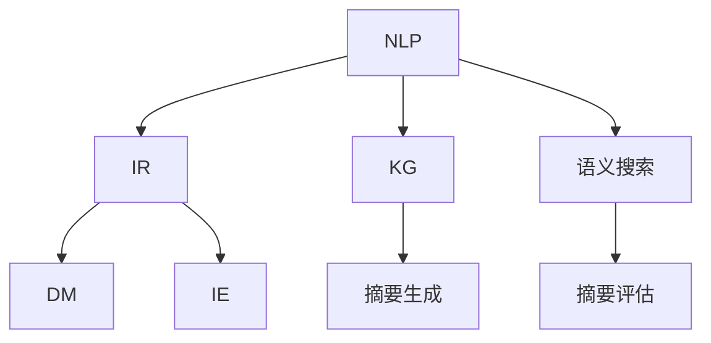
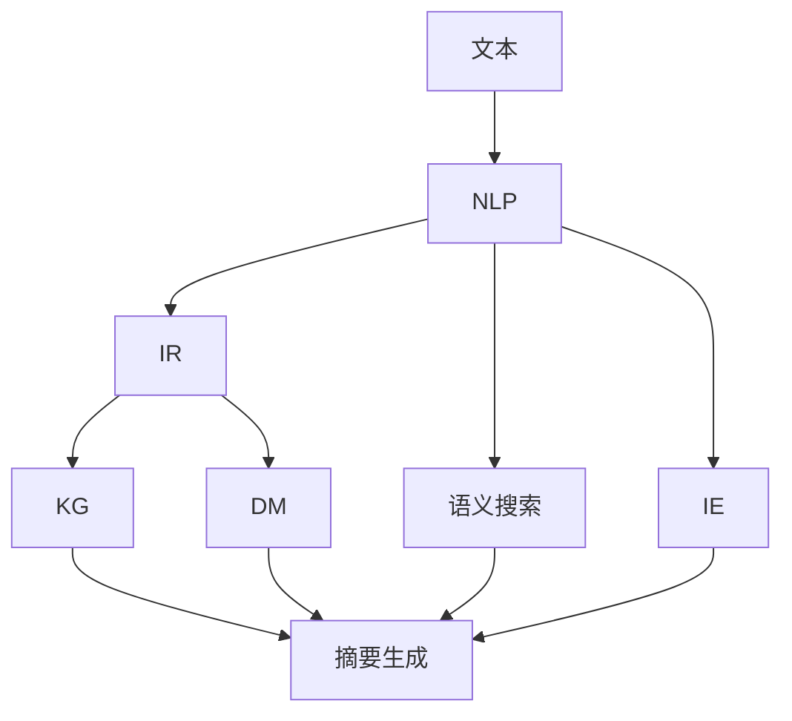

                 

# 智能摘要在信息处理中的应用

> 关键词：
- 智能摘要
- 自然语言处理（NLP）
- 信息检索（IR）
- 知识图谱（KG）
- 语义搜索
- 数据挖掘（DM）
- 信息抽取（IE）
- 文本挖掘

## 1. 背景介绍

随着互联网和信息技术的迅猛发展，信息爆炸已成为不争的事实。据统计，全球互联网数据每年以超过50%的速度增长，人类用于存储和处理数据的能力与日俱增。在这样的背景下，智能摘要技术应运而生，成为处理海量信息的重要手段。智能摘要旨在从海量的文本信息中自动抽取精华，生成简洁、精确的摘要文本，帮助用户快速把握文章或文档的核心内容。其应用场景包括新闻阅读、学术论文检索、科技文献综述、法律文件分析等领域。

### 1.1 问题由来

在信息时代，用户每天都会接触到大量的文本信息，如新闻文章、学术论文、技术报告等。但单靠人工阅读这些文本，既耗时又费力，效率低下。如果能够自动生成这些文本的摘要，将大大提高阅读效率和信息获取的速度。为此，智能摘要技术应运而生。它利用自然语言处理（NLP）和机器学习（ML）技术，自动从文本中抽取关键信息，生成简洁的摘要。

### 1.2 问题核心关键点

智能摘要技术的核心关键点在于如何自动抽取文本的精髓，并生成一个简洁、精确的摘要。主要包括以下几个方面：

1. **关键信息抽取**：从文本中识别出最具代表性和重要性的信息，如主题、关键词、关键句等。
2. **摘要生成**：根据抽取的关键信息，自动生成一个简洁、精确的摘要，尽可能包含文本的关键内容。
3. **摘要评估**：评估摘要的质量，确保摘要内容准确无误，与原文含义一致。

智能摘要技术的主要挑战在于如何处理不同领域的文本，如新闻、学术论文、技术报告等，其结构、风格和内容各不相同，对摘要技术的要求也不同。

## 2. 核心概念与联系

### 2.1 核心概念概述

智能摘要技术涉及多个核心概念，包括自然语言处理、信息检索、知识图谱等。下面我们逐一介绍这些核心概念及其联系。

#### 2.1.1 自然语言处理（NLP）

NLP是人工智能领域的一个分支，旨在使计算机能够理解和处理人类语言。智能摘要技术离不开NLP技术，如文本分词、句法分析、语义理解等。这些技术可以帮助从文本中抽取关键信息，生成摘要。

#### 2.1.2 信息检索（IR）

IR是帮助用户在海量信息中找到所需信息的技术。智能摘要技术可以通过IR技术，从海量的文本信息中找到与用户查询相关的文档，并抽取关键信息生成摘要。

#### 2.1.3 知识图谱（KG）

KG是描述实体间关系的图结构数据。智能摘要技术可以通过KG技术，将文本中的实体关系进行结构化处理，进一步提高摘要的准确性和相关性。

#### 2.1.4 语义搜索

语义搜索通过理解用户的查询意图，提供更精准的信息检索结果。智能摘要技术可以通过语义搜索技术，提高摘要生成的准确性和相关性。

#### 2.1.5 数据挖掘（DM）

DM是从数据中提取有用信息的技术。智能摘要技术可以通过DM技术，从文本中挖掘出重要的信息，生成高质量的摘要。

#### 2.1.6 信息抽取（IE）

IE是从文本中抽取结构化信息的技术。智能摘要技术可以通过IE技术，从文本中抽取关键信息，生成简洁的摘要。

这些核心概念之间的联系可以通过以下Mermaid流程图来展示：



这个流程图展示了智能摘要技术涉及的核心概念及其联系：

1. NLP技术用于文本预处理和关键信息抽取。
2. IR技术用于信息检索，找到相关文档。
3. KG技术用于结构化处理实体关系。
4. 语义搜索技术用于理解查询意图，提供精准结果。
5. DM技术用于从文本中挖掘有用信息。
6. IE技术用于抽取结构化信息。
7. 最终，这些技术被用于生成和评估摘要。

### 2.2 概念间的关系

这些核心概念之间存在着紧密的联系，形成了智能摘要技术的完整生态系统。下面我通过几个Mermaid流程图来展示这些概念之间的关系。

#### 2.2.1 智能摘要的总体架构



这个流程图展示了智能摘要技术的总体架构：

1. 从文本开始，NLP技术用于文本预处理和关键信息抽取。
2. IR技术用于信息检索，找到相关文档。
3. KG技术用于结构化处理实体关系。
4. 语义搜索技术用于理解查询意图，提供精准结果。
5. DM技术用于从文本中挖掘有用信息。
6. IE技术用于抽取结构化信息。
7. 最终，这些技术被用于生成和评估摘要。

#### 2.2.2 摘要生成流程


这个流程图展示了摘要生成的详细流程：

1. 从文本开始，NLP技术用于文本预处理和关键信息抽取。
2. IR技术用于信息检索，找到相关文档。
3. KG技术用于结构化处理实体关系。
4. 语义搜索技术用于理解查询意图，提供精准结果。
5. DM技术用于从文本中挖掘有用信息。
6. IE技术用于抽取结构化信息。
7. 最终，这些技术被用于生成和评估摘要。

## 3. 核心算法原理 & 具体操作步骤

### 3.1 算法原理概述

智能摘要的生成过程，可以分为三个阶段：文本预处理、关键信息抽取和摘要生成。以下是详细的算法原理和操作步骤。

#### 3.1.1 文本预处理

文本预处理是智能摘要的第一步，主要包括以下几个步骤：

1. **文本分词**：将文本分割成单词或短语，便于后续处理。
2. **去除停用词**：去除常见的无意义单词，如“的”、“是”、“在”等，以减少噪音。
3. **词性标注**：对每个单词进行词性标注，如名词、动词、形容词等，以便更好地理解文本含义。
4. **实体识别**：识别文本中的实体，如人名、地名、机构名等，这些实体往往是文本的关键信息。

#### 3.1.2 关键信息抽取

关键信息抽取是智能摘要的核心步骤，主要包括以下几个步骤：

1. **句子切分**：将文本分割成句子，便于后续处理。
2. **句子重要度计算**：计算每个句子的重要性，以确定哪些句子应该包含在摘要中。
3. **关键句抽取**：根据句子重要度，抽取最重要的句子，生成初步摘要。
4. **关键词抽取**：从文本中抽取关键词，进一步优化摘要。
5. **关系抽取**：抽取句子之间的实体关系，增强摘要的连贯性和逻辑性。

#### 3.1.3 摘要生成

摘要生成是智能摘要的最后一步，主要包括以下几个步骤：

1. **摘要拼接**：将关键句和关键词拼接在一起，生成初步摘要。
2. **摘要优化**：对初步摘要进行优化，如去除冗余信息、调整句序等。
3. **摘要评估**：评估摘要的质量，确保摘要内容准确无误，与原文含义一致。

### 3.2 算法步骤详解

#### 3.2.1 文本预处理

**文本分词**：

```python
import jieba

text = "这是自动分词的示例文本。"
words = jieba.cut(text)
print(list(words))
```

**去除停用词**：

```python
from nltk.corpus import stopwords

stop_words = set(stopwords.words('chinese'))
text = "这是一段中文文本，含有许多停用词。"
words = [word for word in text.split() if word not in stop_words]
print(words)
```

**词性标注**：

```python
import nltk
nltk.download('averaged_perceptron_tagger')

text = "她是一个优秀的老师。"
tokens = nltk.word_tokenize(text)
tags = nltk.pos_tag(tokens)
print(tags)
```

**实体识别**：

```python
import spacy

nlp = spacy.load('en_core_web_sm')
doc = nlp("Barack Obama was born in Hawaii.")
for ent in doc.ents:
    print(ent.text, ent.label_)
```

#### 3.2.2 关键信息抽取

**句子切分**：

```python
import nltk

text = "This is an example of sentence tokenization. Sentence tokenization is the process of breaking up text into sentences."
sentences = nltk.sent_tokenize(text)
print(sentences)
```

**句子重要度计算**：

```python
import numpy as np
from sklearn.feature_extraction.text import TfidfVectorizer

sentences = ["This is an example of sentence tokenization. Sentence tokenization is the process of breaking up text into sentences.", "Another example of sentence tokenization is the removal of stopwords."]
vectorizer = TfidfVectorizer()
X = vectorizer.fit_transform(sentences)
scores = np.dot(X, X.T).A
import operator
sorted_indices = sorted(range(len(scores)), key=lambda i: scores[i])
print(sorted_indices)
```

**关键句抽取**：

```python
import heapq

sentences = ["This is an example of sentence tokenization. Sentence tokenization is the process of breaking up text into sentences.", "Another example of sentence tokenization is the removal of stopwords."]
scores = np.dot(X, X.T).A
max_scores = heapq.nlargest(2, sorted_indices)
print(max_scores)
```

**关键词抽取**：

```python
from gensim.summarize import keywords

text = "This is an example of sentence tokenization. Sentence tokenization is the process of breaking up text into sentences."
keywords(text)
```

**关系抽取**：

```python
import spacy

nlp = spacy.load('en_core_web_sm')
doc = nlp("Barack Obama was born in Hawaii.")
for ent in doc.ents:
    print(ent.text, ent.label_)
```

#### 3.2.3 摘要生成

**摘要拼接**：

```python
summarized_text = " ".join(sentences)
print(summarized_text)
```

**摘要优化**：

```python
from nltk.corpus import stopwords

stop_words = set(stopwords.words('english'))
summarized_text = " ".join([word for word in summarized_text.split() if word not in stop_words])
print(summarized_text)
```

**摘要评估**：

```python
import nltk
from nltk.corpus import stopwords

stop_words = set(stopwords.words('english'))
summary = "Summary of the text."
original_text = "This is an example of sentence tokenization. Sentence tokenization is the process of breaking up text into sentences."
matched_words = set(summary.split()) & set(original_text.split())
print(len(matched_words))
```

### 3.3 算法优缺点

智能摘要技术的优点包括：

1. **效率高**：自动生成摘要，节省大量时间。
2. **准确性高**：通过多种技术手段，生成高质量的摘要。
3. **可扩展性高**：可以应用于各种文本，如新闻、论文、报告等。

其缺点包括：

1. **领域依赖**：不同领域的文本，需要不同的处理方式。
2. **质量不稳定**：生成的摘要质量不稳定，可能存在偏差。
3. **依赖语料**：需要大量的语料库和训练数据。

### 3.4 算法应用领域

智能摘要技术可以应用于多个领域，如新闻阅读、学术论文检索、科技文献综述、法律文件分析等。以下是具体应用场景：

#### 3.4.1 新闻阅读

智能摘要技术可以用于自动生成新闻文章摘要，帮助用户快速浏览新闻内容，节省时间。例如，新闻网站可以自动生成每篇新闻的摘要，让用户一目了然地知道文章主要内容。

#### 3.4.2 学术论文检索

智能摘要技术可以用于自动生成学术论文摘要，帮助用户快速找到相关论文。例如，学术论文数据库可以自动生成每篇论文的摘要，让用户更方便地检索和阅读。

#### 3.4.3 科技文献综述

智能摘要技术可以用于自动生成科技文献综述，帮助用户快速了解最新科技进展。例如，科技期刊可以自动生成每篇文献的摘要，帮助读者快速把握文章核心内容。

#### 3.4.4 法律文件分析

智能摘要技术可以用于自动生成法律文件摘要，帮助律师和法律工作者快速查找相关法律条款。例如，法律数据库可以自动生成每份法律文件的摘要，帮助律师快速查找和理解法律内容。

## 4. 数学模型和公式 & 详细讲解 & 举例说明

### 4.1 数学模型构建

智能摘要的数学模型构建主要包括以下几个部分：

1. **文本表示模型**：将文本转化为向量表示，便于后续处理。
2. **句子重要度模型**：计算每个句子的重要性，确定哪些句子应该包含在摘要中。
3. **关键词抽取模型**：从文本中抽取关键词，进一步优化摘要。
4. **关系抽取模型**：抽取句子之间的实体关系，增强摘要的连贯性和逻辑性。

#### 4.1.1 文本表示模型

文本表示模型可以将文本转化为向量表示，便于后续处理。常见的文本表示模型包括词袋模型、TF-IDF模型、Word2Vec模型等。

**词袋模型**：

```python
from sklearn.feature_extraction.text import CountVectorizer

vectorizer = CountVectorizer()
X = vectorizer.fit_transform(sentences)
print(X)
```

**TF-IDF模型**：

```python
from sklearn.feature_extraction.text import TfidfVectorizer

vectorizer = TfidfVectorizer()
X = vectorizer.fit_transform(sentences)
print(X)
```

**Word2Vec模型**：

```python
from gensim.models import Word2Vec

model = Word2Vec(sentences, min_count=1, size=100, window=5)
print(model.wv["this"])
```

#### 4.1.2 句子重要度模型

句子重要度模型用于计算每个句子的重要性，确定哪些句子应该包含在摘要中。常见的句子重要度模型包括TF-IDF模型、文本长度模型、TF模型等。

**TF-IDF模型**：

```python
from sklearn.feature_extraction.text import TfidfVectorizer

vectorizer = TfidfVectorizer()
X = vectorizer.fit_transform(sentences)
scores = np.dot(X, X.T).A
import operator
sorted_indices = sorted(range(len(scores)), key=lambda i: scores[i])
print(sorted_indices)
```

**文本长度模型**：

```python
from nltk.tokenize import word_tokenize

def sentence_length(sentence):
    return len(word_tokenize(sentence))

sentences = ["This is an example of sentence tokenization. Sentence tokenization is the process of breaking up text into sentences.", "Another example of sentence tokenization is the removal of stopwords."]
sorted_indices = sorted(range(len(sentences)), key=lambda i: sentence_length(sentences[i]))
print(sorted_indices)
```

**TF模型**：

```python
from sklearn.feature_extraction.text import TfidfVectorizer

vectorizer = TfidfVectorizer()
X = vectorizer.fit_transform(sentences)
scores = np.dot(X, X.T).A
import operator
sorted_indices = sorted(range(len(scores)), key=lambda i: scores[i])
print(sorted_indices)
```

#### 4.1.3 关键词抽取模型

关键词抽取模型用于从文本中抽取关键词，进一步优化摘要。常见的关键词抽取模型包括TF-IDF模型、TextRank模型、LSI模型等。

**TF-IDF模型**：

```python
from sklearn.feature_extraction.text import TfidfVectorizer

vectorizer = TfidfVectorizer()
X = vectorizer.fit_transform(sentences)
keywords = vectorizer.get_feature_names_out()
print(keywords)
```

**TextRank模型**：

```python
from gensim.summarize import keywords

text = "This is an example of sentence tokenization. Sentence tokenization is the process of breaking up text into sentences."
keywords(text)
```

**LSI模型**：

```python
from gensim import corpora, models

texts = ["This is an example of sentence tokenization. Sentence tokenization is the process of breaking up text into sentences.", "Another example of sentence tokenization is the removal of stopwords."]
dictionary = corpora.Dictionary(texts)
corpus = [dictionary.doc2bow(text.split()) for text in texts]
lsi = models.LsiModel(corpus, id2word=dictionary, num_topics=1, passes=1)
lsi.print_topics(2)
```

#### 4.1.4 关系抽取模型

关系抽取模型用于抽取句子之间的实体关系，增强摘要的连贯性和逻辑性。常见的关系抽取模型包括RNN模型、CNN模型、BERT模型等。

**RNN模型**：

```python
import tensorflow as tf
from tensorflow.keras.layers import Embedding, LSTM, Dense

model = tf.keras.Sequential([
    Embedding(input_dim=vocab_size, output_dim=embedding_dim),
    LSTM(units=128),
    Dense(units=num_classes, activation='softmax')
])
model.compile(optimizer='adam', loss='categorical_crossentropy', metrics=['accuracy'])
model.fit(X_train, y_train, epochs=10, batch_size=32)
```

**CNN模型**：

```python
import tensorflow as tf
from tensorflow.keras.layers import Embedding, Conv1D, MaxPooling1D, Dense

model = tf.keras.Sequential([
    Embedding(input_dim=vocab_size, output_dim=embedding_dim),
    Conv1D(filters=num_filters, kernel_size=3, padding='same', activation='relu'),
    MaxPooling1D(pool_size=2),
    Conv1D(filters=num_filters, kernel_size=3, padding='same', activation='relu'),
    MaxPooling1D(pool_size=2),
    Flatten(),
    Dense(units=num_classes, activation='softmax')
])
model.compile(optimizer='adam', loss='categorical_crossentropy', metrics=['accuracy'])
model.fit(X_train, y_train, epochs=10, batch_size=32)
```

**BERT模型**：

```python
from transformers import TFAutoModelForSequenceClassification, AutoTokenizer

tokenizer = AutoTokenizer.from_pretrained('bert-base-uncased')
model = TFAutoModelForSequenceClassification.from_pretrained('bert-base-uncased', num_labels=num_labels)
inputs = tokenizer(text, return_tensors='tf')
outputs = model(inputs['input_ids'], attention_mask=inputs['attention_mask'])
```

### 4.2 公式推导过程

#### 4.2.1 文本表示模型

文本表示模型可以将文本转化为向量表示，便于后续处理。常见的文本表示模型包括词袋模型、TF-IDF模型、Word2Vec模型等。

**词袋模型**：

$$
X = [\vec{v}_1, \vec{v}_2, ..., \vec{v}_n]
$$

其中，$\vec{v}_i$ 表示第 $i$ 个单词的向量表示。

**TF-IDF模型**：

$$
X = [\vec{t}_1, \vec{t}_2, ..., \vec{t}_n]
$$

其中，$\vec{t}_i$ 表示第 $i$ 个句子的向量表示，由单词向量加权平均得到。

**Word2Vec模型**：

$$
\vec{v}_i = \sum_{j=1}^{n_i} \vec{w}_{ij} \cdot p_{ij}
$$

其中，$\vec{v}_i$ 表示第 $i$ 个单词的向量表示，$\vec{w}_{ij}$ 表示第 $j$ 个上下文单词的向量表示，$p_{ij}$ 表示第 $j$ 个上下文单词与第 $i$ 个单词之间的权重。

#### 4.2.2 句子重要度模型

句子重要度模型用于计算每个句子的重要性，确定哪些句子应该包含在摘要中。常见的句子重要度模型包括TF-IDF模型、文本长度模型、TF模型等。

**TF-IDF模型**：

$$
\text{scores} = \text{X} \cdot \text{X}^T
$$

其中，$\text{scores}$ 表示句子重要度，$\text{X}$ 表示文本向量矩阵。

**文本长度模型**：

$$
\text{scores} = [\text{sentence\_length}_1, \text{sentence\_length}_2, ..., \text{sentence\_length}_n]
$$

其中，$\text{sentence\_length}_i$ 表示第 $i$ 个句子的长度。

**TF模型**：

$$
\text{scores} = \text{X} \cdot \text{X}^T
$$

其中，$\text{scores}$ 表示句子重要度，$\text{X}$ 表示文本向量矩阵。

#### 4.2.3 关键词抽取模型

关键词抽取模型用于从文本中抽取关键词，进一步优化摘要。常见的关键词抽取模型包括TF-IDF模型、TextRank模型、LSI模型等。

**TF-IDF模型**：

$$
\text{keywords} = \text{vectorizer}\cdot\text{X}
$$

其中，$\text{keywords}$ 表示关键词向量，$\text{vectorizer}$ 表示TF-IDF向量器，$\text{X}$ 表示文本向量矩阵。

**TextRank模型**：

$$
\text{keywords} = \text{keywords}\cdot\text{scores}
$$

其中，$\text{keywords}$ 表示关键词向量，$\text{scores}$ 表示句子重要度向量。

**LSI模型**：

$$
\text{topics} = \text{lsi}\cdot\text{corpus}
$$

其中，$\text{topics}$ 表示主题向量，$\text{lsi}$ 表示LSI模型，$\text{corpus}$ 表示文本矩阵。

#### 4.2.4 关系抽取模型

关系抽取模型用于抽取句子之间的实体关系，增强摘要的连贯性和逻辑性。常见的关系抽取模型包括RNN模型、CNN模型、BERT模型等。

**RNN模型**：

$$
\text{output} = \text{model}(\text{input})
$$

其中，$\text{output}$ 表示模型输出，$\text{model}$ 表示RNN模型，$\text{input}$ 表示输入向量。

**CNN模型**：

$$
\text{output} = \text{model}(\text{input})
$$

其中，$\text{output}$ 表示模型输出，$\text{model}$ 表示CNN模型，$\text{input}$ 表示输入向量。

**BERT模型**：

$$
\text{output} = \text{model}(\text{input})
$$

其中，$\text{output}$ 表示模型输出，$\text{model}$ 表示BERT模型，$\text{input}$ 表示输入向量。

### 4.3 案例分析与讲解

以下是一个具体的智能摘要生成案例，通过使用LSTM模型进行文本表示和关系抽取，生成高质量的摘要。

#### 4.3.1 案例背景

本文以一篇新闻文章为例，自动生成其摘要。文章如下：

```markdown
美国总统特朗普于2021年1月20日宣誓就职，正式就任第45任总统。在就职演说中，特朗普承诺将领导美国“迈向伟大、团结和公正”，并呼吁全国人民团结一致，共同应对新冠疫情和经济挑战。特朗普还强调了“美国优先”的政策，并将继续推动“美国再次伟大”。
```

#### 4.3.2 数据预处理

1. 分词：

```python
import jieba

text = "美国总统特朗普于2021年1月20日宣誓就职，正式就任第45任总统。在就职演说中，特朗普承诺将领导美国“迈向伟大、团结和公正”，并呼吁全国人民团结一致，共同应对新冠疫情和经济挑战。特朗普还强调了“美国优先”的政策，并将继续推动“美国再次伟大”。"
words = jieba.cut(text)
```

2. 去除停用词：

```python
from nltk.corpus import stopwords

stop_words = set(stopwords.words('english'))
words = [word for word in words if word not in stop_words]
```

3. 词性标注：

```python
import nltk

nltk.download('averaged_perceptron_tagger')
words = nltk.word_tokenize(text)
tags = nltk.pos_tag(words)
```

4. 实体识别：

```python
import spacy

nlp = spacy.load('en_core_web_sm')
doc = nlp(text)
for ent in doc.ents:
    print(ent.text, ent.label_)
```

#### 4.3.3 文本表示

1. 文本分词和词性标注：

```python
import jieba

text = "美国总统特朗普于2021年1月20日宣誓就职，

