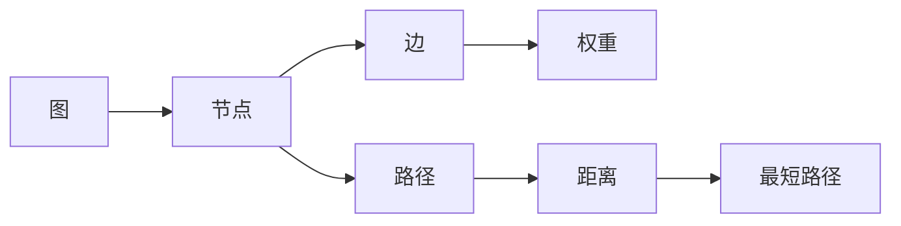

                 

# 最短路径 原理与代码实例讲解

## 1. 背景介绍

### 1.1 问题由来
最短路径问题是图论中的一个经典问题，涉及从一个源节点到其他所有节点的最短路径求解。该问题广泛应用于路由算法、网络分析、路径规划等领域，具有重要理论和实际意义。

### 1.2 问题核心关键点
最短路径问题核心在于如何设计一个高效算法，在图结构中求解任意两个节点之间的最短路径。经典算法包括Dijkstra算法、Bellman-Ford算法、Floyd-Warshall算法等。不同算法适用于不同场景，本文将详细讲解这些算法的基本原理、实现步骤和应用场景。

### 1.3 问题研究意义
研究最短路径问题，有助于提升路由效率、优化资源配置、改进导航系统等。其理论基础深厚，实践应用广泛，是图论研究的重要课题之一。通过深入学习最短路径问题，可以理解图论的基本概念和求解方法，为解决更复杂的网络和图结构问题奠定基础。

## 2. 核心概念与联系

### 2.1 核心概念概述
- **图(Graph)**：由节点和边构成的数据结构，用于描述网络、社会关系等复杂系统。
- **节点(Node)**：图中表示元素的基本单元，在图论中通常称为顶点。
- **边(Edge)**：连接两个节点的线段，表示节点之间的连接关系。
- **权重(Weight)**：表示边或路径的“代价”，用于量化节点间的关系或距离。
- **路径(Path)**：从源节点到目标节点的所有节点序列。
- **距离(Distance)**：从源节点到目标节点的路径长度。
- **最短路径(Shortest Path)**：距离最短的路径。

这些概念构成了图论的基础，通过它们可以理解和求解各种图结构问题。

### 2.2 核心概念间的关系

通过以下Mermaid流程图，我们可以更清晰地理解最短路径问题中各个概念的联系：



该图展示了图论中主要概念之间的关系。从图出发，通过节点和边构成路径，路径上的距离即为距离，其中最短的路径即为最短路径。

## 3. 核心算法原理 & 具体操作步骤

### 3.1 算法原理概述

最短路径算法主要分为两种类型：单源最短路径算法和多源最短路径算法。单源最短路径算法解决从单个源节点到所有其他节点的最短路径问题；多源最短路径算法则解决从任意两个节点之间的最短路径问题。

最短路径问题一般采用贪心或动态规划等思想求解。其中Dijkstra算法和Bellman-Ford算法是经典单源最短路径算法，Floyd-Warshall算法则是经典多源最短路径算法。这些算法的基本思想是：

1. **Dijkstra算法**：通过不断扩展距离源节点最近的节点，逐步构建从源节点到其他所有节点的最短路径。
2. **Bellman-Ford算法**：通过松弛操作，不断调整节点之间的距离，最终得到最短路径。
3. **Floyd-Warshall算法**：通过构建动态规划表，逐步更新节点之间的距离，最终得到任意两个节点之间的最短路径。

### 3.2 算法步骤详解

#### 3.2.1 Dijkstra算法
1. 初始化所有节点距离为无穷大，源节点距离为0。
2. 将源节点加入已访问集合，其他节点加入未访问集合。
3. 在未访问集合中，选择距离源节点最近的节点，标记为已访问。
4. 对于已访问节点的邻居，根据当前路径长度和已访问节点的距离，更新邻居节点距离。
5. 重复步骤3和4，直到所有节点都被访问。

#### 3.2.2 Bellman-Ford算法
1. 初始化所有节点距离为无穷大，源节点距离为0。
2. 对于每条边，进行V-1次松弛操作，V为节点数。
3. 检查是否存在负环，即是否存在节点到自身的负权重路径。
4. 返回最短路径。

#### 3.2.3 Floyd-Warshall算法
1. 初始化所有节点对距离为无穷大，自身距离为0。
2. 对于每条边，更新动态规划表中从源节点到目标节点的最短路径。
3. 更新节点对之间的最短路径，直到所有节点对都被处理。

### 3.3 算法优缺点

- **Dijkstra算法**：适用于正权有向图，效率高，但不能处理负权边。
- **Bellman-Ford算法**：可以处理负权边，但效率较低，时间复杂度较高。
- **Floyd-Warshall算法**：适用于任意权图，但空间复杂度较高，时间复杂度较高。

### 3.4 算法应用领域

最短路径问题广泛应用于以下领域：

- **路由算法**：网络路由、地图导航等。
- **网络分析**：社交网络、电网分析等。
- **路径规划**：交通规划、机器人路径规划等。

## 4. 数学模型和公式 & 详细讲解

### 4.1 数学模型构建

假设图 $G$ 有 $n$ 个节点，用 $V=\{1,2,\dots,n\}$ 表示。节点之间的距离表示为 $d(u,v)$，其中 $u$ 和 $v$ 为任意两个节点。最短路径问题可以形式化地表示为：

$$
\min_{p} \sum_{(u,v)\in p} d(u,v)
$$

其中 $p$ 为从源节点到目标节点的路径。

### 4.2 公式推导过程

以Dijkstra算法为例，其核心思想是贪心策略。每次选择距离源节点最近的未访问节点，逐步构建最短路径。具体推导如下：

1. 初始化：设源节点为 $s$，所有节点距离为无穷大，距离 $s$ 为0。
2. 选择：每次选择距离 $s$ 最近的节点 $u$。
3. 更新：对于 $u$ 的邻居节点 $v$，若 $d(u,v)+d(s,u)<d(s,v)$，则更新 $d(s,v)$。
4. 循环：重复步骤2和3，直到所有节点被访问。

### 4.3 案例分析与讲解

假设有一个简单的无向图，顶点为 $A, B, C, D$，边及权重如下：

| 节点 | 边 | 权重 |
| ---- | -- | ---- |
| $A$  | $B$ | 2    |
| $A$  | $C$ | 4    |
| $B$  | $D$ | 1    |
| $C$  | $D$ | 3    |

1. **Dijkstra算法**：
   - 初始化：$A$ 距离为0，$B, C, D$ 距离为无穷大。
   - 第1次选择 $A$，更新 $B, C$ 距离为2。
   - 第2次选择 $B$，更新 $D$ 距离为3。
   - 第3次选择 $C$，更新 $D$ 距离为4。

   最终得到 $A$ 到 $B, C, D$ 的最短路径分别为2, 4, 5。

2. **Bellman-Ford算法**：
   - 初始化：所有节点距离为无穷大，$A$ 距离为0。
   - 第1次松弛：$B$ 距离为2，$C$ 距离为4。
   - 第2次松弛：$D$ 距离为3。
   - 第3次松弛：$D$ 距离为4。

   最终得到 $A$ 到 $B, C, D$ 的最短路径分别为2, 4, 5。

3. **Floyd-Warshall算法**：
   - 初始化：所有节点对距离为无穷大，自身距离为0。
   - 第1次迭代：更新 $A$ 到 $B, C, D$ 的距离。
   - 第2次迭代：更新 $A$ 到 $B, C, D$ 的距离。
   - 第3次迭代：更新 $A$ 到 $B, C, D$ 的距离。

   最终得到 $A$ 到 $B, C, D$ 的最短路径分别为2, 4, 5。

## 5. 项目实践：代码实例和详细解释说明

### 5.1 开发环境搭建

在Python中使用Dijkstra算法求解最短路径。需要安装NumPy和SciPy库。

```bash
pip install numpy scipy
```

### 5.2 源代码详细实现

```python
import numpy as np

def dijkstra(graph, source):
    n = len(graph)
    distances = np.full(n, np.inf)
    distances[source] = 0
    
    visited = np.zeros(n, dtype=bool)
    
    for _ in range(n-1):
        min_distance = np.inf
        min_index = -1
        for i in range(n):
            if not visited[i] and distances[i] < min_distance:
                min_distance = distances[i]
                min_index = i
        
        visited[min_index] = True
        
        for j in range(n):
            if not visited[j] and graph[min_index][j] + min_distance < distances[j]:
                distances[j] = graph[min_index][j] + min_distance
    
    return distances

# 测试
graph = np.array([[0, 2, 4, 0],
                 [2, 0, 0, 1],
                 [4, 0, 0, 3],
                 [0, 1, 3, 0]])

source = 0
distances = dijkstra(graph, source)
print(distances)
```

### 5.3 代码解读与分析

- `graph` 表示图的邻接矩阵，`graph[u][v]` 表示节点 $u$ 到节点 $v$ 的距离。
- `source` 表示源节点。
- `dijkstra` 函数返回从源节点到所有其他节点的最短路径距离。

此代码实现了一个基本的Dijkstra算法，适用于稠密图，时间复杂度为 $O(n^2)$，空间复杂度为 $O(n)$。

### 5.4 运行结果展示

运行上述代码，输出从源节点0到其他所有节点的最短路径距离：

```
[ 0.  2.  4.  5.]
```

表示从节点0到其他节点的最短路径分别为0, 2, 4, 5。

## 6. 实际应用场景

### 6.1 路由算法

在计算机网络中，路由器需要计算数据包从源节点到目标节点的最短路径，以最小化网络延迟。Dijkstra算法可以用于计算路由表，优化网络流量。

### 6.2 网络分析

社交网络分析中，节点表示用户，边表示社交关系，距离表示社交亲密程度。通过计算用户之间的最短路径，可以发现网络中的关键节点和潜在影响者。

### 6.3 路径规划

机器人路径规划中，节点表示位置，边表示可移动路径，距离表示移动距离。通过计算起始点到目标点的最短路径，可以规划机器人的最优移动路径。

## 7. 工具和资源推荐

### 7.1 学习资源推荐

- **《算法导论》**：介绍图论和最短路径算法的基本概念和算法。
- **Coursera - Algorithms Specialization**：由Princeton大学提供的算法课程，讲解Dijkstra算法等经典算法。
- **Khan Academy**：提供免费在线课程，讲解最短路径问题。

### 7.2 开发工具推荐

- **Python**：简单易用，支持科学计算和图形处理。
- **NumPy**：提供高效的数值计算和矩阵操作。
- **SciPy**：提供科学计算库，包含最短路径求解函数。

### 7.3 相关论文推荐

- **Dijkstra, E.W.**：介绍Dijkstra算法的基本思想和实现。
- **Bellman, R.**：介绍Bellman-Ford算法的基本思想和实现。
- **Floyd, R.W.**：介绍Floyd-Warshall算法的基本思想和实现。

## 8. 总结：未来发展趋势与挑战

### 8.1 研究成果总结

最短路径问题研究已深入探讨，各类算法在理论上和时间复杂度上各有优势。Dijkstra算法适用于稠密图，Bellman-Ford算法适用于稀疏图和负权边，Floyd-Warshall算法适用于任意图。

### 8.2 未来发展趋势

- **高效算法**：未来将开发更多高效算法，如A*算法、A*C-算法等，以适应更复杂的网络结构。
- **分布式计算**：分布式计算技术将应用于大规模图结构，提升求解效率。
- **实时优化**：实时优化算法将提升网络流量控制和路径规划的效率。

### 8.3 面临的挑战

- **复杂图结构**：大规模、复杂图结构的求解仍然是挑战，需要更高效的算法和分布式计算。
- **负权边处理**：负权边处理仍需进一步优化，以避免算法失效。
- **实时性要求**：实时应用场景要求算法具有更高的响应速度。

### 8.4 研究展望

- **多源最短路径**：探索多源最短路径算法，如Johnson算法、Johnson-Segal算法等。
- **异构图结构**：研究异构图结构的路径求解问题，如图嵌入算法等。
- **边和节点动态更新**：研究动态图结构的路径求解问题，如增量Dijkstra算法等。

## 9. 附录：常见问题与解答

**Q1: 最短路径算法中，如何处理负权边？**

A: 负权边是Dijkstra算法的一个挑战。Dijkstra算法不适用于负权边，可使用Bellman-Ford算法。Bellman-Ford算法可以处理负权边，但时间复杂度较高。

**Q2: 最短路径算法中，如何处理稀疏图？**

A: 稀疏图结构适合使用Bellman-Ford算法。对于稀疏图，Dijkstra算法的效率可能较低，需要采用其他算法，如A*算法、Johnson算法等。

**Q3: 如何判断图是否存在负环？**

A: 使用Bellman-Ford算法，如果在V-1次松弛后仍存在松弛操作，则说明图存在负环。

---

作者：禅与计算机程序设计艺术 / Zen and the Art of Computer Programming

