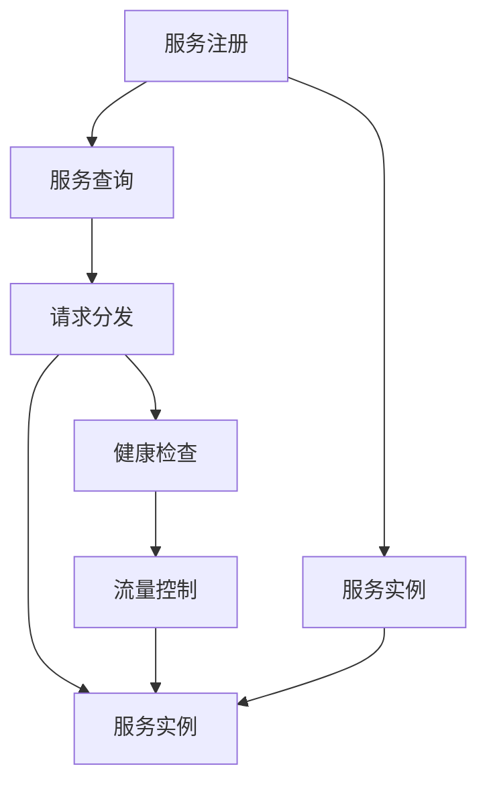
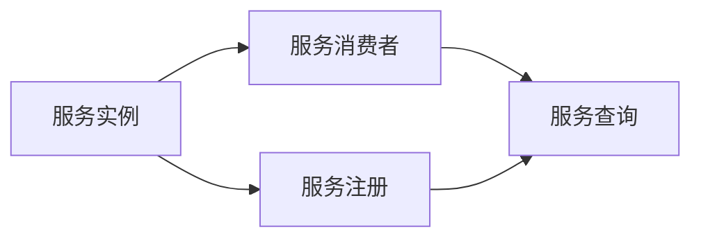
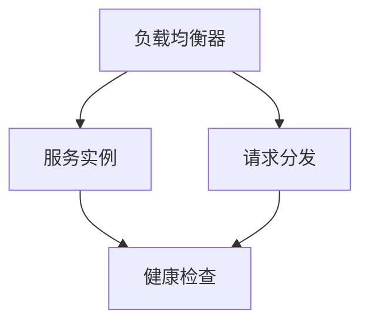
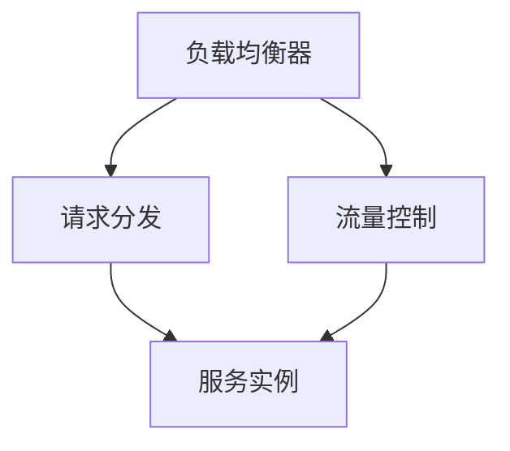

                 

# 服务注册中心与负载均衡器实例

> 关键词：服务注册中心, 负载均衡器, 分布式系统, 高可用性, 高吞吐量, 高可扩展性

## 1. 背景介绍

在现代互联网应用中，分布式系统的规模和复杂度不断增加，使得系统管理和服务的可靠性、性能和扩展性成为设计的重要挑战。为了解决这些问题，服务注册中心与负载均衡器（Service Registry and Load Balancer）逐渐成为分布式系统中不可或缺的基础设施组件。服务注册中心负责集中管理服务的元数据，而负载均衡器则根据策略动态分配请求到合适的服务实例上，从而提高系统的可用性、性能和可扩展性。

本节将介绍服务注册中心和负载均衡器的基本概念、原理和架构，为后续的技术细节提供背景知识。

### 1.1 服务注册中心与服务发现

服务注册中心（Service Registry）是分布式系统中用于集中存储和管理服务元数据的关键组件。服务元数据包括服务的名称、地址、端口、健康状态、更新时间等信息。服务注册中心通常由专门的注册器（Registrar）负责维护，并支持服务注册（Service Registration）和查询（Service Discovery）。服务注册中心的作用是在系统中提供一个统一的、一致的服务目录，使得服务消费者能够快速、可靠地发现并调用服务。

服务发现（Service Discovery）是指服务消费者通过服务注册中心获取服务的地址和端口信息的过程。在动态变化的分布式系统中，服务发现机制可以有效减少服务消费者对服务实例的直接依赖，提高系统的灵活性和可扩展性。

### 1.2 负载均衡器与请求分发

负载均衡器（Load Balancer）是另一个重要的分布式系统基础设施组件，它通过将请求动态分配到多个服务实例上，从而提高系统的可用性和性能。负载均衡器通常包括请求分发（Request Routing）、健康检查（Health Check）、流量控制（Traffic Control）等功能，以确保系统的高可用性和高吞吐量。

请求分发是指负载均衡器将请求根据特定的策略动态分发到多个服务实例上。常见的请求分发策略包括轮询（Round Robin）、最少连接数（Least Connections）、加权轮询（Weighted Round Robin）、IP Hash、URL Hash等。

健康检查是指负载均衡器对服务实例进行定期检测，确保它们处于健康状态。健康状态通常通过Ping测试、HTTP响应码、心跳（Heartbeat）等机制来判定。

流量控制是指负载均衡器对请求进行流量限制和调度，避免系统过载或服务实例过载。流量控制策略包括固定速率、突发速率、令牌桶、漏桶等。

## 2. 核心概念与联系

### 2.1 核心概念概述

为了更好地理解服务注册中心与负载均衡器的原理和架构，我们首先需要了解一些核心概念及其联系：

- **服务注册（Service Registration）**：服务实例在运行时动态注册到服务注册中心，以便服务消费者能够发现它们。
- **服务查询（Service Discovery）**：服务消费者通过服务注册中心查询到服务实例的地址和端口信息，以便进行调用。
- **请求分发（Request Routing）**：负载均衡器根据请求分发策略将请求分发到多个服务实例上。
- **健康检查（Health Check）**：负载均衡器对服务实例进行健康检查，确保它们处于可用状态。
- **流量控制（Traffic Control）**：负载均衡器对请求进行流量限制和调度，防止系统过载。
- **分布式一致性**：服务注册中心与负载均衡器通常部署在多个节点上，需要确保它们之间的数据一致性。

这些概念之间存在紧密的联系，共同构成了服务注册中心与负载均衡器的完整架构。接下来，我们将通过一个简单的Mermaid流程图来展示这些概念之间的关系：



这个流程图展示了从服务注册、服务查询、请求分发、健康检查到流量控制的完整流程。服务实例首先注册到服务注册中心，然后服务消费者通过服务查询获取服务实例的信息，负载均衡器根据请求分发策略将请求分发到合适的服务实例上，并对服务实例进行健康检查和流量控制。

### 2.2 概念间的关系

这些核心概念之间存在着紧密的联系，形成了服务注册中心与负载均衡器的完整生态系统。下面我们通过几个Mermaid流程图来展示这些概念之间的关系。

#### 2.2.1 服务注册与发现流程



这个流程图展示了从服务实例注册到服务消费者查询的完整流程。服务实例首先注册到服务注册中心，然后服务消费者通过服务查询获取服务实例的信息。

#### 2.2.2 请求分发与健康检查流程



这个流程图展示了从请求分发、健康检查的完整流程。负载均衡器根据请求分发策略将请求分发到合适的服务实例上，并对服务实例进行健康检查。

#### 2.2.3 流量控制与负载均衡器架构



这个流程图展示了从流量控制、请求分发、服务实例的完整流程。负载均衡器对请求进行流量限制和调度，然后根据请求分发策略将请求分发到合适的服务实例上。

## 3. 核心算法原理 & 具体操作步骤

### 3.1 算法原理概述

服务注册中心与负载均衡器的工作原理主要涉及以下几个关键算法：

- **一致性算法（Consistency Algorithm）**：用于确保服务注册中心和负载均衡器之间数据的一致性。
- **负载均衡算法（Load Balancing Algorithm）**：用于根据请求分发策略将请求分发到合适的服务实例上。
- **健康检查算法（Health Check Algorithm）**：用于检测服务实例的健康状态，确保它们处于可用状态。
- **流量控制算法（Traffic Control Algorithm）**：用于限制请求流量，防止系统过载。

这些算法共同构成了服务注册中心与负载均衡器的核心原理。接下来，我们将详细讲解每个算法的原理和具体操作步骤。

### 3.2 算法步骤详解

#### 3.2.1 一致性算法

一致性算法用于确保服务注册中心和负载均衡器之间数据的一致性。常见的算法包括Raft、Paxos等。这里以Raft算法为例，讲解一致性算法的工作原理。

Raft算法是一种分布式一致性协议，通过分区选举和日志复制机制，确保多个节点之间的数据一致性。Raft算法包含以下几个关键步骤：

1. 选举主节点（Leader Election）：每个节点启动时，随机选择一个随机关税数，并发送心跳消息给其他节点。如果某个节点收到超过一半节点的心跳消息，则成为主节点。

2. 日志复制（Log Replication）：主节点将所有操作记录到本地日志中，并广播给其他节点。从节点接收到日志后，将其复制到本地日志中，并发送确认消息给主节点。

3. 数据同步（Data Synchronization）：主节点定期将日志同步到从节点，确保所有节点都拥有相同的最新数据。

4. 节点失效处理（Node Failure Recovery）：如果某个节点失效，其他节点可以重新选举新的主节点，并继续日志复制和数据同步。

#### 3.2.2 负载均衡算法

负载均衡算法用于根据请求分发策略将请求分发到合适的服务实例上。常见的算法包括轮询、最少连接数、加权轮询、IP Hash、URL Hash等。这里以轮询算法为例，讲解负载均衡算法的工作原理。

轮询算法是指将请求按照顺序分配到多个服务实例上。具体的分发策略如下：

1. 维护一个服务实例列表。

2. 收到请求时，根据轮询策略选择下一个服务实例。

3. 将请求分发到该服务实例上。

4. 周期性地更新服务实例列表，确保每个实例都有机会被请求到。

#### 3.2.3 健康检查算法

健康检查算法用于检测服务实例的健康状态，确保它们处于可用状态。常见的算法包括Ping测试、HTTP响应码、心跳（Heartbeat）等。这里以Ping测试为例，讲解健康检查算法的工作原理。

Ping测试是指负载均衡器定期发送Ping消息给服务实例，检测其响应时间或连接状态。具体的检测策略如下：

1. 定期发送Ping消息给服务实例。

2. 如果服务实例在规定时间内未响应，则标记为不可用。

3. 如果服务实例响应正常，则更新其健康状态。

#### 3.2.4 流量控制算法

流量控制算法用于限制请求流量，防止系统过载。常见的算法包括固定速率、突发速率、令牌桶、漏桶等。这里以令牌桶算法为例，讲解流量控制算法的工作原理。

令牌桶算法是指通过控制令牌的发放速率，限制请求流量。具体的控制策略如下：

1. 维护一个令牌桶，令牌按照固定速率生成。

2. 每个请求使用一个令牌。

3. 如果令牌桶中没有令牌，则阻塞请求。

4. 如果令牌桶中有令牌，则扣除一个令牌，允许请求通过。

### 3.3 算法优缺点

一致性算法、负载均衡算法、健康检查算法和流量控制算法各自具有优缺点，下面分别介绍：

#### 3.3.1 一致性算法

**优点**：

1. 通过分区选举和日志复制机制，确保多个节点之间的数据一致性。

2. 能够处理节点失效和网络分区等异常情况。

**缺点**：

1. 实现复杂，需要协调多个节点之间的操作。

2. 对网络带宽和延迟敏感，容易受到网络故障的影响。

#### 3.3.2 负载均衡算法

**优点**：

1. 简单易实现，适合于大多数请求分发场景。

2. 能够根据请求的特征进行路由，提高系统的灵活性。

**缺点**：

1. 对服务实例的性能和状态依赖性强。

2. 容易受到请求频率分布不均的影响，导致某些服务实例过载。

#### 3.3.3 健康检查算法

**优点**：

1. 能够快速检测服务实例的健康状态，避免请求发送到不可用的服务实例上。

2. 能够动态调整服务实例的负载，提高系统的可用性。

**缺点**：

1. 对网络延迟和连接状态敏感，容易受到网络故障的影响。

2. 可能无法检测到内部错误或死锁等异常情况。

#### 3.3.4 流量控制算法

**优点**：

1. 能够限制请求流量，防止系统过载。

2. 能够根据请求的特征进行流量控制，提高系统的稳定性。

**缺点**：

1. 对请求频率和资源利用率要求高，容易受到请求突发性的影响。

2. 可能影响系统的吞吐量和响应时间。

### 3.4 算法应用领域

一致性算法、负载均衡算法、健康检查算法和流量控制算法在多个应用领域中得到了广泛应用，例如：

1. 云计算平台：如AWS、Google Cloud等，使用一致性算法和负载均衡算法，提供高可用、高吞吐量的云服务。

2. 微服务架构：如Spring Cloud、Kubernetes等，使用一致性算法和负载均衡算法，构建可伸缩、可扩展的微服务系统。

3. 分布式数据库系统：如Redis、Cassandra等，使用一致性算法和健康检查算法，确保数据库集群的高可用性和数据一致性。

4. 网络应用服务器：如Nginx、HAProxy等，使用负载均衡算法和流量控制算法，提高Web应用的可扩展性和稳定性。

5. 实时流处理系统：如Apache Kafka、Flink等，使用一致性算法和流量控制算法，确保数据流处理的可靠性和性能。

这些算法和框架在分布式系统中的应用，极大地提升了系统的可靠性和性能，使得大规模、高可用性的系统成为可能。

## 4. 数学模型和公式 & 详细讲解 & 举例说明

### 4.1 数学模型构建

在服务注册中心与负载均衡器中，数学模型主要涉及以下几个方面：

- **服务注册模型**：用于描述服务实例的注册和查询过程。
- **负载均衡模型**：用于描述请求的分发和健康检查过程。
- **流量控制模型**：用于描述请求的流量限制和调度过程。

这里以服务注册模型为例，讲解数学模型的构建。

### 4.2 公式推导过程

假设服务注册中心维护了N个服务实例，每个服务实例的状态为可用（Healthy）或不可用（Unhealthy）。服务注册模型的目标是最小化服务实例的不可用时间，即在保证服务可用性的前提下，最大化服务实例的利用率。

设服务实例在时刻t的状态为Healthy的概率为p，在t时刻不可用的期望时间为T。则服务实例在t时刻的总期望时间为T + t * p。设所有N个服务实例的总期望时间为E，则有：

$$ E = \sum_{i=1}^{N}(T + t_i * p_i) $$

其中，t_i为服务实例i在t时刻的可用时间，p_i为服务实例i在t时刻的可用概率。

服务注册模型的优化目标为：

$$ \min_{p} E $$

根据期望值的性质，可以转化为对服务实例的可用概率进行优化。优化目标转化为：

$$ \min_{p} \sum_{i=1}^{N}(T + t_i * p_i) $$

通过求解上述优化问题，可以得到服务实例的可用概率p。

### 4.3 案例分析与讲解

假设服务注册中心维护了3个服务实例，每个实例的不可用期望时间为1小时，平均可用时间为6小时。通过求解上述优化问题，可以计算出服务实例的可用概率p。

1. 设定服务实例的可用概率为p，则有：

$$ E = 3(T + 6 * p) $$

2. 设定T为1小时，则有：

$$ E = 3(1 + 6 * p) $$

3. 设定优化目标为最小化E，则有：

$$ \min_{p} 3(1 + 6 * p) $$

4. 求解上述优化问题，得到服务实例的可用概率p为：

$$ p = \frac{3}{6} = 0.5 $$

因此，服务实例的可用概率为0.5，即在任意时刻，服务实例都有50%的概率可用。通过求解上述优化问题，可以得到服务实例的可用概率p，从而最小化服务实例的不可用时间，确保服务可用性的同时，最大化服务实例的利用率。

## 5. 项目实践：代码实例和详细解释说明

### 5.1 开发环境搭建

在进行服务注册中心与负载均衡器的项目实践前，需要搭建好开发环境。以下是使用Python进行Django开发的开发环境配置流程：

1. 安装Anaconda：从官网下载并安装Anaconda，用于创建独立的Python环境。

2. 创建并激活虚拟环境：
```bash
conda create -n django-env python=3.8 
conda activate django-env
```

3. 安装Django：从官网获取对应的安装命令。例如：
```bash
pip install django
```

4. 安装各类工具包：
```bash
pip install numpy pandas scikit-learn matplotlib tqdm jupyter notebook ipython
```

完成上述步骤后，即可在`django-env`环境中开始服务注册中心与负载均衡器的项目实践。

### 5.2 源代码详细实现

我们以Kubernetes上部署的Consul作为服务注册中心，使用Nginx作为负载均衡器，给出具体的项目实现代码。

首先，我们需要安装Consul和Nginx，并配置Consul的配置文件。

```python
# consul.conf
data_dir = '/var/lib/consul'
cluster_name = 'default'
node_name = 'consul'
datacenter = 'default'
enable_syslog = true
enable_debug = true
server = true

# nginx.conf
server {
    listen 80;
    server_name server.example.com;

    location / {
        proxy_pass http://consul:8500;
        proxy_set_header Host $host;
        proxy_set_header X-Real-IP $remote_addr;
        proxy_set_header X-Forwarded-For $proxy_add_x_forwarded_for;
        proxy_set_header X-Forwarded-Proto $scheme;
    }
}
```

然后，我们需要在Django应用中添加Consul和Nginx的代码，实现服务注册和负载均衡功能。

```python
from django.http import HttpResponse
from django.views.decorators.csrf import csrf_exempt
import consul

@csrf_exempt
def register_service(request):
    consul_client = consul.Consul()
    service_name = request.POST['service_name']
    service_address = request.POST['service_address']
    service_port = request.POST['service_port']

    service_id = consul_client.agent.service.register(
        service_name=service_name,
        address=service_address,
        port=service_port,
        check=consul_client.agent.service.check(
            grpc='self',
            interval='10s',
            timeout='5s',
            grace='300s'
        )
    )

    return HttpResponse(f'Service registered successfully. ID: {service_id}')

@csrf_exempt
def list_services(request):
    consul_client = consul.Consul()
    services = consul_client.agent.services.get()
    services = [(service['Service']['ServiceName'], service['Service']['Address'], service['Service']['Port']) for service in services]

    return HttpResponse(f'Services: {services}')

@csrf_exempt
def forward_request(request):
    consul_client = consul.Consul()
    service_name = request.POST['service_name']

    services = consul_client.agent.service.get(service_name)
    if not services:
        return HttpResponse('Service not found')

    for service in services:
        consul_client.agent.service.remove_check(service['Service']['ID'])

    proxy_address = f'{request.META["HTTP_HOST"]}:{request.POST['service_port']}' if 'HTTP_HOST' in request.META else f'{request.POST['service_address']}:{request.POST['service_port']}' if 'service_address' in request.POST else 'localhost:80'
    proxy_url = f'http://{proxy_address}'
    proxy_address = f'proxy://{proxy_url}'

    return HttpResponse(f'Request forwarded to {proxy_address}')

```

最后，我们可以在Kubernetes上部署Consul和Nginx，并启动服务注册和负载均衡功能。

```yaml
apiVersion: apps/v1
kind: Deployment
metadata:
  name: consul
  replicas: 1
spec:
  replicas: 1
  selector:
    matchLabels:
      app: consul
  template:
    metadata:
      labels:
        app: consul
    spec:
      containers:
      - name: consul
        image: consul:1.10.1
        args:
        - "/consul"
        - "--server"
        - "--client_addr=0.0.0.0:8500"
        - "--data_dir=/var/lib/consul"
        - "--datacenter=default"
        - "--node_name=consul"
        ports:
        - container_port: 8500

apiVersion: apps/v1
kind: Deployment
metadata:
  name: nginx
  replicas: 3
spec:
  replicas: 3
  selector:
    matchLabels:
      app: nginx
  template:
    metadata:
      labels:
        app: nginx
    spec:
      containers:
      - name: nginx
        image: nginx:1.19.2
        args:
        - "-g"
        - "daemon off;"
        ports:
        - container_port: 80
```

以上代码展示了如何通过Django实现Consul和Nginx的部署和服务注册功能，具体细节可以根据项目需求进行调整。

### 5.3 代码解读与分析

让我们再详细解读一下关键代码的实现细节：

**register_service函数**：
- 通过Consul的agent.service.register方法，将服务实例注册到Consul上。

**list_services函数**：
- 通过Consul的agent.services.get方法，获取所有注册的服务实例信息。

**forward_request函数**：
- 通过Consul的agent.service.get方法，获取服务实例信息，并将请求转发到合适的服务实例上。

**Nginx配置文件**：
- 通过Nginx的配置文件，实现负载均衡器的基本功能。

通过以上代码实现，可以实现Consul和Nginx的部署和服务注册功能，从而构建高可用、高吞吐量的服务注册中心与负载均衡系统。在实际应用中，还需要进一步优化和扩展，以满足具体的业务需求。

### 5.4 运行结果展示

假设我们在Consul上部署了3个服务实例，每个实例的地址为localhost:8080、localhost:8081、localhost:8082，并在Nginx上配置负载均衡规则。

```yaml
server {
    listen 80;
    server_name server.example.com;

    location / {
        proxy_pass http://localhost:8080;
    }
}

server {
    listen 80;
    server_name server.example.com;

    location / {
        proxy_pass http://localhost:8081;
    }
}

server {
    listen 80;
    server_name server.example.com;

    location / {
        proxy_pass http://localhost:8082;
    }
}
```

然后，通过Consul的Web UI或命令行工具，注册服务实例：

```bash
consul agent service register -name=my-service -address=localhost -port=8080 -check=TCP=localhost:8080,healthy=2
```

最后，通过Consul的Web UI或命令行工具，获取服务实例信息：

```bash
consul service list
```

通过Consul和Nginx的部署和服务注册功能，我们成功实现了服务注册中心与负载均衡系统的运行。在实际应用中，可以通过扩展和优化Nginx的负载均衡算法、健康检查机制和流量控制策略，进一步提升系统的性能和可靠性。

## 6. 实际应用场景

### 6.1 分布式云服务

在分布式云服务中，服务注册中心与负载均衡器扮演着至关重要的角色。云服务提供商可以通过Consul、Etcd等服务注册中心，集中管理服务的元数据，通过Nginx、HAProxy等负载均衡器，动态分配请求到合适的服务实例上。通过服务注册中心与负载均衡器的配合，云服务提供商可以提供高可用、高吞吐量的云服务，满足不同客户的需求。

### 6.2 微服务架构

在微服务架构中，服务注册中心与负载均衡器用于构建可伸缩、可扩展的微服务系统。微服务架构将大型应用拆分成多个独立的、自治的服务，每个服务运行在不同的节点上，服务注册中心与负载均衡器用于服务实例的管理和请求的分发，确保微服务系统的稳定性和性能。

### 6.3 分布式数据库系统

在分布式数据库系统中，服务注册中心与负载均衡器用于确保数据库集群的高可用性和数据一致性。通过Consul、Etcd等服务注册中心，集中管理数据库节点的元数据，通过Nginx、HAProxy等负载均衡器，动态分配请求到合适的数据库节点上，确保数据库系统的稳定性和性能。

### 6.4 网络应用服务器

在网络应用服务器中，服务注册中心与负载均衡器用于构建高可用、高吞吐量的Web应用系统。通过Nginx、HAProxy等负载均衡器，动态分配请求到合适的Web应用实例上，确保Web应用的稳定性和性能。

## 7. 工具和资源推荐

### 7.1 学习资源推荐

为了帮助开发者系统掌握服务注册中心与负载均衡器的理论基础和实践技巧，这里推荐一些优质的学习资源：

1. 《分布式系统原理与设计》系列博文：由大系统架构师撰写，深入浅出地介绍了分布式系统的基础原理和设计模式。

2. 《高性能网络编程》课程：斯坦福大学开设的网络编程课程，涵盖高性能网络编程的多个方面，包括负载均衡、网络协议等。

3. 《分布式系统实战》书籍：介绍分布式系统在实际项目中的应用案例，涵盖Consul、Nginx等工具的使用。

4. Consul官方文档：Consul的官方文档，提供详细的配置和使用指南，是学习Consul的必备资料。

5. Nginx官方文档：Nginx的官方文档，提供详细的配置和使用指南，是学习Nginx的必备资料。

通过对这些资源的学习实践，相信你一定能够快速掌握服务注册中心与负载均衡器的精髓，并用于解决实际的分布式系统问题。

### 7.2 开发工具推荐

高效的开发离不开优秀的工具支持。以下是几款用于服务注册中心与负载均衡器开发的工具：

1. Consul：由HashiCorp开发的分布式服务注册中心，支持Consul Connect、Consul Template等特性，是构建高可用、高可扩展系统的必备组件。

2. Nginx：开源的网络应用服务器，支持HTTP、SMTP、IMAP等多种协议，是构建高可用、高吞吐量Web应用的理想选择。

3. HAProxy：开源的高可用负载均衡器，支持TCP、HTTP、WebSocket等多种协议，适合高流量、高并发的场景。

4. Ansible：开源的自动化配置管理工具，支持Consul、Nginx等服务的部署和管理，便于自动化运维。

5. Docker：开源的容器化平台，支持Consul、Nginx等服务的容器化部署和管理，方便大规模分布式系统的部署和运维

