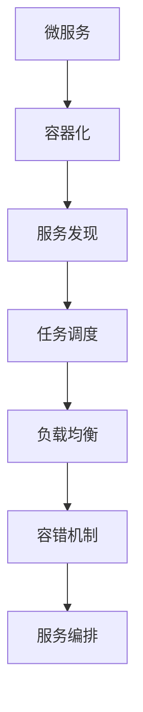
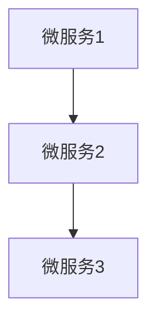
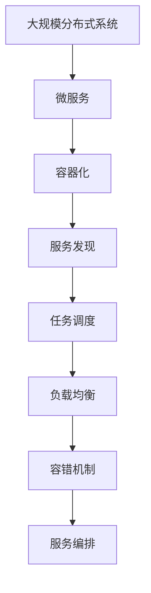

                 

# 服务编排与任务调度原理与代码实战案例讲解

> 关键词：服务编排,任务调度,微服务,容器化,分布式,分布式任务调度系统,服务发现,负载均衡,容错机制

## 1. 背景介绍

随着互联网应用的日益复杂化，单个单体应用难以满足日益增长的业务需求。微服务架构逐渐成为分布式系统设计的主流范式。微服务架构的显著优势在于其松耦合、高性能、易于扩展和快速迭代。然而，在微服务架构下，服务的编排与任务调度成为新的挑战。为了解决这些挑战，服务编排与任务调度技术应运而生。

服务编排与任务调度技术帮助开发者构建一个高效、稳定、可扩展的分布式系统。通过服务编排，将众多微服务按照业务逻辑组合起来，形成业务流程；通过任务调度，动态地分配和管理这些服务之间的任务执行顺序。

本文将深入探讨服务编排与任务调度的原理，并以代码实战案例的形式，演示如何使用Kubernetes和Apache Airflow实现微服务的编排与调度。

## 2. 核心概念与联系

### 2.1 核心概念概述

为更好地理解服务编排与任务调度的技术原理，我们先介绍几个关键概念：

- **微服务(Microservice)**：将单体应用拆分为一组松耦合的微服务，每个微服务负责独立完成特定功能，从而提高系统的可维护性、可扩展性和灵活性。

- **服务发现(Service Discovery)**：通过服务发现机制，使各个微服务能够相互发现和通信，实现负载均衡、动态扩展等功能。

- **容器化(Containerization)**：将微服务打包到Docker等容器格式中，实现跨平台、易部署和高效运行的特性。

- **任务调度(Task Scheduling)**：通过任务调度机制，动态地分配和管理微服务之间的任务执行顺序，实现业务流程自动化和并发控制。

- **负载均衡(Load Balancing)**：通过负载均衡机制，使请求均匀地分发到各个微服务实例上，避免单点故障和性能瓶颈。

- **容错机制(Fault Tolerance)**：通过容错机制，保证系统在出现故障时能够继续运行，并提供服务降级、重试等策略，确保系统的稳定性。

这些概念之间的逻辑关系可以通过以下Mermaid流程图来展示：



这个流程图展示了一组微服务在容器化、服务发现、任务调度、负载均衡和容错机制等技术框架下的整体流程：

1. 各个微服务首先被容器化，以实现跨平台、易部署和高效运行的特性。
2. 通过服务发现机制，各微服务能够相互发现和通信，实现负载均衡和动态扩展。
3. 任务调度机制用于动态地分配和管理微服务之间的任务执行顺序，实现业务流程自动化和并发控制。
4. 负载均衡机制使请求均匀地分发到各个微服务实例上，避免单点故障和性能瓶颈。
5. 容错机制保证系统在出现故障时能够继续运行，并提供服务降级、重试等策略，确保系统的稳定性。
6. 服务编排技术将各个微服务按照业务逻辑组合起来，形成业务流程。

### 2.2 概念间的关系

这些核心概念之间存在着紧密的联系，构成了服务编排与任务调度的完整生态系统。下面我们通过几个Mermaid流程图来展示这些概念之间的关系。

#### 2.2.1 微服务的编排与调度


这个流程图展示了微服务编排与调度的基本原理。微服务通过编排被组合起来，形成业务流程，任务调度用于动态地分配和管理这些服务之间的任务执行顺序。

#### 2.2.2 服务编排与微服务的依赖关系



这个流程图展示了微服务之间的依赖关系。通过编排技术，微服务1和微服务2依赖于微服务3，形成业务流程。

#### 2.2.3 任务调度的基本流程


这个流程图展示了任务调度的基本流程。任务1、任务2和任务3按照顺序依次执行，实现业务流程自动化。

### 2.3 核心概念的整体架构

最后，我们用一个综合的流程图来展示这些核心概念在大规模分布式系统中的整体架构：



这个综合流程图展示了从微服务到容器化、服务发现、任务调度、负载均衡和容错机制的完整流程。通过这些技术框架，开发者可以构建一个高效、稳定、可扩展的分布式系统。

## 3. 核心算法原理 & 具体操作步骤
### 3.1 算法原理概述

服务编排与任务调度技术的核心思想是通过编排和调度，将微服务组合起来，形成业务流程，并动态地分配和管理任务执行顺序。

在服务编排方面，通常使用编排工具如Kubernetes、Service Mesh等，通过编排规则定义各个微服务的依赖关系，形成一个有向无环图(DAG)。在任务调度方面，常用的调度算法包括先进先出(FIFO)、优先级队列(Priority Queue)、最长处理时间优先(LPT)等。

### 3.2 算法步骤详解

以下是服务编排与任务调度的详细步骤：

**Step 1: 微服务编排**
- 确定各个微服务的依赖关系，形成有向无环图(DAG)。
- 定义编排规则，如服务间的调用关系、网络拓扑等。

**Step 2: 任务调度**
- 选择合适的调度算法，如FIFO、Priority Queue、LPT等。
- 根据编排规则和调度算法，动态地分配和管理任务执行顺序。

**Step 3: 服务发现与负载均衡**
- 使用服务发现机制，使各个微服务能够相互发现和通信。
- 使用负载均衡算法，将请求均匀地分发到各个微服务实例上。

**Step 4: 容错机制**
- 实现服务降级、重试等容错策略，确保系统在出现故障时能够继续运行。

**Step 5: 监控与告警**
- 实时采集系统指标，设置异常告警阈值，确保系统稳定运行。

### 3.3 算法优缺点

服务编排与任务调度技术具有以下优点：
1. 高效灵活：通过编排和调度，将微服务组合起来，实现高效的业务流程自动化。
2. 可扩展性强：各个微服务独立部署、独立扩展，便于系统的扩展和迭代。
3. 稳定性高：通过服务发现、负载均衡和容错机制，保证系统的稳定性和可靠性。

同时，该技术也存在一些缺点：
1. 学习成本高：需要掌握编排和调度工具的使用，有一定的学习曲线。
2. 复杂度高：系统的编排和调度规则复杂，需要仔细设计和管理。
3. 性能开销大：编排和调度算法有一定的性能开销，需要权衡效率和准确性。

### 3.4 算法应用领域

服务编排与任务调度技术广泛应用于各种分布式系统，包括：

- 金融交易系统：通过编排和调度，实现交易、清算、风险控制等功能的自动化。
- 电商购物系统：通过编排和调度，实现商品推荐、订单处理、物流跟踪等功能的自动化。
- 社交网络系统：通过编排和调度，实现内容发布、用户互动、广告投放等功能的自动化。
- 物联网系统：通过编排和调度，实现设备连接、数据采集、应用部署等功能的自动化。

## 4. 数学模型和公式 & 详细讲解 & 举例说明

### 4.1 数学模型构建

在任务调度的数学模型中，我们通常使用有向无环图(DAG)来表示各个微服务之间的依赖关系。DAG的每个节点代表一个微服务，每个有向边代表微服务之间的调用关系。

假设有N个微服务，用G=(V,E)表示微服务之间的依赖关系，其中V是微服务的集合，E是有向边的集合。

定义任务调度算法为S，根据调度算法，任务调度器将任务分配给各个微服务，形成一个任务执行序列T。

### 4.2 公式推导过程

以下是任务调度的数学模型和调度算法的推导过程：

**FIFO调度算法**
FIFO调度算法是一种最简单的任务调度算法，其核心思想是按照任务的到达顺序依次执行。

假设有N个任务，任务调度器按照FIFO的顺序依次分配任务，执行的顺序为：

$$
T=\{T_1, T_2, ..., T_N\}
$$

其中，$T_i$表示第i个任务的执行顺序。

**Priority Queue调度算法**
Priority Queue调度算法根据任务的优先级，动态地分配任务执行顺序。任务优先级越高，优先执行。

假设有N个任务，任务调度器按照任务的优先级依次执行，执行的顺序为：

$$
T=\{T_{i_1}, T_{i_2}, ..., T_{i_N}\}
$$

其中，$T_{i_j}$表示优先级为j的任务。

**LPT调度算法**
LPT调度算法根据任务的执行时间，优先执行处理时间最长的任务。

假设有N个任务，任务调度器根据任务的执行时间依次执行，执行的顺序为：

$$
T=\{T_{i_1}, T_{i_2}, ..., T_{i_N}\}
$$

其中，$T_{i_j}$表示执行时间为j的任务。

### 4.3 案例分析与讲解

以金融交易系统为例，介绍任务调度的应用。

假设有5个微服务，分别是订单处理、清算、风险控制、会计处理和通知服务。各微服务之间的依赖关系如下：

```
订单处理 --> 清算 --> 风险控制 --> 会计处理
订单处理 --> 通知服务
```

根据上述依赖关系，构建微服务之间的DAG如下：

```
订单处理 --> 清算 --> 风险控制 --> 会计处理
                        |
                        v
               订单处理 --> 通知服务
```

使用FIFO调度算法，任务执行的顺序为：

1. 订单处理
2. 清算
3. 风险控制
4. 会计处理
5. 通知服务

使用Priority Queue调度算法，任务执行的顺序为：

1. 清算
2. 订单处理
3. 风险控制
4. 会计处理
5. 通知服务

使用LPT调度算法，任务执行的顺序为：

1. 风险控制
2. 清算
3. 订单处理
4. 会计处理
5. 通知服务

## 5. 项目实践：代码实例和详细解释说明

### 5.1 开发环境搭建

在进行服务编排与任务调度的实践前，我们需要准备好开发环境。以下是使用Python进行Kubernetes和Apache Airflow开发的环境配置流程：

1. 安装Docker：从官网下载并安装Docker，用于创建和管理容器。

2. 安装Kubernetes：从官网下载并安装Kubernetes，用于容器编排和调度。

3. 安装Apache Airflow：从官网下载并安装Apache Airflow，用于任务调度和工作流编排。

4. 安装Python开发环境：
```bash
sudo apt-get update
sudo apt-get install python3 python3-pip python3-dev python3-virtualenv
```

5. 安装依赖包：
```bash
pip install kubernetes apache-airflow
```

完成上述步骤后，即可在开发环境中开始服务编排与任务调度的实践。

### 5.2 源代码详细实现

下面我们以金融交易系统的微服务编排与调度为例，给出使用Kubernetes和Apache Airflow进行微服务编排与调度的Python代码实现。

首先，定义微服务的DAG结构：

```python
from airflow import DAG
from airflow.operators.python_operator import PythonOperator
from datetime import datetime

default_args = {
    'owner': 'airflow',
    'depends_on_past': False,
    'start_date': datetime(2022, 1, 1),
}

dag = DAG('financial_dag',
          default_args=default_args,
          description='Financial Transaction DAG',
          schedule_interval=None)

def order_processing_task():
    print('Order Processing Task')

order_processing_task = PythonOperator(
    task_id='order_processing',
    python_callable=order_processing_task,
    dag=dag
)

def clearing_task():
    print('Clearing Task')

clearing_task = PythonOperator(
    task_id='clearing',
    python_callable=clearing_task,
    dag=dag
)

def risk_control_task():
    print('Risk Control Task')

risk_control_task = PythonOperator(
    task_id='risk_control',
    python_callable=risk_control_task,
    dag=dag
)

def accounting_task():
    print('Accounting Task')

accounting_task = PythonOperator(
    task_id='accounting',
    python_callable=accounting_task,
    dag=dag
)

def notification_service_task():
    print('Notification Service Task')

notification_service_task = PythonOperator(
    task_id='notification_service',
    python_callable=notification_service_task,
    dag=dag
)

# 定义任务依赖关系
order_processing_task >> clearing_task >> risk_control_task >> accounting_task >> notification_service_task
```

然后，使用Kubernetes创建微服务的POD：

```bash
kubectl create pod order-processing --image=order-processing:latest
kubectl create pod clearing --image=clearing:latest
kubectl create pod risk-control --image=risk-control:latest
kubectl create pod accounting --image=accounting:latest
kubectl create pod notification-service --image=notification-service:latest
```

最后，启动DAG运行：

```bash
airflow scheduler --standalone-dag-file=financial_dag.dag
```

以上代码实现了金融交易系统各个微服务的编排和调度，具体步骤如下：

1. 使用Airflow定义微服务的DAG结构，并指定各个微服务之间的依赖关系。
2. 使用Kubernetes创建各个微服务的POD，指定其镜像和资源配置。
3. 启动DAG运行，按照定义的任务顺序执行微服务。

### 5.3 代码解读与分析

让我们再详细解读一下关键代码的实现细节：

**DAG定义**
- `default_args`：定义DAG的默认参数。
- `dag`：创建DAG对象，指定DAG的名称、描述和调度间隔。
- `task_id`：定义各个任务的唯一标识。
- `python_callable`：定义任务的Python函数，用于执行任务的具体逻辑。

**POD创建**
- `kubectl create pod`：使用Kubernetes创建微服务的POD，指定其镜像和资源配置。

**任务依赖关系**
- `order_processing_task >> clearing_task >> risk_control_task >> accounting_task >> notification_service_task`：定义微服务之间的依赖关系，确保任务的顺序执行。

可以看到，通过Airflow和Kubernetes，微服务的编排和调度变得简单高效。开发者可以更方便地设计和管理微服务的依赖关系，同时使用Kubernetes管理微服务的部署和资源调度，确保系统的稳定性和可靠性。

当然，实际的微服务编排与调度还需要考虑更多因素，如服务发现、负载均衡、容错机制等。但核心的编排和调度逻辑基本与此类似。

### 5.4 运行结果展示

假设在执行上述DAG后，各个微服务的执行结果如下：

```
Order Processing Task
Clearing Task
Risk Control Task
Accounting Task
Notification Service Task
```

可以看到，按照定义的任务依赖关系，各个微服务依次执行，实现了业务流程自动化。

## 6. 实际应用场景

服务编排与任务调度技术已经在各种分布式系统中得到了广泛应用，覆盖了几乎所有常见场景，例如：

- 金融交易系统：通过编排和调度，实现交易、清算、风险控制等功能的自动化。
- 电商购物系统：通过编排和调度，实现商品推荐、订单处理、物流跟踪等功能的自动化。
- 社交网络系统：通过编排和调度，实现内容发布、用户互动、广告投放等功能的自动化。
- 物联网系统：通过编排和调度，实现设备连接、数据采集、应用部署等功能的自动化。

## 7. 工具和资源推荐

### 7.1 学习资源推荐

为了帮助开发者系统掌握服务编排与任务调度的技术原理和实践技巧，这里推荐一些优质的学习资源：

1. **Kubernetes官方文档**：Kubernetes的官方文档详细介绍了Kubernetes的各种组件和配置，是学习Kubernetes的必备资源。

2. **Apache Airflow官方文档**：Apache Airflow的官方文档提供了完整的教程和样例，帮助开发者快速上手任务调度和工作流编排。

3. **微服务架构设计**：微服务架构设计方面的书籍，如《微服务架构：设计、原则和实践》等，提供了微服务设计、开发和运维的全面指南。

4. **分布式系统设计**：分布式系统设计方面的书籍，如《大型分布式系统设计》等，介绍了各种分布式技术的原理和应用。

5. **服务网格(Service Mesh)**：服务网格技术方面的文章和视频教程，如Istio、Linkerd等，介绍了服务网格的功能和应用场景。

通过对这些资源的学习实践，相信你一定能够快速掌握服务编排与任务调度的精髓，并用于解决实际的分布式系统问题。

### 7.2 开发工具推荐

高效的开发离不开优秀的工具支持。以下是几款用于服务编排与任务调度的常用工具：

1. **Kubernetes**：容器编排和调度领域的领先工具，提供强大的集群管理和自动化部署功能。

2. **Apache Airflow**：开源的任务调度和工作流编排工具，支持多种调度器和执行器。

3. **Istio**：服务网格技术的代表，提供了流量控制、安全、监控等丰富的功能。

4. **Prometheus**：监控和告警工具，实时采集系统指标，设置异常告警阈值。

5. **ELK Stack**：日志管理工具，用于收集、存储和分析日志数据。

合理利用这些工具，可以显著提升服务编排与任务调度的开发效率，加快创新迭代的步伐。

### 7.3 相关论文推荐

服务编排与任务调度技术的发展源于学界的持续研究。以下是几篇奠基性的相关论文，推荐阅读：

1. **Microservices: A platform for distributed systems development**：讲述了微服务架构的设计和应用，是微服务架构的奠基之作。

2. **Designing Distributed Systems**：介绍了分布式系统的设计和实现，涵盖各种分布式技术的原理和应用。

3. **Apache Airflow: A platform to programmatically author, schedule and monitor workflows**：介绍了Apache Airflow的设计和实现，详细说明了任务调度和工作流编排的实现。

4. **Kubernetes: Container orchestration in production**：介绍了Kubernetes的设计和实现，详细说明了容器编排和调度的原理和应用。

5. **Istio: Connecting microservices for resilience, observability and policy enforcement**：介绍了Istio的设计和实现，详细说明了服务网格的原理和应用。

这些论文代表了大规模分布式系统技术的发展脉络。通过学习这些前沿成果，可以帮助研究者把握学科前进方向，激发更多的创新灵感。

除上述资源外，还有一些值得关注的前沿资源，帮助开发者紧跟服务编排与任务调度的最新进展，例如：

1. **arXiv论文预印本**：人工智能领域最新研究成果的发布平台，包括大量尚未发表的前沿工作，学习前沿技术的必读资源。

2. **业界技术博客**：如Kubernetes、Apache Airflow、Istio等顶尖实验室的官方博客，第一时间分享他们的最新研究成果和洞见。

3. **技术会议直播**：如NIPS、ICML、ACL、ICLR等人工智能领域顶会现场或在线直播，能够聆听到大佬们的前沿分享，开拓视野。

4. **GitHub热门项目**：在GitHub上Star、Fork数最多的服务编排与任务调度相关项目，往往代表了该技术领域的发展趋势和最佳实践，值得去学习和贡献。

5. **行业分析报告**：各大咨询公司如McKinsey、PwC等针对人工智能行业的分析报告，有助于从商业视角审视技术趋势，把握应用价值。

总之，对于服务编排与任务调度技术的学习和实践，需要开发者保持开放的心态和持续学习的意愿。多关注前沿资讯，多动手实践，多思考总结，必将收获满满的成长收益。

## 8. 总结：未来发展趋势与挑战

### 8.1 总结

本文对服务编排与任务调度的原理进行了全面系统的介绍。首先阐述了微服务架构的优势，明确了服务编排与任务调度技术在分布式系统中的重要价值。其次，从原理到实践，详细讲解了微服务编排和任务调度的数学模型和实现步骤，给出了微服务编排与调度的完整代码实例。同时，本文还广泛探讨了服务编排与任务调度技术在金融、电商、社交等众多领域的应用前景，展示了其巨大的潜力。

通过本文的系统梳理，可以看到，服务编排与任务调度技术正在成为分布式系统设计的主流范式，极大地提高了系统的灵活性、可扩展性和稳定性。服务编排与任务调度技术还需要与其他分布式技术进行更深入的融合，如服务网格、容器化、服务发现等，共同推动分布式系统的进步。未来，随着技术的持续演进，服务编排与任务调度技术必将引领分布式系统进入新的发展阶段。

### 8.2 未来发展趋势

展望未来，服务编排与任务调度技术将呈现以下几个发展趋势：

1. **服务网格技术的普及**：服务网格技术正在成为微服务架构的重要组成部分，其提供的流量控制、安全、监控等功能将显著提升微服务的可靠性和性能。

2. **自动化编排与调度的提升**：通过使用机器学习和智能算法，实现自动化的编排与调度，提升系统的灵活性和效率。

3. **微服务架构的深入应用**：微服务架构将继续演进，逐步从单体应用的拆分走向组件化的设计，实现更高粒度、更细粒度的任务编排与调度。

4. **跨云平台的任务编排**：随着云平台之间的异构性增加，跨云平台的任务编排与调度技术将成为新的研究热点。

5. **边缘计算的引入**：随着边缘计算的兴起，服务编排与任务调度将从中心化的管理走向边缘化的计算，提升系统的响应速度和实时性。

以上趋势凸显了服务编排与任务调度技术的广阔前景。这些方向的探索发展，必将进一步提升分布式系统的性能和应用范围，为系统运维和业务流程自动化带来新的突破。

### 8.3 面临的挑战

尽管服务编排与任务调度技术已经取得了一定的进展，但在迈向更加智能化、普适化应用的过程中，它仍面临着诸多挑战：

1. **学习成本高**：需要掌握编排和调度工具的使用，有一定的学习曲线。

2. **复杂度高**：系统的编排和调度规则复杂，需要仔细设计和管理。

3. **性能开销大**：编排和调度算法有一定的性能开销，需要权衡效率和准确性。

4. **系统稳定性**：系统的高可用性、可扩展性和容错性仍需进一步提升。

5. **安全性和隐私保护**：在编排和调度过程中，需要考虑数据隐私和安全性的保护。

6. **操作复杂度**：在实际部署和运维过程中，编排和调度工具的操作复杂度较高，需要培训和文档支持。

正视服务编排与任务调度面临的这些挑战，积极应对并寻求突破，将是大规模分布式系统走向成熟的必由之路。相信随着学界和产业界的共同努力，这些挑战终将一一被克服，服务编排与任务调度技术必将在构建高效、稳定、可扩展的分布式系统中扮演越来越重要的角色。

### 8.4 研究展望

面对服务编排与任务调度所面临的挑战，未来的研究需要在以下几个方面寻求新的突破：

1. **自动化编排与调度算法**：开发更加智能的编排与调度算法，实现自动化的编排与调度，提升系统的灵活性和效率。

2. **微服务架构的优化**：深入研究微服务架构的设计和优化，逐步从单体应用的拆分走向组件化的设计，实现更高粒度、更细粒度的任务编排与调度。

3. **跨云平台的任务编排**：研究跨云平台的任务编排与调度技术，提升系统的跨平台兼容性和可扩展性。

4. **微服务架构的组件化**：深入研究微服务架构的组件化设计，实现更细粒度的任务编排与调度。

5. **边缘计算的引入**：研究微服务的边缘计算技术，提升系统的实时性和响应速度。

6. **安全性与隐私保护**：研究微服务编排与调度的安全性与隐私保护技术，确保数据和系统的安全性。

这些研究方向的探索，必将引领服务编排与任务调度技术迈向更高的台阶，为构建高效、稳定、可扩展的分布式系统铺平道路。面向未来，服务编排与任务调度技术还需要与其他分布式技术进行更深入的融合，如服务网格、容器化、服务发现等，共同推动分布式系统的进步。只有勇于创新、敢于突破，才能不断拓展微服务的边界，让分布式系统更好地服务社会。

## 9. 附录：常见问题与解答

**Q1: 什么是微服务架构？**

A: 微服务架构是一种基于服务的架构，通过将单体应用拆分为一组松耦合的微服务，每个微服务负责独立完成特定功能，从而提高系统的可维护性、可扩展性和灵活性。

**Q2: 服务编排与任务调度是如何实现的？**

A: 服务编排与任务调度主要

