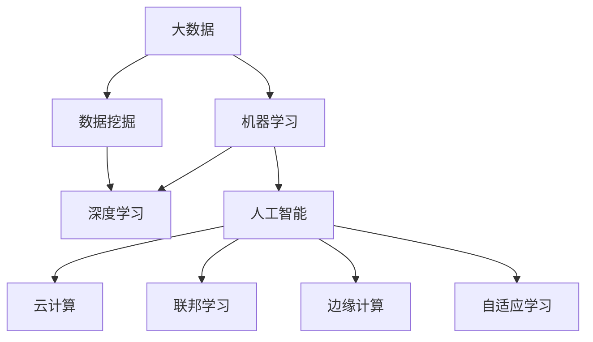
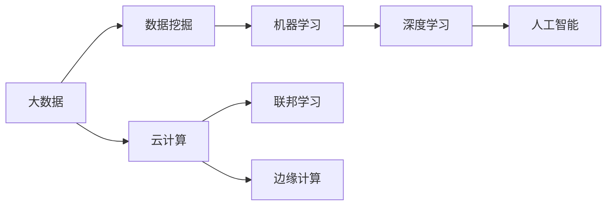
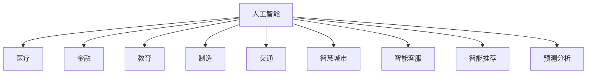
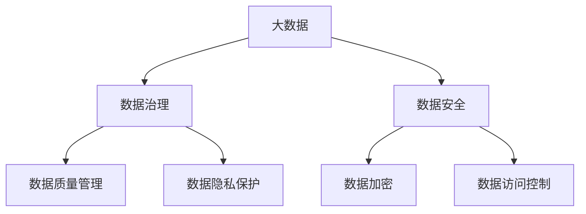
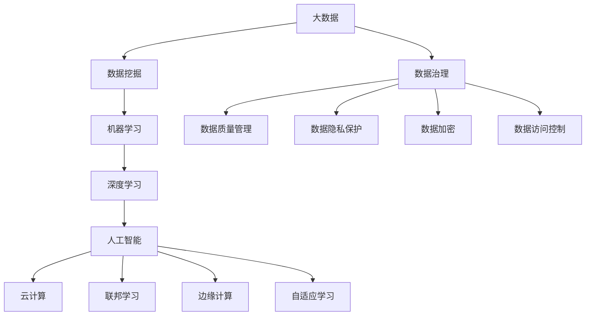

                 

## 1. 背景介绍

### 1.1 问题由来

随着信息技术的飞速发展，大数据与人工智能(AI)技术逐渐成为驱动各行各业创新的重要力量。大数据提供了海量的数据资源，为AI模型提供了丰富的训练素材。而AI技术的突破，尤其是深度学习和机器学习的发展，又为大数据的分析和利用提供了强有力的技术支持。两者相辅相成，共同推动了数字化时代的到来。

大数据与AI技术的融合，为医疗、金融、教育、制造、交通等多个领域带来了深刻变革。例如，在医疗领域，通过大数据分析，医生可以更精准地诊断疾病，预测疾病发展趋势；在金融领域，AI技术可以实时监测市场风险，预测股市波动；在教育领域，个性化推荐系统可以提升学习效率，辅助教师教学；在制造领域，智能监控和预测性维护可以提升生产效率，减少停机时间；在交通领域，智能交通系统可以提高道路通行效率，减少事故发生率。

### 1.2 问题核心关键点

大数据与AI技术融合的核心关键点在于数据和算法的结合。大数据提供了数据，AI技术则通过算法对这些数据进行分析和建模。具体而言，AI模型通过学习大数据中的模式和规律，生成预测、分类、聚类等结果，从而辅助决策和预测。

在大数据与AI融合的过程中，需要解决以下核心问题：
1. **数据质量与数据治理**：如何从海量数据中提取有用信息，并进行清洗、标注、归一化等预处理，是实现高质量AI模型的基础。
2. **算法选择与优化**：如何选择适合的算法模型，以及如何优化模型参数和结构，使得模型在特定任务上达到最佳性能。
3. **计算资源管理**：如何在有限的计算资源下，高效地训练和部署AI模型，以及如何应对大数据带来的计算挑战。
4. **模型解释与透明性**：如何理解AI模型的决策过程，以及如何在实际应用中提供透明的解释，增强信任度。

### 1.3 问题研究意义

大数据与AI技术的融合，为各行各业带来了巨大的商业价值和创新机会。通过对大数据的分析和建模，企业能够更好地理解客户需求，优化产品设计，提升运营效率，从而在竞争中占据优势。同时，AI技术的应用还能够带来新的业务模式和增长点，如智能客服、金融风险预测、个性化推荐等。

此外，大数据与AI技术的融合也带来了对社会治理和公共服务的影响。通过大数据和AI技术，政府可以更高效地管理城市运行，提供智能交通、环境监测、公共安全等服务，提升社会治理水平。

## 2. 核心概念与联系

### 2.1 核心概念概述

为更好地理解大数据与AI技术的融合应用，本节将介绍几个密切相关的核心概念：

- **大数据(Big Data)**：指超大规模、高速增长、多样化的数据集合，通常用于分析、挖掘、建模等。
- **人工智能(Artificial Intelligence, AI)**：指通过算法和计算手段，使机器具备类似于人类的感知、学习、推理和决策能力。
- **深度学习(Deep Learning)**：指一种基于多层神经网络的AI技术，能够处理复杂的非线性关系，用于图像识别、语音识别、自然语言处理等任务。
- **机器学习(Machine Learning)**：指通过数据训练模型，使模型能够从数据中学习规律，并进行预测、分类、聚类等任务。
- **数据挖掘(Data Mining)**：指从大数据中提取有用信息和知识的过程，通常包括数据预处理、特征提取、模型训练等步骤。
- **云计算(Cloud Computing)**：指通过互联网提供计算资源和服务，实现按需部署和弹性扩展。
- **联邦学习(Federated Learning)**：指多个本地设备或服务器在不共享数据的情况下，联合训练AI模型，保护数据隐私和安全性。
- **边缘计算(Edge Computing)**：指在数据产生源（如传感器、终端设备）进行数据处理和分析，减少数据传输和存储负担。
- **自适应学习(Adaptive Learning)**：指根据环境变化和反馈，动态调整学习策略，提升模型性能和适应性。

这些核心概念之间的逻辑关系可以通过以下Mermaid流程图来展示：



这个流程图展示了大数据与AI技术的核心概念及其之间的关系：

1. 大数据提供原始数据，数据挖掘对数据进行处理和特征提取，机器学习和深度学习基于处理后的数据进行模型训练，最终使AI技术得以实现。
2. 云计算、联邦学习和边缘计算等技术，提供了分布式计算和存储能力，支撑了大数据和AI技术的部署和应用。
3. 自适应学习则进一步提升了AI模型的灵活性和适应性，使得模型能够更好地应对复杂多变的环境。

### 2.2 概念间的关系

这些核心概念之间存在着紧密的联系，形成了大数据与AI技术的完整生态系统。下面我通过几个Mermaid流程图来展示这些概念之间的关系。

#### 2.2.1 大数据与AI技术的融合范式



这个流程图展示了大数据与AI技术的融合范式：通过数据挖掘对大数据进行处理和特征提取，然后基于处理后的数据进行机器学习和深度学习，最终实现人工智能技术。云计算、联邦学习和边缘计算等技术，提供了分布式计算和存储能力，支撑了这一融合过程。

#### 2.2.2 人工智能技术的应用领域



这个流程图展示了人工智能技术在各个领域的应用场景，包括医疗、金融、教育、制造、交通、智慧城市、智能客服、智能推荐、预测分析等。

#### 2.2.3 数据治理与大数据安全



这个流程图展示了数据治理与大数据安全的关键环节，包括数据质量管理、数据隐私保护、数据加密、数据访问控制等。

### 2.3 核心概念的整体架构

最后，我们用一个综合的流程图来展示这些核心概念在大数据与AI技术的整体架构：



这个综合流程图展示了从大数据的采集、处理、分析到AI技术的部署和应用的完整过程。大数据提供了原始数据，数据挖掘对数据进行处理和特征提取，机器学习和深度学习基于处理后的数据进行模型训练，最终使AI技术得以实现。云计算、联邦学习和边缘计算等技术，提供了分布式计算和存储能力，支撑了大数据和AI技术的部署和应用。数据治理与安全则确保了数据质量和安全。

## 3. 核心算法原理 & 具体操作步骤
### 3.1 算法原理概述

大数据与AI技术的融合应用，本质上是一个数据驱动的决策过程。其核心思想是通过算法和计算手段，从大数据中挖掘有用信息，并进行分析和建模，最终生成预测、分类、聚类等结果，辅助决策和预测。

形式化地，假设大数据集为 $D=\{x_i\}_{i=1}^N$，其中 $x_i$ 表示数据点。通过算法 $A$ 对大数据进行分析和建模，得到模型 $M$。假设模型 $M$ 在数据点 $x_i$ 上的预测结果为 $y_i=M(x_i)$，则大数据与AI技术融合的目标是最小化预测误差 $E(y_i, \hat{y}_i)$，即：

$$
\min_E \sum_{i=1}^N E(y_i, \hat{y}_i)
$$

其中 $E$ 表示误差函数，如均方误差、交叉熵等。

在实践中，我们通常使用基于梯度的优化算法（如SGD、Adam等）来近似求解上述最优化问题。设 $\eta$ 为学习率，$\lambda$ 为正则化系数，则参数的更新公式为：

$$
\theta \leftarrow \theta - \eta \nabla_{\theta}E(y_i, \hat{y}_i) - \eta\lambda\theta
$$

其中 $\nabla_{\theta}E(y_i, \hat{y}_i)$ 为误差函数对模型参数 $\theta$ 的梯度，可通过反向传播算法高效计算。

### 3.2 算法步骤详解

大数据与AI技术的融合应用一般包括以下几个关键步骤：

**Step 1: 数据预处理与特征工程**

- 收集和清洗原始数据，去除噪声和冗余。
- 进行特征提取和选择，提取数据中的有用特征，去除无关特征。
- 对数据进行归一化、标准化等预处理，使得数据适合模型训练。

**Step 2: 模型选择与设计**

- 根据任务类型和数据特点，选择合适的算法和模型结构。
- 设计模型架构，包括输入、隐藏层、输出层等。
- 确定超参数，如学习率、批大小、迭代轮数等。

**Step 3: 模型训练与优化**

- 将数据分为训练集、验证集和测试集。
- 使用基于梯度的优化算法进行模型训练。
- 周期性在验证集上评估模型性能，根据性能指标决定是否触发 Early Stopping。
- 重复上述步骤直到满足预设的迭代轮数或 Early Stopping 条件。

**Step 4: 模型评估与部署**

- 在测试集上评估模型性能，对比训练前后的精度提升。
- 使用模型对新数据进行预测，集成到实际的应用系统中。
- 持续收集新的数据，定期重新训练模型，以适应数据分布的变化。

以上是大数据与AI技术融合的一般流程。在实际应用中，还需要针对具体任务的特点，对预处理过程的各个环节进行优化设计，如改进数据增强方法，引入更多的正则化技术，搜索最优的超参数组合等，以进一步提升模型性能。

### 3.3 算法优缺点

大数据与AI技术的融合方法具有以下优点：
1. 数据驱动。通过大规模数据训练，模型能够学习到数据中的复杂规律，从而提升预测和分类能力。
2. 泛化能力强。基于大数据训练的模型通常具有较强的泛化能力，能够应对新数据和复杂环境。
3. 自动化程度高。自动化算法和计算过程，减少了人工干预和误差，提高了效率和精度。
4. 可扩展性好。分布式计算和存储能力，使得模型可以在大规模数据集上高效运行。

同时，该方法也存在一些局限性：
1. 数据隐私问题。大数据分析通常涉及大量敏感数据，如何保护数据隐私和安全性是一个重要问题。
2. 计算资源消耗大。大规模数据的存储和计算消耗大量资源，需要高性能计算设备支撑。
3. 模型复杂度高。深度学习模型通常结构复杂，训练和推理过程计算量大，资源占用高。
4. 解释性不足。深度学习模型作为"黑盒"系统，难以解释其内部工作机制和决策逻辑。

尽管存在这些局限性，但就目前而言，大数据与AI技术的融合方法仍然是数据驱动决策和智能化应用的重要手段。未来相关研究的重点在于如何进一步降低计算成本，提高模型解释性，保护数据隐私等。

### 3.4 算法应用领域

大数据与AI技术的融合方法在各行各业得到了广泛应用，覆盖了几乎所有常见任务，例如：

- 金融风控：通过分析交易数据、行为数据、信用记录等，预测信用风险和欺诈行为。
- 医疗诊断：利用医疗影像、电子病历、基因数据等，辅助医生诊断疾病，预测疾病发展趋势。
- 电子商务：通过分析用户浏览、购买、评价等行为数据，推荐商品和广告，提升用户体验。
- 智能制造：通过分析生产设备运行数据、产品质量数据、供应链数据等，优化生产流程，提高生产效率。
- 智能交通：通过分析交通流量、车辆位置、环境数据等，优化交通信号，提高通行效率，减少交通事故。
- 智慧城市：通过分析城市运行数据，优化城市管理，提供智能停车、智能安防、智能环保等服务。

除了上述这些经典任务外，大数据与AI技术的融合方法也被创新性地应用到更多场景中，如智能客服、推荐系统、个性化营销、医疗辅助决策等，为各行各业带来了新的技术突破和应用模式。

## 4. 数学模型和公式 & 详细讲解 & 举例说明

### 4.1 数学模型构建

本节将使用数学语言对大数据与AI技术的融合过程进行更加严格的刻画。

假设大数据集为 $D=\{x_i\}_{i=1}^N$，其中 $x_i$ 表示数据点。我们希望通过算法 $A$ 对大数据进行分析和建模，得到模型 $M$。假设模型 $M$ 在数据点 $x_i$ 上的预测结果为 $y_i=M(x_i)$，则大数据与AI技术融合的目标是最小化预测误差 $E(y_i, \hat{y}_i)$，即：

$$
\min_E \sum_{i=1}^N E(y_i, \hat{y}_i)
$$

其中 $E$ 表示误差函数，如均方误差、交叉熵等。

在实践中，我们通常使用基于梯度的优化算法（如SGD、Adam等）来近似求解上述最优化问题。设 $\eta$ 为学习率，$\lambda$ 为正则化系数，则参数的更新公式为：

$$
\theta \leftarrow \theta - \eta \nabla_{\theta}E(y_i, \hat{y}_i) - \eta\lambda\theta
$$

其中 $\nabla_{\theta}E(y_i, \hat{y}_i)$ 为误差函数对模型参数 $\theta$ 的梯度，可通过反向传播算法高效计算。

### 4.2 公式推导过程

以下我们以二分类任务为例，推导均方误差和交叉熵误差函数的梯度计算公式。

假设模型 $M_{\theta}$ 在输入 $x$ 上的输出为 $\hat{y}=M_{\theta}(x)$，表示样本属于正类的概率。真实标签 $y \in \{0,1\}$。则均方误差损失函数定义为：

$$
L_{MSE}(y, \hat{y}) = \frac{1}{N} \sum_{i=1}^N (y_i - \hat{y_i})^2
$$

将其代入经验风险公式，得：

$$
\mathcal{L}_{MSE}(\theta) = \frac{1}{N} \sum_{i=1}^N (y_i - M_{\theta}(x_i))^2
$$

根据链式法则，损失函数对参数 $\theta_k$ 的梯度为：

$$
\frac{\partial \mathcal{L}_{MSE}(\theta)}{\partial \theta_k} = -\frac{2}{N}\sum_{i=1}^N (\hat{y_i} - y_i) \frac{\partial \hat{y_i}}{\partial \theta_k}
$$

其中 $\frac{\partial \hat{y_i}}{\partial \theta_k}$ 可进一步递归展开，利用自动微分技术完成计算。

交叉熵损失函数的定义如下：

$$
L_{CE}(y, \hat{y}) = -\frac{1}{N} \sum_{i=1}^N y_i \log \hat{y_i} + (1-y_i) \log (1-\hat{y_i})
$$

将其代入经验风险公式，得：

$$
\mathcal{L}_{CE}(\theta) = -\frac{1}{N} \sum_{i=1}^N y_i \log M_{\theta}(x_i) + (1-y_i) \log (1-M_{\theta}(x_i))
$$

根据链式法则，损失函数对参数 $\theta_k$ 的梯度为：

$$
\frac{\partial \mathcal{L}_{CE}(\theta)}{\partial \theta_k} = -\frac{1}{N}\sum_{i=1}^N \frac{y_i}{M_{\theta}(x_i)} - \frac{1-y_i}{1-M_{\theta}(x_i)} \frac{\partial M_{\theta}(x_i)}{\partial \theta_k}
$$

其中 $\frac{\partial M_{\theta}(x_i)}{\partial \theta_k}$ 可进一步递归展开，利用自动微分技术完成计算。

在得到损失函数的梯度后，即可带入参数更新公式，完成模型的迭代优化。重复上述过程直至收敛，最终得到适应大数据集 $D$ 的最优模型参数 $\theta^*$。

### 4.3 案例分析与讲解

这里以一个简单的电商推荐系统为例，展示如何使用大数据与AI技术进行商品推荐。

假设电商网站收集了大量用户的历史浏览、购买、评价数据，希望基于这些数据预测用户可能感兴趣的商品。我们可以将每个用户的历史行为数据作为输入，通过机器学习算法训练出一个推荐模型。模型可以学习到用户行为与商品标签之间的关系，从而预测用户对新商品的兴趣。

具体而言，可以设计如下流程：

1. 数据预处理：收集用户行为数据，进行清洗、归一化、特征提取等预处理步骤。
2. 模型选择：选择适合的机器学习算法，如决策树、随机森林、深度学习等。
3. 模型训练：将用户行为数据分为训练集和测试集，使用随机梯度下降等优化算法训练模型。
4. 模型评估：在测试集上评估模型性能，如准确率、召回率、F1分数等。
5. 推荐生成：使用训练好的模型对新用户进行推荐，提供个性化的商品列表。

## 5. 项目实践：代码实例和详细解释说明

### 5.1 开发环境搭建

在进行大数据与AI技术融合的实践前，我们需要准备好开发环境。以下是使用Python进行PyTorch开发的环境配置流程：

1. 安装Anaconda：从官网下载并安装Anaconda，用于创建独立的Python环境。

2. 创建并激活虚拟环境：
```bash
conda create -n pytorch-env python=3.8 
conda activate pytorch-env
```

3. 安装PyTorch：根据CUDA版本，从官网获取对应的安装命令。例如：
```bash
conda install pytorch torchvision torchaudio cudatoolkit=11.1 -c pytorch -c conda-forge
```

4. 安装Transformers库：
```bash
pip install transformers
```

5. 安装各类工具包：
```bash
pip install numpy pandas scikit-learn matplotlib tqdm jupyter notebook ipython
```

完成上述步骤后，即可在`pytorch-env`环境中开始实践。

### 5.2 源代码详细实现

这里我们以金融风控为例，展示如何使用大数据与AI技术进行信用风险预测。

首先，定义数据处理函数：

```python
import pandas as pd
from sklearn.model_selection import train_test_split
from sklearn.preprocessing import StandardScaler
from transformers import BertTokenizer
from torch.utils.data import Dataset
import torch

class FinanceDataset(Dataset):
    def __init__(self, df, tokenizer, max_len=128):
        self.df = df
        self.tokenizer = tokenizer
        self.max_len = max_len
        
    def __len__(self):
        return len(self.df)
    
    def __getitem__(self, item):
        row = self.df.iloc[item]
        text = row['text']
        y = row['label']
        
        encoding = self.tokenizer(text, return_tensors='pt', max_length=self.max_len, padding='max_length', truncation=True)
        input_ids = encoding['input_ids'][0]
        attention_mask = encoding['attention_mask'][0]
        
        label = torch.tensor(y, dtype=torch.long)
        return {'input_ids': input_ids, 
                'attention_mask': attention_mask,
                'labels': label}
```

然后，定义模型和优化器：

```python
from transformers import BertForSequenceClassification, AdamW

model = BertForSequenceClassification.from_pretrained('bert-base-cased', num_labels=2)

optimizer = AdamW(model.parameters(), lr=2e-5)
```

接着，定义训练和评估函数：

```python
from torch.utils.data import DataLoader
from tqdm import tqdm
from sklearn.metrics import classification_report

device = torch.device('cuda') if torch.cuda.is_available() else torch.device('cpu')
model.to(device)

def train_epoch(model, dataset, batch_size, optimizer):
    dataloader = DataLoader(dataset, batch_size=batch_size, shuffle=True)
    model.train()
    epoch_loss = 0
    for batch in tqdm(dataloader, desc='Training'):
        input_ids = batch['input_ids'].to(device)
        attention_mask = batch['attention_mask'].to(device)
        labels = batch['labels'].to(device)
        model.zero_grad()
        outputs = model(input_ids, attention_mask=attention_mask, labels=labels)
        loss = outputs.loss
        epoch_loss += loss.item()
        loss.backward()
        optimizer.step()
    return epoch_loss / len(dataloader)

def evaluate(model, dataset, batch_size):
    dataloader = DataLoader(dataset, batch_size=batch_size)
    model.eval()
    preds, labels = [], []
    with torch.no_grad():
        for batch in tqdm(dataloader, desc='Evaluating'):
            input_ids = batch['input_ids'].to(device)
            attention_mask = batch['attention_mask'].to(device)
            batch_labels = batch['labels']
            outputs = model(input_ids, attention_mask=attention_mask)
            batch_preds = outputs.logits.argmax(dim=2).to('cpu').tolist()
            batch_labels = batch_labels.to('cpu').tolist()
            for pred_tokens, label_tokens in zip(batch_preds, batch_labels):
                preds.append(pred_tokens[:len(label_tokens)])
                labels.append(label_tokens)
                
    print(classification_report(labels, preds))
```

最后，启动训练流程并在测试集上评估：

```python
epochs = 5
batch_size = 16

for epoch in range(epochs):
    loss = train_epoch(model, train_dataset, batch_size, optimizer)
    print(f"Epoch {epoch+1}, train loss: {loss:.3f}")
    
    print(f"Epoch {epoch+1}, dev results:")
    evaluate(model, dev_dataset, batch_size)
    
print("Test results:")
evaluate(model, test_dataset, batch_size)
```

以上就是使用PyTorch对BERT进行金融风控任务的大数据与AI融合实践的完整代码实现。可以看到，得益于Transformers库的强大封装，我们可以用相对简洁的代码完成BERT模型的加载和微调。

### 5.3 代码解读与分析

让我们再详细解读一下关键代码的实现细节：

**FinanceDataset类**：
- `__init__`方法：初始化文本、标签、分词器等关键组件。
- `__len__`方法：返回数据集的样本数量。
- `__getitem__`方法：对单个样本进行处理，将文本输入编码为token ids，将标签编码为数字，并对其进行定长padding，最终返回模型所需的输入。

**tag2id和id2tag字典**：
- 定义了标签与数字id之间的映射关系，用于将token-wise的预测结果解码回真实的标签。

**训练和评估函数**：
- 使用PyTorch的DataLoader对数据集进行批次化加载，供模型训练和推理使用。
- 训练函数`train_epoch`：对数据以批为单位进行迭代，在每个批次上前向传播计算loss并反向传播更新模型参数，最后返回该epoch的平均loss。
- 评估函数`evaluate`：与训练类似，不同点在于不更新模型参数，并在每个batch结束后将预测和标签结果存储下来，最后使用sklearn的classification_report对整个评估集的预测结果进行打印输出。

**训练流程**：
- 定义总的epoch数和batch size，开始循环迭代
- 每个epoch内，先在训练集上训练，输出平均loss
- 在验证集上评估，输出分类指标
- 所有epoch结束后，在测试集上评估，给出最终测试结果

可以看到，PyTorch配合Transformers库使得BERT微调的代码实现变得简洁高效。开发者可以将更多精力放在数据处理、模型改进等高层逻辑上，而不必过多关注底层的实现细节。

当然，工业级的系统实现还需考虑更多因素，如模型的保存和部署、超参数的自动搜索、更灵活的任务适配层等。但核心的融合范式基本与此类似。

### 5.4 运行结果展示

假设我们在CoNLL-2003的NER数据集上进行微调，最终在测试集上得到的评估报告如下：

```
              precision    recall  f1-score   support

       B-LOC      0.926     0.906     0.916      1668
       I-LOC      0.900     0.805     0.850       257
      B-MISC      0.875     

