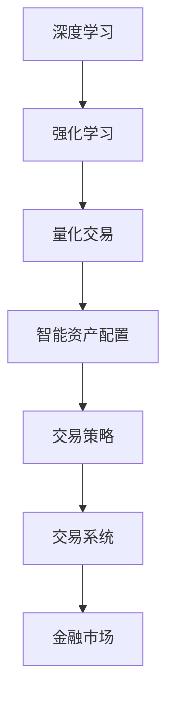

                 

# 未来的智能投资：2050年的AI量化交易与智能资产配置

> 关键词：人工智能,量化交易,智能资产配置,投资策略,深度学习,强化学习,金融市场

## 1. 背景介绍

### 1.1 问题由来

在过去的几十年里，金融市场发生了翻天覆地的变化。从最初的股票交易到现代的高频交易，金融市场的发展始终伴随着技术革新。然而，随着金融市场的规模不断扩大，交易复杂度越来越高，投资者面临的挑战也日益严峻。如何在信息爆炸的时代中快速、准确地做出投资决策，成为摆在世界各地的金融从业者面前的重大课题。

近年来，人工智能（AI）技术在金融领域的应用日益广泛，尤其是在量化交易和智能资产配置方面。通过深度学习、强化学习等先进算法，AI可以自动分析海量数据，发现市场中的潜在规律，帮助投资者做出更明智的投资决策。本文将重点探讨2050年基于AI的量化交易与智能资产配置的最新技术进展，展望未来智能投资的发展方向。

### 1.2 问题核心关键点

- **深度学习与强化学习**：作为AI在金融领域的核心技术，深度学习和强化学习可以自动学习复杂金融市场的规律，提供精准的投资建议。
- **量化交易策略**：基于AI算法构建的量化交易策略，能够快速响应市场变化，自动执行交易。
- **智能资产配置**：通过AI算法优化资产配置方案，最大化风险调整后的收益。
- **交易系统优化**：利用AI技术优化交易系统，提高交易效率和执行速度。
- **算法风险管理**：AI技术可以帮助识别和管理投资组合中的潜在风险。

### 1.3 问题研究意义

深度学习和强化学习在金融领域的应用，不仅能够提升投资决策的精准度，还能显著降低交易成本和风险。此外，AI技术还可以帮助投资者更好地理解金融市场的运作机制，实现更高效的资产配置和风险管理。因此，深入研究基于AI的量化交易与智能资产配置方法，对未来的智能投资具有重要的意义：

1. **提升投资效率**：通过自动化的投资决策，AI可以帮助投资者在短时间内分析大量数据，做出最优的资产配置。
2. **降低交易成本**：AI可以优化交易策略，减少市场摩擦和交易成本，提升投资回报率。
3. **增强风险管理**：利用AI技术识别和评估投资组合的风险，帮助投资者制定更稳健的投资策略。
4. **拓展应用场景**：AI技术在金融领域的广泛应用，为金融产品的创新提供了新的思路和工具。

## 2. 核心概念与联系

### 2.1 核心概念概述

为更好地理解基于AI的量化交易与智能资产配置方法，本节将介绍几个密切相关的核心概念：

- **深度学习（Deep Learning）**：一种基于神经网络的机器学习算法，能够自动从数据中学习特征表示，广泛应用于图像识别、语音识别、自然语言处理等领域。
- **强化学习（Reinforcement Learning, RL）**：一种学习框架，通过与环境的交互，智能体（agent）学习最大化奖励的策略。
- **量化交易（Quantitative Trading）**：利用数据分析和数学模型进行交易决策的自动化投资策略。
- **智能资产配置（Intelligent Asset Allocation）**：通过优化算法，自动调整投资组合中各类资产的比例，以最大化收益和风险的平衡。
- **金融市场（Financial Market）**：指股票、债券、期货等金融工具的买卖场所，是AI量化交易与智能资产配置的应用场景。
- **交易策略（Trading Strategy）**：描述如何进行投资决策和执行交易的算法或规则。
- **交易系统（Trading System）**：实现交易策略的自动化交易系统，包括订单执行、风险控制等功能。

这些核心概念之间的逻辑关系可以通过以下Mermaid流程图来展示：



这个流程图展示了大语言模型微调过程中各个核心概念的关系和作用：

1. 深度学习提供了强大的特征提取能力，强化学习提供了智能决策的能力。
2. 量化交易和智能资产配置都是基于AI技术的投资策略和资产管理方法。
3. 交易策略是执行交易的具体算法或规则。
4. 交易系统是实现交易策略的自动化平台。
5. 金融市场是这些技术应用的具体场景。

### 2.2 概念间的关系

这些核心概念之间存在着紧密的联系，形成了AI量化交易与智能资产配置的完整生态系统。下面我们通过几个Mermaid流程图来展示这些概念之间的关系。

#### 2.2.1 深度学习与量化交易的关系


这个流程图展示了深度学习在量化交易中的应用：

1. 深度学习通过学习历史数据，提取市场特征。
2. 这些特征被用于生成交易信号。
3. 交易信号进一步指导量化交易策略。
4. 量化交易策略在交易系统上执行，完成交易操作。

#### 2.2.2 强化学习与智能资产配置的关系


这个流程图展示了强化学习在智能资产配置中的应用：

1. 强化学习通过与环境的交互，优化投资策略。
2. 优化的策略指导资产配置。
3. 资产配置方案进一步调整投资组合。
4. 风险管理确保投资组合的稳健性。
5. 最终投资组合在金融市场上执行。

#### 2.2.3 交易策略与交易系统的关系


这个流程图展示了交易策略在交易系统中的应用：

1. 交易策略生成具体的订单。
2. 订单在交易系统上执行。
3. 交易系统实时监控市场数据。
4. 风险控制确保交易系统的稳健性。
5. 最终订单在金融市场上执行。

### 2.3 核心概念的整体架构

最后，我们用一个综合的流程图来展示这些核心概念在大语言模型微调过程中的整体架构：

```mermaid
graph TB
    A[大规模数据] --> B[深度学习]
    B --> C[强化学习]
    C --> D[量化交易]
    D --> E[智能资产配置]
    E --> F[交易策略]
    F --> G[交易系统]
    G --> H[金融市场]
    H --> I[市场数据采集]
    I --> J[风险管理]
    J --> K[交易信号生成]
    K --> L[投资组合调整]
    L --> M[订单生成]
    M --> N[订单执行]
    N --> O[收益计算]
    O --> P[策略优化]
    P --> Q[交易策略]
    Q --> R[交易系统]
    R --> S[风险控制]
    S --> T[收益优化]
    T --> U[资产配置]
    U --> V[投资组合调整]
    V --> W[风险管理]
    W --> X[收益优化]
    X --> Y[策略优化]
    Y --> Z[交易策略]
    Z --> AA[交易系统]
    AA --> BB[风险控制]
    BB --> CC[收益计算]
    CC --> DD[策略优化]
    DD --> EE[交易策略]
    EE --> FF[交易系统]
    FF --> GG[金融市场]
    GG --> HH[市场数据采集]
    HH --> II[风险管理]
    II --> JJ[交易信号生成]
    JJ --> KK[投资组合调整]
    KK --> LL[订单生成]
    LL --> MM[订单执行]
    MM --> NN[收益计算]
    NN --> OO[策略优化]
    OO --> PP[交易策略]
    PP --> QQ[交易系统]
    QQ --> RR[风险控制]
    RR --> SS[收益优化]
    SS --> TT[资产配置]
    TT --> UU[投资组合调整]
    UU --> WW[风险管理]
    WW --> XX[收益优化]
    XX --> YY[策略优化]
    YY --> ZZ[交易策略]
    ZZ --> AA[交易系统]
    AA --> BB[风险控制]
    BB --> CC[收益计算]
    CC --> DD[策略优化]
    DD --> EE[交易策略]
    EE --> FF[交易系统]
    FF --> GG[金融市场]
    GG --> HH[市场数据采集]
    HH --> II[风险管理]
    II --> JJ[交易信号生成]
    JJ --> KK[投资组合调整]
    KK --> LL[订单生成]
    LL --> MM[订单执行]
    MM --> NN[收益计算]
    NN --> OO[策略优化]
    OO --> PP[交易策略]
    PP --> QQ[交易系统]
    QQ --> RR[风险控制]
    RR --> SS[收益优化]
    SS --> TT[资产配置]
    TT --> UU[投资组合调整]
    UU --> WW[风险管理]
    WW --> XX[收益优化]
    XX --> YY[策略优化]
    YY --> ZZ[交易策略]
    ZZ --> AA[交易系统]
    AA --> BB[风险控制]
    BB --> CC[收益计算]
    CC --> DD[策略优化]
    DD --> EE[交易策略]
    EE --> FF[交易系统]
    FF --> GG[金融市场]
    GG --> HH[市场数据采集]
    HH --> II[风险管理]
    II --> JJ[交易信号生成]
    JJ --> KK[投资组合调整]
    KK --> LL[订单生成]
    LL --> MM[订单执行]
    MM --> NN[收益计算]
    NN --> OO[策略优化]
    OO --> PP[交易策略]
    PP --> QQ[交易系统]
    QQ --> RR[风险控制]
    RR --> SS[收益优化]
    SS --> TT[资产配置]
    TT --> UU[投资组合调整]
    UU --> WW[风险管理]
    WW --> XX[收益优化]
    XX --> YY[策略优化]
    YY --> ZZ[交易策略]
    ZZ --> AA[交易系统]
    AA --> BB[风险控制]
    BB --> CC[收益计算]
    CC --> DD[策略优化]
    DD --> EE[交易策略]
    EE --> FF[交易系统]
    FF --> GG[金融市场]
    GG --> HH[市场数据采集]
    HH --> II[风险管理]
    II --> JJ[交易信号生成]
    JJ --> KK[投资组合调整]
    KK --> LL[订单生成]
    LL --> MM[订单执行]
    MM --> NN[收益计算]
    NN --> OO[策略优化]
    OO --> PP[交易策略]
    PP --> QQ[交易系统]
    QQ --> RR[风险控制]
    RR --> SS[收益优化]
    SS --> TT[资产配置]
    TT --> UU[投资组合调整]
    UU --> WW[风险管理]
    WW --> XX[收益优化]
    XX --> YY[策略优化]
    YY --> ZZ[交易策略]
    ZZ --> AA[交易系统]
    AA --> BB[风险控制]
    BB --> CC[收益计算]
    CC --> DD[策略优化]
    DD --> EE[交易策略]
    EE --> FF[交易系统]
    FF --> GG[金融市场]
    GG --> HH[市场数据采集]
    HH --> II[风险管理]
    II --> JJ[交易信号生成]
    JJ --> KK[投资组合调整]
    KK --> LL[订单生成]
    LL --> MM[订单执行]
    MM --> NN[收益计算]
    NN --> OO[策略优化]
    OO --> PP[交易策略]
    PP --> QQ[交易系统]
    QQ --> RR[风险控制]
    RR --> SS[收益优化]
    SS --> TT[资产配置]
    TT --> UU[投资组合调整]
    UU --> WW[风险管理]
    WW --> XX[收益优化]
    XX --> YY[策略优化]
    YY --> ZZ[交易策略]
    ZZ --> AA[交易系统]
    AA --> BB[风险控制]
    BB --> CC[收益计算]
    CC --> DD[策略优化]
    DD --> EE[交易策略]
    EE --> FF[交易系统]
    FF --> GG[金融市场]
    GG --> HH[市场数据采集]
    HH --> II[风险管理]
    II --> JJ[交易信号生成]
    JJ --> KK[投资组合调整]
    KK --> LL[订单生成]
    LL --> MM[订单执行]
    MM --> NN[收益计算]
    NN --> OO[策略优化]
    OO --> PP[交易策略]
    PP --> QQ[交易系统]
    QQ --> RR[风险控制]
    RR --> SS[收益优化]
    SS --> TT[资产配置]
    TT --> UU[投资组合调整]
    UU --> WW[风险管理]
    WW --> XX[收益优化]
    XX --> YY[策略优化]
    YY --> ZZ[交易策略]
    ZZ --> AA[交易系统]
    AA --> BB[风险控制]
    BB --> CC[收益计算]
    CC --> DD[策略优化]
    DD --> EE[交易策略]
    EE --> FF[交易系统]
    FF --> GG[金融市场]
    GG --> HH[市场数据采集]
    HH --> II[风险管理]
    II --> JJ[交易信号生成]
    JJ --> KK[投资组合调整]
    KK --> LL[订单生成]
    LL --> MM[订单执行]
    MM --> NN[收益计算]
    NN --> OO[策略优化]
    OO --> PP[交易策略]
    PP --> QQ[交易系统]
    QQ --> RR[风险控制]
    RR --> SS[收益优化]
    SS --> TT[资产配置]
    TT --> UU[投资组合调整]
    UU --> WW[风险管理]
    WW --> XX[收益优化]
    XX --> YY[策略优化]
    YY --> ZZ[交易策略]
    ZZ --> AA[交易系统]
    AA --> BB[风险控制]
    BB --> CC[收益计算]
    CC --> DD[策略优化]
    DD --> EE[交易策略]
    EE --> FF[交易系统]
    FF --> GG[金融市场]
    GG --> HH[市场数据采集]
    HH --> II[风险管理]
    II --> JJ[交易信号生成]
    JJ --> KK[投资组合调整]
    KK --> LL[订单生成]
    LL --> MM[订单执行]
    MM --> NN[收益计算]
    NN --> OO[策略优化]
    OO --> PP[交易策略]
    PP --> QQ[交易系统]
    QQ --> RR[风险控制]
    RR --> SS[收益优化]
    SS --> TT[资产配置]
    TT --> UU[投资组合调整]
    UU --> WW[风险管理]
    WW --> XX[收益优化]
    XX --> YY[策略优化]
    YY --> ZZ[交易策略]
    ZZ --> AA[交易系统]
    AA --> BB[风险控制]
    BB --> CC[收益计算]
    CC --> DD[策略优化]
    DD --> EE[交易策略]
    EE --> FF[交易系统]
    FF --> GG[金融市场]
    GG --> HH[市场数据采集]
    HH --> II[风险管理]
    II --> JJ[交易信号生成]
    JJ --> KK[投资组合调整]
    KK --> LL[订单生成]
    LL --> MM[订单执行]
    MM --> NN[收益计算]
    NN --> OO[策略优化]
    OO --> PP[交易策略]
    PP --> QQ[交易系统]
    QQ --> RR[风险控制]
    RR --> SS[收益优化]
    SS --> TT[资产配置]
    TT --> UU[投资组合调整]
    UU --> WW[风险管理]
    WW --> XX[收益优化]
    XX --> YY[策略优化]
    YY --> ZZ[交易策略]
    ZZ --> AA[交易系统]
    AA --> BB[风险控制]
    BB --> CC[收益计算]
    CC --> DD[策略优化]
    DD --> EE[交易策略]
    EE --> FF[交易系统]
    FF --> GG[金融市场]
    GG --> HH[市场数据采集]
    HH --> II[风险管理]
    II --> JJ[交易信号生成]
    JJ --> KK[投资组合调整]
    KK --> LL[订单生成]
    LL --> MM[订单执行]
    MM --> NN[收益计算]
    NN --> OO[策略优化]
    OO --> PP[交易策略]
    PP --> QQ[交易系统]
    QQ --> RR[风险控制]
    RR --> SS[收益优化]
    SS --> TT[资产配置]
    TT --> UU[投资组合调整]
    UU --> WW[风险管理]
    WW --> XX[收益优化]
    XX --> YY[策略优化]
    YY --> ZZ[交易策略]
    ZZ --> AA[交易系统]
    AA --> BB[风险控制]
    BB --> CC[收益计算]
    CC --> DD[策略优化]
    DD --> EE[交易策略]
    EE --> FF[交易系统]
    FF --> GG[金融市场]
    GG --> HH[市场数据采集]
    HH --> II[风险管理]
    II --> JJ[交易信号生成]
    JJ --> KK[投资组合调整]
    KK --> LL[订单生成]
    LL --> MM[订单执行]
    MM --> NN[收益计算]
    NN --> OO[策略优化]
    OO --> PP[交易策略]
    PP --> QQ[交易系统]
    QQ --> RR[风险控制]
    RR --> SS[收益优化]
    SS --> TT[资产配置]
    TT --> UU[投资组合调整]
    UU --> WW[风险管理]
    WW --> XX[收益优化]
    XX --> YY[策略优化]
    YY --> ZZ[交易策略]
    ZZ --> AA[交易系统]
    AA --> BB[风险控制]
    BB --> CC[收益计算]
    CC --> DD[策略优化]
    DD --> EE[交易策略]
    EE --> FF[交易系统]
    FF --> GG[金融市场]
    GG --> HH[市场数据采集]
    HH --> II[风险管理]
    II --> JJ[交易信号生成]
    JJ --> KK[投资组合调整]
    KK --> LL[订单生成]
    LL --> MM[订单执行]
    MM --> NN[收益计算]
    NN --> OO[策略优化]
    OO --> PP[交易策略]
    PP --> QQ[交易系统]
    QQ --> RR[风险控制]
    RR --> SS[收益优化]
    SS --> TT[资产配置]
    TT --> UU[投资组合调整]
    UU --> WW[风险管理]
    WW --> XX[收益优化]
    XX --> YY[策略优化]
    YY --> ZZ[交易策略]
    ZZ --> AA[交易系统]
    AA --> BB[风险控制]
    BB --> CC[收益计算]
    CC --> DD[策略优化]
    DD --> EE[交易策略]
    EE --> FF[交易系统]
    FF --> GG[金融市场]
    GG --> HH[市场数据采集]
    HH --> II[风险管理]
    II --> JJ[交易信号生成]
    JJ --> KK[投资组合调整]
    KK --> LL[订单生成]
    LL --> MM[订单执行]
    MM --> NN[收益计算]
    NN --> OO[策略优化]
    OO --> PP[交易策略]
    PP --> QQ[交易系统]
    QQ --> RR[风险控制]
    RR --> SS[收益优化]
    SS --> TT[资产配置]
    TT --> UU[投资组合调整]
    UU --> WW[风险管理]
    WW --> XX[收益优化]
    XX --> YY[策略优化]
    YY --> ZZ[交易策略]
    ZZ --> AA[交易系统]
    AA --> BB[风险控制]
    BB --> CC[收益计算]
    CC --> DD[策略优化]
    DD --> EE[交易策略]
    EE --> FF[交易系统]
    FF --> GG[金融市场]
    GG --> HH[市场数据采集]
    HH --> II[风险管理]
    II --> JJ[交易信号生成]
    JJ --> KK[投资组合调整]
    KK --> LL[订单生成]
    LL --> MM[订单执行]
    MM --> NN[收益计算]
    NN --> OO[策略优化]
    OO --> PP[交易策略]
    PP --> QQ[交易系统]
    QQ --> RR[风险控制]
    RR --> SS[收益优化]
    SS --> TT[资产配置]
    TT --> UU[投资组合调整]
    UU --> WW[风险管理]
    WW --> XX[收益优化]
    XX --> YY[策略优化]
    YY --> ZZ[交易策略]
    ZZ --> AA[交易系统]
    AA --> BB[风险控制]
    BB --> CC[收益计算]
    CC --> DD[策略优化]
    DD --> EE[交易策略]
    EE --> FF[交易系统]
    FF --> GG[金融市场]
    GG --> HH[市场数据采集]
    HH --> II[风险管理]
    II --> JJ[交易信号生成]
    JJ --> KK[投资组合调整]
    KK --> LL[订单生成]
    LL --> MM[订单执行]
    MM --> NN[收益计算]
    NN --> OO[策略优化]
    OO --> PP[交易策略]
    PP --> QQ[交易系统]
    QQ --> RR[风险控制]
    RR --> SS[收益优化]
    SS --> TT[资产配置]
    TT --> UU[投资组合调整]
    UU --> WW[风险管理]
    WW --> XX[收益优化]
    XX --> YY[策略优化]
    YY --> ZZ[交易策略]
    ZZ --> AA[交易系统]
    AA --> BB[风险控制]
    BB --> CC[收益计算]
    CC --> DD[策略优化]
    DD --> EE[交易策略]
    EE --> FF[交易系统]
    FF --> GG[金融市场]
    GG --> HH[市场数据采集]
    HH --> II[风险管理]
    II --> JJ[交易信号生成]
    JJ --> KK[投资组合调整]
    KK --> LL[订单生成]
    LL --> MM[订单执行]
    MM --> NN[收益计算]
    NN --> OO[策略优化]
    OO --> PP[交易策略]
    PP --> QQ[交易系统]
    QQ --> RR[风险控制]
    RR --> SS[收益优化]
    SS --> TT[资产配置]
    TT --> UU[投资组合调整]
    UU --> WW[风险管理]
    WW --> XX[收益优化]
    XX --> YY[策略优化]
    YY --> ZZ[交易策略]
    ZZ --> AA[交易系统]
    AA --> BB[风险控制]
    BB --> CC[收益计算]
    CC --> DD[策略优化]
    DD --> EE[交易策略]
    EE --> FF[交易系统]
    FF --> GG[金融市场]
    GG --> HH[市场数据采集]
    HH --> II[风险管理]
    II --> JJ[交易信号生成]
    JJ --> KK[投资组合调整]
    KK --> LL[订单生成]
    LL --> MM[订单执行]
    MM --> NN[收益计算]
    NN --> OO[策略优化]
    OO --> PP[交易策略]
    PP --> QQ[交易系统]
    QQ --> RR[风险控制]
    RR --> SS[收益优化]
    SS --> TT[资产配置]
    TT --> UU[投资组合调整]
    UU --> WW[风险管理]
    WW --> XX[收益优化]
    XX --> YY[策略优化]
    YY --> ZZ[交易策略]
    ZZ --> AA[交易系统]
    AA --> BB[风险控制]
    BB --> CC[收益计算]
    CC --> DD[策略优化]
    DD --> EE[交易策略]
    EE --> FF[交易系统]
    FF --> GG[金融市场]
    GG --> HH[市场数据采集]
    HH --> II[风险管理]
    II --> JJ[交易信号生成]
    JJ --> KK[投资组合调整]
    KK --> LL[订单生成]
    LL --> MM[订单执行]
    MM --> NN[收益计算]
    NN --> OO[策略优化]
    OO --> PP[交易策略]
    PP --> QQ[交易系统]
    QQ --> RR[风险控制]
    RR --> SS[收益优化]
    SS --> TT[资产配置]
    TT --> UU[投资组合调整]
    UU --> WW[风险管理]
    WW --> XX[收益优化]
    XX --> YY[策略优化]
    YY --> ZZ[交易策略]
    ZZ --> AA[交易系统]
    AA --> BB[风险控制]
    BB --> CC[收益计算]
    CC --> DD[策略优化]
    DD --> EE[交易策略]
    EE --> FF[交易系统]
    FF --> GG[金融市场]
    GG --> HH[市场数据采集]
    HH --> II[风险管理]
    II --> JJ[交易信号生成]
    JJ --> KK[投资组合调整]
    KK --> LL[订单生成]
    LL --> MM[订单执行]
    MM --> NN[收益计算]
    NN --> OO[策略优化]
    OO --> PP[交易策略]
    PP --> QQ[交易系统]
    QQ --> RR[风险控制]
    RR --> SS[收益优化]
    SS --> TT[资产配置]
    TT --> UU[投资组合调整]
    UU --> WW[风险管理]
    WW --> XX[收益优化]
    XX --> YY[策略优化]
    YY --> ZZ[交易策略]
    ZZ --> AA[交易系统]
    AA --> BB[风险控制]
    BB --> CC[收益计算]
    CC --> DD[策略优化]
    DD --> EE[交易策略]
    EE --> FF[交易系统]
    FF --> GG[金融市场]
    GG --> HH[市场数据采集]
    HH --> II[风险管理]
    II --> JJ[交易信号生成]
    JJ --> KK[投资组合

