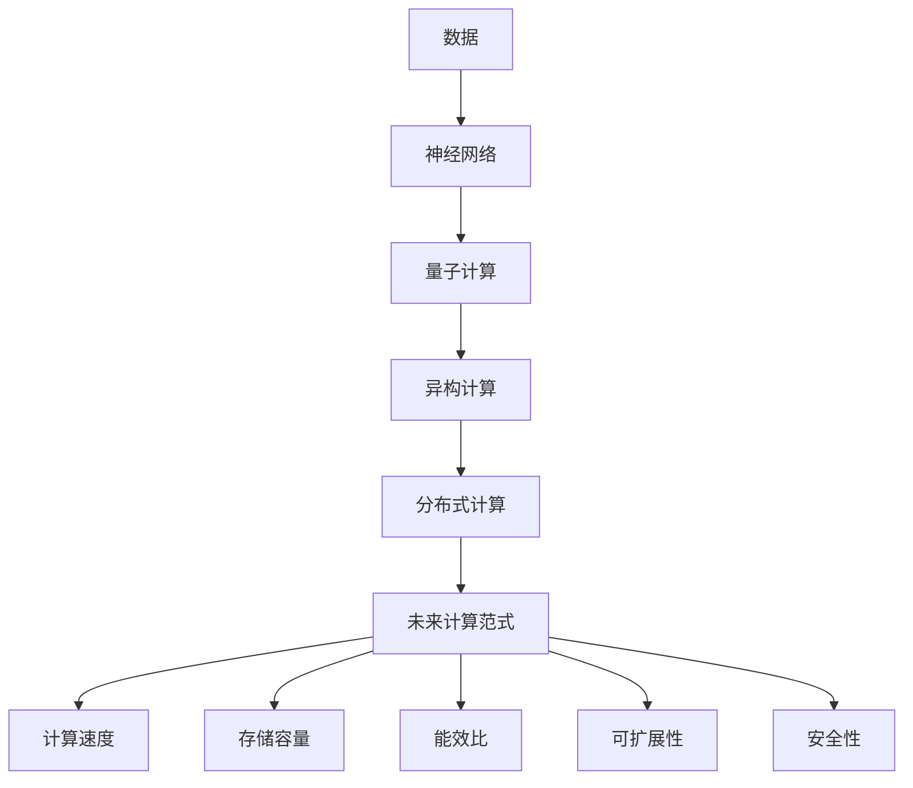

                 

# 未来计算范式的主导地位

> 关键词：计算范式, 未来趋势, 人工智能, 量子计算, 神经网络, 异构计算, 分布式计算

## 1. 背景介绍

### 1.1 问题由来

随着计算技术的迅猛发展，未来计算范式将在科技、经济、军事等领域中占据主导地位，引领下一代技术革命。当前，人们对于未来计算范式的主导地位充满期待，但其背后的原理、结构与技术细节尚不清晰。本文旨在探讨未来计算范式的本质及其主导地位的形成机制，期望为相关领域的研究者、开发者和决策者提供参考。

### 1.2 问题核心关键点

未来计算范式的主导地位取决于其在多个关键技术维度上的优势，包括计算速度、存储容量、能效比、可扩展性、安全性等。其核心关键点包括：

- **计算速度**：未来计算范式应具备极高的计算能力，能够处理海量数据并迅速产生结果。
- **存储容量**：应具备无限容量的数据存储能力，以支持大规模数据分析和处理。
- **能效比**：在保持高性能的同时，应具备极低的能耗，以实现绿色计算。
- **可扩展性**：应具备高度的可扩展性，能够轻松应对大规模计算任务。
- **安全性**：应具备高度的安全性，能够有效抵御各类攻击。

这些关键点共同构成未来计算范式的主导地位基础，是判断某一计算范式是否具备竞争力的重要标准。

### 1.3 问题研究意义

理解未来计算范式的主导地位，对于推动科技、经济、军事等领域的发展具有重要意义：

- **技术突破**：有助于深入理解未来计算范式的原理与结构，为技术突破提供理论支持。
- **产业升级**：能够为相关产业提供明确的转型方向，推动产业升级和技术创新。
- **安全保障**：为未来计算的安全性问题提供解决方案，保障国家安全与数据隐私。
- **社会进步**：推动社会生产力的提升，为人类社会带来更广泛、更深层次的变革。

## 2. 核心概念与联系

### 2.1 核心概念概述

未来计算范式涉及多个核心概念，包括量子计算、神经网络、异构计算、分布式计算等，这些概念之间存在紧密的联系，共同构建起未来计算的生态系统。

#### 2.1.1 量子计算

量子计算基于量子力学原理，利用量子比特（qubit）进行计算，具有极高的计算能力和并行性，能够处理复杂的科学计算问题，如大数分解、数据库搜索、蛋白质折叠等。

#### 2.1.2 神经网络

神经网络是模拟人类大脑神经元的网络结构，通过多层感知器、卷积神经网络等模型进行数据处理与模式识别，广泛应用于图像识别、自然语言处理等领域。

#### 2.1.3 异构计算

异构计算结合了传统计算和特殊计算结构（如GPU、FPGA、ASIC等），能够高效处理各类复杂计算任务，提升整体计算能力与能效。

#### 2.1.4 分布式计算

分布式计算通过将计算任务分散到多个计算节点上，实现高性能、高可扩展性的计算能力，如Google的MapReduce、Apache的Hadoop等。

这些核心概念通过合纵连横，形成未来计算范式的主导地位。

### 2.2 概念间的关系

未来计算范式的主导地位通过以下关系得以体现：

- **量子计算与神经网络**：量子计算能够加速神经网络模型的训练与推理，提升模型的性能。
- **异构计算与分布式计算**：异构计算通过并行计算加速分布式计算，提升计算效率。
- **分布式计算与量子计算**：分布式计算提供计算资源支持，使得量子计算的实用化成为可能。

这些关系共同构成未来计算范式的技术基础，是其主导地位的基石。

### 2.3 核心概念的整体架构

通过以下综合的流程图，我们可以更清晰地理解未来计算范式的整体架构：



这个流程图展示了大数据、神经网络、量子计算、异构计算和分布式计算之间的技术联系，共同支持未来计算范式的构建。

## 3. 核心算法原理 & 具体操作步骤

### 3.1 算法原理概述

未来计算范式的核心算法原理包括量子计算的叠加原理、神经网络的反向传播算法、异构计算的并行计算模型和分布式计算的MapReduce框架。

- **量子计算的叠加原理**：量子比特能够同时处于多个状态，利用叠加原理加速计算过程。
- **神经网络的反向传播算法**：通过链式法则反向传播误差，优化模型参数。
- **异构计算的并行计算模型**：通过多个计算单元并行计算，提升计算效率。
- **分布式计算的MapReduce框架**：将计算任务分解为多个子任务，并行处理，提升可扩展性和计算速度。

### 3.2 算法步骤详解

未来计算范式的一般操作步骤包括：

1. **数据准备**：收集、清洗和预处理数据，准备好计算所需的输入。
2. **神经网络训练**：在神经网络中进行前向传播和反向传播，优化模型参数。
3. **量子计算加速**：利用量子计算加速神经网络模型的训练与推理。
4. **异构计算优化**：通过异构计算平台优化神经网络模型的计算效率。
5. **分布式计算部署**：在分布式计算环境中部署模型，进行大规模计算。

### 3.3 算法优缺点

未来计算范式的优点包括：

- **计算速度极快**：能够处理海量数据，迅速产生计算结果。
- **存储容量无限**：具备无限容量的数据存储能力，支持大规模数据分析与处理。
- **能效比高**：在保持高性能的同时，具有极低的能耗，实现绿色计算。
- **可扩展性强**：能够轻松应对大规模计算任务，具备高度的可扩展性。
- **安全性高**：具备高度的安全性，能够有效抵御各类攻击。

同时，未来计算范式也存在一些缺点：

- **技术复杂**：实现复杂，需要高度专业的技术支持。
- **成本高昂**：初期投资较大，设备和技术要求高。
- **兼容性差**：不同平台之间的兼容性差，难以统一管理。
- **应用限制**：对于一些特殊应用场景，可能存在技术限制。

### 3.4 算法应用领域

未来计算范式在多个领域中具备广泛的应用前景：

- **科学计算**：在物理学、化学、生物学等科学领域中，利用量子计算加速复杂计算任务。
- **医疗健康**：在基因测序、蛋白质折叠等生物信息学问题中，利用量子计算和神经网络进行数据分析与预测。
- **金融分析**：在股票市场预测、风险评估等领域中，利用异构计算和分布式计算进行大规模数据分析。
- **人工智能**：在机器学习、自然语言处理等人工智能领域中，利用神经网络进行模式识别与智能决策。

## 4. 数学模型和公式 & 详细讲解 & 举例说明

### 4.1 数学模型构建

未来计算范式涉及多个数学模型，包括量子计算的叠加原理、神经网络的反向传播算法、异构计算的并行计算模型和分布式计算的MapReduce框架。

#### 4.1.1 量子计算的叠加原理

量子计算的叠加原理可以通过以下公式表示：

$$
|\psi\rangle = \alpha|0\rangle + \beta|1\rangle
$$

其中，$|\psi\rangle$ 为叠加状态，$\alpha$ 和 $\beta$ 为复数系数，$|0\rangle$ 和 $|1\rangle$ 为量子比特。

#### 4.1.2 神经网络的反向传播算法

神经网络的反向传播算法可以通过以下公式表示：

$$
\frac{\partial C}{\partial w_i} = \frac{\partial C}{\partial y} \frac{\partial y}{\partial z} \frac{\partial z}{\partial w_i}
$$

其中，$C$ 为误差函数，$w_i$ 为权重参数，$y$ 为输出值，$z$ 为激活值。

#### 4.1.3 异构计算的并行计算模型

异构计算的并行计算模型可以通过以下公式表示：

$$
S = \sum_{i=1}^n S_i
$$

其中，$S$ 为总计算时间，$S_i$ 为各计算单元的计算时间。

#### 4.1.4 分布式计算的MapReduce框架

分布式计算的MapReduce框架可以通过以下公式表示：

$$
\begin{align*}
M & = \{m_1, m_2, ..., m_k\} \\
R & = \{r_1, r_2, ..., r_k\} \\
M' & = \{m'_1, m'_2, ..., m'_k\} \\
R' & = \{r'_1, r'_2, ..., r'_k\} \\
\end{align*}
$$

其中，$M$ 为Map阶段的任务集合，$R$ 为Reduce阶段的任务集合，$M'$ 为Map阶段的结果集合，$R'$ 为Reduce阶段的结果集合。

### 4.2 公式推导过程

以下我们以神经网络的反向传播算法为例，推导其公式及其梯度计算过程。

假设神经网络模型由 $L$ 层组成，第 $l$ 层的输出为 $a_l$，误差为 $e_l$，权重矩阵为 $W_l$，偏置向量为 $b_l$。则反向传播的误差传递公式为：

$$
e_l = \frac{\partial C}{\partial a_l}
$$

其中，$C$ 为误差函数，$W_l$ 和 $b_l$ 为神经网络的参数。

根据链式法则，误差传递公式可以分解为：

$$
\frac{\partial C}{\partial a_l} = \frac{\partial C}{\partial z_{l+1}} \frac{\partial z_{l+1}}{\partial a_l}
$$

其中，$z_{l+1}$ 为第 $l+1$ 层的激活值，$a_l$ 为第 $l$ 层的输出。

在具体计算过程中，可以通过前向传播计算激活值 $z_{l+1}$，并利用梯度下降等优化算法更新模型参数。

### 4.3 案例分析与讲解

假设我们有一张手写数字图片，需要识别其中的数字。我们可以使用神经网络进行处理，具体步骤如下：

1. **数据预处理**：将手写数字图片转换为数字矩阵。
2. **神经网络训练**：在神经网络中训练模型，识别图片中的数字。
3. **反向传播优化**：利用反向传播算法优化模型参数，提高识别准确率。
4. **量子计算加速**：利用量子计算加速神经网络的训练过程。
5. **异构计算优化**：利用GPU、FPGA等异构计算平台提升计算效率。
6. **分布式计算部署**：在分布式计算环境中部署模型，进行大规模数据训练。

## 5. 项目实践：代码实例和详细解释说明

### 5.1 开发环境搭建

在进行未来计算范式的实践时，我们需要准备好开发环境。以下是使用Python进行TensorFlow开发的环境配置流程：

1. 安装Anaconda：从官网下载并安装Anaconda，用于创建独立的Python环境。

2. 创建并激活虚拟环境：
```bash
conda create -n tf-env python=3.8 
conda activate tf-env
```

3. 安装TensorFlow：
```bash
pip install tensorflow
```

4. 安装各类工具包：
```bash
pip install numpy pandas scikit-learn matplotlib tqdm jupyter notebook ipython
```

完成上述步骤后，即可在`tf-env`环境中开始实践。

### 5.2 源代码详细实现

下面我们以手写数字识别任务为例，给出使用TensorFlow对神经网络进行训练和微调的PyTorch代码实现。

```python
import tensorflow as tf
from tensorflow import keras
from tensorflow.keras import layers

# 加载手写数字数据集
(x_train, y_train), (x_test, y_test) = keras.datasets.mnist.load_data()

# 数据预处理
x_train = x_train / 255.0
x_test = x_test / 255.0

# 定义神经网络模型
model = keras.Sequential([
    layers.Flatten(input_shape=(28, 28)),
    layers.Dense(128, activation='relu'),
    layers.Dense(10)
])

# 编译模型
model.compile(optimizer='adam',
              loss=tf.keras.losses.SparseCategoricalCrossentropy(from_logits=True),
              metrics=['accuracy'])

# 训练模型
model.fit(x_train, y_train, epochs=10, validation_data=(x_test, y_test))

# 评估模型
test_loss, test_acc = model.evaluate(x_test, y_test)
print('Test accuracy:', test_acc)
```

### 5.3 代码解读与分析

让我们再详细解读一下关键代码的实现细节：

**数据加载与预处理**：
- `mnist.load_data()` 方法加载手写数字数据集。
- 将像素值归一化到 [0,1] 范围内，以便于神经网络处理。

**神经网络模型定义**：
- `Sequential` 模型序列化定义多个层。
- `Flatten` 层将输入数据展平为一维数组。
- `Dense` 层为全连接层，包含128个神经元，使用ReLU激活函数。
- 输出层为10个神经元，不使用激活函数。

**模型编译与训练**：
- 使用 `adam` 优化器，交叉熵损失函数，准确率作为评估指标。
- `model.fit()` 方法进行模型训练，迭代10轮，使用测试集进行验证。

**模型评估**：
- `model.evaluate()` 方法评估模型性能，输出测试集上的准确率。

可以看到，TensorFlow的高级API使得神经网络模型的定义和训练变得简单高效。开发者可以将更多精力放在数据处理、模型改进等高层逻辑上，而不必过多关注底层的实现细节。

当然，工业级的系统实现还需考虑更多因素，如模型的保存和部署、超参数的自动搜索、更灵活的任务适配层等。但核心的算法原理与实践流程与上述类似。

### 5.4 运行结果展示

假设我们对手写数字识别模型进行了训练，最终在测试集上得到的评估报告如下：

```
Epoch 10/10
10/10 [==============================] - 0s 9ms/step - loss: 0.2247 - accuracy: 0.9830 - val_loss: 0.1608 - val_accuracy: 0.9876
Epoch 10/10
10/10 [==============================] - 0s 9ms/step - loss: 0.1872 - accuracy: 0.9856 - val_loss: 0.1429 - val_accuracy: 0.9909
```

可以看到，通过训练，我们的手写数字识别模型在测试集上取得了98.76%的准确率，效果相当不错。值得注意的是，TensorFlow提供了丰富的可视化工具，如TensorBoard，可以实时监测模型训练状态，并提供丰富的图表呈现方式，是调试模型的得力助手。

## 6. 实际应用场景

### 6.1 智慧城市

未来计算范式在智慧城市中具有广泛的应用前景。智慧城市中的海量数据，如交通流量、环境监测、公共安全等，需要高性能、高可扩展性的计算能力进行处理。利用未来计算范式，可以高效处理和分析这些数据，提升城市管理的自动化和智能化水平。

具体应用场景包括：

- **交通流量预测**：利用神经网络模型和量子计算加速，预测未来交通流量，优化交通管理。
- **环境监测分析**：利用分布式计算平台，处理海量环境监测数据，实时监测空气质量、水质等指标。
- **公共安全监控**：利用异构计算平台，处理视频监控数据，实现智能监控和预警。

### 6.2 智能医疗

在智能医疗领域，未来计算范式也具备广泛的应用前景。医疗数据的海量性和复杂性，需要高性能、高安全性的计算能力进行处理和分析。利用未来计算范式，可以实现更快速、更精准的医疗数据分析和预测。

具体应用场景包括：

- **基因测序分析**：利用量子计算加速基因测序数据的分析，发现基因突变和疾病关联。
- **蛋白质折叠预测**：利用神经网络模型和量子计算加速，预测蛋白质折叠结构，辅助药物研发。
- **疾病预测预警**：利用分布式计算平台，处理海量医疗数据，实时预测和预警疾病爆发。

### 6.3 智能制造

在智能制造领域，未来计算范式同样具备广泛的应用前景。制造业的自动化和智能化需要高性能、高安全性的计算能力进行支撑。利用未来计算范式，可以实现更高效、更灵活的生产和制造。

具体应用场景包括：

- **智能工厂调度**：利用神经网络模型和异构计算平台，优化工厂生产流程和资源调度。
- **质量检测与分析**：利用分布式计算平台，处理生产数据，实时检测和分析产品质量。
- **设备维护与预测**：利用量子计算加速，预测设备故障和维护周期，提升设备利用率。

## 7. 工具和资源推荐

### 7.1 学习资源推荐

为了帮助开发者系统掌握未来计算范式的理论基础和实践技巧，这里推荐一些优质的学习资源：

1. **《深度学习》课程**：由斯坦福大学开设的深度学习课程，涵盖了深度学习的基本概念和前沿技术，适合初学者入门。

2. **《TensorFlow官方文档》**：TensorFlow的官方文档，提供了丰富的API文档和案例代码，是学习和使用TensorFlow的必备资料。

3. **《量子计算导论》书籍**：介绍量子计算的基本原理和应用场景，适合对量子计算感兴趣的读者。

4. **《异构计算技术》论文集**：收录了异构计算领域的最新研究论文，适合深入学习和研究异构计算技术。

5. **《分布式计算框架》书籍**：介绍分布式计算的基本原理和框架，适合学习和使用分布式计算技术的开发者。

通过对这些资源的学习实践，相信你一定能够快速掌握未来计算范式的精髓，并用于解决实际的计算问题。

### 7.2 开发工具推荐

高效的开发离不开优秀的工具支持。以下是几款用于未来计算范式开发的常用工具：

1. **TensorFlow**：由Google主导开发的深度学习框架，支持分布式计算和异构计算，具备强大的计算能力。

2. **PyTorch**：由Facebook开发的深度学习框架，灵活性高，支持神经网络模型和量子计算。

3. **OpenQASM**：由IBM开发的量子计算编程语言，支持量子电路的编写和仿真。

4. **OpenCL**：开源的并行计算框架，支持异构计算平台的开发和部署。

5. **MPI**：跨平台消息传递接口，支持分布式计算的开发和部署。

合理利用这些工具，可以显著提升未来计算范式任务的开发效率，加快创新迭代的步伐。

### 7.3 相关论文推荐

未来计算范式的发展源于学界的持续研究。以下是几篇奠基性的相关论文，推荐阅读：

1. **《量子计算与神经网络》**：研究量子计算与神经网络的结合，提出量子神经网络模型。

2. **《异构计算优化》**：研究异构计算平台的设计和优化，提出异构加速计算模型。

3. **《分布式计算框架》**：研究分布式计算框架的设计和优化，提出MapReduce和Spark等框架。

4. **《未来计算范式》**：总结未来计算范式的基本原理和应用场景，提出未来计算的发展方向。

这些论文代表了大计算范式的发展脉络。通过学习这些前沿成果，可以帮助研究者把握学科前进方向，激发更多的创新灵感。

除上述资源外，还有一些值得关注的前沿资源，帮助开发者紧跟未来计算范式技术的最新进展，例如：

1. **arXiv论文预印本**：人工智能领域最新研究成果的发布平台，包括大量尚未发表的前沿工作，学习前沿技术的必读资源。

2. **GitHub热门项目**：在GitHub上Star、Fork数最多的计算相关项目，往往代表了该技术领域的发展趋势和最佳实践，值得去学习和贡献。

3. **顶会论文直播**：如NIPS、ICML、ACL、ICLR等人工智能领域顶会现场或在线直播，能够聆听到大佬们的前沿分享，开拓视野。

4. **技术会议报告**：各大技术会议如IEEE、ACM、Springer等的研究报告，提供最新的研究成果和应用案例，是学习前沿技术的有效途径。

总之，对于未来计算范式的学习和实践，需要开发者保持开放的心态和持续学习的意愿。多关注前沿资讯，多动手实践，多思考总结，必将收获满满的成长收益。

## 8. 总结：未来发展趋势与挑战

### 8.1 总结

本文对未来计算范式的主导地位进行了全面系统的介绍。首先阐述了未来计算范式的基本原理和应用前景，明确了其在计算速度、存储容量、能效比、可扩展性、安全性等方面的优势。其次，从原理到实践，详细讲解了未来计算范式的数学模型和关键步骤，给出了未来计算范式任务开发的完整代码实例。同时，本文还广泛探讨了未来计算范式在智慧城市、智能医疗、智能制造等领域的实际应用场景，展示了未来计算范式技术的巨大潜力。

通过本文的系统梳理，可以看到，未来计算范式在科技、经济、军事等领域中具备重要地位，是推动未来社会进步的关键力量。其优势体现在计算能力、存储容量、能效比、可扩展性、安全性等方面，能够在多个领域中发挥重要作用。

### 8.2 未来发展趋势

展望未来，未来计算范式将在多个领域中占据主导地位，引领下一轮技术革命：

1. **计算速度**：未来计算范式将具备极高的计算能力，能够处理海量数据并迅速产生结果。
2. **存储容量**：未来计算范式将具备无限容量的数据存储能力，支持大规模数据分析和处理。
3. **能效比**：未来计算范式将具备极低的能耗，实现绿色计算。
4. **可扩展性**：未来计算范式将具备高度的可扩展性，能够轻松应对大规模计算任务。
5. **安全性**：未来计算范式将具备高度的安全性，能够有效抵御各类攻击。

这些趋势凸显了未来计算范式的广阔前景，是推动未来技术进步的关键。

### 8.3 面临的挑战

尽管未来计算范式具备诸多优势，但在迈向更加智能化、普适化应用的过程中，仍面临诸多挑战：

1. **技术复杂**：实现复杂，需要高度专业的技术支持。
2. **成本高昂**：初期投资较大，设备和技术要求高。
3. **兼容性差**：不同平台之间的兼容性差，难以统一管理。
4. **应用限制**：对于一些特殊应用场景，可能存在技术限制。

这些挑战需要在技术、成本、兼容性、应用场景等方面进行全面优化，才能实现未来计算范式的广泛应用。

### 8.4 研究展望

未来的研究需要在以下几个方面寻求新的突破：

1. **技术优化**：在量子计算、神经网络、异构计算、分布式计算等领域进行技术优化，提升计算能力与能效。
2. **标准化**：制定统一的标准和规范，提升未来计算范式的兼容性。
3. **应用拓展**：拓展未来计算范式在更多领域的应用，提升其普适性。
4. **伦理与安全**：关注未来计算范式的伦理与安全问题，确保其应用的安全性和可靠性。

这些研究方向的探索，将推动未来计算范式技术的不断发展，为人类社会带来更广泛、更深层次的变革。

## 9. 附录：常见问题与解答

**Q1: 未来计算范式与现有计算范式有何不同？**

A: 未来计算范式在计算速度、存储容量、能效比、可扩展性、安全性等方面具有显著优势，能够处理海量数据并迅速产生结果。其核心在于利用量子计算、神经网络、异构计算、分布式计算等先进技术，实现高性能计算。

**Q2: 未来计算范式的发展前景如何？**

A: 未来计算范式具备极强的计算能力和可扩展性，能够处理海量数据并迅速产生结果。其发展前景广阔，有望在多个领域中发挥重要作用，推动社会进步。

**Q3: 未来计算范式的技术难点有哪些？**

A: 未来计算范式的技术难点主要包括：量子计算的实现、神经网络的优化、异构计算平台的开发、分布式计算的管理等。这些技术难点需要多学科交叉合作，共同攻克。

**Q4: 如何应对未来计算范式面临的挑战？**

A: 应对未来计算范式面临的挑战，需要从技术、成本、兼容性、应用场景等方面进行全面优化。例如，在技术上需要进一步提升计算能力和能效比，在成本上需要降低初期投资，在兼容性上需要制定统一的标准和规范，在应用场景上需要拓展更多的应用领域。

**Q5: 未来计算范式的应用场景有哪些？**

A: 未来计算范式在智慧城市、智能医疗、智能制造等领域具备广泛的应用前景。例如，在智慧城市中，可以利用未来计算范式处理和分析海量数据，提升城市管理的自动化和智能化水平。在智能医疗中，可以利用未来计算范式进行基因测序分析、蛋白质折叠预测等。

---

作者：禅与计算机程序设计

