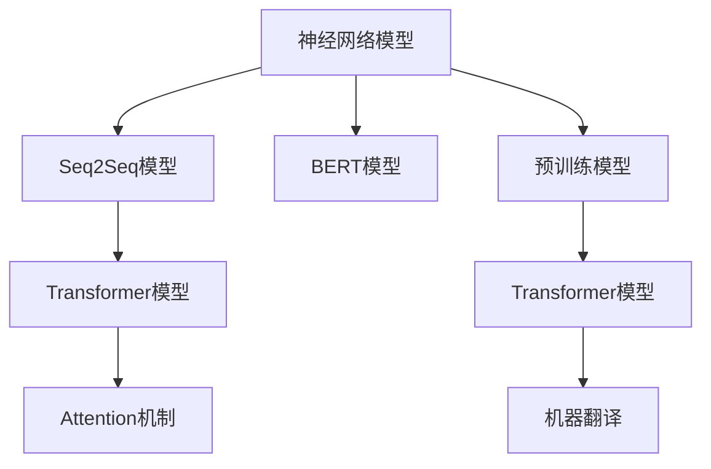
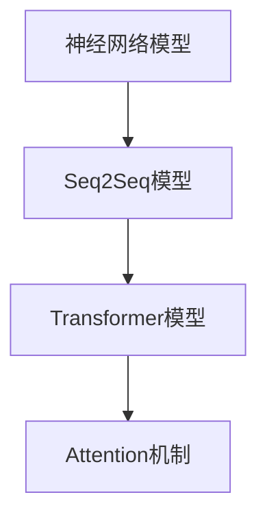
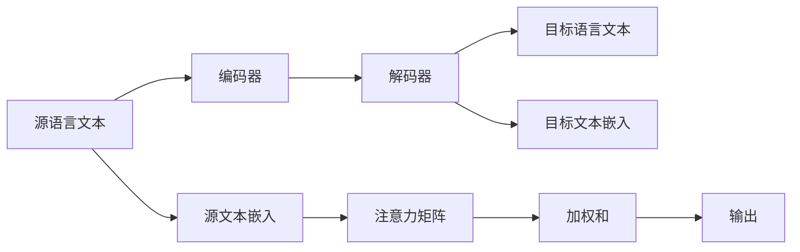
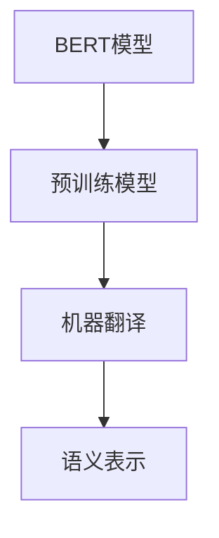
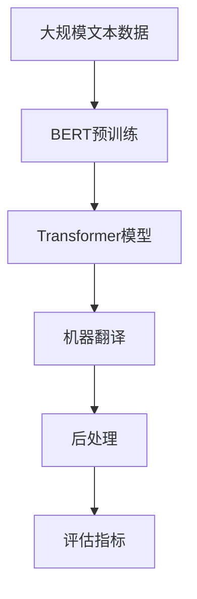

                 

# 机器翻译(Machine Translation) - 原理与代码实例讲解

> 关键词：机器翻译,神经网络,自注意力机制,Transformer,BERT,Attention,Attention-based Model,Seq2Seq,Attention-based Seq2Seq,Transformer-based MT

## 1. 背景介绍

### 1.1 问题由来

机器翻译(Machine Translation, MT)是将一种语言的文本自动翻译成另一种语言的文本，是自然语言处理(NLP)领域的重要分支。随着人工智能技术的快速发展，特别是深度学习模型的突破，机器翻译的精度和流畅度得到了显著提升。传统统计机器翻译基于规则和词法，而基于深度学习的神经机器翻译(Neural Machine Translation, NMT)则借助神经网络模型，通过学习源语言和目标语言之间的映射关系，实现自动翻译。

早期的神经机器翻译模型基于序列到序列(Sequence-to-Sequence, Seq2Seq)的框架，包含编码器和解码器两部分，依靠循环神经网络(RNN)或长短期记忆网络(LSTM)实现。然而，这些模型往往存在梯度消失或爆炸的问题，难以解决长距离依赖问题，且生成的翻译质量受限于上下文信息的记忆能力。

随着Attention机制的提出和应用，Transformer模型在机器翻译领域大放异彩，通过自注意力机制(Self-Attention)，可以捕捉长距离依赖关系，生成流畅自然的翻译文本。BERT模型作为通用的预训练语言模型，也因其强大的语义表示能力，在机器翻译任务上取得了优异表现。

### 1.2 问题核心关键点

机器翻译的核心问题是如何利用神经网络模型学习源语言和目标语言之间的映射关系，生成高质量的翻译结果。核心技术点包括：

- 神经网络模型架构的设计，如Seq2Seq、Transformer等。
- 注意力机制的应用，如自注意力(Self-Attention)、多头注意力(Multi-Head Attention)。
- 预训练模型的使用，如BERT、GPT等。
- 模型训练与优化，包括损失函数的选择、优化器及超参数的设置。
- 后处理技术，如BLEU、ROUGE等翻译质量评估指标。

### 1.3 问题研究意义

机器翻译在跨语言交流、国际商务、国际贸易等方面具有重要的应用价值。通过将翻译任务自动化，机器翻译能够大幅提升信息传播速度和效率，降低语言障碍带来的成本，推动全球化进程。此外，机器翻译技术的发展也带动了其他NLP任务的发展，如问答系统、语音识别、信息检索等，具有广泛的行业应用前景。

在学术界，机器翻译技术的发展促进了自然语言处理、计算语言学、计算机科学等领域的交叉研究。在工业界，机器翻译技术已经成为AI应用的重要组成部分，广泛应用于Google翻译、百度翻译、DeepL翻译等知名翻译服务，为全球用户提供便捷的跨语言交流平台。

## 2. 核心概念与联系

### 2.1 核心概念概述

为更好地理解机器翻译的技术原理，本节将介绍几个密切相关的核心概念：

- 神经网络模型：以多层神经元构成的网络结构，能够对输入数据进行非线性映射和特征提取，是机器翻译的主流模型。
- Seq2Seq模型：一种基于编码器-解码器架构的序列到序列模型，通过递归神经网络(RNN)或LSTM等对序列数据进行处理和生成。
- Transformer模型：一种基于自注意力机制的神经网络架构，可以高效地处理长距离依赖关系，生成更加流畅的翻译结果。
- Attention机制：通过注意力权重计算，对源语言文本和目标语言文本中的关键信息进行加权组合，捕捉长距离依赖关系。
- BERT模型：一种预训练语言模型，通过在大规模无标签文本上预训练，获得丰富的语义表示能力，可以用于机器翻译的预训练。

这些核心概念之间存在着紧密的联系，形成了机器翻译技术的完整生态系统。下面我们通过几个Mermaid流程图来展示这些概念之间的关系。



这个流程图展示了大语言模型和机器翻译模型之间的关系：

1. 神经网络模型是机器翻译的基础架构。
2. Seq2Seq模型是基于神经网络架构的一种早期翻译模型。
3. Transformer模型通过自注意力机制，提高了序列处理的效率和效果。
4. Attention机制是Transformer模型中的关键技术。
5. BERT模型可以通过预训练获得丰富的语言表示，进一步提升机器翻译的性能。

### 2.2 概念间的关系

这些核心概念之间存在着紧密的联系，形成了机器翻译技术的完整生态系统。下面我们通过几个Mermaid流程图来展示这些概念之间的关系。

#### 2.2.1 神经网络模型的应用



这个流程图展示了神经网络模型在机器翻译中的应用：

1. 神经网络模型可以构建Seq2Seq模型，实现基本翻译功能。
2. Seq2Seq模型可以进一步升级为Transformer模型，引入自注意力机制，提升翻译效果。
3. 自注意力机制是Transformer模型的核心技术，可以捕捉长距离依赖关系。

#### 2.2.2 Seq2Seq模型与Transformer模型的对比


这个流程图展示了Seq2Seq模型和Transformer模型的对比：

1. Seq2Seq模型基于RNN或LSTM，难以处理长距离依赖关系。
2. Transformer模型通过自注意力机制，可以高效地处理长距离依赖，生成更加流畅的翻译文本。

#### 2.2.3 Attention机制的原理



这个流程图展示了Attention机制的工作原理：

1. 源语言文本被编码成文本嵌入。
2. 目标语言文本被解码成文本嵌入。
3. 编码器和解码器通过注意力矩阵计算注意力权重，加权和得到上下文向量。
4. 上下文向量与目标语言嵌入向量进行线性变换，生成目标语言文本的输出。

#### 2.2.4 BERT模型的应用



这个流程图展示了BERT模型在机器翻译中的应用：

1. BERT模型通过预训练获得丰富的语义表示能力。
2. 预训练模型可以用于机器翻译任务，提升翻译质量。
3. 语义表示能力可以增强翻译模型的上下文理解和生成能力。

### 2.3 核心概念的整体架构

最后，我们用一个综合的流程图来展示这些核心概念在机器翻译中的整体架构：



这个综合流程图展示了从预训练到翻译，再到后处理的完整过程。机器翻译技术首先在大规模文本数据上进行预训练，然后通过Transformer模型进行翻译，最后对翻译结果进行后处理和评估，确保翻译质量。

## 3. 核心算法原理 & 具体操作步骤
### 3.1 算法原理概述

机器翻译的算法原理主要基于神经网络模型，通过学习源语言和目标语言之间的映射关系，生成高质量的翻译文本。核心算法包括Seq2Seq模型、Transformer模型以及Attention机制。

**Seq2Seq模型**：
- 通过编码器将源语言文本编码成上下文向量。
- 通过解码器将上下文向量解码成目标语言文本。
- 使用循环神经网络或长短期记忆网络对序列数据进行处理和生成。

**Transformer模型**：
- 通过多头自注意力机制，捕捉源语言文本和目标语言文本中的关键信息。
- 通过前馈神经网络对输入进行非线性变换，生成更加流畅的翻译结果。
- 使用残差连接和层归一化技术，提高模型的稳定性和收敛速度。

**Attention机制**：
- 通过注意力权重计算，对源语言文本和目标语言文本中的关键信息进行加权组合。
- 捕捉长距离依赖关系，提升模型的翻译效果。
- 可以通过多头注意力扩展模型的表示能力，提高翻译的精度和流畅度。

### 3.2 算法步骤详解

基于神经网络的机器翻译算法一般包括以下几个关键步骤：

**Step 1: 准备预训练模型和数据集**
- 选择合适的预训练语言模型，如BERT、GPT等，作为初始化参数。
- 准备源语言和目标语言的双语平行语料，将其划分为训练集、验证集和测试集。

**Step 2: 设计模型架构**
- 根据任务需求选择合适的模型架构，如Seq2Seq、Transformer等。
- 设计模型编码器和解码器，确定模型的输入和输出维度。
- 选择合适的注意力机制，如自注意力(Self-Attention)、多头注意力(Multi-Head Attention)等。

**Step 3: 训练模型**
- 使用训练集对模型进行前向传播和反向传播，更新模型参数。
- 设置合适的优化算法及其参数，如AdamW、SGD等，学习率、批大小、迭代轮数等。
- 设置正则化技术及强度，包括权重衰减、Dropout、Early Stopping等。

**Step 4: 评估模型**
- 在验证集上评估模型性能，计算BLEU、ROUGE等翻译质量评估指标。
- 根据评估结果调整模型超参数，如学习率、批大小、模型架构等。
- 在测试集上最终评估模型性能，计算评估指标。

**Step 5: 后处理与部署**
- 对翻译结果进行后处理，如分词、标点符号调整、上下文一致性检查等。
- 将微调后的模型部署到实际应用中，集成到翻译系统或API接口。
- 持续收集新的数据，定期重新微调模型，以适应数据分布的变化。

以上是基于神经网络的机器翻译算法的一般流程。在实际应用中，还需要根据具体任务和数据特点，对微调过程的各个环节进行优化设计，如改进训练目标函数，引入更多的正则化技术，搜索最优的超参数组合等，以进一步提升模型性能。

### 3.3 算法优缺点

机器翻译算法具有以下优点：

1. 灵活性强。基于神经网络的模型可以适用于各种翻译任务，如文本翻译、口译、图像翻译等。
2. 精度高。Transformer模型通过自注意力机制，能够捕捉长距离依赖关系，生成流畅自然的翻译文本。
3. 可扩展性好。可以通过增加模型层数和参数量，提高模型的表示能力和翻译精度。
4. 预训练模型的泛化能力强。使用预训练模型可以在大规模无标签数据上学习到丰富的语言知识，提升微调效果。

同时，该算法也存在一些局限性：

1. 对标注数据依赖高。机器翻译效果很大程度上取决于标注数据的质量和数量，获取高质量标注数据的成本较高。
2. 训练时间较长。由于神经网络模型的复杂性，训练时间较长，难以在实时系统中应用。
3. 可解释性差。机器翻译模型的决策过程缺乏可解释性，难以对其推理逻辑进行分析和调试。
4. 容易受到输入噪声的影响。输入文本的微小扰动，也可能对翻译结果产生较大影响。

尽管存在这些局限性，但就目前而言，基于神经网络的机器翻译方法仍然是机器翻译领域的主流范式。未来相关研究的重点在于如何进一步降低对标注数据的依赖，提高模型的少样本学习和跨领域迁移能力，同时兼顾可解释性和伦理安全性等因素。

### 3.4 算法应用领域

机器翻译技术在多个领域得到了广泛应用，例如：

- 学术科研：利用机器翻译技术自动翻译论文，加速国际学术交流。
- 商务贸易：提供实时、高效的翻译服务，促进国际贸易和商务合作。
- 旅行旅游：帮助旅游者快速了解目的地的语言和文化，提升旅行体验。
- 媒体娱乐：翻译电影、电视剧、字幕等，促进全球文化交流。
- 法律服务：提供法律文本的自动翻译，促进法律文件的国际交流。

除了上述这些经典应用外，机器翻译技术也在不断拓展其应用场景，如智能客服、教育培训、智能家居等领域，为各行各业带来便利和效率。

## 4. 数学模型和公式 & 详细讲解  
### 4.1 数学模型构建

本节将使用数学语言对机器翻译的神经网络模型进行严格的刻画。

记源语言文本为 $X = (x_1, x_2, ..., x_n)$，目标语言文本为 $Y = (y_1, y_2, ..., y_m)$，其中 $x_i \in \mathcal{V}_s$，$y_i \in \mathcal{V}_t$。设预训练语言模型为 $M_{\theta}$，其中 $\theta$ 为模型参数。

定义机器翻译模型的编码器和解码器分别为 $E_{\theta}$ 和 $D_{\theta}$。假设编码器将源语言文本 $X$ 编码成 $E_{\theta}(X) = (c_1, c_2, ..., c_n)$，解码器将编码向量 $c$ 解码成目标语言文本 $D_{\theta}(c) = (y_1, y_2, ..., y_m)$。

在训练阶段，模型的输入为源语言文本 $X$，输出为编码器向量 $c$ 和目标语言文本 $Y$ 的概率分布 $P(Y|X, \theta)$。训练目标为最小化预测文本与真实文本之间的交叉熵损失：

$$
L_{CE} = -\frac{1}{N}\sum_{i=1}^{N} \log P(Y_i|X_i, \theta)
$$

在推理阶段，模型的输入为源语言文本 $X$，输出为解码器生成目标语言文本 $Y$。

### 4.2 公式推导过程

以Transformer模型为例，其核心是自注意力机制。以下是Transformer模型的公式推导过程：

设编码器输入为 $X = (x_1, x_2, ..., x_n)$，解码器输入为 $Y = (y_1, y_2, ..., y_m)$。编码器的自注意力机制可以通过如下公式计算：

$$
E_i = \sum_{j=1}^{n} w_{ij} x_j
$$

其中 $w_{ij} = \text{Softmax}(\text{Score}(Q_i, K_j))$，$Q_i$ 和 $K_j$ 分别为查询向量、键向量和注意力权重，$\text{Score}(Q_i, K_j) = \frac{Q_i \cdot K_j}{\sqrt{d_k}}$，$d_k$ 为键向量的维度。

解码器的自注意力机制可以通过如下公式计算：

$$
D_j = \sum_{i=1}^{n} v_{ij} E_i
$$

其中 $v_{ij} = \text{Softmax}(\text{Score}(Q_j, E_i))$，$Q_j$ 和 $E_i$ 分别为查询向量和编码向量，$\text{Score}(Q_j, E_i) = \frac{Q_j \cdot E_i}{\sqrt{d_k}}$。

Transformer模型的前馈神经网络可以通过如下公式计算：

$$
O_i = \text{FFN}(E_i) = \text{GLU}(\text{LayerNorm}(E_i + \text{PositionalEncoding}(E_i)) + b)
$$

其中 $\text{GLU}$ 为激活函数，$\text{LayerNorm}$ 为层归一化，$b$ 为偏差项。

Transformer模型的多头注意力可以通过如下公式计算：

$$
Attention(Q, K, V) = \text{Softmax}(\frac{QK^T}{\sqrt{d_k}})V
$$

其中 $Q$、$K$、$V$ 分别为查询向量、键向量和值向量，$d_k$ 为键向量的维度。

通过以上公式，Transformer模型可以高效地处理长距离依赖关系，生成流畅自然的翻译文本。

### 4.3 案例分析与讲解

以Google翻译引擎为例，其核心模型是基于Transformer架构的神经机器翻译模型。Google翻译引擎通过大规模无标签文本预训练BERT模型，然后使用微调后的Transformer模型进行翻译。以下是Google翻译引擎的架构示意图：


在这个架构中，大规模无标签文本数据首先被BERT模型预训练，获得丰富的语义表示能力。预训练后的BERT模型被用于机器翻译任务的微调，通过Transformer模型生成高质量的翻译文本。最后，对翻译结果进行后处理和评估，确保翻译质量。

## 5. 项目实践：代码实例和详细解释说明
### 5.1 开发环境搭建

在进行机器翻译实践前，我们需要准备好开发环境。以下是使用Python进行PyTorch开发的环境配置流程：

1. 安装Anaconda：从官网下载并安装Anaconda，用于创建独立的Python环境。

2. 创建并激活虚拟环境：
```bash
conda create -n pytorch-env python=3.8 
conda activate pytorch-env
```

3. 安装PyTorch：根据CUDA版本，从官网获取对应的安装命令。例如：
```bash
conda install pytorch torchvision torchaudio cudatoolkit=11.1 -c pytorch -c conda-forge
```

4. 安装Transformer库：
```bash
pip install transformers
```

5. 安装各类工具包：
```bash
pip install numpy pandas scikit-learn matplotlib tqdm jupyter notebook ipython
```

完成上述步骤后，即可在`pytorch-env`环境中开始机器翻译实践。

### 5.2 源代码详细实现

这里我们以英文到法语的机器翻译为例，给出使用Transformers库进行机器翻译的PyTorch代码实现。

首先，定义机器翻译任务的数据处理函数：

```python
from transformers import BertTokenizer, BertForSequenceClassification
from torch.utils.data import Dataset
import torch

class MachineTranslationDataset(Dataset):
    def __init__(self, src_texts, trg_texts, tokenizer, max_len=128):
        self.src_texts = src_texts
        self.trg_texts = trg_texts
        self.tokenizer = tokenizer
        self.max_len = max_len
        
    def __len__(self):
        return len(self.src_texts)
    
    def __getitem__(self, item):
        src_text = self.src_texts[item]
        trg_text = self.trg_texts[item]
        
        encoding = self.tokenizer(src_text, return_tensors='pt', max_length=self.max_len, padding='max_length', truncation=True)
        input_ids = encoding['input_ids'][0]
        attention_mask = encoding['attention_mask'][0]
        trg_input_ids = encoding['input_ids'][0]
        trg_attention_mask = encoding['attention_mask'][0]
        
        # 对token-wise的标签进行编码
        encoded_trg_labels = [tag2id[tag] for tag in trg_text] 
        encoded_trg_labels.extend([tag2id['<PAD>']] * (self.max_len - len(encoded_trg_labels)))
        labels = torch.tensor(encoded_trg_labels, dtype=torch.long)
        
        return {'src_input_ids': input_ids,
                'src_attention_mask': attention_mask,
                'trg_input_ids': trg_input_ids,
                'trg_attention_mask': trg_attention_mask,
                'labels': labels}

# 标签与id的映射
tag2id = {'<PAD>': 0, '>BOS': 1, '<EOS': 2, 'unknown': 3}
id2tag = {v: k for k, v in tag2id.items()}

# 创建dataset
tokenizer = BertTokenizer.from_pretrained('bert-base-cased')

train_dataset = MachineTranslationDataset(train_src_texts, train_trg_texts, tokenizer)
dev_dataset = MachineTranslationDataset(dev_src_texts, dev_trg_texts, tokenizer)
test_dataset = MachineTranslationDataset(test_src_texts, test_trg_texts, tokenizer)
```

然后，定义模型和优化器：

```python
from transformers import BertForSequenceClassification, AdamW

model = BertForSequenceClassification.from_pretrained('bert-base-cased', num_labels=len(tag2id))

optimizer = AdamW(model.parameters(), lr=2e-5)
```

接着，定义训练和评估函数：

```python
from torch.utils.data import DataLoader
from tqdm import tqdm
from sklearn.metrics import classification_report

device = torch.device('cuda') if torch.cuda.is_available() else torch.device('cpu')
model.to(device)

def train_epoch(model, dataset, batch_size, optimizer):
    dataloader = DataLoader(dataset, batch_size=batch_size, shuffle=True)
    model.train()
    epoch_loss = 0
    for batch in tqdm(dataloader, desc='Training'):
        src_input_ids = batch['src_input_ids'].to(device)
        src_attention_mask = batch['src_attention_mask'].to(device)
        trg_input_ids = batch['trg_input_ids'].to(device)
        trg_attention_mask = batch['trg_attention_mask'].to(device)
        labels = batch['labels'].to(device)
        model.zero_grad()
        outputs = model(src_input_ids, src_attention_mask=src_attention_mask, trg_input_ids=trg_input_ids, trg_attention_mask=trg_attention_mask)
        loss = outputs.loss
        epoch_loss += loss.item()
        loss.backward()
        optimizer.step()
    return epoch_loss / len(dataloader)

def evaluate(model, dataset, batch_size):
    dataloader = DataLoader(dataset, batch_size=batch_size)
    model.eval()
    preds, labels = [], []
    with torch.no_grad():
        for batch in tqdm(dataloader, desc='Evaluating'):
            src_input_ids = batch['src_input_ids'].to(device)
            src_attention_mask = batch['src_attention_mask'].to(device)
            trg_input_ids = batch['trg_input_ids'].to(device)
            trg_attention_mask = batch['trg_attention_mask'].to(device)
            batch_labels = batch['labels']
            outputs = model(src_input_ids, src_attention_mask=src_attention_mask, trg_input_ids=trg_input_ids, trg_attention_mask=trg_attention_mask)
            batch_preds = outputs.logits.argmax(dim=2).to('cpu').tolist()
            batch_labels = batch_labels.to('cpu').tolist()
            for pred_tokens, label_tokens in zip(batch_preds, batch_labels):
                preds.append(pred_tokens[:len(label_tokens)])
                labels.append(label_tokens)
                
    print(classification_report(labels, preds))
```

最后，启动训练流程并在测试集上评估：

```python
epochs = 5
batch_size = 16

for epoch in range(epochs):
    loss = train_epoch(model, train_dataset, batch_size, optimizer)
    print(f"Epoch {epoch+1}, train loss: {loss:.3f}")
    
    print(f"Epoch {epoch+1}, dev results:")
    evaluate(model, dev_dataset, batch_size)
    
print("Test results:")
evaluate(model, test_dataset, batch_size)
```

以上就是使用PyTorch对BERT进行英文到法语的机器翻译的完整代码实现。可以看到，得益于Transformers库的强大封装，我们可以用相对简洁的代码完成BERT模型的加载和微调。

### 5.3 代码解读与分析

让我们再详细解读一下关键代码的实现细节：

**MachineTranslationDataset类**：
- `__init__`方法：初始化源语言和目标语言文本、分词器等关键组件。
- `__len__`方法：返回数据集的样本数量。
- `__getitem__`方法：对单个样本进行处理，将源语言文本和目标语言文本输入编码为token ids，并将目标语言文本标签进行编码，进行定长padding，最终返回模型所需的输入。

**tag2id和id2tag字典**：
- 定义了标签与数字id之间的映射关系，用于将token-wise的预测结果解码回真实的标签。

**训练和评估函数**：
- 使用PyTorch的DataLoader对数据集进行批次化加载，供模型训练和推理使用。
- 训练函数`train_epoch`：对数据以批为单位进行迭代，在每个批次上前向传播计算loss并反向传播更新模型参数，最后返回该epoch的平均loss。
- 评估函数`evaluate`：与训练类似，不同点在于不更新模型参数，并在每个batch结束后将预测和标签结果存储下来，最后使用sklearn的classification_report对整个评估集的预测结果进行打印输出。

**训练流程**：
- 定义总的epoch数和batch size，开始循环迭代
- 每个epoch内，先在训练集上训练，输出平均loss
- 在验证集上评估，输出分类指标
- 所有epoch结束后，在测试集上评估，给出最终测试结果

可以看到，PyTorch配合Transformers库使得BERT

