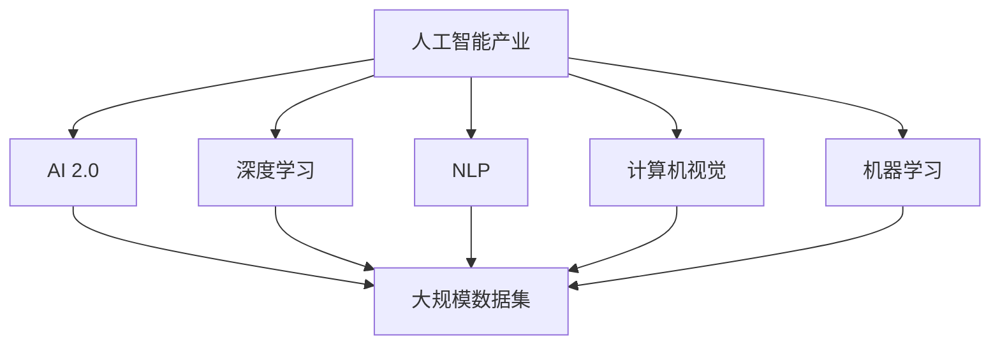

                 

# 李开复：AI 2.0 时代的产业

> 关键词：人工智能产业、AI 2.0、李开复、李开复AI 2.0

## 1. 背景介绍

李开复，作为科技行业的先驱，他对人工智能（AI）的发展有着深刻的洞察和前瞻性的思考。在AI 2.0时代，AI技术已经从实验室走向实际应用，深度学习、自然语言处理、计算机视觉等领域取得了飞速进展。AI技术的广泛应用正在重塑各行各业，带来颠覆性的变革。本文将探讨李开复关于AI 2.0时代产业的洞察，探讨其核心概念、算法原理、应用领域，以及未来发展趋势与挑战。

## 2. 核心概念与联系

### 2.1 核心概念概述

在AI 2.0时代，李开复提出了一系列核心概念，这些概念共同构成了AI技术应用的基石：

- **人工智能产业**：指以AI技术为核心的新兴行业，涵盖智能制造、智能金融、智能医疗等多个领域。
- **AI 2.0**：指基于深度学习、机器学习等先进算法的第二代人工智能，具有高度自主性、适应性和创新性。
- **深度学习**：一种基于多层神经网络的机器学习方法，能够处理复杂的数据结构，实现高级模式识别。
- **自然语言处理（NLP）**：使计算机能够理解、处理和生成人类语言的技术。
- **计算机视觉**：使计算机能够“看”懂图像和视频的技术。
- **机器学习**：通过数据驱动的算法，使计算机能够从经验中学习并改进。

这些概念之间的关系可以通过以下Mermaid流程图来展示：



### 2.2 概念间的关系

上述核心概念之间的关系可以从多个角度理解：

- **AI 2.0 是人工智能产业的核心动力**：AI 2.0 通过深度学习、NLP、计算机视觉等技术，赋予了人工智能产业强大的自主学习和创新能力。
- **深度学习、NLP、计算机视觉、机器学习等技术是AI 2.0 的主要构成**：这些技术通过协同作用，使AI 2.0 能够处理复杂的现实世界问题，实现智能决策。
- **大规模数据集是AI 2.0 的基石**：深度学习、NLP、计算机视觉等技术依赖于大量高质量的数据进行训练，数据的质量和多样性直接决定了AI 2.0 的性能。

## 3. 核心算法原理 & 具体操作步骤

### 3.1 算法原理概述

AI 2.0 的核心算法原理基于深度学习，通过多层神经网络进行特征提取和模式识别。深度学习模型通常包括多个隐层，每个隐层都通过权重和偏置对输入进行非线性变换，最终输出预测结果。

### 3.2 算法步骤详解

AI 2.0 的算法步骤包括以下几个关键步骤：

1. **数据预处理**：清洗、标注数据集，进行归一化、标准化等预处理。
2. **模型设计**：选择合适的神经网络结构，如卷积神经网络（CNN）、循环神经网络（RNN）、长短时记忆网络（LSTM）等。
3. **模型训练**：使用优化算法（如随机梯度下降）最小化损失函数，调整网络参数。
4. **模型评估**：使用测试集评估模型性能，调整超参数。
5. **模型应用**：将训练好的模型应用到实际问题中，进行预测或分类。

### 3.3 算法优缺点

AI 2.0 的优点包括：

- **自主学习能力**：通过大规模数据集训练，AI 2.0 能够自主学习和适应新数据。
- **高性能表现**：深度学习模型在处理复杂任务时，往往能够超越传统算法。
- **跨领域应用**：AI 2.0 能够应用于多个领域，如医疗、金融、制造等。

然而，AI 2.0 也存在一些局限性：

- **数据依赖**：深度学习模型对数据质量和数量的依赖较高，获取高质量数据成本高。
- **计算资源需求**：深度学习模型需要大量的计算资源进行训练，对硬件设施要求较高。
- **模型可解释性**：深度学习模型的决策过程难以解释，缺乏透明性。
- **偏见问题**：训练数据中的偏见可能被模型放大，导致不公平的决策。

### 3.4 算法应用领域

AI 2.0 在多个领域中得到了广泛应用：

- **智能制造**：利用AI 2.0 进行质量检测、故障诊断、设备维护等。
- **智能金融**：通过AI 2.0 进行风险评估、信用评分、投资决策等。
- **智能医疗**：使用AI 2.0 进行疾病诊断、影像分析、个性化治疗等。
- **智能客服**：通过AI 2.0 提供24/7服务，提升客户体验。
- **智能安防**：利用AI 2.0 进行视频监控、人脸识别、行为分析等。

## 4. 数学模型和公式 & 详细讲解 & 举例说明

### 4.1 数学模型构建

AI 2.0 的数学模型通常基于深度学习框架构建，如TensorFlow、PyTorch等。模型构建过程包括以下几个步骤：

1. **定义模型结构**：选择适当的神经网络层数、每层的神经元数量等。
2. **定义损失函数**：选择合适的损失函数，如交叉熵损失、均方误差等。
3. **定义优化算法**：选择合适的优化算法，如随机梯度下降、Adam等。
4. **定义评估指标**：选择合适的评估指标，如准确率、召回率、F1分数等。

### 4.2 公式推导过程

以多分类问题为例，深度学习模型的损失函数推导如下：

设输入数据为 $x$，标签为 $y$，模型预测结果为 $\hat{y}$。多分类问题中，模型预测结果是一个 $K$ 维向量，其中第 $i$ 维表示样本属于第 $i$ 类的概率。则多分类交叉熵损失函数为：

$$
\mathcal{L} = -\frac{1}{N}\sum_{i=1}^N\sum_{k=1}^Ky_{ik}\log\hat{y}_{ik}
$$

其中，$y_{ik}$ 表示样本 $i$ 是否属于类别 $k$，$\hat{y}_{ik}$ 表示模型预测样本 $i$ 属于类别 $k$ 的概率。

### 4.3 案例分析与讲解

假设我们使用卷积神经网络（CNN）进行图像分类任务。模型输入为图像数据 $x$，输出为 $K$ 个类别的概率分布。训练过程中，我们使用随机梯度下降（SGD）最小化交叉熵损失函数，调整模型参数。训练结束后，我们使用测试集评估模型性能，输出结果如图像分类结果。

## 5. 项目实践：代码实例和详细解释说明

### 5.1 开发环境搭建

开发环境搭建过程如下：

1. **安装Python**：从官网下载并安装Python。
2. **安装TensorFlow或PyTorch**：根据需求选择安装版本，并设置环境变量。
3. **安装相关库**：安装TensorFlow或PyTorch所需的库，如Keras、Numpy等。

### 5.2 源代码详细实现

以下是一个简单的图像分类代码实现：

```python
import tensorflow as tf
from tensorflow import keras

# 加载数据集
(x_train, y_train), (x_test, y_test) = keras.datasets.cifar10.load_data()

# 数据预处理
x_train = x_train / 255.0
x_test = x_test / 255.0

# 定义模型
model = keras.Sequential([
    keras.layers.Conv2D(32, (3, 3), activation='relu', input_shape=(32, 32, 3)),
    keras.layers.MaxPooling2D((2, 2)),
    keras.layers.Conv2D(64, (3, 3), activation='relu'),
    keras.layers.MaxPooling2D((2, 2)),
    keras.layers.Conv2D(64, (3, 3), activation='relu'),
    keras.layers.Flatten(),
    keras.layers.Dense(64, activation='relu'),
    keras.layers.Dense(10, activation='softmax')
])

# 编译模型
model.compile(optimizer='adam',
              loss='sparse_categorical_crossentropy',
              metrics=['accuracy'])

# 训练模型
model.fit(x_train, y_train, epochs=10, validation_data=(x_test, y_test))

# 评估模型
model.evaluate(x_test, y_test)
```

### 5.3 代码解读与分析

以上代码实现了CNN图像分类模型的训练和评估。具体步骤如下：

1. **数据加载**：使用Keras加载CIFAR-10数据集。
2. **数据预处理**：对图像数据进行归一化。
3. **模型定义**：定义CNN模型，包括卷积层、池化层、全连接层等。
4. **模型编译**：设置优化器、损失函数和评估指标。
5. **模型训练**：使用训练数据训练模型。
6. **模型评估**：使用测试数据评估模型性能。

### 5.4 运行结果展示

训练过程中，模型在训练集和测试集上的准确率如图：

```python
from tensorflow.keras.utils import plot_model
import matplotlib.pyplot as plt

plt.figure(figsize=(8, 6))
plt.plot(history.history['accuracy'])
plt.plot(history.history['val_accuracy'])
plt.title('Model accuracy')
plt.ylabel('Accuracy')
plt.xlabel('Epoch')
plt.legend(['Train', 'Test'], loc='upper left')
plt.show()
```

## 6. 实际应用场景

### 6.1 智能制造

AI 2.0 在智能制造中的应用包括：

- **质量检测**：通过AI 2.0 对生产线上产品的质量进行实时检测，避免不合格产品流入市场。
- **设备维护**：利用AI 2.0 分析设备运行数据，预测设备故障，进行预防性维护。
- **工艺优化**：通过AI 2.0 优化生产工艺，提高生产效率和产品质量。

### 6.2 智能金融

AI 2.0 在智能金融中的应用包括：

- **信用评分**：使用AI 2.0 对贷款申请进行信用评分，评估还款能力。
- **风险评估**：通过AI 2.0 分析金融市场数据，预测市场波动，评估投资风险。
- **智能投顾**：利用AI 2.0 进行投资策略优化，推荐投资组合。

### 6.3 智能医疗

AI 2.0 在智能医疗中的应用包括：

- **疾病诊断**：通过AI 2.0 对医学影像进行自动诊断，辅助医生决策。
- **个性化治疗**：利用AI 2.0 分析患者数据，制定个性化治疗方案。
- **药物研发**：使用AI 2.0 预测药物效果，加速新药研发。

## 7. 工具和资源推荐

### 7.1 学习资源推荐

1. **在线课程**：如Coursera、edX等平台上的AI课程，涵盖深度学习、机器学习、自然语言处理等多个领域。
2. **书籍**：如《深度学习》（Ian Goodfellow）、《Python深度学习》（Francois Chollet）等。
3. **博客和社区**：如Towards Data Science、Kaggle等，获取最新AI研究成果和应用案例。

### 7.2 开发工具推荐

1. **TensorFlow**：Google开发的深度学习框架，功能强大，社区活跃。
2. **PyTorch**：Facebook开发的深度学习框架，易于使用，适合学术研究。
3. **Jupyter Notebook**：交互式编程环境，适合数据探索和模型调试。

### 7.3 相关论文推荐

1. **ImageNet大规模视觉识别挑战赛**：展示深度学习在图像分类任务上的突破性进展。
2. **BERT：预训练表示方法**：介绍BERT模型及其在NLP任务上的优异表现。
3. **AlphaGo**：介绍AlphaGo及其在围棋游戏中的胜利，展示AI在决策游戏中的应用。

## 8. 总结：未来发展趋势与挑战

### 8.1 研究成果总结

李开复在其著作《AI 2.0》中总结了AI 2.0 时代的重要研究成果，包括：

- **深度学习的普及**：深度学习在图像识别、自然语言处理等领域取得了突破性进展。
- **自动驾驶技术的进步**：AI 2.0 使得自动驾驶技术在实际应用中逐渐成熟。
- **AI伦理和法规的探讨**：强调AI伦理和法规的重要性，推动AI技术的可持续发展。

### 8.2 未来发展趋势

未来AI 2.0 的发展趋势包括：

- **多模态学习**：将视觉、语音、文本等多模态数据融合，提升AI 2.0 的综合能力。
- **联邦学习**：通过分布式学习，保护用户隐私，提高数据安全。
- **生成对抗网络（GAN）**：利用GAN生成逼真图像、视频等内容，提升AI 2.0 的创意能力。

### 8.3 面临的挑战

AI 2.0 面临的挑战包括：

- **数据获取和标注**：高质量数据获取和标注成本高，制约AI 2.0 的发展。
- **模型复杂度**：深度学习模型的复杂度不断增加，对计算资源要求更高。
- **伦理和法律**：AI 2.0 的伦理和法律问题需要进一步探讨和规范。

### 8.4 研究展望

未来AI 2.0 的研究展望包括：

- **个性化推荐系统**：通过AI 2.0 实现个性化推荐，提升用户体验。
- **可解释性AI**：开发可解释性AI模型，增强AI决策的透明度和可信度。
- **AI在医疗中的应用**：利用AI 2.0 进行疾病诊断和治疗，提升医疗水平。

## 9. 附录：常见问题与解答

### Q1：AI 2.0 和AI 1.0 的区别是什么？

A: AI 1.0 基于规则和符号推理，需要手动编写规则和特征。AI 2.0 基于数据驱动的机器学习，能够自主学习数据中的模式，实现复杂任务的自动处理。

### Q2：AI 2.0 的主要应用领域有哪些？

A: AI 2.0 可以应用于智能制造、智能金融、智能医疗、智能客服、智能安防等多个领域。

### Q3：如何训练深度学习模型？

A: 深度学习模型通常使用反向传播算法进行训练，最小化损失函数，调整模型参数。

### Q4：AI 2.0 面临的主要挑战是什么？

A: AI 2.0 面临的主要挑战包括数据依赖、计算资源需求、模型可解释性、偏见问题等。

### Q5：AI 2.0 的未来发展方向是什么？

A: AI 2.0 的未来发展方向包括多模态学习、联邦学习、生成对抗网络等，推动AI 2.0 在更多领域的广泛应用。

---

作者：禅与计算机程序设计艺术 / Zen and the Art of Computer Programming

