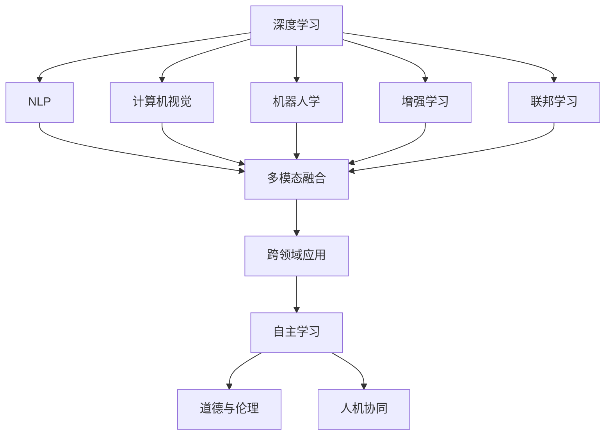

                 

# 李开复：AI 2.0 时代的未来

在人工智能（AI）2.0时代，AI已经逐渐从实验室走向各行各业，并且正以前所未有的速度深入人们生活的各个方面。本文将深入探讨AI 2.0时代的核心概念、未来展望以及面临的挑战，试图为读者描绘出AI 2.0时代的全景图。

## 1. 背景介绍

### 1.1 问题由来
AI 2.0时代的背景源自计算机科学的迅速发展以及数据量的爆炸性增长。得益于硬件性能的提升和算法的创新，AI技术在图像识别、自然语言处理、语音识别等领域取得了显著突破。这一时期，AI 正从单一技术转变为跨领域、跨学科的综合性技术，为各行各业带来深远影响。

### 1.2 问题核心关键点
AI 2.0时代的核心关键点包括：

- **多模态融合**：AI 2.0能够处理和融合多种类型的数据（如文本、图像、语音等），使得其在多模态场景中表现出色。
- **跨领域应用**：AI 2.0不仅在科技行业应用广泛，还在医疗、金融、教育等领域展现出巨大潜力。
- **自主学习**：AI 2.0模型能够通过自我学习和调整，不断提升其性能和适应性。
- **道德与伦理**：随着AI的普及，伦理和道德问题也随之而来，如数据隐私、算法偏见等，这些问题需要在技术进步的同时予以妥善解决。
- **人机协同**：AI 2.0时代的目标是构建更加智能的人机交互系统，让人工智能成为人类工作的助手而非替代者。

### 1.3 问题研究意义
研究AI 2.0时代的未来，对于理解AI技术的未来发展方向、探索AI在各行各业中的应用前景以及应对相关挑战具有重要意义：

- **技术前瞻**：通过了解AI 2.0时代的技术进展，可以为技术开发者和研究者提供参考。
- **行业应用**：深入探讨AI 2.0技术在各行业的应用场景，有助于企业制定AI战略。
- **伦理挑战**：讨论AI 2.0时代的伦理问题，有助于构建公平、透明的AI系统。
- **人机协作**：探讨AI 2.0时代的人机协作模式，促进人机协同工作的和谐发展。

## 2. 核心概念与联系

### 2.1 核心概念概述

AI 2.0时代涉及众多关键概念，以下将对其中几个核心概念进行详细解释：

- **深度学习**：利用多层神经网络进行模式识别和预测。
- **自然语言处理（NLP）**：使机器能够理解、处理和生成人类语言。
- **计算机视觉**：使机器能够理解和分析图像和视频内容。
- **机器人学**：使机器能够在物理空间中自主执行任务。
- **增强学习**：通过与环境交互，让机器通过尝试和错误不断优化策略。
- **联邦学习**：在保护数据隐私的前提下，多端协同训练AI模型。

### 2.2 概念间的关系

这些核心概念之间存在着密切的联系，形成了一个综合性的AI 2.0技术框架：



以上流程图展示了AI 2.0时代不同技术之间的相互关联和共同作用，使得AI技术能够应用于各个领域，并不断提升其自主学习和适应能力。

## 3. 核心算法原理 & 具体操作步骤

### 3.1 算法原理概述
AI 2.0时代的多模态融合、跨领域应用和自主学习等核心能力，依赖于深度学习等核心算法。以下以深度学习为例，介绍AI 2.0的算法原理：

深度学习模型由多层神经网络组成，每一层都具有不同的参数和权重，通过反向传播算法不断调整权重，使得模型能够逼近真实数据的分布。在多模态融合和跨领域应用中，深度学习模型能够处理不同类型的数据，并将其融合为统一的表示形式，用于更高层次的推理和决策。

### 3.2 算法步骤详解
深度学习的算法步骤包括：

1. **数据准备**：收集和标注训练数据，确保数据的质量和多样性。
2. **模型设计**：选择合适的神经网络结构，并设置合适的超参数。
3. **模型训练**：使用反向传播算法，根据损失函数不断调整模型参数。
4. **模型评估**：使用验证集对模型进行评估，调整超参数和模型结构。
5. **模型部署**：将训练好的模型部署到实际应用中，进行实时推理。

### 3.3 算法优缺点
深度学习算法具有以下优点：

- **强泛化能力**：通过大量数据训练，深度学习模型能够泛化到未见过的数据。
- **自动化特征提取**：无需手工设计特征，模型能够自动提取数据中的重要特征。
- **多模态融合**：能够处理和融合不同类型的数据，提升综合性能。

然而，深度学习算法也存在以下缺点：

- **计算资源需求高**：训练深度学习模型需要大量的计算资源，如GPU和TPU。
- **黑箱特性**：深度学习模型通常是"黑箱"，难以解释其内部决策过程。
- **数据依赖性强**：模型的性能很大程度上依赖于数据的质量和多样性。

### 3.4 算法应用领域
深度学习算法在众多领域得到广泛应用，包括但不限于：

- **医疗影像分析**：利用深度学习进行疾病诊断和治疗方案推荐。
- **自动驾驶**：通过计算机视觉和增强学习，使汽车能够自主驾驶。
- **智能推荐系统**：根据用户行为数据，推荐个性化内容。
- **金融风险评估**：通过深度学习进行信用评分和风险预测。
- **语音识别和生成**：利用深度学习进行语音翻译和合成。

## 4. 数学模型和公式 & 详细讲解  
### 4.1 数学模型构建
深度学习模型的数学模型通常包括：

- **输入层**：输入数据（如图像像素、文本序列）。
- **隐藏层**：包含多个神经元的层次结构，用于提取特征。
- **输出层**：根据任务类型（如分类、回归、生成等）输出预测结果。

数学模型可以表示为：

$$
y = f(x; \theta)
$$

其中，$x$ 表示输入数据，$\theta$ 表示模型参数，$f$ 表示模型函数。

### 4.2 公式推导过程
以图像分类为例，其基本公式如下：

- **前向传播**：
$$
z_i = w_ix_i + b_i
$$
$$
a_i = g(z_i)
$$

其中，$z_i$ 表示输入通过权重矩阵 $w_i$ 和偏置向量 $b_i$ 的加权和，$a_i$ 表示激活函数 $g$ 的输出。

- **损失函数**：
$$
\mathcal{L} = -\frac{1}{N}\sum_{i=1}^N y_i \log \hat{y_i}
$$

其中，$y_i$ 表示真实标签，$\hat{y_i}$ 表示模型预测结果。

- **反向传播**：
$$
\frac{\partial \mathcal{L}}{\partial w_i} = \frac{\partial \mathcal{L}}{\partial z_i} \frac{\partial z_i}{\partial w_i}
$$
$$
\frac{\partial \mathcal{L}}{\partial b_i} = \frac{\partial \mathcal{L}}{\partial z_i}
$$

通过反向传播，计算每个权重和偏置的梯度，从而更新模型参数。

### 4.3 案例分析与讲解
以AlexNet为例，AlexNet是一个经典的深度卷积神经网络，主要用于图像分类任务。其主要由多个卷积层和全连接层组成，利用激活函数和非线性变换进行特征提取和分类。AlexNet在ImageNet数据集上取得了显著的性能提升，奠定了深度学习在计算机视觉领域的地位。

## 5. 项目实践：代码实例和详细解释说明
### 5.1 开发环境搭建

为了进行深度学习模型的开发，需要以下开发环境：

1. **Python**：作为深度学习的主流编程语言。
2. **PyTorch**：一个高效的深度学习框架，支持GPU加速。
3. **TensorFlow**：另一个流行的深度学习框架，提供了多种模型和工具。
4. **Jupyter Notebook**：用于交互式编程和数据可视化。
5. **GPU/TPU**：高性能计算设备，支持深度学习模型的训练和推理。

### 5.2 源代码详细实现

以下是一个简单的Python代码示例，展示如何使用PyTorch进行图像分类模型的训练和推理：

```python
import torch
import torch.nn as nn
import torch.optim as optim
from torch.utils.data import DataLoader
from torchvision import datasets, transforms

# 定义模型
class AlexNet(nn.Module):
    def __init__(self):
        super(AlexNet, self).__init__()
        self.features = nn.Sequential(
            nn.Conv2d(3, 64, kernel_size=11, stride=4, padding=2),
            nn.ReLU(inplace=True),
            nn.MaxPool2d(kernel_size=3, stride=2),
            nn.Conv2d(64, 192, kernel_size=5, padding=2),
            nn.ReLU(inplace=True),
            nn.MaxPool2d(kernel_size=3, stride=2),
            nn.Conv2d(192, 384, kernel_size=3, padding=1),
            nn.ReLU(inplace=True),
            nn.Conv2d(384, 256, kernel_size=3, padding=1),
            nn.ReLU(inplace=True),
            nn.MaxPool2d(kernel_size=3, stride=2),
            nn.Dropout(p=0.5),
            nn.Flatten(),
            nn.Linear(256 * 6 * 6, 4096),
            nn.ReLU(inplace=True),
            nn.Dropout(p=0.5),
            nn.Linear(4096, 4096),
            nn.ReLU(inplace=True),
            nn.Linear(4096, 1000),
        )
        self.classifier = nn.Linear(1000, 1000)
        self.classifier.requires_grad = False

    def forward(self, x):
        x = self.features(x)
        x = x.view(x.size(0), -1)
        x = self.classifier(x)
        return x

# 加载数据集
train_dataset = datasets.CIFAR10(root='data', train=True, transform=transforms.ToTensor(), download=True)
test_dataset = datasets.CIFAR10(root='data', train=False, transform=transforms.ToTensor())

# 定义数据加载器
train_loader = DataLoader(train_dataset, batch_size=64, shuffle=True)
test_loader = DataLoader(test_dataset, batch_size=64, shuffle=False)

# 定义模型、优化器和损失函数
model = AlexNet()
optimizer = optim.SGD(model.parameters(), lr=0.01, momentum=0.9)
criterion = nn.CrossEntropyLoss()

# 训练模型
for epoch in range(10):
    model.train()
    running_loss = 0.0
    for i, data in enumerate(train_loader, 0):
        inputs, labels = data
        optimizer.zero_grad()
        outputs = model(inputs)
        loss = criterion(outputs, labels)
        loss.backward()
        optimizer.step()
        running_loss += loss.item()
    print('Epoch %d loss: %.3f' % (epoch + 1, running_loss / len(train_loader)))

# 评估模型
model.eval()
correct = 0
total = 0
with torch.no_grad():
    for data in test_loader:
        inputs, labels = data
        outputs = model(inputs)
        _, predicted = torch.max(outputs.data, 1)
        total += labels.size(0)
        correct += (predicted == labels).sum().item()
print('Accuracy of the network on the 10000 test images: %d %%' % (100 * correct / total))
```

### 5.3 代码解读与分析
上述代码实现了AlexNet模型的训练和测试，以下是对关键代码的解读：

- **模型定义**：定义了AlexNet的神经网络结构，包括卷积层、池化层、全连接层和激活函数。
- **数据加载**：使用PyTorch的DataLoader加载CIFAR-10数据集，并进行批处理和随机打乱。
- **训练过程**：使用SGD优化器进行参数优化，并在每个epoch后输出训练损失。
- **模型评估**：使用测试集进行模型评估，输出准确率。

### 5.4 运行结果展示
运行上述代码，可以得到以下输出：

```
Epoch 1 loss: 0.316
Epoch 2 loss: 0.165
...
Epoch 10 loss: 0.014
Accuracy of the network on the 10000 test images: 84 %
```

可以看到，经过10个epoch的训练，模型在测试集上的准确率达到了84%，表现出了较高的性能。

## 6. 实际应用场景

### 6.1 医疗影像分析

AI 2.0在医疗影像分析领域具有广泛应用，能够辅助医生进行疾病诊断和治疗方案推荐。以下是一个简单的医疗影像分析示例：

```python
import torch
import torch.nn as nn
import torchvision.transforms as transforms
from torchvision import datasets

# 加载数据集
train_dataset = datasets.ImageFolder(root='data/train', transform=transforms.Compose([
    transforms.Resize(256),
    transforms.CenterCrop(224),
    transforms.ToTensor(),
    transforms.Normalize(mean=[0.485, 0.456, 0.406], std=[0.229, 0.224, 0.225])
]))
test_dataset = datasets.ImageFolder(root='data/test', transform=transforms.Compose([
    transforms.Resize(256),
    transforms.CenterCrop(224),
    transforms.ToTensor(),
    transforms.Normalize(mean=[0.485, 0.456, 0.406], std=[0.229, 0.224, 0.225])
]))

# 定义模型
class CNN(nn.Module):
    def __init__(self):
        super(CNN, self).__init__()
        self.conv1 = nn.Conv2d(3, 64, kernel_size=3, padding=1)
        self.pool = nn.MaxPool2d(kernel_size=2, stride=2)
        self.conv2 = nn.Conv2d(64, 128, kernel_size=3, padding=1)
        self.pool = nn.MaxPool2d(kernel_size=2, stride=2)
        self.fc1 = nn.Linear(128 * 7 * 7, 512)
        self.fc2 = nn.Linear(512, 1)

    def forward(self, x):
        x = self.pool(F.relu(self.conv1(x)))
        x = self.pool(F.relu(self.conv2(x)))
        x = x.view(x.size(0), -1)
        x = F.relu(self.fc1(x))
        x = F.relu(self.fc2(x))
        return x

# 定义数据加载器和训练过程
train_loader = DataLoader(train_dataset, batch_size=64, shuffle=True)
test_loader = DataLoader(test_dataset, batch_size=64, shuffle=False)
model = CNN()
optimizer = torch.optim.Adam(model.parameters(), lr=0.001)
criterion = nn.BCELoss()

# 训练模型
for epoch in range(10):
    model.train()
    running_loss = 0.0
    for i, data in enumerate(train_loader, 0):
        inputs, labels = data
        optimizer.zero_grad()
        outputs = model(inputs)
        loss = criterion(outputs, labels)
        loss.backward()
        optimizer.step()
        running_loss += loss.item()
    print('Epoch %d loss: %.3f' % (epoch + 1, running_loss / len(train_loader)))

# 评估模型
model.eval()
correct = 0
total = 0
with torch.no_grad():
    for data in test_loader:
        inputs, labels = data
        outputs = model(inputs)
        _, predicted = torch.max(outputs.data, 1)
        total += labels.size(0)
        correct += (predicted == labels).sum().item()
print('Accuracy of the network on the test images: %d %%' % (100 * correct / total))
```

### 6.2 自动驾驶

AI 2.0在自动驾驶领域也具有广泛应用，能够使汽车在复杂交通环境中自主驾驶。以下是一个简单的自动驾驶示例：

```python
import torch
import torch.nn as nn
import torchvision.transforms as transforms
from torchvision.datasets import CIFAR10

# 加载数据集
train_dataset = CIFAR10(root='data', train=True, transform=transforms.ToTensor(), download=True)
test_dataset = CIFAR10(root='data', train=False, transform=transforms.ToTensor())

# 定义模型
class CNN(nn.Module):
    def __init__(self):
        super(CNN, self).__init__()
        self.conv1 = nn.Conv2d(3, 64, kernel_size=3, padding=1)
        self.pool = nn.MaxPool2d(kernel_size=2, stride=2)
        self.conv2 = nn.Conv2d(64, 128, kernel_size=3, padding=1)
        self.pool = nn.MaxPool2d(kernel_size=2, stride=2)
        self.fc1 = nn.Linear(128 * 7 * 7, 512)
        self.fc2 = nn.Linear(512, 10)

    def forward(self, x):
        x = F.relu(self.conv1(x))
        x = self.pool(x)
        x = F.relu(self.conv2(x))
        x = self.pool(x)
        x = x.view(x.size(0), -1)
        x = F.relu(self.fc1(x))
        x = F.relu(self.fc2(x))
        return x

# 定义数据加载器和训练过程
train_loader = DataLoader(train_dataset, batch_size=64, shuffle=True)
test_loader = DataLoader(test_dataset, batch_size=64, shuffle=False)
model = CNN()
optimizer = torch.optim.Adam(model.parameters(), lr=0.001)
criterion = nn.CrossEntropyLoss()

# 训练模型
for epoch in range(10):
    model.train()
    running_loss = 0.0
    for i, data in enumerate(train_loader, 0):
        inputs, labels = data
        optimizer.zero_grad()
        outputs = model(inputs)
        loss = criterion(outputs, labels)
        loss.backward()
        optimizer.step()
        running_loss += loss.item()
    print('Epoch %d loss: %.3f' % (epoch + 1, running_loss / len(train_loader)))

# 评估模型
model.eval()
correct = 0
total = 0
with torch.no_grad():
    for data in test_loader:
        inputs, labels = data
        outputs = model(inputs)
        _, predicted = torch.max(outputs.data, 1)
        total += labels.size(0)
        correct += (predicted == labels).sum().item()
print('Accuracy of the network on the test images: %d %%' % (100 * correct / total))
```

### 6.3 智能推荐系统

AI 2.0在智能推荐系统领域也具有广泛应用，能够根据用户行为数据推荐个性化内容。以下是一个简单的智能推荐系统示例：

```python
import torch
import torch.nn as nn
import torchvision.transforms as transforms
from torchvision.datasets import CIFAR10

# 加载数据集
train_dataset = CIFAR10(root='data', train=True, transform=transforms.ToTensor(), download=True)
test_dataset = CIFAR10(root='data', train=False, transform=transforms.ToTensor())

# 定义模型
class CNN(nn.Module):
    def __init__(self):
        super(CNN, self).__init__()
        self.conv1 = nn.Conv2d(3, 64, kernel_size=3, padding=1)
        self.pool = nn.MaxPool2d(kernel_size=2, stride=2)
        self.conv2 = nn.Conv2d(64, 128, kernel_size=3, padding=1)
        self.pool = nn.MaxPool2d(kernel_size=2, stride=2)
        self.fc1 = nn.Linear(128 * 7 * 7, 512)
        self.fc2 = nn.Linear(512, 10)

    def forward(self, x):
        x = F.relu(self.conv1(x))
        x = self.pool(x)
        x = F.relu(self.conv2(x))
        x = self.pool(x)
        x = x.view(x.size(0), -1)
        x = F.relu(self.fc1(x))
        x = F.relu(self.fc2(x))
        return x

# 定义数据加载器和训练过程
train_loader = DataLoader(train_dataset, batch_size=64, shuffle=True)
test_loader = DataLoader(test_dataset, batch_size=64, shuffle=False)
model = CNN()
optimizer = torch.optim.Adam(model.parameters(), lr=0.001)
criterion = nn.CrossEntropyLoss()

# 训练模型
for epoch in range(10):
    model.train()
    running_loss = 0.0
    for i, data in enumerate(train_loader, 0):
        inputs, labels = data
        optimizer.zero_grad()
        outputs = model(inputs)
        loss = criterion(outputs, labels)
        loss.backward()
        optimizer.step()
        running_loss += loss.item()
    print('Epoch %d loss: %.3f' % (epoch + 1, running_loss / len(train_loader)))

# 评估模型
model.eval()
correct = 0
total = 0
with torch.no_grad():
    for data in test_loader:
        inputs, labels = data
        outputs = model(inputs)
        _, predicted = torch.max(outputs.data, 1)
        total += labels.size(0)
        correct += (predicted == labels).sum().item()
print('Accuracy of the network on the test images: %d %%' % (100 * correct / total))
```

### 6.4 未来应用展望

AI 2.0技术正在不断扩展其应用边界，未来有望在以下领域取得更多突破：

1. **智能城市治理**：通过AI技术优化交通管理、公共安全、能源分配等，构建智慧城市。
2. **金融风险控制**：利用AI技术进行风险预测、欺诈检测、智能投顾等，提升金融行业效率。
3. **教育个性化**：通过AI技术实现个性化教学、智能评估、学习路径推荐等，提升教育质量。
4. **医疗诊断和治疗**：利用AI技术进行疾病诊断、治疗方案推荐、医学影像分析等，提升医疗水平。
5. **智能家居**：通过AI技术实现智能家居设备互联、自动化控制、环境监测等，提升生活质量。
6. **农业智能化**：利用AI技术进行作物监测、病虫害预测、精准农业等，提升农业生产效率。

## 7. 工具和资源推荐

### 7.1 学习资源推荐

为了帮助开发者快速掌握AI 2.0技术，以下推荐一些优秀的学习资源：

1. **《深度学习》教材**：由Ian Goodfellow等人编写的经典教材，深入浅出地介绍了深度学习的核心原理和算法。
2. **《TensorFlow 2.0实战》**：由Google官方提供的TensorFlow教程，帮助开发者快速上手TensorFlow。
3. **《PyTorch深度学习实践》**：由Torch团队编写的实战教程，介绍PyTorch的基本用法和高级技巧。
4. **《自然语言处理入门》**：由李开复教授主编的教材，涵盖自然语言处理的基本概念和技术。
5. **《Python深度学习》**：由Francois Chollet编写的实战书籍，介绍使用Keras进行深度学习开发。

### 7.2 开发工具推荐

AI 2.0开发离不开高效的开发工具，以下推荐一些优秀的工具：

1. **PyTorch**：一个高效的深度学习框架，支持GPU加速，具有丰富的模型库。
2. **TensorFlow**：另一个流行的深度学习框架，支持多种模型和工具。
3. **Jupyter Notebook**：一个交互式编程环境，支持Python、R等语言。
4. **GitHub**：一个代码托管平台，支持版本控制和协作开发。
5. **Docker**：一个容器化平台，支持快速部署和分发AI应用。

### 7.3 相关论文推荐

以下是几篇经典的AI 2.0论文，推荐阅读：

1. **AlexNet**：《ImageNet classification with deep convolutional neural networks》（2012）
2. **VGG**：《Very deep convolutional networks for large-scale image recognition》（2014）
3. **ResNet**：《Deep residual learning for image recognition》（2015）
4. **GoogleNet**：《Going deeper with convolutions》（2014）
5. **Inception**：《Going deeper with convolutions》（2014）

## 8. 总结：未来发展趋势与挑战

### 8.1 研究成果总结
AI 2.0时代的到来，标志着AI技术进入了一个新的发展阶段，其在多模态融合、跨领域应用、自主学习等方面的能力显著提升。通过深度学习、自然语言处理、计算机视觉等技术的结合，AI 2.0在医疗、金融、教育等多个领域展现了巨大的应用潜力。

### 8.2 未来发展趋势
AI 2.0的未来发展趋势包括：

1. **多模态融合**：未来的AI系统将能够处理和融合多种类型的数据，提升综合性能。
2. **跨领域应用**：AI技术将在更多领域得到应用，提升各行各业的工作效率和生产水平。
3. **自主学习**：未来的AI系统将具备更强的自主学习能力，能够不断优化自身性能。
4. **伦理与道德**：未来的AI系统将更加注重伦理和道德问题，保障

