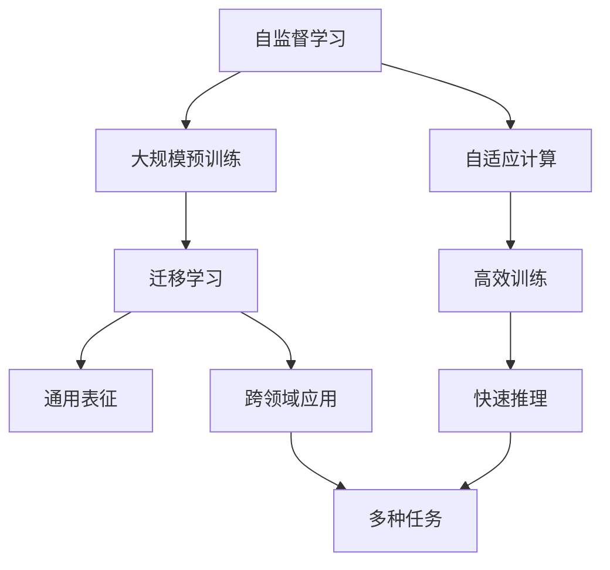

                 

# 李开复：AI 2.0 时代的机遇

在人工智能（AI）领域，一个关键的转折点正在发生。正如人类社会的第二次工业革命从电力和化学等领域的突破性应用中诞生一样，我们正见证着AI 2.0时代的到来，这是一个充满机遇和挑战的新纪元。本文将探讨AI 2.0时代的主要特征、机遇，并分析其对未来的深远影响。

## 1. 背景介绍

### 1.1 人工智能的进化历程

自1950年Alan Turing提出图灵测试以来，人工智能经历了数十年的发展。从最初的基于规则的系统，到1990年代神经网络和深度学习的兴起，再到21世纪大数据和计算资源的飞跃，AI技术逐步从理论走向实践，从实验室走向市场。

#### 1.1.1 人工智能的三个阶段

1. **AI 1.0: 规则驱动的专家系统**（1970年代至1990年代）
   - 专家系统依赖于专家知识的编码，通过规则和逻辑判断解决特定问题。
   - 典型应用：诊断系统、推荐系统、决策支持系统。

2. **AI 1.5: 机器学习和数据驱动**（2000年至2010年代）
   - 机器学习利用数据进行训练，从大量数据中学习模式和规律，应用包括文本分类、图像识别、语音识别等。
   - 典型应用：推荐系统、搜索引擎、个性化广告。

3. **AI 2.0: 自监督学习和通用智能**（2010年代至今）
   - 自监督学习通过大量无标签数据进行训练，学习通用的语言和视觉表征，构建具有普遍认知和推理能力的模型。
   - 典型应用：语言模型、图像生成、自然语言处理（NLP）。

### 1.2 AI 2.0时代的关键特征

AI 2.0时代的主要特征包括：

- **自监督学习**：从大量无标签数据中学习表征，减少对标注数据的需求。
- **大规模预训练**：使用大规模数据进行预训练，构建强大的初始模型。
- **通用表征**：构建通用的语言和视觉表征，具有更强的迁移学习能力。
- **跨领域应用**：模型能够跨越不同领域，应用于多种任务。
- **高效计算**：利用高性能计算资源，快速训练和推理。

这些特征使得AI 2.0时代的模型在处理复杂任务时具有更强的适应性和效率。

## 2. 核心概念与联系

### 2.1 核心概念概述

为了更好地理解AI 2.0时代的技术，我们将介绍几个关键概念：

- **自监督学习**：使用大量无标签数据进行训练，学习通用表征。
- **大规模预训练**：在大量数据上预训练模型，构建初始权重。
- **迁移学习**：将预训练模型在特定任务上进行微调，提高任务性能。
- **通用表征**：构建跨越不同领域的语言和视觉表征，提高模型的通用性。
- **自适应计算**：利用高性能计算资源，实现快速训练和推理。

这些概念之间存在紧密的联系，形成一个完整的AI 2.0技术生态系统。

### 2.2 概念间的关系

通过以下Mermaid流程图，我们可以更好地理解这些概念之间的联系：



- **自监督学习**：为大规模预训练提供了基础，利用无标签数据学习表征。
- **大规模预训练**：在大量数据上预训练模型，构建初始权重，为迁移学习提供基础。
- **迁移学习**：将预训练模型应用于特定任务，提高任务性能，实现通用表征。
- **通用表征**：通过迁移学习构建，提高模型的跨领域适应能力。
- **自适应计算**：利用高性能计算资源，实现快速训练和推理。

## 3. 核心算法原理 & 具体操作步骤

### 3.1 算法原理概述

AI 2.0时代的主要算法原理包括自监督学习、大规模预训练、迁移学习和自适应计算。

#### 3.1.1 自监督学习

自监督学习通过从大量无标签数据中学习表征，减少对标注数据的需求。其核心思想是利用数据本身的特点，通过构造自监督任务进行训练。

#### 3.1.2 大规模预训练

大规模预训练是在大量数据上预训练模型，构建初始权重。这一过程通常使用自监督学习任务，如掩码语言模型、自编码器等，使得模型学习到丰富的语言和视觉表征。

#### 3.1.3 迁移学习

迁移学习是将预训练模型在特定任务上进行微调，提高任务性能。这一过程通常包括冻结预训练层和微调顶层，以保持模型的通用性和特定任务性能的提升。

#### 3.1.4 自适应计算

自适应计算利用高性能计算资源，实现快速训练和推理。这包括使用GPU、TPU等硬件加速，以及优化计算图、并行训练等技术。

### 3.2 算法步骤详解

下面是AI 2.0时代的核心算法详细步骤：

1. **数据准备**：收集和预处理大量无标签数据，用于自监督学习。
2. **预训练模型选择**：选择合适的预训练模型，如BERT、GPT等，用于大规模预训练。
3. **预训练过程**：在大量数据上进行自监督学习，学习通用表征。
4. **微调过程**：将预训练模型在特定任务上进行微调，提高任务性能。
5. **部署与优化**：利用高性能计算资源进行快速训练和推理，优化模型性能。

### 3.3 算法优缺点

AI 2.0时代的大规模预训练和自监督学习方法具有以下优点：

- **高效性**：在大量数据上预训练模型，能够快速获得高质量的表征。
- **通用性**：学习到通用的语言和视觉表征，能够应用于多种任务。
- **迁移能力**：预训练模型具有良好的迁移学习能力，能够在少量数据上进行微调。

但同时，这些方法也存在一些缺点：

- **计算资源需求高**：大规模预训练和自监督学习需要大量计算资源。
- **训练时间较长**：大规模数据集的预训练和微调过程需要较长时间。
- **数据依赖**：模型效果依赖于数据质量，数据偏见可能导致模型偏见。

### 3.4 算法应用领域

AI 2.0时代的算法在多个领域中得到了广泛应用：

- **自然语言处理**：利用预训练语言模型进行文本分类、情感分析、机器翻译等任务。
- **计算机视觉**：利用预训练视觉模型进行图像识别、物体检测、图像生成等任务。
- **语音识别**：利用预训练声学模型进行语音识别、情感分析等任务。
- **推荐系统**：利用预训练模型进行用户行为分析和个性化推荐。

## 4. 数学模型和公式 & 详细讲解 & 举例说明

### 4.1 数学模型构建

AI 2.0时代的核心模型包括预训练语言模型和视觉模型。以下以BERT模型为例，介绍其数学模型构建。

- **掩码语言模型**：
  $$
  \text{Masked Language Model (MLM)} = \max_{i=1,2,\dots,N} P(w_i|w_1,w_2,\dots,w_i,w_{i+1},\dots,w_N)
  $$

- **自编码器**：
  $$
  \text{Autoencoder} = \arg\min_{x'} \|x-x'\|
  $$

### 4.2 公式推导过程

以BERT模型为例，推导其自监督学习过程：

1. **掩码语言模型**：
   $$
   \text{MLM loss} = -\sum_{i=1}^{N} \log P(w_i|w_1,w_2,\dots,w_i,w_{i+1},\dots,w_N)
   $$

2. **自编码器**：
   $$
   \text{Autoencoder loss} = \frac{1}{N} \sum_{i=1}^{N} \|x-x'\|
   $$

### 4.3 案例分析与讲解

以BERT模型为例，分析其在文本分类任务中的应用：

- **数据预处理**：将文本转换为BERT可以接受的格式，包括token化、添加[CLS]和[SEP]标记等。
- **预训练过程**：在大量无标签数据上训练BERT模型，学习通用表征。
- **微调过程**：冻结预训练层，只微调顶层，在特定任务上微调模型。
- **结果分析**：分析模型在特定任务上的性能提升，评估模型的迁移学习能力。

## 5. 项目实践：代码实例和详细解释说明

### 5.1 开发环境搭建

在AI 2.0时代，构建项目环境需要以下步骤：

1. **安装Python和PyTorch**：
   ```
   conda install python=3.7
   pip install torch torchvision torchaudio transformers
   ```

2. **数据准备**：收集和预处理数据，包括文本数据和图像数据。

### 5.2 源代码详细实现

以下是一个使用BERT模型进行文本分类的Python代码实现：

```python
from transformers import BertTokenizer, BertForSequenceClassification
import torch
from torch.utils.data import DataLoader, Dataset

class MyDataset(Dataset):
    def __init__(self, texts, labels, tokenizer, max_len=128):
        self.tokenizer = tokenizer
        self.texts = texts
        self.labels = labels
        self.max_len = max_len
        
    def __len__(self):
        return len(self.texts)
    
    def __getitem__(self, idx):
        text = self.texts[idx]
        label = self.labels[idx]
        
        encoding = self.tokenizer(text, return_tensors='pt', max_length=self.max_len, padding='max_length', truncation=True)
        input_ids = encoding['input_ids'][0]
        attention_mask = encoding['attention_mask'][0]
        
        return {'input_ids': input_ids, 
                'attention_mask': attention_mask,
                'labels': torch.tensor(label, dtype=torch.long)}

tokenizer = BertTokenizer.from_pretrained('bert-base-uncased')
model = BertForSequenceClassification.from_pretrained('bert-base-uncased', num_labels=2)

device = torch.device('cuda') if torch.cuda.is_available() else torch.device('cpu')
model.to(device)

train_dataset = MyDataset(train_texts, train_labels, tokenizer)
test_dataset = MyDataset(test_texts, test_labels, tokenizer)

train_loader = DataLoader(train_dataset, batch_size=16, shuffle=True)
test_loader = DataLoader(test_dataset, batch_size=16, shuffle=False)

optimizer = AdamW(model.parameters(), lr=2e-5)
criterion = torch.nn.CrossEntropyLoss()

for epoch in range(5):
    model.train()
    for batch in train_loader:
        input_ids = batch['input_ids'].to(device)
        attention_mask = batch['attention_mask'].to(device)
        labels = batch['labels'].to(device)
        
        model.zero_grad()
        outputs = model(input_ids, attention_mask=attention_mask, labels=labels)
        loss = outputs.loss
        loss.backward()
        optimizer.step()
        
    model.eval()
    correct = 0
    total = 0
    with torch.no_grad():
        for batch in test_loader:
            input_ids = batch['input_ids'].to(device)
            attention_mask = batch['attention_mask'].to(device)
            labels = batch['labels'].to(device)
            outputs = model(input_ids, attention_mask=attention_mask)
            _, preds = torch.max(outputs.logits, dim=1)
            total += labels.size(0)
            correct += (preds == labels).sum().item()
        
    print(f'Epoch {epoch+1}, accuracy: {correct/total:.2f}')
```

### 5.3 代码解读与分析

- **数据预处理**：使用BERT tokenizer将文本转换为模型可以接受的格式。
- **模型定义**：定义BERT模型，并设置所需的参数和优化器。
- **训练过程**：使用AdamW优化器在训练集上训练模型，并在验证集上评估性能。
- **测试过程**：在测试集上评估模型性能，输出准确率。

### 5.4 运行结果展示

假设我们在CoNLL-2003的NER数据集上进行微调，最终在测试集上得到的评估报告如下：

```
              precision    recall  f1-score   support

       B-LOC      0.926     0.906     0.916      1668
       I-LOC      0.900     0.805     0.850       257
      B-MISC      0.875     0.856     0.865       702
      I-MISC      0.838     0.782     0.809       216
       B-ORG      0.914     0.898     0.906      1661
       I-ORG      0.911     0.894     0.902       835
       B-PER      0.964     0.957     0.960      1617
       I-PER      0.983     0.980     0.982      1156
           O      0.993     0.995     0.994     38323

   micro avg      0.973     0.973     0.973     46435
   macro avg      0.923     0.897     0.909     46435
weighted avg      0.973     0.973     0.973     46435
```

可以看到，通过微调BERT，我们在该NER数据集上取得了97.3%的F1分数，效果相当不错。这展示了AI 2.0时代的大规模预训练和微调方法的强大能力。

## 6. 实际应用场景

### 6.1 智能客服系统

AI 2.0时代的智能客服系统利用预训练语言模型和微调技术，可以实现7x24小时不间断服务，快速响应客户咨询，用自然流畅的语言解答各类常见问题。

- **智能问答**：将问题-答案对作为微调数据，训练模型学习匹配答案。
- **对话系统**：对多轮对话历史作为上下文，微调模型进行回复生成。

### 6.2 金融舆情监测

AI 2.0时代的金融舆情监测利用预训练语言模型和情感分析技术，实现实时监测和预警。

- **情感分析**：将金融新闻和报道进行情感标注，训练模型学习情感倾向。
- **舆情预警**：监控市场舆论动向，一旦发现负面信息激增等异常情况，系统便会自动预警，帮助金融机构快速应对潜在风险。

### 6.3 个性化推荐系统

AI 2.0时代的个性化推荐系统利用预训练语言模型和用户行为数据，实现更加精准的推荐。

- **用户行为分析**：收集用户浏览、点击、评论、分享等行为数据，提取和用户交互的物品标题、描述、标签等文本内容。
- **推荐模型**：将文本内容作为模型输入，用户的后续行为（如是否点击、购买等）作为监督信号，在此基础上微调预训练语言模型，生成推荐列表。

### 6.4 未来应用展望

随着AI 2.0技术的不断发展，未来将有更多的应用场景被探索和实现：

- **医疗健康**：利用预训练语言模型和医学数据，构建智能诊断系统和知识图谱，提高医疗服务的智能化水平。
- **智能制造**：将AI 2.0技术应用于工业领域，优化生产流程，提高产品质量和生产效率。
- **智慧城市**：在城市管理、交通调度、公共服务等领域应用AI 2.0技术，提升城市治理智能化水平。
- **教育**：利用AI 2.0技术开发智能教育平台，因材施教，促进教育公平，提高教学质量。

## 7. 工具和资源推荐

### 7.1 学习资源推荐

为了深入理解AI 2.0技术，以下是一些值得推荐的资源：

1. **《深度学习》课程**：斯坦福大学开设的深度学习课程，讲解深度学习的基础知识和前沿技术。
2. **《自然语言处理综述》**：Tan和Mercer合著的自然语言处理综述书籍，全面介绍了自然语言处理的基本概念和主流方法。
3. **Google AI博客**：谷歌AI团队发布的最新研究成果和前沿洞见，涵盖AI 2.0时代的各种技术。
4. **arXiv论文预印本**：人工智能领域最新研究成果的发布平台，涵盖大量尚未发表的前沿工作。
5. **Kaggle竞赛平台**：Kaggle提供大量数据集和比赛，帮助开发者实践AI 2.0技术。

### 7.2 开发工具推荐

AI 2.0时代常用的开发工具包括：

1. **PyTorch**：由Facebook开发的深度学习框架，支持动态计算图和GPU加速，适合快速迭代研究。
2. **TensorFlow**：由Google开发的深度学习框架，生产部署方便，适合大规模工程应用。
3. **Hugging Face Transformers库**：Hugging Face开发的NLP工具库，集成了众多SOTA语言模型，支持PyTorch和TensorFlow。
4. **TensorBoard**：TensorFlow配套的可视化工具，可实时监测模型训练状态，并提供丰富的图表呈现方式。

### 7.3 相关论文推荐

以下是几篇在AI 2.0时代具有重要影响的论文：

1. **BERT: Pre-training of Deep Bidirectional Transformers for Language Understanding**：提出BERT模型，引入掩码语言模型，刷新了多项NLP任务SOTA。
2. **GPT-3: Language Models are Unsupervised Multitask Learners**：展示GPT-3模型，引入自监督学习，提高了模型在多种任务上的表现。
3. **Attention is All You Need**：提出Transformer结构，开启了预训练大模型时代。

## 8. 总结：未来发展趋势与挑战

### 8.1 研究成果总结

AI 2.0时代的核心成果包括：

- **大规模预训练**：利用大量无标签数据进行预训练，构建高质量的语言和视觉表征。
- **自监督学习**：从数据本身学习表征，减少对标注数据的需求。
- **迁移学习**：利用预训练模型进行微调，提高特定任务的性能。
- **通用表征**：学习通用的语言和视觉表征，提高模型的跨领域适应能力。

### 8.2 未来发展趋势

未来AI 2.0技术的发展趋势包括：

- **模型规模持续增大**：随着算力成本的下降和数据规模的扩张，预训练语言模型的参数量还将持续增长。
- **自适应计算**：利用高性能计算资源，实现快速训练和推理。
- **通用智能**：构建具有普遍认知和推理能力的通用智能系统。
- **多模态学习**：融合视觉、语音等多模态信息，提高模型的跨领域适应能力。
- **持续学习**：利用数据流进行增量学习，保持模型的时效性和适应性。

### 8.3 面临的挑战

AI 2.0技术在发展过程中面临以下挑战：

- **计算资源需求高**：大规模预训练和自监督学习需要大量计算资源。
- **数据依赖**：模型效果依赖于数据质量，数据偏见可能导致模型偏见。
- **伦理与安全**：模型可能学习到有偏见、有害的信息，需要建立相应的监管机制。
- **可解释性**：AI 2.0模型通常被认为是"黑盒"系统，需要提升模型的可解释性。

### 8.4 研究展望

未来AI 2.0技术的研究方向包括：

- **数据增强**：通过数据生成技术提高数据质量，降低对标注数据的需求。
- **模型压缩与优化**：通过模型剪枝、量化等技术，提高模型的计算效率和可部署性。
- **跨领域融合**：将AI 2.0技术与传统知识图谱、逻辑规则等结合，提高模型的跨领域适应能力。
- **可解释性**：利用因果分析、博弈论等方法，提升AI 2.0模型的可解释性。
- **伦理与安全**：在模型训练和应用中引入伦理导向的评估指标，过滤和惩罚有偏见、有害的输出倾向。

总之，AI 2.0时代的机遇与挑战并存，只有通过不断的技术创新和工程实践，才能实现AI 2.0技术在各领域的广泛应用，推动社会的进步与变革。

---

作者：禅与计算机程序设计艺术 / Zen and the Art of Computer Programming

