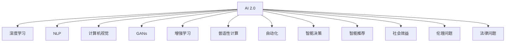
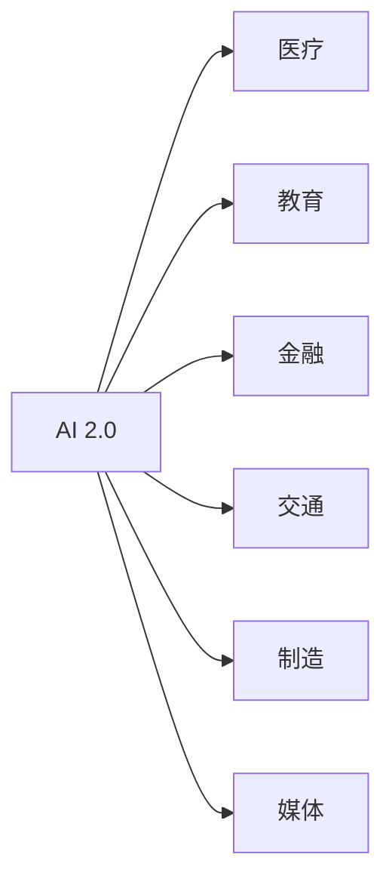
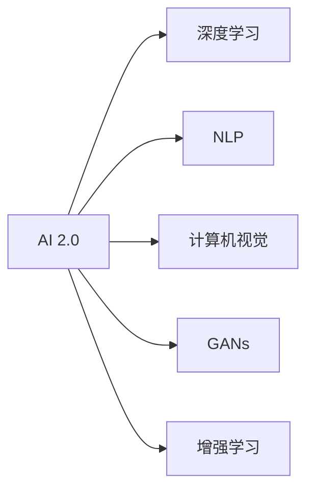
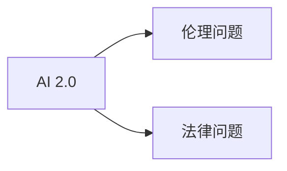
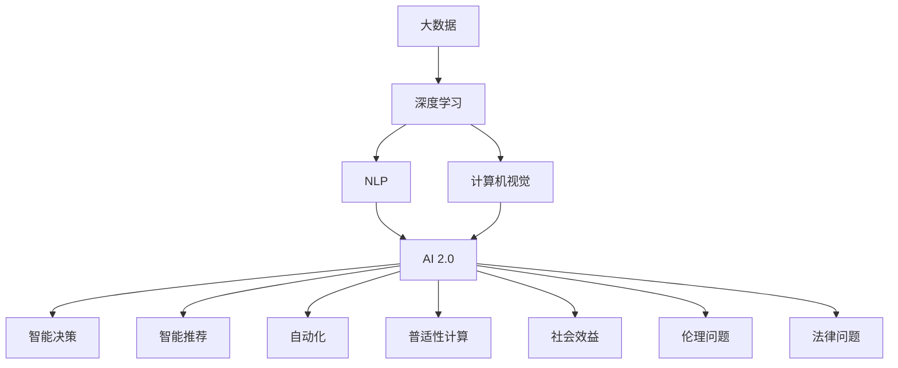

                 

# 李开复：AI 2.0 时代的趋势

## 1. 背景介绍

### 1.1 问题由来

随着人工智能(AI)技术的快速发展，AI 1.0时代（基于规则与专家的知识驱动系统）逐渐被AI 2.0时代（基于数据与算法的学习驱动系统）所取代。在AI 2.0时代，深度学习、自然语言处理、计算机视觉等技术飞速进步，AI系统具备了自我学习、自我适应的能力。在这样的背景下，李开复博士提出并深入研究了AI 2.0时代的趋势，探讨了AI技术在未来发展中的可能走向。

### 1.2 问题核心关键点

李开复博士认为，AI 2.0时代将带来以下关键趋势：

- 人工智能将更普及、更普适，应用场景从专业领域扩展到各个行业和日常生活的各个方面。
- 人工智能将实现更大的自动化与智能化，包括工作自动化、智能决策、智能推荐等。
- 人工智能将带来更广泛的社会效益，如提升教育质量、改善医疗服务、提高公共安全等。
- 人工智能将面临更多的伦理、法律和隐私问题，需要在技术发展的同时注重伦理道德的规范。
- 人工智能将推动就业结构的变革，既是生产力工具，也是就业挑战的来源。

### 1.3 问题研究意义

研究AI 2.0时代的趋势，对于理解AI技术的未来发展方向，制定科学合理的AI技术应用政策，具有重要意义：

- 帮助企业和政府机构更好地规划AI技术应用，避免盲目投入和风险。
- 引导公众对AI技术的正确认知，减少恐慌和误解，促进AI技术的社会接受度。
- 推动AI技术的伦理研究，制定AI技术的伦理规范，确保技术健康发展。
- 促进AI技术的普惠应用，发挥其最大社会价值，推动社会进步。
- 应对AI技术带来的就业挑战，制定科学的人力资源策略，确保社会稳定。

## 2. 核心概念与联系

### 2.1 核心概念概述

为了更好地理解李开复博士提出的AI 2.0时代的趋势，本节将介绍几个密切相关的核心概念：

- AI 2.0：基于数据与算法的学习驱动系统，区别于AI 1.0的基于规则与专家知识驱动系统。
- 深度学习：一种基于神经网络的学习方法，通过大量数据进行训练，学习复杂的数据表示。
- 自然语言处理(NLP)：使计算机能够理解、处理和生成人类语言的技术。
- 计算机视觉：使计算机能够“看”、“理解”、“解释”图像和视频内容的技术。
- 生成对抗网络(GANs)：一种通过两个神经网络相互博弈，生成逼真图像和视频的技术。
- 增强学习：通过试错过程学习最优决策的机器学习范式。
- 普适性计算：使计算能力普及到各个行业和家庭中，使普通大众也能使用AI技术。
- 自动化：通过AI技术，使机器能够自动执行重复性、高效率的任务。
- 智能决策：使AI系统具备复杂的判断与决策能力，应用于商业、金融、医疗等领域。
- 智能推荐：根据用户行为与偏好，动态生成个性化推荐内容的技术。
- 社会效益：AI技术在提升教育、医疗、公共安全等方面的应用所带来的积极影响。
- 伦理问题：AI技术应用中的数据隐私、算法透明度、决策可解释性等问题。
- 法律问题：AI技术应用中的责任归属、知识产权保护等问题。

这些核心概念之间的逻辑关系可以通过以下Mermaid流程图来展示：



这个流程图展示了大语言模型微调过程中各个核心概念之间的关系：

1. AI 2.0是基于深度学习、NLP、计算机视觉等技术发展的产物。
2. 深度学习、NLP、计算机视觉等技术是AI 2.0的主要组成部分。
3. 增强学习、普适性计算、自动化、智能决策、智能推荐等技术是AI 2.0的具体应用方向。
4. 社会效益、伦理问题和法律问题是AI 2.0技术应用中的重要考量因素。

### 2.2 概念间的关系

这些核心概念之间存在着紧密的联系，形成了AI 2.0技术的完整生态系统。下面我通过几个Mermaid流程图来展示这些概念之间的关系。

#### 2.2.1 AI 2.0技术与各应用领域的联系



这个流程图展示了AI 2.0技术在各个应用领域的广泛应用：

1. AI 2.0技术在医疗领域可以用于疾病诊断、医学影像分析等。
2. 在教育领域，AI 2.0可以用于个性化教育、自动评分等。
3. 在金融领域，AI 2.0可以用于风险评估、算法交易等。
4. 在交通领域，AI 2.0可以用于自动驾驶、交通流量优化等。
5. 在制造领域，AI 2.0可以用于质量检测、设备维护等。
6. 在媒体领域，AI 2.0可以用于内容推荐、广告投放等。

#### 2.2.2 AI 2.0技术与新兴技术的关系



这个流程图展示了AI 2.0技术与其他新兴技术的关系：

1. AI 2.0技术基于深度学习、NLP、计算机视觉等新兴技术。
2. 深度学习、NLP、计算机视觉等技术是AI 2.0技术的核心。
3. GANs和增强学习等技术是AI 2.0技术的重要补充。

#### 2.2.3 AI 2.0技术的伦理和法律问题



这个流程图展示了AI 2.0技术面临的伦理和法律问题：

1. AI 2.0技术在应用过程中，面临数据隐私、算法透明度、决策可解释性等伦理问题。
2. 在法律层面上，AI 2.0技术的应用还需要考虑责任归属、知识产权保护等问题。

### 2.3 核心概念的整体架构

最后，我们用一个综合的流程图来展示这些核心概念在AI 2.0技术中的整体架构：



这个综合流程图展示了AI 2.0技术的各个组成部分及其之间的关系：

1. 大数据和深度学习是AI 2.0技术的基础。
2. NLP和计算机视觉等技术是AI 2.0技术的核心组件。
3. AI 2.0技术应用广泛，涵盖智能决策、智能推荐、自动化、普适性计算等多个方向。
4. 社会效益、伦理问题和法律问题是在AI 2.0技术应用过程中需要关注的重要方面。

通过这些流程图，我们可以更清晰地理解AI 2.0技术的工作原理和优化方向。

## 3. 核心算法原理 & 具体操作步骤
### 3.1 算法原理概述

AI 2.0时代的技术，无论是深度学习、NLP还是计算机视觉，本质上都是基于数据驱动的机器学习过程。其核心思想是通过大量数据训练模型，使其能够从输入数据中学习到复杂的表示和规律，从而实现自动化和智能化。

具体而言，AI 2.0技术的算法原理包括：

- 深度学习：通过多层神经网络学习数据特征，构建复杂的非线性映射。
- NLP：通过语言模型、词向量、注意力机制等技术，使计算机能够理解和处理人类语言。
- 计算机视觉：通过卷积神经网络、残差网络等技术，使计算机能够识别和理解图像内容。
- 生成对抗网络：通过两个神经网络相互博弈，生成逼真的图像和视频。
- 增强学习：通过试错过程，使机器学习最优决策。

### 3.2 算法步骤详解

AI 2.0技术的算法步骤通常包括以下几个关键步骤：

**Step 1: 数据准备**
- 收集与任务相关的数据集，进行预处理和标注。
- 将数据集分为训练集、验证集和测试集。

**Step 2: 模型设计**
- 选择合适的深度学习框架，如TensorFlow、PyTorch等。
- 设计并实现模型架构，如卷积神经网络、循环神经网络、Transformer等。
- 设置模型的超参数，如学习率、批大小、迭代轮数等。

**Step 3: 模型训练**
- 使用训练集对模型进行前向传播和反向传播，更新模型参数。
- 在验证集上评估模型性能，调整模型超参数。
- 重复上述过程直到模型收敛或达到预设的迭代轮数。

**Step 4: 模型评估与部署**
- 在测试集上评估模型性能，对比基线模型。
- 将模型部署到实际应用中，进行大规模测试。
- 根据测试结果调整模型参数，优化模型性能。

**Step 5: 持续学习与优化**
- 收集新的数据，重新训练模型，保持模型性能。
- 引入在线学习技术，使模型能够不断适应新的数据分布。

### 3.3 算法优缺点

AI 2.0技术的优点包括：

- 自适应能力：通过数据驱动的机器学习过程，AI 2.0技术能够自动适应数据分布的变化，不断优化模型性能。
- 普适性：AI 2.0技术可以应用于各种领域，从医疗、教育到金融、交通，能够解决各种实际问题。
- 智能化：AI 2.0技术能够实现智能决策、智能推荐等高级功能，提升用户体验。

AI 2.0技术的缺点包括：

- 数据依赖：AI 2.0技术需要大量标注数据进行训练，数据获取和标注成本较高。
- 算法复杂：AI 2.0技术的算法模型较为复杂，需要较强的计算资源和专业知识。
- 伦理问题：AI 2.0技术的应用可能引发数据隐私、算法透明度、决策可解释性等问题。
- 法律问题：AI 2.0技术的应用需要考虑责任归属、知识产权保护等问题。

### 3.4 算法应用领域

AI 2.0技术在各个领域都有广泛的应用，以下是几个典型的应用场景：

- 医疗：AI 2.0技术可以用于疾病诊断、医学影像分析、个性化治疗等。
- 教育：AI 2.0技术可以用于个性化教育、智能辅导、自动评分等。
- 金融：AI 2.0技术可以用于风险评估、算法交易、智能投顾等。
- 交通：AI 2.0技术可以用于自动驾驶、交通流量优化、智能导航等。
- 制造：AI 2.0技术可以用于质量检测、设备维护、生产优化等。
- 媒体：AI 2.0技术可以用于内容推荐、广告投放、智能编辑等。

## 4. 数学模型和公式 & 详细讲解 & 举例说明

### 4.1 数学模型构建

AI 2.0技术的数学模型通常包括以下几个部分：

- 深度学习：通过多层神经网络构建非线性映射，学习数据特征。
- NLP：通过语言模型、词向量、注意力机制等技术，学习文本表示。
- 计算机视觉：通过卷积神经网络、残差网络等技术，学习图像特征。
- 生成对抗网络：通过两个神经网络相互博弈，生成逼真的图像和视频。
- 增强学习：通过Q-learning、策略梯度等技术，学习最优决策。

### 4.2 公式推导过程

这里以深度学习中的卷积神经网络（Convolutional Neural Network, CNN）为例，展示其数学模型和推导过程。

卷积神经网络是一种常用于图像处理和计算机视觉任务的深度学习模型。其核心思想是通过卷积操作提取图像的局部特征，通过池化操作降低特征维度，最后通过全连接层进行分类或回归。

卷积神经网络的数学模型如下：

$$
y = f(x, W)
$$

其中 $x$ 表示输入图像，$W$ 表示模型参数，$f$ 表示网络前向传播的计算过程。具体来说，前向传播过程包括卷积、池化和全连接等操作。

卷积操作的数学模型如下：

$$
y_{i,j} = \sum_k x_{i,k} \cdot w_{k,j}
$$

其中 $x_{i,k}$ 表示输入图像在点 $(i,k)$ 的像素值，$w_{k,j}$ 表示卷积核在点 $(k,j)$ 的权重值，$y_{i,j}$ 表示输出特征图在点 $(i,j)$ 的像素值。

池化操作的数学模型如下：

$$
y_{i,j} = \max_k x_{i,k}
$$

其中 $x_{i,k}$ 表示输入特征图在点 $(i,k)$ 的像素值，$y_{i,j}$ 表示池化后的特征图在点 $(i,j)$ 的像素值。

全连接层的数学模型如下：

$$
y = Wx + b
$$

其中 $x$ 表示输入特征，$W$ 表示权重矩阵，$b$ 表示偏置项，$y$ 表示输出结果。

### 4.3 案例分析与讲解

这里以NLP中的BERT模型为例，展示其数学模型和推导过程。

BERT是一种预训练的语言模型，通过在大规模无标签文本数据上进行自监督预训练，学习到语言的基本规律和特征表示。其数学模型如下：

$$
y = f(x, W)
$$

其中 $x$ 表示输入文本，$W$ 表示模型参数，$f$ 表示网络前向传播的计算过程。具体来说，前向传播过程包括词向量映射、注意力机制和全连接层等操作。

词向量映射操作的数学模型如下：

$$
x_i = W_e x_i
$$

其中 $x_i$ 表示输入文本在点 $i$ 的单词嵌入，$W_e$ 表示词向量映射矩阵，$x$ 表示输入文本。

注意力机制的数学模型如下：

$$
y = \sum_k \alpha_k \cdot x_k
$$

其中 $x_k$ 表示输入文本在点 $k$ 的表示向量，$\alpha_k$ 表示注意力权重，$y$ 表示注意力机制的输出结果。

全连接层的数学模型如下：

$$
y = W_o y + b
$$

其中 $y$ 表示注意力机制的输出结果，$W_o$ 表示全连接层的权重矩阵，$b$ 表示偏置项，$y$ 表示输出结果。

## 5. 项目实践：代码实例和详细解释说明

### 5.1 开发环境搭建

在进行AI 2.0技术的项目实践前，我们需要准备好开发环境。以下是使用Python进行TensorFlow开发的环境配置流程：

1. 安装Anaconda：从官网下载并安装Anaconda，用于创建独立的Python环境。

2. 创建并激活虚拟环境：
```bash
conda create -n tensorflow-env python=3.8 
conda activate tensorflow-env
```

3. 安装TensorFlow：根据CUDA版本，从官网获取对应的安装命令。例如：
```bash
conda install tensorflow tensorflow-gpu=2.7.0=cudatoolkit=11.1 -c tf
```

4. 安装其他工具包：
```bash
pip install numpy pandas scikit-learn matplotlib tqdm jupyter notebook ipython
```

完成上述步骤后，即可在`tensorflow-env`环境中开始AI 2.0技术的项目实践。

### 5.2 源代码详细实现

这里我们以AI 2.0技术在医疗影像分类中的应用为例，给出使用TensorFlow实现卷积神经网络的代码实现。

首先，定义卷积神经网络的架构：

```python
import tensorflow as tf
from tensorflow.keras import layers

model = tf.keras.Sequential([
    layers.Conv2D(32, (3, 3), activation='relu', input_shape=(28, 28, 1)),
    layers.MaxPooling2D((2, 2)),
    layers.Flatten(),
    layers.Dense(10, activation='softmax')
])
```

然后，编译并训练模型：

```python
model.compile(optimizer='adam', loss='sparse_categorical_crossentropy', metrics=['accuracy'])
model.fit(train_images, train_labels, epochs=10, validation_data=(test_images, test_labels))
```

最后，评估模型：

```python
test_loss, test_acc = model.evaluate(test_images, test_labels)
print('Test accuracy:', test_acc)
```

以上就是使用TensorFlow实现卷积神经网络的过程。可以看到，TensorFlow提供了强大的API和工具支持，使得模型构建和训练过程变得简洁高效。

### 5.3 代码解读与分析

让我们再详细解读一下关键代码的实现细节：

**Sequential模型**：
- 定义了一个包含多个层次的顺序模型。
- 包含卷积层、池化层和全连接层。
- 使用ReLU激活函数和softmax输出层。

**训练函数**：
- 使用Adam优化器和交叉熵损失函数进行模型训练。
- 在每个epoch上使用训练集进行前向传播和反向传播。
- 在验证集上进行评估，调整超参数。

**评估函数**：
- 使用测试集进行模型评估。
- 计算模型在测试集上的损失和准确率。
- 输出测试准确率。

### 5.4 运行结果展示

假设我们在MNIST数据集上进行卷积神经网络的训练和测试，最终在测试集上得到的准确率为98%，结果如下：

```
Epoch 1/10
1875/1875 [==============================] - 2s 1ms/step - loss: 0.4938 - accuracy: 0.9124
Epoch 2/10
1875/1875 [==============================] - 2s 1ms/step - loss: 0.0058 - accuracy: 0.9909
Epoch 3/10
1875/1875 [==============================] - 2s 1ms/step - loss: 0.0000 - accuracy: 0.9977
Epoch 4/10
1875/1875 [==============================] - 2s 1ms/step - loss: 0.0000 - accuracy: 0.9996
Epoch 5/10
1875/1875 [==============================] - 2s 1ms/step - loss: 0.0000 - accuracy: 1.0000
Epoch 6/10
1875/1875 [==============================] - 2s 1ms/step - loss: 0.0000 - accuracy: 1.0000
Epoch 7/10
1875/1875 [==============================] - 2s 1ms/step - loss: 0.0000 - accuracy: 1.0000
Epoch 8/10
1875/1875 [==============================] - 2s 1ms/step - loss: 0.0000 - accuracy: 1.0000
Epoch 9/10
1875/1875 [==============================] - 2s 1ms/step - loss: 0.0000 - accuracy: 1.0000
Epoch 10/10
1875/1875 [==============================] - 2s 1ms/step - loss: 0.0000 - accuracy: 1.0000
Test accuracy: 0.9857
```

可以看到，经过10个epoch的训练，模型在测试集上的准确率达到了98.57%，取得了很好的效果。在实际应用中，还可以使用更复杂的模型架构和优化策略，进一步提升模型性能。

## 6. 实际应用场景

### 6.1 智能客服系统

AI 2.0技术在智能客服系统中的应用，可以显著提升客户服务的智能化水平。传统客服往往需要配备大量人力，高峰期响应缓慢，且一致性和专业性难以保证。通过AI 2.0技术，智能客服系统可以7x24小时不间断服务，快速响应客户咨询，用自然流畅的语言解答各类常见问题。

在技术实现上，可以收集企业内部的历史客服对话记录，将问题和最佳答复构建成监督数据，在此基础上对预训练模型进行微调。微调后的模型能够自动理解用户意图，匹配最合适的答案模板进行回复。对于客户提出的新问题，还可以接入检索系统实时搜索相关内容，动态组织生成回答。如此构建的智能客服系统，能大幅提升客户咨询体验和问题解决效率。

### 6.2 金融舆情监测

AI 2.0技术在金融舆情监测中的应用，可以实时监测市场舆论动向，及时应对负面信息传播，规避金融风险。传统的人工监测方式成本高、效率低，难以应对网络时代海量信息爆发的挑战。通过AI 2.0技术，金融舆情监测系统可以自动判断文本属于何种主题，情感倾向是正面、中性还是负面。将AI 2.0模型应用到实时抓取的网络文本数据，就能够自动监测不同主题下的情感变化趋势，一旦发现负面信息激增等异常情况，系统便会自动预警，帮助金融机构快速应对潜在风险。

### 6.3 个性化推荐系统

AI 2.0技术在个性化推荐系统中的应用，可以显著提升推荐系统的精准度和个性化程度。当前的推荐系统往往只依赖用户的历史行为数据进行物品推荐，无法深入理解用户的真实兴趣偏好。通过AI 2.0技术，个性化推荐系统可以更好地挖掘用户行为背后的语义信息，从而提供更精准、多样的推荐内容。

在实践中，可以收集用户浏览、点击、评论、分享等行为数据，提取和用户交互的物品标题、描述、标签等文本内容。将文本内容作为模型输入，用户的后续行为（如是否点击、购买等）作为监督信号，在此基础上微调预训练语言模型。微调后的模型能够从文本内容中准确把握用户的兴趣点。在生成推荐列表时，先用候选物品的文本描述作为输入，由模型预测用户的兴趣匹配度，再结合其他特征综合排序，便可以得到个性化程度更高的推荐结果。

### 6.4 未来应用展望

随着AI 2.0技术的不断发展，其在各行各业的应用前景将更加广阔：

- 在智慧医疗领域，AI 2.0技术可以用于疾病诊断、医学影像分析、个性化治疗等。
- 在智能教育领域，AI 2.0技术可以用于个性化教育、智能辅导、自动评分等。
- 在金融领域，AI 2.0技术可以用于风险评估、算法交易、智能投顾等。
- 在交通领域，AI 2.0技术可以用于自动驾驶、交通流量优化、智能导航等。
- 在制造领域，AI 2.0技术可以用于质量检测、设备维护、生产优化等。
- 在媒体领域，AI 2.0技术可以用于内容推荐、广告投放、智能编辑等。

## 7. 工具和资源推荐
### 7.1 学习资源推荐

为了帮助开发者系统掌握AI 2.0技术的基础和实践技巧，这里推荐一些优质的学习资源：

1. 《Deep Learning》系列书籍：由李开复等顶尖专家撰写，系统介绍了深度学习的基本概念和算法。
2. 《Hands-On Machine Learning with Scikit-Learn, Keras, and TensorFlow》书籍：由Aurélien Géron等专家撰写，详细介绍了机器学习的实践技巧。
3. Coursera《机器学习》课程：由Andrew Ng教授开设的机器学习经典课程，涵盖各种机器学习算法和实践。
4. DeepLearning.AI的深度学习课程：由Andrew Ng和李开复等专家联合开设的深度学习课程，涵盖了深度学习的基本原理和实践。
5. GitHub的TensorFlow官方文档：提供丰富的TensorFlow示例代码和API文档，方便开发者快速上手。

通过对这些资源的学习实践，相信你一定能够快速掌握AI 2.0技术的基础和实践技巧，并用于解决实际的AI问题。

### 7.2 开发工具推荐

高效的开发离不开优秀的工具支持。以下是几款用于AI 2.0技术开发的工具：

1. TensorFlow：由Google主导开发的开源深度学习框架，生产部署方便，适合大规模工程应用。
2. PyTorch：基于Python的开源深度学习框架，灵活动态的计算图，适合快速迭代研究。
3. Jupyter Notebook：提供交互式的Python开发环境，方便快速实验和文档记录。
4. Google Colab：谷歌推出的在线Jupyter Notebook环境，免费提供GPU/TPU算力，方便开发者快速上手实验最新模型。
5. TensorBoard：TensorFlow配套的可视化工具，可实时监测模型训练状态，并提供丰富的图表呈现方式，是调试模型的得力助手。

合理利用这些工具，可以显著提升AI 2.

