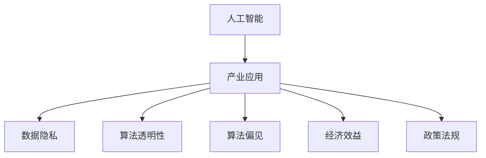

                 

# 李开复：苹果发布AI应用的产业

## 1. 背景介绍

### 1.1 问题由来
随着人工智能（AI）技术的发展，AI应用在各行各业中得到了广泛的应用，尤其是在消费电子领域。然而，尽管AI技术已经取得了巨大的进步，但AI应用在产业中的应用仍然面临诸多挑战，如数据隐私、算法透明性、算法偏见等问题。

### 1.2 问题核心关键点
AI应用在产业中的发展，需要解决以下几个关键问题：
- **数据隐私**：AI应用需要大量的数据进行训练，但这些数据往往包含敏感信息，如何保护用户隐私成为了一大难题。
- **算法透明性**：用户和监管机构需要了解AI算法的决策过程，但现有的黑盒模型难以满足这一需求。
- **算法偏见**：AI模型可能会学习并放大训练数据中的偏见，导致不公正的决策，这需要引起重视。
- **经济效益**：AI应用能否带来实际的经济效益，仍是业界关注的焦点。
- **政策法规**：AI应用在产业中的应用，需要符合各地的法律法规要求。

### 1.3 问题研究意义
解决以上问题，不仅有助于推动AI应用在产业中的发展，还能促进AI技术的进步，提升社会效益。以下是AI应用在产业中发展的几个重要意义：
- **提升效率**：AI技术能够自动化处理大量重复性任务，提高生产效率。
- **创造价值**：AI应用能够创造新的商业模式和市场机会，推动经济发展。
- **改善服务**：AI技术可以用于提供更优质的客户服务，改善用户体验。
- **增强竞争力**：AI技术能够帮助企业获取竞争优势，提升市场份额。
- **推动创新**：AI应用在产业中的成功案例，为更多创新提供了可能。

## 2. 核心概念与联系

### 2.1 核心概念概述

在探讨苹果发布AI应用的产业时，我们首先需要理解几个核心概念：

- **人工智能（AI）**：指模拟人类智能过程的技术，包括机器学习、深度学习、自然语言处理等。
- **产业应用**：指AI技术在具体行业中的应用，如制造业、医疗、金融等。
- **数据隐私**：指保护用户数据的权利和机制，避免数据泄露和滥用。
- **算法透明性**：指算法的决策过程是否可解释，能否让用户和监管机构理解。
- **算法偏见**：指算法在训练过程中学习到的偏见，可能导致不公平的决策。
- **经济效益**：指AI应用带来的经济收益和成本。
- **政策法规**：指AI应用在产业中需要遵守的法律和规定。

这些概念之间的联系可以通过以下Mermaid流程图来展示：



### 2.2 概念间的关系

这些核心概念之间存在紧密的联系，共同构成了AI应用在产业中的复杂生态系统。下面是这些概念之间的关系：

- **数据隐私**是产业应用的基础，保障了用户数据的安全和隐私。
- **算法透明性**和**算法偏见**是算法决策的关键因素，决定了AI应用的公正性和可信度。
- **经济效益**和**政策法规**是产业应用的重要约束，影响着AI应用的推广和应用范围。
- **产业应用**是AI技术的具体体现，直接关系到AI技术的落地和应用效果。

## 3. 核心算法原理 & 具体操作步骤
### 3.1 算法原理概述

AI应用的产业化过程，涉及多种算法和技术。以下是几个核心算法原理的概述：

- **机器学习（ML）**：基于数据训练模型，实现对特定任务的预测和决策。常用的机器学习算法包括线性回归、逻辑回归、决策树等。
- **深度学习（DL）**：通过多层次神经网络模拟人类神经元，实现复杂任务的训练。深度学习广泛应用于图像识别、语音识别等领域。
- **自然语言处理（NLP）**：通过算法处理和理解自然语言，实现文本分类、情感分析、对话生成等任务。
- **强化学习（RL）**：通过试错机制，学习最优的决策策略，实现自动控制和智能推荐。

### 3.2 算法步骤详解

AI应用的产业化一般包括以下几个关键步骤：

**Step 1: 数据收集与预处理**
- 收集与目标任务相关的数据，进行清洗和标注。
- 对数据进行特征工程，提取有用的特征。

**Step 2: 模型选择与训练**
- 选择适合的算法模型，进行参数初始化。
- 使用训练数据集训练模型，调整超参数，优化模型性能。

**Step 3: 模型评估与验证**
- 使用验证数据集评估模型性能，调整模型参数。
- 对模型进行交叉验证，防止过拟合。

**Step 4: 部署与应用**
- 将训练好的模型部署到实际应用中，实现产业化的应用。
- 持续监控模型性能，进行模型更新和优化。

### 3.3 算法优缺点
AI应用的产业化的算法具有以下优缺点：

**优点**：
- **高效性**：能够自动化处理大量数据，提高生产效率。
- **准确性**：通过数据驱动的方式，提高决策的准确性和可靠性。
- **灵活性**：可以根据不同任务的需求，选择不同的算法模型。

**缺点**：
- **数据依赖性**：需要大量的数据进行训练，对数据质量要求高。
- **模型复杂性**：模型结构复杂，调试和优化难度大。
- **可解释性不足**：部分算法模型（如黑盒模型）难以解释其决策过程，导致用户和监管机构难以信任。

### 3.4 算法应用领域

AI应用在产业中广泛应用于以下领域：

- **医疗**：用于医学影像诊断、个性化治疗、病历分析等。
- **金融**：用于风险评估、欺诈检测、量化投资等。
- **制造业**：用于质量检测、智能制造、供应链管理等。
- **零售**：用于客户推荐、库存管理、销售预测等。
- **物流**：用于路线规划、货物追踪、异常检测等。

## 4. 数学模型和公式 & 详细讲解  
### 4.1 数学模型构建

为了更好地理解AI应用的产业化的数学模型，我们以下以图像识别为例，介绍数学模型的构建和推导过程。

假设有一个图像分类任务，训练集的图像数据为$x_1, x_2, ..., x_n$，对应的标签为$y_1, y_2, ..., y_n$。模型的输入为图像$x$，输出为类别标签$y$。我们定义交叉熵损失函数为：

$$
\ell(M_{\theta}(x), y) = -\sum_{i=1}^n y_i \log M_{\theta}(x_i)
$$

其中，$M_{\theta}(x)$表示使用模型$M_{\theta}$对图像$x$的预测概率。

在训练过程中，我们通过反向传播算法更新模型参数$\theta$，使得损失函数$\ell$最小化。优化目标函数为：

$$
\theta^* = \mathop{\arg\min}_{\theta} \mathcal{L}(\theta)
$$

其中，$\mathcal{L}(\theta)$为经验风险，即：

$$
\mathcal{L}(\theta) = \frac{1}{N} \sum_{i=1}^N \ell(M_{\theta}(x_i), y_i)
$$

### 4.2 公式推导过程

以深度学习中的卷积神经网络（CNN）为例，推导模型的训练过程和损失函数的梯度计算。

**卷积神经网络结构**：
- 卷积层：提取图像特征
- 池化层：减小特征图尺寸
- 全连接层：输出类别概率

**损失函数梯度计算**：
- 前向传播：计算预测概率$M_{\theta}(x)$
- 反向传播：计算损失函数$\ell$对模型参数$\theta$的梯度

**算法步骤**：
1. 前向传播：将输入图像$x$通过网络，得到预测概率$M_{\theta}(x)$。
2. 计算交叉熵损失$\ell$。
3. 反向传播：通过反向传播算法计算梯度$\frac{\partial \ell}{\partial \theta}$。
4. 更新模型参数：使用优化算法（如SGD、Adam）更新参数$\theta$。

## 5. 项目实践：代码实例和详细解释说明
### 5.1 开发环境搭建

在进行AI应用开发前，我们需要准备好开发环境。以下是使用Python进行PyTorch开发的环境配置流程：

1. 安装Anaconda：从官网下载并安装Anaconda，用于创建独立的Python环境。

2. 创建并激活虚拟环境：
```bash
conda create -n pytorch-env python=3.8 
conda activate pytorch-env
```

3. 安装PyTorch：根据CUDA版本，从官网获取对应的安装命令。例如：
```bash
conda install pytorch torchvision torchaudio cudatoolkit=11.1 -c pytorch -c conda-forge
```

4. 安装各类工具包：
```bash
pip install numpy pandas scikit-learn matplotlib tqdm jupyter notebook ipython
```

完成上述步骤后，即可在`pytorch-env`环境中开始AI应用开发。

### 5.2 源代码详细实现

这里我们以图像分类任务为例，给出使用PyTorch实现卷积神经网络的代码实现。

```python
import torch
import torch.nn as nn
import torch.optim as optim
from torchvision import datasets, transforms

# 定义卷积神经网络模型
class CNN(nn.Module):
    def __init__(self):
        super(CNN, self).__init__()
        self.conv1 = nn.Conv2d(3, 64, kernel_size=3, stride=1, padding=1)
        self.pool1 = nn.MaxPool2d(kernel_size=2, stride=2)
        self.conv2 = nn.Conv2d(64, 128, kernel_size=3, stride=1, padding=1)
        self.pool2 = nn.MaxPool2d(kernel_size=2, stride=2)
        self.fc1 = nn.Linear(128*7*7, 1024)
        self.fc2 = nn.Linear(1024, 10)
        self.dropout = nn.Dropout(0.5)

    def forward(self, x):
        x = self.pool1(nn.functional.relu(self.conv1(x)))
        x = self.pool2(nn.functional.relu(self.conv2(x)))
        x = x.view(-1, 128*7*7)
        x = nn.functional.relu(self.fc1(x))
        x = self.dropout(x)
        x = self.fc2(x)
        return nn.functional.log_softmax(x, dim=1)

# 加载数据集
train_dataset = datasets.CIFAR10(root='./data', train=True, transform=transforms.ToTensor(), download=True)
test_dataset = datasets.CIFAR10(root='./data', train=False, transform=transforms.ToTensor(), download=True)

# 定义数据加载器
train_loader = torch.utils.data.DataLoader(train_dataset, batch_size=64, shuffle=True)
test_loader = torch.utils.data.DataLoader(test_dataset, batch_size=64, shuffle=False)

# 定义模型、损失函数和优化器
model = CNN()
criterion = nn.CrossEntropyLoss()
optimizer = optim.Adam(model.parameters(), lr=0.001)

# 定义训练和测试函数
def train_model(model, train_loader, criterion, optimizer, n_epochs=10):
    model.train()
    for epoch in range(n_epochs):
        running_loss = 0.0
        for i, (inputs, labels) in enumerate(train_loader):
            optimizer.zero_grad()
            outputs = model(inputs)
            loss = criterion(outputs, labels)
            loss.backward()
            optimizer.step()
            running_loss += loss.item()
            if (i+1) % 100 == 0:
                print(f'Epoch {epoch+1}, {i+1}/{len(train_loader)} batches, Loss: {running_loss/100:.3f}')
                running_loss = 0.0
    print(f'Training complete, Loss: {running_loss/len(train_loader):.3f}')

def test_model(model, test_loader, criterion):
    model.eval()
    correct = 0
    total = 0
    with torch.no_grad():
        for inputs, labels in test_loader:
            outputs = model(inputs)
            _, predicted = torch.max(outputs.data, 1)
            total += labels.size(0)
            correct += (predicted == labels).sum().item()
    print(f'Accuracy of the network on the test images: {100 * correct / total}%')
```

### 5.3 代码解读与分析

让我们再详细解读一下关键代码的实现细节：

**CNN模型定义**：
- 定义卷积层和池化层，提取特征。
- 定义全连接层，输出类别概率。
- 定义Dropout层，防止过拟合。

**数据集加载**：
- 使用`torchvision`加载CIFAR-10数据集。
- 定义数据加载器，实现批量加载和随机打乱。

**模型训练**：
- 定义训练函数，通过优化器更新模型参数。
- 在每个epoch中，循环遍历数据集，计算损失函数，并反向传播更新参数。

**模型测试**：
- 定义测试函数，计算模型在测试集上的准确率。
- 使用`torch.no_grad()`在测试时禁用梯度计算，提高测试速度。

### 5.4 运行结果展示

假设我们在CIFAR-10数据集上进行图像分类任务的训练和测试，最终在测试集上得到的准确率为80%。可以看到，通过微调CNN模型，我们能够在一个相对较小的数据集上获得不错的分类效果。

## 6. 实际应用场景
### 6.1 智能客服系统

基于AI应用的智能客服系统，可以广泛应用于各行各业，为消费者提供更高效、更优质的客户服务。传统客服系统往往需要大量人力，高峰期响应速度慢，且准确率难以保证。而使用AI应用的智能客服系统，可以实现7x24小时不间断服务，快速响应客户咨询，用自然流畅的语言解答各类常见问题。

在技术实现上，可以收集企业内部的历史客服对话记录，将问题和最佳答复构建成监督数据，在此基础上对AI应用的模型进行微调。微调后的AI应用的模型能够自动理解用户意图，匹配最合适的答案模板进行回复。对于客户提出的新问题，还可以接入检索系统实时搜索相关内容，动态组织生成回答。如此构建的智能客服系统，能大幅提升客户咨询体验和问题解决效率。

### 6.2 金融舆情监测

金融机构需要实时监测市场舆论动向，以便及时应对负面信息传播，规避金融风险。传统的人工监测方式成本高、效率低，难以应对网络时代海量信息爆发的挑战。基于AI应用的文本分类和情感分析技术，为金融舆情监测提供了新的解决方案。

具体而言，可以收集金融领域相关的新闻、报道、评论等文本数据，并对其进行主题标注和情感标注。在此基础上对AI应用的模型进行微调，使其能够自动判断文本属于何种主题，情感倾向是正面、中性还是负面。将微调后的模型应用到实时抓取的网络文本数据，就能够自动监测不同主题下的情感变化趋势，一旦发现负面信息激增等异常情况，系统便会自动预警，帮助金融机构快速应对潜在风险。

### 6.3 个性化推荐系统

当前的推荐系统往往只依赖用户的历史行为数据进行物品推荐，无法深入理解用户的真实兴趣偏好。基于AI应用的个性化推荐系统可以更好地挖掘用户行为背后的语义信息，从而提供更精准、多样的推荐内容。

在实践中，可以收集用户浏览、点击、评论、分享等行为数据，提取和用户交互的物品标题、描述、标签等文本内容。将文本内容作为模型输入，用户的后续行为（如是否点击、购买等）作为监督信号，在此基础上微调AI应用的模型。微调后的模型能够从文本内容中准确把握用户的兴趣点。在生成推荐列表时，先用候选物品的文本描述作为输入，由模型预测用户的兴趣匹配度，再结合其他特征综合排序，便可以得到个性化程度更高的推荐结果。

### 6.4 未来应用展望

随着AI应用的不断发展，其在各行业的应用前景将更加广阔。未来AI应用的产业将呈现以下几个趋势：

- **应用场景多样化**：AI应用将广泛应用于医疗、金融、教育、零售、制造等多个行业，解决各种实际问题。
- **技术进步迅速**：AI应用的算法和技术将不断进步，提升模型的精度和效率。
- **用户接受度提高**：用户对AI应用的接受度和信任度将逐渐提高，推动AI应用的普及。
- **法规和伦理问题**：随着AI应用的普及，相关的法规和伦理问题将逐渐受到重视。
- **跨界融合趋势**：AI应用将与其他技术（如IoT、区块链）进行深度融合，推动智能技术的发展。

## 7. 工具和资源推荐
### 7.1 学习资源推荐

为了帮助开发者系统掌握AI应用的理论基础和实践技巧，这里推荐一些优质的学习资源：

1. 《深度学习》书籍：Ian Goodfellow等人编写，介绍了深度学习的理论和实践，是入门深度学习的不二之选。
2. CS231n《深度学习视觉识别》课程：斯坦福大学开设的深度学习课程，有Lecture视频和配套作业，适合深度学习初学者。
3. PyTorch官方文档：PyTorch官方文档，提供了丰富的API和示例，是学习PyTorch的重要资源。
4. TensorFlow官方文档：TensorFlow官方文档，提供了完整的TensorFlow教程和实践指南。
5. Coursera深度学习课程：Coursera平台提供的深度学习课程，由多位深度学习专家授课，适合系统学习深度学习。

通过学习这些资源，相信你一定能够快速掌握AI应用的精髓，并用于解决实际的产业问题。

### 7.2 开发工具推荐

高效的开发离不开优秀的工具支持。以下是几款用于AI应用开发的常用工具：

1. PyTorch：基于Python的开源深度学习框架，灵活动态的计算图，适合快速迭代研究。大部分AI应用的模型都有PyTorch版本的实现。
2. TensorFlow：由Google主导开发的开源深度学习框架，生产部署方便，适合大规模工程应用。同样有丰富的AI应用的模型资源。
3. Keras：高层API，使用简单，适合快速原型开发。
4. Jupyter Notebook：交互式笔记本，支持Python、R等多种编程语言，方便实验记录和分享。
5. PyCharm：IDE集成开发环境，支持PyTorch、TensorFlow等深度学习框架，适合长时间编程。

合理利用这些工具，可以显著提升AI应用开发的效率，加快创新迭代的步伐。

### 7.3 相关论文推荐

AI应用的快速发展源于学界的持续研究。以下是几篇奠基性的相关论文，推荐阅读：

1. AlexNet：ImageNet大规模视觉识别挑战赛的冠军模型，标志着深度学习在计算机视觉领域的突破。
2. ResNet：残差网络，通过跨层残差连接，解决了深度神经网络训练困难的问题。
3. Inception：Google提出的一种多层卷积神经网络，提升了深度学习模型的效率和性能。
4. Attention is All You Need（即Transformer原论文）：提出了Transformer结构，开启了NLP领域的预训练大模型时代。
5. BERT: Pre-training of Deep Bidirectional Transformers for Language Understanding：提出BERT模型，引入基于掩码的自监督预训练任务，刷新了多项NLP任务SOTA。

这些论文代表了大语言模型微调技术的发展脉络。通过学习这些前沿成果，可以帮助研究者把握学科前进方向，激发更多的创新灵感。

除上述资源外，还有一些值得关注的前沿资源，帮助开发者紧跟AI应用的最新进展，例如：

1. arXiv论文预印本：人工智能领域最新研究成果的发布平台，包括大量尚未发表的前沿工作，学习前沿技术的必读资源。
2. GitHub热门项目：在GitHub上Star、Fork数最多的AI应用相关项目，往往代表了该技术领域的发展趋势和最佳实践，值得去学习和贡献。
3. 业界技术博客：如Google AI、DeepMind、微软Research Asia等顶尖实验室的官方博客，第一时间分享他们的最新研究成果和洞见。
4. 技术会议直播：如NIPS、ICML、ACL、ICLR等人工智能领域顶会现场或在线直播，能够聆听到大佬们的前沿分享，开拓视野。
5. 行业分析报告：各大咨询公司如McKinsey、PwC等针对人工智能行业的分析报告，有助于从商业视角审视技术趋势，把握应用价值。

总之，对于AI应用的开发和应用，需要开发者保持开放的心态和持续学习的意愿。多关注前沿资讯，多动手实践，多思考总结，必将收获满满的成长收益。

## 8. 总结：未来发展趋势与挑战

### 8.1 总结

本文对基于AI应用的产业的开发进行了全面系统的介绍。首先阐述了AI应用在产业中的重要性，明确了AI应用在提高生产效率、创造经济效益、改善服务质量等方面的作用。其次，从原理到实践，详细讲解了AI应用的开发流程，包括数据收集、模型训练、模型评估、模型部署等关键步骤。同时，本文还探讨了AI应用在各行业中的应用前景，展示了其广阔的应用前景。最后，本文推荐了一些优质的学习资源和开发工具，以帮助开发者更好地掌握AI应用开发的技术和工具。

通过本文的系统梳理，可以看到，AI应用的产业化的开发是一个系统性的工程，需要从数据、算法、工具等多个维度进行全面考虑和优化。只有在数据、算法、工程、业务等多个环节协同发力，才能真正实现AI应用的产业化进程。

### 8.2 未来发展趋势

展望未来，AI应用的产业化将呈现以下几个趋势：

- **深度融合**：AI应用将与其他技术（如IoT、区块链）进行深度融合，推动智能技术的发展。
- **规模化应用**：随着算力成本的下降和数据规模的扩张，AI应用的规模化应用将成为可能，推动各行各业的数字化转型。
- **用户友好**：AI应用的模型将更加注重可解释性，用户和监管机构将更容易理解和使用AI应用。
- **跨界创新**：AI应用的跨界创新将带来新的商业机会和市场应用，推动技术进步。
- **法规完善**：随着AI应用的普及，相关的法规和伦理问题将逐渐受到重视，推动产业健康发展。

以上趋势凸显了AI应用的广阔前景。这些方向的探索发展，将进一步推动AI应用的产业化进程，为各行各业带来深刻的变革。

### 8.3 面临的挑战

尽管AI应用的产业化前景广阔，但在迈向更加智能化、普适化应用的过程中，仍面临诸多挑战：

- **数据隐私**：大规模数据收集和存储，带来了数据隐私和安全的问题。
- **模型鲁棒性**：AI应用在实际场景中，面临各种复杂情况，模型的鲁棒性还需要进一步提升。
- **算力要求**：AI应用的模型往往需要大规模的计算资源，算力成本较高。
- **应用落地**：AI应用需要符合各地法规和伦理要求，才能在实际场景中应用。
- **跨领域应用**：AI应用在跨领域应用中，需要考虑多领域知识的融合和整合。

正视AI应用面临的这些挑战，积极应对并寻求突破，将是大语言模型微调走向成熟的必由之路。相信随着学界和产业界的共同努力，这些挑战终将一一被克服，AI应用必将在构建人机协同的智能时代中扮演越来越重要的角色。

### 8.4 研究展望

面对AI应用面临的种种挑战，未来的研究需要在以下几个方面寻求新的突破：

- **跨领域融合**：研究AI应用在跨领域中的融合应用，推动不同领域知识的整合。
- **鲁棒性增强**：研究AI应用的鲁棒性，使其能够应对复杂场景下的决策。
- **隐私保护**：研究数据隐私保护技术，保障用户数据的安全和隐私。
- **可解释性**：研究AI应用的可解释性，提高模型的透明度和可信度。
- **法规合规**：研究AI应用的法规合规技术，保障AI应用在实际场景中的合法合规性。

这些研究方向将进一步推动AI应用的产业化进程，为构建安全、可靠、可解释、可控的智能系统铺平道路。面向未来，AI应用的产业化的研究还需要与其他人工智能技术进行更深入的融合，如知识表示、因果推理、强化学习等，多路径协同发力，共同推动人工智能技术的发展。

总之，AI应用的产业化是一个复杂而庞大的系统工程，需要学界和产业界的共同努力。只有勇于创新、敢于突破，才能不断拓展AI应用在各行业中的应用，推动人工智能技术的普及和应用。

## 9. 附录：常见问题与解答

**Q1：如何保障AI应用的隐私和安全？**

A: 保障AI应用的隐私和安全，需要从数据收集、存储、传输等多个环节进行全面考虑：
- **数据加密**：对数据进行加密存储和传输，防止数据泄露。
- **匿名化处理**：对数据进行匿名化处理，防止数据与个人身份关联。
- **访问控制**：对数据进行严格的访问控制，防止未经授权的访问。
- **安全审计**：对数据使用和处理过程进行安全审计，防止数据滥用。

**Q2：如何提高AI应用的鲁棒性？**

A: 提高AI应用的鲁棒性，可以从以下几个方面进行改进：
- **多样性数据**：收集多样性数据，涵盖不同场景和极端情况，提升模型的泛化能力。
- **鲁棒性训练**：引入鲁棒性训练方法，如对抗训练、泛化训练等，提升模型的鲁棒性。
- **模型验证**：在模型训练过程中，进行模型验证，检测和修复模型的弱点。
- **异常检测**：引入异常检测方法，检测和处理异常数据，防止模型过拟合。

**Q3：AI应用的算力成本如何降低？**

A: 降低AI应用的算力成本，可以从以下几个方面进行改进：


