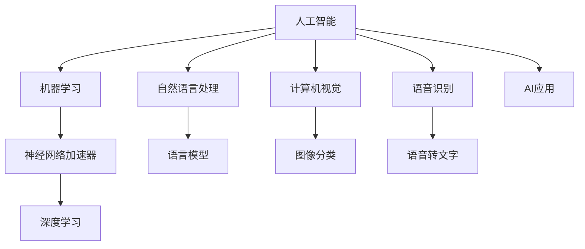

                 

# 李开复：苹果发布AI应用的市场

在科技领域，苹果公司一直以创新的产品和技术引领市场，但近来，苹果在人工智能(AI)领域的表现也引人注目。本文将探讨苹果发布AI应用的市场前景，包括其优势、挑战以及未来发展趋势。

## 1. 背景介绍

### 1.1 市场背景
近年来，AI技术在各个行业的应用越来越广泛，从医疗、金融到零售、娱乐，无处不在。苹果公司作为科技行业的巨头，自然不会错过这一机遇。在苹果的战略中，AI技术的应用不仅能够提升用户体验，还能增强产品竞争力，开拓新的收入来源。

### 1.2 苹果AI应用的发展历程
苹果在AI方面的探索始于2017年推出的Siri语音助手，但真正全面进军AI领域则是在2020年发布的M1芯片上集成的神经网络加速器（Neural Engine）。2021年，苹果推出了M2芯片，进一步提升了AI计算能力。2022年，苹果更是发布了全新的M3芯片，进一步强化了AI能力。

## 2. 核心概念与联系

### 2.1 核心概念概述
- **人工智能**：指使用计算机和算法模拟人类智能，实现问题解决、数据分析、模式识别等任务的技术。
- **神经网络加速器（Neural Engine）**：一种专门用于加速深度学习模型推理的硬件设备，通常集成在移动设备或嵌入式设备中。
- **机器学习**：指让计算机通过数据学习，不断优化模型，提升性能的过程。
- **深度学习**：一种机器学习技术，通过多层神经网络实现复杂数据特征的提取和分类。

### 2.2 概念间的关系



这个流程图展示了AI技术的核心组件及其相互关系：人工智能通过机器学习算法实现，深度学习是其重要分支；神经网络加速器则提供了硬件支持；AI应用进一步细分为自然语言处理、计算机视觉、语音识别等多个方向。

## 3. 核心算法原理 & 具体操作步骤

### 3.1 算法原理概述
苹果的AI应用主要基于深度学习算法，特别是卷积神经网络（CNN）和循环神经网络（RNN）。这些算法能够从大量数据中学习特征，实现图像分类、语音识别、自然语言处理等任务。

### 3.2 算法步骤详解
1. **数据准备**：收集和标注训练数据，分为训练集和测试集。
2. **模型选择**：根据任务需求选择合适的深度学习模型。
3. **模型训练**：使用训练数据集训练模型，调整模型参数，使其能够准确预测目标变量。
4. **模型评估**：使用测试数据集评估模型性能，计算准确率、召回率等指标。
5. **模型部署**：将训练好的模型部署到实际应用场景中，进行推理和预测。

### 3.3 算法优缺点
**优点**：
- 能够处理复杂的数据类型，如图像、语音、文本等。
- 在大规模数据上进行训练，模型性能通常优于传统方法。
- 可以不断学习和改进，适应新数据和新任务。

**缺点**：
- 需要大量计算资源，训练和推理成本较高。
- 模型结构复杂，难以解释和调试。
- 过度拟合问题较难解决。

### 3.4 算法应用领域
苹果的AI应用主要应用于以下几个领域：

- **自然语言处理**：如Siri语音助手、iMessage智能回复等。
- **计算机视觉**：如Face ID人脸识别、相册智能分类等。
- **语音识别**：如Siri语音识别、Apple Watch健身跟踪等。
- **图像处理**：如Camera翻译、实时光效等。

## 4. 数学模型和公式 & 详细讲解 & 举例说明

### 4.1 数学模型构建
假设我们有一个二分类任务，输入数据为 $x$，标签为 $y$，模型为 $h(x)$，损失函数为 $L(h(x),y)$。我们的目标是找到最优的模型参数 $\theta$，使得 $L(h(x),y)$ 最小化。

### 4.2 公式推导过程
以二分类任务为例，常用的损失函数为交叉熵损失函数：
$$
L(h(x),y) = -(y\log(h(x)) + (1-y)\log(1-h(x)))
$$

### 4.3 案例分析与讲解
假设我们有一个图像分类任务，输入为一张图片，输出为类别标签。我们可以使用卷积神经网络（CNN）来构建模型，通过训练数据集来优化模型参数，使得模型在测试集上的分类准确率达到最高。

## 5. 项目实践：代码实例和详细解释说明

### 5.1 开发环境搭建
为了进行AI应用的开发，我们需要搭建一个包含深度学习框架、数据集和计算资源的开发环境。常用的深度学习框架有TensorFlow、PyTorch等。

### 5.2 源代码详细实现
以下是一个简单的图像分类模型在TensorFlow中的实现：

```python
import tensorflow as tf
from tensorflow.keras import layers

# 构建模型
model = tf.keras.Sequential([
    layers.Conv2D(32, (3, 3), activation='relu', input_shape=(32, 32, 3)),
    layers.MaxPooling2D((2, 2)),
    layers.Conv2D(64, (3, 3), activation='relu'),
    layers.MaxPooling2D((2, 2)),
    layers.Flatten(),
    layers.Dense(64, activation='relu'),
    layers.Dense(10, activation='softmax')
])

# 编译模型
model.compile(optimizer='adam',
              loss='categorical_crossentropy',
              metrics=['accuracy'])

# 训练模型
model.fit(train_data, train_labels, epochs=10, validation_data=(test_data, test_labels))
```

### 5.3 代码解读与分析
上述代码实现了使用卷积神经网络（CNN）进行图像分类的过程。模型首先通过卷积层和池化层提取图像特征，再通过全连接层进行分类，输出结果。在训练过程中，使用交叉熵损失函数和Adam优化器进行优化。

### 5.4 运行结果展示
在训练过程中，我们可以使用TensorBoard来可视化训练过程中的损失和准确率变化：

```
tensorboard --logdir=logs --port=6006
```

打开浏览器，访问 `http://localhost:6006`，即可看到训练过程的可视化结果。

## 6. 实际应用场景

### 6.1 自然语言处理
苹果的Siri语音助手是一个典型的自然语言处理应用。通过深度学习模型，Siri可以理解用户的语音指令，并执行相应的操作。例如，用户可以问“今天天气怎么样？”，Siri则会返回天气预报信息。

### 6.2 计算机视觉
Face ID人脸识别是苹果在计算机视觉领域的重要应用。通过深度学习模型，Face ID能够识别用户的面部特征，并验证用户的身份。这种技术在苹果设备上得到了广泛应用，提高了设备的安全性和用户体验。

### 6.3 语音识别
苹果的语音识别技术主要用于Siri语音助手和Apple Watch健身跟踪等功能。通过深度学习模型，苹果设备能够准确地识别用户的语音指令，并提供相应的服务。

## 7. 工具和资源推荐

### 7.1 学习资源推荐
- **深度学习入门**：《深度学习入门》，Ian Goodfellow著。
- **TensorFlow官方文档**：https://www.tensorflow.org/
- **PyTorch官方文档**：https://pytorch.org/docs/

### 7.2 开发工具推荐
- **TensorFlow**：开源深度学习框架，功能丰富，适合大规模应用。
- **PyTorch**：开源深度学习框架，易于上手，适合研究和实验。
- **Jupyter Notebook**：数据科学和机器学习的交互式开发环境。

### 7.3 相关论文推荐
- **ImageNet大规模视觉识别挑战**：AlexNet论文。
- **深度学习在语音识别中的应用**：Deep Speech论文。
- **自然语言处理中的深度学习**：Transformer论文。

## 8. 总结：未来发展趋势与挑战

### 8.1 未来发展趋势
苹果的AI应用在未来的发展中，可能会进一步融合自然语言处理、计算机视觉和语音识别等多种技术，实现更加智能化的应用。例如，未来的Siri可能不仅能够理解语音指令，还能够进行多轮对话，提供更加个性化的服务。

### 8.2 面临的挑战
尽管苹果在AI领域已经取得了显著的进展，但未来的发展仍面临诸多挑战：
- **计算资源**：深度学习模型需要大量计算资源，苹果需要进一步提升其计算能力。
- **数据隐私**：苹果设备上存储的大量用户数据需要得到妥善保护，防止数据泄露和滥用。
- **模型复杂度**：深度学习模型结构复杂，难以解释和调试，需要进一步优化模型设计。

### 8.3 研究展望
未来的研究需要集中在以下几个方面：
- **模型压缩**：通过模型压缩和优化，减少计算资源消耗。
- **数据隐私保护**：采用联邦学习等技术，保护用户数据隐私。
- **模型解释性**：提高模型的可解释性，增强用户信任。

## 9. 附录：常见问题与解答

**Q1：苹果的AI应用与其他厂商相比有何优势？**
A: 苹果的AI应用优势在于其高度集成的硬件和软件系统。苹果设备能够高效地运行深度学习模型，且用户体验良好。此外，苹果在硬件和软件方面的投入也让其能够不断优化AI应用的表现。

**Q2：苹果的AI应用是否会与其他厂商的AI应用竞争？**
A: 苹果的AI应用与其他厂商的应用会存在一定的竞争，但同时也存在合作的可能性。苹果可以通过与其他厂商的合作，提升AI应用的性能和应用范围。

**Q3：苹果的AI应用在未来的发展中需要注意哪些问题？**
A: 苹果的AI应用在未来的发展中需要注意计算资源、数据隐私和模型复杂度等方面的问题。只有解决好这些问题，才能让AI应用更好地服务于用户，提升苹果产品的竞争力。

**Q4：苹果的AI应用在未来的发展中会有哪些创新点？**
A: 未来的苹果AI应用可能会在自然语言处理、计算机视觉和语音识别等方面实现更多的创新。例如，未来的Siri可能不仅能够理解语音指令，还能够进行多轮对话，提供更加个性化的服务。

---

作者：禅与计算机程序设计艺术 / Zen and the Art of Computer Programming

