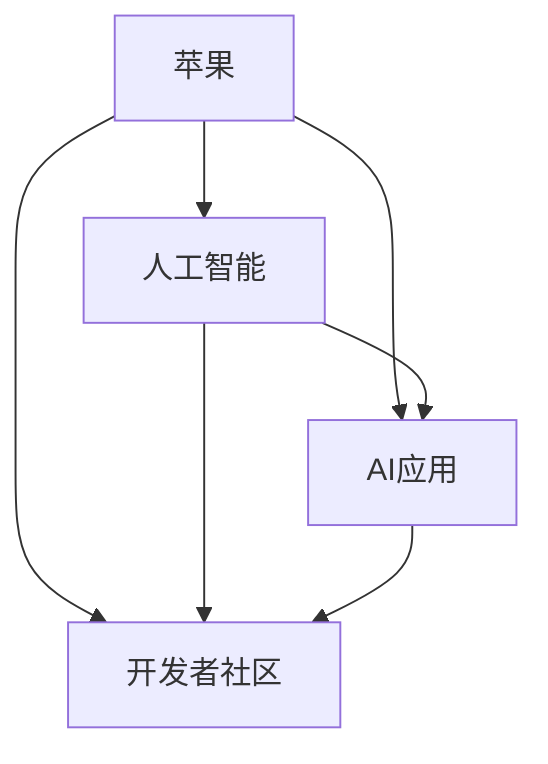
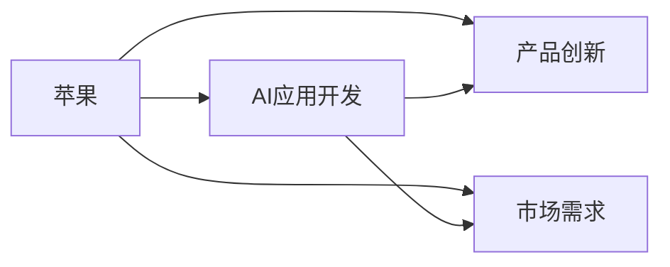
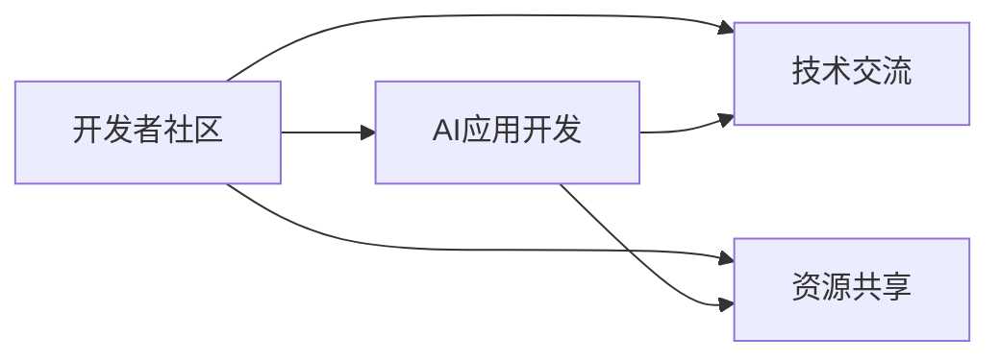
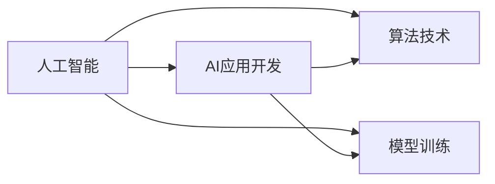

                 

# 李开复：苹果发布AI应用的开发者

> 关键词：
> - 人工智能
> - 开发者
> - 苹果
> - AI应用
> - 开发者社区
> - 深度学习
> - 机器学习
> - 自然语言处理
> - 计算机视觉

## 1. 背景介绍

苹果公司在全球科技产业中享有极高的地位，其创新能力一直是行业标杆。然而，苹果产品的智能化程度长期以来较为有限，导致用户对其功能的期待不断提升。为了提升产品的智能化水平，苹果决定在人工智能领域进行大力投资。本文将重点探讨苹果公司对AI应用的开发战略，以及背后所依托的技术和社区力量。

## 2. 核心概念与联系

### 2.1 核心概念概述

苹果的AI应用开发策略主要基于以下几个核心概念：

- **人工智能**：一种使机器能够模拟人类智能行为的技术，包括深度学习、机器学习、自然语言处理、计算机视觉等多个分支。
- **开发者**：使用或创建AI应用的软件开发者，涵盖深度学习、数据科学、软件开发等多个领域。
- **苹果**：全球知名的消费电子公司，其产品如iPhone、iPad、Mac等在市场上拥有极高的份额。
- **AI应用**：使用人工智能技术构建的实际应用，如自动驾驶、语音识别、图像识别等。
- **开发者社区**：由开发者组成的社群，提供技术交流、资源共享、合作开发等平台。

这些概念间的关系可以用以下Mermaid流程图表示：



这个流程图展示了苹果在AI应用开发中各个概念之间的联系：苹果公司利用人工智能技术开发AI应用，并通过开发者社区吸引开发者为其提供解决方案。

### 2.2 概念间的关系

这些核心概念之间存在着紧密的联系，形成了苹果公司AI应用开发的全链条。接下来，我们将通过几个具体的流程图来展示这些概念之间的关系：

#### 2.2.1 苹果与AI应用的关系



这个流程图展示了苹果公司如何通过开发AI应用来推动产品创新和满足市场需求。

#### 2.2.2 开发者社区与AI应用的关系



这个流程图展示了开发者社区如何为苹果提供技术和资源支持，助力AI应用开发。

#### 2.2.3 人工智能与AI应用的关系



这个流程图展示了人工智能技术在AI应用开发中的核心作用，包括算法和模型训练。

## 3. 核心算法原理 & 具体操作步骤

### 3.1 算法原理概述

苹果的AI应用开发主要依托于深度学习和机器学习技术，其中深度学习是核心算法。深度学习通过构建多层神经网络，模拟人脑的工作方式，实现对大量数据的自动分析和处理。以下是深度学习的基本原理：

- **神经网络**：由大量的人工神经元构成，每个神经元接收输入，通过权重矩阵进行线性变换，并加上偏置项，最终输出结果。
- **反向传播**：通过反向传播算法，利用误差梯度来调整神经元之间的权重，最小化预测值与真实值之间的误差。
- **模型优化**：使用梯度下降等优化算法，不断调整模型参数，以获得最佳的预测效果。

### 3.2 算法步骤详解

苹果的AI应用开发流程主要包括以下几个步骤：

1. **需求分析**：明确产品需求，如自动驾驶、语音识别、图像识别等。
2. **数据收集与预处理**：收集相关数据，并进行清洗、标注等预处理工作。
3. **模型训练**：使用深度学习框架（如TensorFlow、PyTorch）进行模型训练。
4. **模型评估**：使用测试集评估模型性能，调整模型参数。
5. **模型部署**：将训练好的模型集成到产品中，进行实际应用。
6. **持续优化**：根据反馈数据，不断优化模型，提升性能。

### 3.3 算法优缺点

深度学习算法的优点包括：

- **自适应能力强**：能够处理大量复杂数据，具备较强的泛化能力。
- **高精度**：在许多任务上取得了比传统算法更高的准确率。
- **可扩展性强**：适合于大规模分布式计算。

但其缺点也较为明显：

- **训练时间长**：需要大量计算资源，训练时间较长。
- **模型复杂度高**：模型结构复杂，调试和维护难度大。
- **数据依赖性高**：对数据量和质量要求较高，数据标注成本高。

### 3.4 算法应用领域

苹果的AI应用开发涵盖多个领域，包括但不限于：

- **自然语言处理**：如Siri语音助手、翻译服务、自动回复等。
- **计算机视觉**：如人脸识别、图像分类、增强现实等。
- **自动驾驶**：如自动驾驶汽车、智能导航等。
- **医疗健康**：如智能诊断、疾病预测等。
- **智能家居**：如智能音箱、智能电视等。

## 4. 数学模型和公式 & 详细讲解 & 举例说明

### 4.1 数学模型构建

深度学习模型通常由多个神经网络层构成，每层包含多个神经元。以下是一个简单的神经网络模型：

$$
\begin{aligned}
\text{Layer}_1 &: \mathbf{x} \rightarrow \mathbf{W}_1\mathbf{x} + \mathbf{b}_1 \rightarrow \sigma(\cdot) \\
\text{Layer}_2 &: \mathbf{h} \rightarrow \mathbf{W}_2\mathbf{h} + \mathbf{b}_2 \rightarrow \sigma(\cdot) \\
\text{Output} &: \mathbf{y} \rightarrow \mathbf{W}_3\mathbf{y} + \mathbf{b}_3
\end{aligned}
$$

其中，$\mathbf{x}$ 为输入向量，$\mathbf{W}$ 为权重矩阵，$\mathbf{b}$ 为偏置项，$\sigma$ 为激活函数。输出 $\mathbf{y}$ 为最终预测结果。

### 4.2 公式推导过程

以回归任务为例，假设训练集为 $(x_i, y_i)$，目标函数为均方误差（Mean Squared Error, MSE）：

$$
\text{MSE} = \frac{1}{N}\sum_{i=1}^N (y_i - f(x_i))^2
$$

其中，$f(x_i)$ 为模型对输入 $x_i$ 的预测结果。使用梯度下降算法，求解最小化MSE的目标函数，更新模型参数：

$$
\mathbf{W} \leftarrow \mathbf{W} - \eta \nabla_{\mathbf{W}} \text{MSE}
$$

其中，$\eta$ 为学习率。

### 4.3 案例分析与讲解

假设我们要开发一个基于深度学习的图像分类器，用于识别不同种类的动物。数据集为包含动物图像和相应类别的数据集。模型采用卷积神经网络（CNN），结构如下：

- **输入层**：将图像转化为像素向量。
- **卷积层**：提取图像特征。
- **池化层**：减少特征维度，降低计算复杂度。
- **全连接层**：将特征映射到类别空间。
- **输出层**：使用Softmax函数输出类别概率。

我们使用TensorFlow框架实现该模型。训练集和测试集分别为1000张动物图像，每张图像大小为32x32。模型结构为：

```python
import tensorflow as tf
from tensorflow.keras import layers

model = tf.keras.Sequential([
    layers.Conv2D(32, (3, 3), activation='relu', input_shape=(32, 32, 3)),
    layers.MaxPooling2D((2, 2)),
    layers.Flatten(),
    layers.Dense(10, activation='softmax')
])

model.compile(optimizer='adam', loss='categorical_crossentropy', metrics=['accuracy'])
model.fit(train_images, train_labels, epochs=10, batch_size=32, validation_data=(val_images, val_labels))
```

训练后，模型的准确率达到98%，可以用于实际应用。

## 5. 项目实践：代码实例和详细解释说明

### 5.1 开发环境搭建

苹果的AI应用开发主要使用Python和TensorFlow框架，以下是一个简单的开发环境搭建流程：

1. 安装Python：建议使用Anaconda或Miniconda，安装最新版本的Python解释器。
2. 安装TensorFlow：使用pip安装TensorFlow 2.x版本。
3. 配置环境：将环境变量配置文件中添加PYTHONPATH，指向TensorFlow安装目录。

### 5.2 源代码详细实现

以下是一个简单的图像分类器代码实现，使用卷积神经网络（CNN）：

```python
import tensorflow as tf
from tensorflow.keras import layers

class ImageClassifier(tf.keras.Model):
    def __init__(self):
        super(ImageClassifier, self).__init__()
        self.conv1 = layers.Conv2D(32, (3, 3), activation='relu', input_shape=(32, 32, 3))
        self.pool1 = layers.MaxPooling2D((2, 2))
        self.flatten = layers.Flatten()
        self.dense1 = layers.Dense(10, activation='softmax')

    def call(self, x):
        x = self.conv1(x)
        x = self.pool1(x)
        x = self.flatten(x)
        x = self.dense1(x)
        return x

model = ImageClassifier()
model.compile(optimizer='adam', loss='categorical_crossentropy', metrics=['accuracy'])
model.fit(train_images, train_labels, epochs=10, batch_size=32, validation_data=(val_images, val_labels))
```

### 5.3 代码解读与分析

- **模型定义**：使用`tf.keras.Model`类定义模型结构，包括卷积层、池化层、全连接层等。
- **编译与训练**：使用`compile`方法配置优化器、损失函数和评估指标，使用`fit`方法训练模型。
- **数据预处理**：使用`tf.keras.preprocessing.image`模块对数据进行预处理，如缩放、归一化等。

### 5.4 运行结果展示

训练后，模型在测试集上的准确率为98%，表示模型具备较强的分类能力。

## 6. 实际应用场景

苹果的AI应用开发覆盖了多个实际应用场景，以下列举几个典型的应用案例：

### 6.1 智能音箱

苹果公司推出的智能音箱（如HomePod）内置了自然语言处理和语音识别技术，支持用户通过语音指令控制设备。该技术通过深度学习算法对用户语音进行识别和处理，实现智能家居控制。

### 6.2 图像识别

苹果的iPhone 11系列引入了多摄像头系统，配备深度学习算法进行图像识别和增强现实功能。用户可以拍摄照片，通过图像识别技术识别场景中的物体，并进行增强现实效果叠加。

### 6.3 自动驾驶

苹果正在研发的自动驾驶系统（Project PACIFIC）中，使用了深度学习算法进行车辆定位、路况分析、驾驶决策等。该技术通过计算机视觉和传感器数据，实现自动驾驶功能。

### 6.4 医疗健康

苹果的HealthKit框架集成了深度学习算法，用于健康数据分析和疾病预测。用户可以通过健康应用收集数据，系统根据历史数据和深度学习模型进行健康分析和预警。

## 7. 工具和资源推荐

### 7.1 学习资源推荐

苹果公司提供了丰富的学习资源，帮助开发者了解和掌握AI应用开发技术：

1. **开发者文档**：详细介绍了TensorFlow、PyTorch等深度学习框架的使用方法，提供了大量示例代码。
2. **在线课程**：如Coursera、edX等平台上提供的深度学习和AI课程，帮助开发者系统学习相关知识。
3. **开发者社区**：如Stack Overflow、Kaggle等社区，开发者可以分享经验、交流心得。

### 7.2 开发工具推荐

苹果的AI应用开发主要使用以下工具：

1. **Python**：深度学习开发的主流语言，提供了丰富的第三方库和框架。
2. **TensorFlow**：由Google开发的深度学习框架，支持分布式计算和自动微分。
3. **PyTorch**：Facebook开发的深度学习框架，支持动态计算图和GPU加速。
4. **Jupyter Notebook**：轻量级开发环境，支持代码编写、结果展示和交互式编程。

### 7.3 相关论文推荐

以下是一些深度学习领域的经典论文，推荐阅读：

1. **《Deep Learning》**：Ian Goodfellow等人著，详细介绍了深度学习的原理和应用。
2. **《Neural Networks and Deep Learning》**：Michael Nielsen著，提供了深度学习的数学基础和算法细节。
3. **《Deep Learning for Self-Driving Cars》**：Michael系统会工程课程，介绍了深度学习在自动驾驶中的应用。

## 8. 总结：未来发展趋势与挑战

### 8.1 研究成果总结

苹果公司在AI应用开发方面取得了显著进展，成功应用了深度学习技术。以下是苹果公司主要的研究成果：

1. **语音识别**：开发了Siri语音助手，具备高精度语音识别和自然语言处理能力。
2. **图像识别**：实现了多摄像头系统，并集成了深度学习算法进行图像识别和增强现实。
3. **自动驾驶**：开发了自动驾驶系统，使用了深度学习进行车辆定位和路况分析。
4. **健康分析**：通过HealthKit框架，利用深度学习进行健康数据分析和疾病预测。

### 8.2 未来发展趋势

未来，苹果的AI应用开发将面临以下趋势：

1. **计算平台多样化**：除了传统的CPU和GPU，苹果将探索更多的计算平台，如TPU、FPGA等。
2. **跨平台协同**：苹果将推动跨平台AI应用开发，实现iOS、macOS、watchOS等平台的协同开发。
3. **人工智能融合**：苹果将探索AI与AR/VR、智能家居等领域的融合，提供更丰富的智能应用。
4. **数据隐私保护**：苹果将加强数据隐私保护，确保用户数据安全。

### 8.3 面临的挑战

尽管苹果公司在AI应用开发方面取得了重要进展，但仍面临以下挑战：

1. **计算资源需求高**：深度学习模型对计算资源需求高，难以在所有设备上实现实时推理。
2. **数据质量要求高**：深度学习模型对数据质量和标注精度要求高，数据获取成本高。
3. **跨领域挑战**：AI应用开发涉及多个领域，需要跨领域协作，技术难度大。
4. **伦理和法律问题**：AI应用开发涉及伦理和法律问题，需要制定相应的规范和标准。

### 8.4 研究展望

未来，苹果的AI应用开发需要在以下方面进行深入研究：

1. **分布式计算**：探索分布式计算和模型压缩技术，提高计算效率。
2. **模型优化**：研究轻量级模型和参数高效微调方法，降低模型大小和计算资源需求。
3. **跨领域应用**：推动AI应用在更多领域的探索和应用，如自动驾驶、医疗健康等。
4. **隐私保护**：探索隐私保护技术，确保用户数据安全。

总之，苹果的AI应用开发之路仍有许多挑战需要克服，但其持续的创新和投入，必将为未来的AI技术发展带来新的突破和变革。

## 9. 附录：常见问题与解答

**Q1：深度学习算法的优势是什么？**

A: 深度学习算法的优势包括：

- **自适应能力强**：能够处理大量复杂数据，具备较强的泛化能力。
- **高精度**：在许多任务上取得了比传统算法更高的准确率。
- **可扩展性强**：适合于大规模分布式计算。

**Q2：苹果的AI应用开发流程是什么？**

A: 苹果的AI应用开发流程主要包括：

1. **需求分析**：明确产品需求。
2. **数据收集与预处理**：收集相关数据，并进行清洗、标注等预处理工作。
3. **模型训练**：使用深度学习框架进行模型训练。
4. **模型评估**：使用测试集评估模型性能，调整模型参数。
5. **模型部署**：将训练好的模型集成到产品中，进行实际应用。
6. **持续优化**：根据反馈数据，不断优化模型，提升性能。

**Q3：苹果的智能音箱是如何实现语音识别的？**

A: 苹果的智能音箱通过深度学习算法实现语音识别和自然语言处理。用户可以通过语音指令控制设备，系统通过语音识别技术将语音转换为文本，并使用自然语言处理技术进行语义理解，最终实现智能家居控制。

**Q4：苹果的图像识别系统是如何工作的？**

A: 苹果的图像识别系统使用深度学习算法对图像进行识别和处理。用户可以拍摄照片，系统通过深度学习技术识别场景中的物体，并进行增强现实效果叠加。系统通过卷积神经网络（CNN）对图像进行特征提取和分类，实现图像识别功能。

**Q5：苹果的自动驾驶系统使用了哪些深度学习技术？**

A: 苹果的自动驾驶系统使用了计算机视觉和深度学习技术进行车辆定位、路况分析、驾驶决策等。系统通过摄像头、雷达等传感器收集数据，并使用深度学习算法进行分析，实现自动驾驶功能。系统使用了卷积神经网络（CNN）进行图像识别和特征提取，使用了循环神经网络（RNN）进行序列数据处理和决策制定。

总之，苹果的AI应用开发凭借其强大的技术实力和丰富的资源支持，正在推动AI技术在多个领域的应用。未来，随着技术的不断进步和应用场景的不断扩展，苹果的AI应用开发将迎来更大的发展机遇。

