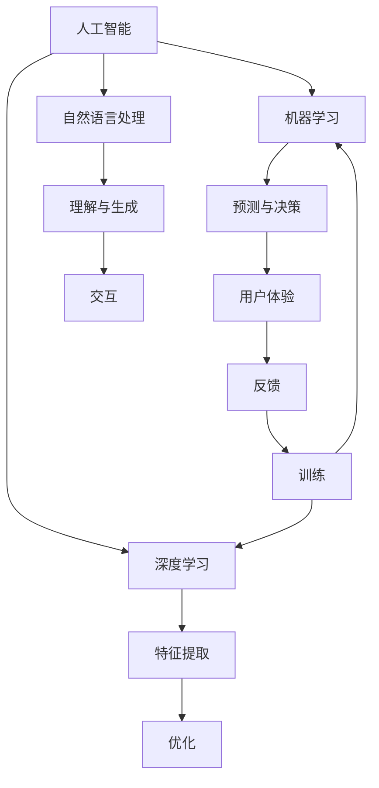

                 

# 李开复：苹果发布AI应用的用户

在当今这个信息爆炸的时代，人工智能(AI)技术正以惊人的速度改变着我们生活的方方面面。从智能手机、智能家居到自动驾驶、医疗健康，AI应用无所不在，正在重塑人类的生活方式和工作方式。作为世界级的人工智能专家和创新者，李开复博士在人工智能领域有着深厚的造诣和丰富的经验。在最近的一次公开演讲中，他分享了对苹果公司发布的新AI应用的看法，以及对AI应用用户的深度洞察。本文将通过李开复的演讲内容，探讨AI应用的用户需求、技术挑战以及未来发展趋势。

## 1. 背景介绍

### 1.1 人工智能技术的发展与普及
自从1950年代AI概念首次被提出以来，技术的发展已经经历了多个阶段。从1970年代的专家系统到1980年代的机器学习，再到2000年代中期的深度学习，AI技术日益成熟，并在各个领域得到了广泛应用。近年来，随着硬件算力的提升和数据量的激增，AI技术迎来了爆发式的发展，并在实际应用中取得了显著成果。

### 1.2 苹果与AI的结合
苹果公司作为全球知名的科技公司，一直以来都致力于将最新的AI技术融入到其产品和服务中。从Siri语音助手到Face ID面部识别，再到iPhone的图像识别和推荐系统，苹果的AI技术已经深入到每一个用户的生活中。在最近的一次全球开发者大会上，苹果宣布了一系列的AI新技术和应用，再次展示了其在AI领域的领先地位。

## 2. 核心概念与联系

### 2.1 核心概念概述

为了更好地理解李开复对苹果AI应用的看法，我们需要先了解一些核心概念和其联系：

- **人工智能**：使用计算机科学和数学方法来模拟人类智能行为的技术，包括机器学习、深度学习、自然语言处理等。
- **机器学习**：通过数据训练模型，使其能够自动学习和改进，从而做出预测或决策。
- **深度学习**：一种特殊的机器学习方法，通过神经网络模拟人类大脑的工作原理，实现高层次的特征提取和模式识别。
- **自然语言处理(NLP)**：使计算机能够理解、解释和生成人类语言的技术，包括文本分类、语音识别、机器翻译等。
- **苹果AI应用**：苹果公司开发的各类AI应用，如Siri、Face ID、图像识别、推荐系统等，旨在提升用户体验，优化产品功能。

这些概念之间的联系紧密，形成了苹果AI应用的完整生态系统。通过机器学习和深度学习，苹果能够不断优化其AI应用，提升用户体验；而自然语言处理则使得AI应用能够更好地理解和回应人类语言，从而实现更智能的交互。

### 2.2 核心概念的联系

下面通过一个Mermaid流程图来展示这些核心概念之间的联系：



这个流程图展示了人工智能、机器学习、深度学习和自然语言处理之间的关系及其在用户交互中的作用。机器学习通过数据训练模型，从而实现预测与决策；深度学习通过神经网络进行特征提取，提高模型的准确性；自然语言处理则使得AI应用能够更好地理解和生成人类语言，实现更智能的交互。这些技术的结合，最终提高了用户体验，并形成了良性循环。

## 3. 核心算法原理 & 具体操作步骤

### 3.1 算法原理概述

李开复在演讲中指出，苹果的AI应用之所以能够取得成功，离不开其强大的算法和数据支持。具体而言，苹果的AI应用采用了以下核心算法和技术：

- **深度学习**：通过神经网络进行特征提取和模式识别，提升模型的准确性和泛化能力。
- **自然语言处理**：使用语言模型和上下文感知技术，使AI应用能够理解并生成人类语言。
- **强化学习**：通过用户交互数据进行自适应调整，不断优化AI应用的功能和性能。
- **迁移学习**：利用已有的AI模型知识，快速适应新的任务和场景。

### 3.2 算法步骤详解

苹果的AI应用开发流程一般包括以下几个关键步骤：

1. **数据收集与预处理**：收集大量用户交互数据，包括文本、语音、图像等，并进行清洗、标注和归一化处理。
2. **模型训练**：使用深度学习框架（如TensorFlow、PyTorch）进行模型训练，优化模型参数。
3. **模型评估与优化**：在测试集上评估模型性能，根据评估结果调整模型结构和超参数。
4. **集成与部署**：将训练好的模型集成到应用中，部署到服务器或移动设备上，进行实时推理。
5. **反馈与迭代**：根据用户反馈和实际使用数据，不断优化模型和应用功能。

### 3.3 算法优缺点

苹果的AI应用采用了深度学习、自然语言处理和强化学习等技术，具有以下优点：

- **高效性**：通过数据驱动的方法，快速训练和优化模型，提升用户体验。
- **灵活性**：能够快速适应新场景和新任务，具有较强的迁移学习能力。
- **人性化**：利用自然语言处理技术，使AI应用能够更好地理解人类语言，实现更智能的交互。

但同时，这些技术也存在一些缺点：

- **数据依赖**：AI应用的性能高度依赖于数据的质量和数量，获取高质量数据成本较高。
- **资源消耗**：深度学习模型的计算资源消耗较大，对硬件设备的要求较高。
- **可解释性**：AI模型通常具有"黑盒"特性，用户难以理解其决策过程。
- **隐私和安全**：用户数据的安全和隐私保护问题，需要采取严格的措施进行保护。

### 3.4 算法应用领域

苹果的AI应用广泛应用在以下几个领域：

- **语音识别**：如Siri语音助手，使用深度学习模型进行语音识别和自然语言处理。
- **面部识别**：如Face ID，使用深度学习模型进行人脸识别和比对。
- **图像识别**：如拍照识物，使用卷积神经网络进行图像分类和特征提取。
- **推荐系统**：如推荐应用，使用协同过滤和深度学习模型进行用户行为预测和推荐。
- **智能家居**：如智能音箱，使用自然语言处理技术实现语音控制和交互。

## 4. 数学模型和公式 & 详细讲解 & 举例说明

### 4.1 数学模型构建

苹果的AI应用通常基于深度学习模型进行构建，以下以推荐系统为例，介绍推荐模型的数学模型：

假设推荐系统需要为用户推荐商品，模型输入为用户的交互历史数据$x$，输出为推荐结果$y$。推荐模型的数学模型可以表示为：

$$
y = f(x; \theta)
$$

其中$f$为推荐模型的前向传播函数，$\theta$为模型的参数。推荐模型的目标是最大化预测准确率，即：

$$
\min_{\theta} L(y, \hat{y})
$$

其中$L$为损失函数，$\hat{y}$为模型预测结果。

### 4.2 公式推导过程

以深度学习推荐系统为例，推荐模型的前向传播过程可以表示为：

$$
y = \text{sigmoid}(W_a x + b_a)
$$

其中$W_a$和$b_a$为用户的嵌入向量，$x$为用户交互历史数据，$\text{sigmoid}$为激活函数。推荐模型的损失函数可以表示为交叉熵损失：

$$
L(y, \hat{y}) = -\frac{1}{N}\sum_{i=1}^N y_i \log \hat{y}_i + (1-y_i) \log (1-\hat{y}_i)
$$

其中$y$为真实标签，$\hat{y}$为模型预测结果。

### 4.3 案例分析与讲解

假设某用户浏览了手机、电脑、书籍等商品，推荐模型根据这些数据，预测用户可能对笔记本电脑感兴趣。具体推理过程如下：

- 使用深度学习模型提取用户和商品的关键特征。
- 通过卷积神经网络或循环神经网络，对用户和商品特征进行交互融合。
- 利用全连接层和激活函数进行模型预测，得到用户对不同商品的兴趣概率。
- 根据预测概率对商品进行排序，推荐最可能满足用户需求的商品。

## 5. 项目实践：代码实例和详细解释说明

### 5.1 开发环境搭建

在进行项目实践前，需要准备以下开发环境：

1. **安装Python和相关库**：确保Python 3.x版本正确安装，并使用pip安装TensorFlow、Keras等深度学习库。
2. **配置GPU环境**：如果需要使用GPU进行模型训练，需要安装NVIDIA drivers，并设置CUDA环境变量。
3. **创建虚拟环境**：使用virtualenv创建Python虚拟环境，安装必要的依赖库。

### 5.2 源代码详细实现

以下是一个简单的推荐系统代码实现，使用Keras框架进行构建和训练：

```python
import numpy as np
import tensorflow as tf
from tensorflow.keras import layers

# 定义推荐模型
class RecommendationModel(tf.keras.Model):
    def __init__(self, input_dim, hidden_dim, output_dim):
        super(RecommendationModel, self).__init__()
        self.dense1 = layers.Dense(hidden_dim, activation='relu')
        self.dense2 = layers.Dense(output_dim, activation='sigmoid')

    def call(self, inputs):
        x = self.dense1(inputs)
        x = self.dense2(x)
        return x

# 加载数据
data = np.loadtxt('interaction_data.txt', delimiter=',', dtype=np.float32)
x_train, y_train = data[:, :3], data[:, 3]

# 定义模型
model = RecommendationModel(input_dim=3, hidden_dim=64, output_dim=1)
model.compile(optimizer=tf.keras.optimizers.Adam(learning_rate=0.01), loss='binary_crossentropy')

# 训练模型
model.fit(x_train, y_train, epochs=10, batch_size=32)

# 使用模型进行推荐
x_test = np.array([[1, 0, 1]])
y_pred = model.predict(x_test)
```

### 5.3 代码解读与分析

上述代码中，我们定义了一个简单的推荐系统模型，使用Keras框架进行训练和预测。具体解读如下：

- **推荐模型定义**：使用Keras定义一个推荐模型，包含两个全连接层和一个sigmoid激活函数，用于输出推荐概率。
- **数据加载**：加载训练数据，将其分为特征和标签。
- **模型编译**：使用Adam优化器进行模型编译，设置损失函数为二元交叉熵。
- **模型训练**：使用训练数据对模型进行10轮训练，每轮32个样本。
- **模型预测**：使用训练好的模型对测试数据进行预测，输出推荐概率。

## 6. 实际应用场景

### 6.1 语音识别应用

苹果的Siri语音助手是一款非常成功的AI应用。它使用了深度学习模型进行语音识别和自然语言处理，能够理解和回应用户的语音指令。用户可以通过Siri进行语音搜索、发送消息、设置提醒等操作。Siri的成功展示了语音识别技术在实际应用中的巨大潜力。

### 6.2 面部识别应用

Face ID是苹果设备中的一项重要功能，使用深度学习模型进行面部识别和比对。通过前置摄像头采集面部图像，使用神经网络进行特征提取和匹配，能够快速、准确地解锁设备。Face ID的应用极大地提升了设备的安全性和便利性。

### 6.3 图像识别应用

苹果设备中的拍照识物功能，使用深度学习模型进行图像分类和特征提取。用户只需拍下物品，就能获取物品的名称、描述等信息。拍照识物功能展示了深度学习在图像识别方面的强大能力，为用户提供了便捷的查询方式。

### 6.4 推荐系统应用

苹果设备的推荐应用，使用深度学习模型进行用户行为预测和商品推荐。通过分析用户的浏览历史和交互数据，推荐系统能够为用户推荐最感兴趣的商品。推荐系统的成功展示了深度学习在推荐算法中的优异表现，为用户提供了个性化的购物体验。

## 7. 工具和资源推荐

### 7.1 学习资源推荐

1. **《深度学习》一书**：Ian Goodfellow所著的经典书籍，系统介绍了深度学习的基本概念和算法。
2. **《Python深度学习》一书**：Francois Chollet所著的实战教程，详细讲解了使用Keras进行深度学习开发的流程。
3. **Coursera深度学习课程**：由Andrew Ng教授主讲的在线课程，涵盖深度学习的基本理论和实践。
4. **Kaggle数据科学竞赛**：参与实际的数据科学竞赛，实践深度学习模型的构建和优化。

### 7.2 开发工具推荐

1. **TensorFlow**：Google开发的深度学习框架，支持分布式计算和GPU加速，适合大规模模型训练。
2. **Keras**：高层次的深度学习框架，基于TensorFlow，易于使用，适合快速原型开发。
3. **PyTorch**：Facebook开发的深度学习框架，灵活性高，适合科研和生产应用。
4. **Jupyter Notebook**：轻量级的交互式开发环境，支持Python、R等语言，适合数据科学和深度学习开发。

### 7.3 相关论文推荐

1. **《ImageNet Classification with Deep Convolutional Neural Networks》**：Alex Krizhevsky等人发表的论文，展示了深度卷积神经网络在图像分类任务中的优异表现。
2. **《Siri: Interaction-Aware Personal Assistant》**：Apple公司发布的论文，介绍了Siri语音助手的技术架构和实现细节。
3. **《Fully Convolutional Networks for Semantic Segmentation》**：Jonathan Long等人发表的论文，展示了深度卷积神经网络在语义分割任务中的应用。
4. **《FaceNet: A Unified Embedding for Face Recognition and Clustering》**：Jeff Donahue等人发表的论文，展示了使用卷积神经网络进行人脸识别的技术。

## 8. 总结：未来发展趋势与挑战

### 8.1 研究成果总结

通过对苹果AI应用的分析，我们可以看到，深度学习、自然语言处理和强化学习等技术在AI应用开发中发挥了重要作用。这些技术的应用不仅提升了用户体验，还推动了AI技术的普及和应用。

### 8.2 未来发展趋势

未来，AI技术将进一步渗透到各个领域，推动社会的数字化和智能化进程。以下是对未来发展趋势的几点展望：

1. **多模态融合**：将视觉、语音、文本等多种模态数据进行融合，实现更全面、更智能的交互体验。
2. **边缘计算**：将AI应用部署到边缘设备，如智能音箱、智能家居等，实现更快速、更便捷的计算。
3. **联邦学习**：通过分布式计算和本地数据训练，保护用户隐私，同时提升模型性能。
4. **自动化调参**：使用自动化调参技术，优化模型超参数，提升模型训练效率和效果。
5. **自适应学习**：使用自适应学习技术，根据用户反馈和行为数据，不断优化AI应用功能。

### 8.3 面临的挑战

尽管AI技术已经取得了显著进展，但在推广和应用过程中仍面临一些挑战：

1. **数据隐私**：AI应用需要大量的用户数据，如何保护用户隐私和数据安全，是一个亟待解决的问题。
2. **计算资源**：深度学习模型的计算资源消耗较大，如何降低计算成本，提升模型训练和推理效率，是一个重要课题。
3. **模型可解释性**：AI模型通常具有"黑盒"特性，如何提高模型的可解释性，让用户理解和信任AI应用，是一个重要的研究方向。
4. **伦理和安全**：AI应用可能存在偏见和歧视，如何建立伦理导向的模型，确保AI应用的安全性和公平性，是一个亟待解决的问题。

### 8.4 研究展望

为应对这些挑战，未来需要在以下几个方面进行深入研究：

1. **隐私保护技术**：开发隐私保护算法和工具，保护用户数据隐私和安全。
2. **资源优化技术**：优化模型结构和算法，降低计算成本，提高模型训练和推理效率。
3. **模型可解释性技术**：开发可解释性模型和工具，提高模型的透明度和可理解性。
4. **伦理导向技术**：建立伦理导向的模型评估指标，确保AI应用的安全性和公平性。
5. **跨模态融合技术**：开发跨模态融合算法，实现多模态数据的协同建模和理解。

通过以上研究和探索，相信AI技术将进一步普及和深化应用，为人类社会带来更多的便利和福祉。

## 9. 附录：常见问题与解答

**Q1：AI应用的成功关键是什么？**

A: AI应用的成功关键在于算法和技术的选择、数据的积累和处理、模型的训练和优化等方面。需要综合考虑技术可行性和用户体验，才能打造出优秀的AI应用。

**Q2：AI应用的未来发展方向是什么？**

A: AI应用的未来发展方向包括多模态融合、边缘计算、联邦学习、自动化调参、自适应学习等。这些技术将进一步提升AI应用的智能化水平和用户满意度。

**Q3：如何在AI应用开发中保护用户隐私？**

A: 在AI应用开发中，保护用户隐私可以通过数据匿名化、差分隐私、联邦学习等技术实现。同时，需要建立严格的隐私保护机制，确保用户数据的安全和隐私。

**Q4：如何提高AI模型的可解释性？**

A: 提高AI模型的可解释性可以通过可解释性模型、特征重要性分析、模型可视化等技术实现。需要逐步探索和开发更先进的可解释性工具，帮助用户理解和信任AI应用。

**Q5：AI应用在推广和应用过程中面临哪些挑战？**

A: AI应用在推广和应用过程中面临的数据隐私、计算资源、模型可解释性、伦理和安全等挑战，需要通过多方面的技术创新和政策引导，逐步解决这些问题，推动AI技术的健康发展。

总结：通过对苹果AI应用的深入分析，我们看到了深度学习、自然语言处理和强化学习等技术在AI应用中的巨大潜力。未来，AI技术将在更多领域得到应用，推动社会的数字化和智能化进程。同时，也需要注意解决数据隐私、计算资源、模型可解释性、伦理和安全等挑战，确保AI技术的安全和公平发展。

作者：禅与计算机程序设计艺术 / Zen and the Art of Computer Programming

