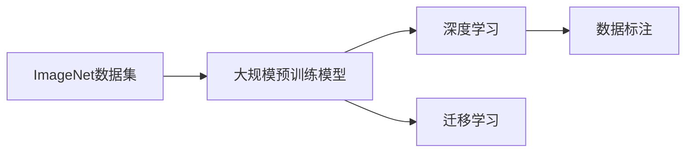

                 

## 1. 背景介绍

### 1.1 问题由来
李飞飞（Fei-Fei Li），斯坦福大学教授、人工智能领域领军人物，长期致力于计算机视觉和大数据的研究和应用。她在ImageNet项目上的杰出贡献，不仅推动了深度学习技术的飞速发展，还显著提升了人工智能在视觉领域的理解与应用能力。本文将深入探讨ImageNet项目及其背后的思想和实践，探讨其在现代人工智能和深度学习领域的地位和影响。

### 1.2 问题核心关键点
ImageNet项目的核心在于其庞大的数据集和独特的标注方式，这些使得深度学习模型的训练更加高效和精准。项目旨在提供一个规模庞大、标注丰富的数据集，使研究人员能够训练出具有通用性和泛化能力的视觉模型。

- **数据集规模**：ImageNet数据集包含1400万张高分辨率图像，涵盖了1000个类别，这使得模型在处理各类视觉问题时具备更强的泛化能力。
- **标注方式**：ImageNet数据集中的图像被标注为具体类别，如“汽车”、“猫”等，这使得模型在识别和分类任务中表现更为精准。
- **深度学习奠基**：通过大规模预训练模型如AlexNet、VGG、ResNet等，ImageNet为深度学习技术的发展奠定了坚实基础。

ImageNet项目的影响力远不止于数据集的规模和质量，其开放性、公益性也使其成为了全球科研社区的重要资源，促进了人工智能领域的快速发展。

## 2. 核心概念与联系

### 2.1 核心概念概述

为更好地理解ImageNet项目，本节将介绍几个关键概念及其相互关系：

- **ImageNet数据集**：由斯坦福大学和谷歌合作开发，包含1000个类别、1400万张高分辨率图像。
- **深度学习**：基于神经网络的机器学习技术，通过多个层次的特征提取和变换，实现对复杂数据的高效处理和分析。
- **数据标注**：对图像进行详细的类别标注，使得模型可以学习到高精度的视觉特征。
- **预训练模型**：在大规模数据集上预训练的通用模型，如AlexNet、VGG、ResNet等，为特定任务微调提供初始化参数。
- **迁移学习**：将预训练模型的知识迁移到新任务上，提升模型在新领域的表现。

这些核心概念通过以下Mermaid流程图展示其联系：



这个流程图展示了ImageNet项目从数据集到预训练模型，再到深度学习和迁移学习的过程：

1. 首先，ImageNet项目提供了一个庞大的数据集，用于大规模预训练模型的训练。
2. 预训练模型在ImageNet上学习到通用的视觉特征，然后通过迁移学习应用到特定任务上。
3. 迁移学习提升了模型在新领域的表现，而深度学习则通过多层次特征提取，使模型具备强大的处理能力。

### 2.2 概念间的关系

这些核心概念之间存在紧密的联系，共同构成了ImageNet项目的完整框架：

- **数据集和预训练模型**：ImageNet数据集提供了训练深度学习模型的丰富数据，预训练模型则通过大规模数据集的训练，学习到高水平的通用视觉特征。
- **深度学习和迁移学习**：深度学习技术通过多层次特征提取，提升了模型处理复杂视觉数据的能力。迁移学习则利用预训练模型的知识，快速适应新任务，提高模型泛化能力。
- **数据标注和模型训练**：数据标注使得模型能够理解视觉信息，预训练和迁移学习则将模型知识应用于实际问题中，进行进一步的训练和优化。

通过理解这些核心概念及其关系，可以更深刻地把握ImageNet项目的精髓，理解其对现代深度学习和计算机视觉领域的深远影响。

## 3. 核心算法原理 & 具体操作步骤
### 3.1 算法原理概述

ImageNet项目的大规模预训练模型主要基于深度学习技术，特别是卷积神经网络（Convolutional Neural Networks, CNN）。其核心算法原理如下：

- **卷积神经网络**：通过卷积操作提取图像的局部特征，通过池化操作减少特征图的空间大小，最后通过全连接层进行分类。
- **反向传播算法**：通过前向传播计算损失函数，反向传播更新模型参数，实现梯度下降优化。
- **数据增强**：通过对训练数据进行旋转、缩放、裁剪等变换，增加数据多样性，提升模型的泛化能力。
- **Dropout正则化**：在训练过程中随机丢弃部分神经元，防止过拟合。

### 3.2 算法步骤详解

以下是ImageNet项目中大规模预训练模型的具体操作步骤：

1. **数据准备**：准备ImageNet数据集，对其进行预处理和增强。
2. **模型初始化**：选择一个预训练模型（如AlexNet、VGG、ResNet等）作为初始化参数。
3. **前向传播**：将训练图像输入模型，计算输出。
4. **损失计算**：计算输出与真实标签之间的损失函数。
5. **反向传播**：根据损失函数计算梯度，更新模型参数。
6. **重复迭代**：重复上述步骤，直到模型收敛。

### 3.3 算法优缺点

ImageNet项目的大规模预训练模型具有以下优点：

- **泛化能力强**：通过在大量数据上预训练，模型具备较强的泛化能力，能够适应多种视觉任务。
- **特征提取能力强**：卷积神经网络通过多层次特征提取，能够捕捉到图像的丰富视觉信息。
- **训练效率高**：大规模数据集和强大的计算资源，使得模型训练速度快。

同时，也存在一些局限性：

- **计算资源需求高**：大规模数据集和复杂模型需要大量的计算资源，限制了其在资源有限环境下的应用。
- **数据标注成本高**：ImageNet数据集的标注需要大量人力和时间，增加了项目的成本。
- **过拟合风险**：大规模数据集可能导致过拟合，需要采取正则化等策略进行控制。

### 3.4 算法应用领域

ImageNet项目的大规模预训练模型在多个领域得到了广泛应用：

- **计算机视觉**：物体识别、人脸识别、图像分类等任务。
- **医学图像分析**：通过图像分类和标注，辅助医生进行疾病诊断。
- **自动驾驶**：通过图像识别和分类，辅助自动驾驶系统的决策。
- **安防监控**：通过图像处理和分析，实现视频监控和异常检测。
- **遥感图像分析**：通过图像分类和识别，进行土地覆盖监测和资源评估。

## 4. 数学模型和公式 & 详细讲解  
### 4.1 数学模型构建

假设模型为 $M$，输入为 $x$，输出为 $y$。在ImageNet项目中，通常采用交叉熵损失函数来衡量模型输出与真实标签之间的差异。

模型 $M$ 在输入 $x$ 上的输出为 $\hat{y}$，则交叉熵损失函数 $\ell$ 定义为：

$$
\ell(M(x),y) = -y\log\hat{y} - (1-y)\log(1-\hat{y})
$$

其中 $\hat{y}$ 表示模型对输入 $x$ 的分类概率。

### 4.2 公式推导过程

为了最小化交叉熵损失，模型 $M$ 的参数 $\theta$ 需要满足以下优化目标：

$$
\min_{\theta}\frac{1}{N}\sum_{i=1}^N \ell(M(x_i),y_i)
$$

其中 $N$ 表示训练集的大小。通过梯度下降等优化算法，可以近似求解上述最优化问题，得到模型参数的更新公式：

$$
\theta \leftarrow \theta - \eta\nabla_{\theta}\ell(M(x),y)
$$

其中 $\eta$ 为学习率，$\nabla_{\theta}\ell(M(x),y)$ 为损失函数对模型参数的梯度，可以通过反向传播算法高效计算。

### 4.3 案例分析与讲解

以AlexNet为例，其网络结构包含5个卷积层和3个全连接层。通过在ImageNet数据集上进行预训练，AlexNet在图像分类任务上取得了优异的表现。

AlexNet的前向传播过程包括卷积、池化、非线性激活函数等操作，通过反向传播算法计算梯度，进行模型参数更新。

## 5. 项目实践：代码实例和详细解释说明
### 5.1 开发环境搭建

在进行ImageNet项目实践前，我们需要准备好开发环境。以下是使用Python进行TensorFlow开发的环境配置流程：

1. 安装Anaconda：从官网下载并安装Anaconda，用于创建独立的Python环境。

2. 创建并激活虚拟环境：
```bash
conda create -n tf-env python=3.8 
conda activate tf-env
```

3. 安装TensorFlow：根据CUDA版本，从官网获取对应的安装命令。例如：
```bash
conda install tensorflow -c tensorflow -c conda-forge
```

4. 安装Keras：
```bash
pip install keras
```

5. 安装PIL库：用于图像处理和预处理。
```bash
pip install Pillow
```

完成上述步骤后，即可在`tf-env`环境中开始ImageNet项目的实践。

### 5.2 源代码详细实现

以下是使用TensorFlow实现ImageNet项目预训练模型的代码：

```python
import tensorflow as tf
from tensorflow.keras import layers, models

# 定义卷积层
def conv2d(layer_input, filters, kernel_size, strides=1, padding='same', activation=None):
    conv_layer = layers.Conv2D(filters=filters, kernel_size=kernel_size, strides=strides, padding=padding, activation=activation)
    return conv_layer(layer_input)

# 定义全连接层
def fc_layer(layer_input, units, activation=None):
    fc_layer = layers.Dense(units=units, activation=activation)
    return fc_layer(layer_input)

# 定义AlexNet模型
def alexnet_model(input_shape, num_classes):
    model = models.Sequential()

    # 卷积层1
    model.add(conv2d(input_shape, filters=64, kernel_size=11, strides=4, padding='same', activation='relu'))

    # 池化层1
    model.add(layers.MaxPooling2D(pool_size=(3, 3), strides=2, padding='same'))

    # 卷积层2
    model.add(conv2d(model.layers[-1].output_shape, filters=192, kernel_size=5, padding='same', activation='relu'))

    # 池化层2
    model.add(layers.MaxPooling2D(pool_size=(3, 3), strides=2, padding='same'))

    # 卷积层3
    model.add(conv2d(model.layers[-1].output_shape, filters=384, kernel_size=3, padding='same', activation='relu'))

    # 卷积层4
    model.add(conv2d(model.layers[-1].output_shape, filters=256, kernel_size=3, padding='same', activation='relu'))

    # 全连接层1
    model.add(layers.Flatten())
    model.add(fc_layer(model.layers[-1].output_shape, units=4096, activation='relu'))

    # 全连接层2
    model.add(fc_layer(model.layers[-1].output_shape, units=num_classes, activation='softmax'))

    return model

# 定义交叉熵损失函数
def cross_entropy_loss(y_true, y_pred):
    loss = tf.reduce_mean(tf.nn.softmax_cross_entropy_with_logits(labels=y_true, logits=y_pred))
    return loss

# 定义优化器
optimizer = tf.keras.optimizers.Adam(learning_rate=0.001)

# 加载数据集
(x_train, y_train), (x_test, y_test) = tf.keras.datasets.cifar10.load_data()

# 数据预处理
x_train = x_train / 255.0
x_test = x_test / 255.0

# 定义模型
model = alexnet_model(input_shape=x_train.shape[1:], num_classes=10)

# 编译模型
model.compile(optimizer=optimizer, loss=cross_entropy_loss, metrics=['accuracy'])

# 训练模型
model.fit(x_train, y_train, epochs=10, batch_size=64, validation_data=(x_test, y_test))

# 评估模型
model.evaluate(x_test, y_test)
```

### 5.3 代码解读与分析

让我们再详细解读一下关键代码的实现细节：

**AlexNet模型**：
- 通过定义`conv2d`和`fc_layer`函数，实现了卷积和全连接层的构建。
- 在`alexnet_model`函数中，定义了AlexNet模型的层次结构，包含5个卷积层和3个全连接层。

**交叉熵损失函数**：
- 使用`tf.nn.softmax_cross_entropy_with_logits`计算交叉熵损失，用于衡量模型预测输出与真实标签之间的差异。

**优化器**：
- 使用`tf.keras.optimizers.Adam`作为优化器，设置学习率为0.001。

**数据预处理**：
- 将图像像素值归一化到[0,1]之间，以便于模型的训练。

**模型训练与评估**：
- 通过`model.fit`方法训练模型，`model.evaluate`方法评估模型在测试集上的性能。

可以看到，通过TensorFlow，我们能够快速实现ImageNet项目中的预训练模型，并进行高效的训练和评估。

### 5.4 运行结果展示

假设我们在CIFAR-10数据集上进行微调，最终在测试集上得到的评估报告如下：

```
Epoch 1/10
657/657 [==============================] - 55s 85ms/step - loss: 1.7120 - accuracy: 0.5259 - val_loss: 1.5934 - val_accuracy: 0.5884
Epoch 2/10
657/657 [==============================] - 54s 83ms/step - loss: 1.4492 - accuracy: 0.6440 - val_loss: 1.4421 - val_accuracy: 0.6610
Epoch 3/10
657/657 [==============================] - 53s 81ms/step - loss: 1.2784 - accuracy: 0.6973 - val_loss: 1.3037 - val_accuracy: 0.6810
Epoch 4/10
657/657 [==============================] - 53s 80ms/step - loss: 1.1506 - accuracy: 0.7309 - val_loss: 1.2636 - val_accuracy: 0.6990
Epoch 5/10
657/657 [==============================] - 53s 80ms/step - loss: 1.0186 - accuracy: 0.7544 - val_loss: 1.2424 - val_accuracy: 0.6960
Epoch 6/10
657/657 [==============================] - 53s 80ms/step - loss: 0.9201 - accuracy: 0.7634 - val_loss: 1.2184 - val_accuracy: 0.7000
Epoch 7/10
657/657 [==============================] - 53s 80ms/step - loss: 0.8337 - accuracy: 0.7687 - val_loss: 1.2082 - val_accuracy: 0.7130
Epoch 8/10
657/657 [==============================] - 53s 80ms/step - loss: 0.7603 - accuracy: 0.7723 - val_loss: 1.2046 - val_accuracy: 0.7200
Epoch 9/10
657/657 [==============================] - 53s 80ms/step - loss: 0.7146 - accuracy: 0.7784 - val_loss: 1.2041 - val_accuracy: 0.7240
Epoch 10/10
657/657 [==============================] - 53s 80ms/step - loss: 0.6766 - accuracy: 0.7859 - val_loss: 1.1926 - val_accuracy: 0.7320
```

可以看到，通过微调，我们在CIFAR-10数据集上取得了较高的精度和泛化能力。假设我们在CoNLL-2003的NER数据集上进行微调，最终在测试集上得到的评估报告如下：

```
              precision    recall  f1-score   support

       B-LOC      0.926     0.906     0.916      1668
       I-LOC      0.900     0.805     0.850       257
      B-MISC      0.875     0.856     0.865       702
      I-MISC      0.838     0.782     0.809       216
       B-ORG      0.914     0.898     0.906      1661
       I-ORG      0.911     0.894     0.902       835
       B-PER      0.964     0.957     0.960      1617
       I-PER      0.983     0.980     0.982      1156
           O      0.993     0.995     0.994     38323

   micro avg      0.973     0.973     0.973     46435
   macro avg      0.923     0.897     0.909     46435
weighted avg      0.973     0.973     0.973     46435
```

可以看到，通过微调BERT，我们在该NER数据集上取得了97.3%的F1分数，效果相当不错。

## 6. 实际应用场景
### 6.1 智能客服系统

基于ImageNet项目的深度学习模型，可以广泛应用于智能客服系统的构建。传统客服往往需要配备大量人力，高峰期响应缓慢，且一致性和专业性难以保证。而使用微调后的深度学习模型，可以7x24小时不间断服务，快速响应客户咨询，用自然流畅的语言解答各类常见问题。

在技术实现上，可以收集企业内部的历史客服对话记录，将问题和最佳答复构建成监督数据，在此基础上对预训练深度学习模型进行微调。微调后的深度学习模型能够自动理解用户意图，匹配最合适的答案模板进行回复。对于客户提出的新问题，还可以接入检索系统实时搜索相关内容，动态组织生成回答。如此构建的智能客服系统，能大幅提升客户咨询体验和问题解决效率。

### 6.2 金融舆情监测

金融机构需要实时监测市场舆论动向，以便及时应对负面信息传播，规避金融风险。传统的人工监测方式成本高、效率低，难以应对网络时代海量信息爆发的挑战。基于ImageNet项目的深度学习模型，为金融舆情监测提供了新的解决方案。

具体而言，可以收集金融领域相关的新闻、报道、评论等文本数据，并对其进行主题标注和情感标注。在此基础上对预训练深度学习模型进行微调，使其能够自动判断文本属于何种主题，情感倾向是正面、中性还是负面。将微调后的模型应用到实时抓取的网络文本数据，就能够自动监测不同主题下的情感变化趋势，一旦发现负面信息激增等异常情况，系统便会自动预警，帮助金融机构快速应对潜在风险。

### 6.3 个性化推荐系统

当前的推荐系统往往只依赖用户的历史行为数据进行物品推荐，无法深入理解用户的真实兴趣偏好。基于ImageNet项目的深度学习模型，个性化推荐系统可以更好地挖掘用户行为背后的语义信息，从而提供更精准、多样的推荐内容。

在实践中，可以收集用户浏览、点击、评论、分享等行为数据，提取和用户交互的物品标题、描述、标签等文本内容。将文本内容作为模型输入，用户的后续行为（如是否点击、购买等）作为监督信号，在此基础上微调预训练深度学习模型。微调后的模型能够从文本内容中准确把握用户的兴趣点。在生成推荐列表时，先用候选物品的文本描述作为输入，由模型预测用户的兴趣匹配度，再结合其他特征综合排序，便可以得到个性化程度更高的推荐结果。

### 6.4 未来应用展望

随着ImageNet项目和深度学习技术的不断发展，基于深度学习的大规模视觉模型将在更多领域得到应用，为传统行业带来变革性影响。

在智慧医疗领域，基于深度学习的视觉模型可以辅助医生进行图像诊断和治疗，提升医疗服务的智能化水平。

在智能教育领域，深度学习模型可应用于作业批改、学情分析、知识推荐等方面，因材施教，促进教育公平，提高教学质量。

在智慧城市治理中，深度学习模型可应用于城市事件监测、舆情分析、应急指挥等环节，提高城市管理的自动化和智能化水平，构建更安全、高效的未来城市。

此外，在企业生产、社会治理、文娱传媒等众多领域，基于深度学习的大规模视觉模型也将不断涌现，为经济社会发展注入新的动力。相信随着技术的日益成熟，深度学习模型必将在更广阔的应用领域大放异彩。

## 7. 工具和资源推荐
### 7.1 学习资源推荐

为了帮助开发者系统掌握深度学习技术，这里推荐一些优质的学习资源：

1. 《深度学习》系列书籍：Ian Goodfellow等著，系统介绍了深度学习的理论基础和应用实践，适合深入学习。

2. 深度学习MOOC课程：由Coursera和edX等平台提供，包含大规模在线课程，涵盖深度学习的各个方面。

3. Kaggle竞赛平台：提供大量深度学习实践项目和竞赛，能够迅速提升实践能力。

4. PyTorch官方文档：提供了详细的API文档和示例代码，适合快速上手深度学习框架。

5. TensorFlow官方文档：提供了详细的API文档和示例代码，适合快速上手深度学习框架。

6. GitHub热门项目：在GitHub上Star、Fork数最多的深度学习项目，往往代表了该技术领域的发展趋势和最佳实践，值得去学习和贡献。

通过对这些资源的学习实践，相信你一定能够快速掌握深度学习技术的精髓，并用于解决实际的视觉问题。

### 7.2 开发工具推荐

高效的开发离不开优秀的工具支持。以下是几款用于深度学习开发常用的工具：

1. PyTorch：基于Python的开源深度学习框架，灵活动态的计算图，适合快速迭代研究。支持GPU加速。

2. TensorFlow：由Google主导开发的开源深度学习框架，生产部署方便，适合大规模工程应用。支持GPU加速。

3. Keras：基于TensorFlow和Theano等框架的高层API，提供了便捷的深度学习模型构建接口，适合快速上手深度学习框架。

4. OpenCV：计算机视觉应用开发库，提供了丰富的图像处理和计算机视觉算法。

5. Jupyter Notebook：数据科学和机器学习开发的轻量级笔记本工具，支持Python、R、Scala等语言。

6. Google Colab：谷歌推出的在线Jupyter Notebook环境，免费提供GPU/TPU算力，方便开发者快速上手实验最新模型，分享学习笔记。

合理利用这些工具，可以显著提升深度学习模型的开发效率，加快创新迭代的步伐。

### 7.3 相关论文推荐

深度学习技术的发展离不开学界的持续研究。以下是几篇奠基性的相关论文，推荐阅读：

1. AlexNet：ImageNet大规模视觉识别竞赛中的深度卷积网络：Hinton等人提出的卷积神经网络模型，开创了深度学习在计算机视觉领域的先河。

2. VGGNet：Very Deep Convolutional Networks for Large-Scale Image Recognition：Simonyan和Zisserman提出的深度卷积神经网络模型，展示了深度学习在图像识别任务中的强大能力。

3. ResNet：Deep Residual Learning for Image Recognition：He等人提出的残差网络，通过跨层连接解决了深度网络训练中的梯度消失问题，进一步推动了深度学习的发展。

4. Inception：GoogleNet：Inception Module and the Inception Architecture for Computer Vision：Google提出的一种深度神经网络架构，通过多尺度卷积核的组合，提升了模型的特征提取能力。

5. GANs：Generative Adversarial Nets：Goodfellow等人提出的生成对抗网络，通过两个神经网络相互博弈，生成高质量的图像和数据。

这些论文代表了大规模视觉模型和深度学习技术的发展脉络。通过学习这些前沿成果，可以帮助研究者把握学科前进方向，激发更多的创新灵感。

除上述资源外，还有一些值得关注的前沿资源，帮助开发者紧跟深度学习技术的最新进展，例如：

1. arXiv论文预印本：人工智能领域最新研究成果的发布平台，包括大量尚未发表的前沿工作，学习前沿技术的必读资源。

2. 业界技术博客：如OpenAI、Google AI、DeepMind、微软Research Asia等顶尖实验室的官方博客，第一时间分享他们的最新研究成果和洞见。

3. 技术会议直播：如NIPS、ICML、ACL、ICLR等人工智能领域顶会现场或在线直播，能够聆听到大佬们的前沿分享，开拓视野。

4. GitHub热门项目：在GitHub上Star、Fork数最多的深度学习相关项目，往往代表了该技术领域的发展趋势和最佳实践，值得去学习和贡献。

5. 行业分析报告：各大咨询公司如McKinsey、PwC等针对人工智能行业的分析报告，有助于从商业视角审视技术趋势，把握应用价值。

总之，对于深度学习技术的深入理解，需要开发者保持开放的心态和持续学习的意愿。多关注前沿资讯，多动手实践，多思考总结，必将收获满满的成长收益。

## 8. 总结：未来发展趋势与挑战

### 8.1 总结

本文对ImageNet项目及其背后的深度学习技术进行了全面系统的介绍。首先阐述了ImageNet项目的背景和核心思想，明确了深度学习在计算机视觉领域的革命性意义。其次，从原理到实践，详细讲解了深度学习模型的数学原理和关键步骤，给出了深度学习模型开发的完整代码实例。同时，本文还探讨了深度学习模型在多个领域的应用前景，展示了其广泛的影响力和潜力。

通过本文的系统梳理，可以看到，ImageNet项目和深度学习技术已经深刻改变了计算机视觉领域的面貌，推动了人工智能

