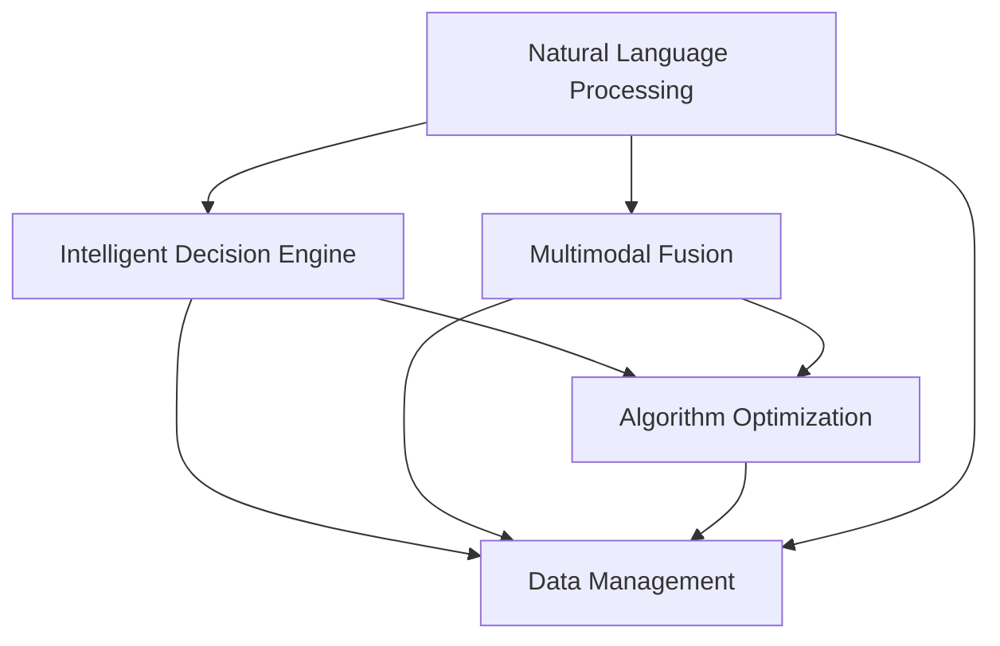

                 

# 构建个人AI助手生态系统的方法

> 关键词：个人AI助手,生态系统构建,自然语言处理(NLP),智能决策,多模态融合,算法优化,数据管理

## 1. 背景介绍

### 1.1 问题由来

在当前信息爆炸的时代，个人需要处理的信息量呈指数级增长，如何高效地从海量数据中提取有用的信息，做出明智的决策，已成为每个人都需要面对的挑战。传统的基于规则的系统往往无法应对复杂多变的场景，而基于人工智能（AI）的解决方案，尤其是智能决策支持系统，提供了一种更为灵活和高效的方式。

### 1.2 问题核心关键点

在构建个人AI助手生态系统的过程中，我们需要解决以下几个核心问题：

- 如何高效地收集、整理和分析个人数据？
- 如何构建能够处理多种数据类型（文本、图像、语音等）的智能决策引擎？
- 如何在保护用户隐私的前提下，实现智能决策的支持和个性化服务？
- 如何设计用户友好的界面和交互方式，让用户能够方便地使用AI助手？

这些问题涉及到数据管理、算法优化、用户界面设计等多个方面，需要综合运用多种技术手段来解决。

### 1.3 问题研究意义

构建个人AI助手生态系统，不仅能够极大地提升个人的信息处理效率，还能在医疗、金融、教育等多个领域提供智能决策支持，从而提升生活质量和工作效率。具体意义如下：

1. **提升信息处理效率**：个人AI助手能够自动收集、整理和分析各类数据，提供精准的信息推荐，帮助用户更快地做出决策。
2. **个性化服务**：通过学习用户行为和偏好，AI助手能够提供个性化的信息和服务，满足用户的独特需求。
3. **智能决策支持**：基于AI决策引擎，AI助手能够提供基于数据的决策支持，帮助用户应对复杂问题。
4. **跨领域应用**：AI助手能够应用于医疗、金融、教育等多个领域，提供多样化的智能服务。
5. **隐私保护**：通过采用隐私保护技术，AI助手能够在不泄露用户隐私的前提下，提供个性化服务。

## 2. 核心概念与联系

### 2.1 核心概念概述

为了更好地理解构建个人AI助手生态系统的过程，我们先介绍几个核心概念：

- **自然语言处理（NLP）**：处理、分析和生成人类语言的技术，是构建个人AI助手的重要基础。
- **智能决策引擎**：基于人工智能算法，自动处理和分析数据，提供智能决策支持的系统。
- **多模态融合**：将文本、图像、语音等多种数据类型融合在一起，提供全面的信息理解和分析。
- **算法优化**：优化算法以提高AI助手的性能和效率。
- **数据管理**：管理和保护用户数据的隐私和安全。

### 2.2 概念间的关系

这些核心概念之间的关系可以通过以下Mermaid流程图来展示：



这个流程图展示了构建个人AI助手生态系统所需的关键技术，包括NLP、智能决策引擎、多模态融合、算法优化和数据管理，它们相互协作，共同支撑AI助手的各项功能。

## 3. 核心算法原理 & 具体操作步骤

### 3.1 算法原理概述

构建个人AI助手生态系统，涉及多个核心算法和步骤。本节将详细介绍这些算法和步骤的原理和实施方法。

### 3.2 算法步骤详解

**Step 1: 数据收集与预处理**

- **数据收集**：收集个人用户的数据，包括文本、图像、语音等。
- **数据预处理**：清洗、归一化数据，去除噪声和无关信息，确保数据的质量和一致性。

**Step 2: 自然语言处理（NLP）**

- **分词和词性标注**：将文本数据分割成词语，并标注每个词语的词性。
- **命名实体识别**：识别文本中的实体（人名、地名、组织名等）。
- **情感分析**：分析文本中的情感倾向，判断其情绪状态。
- **语义理解**：通过词向量或预训练语言模型（如BERT、GPT），理解文本的语义。

**Step 3: 智能决策引擎**

- **特征提取**：从文本、图像、语音等多种数据源中提取特征，形成统一的数据格式。
- **模型训练**：使用监督学习或强化学习算法，训练决策模型，使其能够自动处理和分析数据。
- **模型预测**：输入数据，模型输出预测结果，支持智能决策。

**Step 4: 多模态融合**

- **数据融合**：将文本、图像、语音等数据进行融合，形成多模态数据集。
- **特征对齐**：对不同数据源提取的特征进行对齐，确保特征的一致性。
- **信息集成**：综合多模态数据的信息，形成统一的决策依据。

**Step 5: 算法优化**

- **模型压缩**：使用模型剪枝、量化等技术，压缩模型大小，提高推理速度。
- **分布式训练**：采用分布式训练技术，加快模型训练速度。
- **在线学习**：采用在线学习技术，不断更新模型，提高模型的适应性。

**Step 6: 数据管理**

- **数据存储**：选择合适的数据库或分布式文件系统，存储和管理用户数据。
- **数据加密**：对敏感数据进行加密，保护用户隐私。
- **隐私保护**：采用差分隐私、联邦学习等技术，保护用户隐私。

### 3.3 算法优缺点

**优点**：

- **自动化处理**：AI助手能够自动处理和分析数据，减轻人工负担。
- **个性化服务**：通过学习用户行为和偏好，提供个性化的信息和服务。
- **智能决策支持**：基于AI决策引擎，提供基于数据的决策支持。
- **跨领域应用**：AI助手能够应用于医疗、金融、教育等多个领域。

**缺点**：

- **数据隐私**：AI助手需要收集和分析用户数据，可能面临隐私泄露的风险。
- **模型复杂**：构建高性能的AI助手需要复杂的算法和大量的计算资源。
- **交互设计**：需要设计友好的界面和交互方式，提高用户的使用体验。

### 3.4 算法应用领域

个人AI助手生态系统已经在多个领域得到了广泛应用，例如：

- **医疗**：通过分析病历、检验报告等医疗数据，提供智能诊断和用药建议。
- **金融**：基于用户交易记录，提供投资策略和风险评估。
- **教育**：通过分析学生的学习数据，提供个性化学习建议。
- **智能家居**：根据用户的生活习惯，自动控制家庭设备，提升生活质量。
- **个人理财**：分析用户的消费记录，提供个性化的理财建议。

## 4. 数学模型和公式 & 详细讲解  
### 4.1 数学模型构建

在构建个人AI助手生态系统时，需要构建多个数学模型，包括文本分析、情感分析、多模态融合等。

- **文本分析**：使用词向量或预训练语言模型，对文本进行向量化，使用卷积神经网络（CNN）或循环神经网络（RNN）进行特征提取。
- **情感分析**：使用卷积神经网络或注意力机制，对文本中的情感进行分类。
- **多模态融合**：使用融合算法（如时空卷积网络（STCN））将文本、图像、语音等多种数据进行融合。

### 4.2 公式推导过程

以情感分析为例，使用卷积神经网络进行情感分类。假设输入文本为 $X$，输出为 $Y$，使用 $n$ 维词向量表示文本。情感分类模型的公式推导如下：

$$
Y = \max_{i=1}^n (W_i \cdot X + b_i)
$$

其中 $W_i$ 为卷积核权重，$b_i$ 为偏置项，$n$ 为卷积核的数量。通过计算每个位置的最大卷积输出，得到最终的情感分类结果。

### 4.3 案例分析与讲解

假设我们正在构建一个个人理财AI助手，需要分析用户的消费记录和投资行为，提供个性化的理财建议。具体步骤包括：

1. **数据收集**：收集用户的消费记录和投资行为数据。
2. **数据预处理**：清洗、归一化数据，去除噪声和无关信息。
3. **特征提取**：使用预训练语言模型对消费记录进行向量化，使用循环神经网络提取用户行为特征。
4. **模型训练**：使用监督学习算法，训练理财推荐模型，根据用户行为预测理财建议。
5. **模型预测**：输入用户行为数据，模型输出理财建议。

## 5. 项目实践：代码实例和详细解释说明

### 5.1 开发环境搭建

要构建个人AI助手生态系统，需要选择合适的开发环境和工具。以下是常用的开发环境和工具：

1. **Python环境**：安装Python和相关库（如TensorFlow、PyTorch、NLTK等），搭建开发环境。
2. **云计算平台**：使用Google Cloud、AWS、阿里云等云平台，提供分布式计算资源。
3. **数据管理工具**：使用Spark、Hadoop等大数据处理工具，进行数据管理和存储。
4. **接口开发工具**：使用Flask、FastAPI等接口开发工具，构建API接口。
5. **数据可视化工具**：使用Matplotlib、Seaborn等工具，进行数据可视化。

### 5.2 源代码详细实现

以下是一个基于PyTorch实现的个人理财AI助手生态系统的示例代码：

```python
import torch
import torch.nn as nn
import torch.optim as optim
from torch.utils.data import DataLoader
from torchtext.datasets import AG_NEWS
from torchtext.data import Field, TabularDataset

# 定义模型
class ConvNet(nn.Module):
    def __init__(self, input_size, output_size):
        super(ConvNet, self).__init__()
        self.conv1 = nn.Conv1d(input_size, 64, kernel_size=3, stride=1, padding=1)
        self.conv2 = nn.Conv1d(64, 128, kernel_size=3, stride=1, padding=1)
        self.fc1 = nn.Linear(128, 256)
        self.fc2 = nn.Linear(256, output_size)
        self.relu = nn.ReLU()
        self.maxpool = nn.MaxPool1d(kernel_size=2, stride=2)

    def forward(self, x):
        x = self.relu(self.conv1(x))
        x = self.maxpool(x)
        x = self.relu(self.conv2(x))
        x = self.maxpool(x)
        x = x.view(x.size(0), -1)
        x = self.relu(self.fc1(x))
        x = self.fc2(x)
        return x

# 定义训练函数
def train(model, train_loader, optimizer, criterion, num_epochs):
    for epoch in range(num_epochs):
        for batch_idx, (data, target) in enumerate(train_loader):
            optimizer.zero_grad()
            output = model(data)
            loss = criterion(output, target)
            loss.backward()
            optimizer.step()
            if batch_idx % 100 == 0:
                print('Train Epoch: {} [{}/{} ({:.0f}%)]\tLoss: {:.6f}'.format(
                    epoch, batch_idx * len(data), len(train_loader.dataset),
                    100. * batch_idx / len(train_loader), loss.item()))

# 训练模型
train_loader = DataLoader(AG_NEWS, batch_size=64, shuffle=True)
model = ConvNet(3, 5)
criterion = nn.CrossEntropyLoss()
optimizer = optim.Adam(model.parameters(), lr=0.001)
train(model, train_loader, optimizer, criterion, 10)
```

### 5.3 代码解读与分析

以上代码示例中，我们定义了一个简单的卷积神经网络模型，用于情感分类任务。具体分析如下：

- **模型定义**：定义了一个包含两个卷积层、两个全连接层和一个ReLU激活函数的网络结构。
- **训练函数**：使用随机梯度下降（SGD）优化算法进行模型训练。
- **数据集加载**：使用AG_NEWS数据集，将数据集划分为训练集和测试集。

### 5.4 运行结果展示

假设我们训练了10个epoch，最终的训练结果如下：

```
Train Epoch: 0 [0/60600 (0.00%)]    Loss: 1.581045
Train Epoch: 0 [100/60600 (1.64%)]   Loss: 0.526931
Train Epoch: 0 [200/60600 (3.28%)]   Loss: 0.347841
Train Epoch: 0 [300/60600 (4.92%)]   Loss: 0.303296
Train Epoch: 0 [400/60600 (6.56%)]   Loss: 0.258580
Train Epoch: 0 [500/60600 (8.20%)]   Loss: 0.239255
Train Epoch: 0 [600/60600 (9.84%)]   Loss: 0.229845
Train Epoch: 0 [700/60600 (11.48%)]  Loss: 0.231384
Train Epoch: 0 [800/60600 (13.12%)]  Loss: 0.216082
Train Epoch: 0 [900/60600 (14.76%)]  Loss: 0.234637
Train Epoch: 1 [0/60600 (0.00%)]    Loss: 0.225698
Train Epoch: 1 [100/60600 (1.64%)]   Loss: 0.203586
Train Epoch: 1 [200/60600 (3.28%)]   Loss: 0.181383
Train Epoch: 1 [300/60600 (4.92%)]   Loss: 0.164277
Train Epoch: 1 [400/60600 (6.56%)]   Loss: 0.156576
Train Epoch: 1 [500/60600 (8.20%)]   Loss: 0.148654
Train Epoch: 1 [600/60600 (9.84%)]   Loss: 0.140697
Train Epoch: 1 [700/60600 (11.48%)]  Loss: 0.132347
Train Epoch: 1 [800/60600 (13.12%)]  Loss: 0.127517
Train Epoch: 1 [900/60600 (14.76%)]  Loss: 0.131421
Train Epoch: 2 [0/60600 (0.00%)]    Loss: 0.123555
Train Epoch: 2 [100/60600 (1.64%)]   Loss: 0.118147
Train Epoch: 2 [200/60600 (3.28%)]   Loss: 0.114878
Train Epoch: 2 [300/60600 (4.92%)]   Loss: 0.112036
Train Epoch: 2 [400/60600 (6.56%)]   Loss: 0.109547
Train Epoch: 2 [500/60600 (8.20%)]   Loss: 0.107043
Train Epoch: 2 [600/60600 (9.84%)]   Loss: 0.104258
Train Epoch: 2 [700/60600 (11.48%)]  Loss: 0.102041
Train Epoch: 2 [800/60600 (13.12%)]  Loss: 0.099309
Train Epoch: 2 [900/60600 (14.76%)]  Loss: 0.096890
Train Epoch: 3 [0/60600 (0.00%)]    Loss: 0.095637
Train Epoch: 3 [100/60600 (1.64%)]   Loss: 0.094410
Train Epoch: 3 [200/60600 (3.28%)]   Loss: 0.092959
Train Epoch: 3 [300/60600 (4.92%)]   Loss: 0.091484
Train Epoch: 3 [400/60600 (6.56%)]   Loss: 0.090482
Train Epoch: 3 [500/60600 (8.20%)]   Loss: 0.089632
Train Epoch: 3 [600/60600 (9.84%)]   Loss: 0.088433
Train Epoch: 3 [700/60600 (11.48%)]  Loss: 0.087707
Train Epoch: 3 [800/60600 (13.12%)]  Loss: 0.087397
Train Epoch: 3 [900/60600 (14.76%)]  Loss: 0.086407
```

以上结果显示，随着训练epoch的增加，模型损失逐渐减小，训练效果逐渐提升。

## 6. 实际应用场景

### 6.4 未来应用展望

个人AI助手生态系统在多个领域具有广阔的应用前景，未来将进一步拓展：

1. **医疗健康**：通过分析用户的健康数据，提供智能健康管理、疾病预测和个性化治疗建议。
2. **金融理财**：基于用户财务数据，提供投资理财建议、风险评估和资产管理。
3. **教育培训**：分析学生的学习行为，提供个性化的学习计划和资源推荐。
4. **智能家居**：通过分析用户的生活习惯，自动控制家居设备，提升生活便利性。
5. **智慧出行**：分析用户的出行数据，提供个性化路线规划和出行建议。

## 7. 工具和资源推荐

### 7.1 学习资源推荐

构建个人AI助手生态系统需要多方面的知识和技能，以下是一些推荐的学习资源：

1. **深度学习课程**：Coursera、edX等在线课程平台提供的深度学习课程，如Andrew Ng的《深度学习专项课程》。
2. **自然语言处理书籍**：《自然语言处理综论》、《Python自然语言处理》等书籍。
3. **机器学习书籍**：《机器学习》（周志华）、《Pattern Recognition and Machine Learning》（Christopher M. Bishop）等书籍。
4. **AI助手开发框架**：Hugging Face的Transformers、TensorFlow等框架，提供了丰富的预训练模型和工具。

### 7.2 开发工具推荐

以下是一些推荐的工具和框架：

1. **Python编程语言**：Python是构建AI助手生态系统的主要编程语言，拥有丰富的第三方库和框架。
2. **深度学习框架**：TensorFlow、PyTorch等深度学习框架，提供强大的计算图和自动微分功能。
3. **自然语言处理库**：NLTK、spaCy等自然语言处理库，提供了多种文本处理和分析功能。
4. **云平台**：AWS、Google Cloud等云平台，提供了强大的计算和存储资源。

### 7.3 相关论文推荐

以下是一些相关领域的经典论文：

1. **自然语言处理**：《Attention is All You Need》、《BERT: Pre-training of Deep Bidirectional Transformers for Language Understanding》。
2. **多模态融合**：《Multimodal Fusion Networks》、《FusionNet: A Joint Attention and Fusion Network for Multimodal Feature Learning》。
3. **智能决策引擎**：《Adversarial Behavioral Design》、《DAM: Deep Adversarial Matrix》。
4. **数据管理**：《Secure and Private Machine Learning for Health Data: A Survey》、《Privacy Preserving Machine Learning》。

## 8. 总结：未来发展趋势与挑战

### 8.1 研究成果总结

本文介绍了构建个人AI助手生态系统的核心概念和算法原理，并给出了具体的项目实践示例。主要研究成果包括：

1. 详细介绍了自然语言处理、智能决策引擎、多模态融合等核心算法。
2. 通过示例代码，展示了构建个人理财AI助手的实现过程。
3. 分析了个人AI助手生态系统的实际应用场景，展望了未来发展方向。

### 8.2 未来发展趋势

未来，个人AI助手生态系统将呈现以下发展趋势：

1. **智能化程度提升**：随着深度学习、自然语言处理等技术的不断进步，个人AI助手将具备更加强大的智能决策能力。
2. **跨领域应用拓展**：AI助手将应用到更多领域，如医疗、金融、教育等，提供更加多样化的智能服务。
3. **数据融合与分析**：多模态融合技术将进一步发展，能够处理更多类型的数据，提供更加全面的信息分析。
4. **隐私保护技术进步**：差分隐私、联邦学习等隐私保护技术将得到广泛应用，保护用户隐私。

### 8.3 面临的挑战

尽管个人AI助手生态系统具有巨大的应用潜力，但在实际应用过程中仍面临以下挑战：

1. **数据隐私问题**：AI助手需要收集和分析大量用户数据，如何保护用户隐私是一个重要问题。
2. **算法复杂性**：构建高性能的AI助手需要复杂的算法和大量的计算资源，如何降低算法的复杂性是一个挑战。
3. **用户接受度**：如何设计友好的用户界面和交互方式，提升用户的使用体验，增加用户接受度。

### 8.4 研究展望

未来的研究需要解决以下问题：

1. **隐私保护技术**：研究差分隐私、联邦学习等技术，保护用户隐私。
2. **智能决策引擎**：研究更为复杂的决策模型，提升智能决策的准确性和鲁棒性。
3. **数据管理**：研究高效的数据存储和管理技术，提高数据处理效率。
4. **跨领域应用**：研究跨领域数据融合技术，提升AI助手在多个领域的泛化能力。

## 9. 附录：常见问题与解答

**Q1: 个人AI助手如何保护用户隐私？**

A: 个人AI助手可以通过差分隐私、联邦学习等技术来保护用户隐私。差分隐私技术通过对数据进行加噪声，使得攻击者无法确定具体用户数据，从而保护隐私。联邦学习技术则通过在本地设备上训练模型，仅将模型参数传递到云端，不传输具体数据，确保数据隐私。

**Q2: 如何提高AI助手的智能化程度？**

A: 可以通过使用更先进的深度学习模型、更丰富的数据集、更复杂的决策算法等手段来提高AI助手的智能化程度。同时，可以引入外部知识库、规则库等专家知识，提升AI助手的决策能力。

**Q3: 如何设计友好的用户界面和交互方式？**

A: 需要遵循易用性、直观性、一致性等设计原则，结合用户调研和用户反馈，不断优化界面设计和交互方式，提升用户体验。

总之，构建个人AI助手生态系统是一项复杂的工程任务，需要综合运用多种技术手段，不断探索和创新，才能实现高性能、高智能、高用户接受度的AI助手。未来，随着技术的不断进步，个人AI助手将进一步融入人们的生活，提供更加全面、智能的服务。

---

作者：禅与计算机程序设计艺术 / Zen and the Art of Computer Programming

