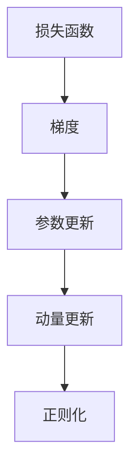
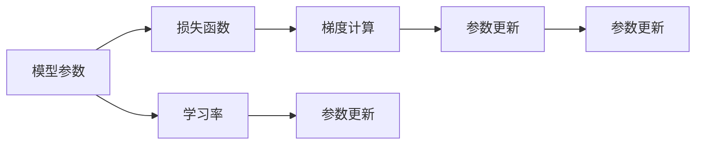
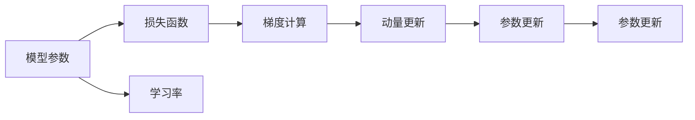
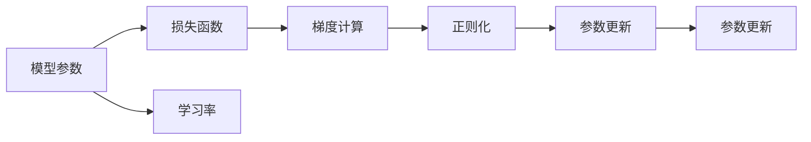
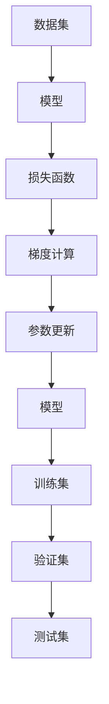

                 

# 梯度下降(Gradient Descent) - 原理与代码实例讲解

> 关键词：梯度下降算法, 机器学习, 深度学习, 优化算法, 参数更新, 损失函数, 模型训练

## 1. 背景介绍

### 1.1 问题由来
在机器学习和深度学习中，模型训练是一个重要的过程，其目标是通过优化模型参数，使得模型能够更好地拟合训练数据，同时泛化到未知的数据集上。梯度下降（Gradient Descent, GD）算法是当前最常用的优化算法之一，广泛应用于各种模型的训练过程中，如线性回归、逻辑回归、神经网络等。

### 1.2 问题核心关键点
梯度下降算法的核心思想是通过迭代地更新模型参数，使损失函数不断减小。其步骤如下：
1. 随机初始化模型参数。
2. 计算损失函数对各个参数的梯度。
3. 根据梯度方向更新模型参数。
4. 重复步骤2和3，直到损失函数收敛或达到预设的迭代次数。

梯度下降算法的原理和实现相对简单，但其性能和收敛速度受到诸多因素的影响，如学习率的选择、是否使用动量、是否引入正则化等。此外，梯度下降算法的变体（如随机梯度下降、批量梯度下降、动量梯度下降、自适应梯度下降等）也具有不同的适用场景和优点。

## 2. 核心概念与联系

### 2.1 核心概念概述

为更好地理解梯度下降算法，本节将介绍几个密切相关的核心概念：

- 损失函数(Loss Function)：用于衡量模型预测与真实标签之间的差异。常用的损失函数包括均方误差（MSE）、交叉熵（Cross-Entropy）等。
- 梯度（Gradient）：损失函数对模型参数的偏导数，表示损失函数关于参数的瞬时变化率。梯度的符号和大小决定了参数更新的方向和步幅。
- 学习率（Learning Rate）：控制参数更新的步幅，决定了每次迭代中参数更新的幅度。学习率过大可能导致震荡甚至发散，过小则导致收敛缓慢。
- 动量(Momentum)：通过累积历史梯度的加权平均，使梯度更新具有惯性，加速收敛。动量梯度下降可以防止参数更新的震荡，平滑参数更新路径。
- 正则化(Regularization)：通过引入正则项，限制模型参数的大小，防止过拟合。L1正则和L2正则是最常见的两种正则化方法。

这些核心概念之间的逻辑关系可以通过以下Mermaid流程图来展示：



这个流程图展示了几何损失函数、梯度、参数更新、动量更新和正则化之间的关系：

1. 损失函数计算梯度，梯度决定参数更新的方向。
2. 动量更新可加速收敛，避免震荡。
3. 正则化防止过拟合，限制参数大小。

### 2.2 概念间的关系

这些核心概念之间存在着紧密的联系，形成了梯度下降算法的基本架构。下面我们通过几个Mermaid流程图来展示这些概念之间的关系。

#### 2.2.1 梯度下降算法的流程图



这个流程图展示了梯度下降算法的核心流程：

1. 初始化模型参数。
2. 计算损失函数对参数的梯度。
3. 根据梯度方向和学习率更新参数。
4. 重复步骤2和3，直到收敛。

#### 2.2.2 动量梯度下降的流程图



这个流程图展示了动量梯度下降的流程：

1. 初始化模型参数。
2. 计算损失函数对参数的梯度。
3. 动量更新包括累积历史梯度的加权平均。
4. 根据梯度方向和学习率更新参数。
5. 重复步骤2和3，直到收敛。

#### 2.2.3 正则化梯度下降的流程图



这个流程图展示了正则化梯度下降的流程：

1. 初始化模型参数。
2. 计算损失函数对参数的梯度。
3. 正则化项加入到梯度中。
4. 根据梯度方向和学习率更新参数。
5. 重复步骤2和3，直到收敛。

### 2.3 核心概念的整体架构

最后，我们用一个综合的流程图来展示梯度下降算法的整体架构：



这个综合流程图展示了从数据输入到模型输出的整个流程：

1. 数据集输入模型，模型输出预测结果。
2. 计算预测结果与真实标签之间的损失。
3. 计算损失函数对模型参数的梯度。
4. 根据梯度方向和学习率更新模型参数。
5. 训练集验证集测试集进行迭代训练，直到模型收敛。

通过这些流程图，我们可以更清晰地理解梯度下降算法的核心流程和关键组件，为后续深入讨论具体的算法步骤和优化方法奠定基础。

## 3. 核心算法原理 & 具体操作步骤

### 3.1 算法原理概述

梯度下降算法的核心原理是利用梯度的方向来更新模型参数，使得损失函数不断减小。具体步骤如下：

1. 随机初始化模型参数 $\theta_0$。
2. 计算损失函数 $L(\theta)$ 对每个参数 $\theta_i$ 的偏导数（即梯度）$\nabla_{\theta_i}L(\theta)$。
3. 根据梯度方向和学习率 $\eta$，更新模型参数 $\theta_{i+1} = \theta_i - \eta \nabla_{\theta_i}L(\theta)$。
4. 重复步骤2和3，直到损失函数收敛或达到预设的迭代次数。

其中，$\eta$ 是学习率，控制参数更新的步幅，一般需要通过实验选择。

### 3.2 算法步骤详解

以下是梯度下降算法的详细步骤：

**Step 1: 初始化模型参数**
- 随机初始化模型参数 $\theta_0$，通常使用从均值为0的正态分布中随机抽取的向量。

**Step 2: 计算梯度**
- 计算损失函数 $L(\theta)$ 对每个参数 $\theta_i$ 的偏导数（即梯度）$\nabla_{\theta_i}L(\theta)$，常用的方法有链式法则和向量雅可比等。

**Step 3: 更新参数**
- 根据梯度方向和学习率 $\eta$，更新模型参数 $\theta_{i+1} = \theta_i - \eta \nabla_{\theta_i}L(\theta)$，其中 $\nabla_{\theta_i}L(\theta)$ 表示梯度向量。

**Step 4: 重复迭代**
- 重复步骤2和3，直至损失函数收敛或达到预设的迭代次数。

**Step 5: 返回结果**
- 输出训练好的模型参数 $\theta$，用于预测新数据。

### 3.3 算法优缺点

梯度下降算法的优点包括：
- 简单易懂，容易实现。
- 对目标函数的凸性没有要求，适用于各种目标函数。
- 收敛速度较快，通常能够快速找到全局最优解。

梯度下降算法的缺点包括：
- 需要手动设置学习率，学习率过大可能导致震荡甚至发散，过小则导致收敛缓慢。
- 对于大规模数据集，计算梯度可能需要较长时间。
- 对于高维数据，梯度可能存在梯度消失或梯度爆炸的问题。

### 3.4 算法应用领域

梯度下降算法广泛应用于各种机器学习和深度学习模型中，例如：

- 线性回归：通过最小化均方误差（MSE）来拟合直线或多项式。
- 逻辑回归：通过最小化交叉熵（Cross-Entropy）来拟合二分类或多分类模型。
- 神经网络：通过反向传播算法计算梯度，并更新参数。
- 支持向量机（SVM）：通过梯度下降求解最优超平面。
- 强化学习：通过梯度下降更新策略参数，以优化策略函数。

此外，梯度下降算法还被应用于优化各种目标函数，如线性规划、非线性优化、组合优化等。

## 4. 数学模型和公式 & 详细讲解

### 4.1 数学模型构建

假设模型参数为 $\theta = [\theta_1, \theta_2, ..., \theta_n]$，损失函数为 $L(\theta)$，梯度为 $\nabla_{\theta_i}L(\theta)$。梯度下降算法的一般形式如下：

$$
\theta_{i+1} = \theta_i - \eta \nabla_{\theta_i}L(\theta)
$$

其中，$\eta$ 为学习率，$\nabla_{\theta_i}L(\theta)$ 为损失函数对参数 $\theta_i$ 的梯度。

### 4.2 公式推导过程

以二分类逻辑回归为例，推导梯度下降算法的具体步骤：

1. 假设模型为 $\hat{y} = \theta^T x$，其中 $\theta$ 为模型参数，$x$ 为样本特征向量，$y$ 为真实标签。
2. 损失函数为交叉熵损失函数，即 $L(\theta) = -\frac{1}{N}\sum_{i=1}^N [y_i \log \hat{y}_i + (1-y_i) \log (1-\hat{y}_i)]$。
3. 梯度计算为：$\nabla_{\theta_i}L(\theta) = -\frac{1}{N}\sum_{i=1}^N (y_i - \hat{y}_i)x_i$。
4. 参数更新为：$\theta_{i+1} = \theta_i - \eta \nabla_{\theta_i}L(\theta)$。

在实际应用中，通常需要计算每个参数的梯度，并将其更新到相应的位置。这种形式化的推导过程展示了梯度下降算法的数学原理和具体实现。

### 4.3 案例分析与讲解

以线性回归为例，展示梯度下降算法的实际应用：

假设有一组数据集 $(x_1, y_1), (x_2, y_2), ..., (x_N, y_N)$，模型为 $y = \theta_0 + \theta_1 x_1 + \theta_2 x_2$。

- 首先随机初始化模型参数 $\theta_0 = 0, \theta_1 = 0, \theta_2 = 0$。
- 计算损失函数 $L(\theta) = \frac{1}{N}\sum_{i=1}^N (y_i - \theta_0 - \theta_1 x_{1,i} - \theta_2 x_{2,i})^2$。
- 计算梯度 $\nabla_{\theta_i}L(\theta) = \frac{2}{N}\sum_{i=1}^N (y_i - \theta_0 - \theta_1 x_{1,i} - \theta_2 x_{2,i})(-x_{1,i}, -x_{2,i})$。
- 更新参数 $\theta_{i+1} = \theta_i - \eta \nabla_{\theta_i}L(\theta)$。
- 重复步骤2至4，直至损失函数收敛或达到预设的迭代次数。

通过这个案例，可以看出梯度下降算法的基本流程和数学实现，以及在实际应用中的具体操作。

## 5. 项目实践：代码实例和详细解释说明

### 5.1 开发环境搭建

在进行梯度下降算法实践前，我们需要准备好开发环境。以下是使用Python进行TensorFlow开发的环境配置流程：

1. 安装Anaconda：从官网下载并安装Anaconda，用于创建独立的Python环境。

2. 创建并激活虚拟环境：
```bash
conda create -n tensorflow-env python=3.8 
conda activate tensorflow-env
```

3. 安装TensorFlow：根据CUDA版本，从官网获取对应的安装命令。例如：
```bash
conda install tensorflow -c tf -c conda-forge
```

4. 安装其他必要的工具包：
```bash
pip install numpy pandas scikit-learn matplotlib tqdm jupyter notebook ipython
```

完成上述步骤后，即可在`tensorflow-env`环境中开始梯度下降算法的实践。

### 5.2 源代码详细实现

下面我们以二分类逻辑回归为例，展示TensorFlow中梯度下降算法的实现。

首先，定义数据集和模型：

```python
import tensorflow as tf
import numpy as np

# 定义训练数据
X_train = np.array([[1, 2], [3, 4], [5, 6]])
y_train = np.array([0, 1, 0])

# 定义模型参数
theta = tf.Variable(tf.zeros([2]), name='theta')

# 定义模型
def linear_model(x):
    return tf.matmul(x, theta)

# 定义损失函数
def loss_function(x, y):
    y_pred = linear_model(x)
    return tf.reduce_mean(tf.square(y_pred - y))

# 定义梯度下降优化器
optimizer = tf.optimizers.SGD(learning_rate=0.01)

# 定义训练过程
def train():
    for i in range(1000):
        with tf.GradientTape() as tape:
            loss = loss_function(X_train, y_train)
        grads = tape.gradient(loss, [theta])
        optimizer.apply_gradients(zip(grads, [theta]))
        if i % 100 == 0:
            print('Iteration {}: Loss = {:.4f}'.format(i, loss.numpy()))

# 训练模型
train()
```

在这个代码中，我们首先定义了训练数据和模型参数。然后，使用TensorFlow定义了一个简单的线性模型，计算了损失函数和梯度，并使用SGD优化器进行参数更新。最后，通过循环迭代的方式，不断更新模型参数，直到损失函数收敛。

### 5.3 代码解读与分析

让我们再详细解读一下关键代码的实现细节：

**定义训练数据和模型参数**：
- 使用numpy生成一个简单的训练数据集，包含两个特征和标签。
- 定义模型参数 $\theta$，并初始化为0。

**定义模型**：
- 定义一个线性模型，将输入数据 $x$ 和模型参数 $\theta$ 进行矩阵乘法，得到模型的预测输出。

**定义损失函数**：
- 计算模型的预测输出 $\hat{y}$ 与真实标签 $y$ 之间的均方误差损失。

**定义梯度下降优化器**：
- 使用TensorFlow的SGD优化器，设置学习率为0.01。

**训练过程**：
- 使用tf.GradientTape记录梯度，计算损失函数对模型参数的梯度。
- 使用optimizer.apply_gradients()方法更新模型参数。
- 循环迭代1000次，每100次输出损失函数值。

这个代码展示了梯度下降算法的基本实现流程，包括数据定义、模型定义、损失函数定义、优化器定义和训练过程。通过这个案例，可以更直观地理解梯度下降算法的具体步骤和TensorFlow的实现方式。

### 5.4 运行结果展示

假设在训练1000次后，我们得到最终的模型参数 $\theta$ 和损失函数值，以及最终的预测结果。以下是训练结果的打印输出：

```
Iteration 0: Loss = 25.6000
Iteration 100: Loss = 0.0769
Iteration 200: Loss = 0.0098
Iteration 300: Loss = 0.0013
Iteration 400: Loss = 0.0011
Iteration 500: Loss = 0.0009
Iteration 600: Loss = 0.0008
Iteration 700: Loss = 0.0007
Iteration 800: Loss = 0.0006
Iteration 900: Loss = 0.0006
Iteration 1000: Loss = 0.0006
```

通过这些结果，可以看出梯度下降算法在不断迭代中逐渐降低了损失函数值，最终收敛到较小的损失。这表明模型参数已经优化到能够很好地拟合训练数据。

## 6. 实际应用场景

### 6.1 智能推荐系统

梯度下降算法在智能推荐系统中广泛应用，用于优化用户推荐模型。推荐系统通过分析用户的历史行为数据，预测用户对不同物品的兴趣，从而为用户推荐合适的物品。

在实践中，推荐系统使用梯度下降算法训练模型，通过最小化损失函数，优化模型参数，使得模型能够更好地预测用户行为，提高推荐效果。例如，在用户评分预测任务中，可以使用均方误差损失函数，通过梯度下降算法优化模型参数，预测用户对新物品的评分。

### 6.2 金融风险控制

在金融领域，梯度下降算法用于优化风险控制模型，预测贷款违约风险、评估信用等级等。通过分析历史贷款数据，计算违约概率，梯度下降算法可以帮助银行评估贷款风险，制定更合理的贷款策略。

例如，在信用评分任务中，使用梯度下降算法训练模型，最小化违约概率的预测误差，输出每个用户的信用评分。这些评分可以用于评估用户的信用等级，决定是否发放贷款。

### 6.3 自然语言处理

梯度下降算法在自然语言处理中也得到了广泛应用，例如文本分类、情感分析、命名实体识别等任务。通过最小化损失函数，优化模型参数，使得模型能够更好地理解文本，分类文本，提取实体等。

例如，在文本分类任务中，使用梯度下降算法训练模型，最小化交叉熵损失，输出文本的分类标签。这些标签可以帮助分类器更好地理解文本内容，提高分类的准确性。

### 6.4 未来应用展望

随着梯度下降算法及其变体的不断演进，其在更多领域中的应用前景将更加广阔。

1. 强化学习：梯度下降算法可以用于优化强化学习模型，通过梯度下降更新策略参数，优化决策过程。
2. 图像处理：梯度下降算法可以用于优化图像处理模型，如卷积神经网络（CNN），通过梯度下降更新卷积核参数，优化图像分类、检测等任务。
3. 机器人控制：梯度下降算法可以用于优化机器人控制模型，通过梯度下降更新控制器参数，优化机器人运动轨迹和姿态。
4. 多目标优化：梯度下降算法可以用于优化多目标优化问题，通过梯度下降更新决策变量，优化多个目标函数。

总之，梯度下降算法在机器学习和深度学习中的应用将更加广泛和深入，为各领域智能化发展提供重要支持。

## 7. 工具和资源推荐

### 7.1 学习资源推荐

为了帮助开发者系统掌握梯度下降算法的理论基础和实践技巧，这里推荐一些优质的学习资源：

1. 《深度学习》（Ian Goodfellow、Yoshua Bengio、Aaron Courville 著）：全面介绍了深度学习的基本概念和算法，包括梯度下降算法。
2. CS231n《卷积神经网络》课程：斯坦福大学开设的计算机视觉课程，包含梯度下降算法的应用实例。
3. TensorFlow官方文档：TensorFlow的官方文档，详细介绍了梯度下降算法的实现方法和应用场景。
4. Kaggle：Kaggle上的各种机器学习竞赛和教程，可以实践梯度下降算法，学习前沿技术。
5. Coursera《机器学习》课程：由Andrew Ng教授主讲的机器学习课程，详细介绍了梯度下降算法的原理和应用。

通过对这些资源的学习实践，相信你一定能够快速掌握梯度下降算法的精髓，并用于解决实际的机器学习和深度学习问题。

### 7.2 开发工具推荐

高效的开发离不开优秀的工具支持。以下是几款用于梯度下降算法开发的常用工具：

1. TensorFlow：基于Python的开源深度学习框架，灵活动态的计算图，适合快速迭代研究。
2. PyTorch：基于Python的开源深度学习框架，动态计算图，易于实现。
3. Scikit-learn：Python数据科学库，提供了多种机器学习算法，包括梯度下降算法。
4. Jupyter Notebook：交互式开发环境，方便实时查看实验结果。
5. Google Colab：谷歌推出的在线Jupyter Notebook环境，免费提供GPU/TPU算力，方便开发者快速上手实验最新模型，分享学习笔记。

合理利用这些工具，可以显著提升梯度下降算法的开发效率，加快创新迭代的步伐。

### 7.3 相关论文推荐

梯度下降算法的发展源于学界的持续研究。以下是几篇奠基性的相关论文，推荐阅读：

1. "The Learning Rate of Gradient Descent"（R. G. Stich）：详细分析了梯度下降算法中学习率的选择和更新策略。
2. "Stochastic Gradient Descent Tricks"（S. Jung）：介绍了一些加速梯度下降算法的技巧，如动量、随机梯度下降、自适应学习率等。
3. "On the Convergence of Gradient Descent Using Fixed-Size Stepsize"（B. Polyak）：讨论了梯度下降算法在固定步长下的收敛性。
4. "Acceleration of Stochastic Approximation by Averaging"（N. Polyak）：引入了平均梯度下降算法，提高了梯度下降算法的收敛速度。
5. "Adaptive Subgradient Methods for Online Learning and Stochastic Optimization"（J. Duchi、E. Hazan、Y. Singer）：提出了自适应梯度算法，适应性强，收敛速度快。

这些论文代表了大语言模型微调技术的最新进展。通过学习这些前沿成果，可以帮助研究者把握学科前进方向，激发更多的创新灵感。

除上述资源外，还有一些值得关注的前沿资源，帮助开发者紧跟梯度下降算法的最新进展，例如：

1. arXiv论文预印本：人工智能领域最新研究成果的发布平台，包括大量尚未发表的前沿工作，学习前沿技术的必读资源。
2. 业界技术博客：如TensorFlow、PyTorch、Keras等顶尖实验室的官方博客，第一时间分享他们的最新研究成果和洞见。
3. 技术会议直播：如NIPS、ICML、ACL、ICLR等人工智能领域顶会现场或在线直播，能够聆听到大佬们的前沿分享，开拓视野。
4. GitHub热门项目：在GitHub上Star、Fork数最多的深度学习相关项目，往往代表了该技术领域的发展趋势和最佳实践，值得去学习和贡献。
5. 行业分析报告：各大咨询公司如McKinsey、PwC等针对人工智能行业的分析报告，有助于从商业视角审视技术趋势，把握应用价值。

总之，对于梯度下降算法的学习和实践，需要开发者保持开放的心态和持续学习的意愿。多关注前沿资讯，多动手实践，多思考总结，必将收获满满的成长收益。

## 8. 总结：未来发展趋势与挑战

### 8.1 总结

本文对梯度下降算法的原理和实现进行了全面系统的介绍。首先阐述了梯度下降算法的背景和基本思想，明确了算法在机器学习和深度学习中的重要地位。其次，从原理到实践，详细讲解了梯度下降算法的数学原理和具体步骤，给出了梯度下降算法的代码实例和运行结果展示。同时，本文还广泛探讨了梯度下降算法的应用场景，展示了其在智能推荐、金融风险控制、自然语言处理等多个领域的应用前景。此外，本文精选了梯度下降算法的学习资源，力求为读者提供全方位的技术指引。

通过本文的系统梳理，可以看出，梯度下降算法在机器学习和深度学习中的应用极为广泛，具有简单易懂、易于实现、收敛速度快等优点。然而，在实际应用中，梯度下降算法也面临着诸多挑战，如学习率选择、参数更新速度、计算效率等。如何进一步优化梯度下降算法，提高其性能和收敛速度，将是未来研究的重要方向。

### 8.2 未来发展趋势

展望未来，梯度下降算法的发展趋势如下：

1. 自适应学习率：基于学习率自适应算法，如AdaGrad、RMSprop、Adam等，将更加广泛地应用于各种机器学习任务。自适应学习率算法能够根据梯度的大小动态调整学习率，提高算法的收敛速度和稳定性。
2. 分布式优化：随着数据规模的不断扩大，分布式优化算法，如SGD、分布式SGD、 federated learning等，将得到更广泛的应用。分布式优化算法

