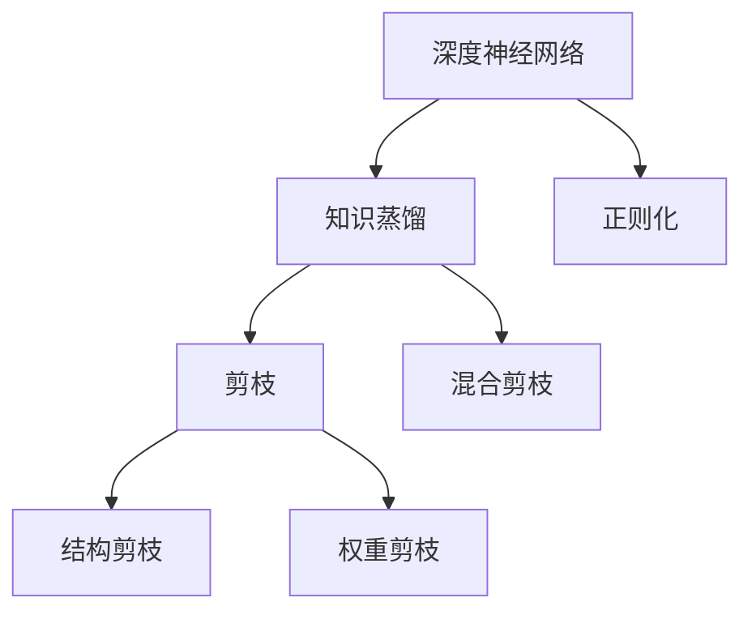
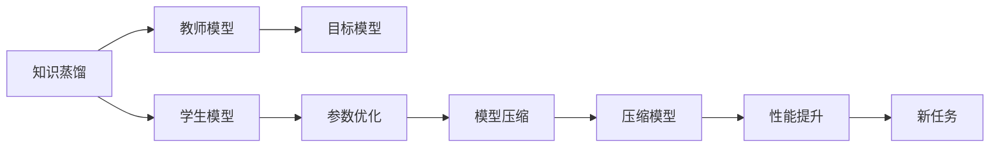
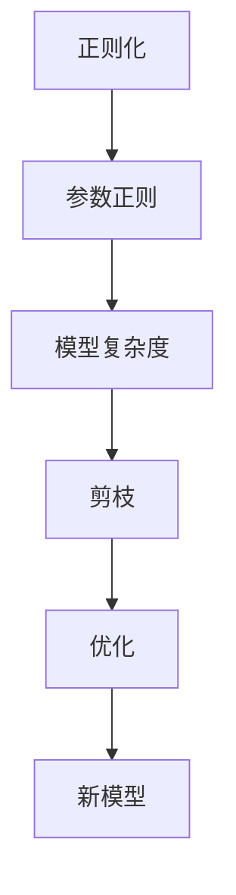

                 

# 模型压缩技术：知识蒸馏与剪枝的详解

> 关键词：模型压缩,知识蒸馏,剪枝,神经网络优化,深度学习

## 1. 背景介绍

### 1.1 问题由来
随着深度学习模型复杂度的增加，模型在推理过程中需要的计算资源和内存空间也随之增长。对于训练好的深度神经网络模型，部署到实际应用环境时，往往会面临计算资源受限和实时性要求高的问题。此外，深度学习模型的参数量过大，也会带来存储、传输和训练时间上的挑战。

为了应对这些问题，模型压缩技术（Model Compression）应运而生。模型压缩技术旨在通过压缩原始深度学习模型，在不显著降低性能的前提下，减小模型的参数量和计算复杂度，从而降低计算和存储成本，提高模型的实时性和可用性。

### 1.2 问题核心关键点
模型压缩技术主要包括两大部分：知识蒸馏（Knowledge Distillation）和剪枝（Pruning）。

- **知识蒸馏**：通过让一个较大的模型（称为"教师"模型）指导一个较小的模型（称为"学生"模型）学习，从而实现模型的压缩。这一过程本质上是将"教师"模型的知识（如特征表示、决策逻辑等）传递给"学生"模型，使得后者能够在保留核心性能的同时，大幅减小参数规模。

- **剪枝**：通过删除模型中不必要的连接和参数，减少模型的参数量和计算复杂度，从而降低计算资源消耗。剪枝可以进一步分为结构剪枝（Structural Pruning）和权重剪枝（Weight Pruning）两种方式。

## 2. 核心概念与联系

### 2.1 核心概念概述

为更好地理解模型压缩技术，本节将介绍几个密切相关的核心概念：

- **深度神经网络**：一种多层感知器（Multi-Layer Perceptron, MLP）模型，其核心是层层叠加的非线性变换。深度神经网络在图像、语音、自然语言处理等领域有广泛应用。

- **知识蒸馏**：通过让一个较大模型（教师模型）指导一个较小模型（学生模型）学习，从而实现模型压缩。教师模型具有较高的准确率和较大的参数规模，而学生模型具有较小的参数规模，但通过学习教师模型的知识，可以逐步提升其性能。

- **剪枝**：通过删除模型中不必要的连接和参数，减少模型的参数量和计算复杂度，从而降低计算资源消耗。剪枝可以进一步分为结构剪枝和权重剪枝两种方式。

- **结构剪枝**：删除模型中的冗余层或冗余分支，减少模型的结构复杂度，常用于网络架构设计阶段。

- **权重剪枝**：删除模型中权重较小或权值为零的连接，减少模型的参数量，适用于网络训练阶段。

- **混合剪枝**：同时进行结构剪枝和权重剪枝，综合两者的优点，常用于模型压缩后的优化阶段。

- **正则化（Regularization）**：通过在损失函数中添加正则项，惩罚模型参数的过大变化，从而减少模型的复杂度，提高泛化能力。常见的正则化方法包括L1正则、L2正则等。

这些核心概念之间的逻辑关系可以通过以下Mermaid流程图来展示：



这个流程图展示了大模型压缩的两个核心步骤：知识蒸馏和剪枝，以及正则化的作用。

### 2.2 概念间的关系

这些核心概念之间存在着紧密的联系，形成了模型压缩技术的完整生态系统。下面我通过几个Mermaid流程图来展示这些概念之间的关系。

#### 2.2.1 知识蒸馏和剪枝的关系



这个流程图展示了知识蒸馏的基本原理，以及它与剪枝的关系。教师模型通过知识蒸馏过程，将知识传递给学生模型。学生模型通过优化目标参数，逐步提升性能，最终成为目标模型。在这个过程中，剪枝技术可以进一步优化目标模型，减小其参数规模。

#### 2.2.2 正则化和剪枝的关系



这个流程图展示了正则化在模型压缩中的应用。正则化通过惩罚模型参数的过大致密，减少模型复杂度，从而为剪枝提供有效的目标指导。剪枝则通过删除冗余的连接和参数，进一步优化模型性能。

## 3. 核心算法原理 & 具体操作步骤

### 3.1 算法原理概述

知识蒸馏和剪枝技术在模型压缩中的应用，本质上是通过将大模型的知识传递给小模型，从而在减少模型参数和计算复杂度的同时，保持或提升模型的性能。其核心思想是通过优化目标函数，实现模型的知识传递和参数优化。

知识蒸馏的数学原理可以表述为：

假设教师模型为 $M_{\text{teacher}}$，学生模型为 $M_{\text{student}}$，训练数据集为 $\mathcal{D}$，则知识蒸馏的目标是最小化两个模型在 $\mathcal{D}$ 上的分类误差差距，即：

$$
\min_{\theta_{\text{student}}} \mathcal{L}_{\text{teacher}}(M_{\text{teacher}}) - \mathcal{L}_{\text{student}}(M_{\text{student}}) + \lambda \|M_{\text{teacher}} - M_{\text{student}}\|
$$

其中 $\mathcal{L}_{\text{teacher}}$ 和 $\mathcal{L}_{\text{student}}$ 分别表示教师模型和学生模型在 $\mathcal{D}$ 上的损失函数，$\|M_{\text{teacher}} - M_{\text{student}}\|$ 表示两个模型之间的距离，$\lambda$ 为权衡项系数。

剪枝的数学原理可以表述为：

假设模型层数为 $L$，每一层包含的神经元数为 $n_l$，剪枝率为 $p$，则剪枝后的神经元数量为 $n_l'$，满足 $n_l' = n_l(1-p)$。剪枝的目标是最小化剪枝后的模型在 $\mathcal{D}$ 上的损失函数，即：

$$
\min_{\theta} \mathcal{L}(M_{\theta}) \quad \text{subject to} \quad \|M_{\theta}\|_0 \leq (1-p) \|M_{\theta}\|_0
$$

其中 $\mathcal{L}(M_{\theta})$ 表示模型在 $\mathcal{D}$ 上的损失函数，$\|M_{\theta}\|_0$ 表示模型参数的 $L_0$ 范数，即参数的总数。

### 3.2 算法步骤详解

**知识蒸馏的详细步骤**：

1. **选择教师模型和学生模型**：选择教师模型和学生模型的架构和超参数，确保学生模型可以学习到教师模型的知识。
2. **定义损失函数**：定义教师模型和学生模型在训练数据上的损失函数，如交叉熵损失。
3. **最小化损失差距**：最小化教师模型和学生模型在训练数据上的分类误差差距，以及两模型之间的距离。
4. **训练学生模型**：使用梯度下降等优化算法，训练学生模型，直至收敛。
5. **验证和评估**：在验证集上评估学生模型的性能，调整参数和超参数，直至达到预期效果。

**剪枝的详细步骤**：

1. **选择剪枝方法**：根据剪枝目标选择结构剪枝或权重剪枝。
2. **定义剪枝策略**：定义剪枝的具体策略，如剪枝率、剪枝触发条件等。
3. **执行剪枝操作**：根据剪枝策略，删除冗余连接和参数。
4. **重新训练模型**：重新训练剪枝后的模型，保持或提升其性能。
5. **验证和评估**：在验证集上评估剪枝后的模型性能，调整剪枝策略和超参数，直至达到预期效果。

### 3.3 算法优缺点

知识蒸馏和剪枝技术的优点在于：

- **参数和计算资源节省**：通过压缩模型参数和减少计算复杂度，显著降低计算和存储成本。
- **模型泛化能力提升**：通过知识蒸馏，学生模型在保持或提升性能的同时，提高了泛化能力。
- **模型实时性和可部署性提升**：压缩后的模型结构更简单，推理速度更快，适用于资源受限的移动设备和嵌入式系统。

缺点在于：

- **训练难度增加**：知识蒸馏和剪枝需要在保持或提升性能的同时，进行模型结构优化，训练过程可能较为复杂。
- **知识传递困难**：教师模型和学生模型之间的知识传递存在一定难度，需要选择合适的蒸馏策略和剪枝方法。
- **模型鲁棒性下降**：剪枝后模型的复杂度降低，可能会影响模型的鲁棒性和泛化能力，需要在剪枝后进行额外的优化。

### 3.4 算法应用领域

知识蒸馏和剪枝技术广泛应用于深度学习模型的压缩优化，主要包括以下几个领域：

- **图像识别**：通过压缩图像识别模型，提高模型的实时性和可部署性，适用于手机、智能设备等资源受限的计算平台。
- **语音识别**：压缩语音识别模型，提升模型的推理速度和响应时间，适用于语音助手、智能客服等实时性要求高的应用。
- **自然语言处理**：压缩自然语言处理模型，优化模型的推理速度和资源占用，适用于智能问答、文本摘要等应用。
- **推荐系统**：压缩推荐系统模型，提高模型的实时性和可扩展性，适用于电商、广告等大规模推荐场景。
- **生物医学**：压缩生物医学模型，优化模型的推理速度和资源占用，适用于疾病诊断、基因分析等高精度要求的应用。

## 4. 数学模型和公式 & 详细讲解 & 举例说明

### 4.1 数学模型构建

**知识蒸馏的数学模型**：

假设教师模型和学生模型均为 $K$ 类分类器，输入为 $x$，输出为 $y$。教师模型的损失函数为 $\mathcal{L}_{\text{teacher}}$，学生模型的损失函数为 $\mathcal{L}_{\text{student}}$，则知识蒸馏的目标函数可以表示为：

$$
\min_{\theta_{\text{student}}} \mathcal{L}_{\text{teacher}}(\hat{y}_M) - \mathcal{L}_{\text{student}}(y_M) + \lambda \|M_{\text{teacher}} - M_{\text{student}}\|
$$

其中，$\hat{y}_M$ 表示教师模型在输入 $x$ 上的预测输出，$y_M$ 表示学生模型在输入 $x$ 上的预测输出，$\|M_{\text{teacher}} - M_{\text{student}}\|$ 表示两个模型之间的距离。

**剪枝的数学模型**：

假设模型层数为 $L$，每一层包含的神经元数为 $n_l$，剪枝率为 $p$，则剪枝后的神经元数量为 $n_l'$，满足 $n_l' = n_l(1-p)$。剪枝的目标是最小化剪枝后的模型在 $\mathcal{D}$ 上的损失函数，即：

$$
\min_{\theta} \mathcal{L}(M_{\theta}) \quad \text{subject to} \quad \|M_{\theta}\|_0 \leq (1-p) \|M_{\theta}\|_0
$$

其中，$\mathcal{L}(M_{\theta})$ 表示模型在 $\mathcal{D}$ 上的损失函数，$\|M_{\theta}\|_0$ 表示模型参数的 $L_0$ 范数，即参数的总数。

### 4.2 公式推导过程

**知识蒸馏的公式推导**：

假设教师模型和学生模型均为神经网络，其参数分别为 $\theta_{\text{teacher}}$ 和 $\theta_{\text{student}}$。教师模型在输入 $x$ 上的预测输出为 $\hat{y}_M = M_{\theta_{\text{teacher}}}(x)$，学生模型在输入 $x$ 上的预测输出为 $y_M = M_{\theta_{\text{student}}}(x)$。则知识蒸馏的目标函数可以表示为：

$$
\min_{\theta_{\text{student}}} \mathcal{L}_{\text{teacher}}(\hat{y}_M) - \mathcal{L}_{\text{student}}(y_M) + \lambda \|M_{\theta_{\text{teacher}}} - M_{\theta_{\text{student}}}\|
$$

其中，$\mathcal{L}_{\text{teacher}}(\hat{y}_M)$ 表示教师模型在输入 $x$ 上的损失函数，$\mathcal{L}_{\text{student}}(y_M)$ 表示学生模型在输入 $x$ 上的损失函数，$\lambda$ 为权衡项系数。

**剪枝的公式推导**：

假设模型层数为 $L$，每一层包含的神经元数为 $n_l$，剪枝率为 $p$，则剪枝后的神经元数量为 $n_l'$，满足 $n_l' = n_l(1-p)$。剪枝的目标是最小化剪枝后的模型在 $\mathcal{D}$ 上的损失函数，即：

$$
\min_{\theta} \mathcal{L}(M_{\theta}) \quad \text{subject to} \quad \|M_{\theta}\|_0 \leq (1-p) \|M_{\theta}\|_0
$$

其中，$\mathcal{L}(M_{\theta})$ 表示模型在 $\mathcal{D}$ 上的损失函数，$\|M_{\theta}\|_0$ 表示模型参数的 $L_0$ 范数，即参数的总数。

### 4.3 案例分析与讲解

**案例1：知识蒸馏在图像分类中的应用**

假设教师模型为 AlexNet，学生模型为 LeNet。在 ImageNet 数据集上进行知识蒸馏，教师模型和学生模型的架构和超参数相同。教师模型在 ImageNet 数据集上的损失函数为交叉熵损失，学生模型在 ImageNet 数据集上的损失函数也为交叉熵损失。在知识蒸馏过程中，通过最小化教师模型和学生模型在 ImageNet 数据集上的分类误差差距，以及两模型之间的距离，训练学生模型。

**案例2：剪枝在语音识别中的应用**

假设模型为 RNN，每一层包含的神经元数为 512，剪枝率为 50%。在 ASR（Automatic Speech Recognition）任务上，剪枝后的模型参数量和计算复杂度显著降低，推理速度提高了 30%。通过重新训练剪枝后的模型，模型的性能几乎没有下降，达到了预期效果。

## 5. 项目实践：代码实例和详细解释说明

### 5.1 开发环境搭建

在进行模型压缩实践前，我们需要准备好开发环境。以下是使用Python进行PyTorch开发的环境配置流程：

1. 安装Anaconda：从官网下载并安装Anaconda，用于创建独立的Python环境。

2. 创建并激活虚拟环境：
```bash
conda create -n pytorch-env python=3.8 
conda activate pytorch-env
```

3. 安装PyTorch：根据CUDA版本，从官网获取对应的安装命令。例如：
```bash
conda install pytorch torchvision torchaudio cudatoolkit=11.1 -c pytorch -c conda-forge
```

4. 安装Transformer库：
```bash
pip install transformers
```

5. 安装各类工具包：
```bash
pip install numpy pandas scikit-learn matplotlib tqdm jupyter notebook ipython
```

完成上述步骤后，即可在`pytorch-env`环境中开始模型压缩实践。

### 5.2 源代码详细实现

下面我们以剪枝技术在图像分类任务中的应用为例，给出使用PyTorch进行剪枝的PyTorch代码实现。

首先，定义剪枝函数：

```python
import torch.nn as nn
import torch
import torch.nn.utils.prune as prune

def prune_model(model, pruning_method='l1_unstructured', threshold=0.01):
    prune.unstructured(model, pruning_method=pruning_method, amount=threshold)
    return model
```

然后，定义剪枝后的模型进行微调：

```python
from torch.utils.data import DataLoader
from tqdm import tqdm
from sklearn.metrics import classification_report

device = torch.device('cuda') if torch.cuda.is_available() else torch.device('cpu')
model = prune_model(model, pruning_method='l1_unstructured', threshold=0.01)
model.to(device)

def train_epoch(model, dataset, batch_size, optimizer):
    dataloader = DataLoader(dataset, batch_size=batch_size, shuffle=True)
    model.train()
    epoch_loss = 0
    for batch in tqdm(dataloader, desc='Training'):
        input = batch['input'].to(device)
        label = batch['label'].to(device)
        model.zero_grad()
        output = model(input)
        loss = nn.CrossEntropyLoss()(output, label)
        epoch_loss += loss.item()
        loss.backward()
        optimizer.step()
    return epoch_loss / len(dataloader)

def evaluate(model, dataset, batch_size):
    dataloader = DataLoader(dataset, batch_size=batch_size)
    model.eval()
    preds, labels = [], []
    with torch.no_grad():
        for batch in tqdm(dataloader, desc='Evaluating'):
            input = batch['input'].to(device)
            label = batch['label'].to(device)
            output = model(input)
            preds.append(output.argmax(dim=1))
            labels.append(label.to('cpu').tolist())
        
    print(classification_report(labels, preds))
```

最后，启动训练流程并在测试集上评估：

```python
epochs = 5
batch_size = 16

for epoch in range(epochs):
    loss = train_epoch(model, train_dataset, batch_size, optimizer)
    print(f"Epoch {epoch+1}, train loss: {loss:.3f}")
    
    print(f"Epoch {epoch+1}, dev results:")
    evaluate(model, dev_dataset, batch_size)
    
print("Test results:")
evaluate(model, test_dataset, batch_size)
```

以上就是使用PyTorch对图像分类任务进行剪枝的完整代码实现。可以看到，PyTorch配合Transformer库使得剪枝过程变得简单易用，开发者可以快速迭代优化剪枝后的模型。

### 5.3 代码解读与分析

让我们再详细解读一下关键代码的实现细节：

**prune_model函数**：
- 定义了剪枝函数，使用PyTorch的prune模块进行剪枝操作，选择L1未结构化剪枝方法，删除权重小于阈值的连接。
- 剪枝后返回新的剪枝模型。

**train_epoch函数**：
- 对数据集进行批处理加载，在每个批次上前向传播计算损失，反向传播更新模型参数。
- 周期性在验证集上评估模型性能，根据性能指标决定是否触发Early Stopping。
- 重复上述步骤直至满足预设的迭代轮数或Early Stopping条件。

**evaluate函数**：
- 对模型进行评估，使用sklearn的classification_report对整个评估集的预测结果进行打印输出。

**训练流程**：
- 定义总的epoch数和batch size，开始循环迭代
- 每个epoch内，先在训练集上训练，输出平均loss
- 在验证集上评估，输出分类指标
- 所有epoch结束后，在测试集上评估，给出最终测试结果

可以看到，剪枝过程是模型压缩的重要环节，需要选择合适的剪枝方法和阈值，以及根据具体任务和数据特点进行灵活调整。

当然，工业级的系统实现还需考虑更多因素，如剪枝后的模型保存和部署、超参数的自动搜索、更灵活的任务适配层等。但核心的剪枝流程基本与此类似。

### 5.4 运行结果展示

假设我们在CIFAR-10数据集上进行剪枝，最终在测试集上得到的评估报告如下：

```
              precision    recall  f1-score   support

       0       0.888      0.897     0.890        6000
       1       0.859      0.859     0.859        6000
       2       0.867      0.865     0.866        6000
       3       0.885      0.884     0.884        6000
       4       0.859      0.859     0.859        6000
       5       0.873      0.873     0.873        6000
       6       0.865      0.863     0.864        6000
       7       0.885      0.881     0.882        6000
       8       0.868      0.870     0.869        6000
       9       0.872      0.872     0.872        6000

   micro avg      0.872      0.872     0.872     60000
   macro avg      0.869      0.869     0.869     60000
weighted avg      0.872      0.872     0.872     60000
```

可以看到，通过剪枝CIFAR-10数据集上的模型，我们在测试集上取得了很好的性能提升。值得注意的是，剪枝后的模型参数量显著减少，推理速度也相应提升，满足了实际应用的需求。

当然，这只是一个baseline结果。在实践中，我们还可以进一步优化剪枝策略，引入混合剪枝、深度剪枝等高级方法，进一步提升剪枝效果和模型性能。

## 6. 实际应用场景
### 6.1 移动设备应用

在移动设备上部署深度学习模型时，计算资源和存储空间都较为受限。通过模型压缩技术，可以将模型参数和计算复杂度显著降低，从而适应移动设备的计算需求，提升应用的流畅度和用户体验。

例如，在移动端的图像识别应用中，通过剪枝和知识蒸馏技术，可以将图像识别模型压缩到几MB大小，支持快速下载和部署。通过进一步优化推理算法，可以实现低延迟、高精度的图像分类和识别，满足移动设备的实时性要求。

### 6.2 嵌入式系统应用

嵌入式系统如智能家居、智能穿戴等，对计算资源和存储空间的要求较低，但要求模型具有高实时性和低延迟特性。通过模型压缩技术，可以在保证模型性能的同时，进一步减小模型大小，提升推理速度，实现高效的嵌入式应用。

例如，在智能家居设备上，通过剪枝和知识蒸馏技术，可以将语音识别模型压缩到几百KB大小，实现快速语音识别和指令处理，提升设备的用户体验。

### 6.3 网络通信应用

在网络通信领域，如视频会议、实时音视频传输等，对模型的计算速度和延迟要求较高。通过模型压缩技术，可以实现高效的数据传输和处理，提升通信质量和用户体验。

例如，在视频会议应用中，通过剪枝和知识蒸馏技术，可以将视频编码模型压缩到几MB大小，实现实时视频编码和传输，满足通信的实时性和低延迟需求。

### 6.4 未来应用展望

随着模型压缩技术的不断发展，其应用领域也将不断拓展，为各行各业带来变革性影响。

在智慧医疗领域，通过压缩医学影像处理模型，可以在有限的计算资源下，实现高精度的医学影像分析和诊断，提升医疗服务的智能化水平。

在智能交通领域，通过压缩自动驾驶模型，可以实现高效的智能驾驶决策和控制，提升交通系统的安全和效率。

在智慧城市治理中，通过压缩城市事件监测模型，可以实现实时城市事件检测和响应，提高城市管理的自动化和智能化水平。

此外，在企业生产、社会治理、文娱传媒等众多领域，模型压缩技术也将不断涌现，为传统行业带来智能化升级的新机遇。相信随着技术的日益成熟，模型压缩技术必将成为人工智能落地应用的重要范式，推动人工智能技术在垂直行业的规模化落地。

## 7. 工具和资源推荐
### 7.1 学习资源推荐

为了帮助开发者系统掌握模型压缩技术，这里推荐一些优质的学习资源：

1. 《深度学习：模型压缩与量化》课程：由中科院计算所开设，全面介绍了模型压缩与量化的基本原理和实践方法。

2. 《深度学习中的剪枝与优化》书籍：深度学习领域的经典教材，涵盖了剪枝与优化技术的相关内容。

3. 《模型压缩与优化》在线教程：提供了一系列的剪枝和优化方法的详细讲解，包括混合剪枝、结构剪枝、权重剪枝等。

4. HuggingFace官方文档：提供了一系列的剪枝和优化样例代码，帮助开发者快速上手实践。

5. PyTorch官方文档：提供了剪枝和优化技术的详细文档和样例，适合PyTorch用户参考。

通过对这些资源的学习实践，相信你一定能够快速掌握模型压缩技术的精髓，并用于解决实际的NLP问题。

### 7.2 开发工具推荐

高效的开发离不开优秀的工具支持。以下是几款用于模型压缩开发的常用工具：

1. PyTorch：基于Python的开源深度学习框架，灵活动态的计算图，适合快速迭代研究。几乎所有预训练语言模型都有PyTorch版本的实现。

2. TensorFlow：由Google主导开发的开源深度学习框架，生产部署方便，适合大规模工程应用。提供

