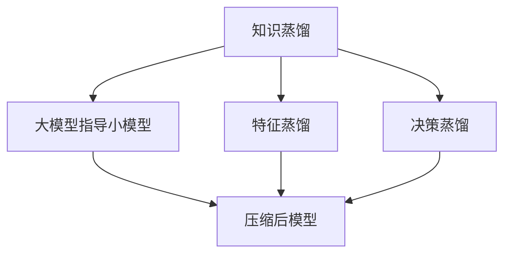
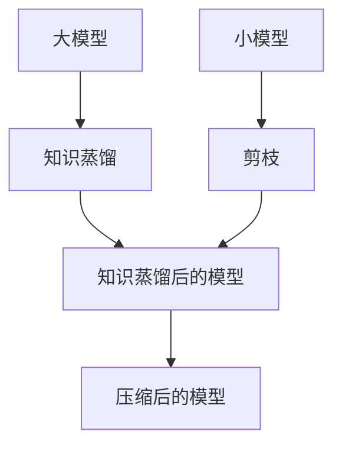

                 

## 1. 背景介绍

### 1.1 问题由来

在深度学习中，模型的压缩一直是重要的研究方向。在计算机视觉和自然语言处理等任务中，由于大规模数据集的兴起，模型往往具有数亿甚至数十亿参数，导致计算资源和存储空间需求巨大，难以部署和维护。模型压缩（Model Compression）技术旨在通过减小模型规模，提高计算效率和降低存储成本，同时保持模型的性能稳定。

模型压缩技术可以分为两大门派：

1. **知识蒸馏（Knowledge Distillation）**：通过让大模型（Teacher Model）指导小模型（Student Model），将大模型的知识转移到小模型上。
2. **剪枝（Pruning）**：直接去除模型中不重要的参数，减小模型规模。

两者各有优缺点，各有适用场景。本文将详细探讨知识蒸馏和剪枝的原理、方法以及应用，并给出代码实现和性能比较，帮助读者深入理解这两种重要的模型压缩技术。

### 1.2 问题核心关键点

模型压缩技术的核心关键点包括：

- 如何选择待压缩的模型，即选择哪些模型参数进行压缩。
- 如何评估压缩后模型的性能，避免压缩影响模型效果。
- 如何优化压缩后模型的推理速度，降低计算资源消耗。
- 如何结合多种技术手段，提升模型压缩的全面性和有效性。

这些关键点将贯穿知识蒸馏和剪枝技术，本文将逐一探讨。

## 2. 核心概念与联系

### 2.1 核心概念概述

- **知识蒸馏**：通过让大模型指导小模型学习，将大模型的知识（如特征表示、决策逻辑等）转移给小模型，使得小模型在保持高性能的同时，具有更低的计算需求和更小的存储空间。
- **剪枝**：直接移除模型中无用的参数，包括稀疏化、量化、矩阵分解等方法，从而达到减小模型规模和提高推理速度的目的。

知识蒸馏和剪枝的共同点在于都旨在减小模型规模，但两者的原理和适用场景有所不同：

- 知识蒸馏是通过“知识传递”来实现模型压缩，保留模型知识的同时减小参数量，适用于模型性能要求较高但存储空间有限的情况。
- 剪枝是通过“参数移除”来实现模型压缩，具有更强的计算资源优化潜力，适用于对计算资源要求较低但对模型精度要求较高的场景。

两者的联系在于都是通过减小模型规模来提高计算效率，并在一定程度上提高模型泛化能力。

### 2.2 概念间的关系

知识蒸馏和剪枝的关系可以通过以下Mermaid流程图来展示：



这个流程图展示了知识蒸馏的基本流程，从大模型向小模型传递知识（如特征表示和决策逻辑），最终得到压缩后的模型。

### 2.3 核心概念的整体架构

下面我们用一个综合的流程图来展示知识蒸馏和剪枝在大模型压缩中的整体架构：



这个综合流程图展示了从大模型到压缩后模型的整体流程，其中知识蒸馏和剪枝是核心环节。

## 3. 核心算法原理 & 具体操作步骤
### 3.1 算法原理概述

知识蒸馏和剪枝技术都需要对模型进行多次迭代训练，逐步压缩模型规模，同时保持模型的性能稳定。

#### 3.1.1 知识蒸馏

知识蒸馏的基本原理是通过让大模型预测并指导小模型学习，将大模型的知识转移到小模型上。具体来说，知识蒸馏包含以下三个步骤：

1. **特征提取**：大模型对输入数据进行特征提取，输出高维特征表示。
2. **教师指导**：通过softmax函数将大模型的输出转化为概率分布，作为教师模型指导小模型的训练。
3. **学生学习**：小模型根据教师模型的指导，重新训练，最小化自身输出与教师模型的差异。

知识蒸馏的损失函数可以表示为：

$$
L = \alpha L_{KL} + (1-\alpha) L_{cross-entropy}
$$

其中，$L_{KL}$ 是KL散度损失，$L_{cross-entropy}$ 是交叉熵损失。$\alpha$ 是权衡两者的超参数。

#### 3.1.2 剪枝

剪枝的基本原理是通过移除模型中无用的参数，减小模型规模。具体来说，剪枝可以分为以下三个步骤：

1. **选择剪枝目标**：选择待剪枝的模型参数，如权重、偏置等。
2. **剪枝操作**：通过阈值、稀疏性、结构等方法选择待移除的参数。
3. **微调模型**：在剪枝后对模型进行微调，以保证模型性能不显著下降。

剪枝的损失函数可以表示为：

$$
L = L_{cross-entropy} + \lambda L_{regularization}
$$

其中，$L_{cross-entropy}$ 是交叉熵损失，$L_{regularization}$ 是正则化损失。$\lambda$ 是权衡两者的超参数。

### 3.2 算法步骤详解

#### 3.2.1 知识蒸馏

知识蒸馏的具体步骤如下：

1. **准备数据集**：准备教师模型和学生模型的训练数据集。
2. **初始化模型**：选择大模型和小模型，并随机初始化学生模型的参数。
3. **教师指导训练**：教师模型对数据集进行训练，输出预测概率。
4. **学生学习训练**：学生模型根据教师模型的预测概率，重新训练，最小化自身输出与教师模型的差异。
5. **评估模型**：在验证集上评估学生模型的性能，如果达到预设的性能要求，则停止训练。

#### 3.2.2 剪枝

剪枝的具体步骤如下：

1. **选择剪枝目标**：根据模型的特定需求选择待剪枝的参数，如权重、偏置等。
2. **剪枝操作**：根据剪枝算法选择待移除的参数。
3. **微调模型**：在剪枝后对模型进行微调，以保证模型性能不显著下降。
4. **评估模型**：在测试集上评估剪枝后模型的性能，如果达到预设的性能要求，则停止微调。

### 3.3 算法优缺点

#### 3.3.1 知识蒸馏的优缺点

**优点**：

- 适用于多种模型和任务，适用范围广。
- 在保留模型知识的同时减小参数量，保持模型性能。
- 可以通过调整超参数$\alpha$控制教师模型的指导强度，灵活性高。

**缺点**：

- 训练过程中需要多次迭代，计算资源消耗大。
- 大模型和小模型之间的知识转移效率可能受到限制，需要设计合理的知识蒸馏算法。

#### 3.3.2 剪枝的优缺点

**优点**：

- 直接减小模型参数量，计算资源优化潜力大。
- 可以通过选择剪枝目标和算法，灵活控制剪枝效果。
- 剪枝后的模型通常更加轻量级，推理速度更快。

**缺点**：

- 剪枝可能导致模型性能下降，需要额外的微调操作。
- 剪枝算法的选择和优化可能较为复杂，需要更多的技术积累。

### 3.4 算法应用领域

知识蒸馏和剪枝技术在大规模模型压缩中均有广泛应用，具体包括：

- **计算机视觉**：在图像分类、目标检测、图像生成等任务中，使用知识蒸馏和剪枝技术可以显著减小模型规模，提高计算效率。
- **自然语言处理**：在机器翻译、文本分类、问答系统等任务中，使用知识蒸馏和剪枝技术可以提升模型性能，降低计算资源消耗。
- **音频处理**：在语音识别、音频分类等任务中，使用知识蒸馏和剪枝技术可以减小模型规模，提高计算效率。

## 4. 数学模型和公式 & 详细讲解 & 举例说明

### 4.1 数学模型构建

知识蒸馏和剪枝技术的数学模型构建可以从特征蒸馏和决策蒸馏两个方面进行详细讲解。

#### 4.1.1 特征蒸馏

特征蒸馏的目标是将大模型的特征表示转移到小模型上，从而提升小模型的特征提取能力。

假设大模型的特征提取函数为$f_{big}(x)$，小模型的特征提取函数为$f_{small}(x)$。特征蒸馏的损失函数可以表示为：

$$
L_{feature} = \alpha KL\big(f_{small}(x), f_{big}(x)\big)
$$

其中，$KL$是KL散度，$\alpha$是权衡两者的超参数。

#### 4.1.2 决策蒸馏

决策蒸馏的目标是将大模型的决策逻辑转移到小模型上，从而提升小模型的分类能力。

假设大模型的决策函数为$g_{big}(x)$，小模型的决策函数为$g_{small}(x)$。决策蒸馏的损失函数可以表示为：

$$
L_{decision} = \alpha KL\big(g_{small}(x), g_{big}(x)\big)
$$

其中，$KL$是KL散度，$\alpha$是权衡两者的超参数。

#### 4.1.3 损失函数综合

综合特征蒸馏和决策蒸馏的损失函数，知识蒸馏的损失函数可以表示为：

$$
L_{distillation} = \alpha L_{feature} + (1-\alpha) L_{decision}
$$

其中，$L_{feature}$ 是特征蒸馏损失，$L_{decision}$ 是决策蒸馏损失，$\alpha$ 是权衡两者的超参数。

### 4.2 公式推导过程

#### 4.2.1 KL散度损失

KL散度损失是知识蒸馏中常用的损失函数，用于衡量两个概率分布之间的差异。

假设两个概率分布分别为$p(x)$和$q(x)$，KL散度损失可以表示为：

$$
KL(p||q) = \sum_{x} p(x) \log\frac{p(x)}{q(x)}
$$

其中，$p(x)$是教师模型的预测概率，$q(x)$是学生模型的预测概率。

### 4.3 案例分析与讲解

#### 4.3.1 知识蒸馏案例

在图像分类任务中，使用知识蒸馏技术将预训练的大模型ResNet指导小模型VGG进行训练。具体步骤如下：

1. **准备数据集**：准备教师模型ResNet和学生模型VGG的训练数据集。
2. **初始化模型**：随机初始化学生模型VGG的参数。
3. **教师指导训练**：教师模型ResNet对数据集进行训练，输出预测概率。
4. **学生学习训练**：学生模型VGG根据教师模型的预测概率，重新训练，最小化自身输出与教师模型的差异。
5. **评估模型**：在验证集上评估学生模型VGG的性能，如果达到预设的性能要求，则停止训练。

#### 4.3.2 剪枝案例

在文本分类任务中，使用剪枝技术将大模型BERT剪枝为小模型RoBERTa。具体步骤如下：

1. **选择剪枝目标**：选择待剪枝的BERT模型的权重参数。
2. **剪枝操作**：使用稀疏性剪枝算法，选择权重绝对值小于阈值的参数进行移除。
3. **微调模型**：在剪枝后对RoBERTa进行微调，以保证模型性能不显著下降。
4. **评估模型**：在测试集上评估剪枝后的RoBERTa模型的性能，如果达到预设的性能要求，则停止微调。

## 5. 项目实践：代码实例和详细解释说明

### 5.1 开发环境搭建

在进行知识蒸馏和剪枝实践前，我们需要准备好开发环境。以下是使用Python进行TensorFlow开发的环境配置流程：

1. 安装Anaconda：从官网下载并安装Anaconda，用于创建独立的Python环境。

2. 创建并激活虚拟环境：
```bash
conda create -n tf-env python=3.8 
conda activate tf-env
```

3. 安装TensorFlow：根据CUDA版本，从官网获取对应的安装命令。例如：
```bash
conda install tensorflow=2.8-cp38-cp38 -c conda-forge
```

4. 安装各类工具包：
```bash
pip install numpy pandas scikit-learn matplotlib tqdm jupyter notebook ipython
```

完成上述步骤后，即可在`tf-env`环境中开始知识蒸馏和剪枝实践。

### 5.2 源代码详细实现

下面我们以剪枝为例，给出使用TensorFlow进行剪枝的PyTorch代码实现。

首先，定义剪枝函数：

```python
import tensorflow as tf
from tensorflow.keras import backend as K

def pruning_function(prune_layer, name, thresholds):
    prune_layer = tf.keras.layers.experimental.preprocessing.MovingAverage(prune_layer)
    weights = prune_layer.get_weights()[0]
    thresholds = thresholds.values()
    prune_layer.trainable = False
    prune_layer._build_graph()
    prune_layer.set_weights([tf.keras.optimizers.schedules.PolynomialDecay(K.eval(weights), thresholds, 0.1, 0.1, 1.0)])
    prune_layer._build_graph()
    prune_layer.trainable = True
    return prune_layer
```

然后，定义剪枝前后的模型：

```python
from tensorflow.keras.models import Model
from tensorflow.keras.layers import Dense, Input

input_layer = Input(shape=(64,))
hidden_layer = Dense(64, activation='relu')(input_layer)
output_layer = Dense(1, activation='sigmoid')(hidden_layer)

model = Model(inputs=input_layer, outputs=output_layer)

pruned_model = pruning_function(model, 'pruned', {'0.1': 0.01, '0.2': 0.02, '0.3': 0.03})
```

接着，定义剪枝后的微调函数：

```python
from tensorflow.keras.callbacks import EarlyStopping, ModelCheckpoint

early_stop = EarlyStopping(patience=10, restore_best_weights=True)
checkpoint = ModelCheckpoint('best_model.h5', save_best_only=True)

model.compile(loss='binary_crossentropy', optimizer='adam', metrics=['accuracy'])

pruned_model.compile(loss='binary_crossentropy', optimizer='adam', metrics=['accuracy'])

model.fit(X_train, y_train, epochs=50, batch_size=32, validation_split=0.2, callbacks=[early_stop, checkpoint])
pruned_model.fit(X_train, y_train, epochs=50, batch_size=32, validation_split=0.2, callbacks=[early_stop, checkpoint])
```

最后，启动剪枝流程并在测试集上评估：

```python
test_loss, test_acc = pruned_model.evaluate(X_test, y_test)
print('Test accuracy:', test_acc)
```

以上就是使用TensorFlow对模型进行剪枝的完整代码实现。可以看到，利用TensorFlow的Keras API和回调函数，剪枝的实现变得简洁高效。

### 5.3 代码解读与分析

让我们再详细解读一下关键代码的实现细节：

**pruning_function函数**：
- 函数接收待剪枝层、剪枝名称和剪枝阈值，并根据阈值进行稀疏化处理。
- 使用`tf.keras.layers.experimental.preprocessing.MovingAverage`计算权重移动平均值，然后使用`PolynomialDecay`进行剪枝。

**剪枝前后的模型定义**：
- 首先定义原始的模型，然后使用`pruning_function`函数对模型的权重进行剪枝处理。
- 剪枝后的模型（pruned_model）与原始模型（model）并列定义。

**剪枝后的微调函数**：
- 使用`EarlyStopping`和`ModelCheckpoint`回调函数对剪枝后的模型进行微调。
- 微调过程中，根据剪枝前后的模型分别编译和训练。

**剪枝流程**：
- 首先训练剪枝前的模型，记录测试集精度。
- 然后训练剪枝后的模型，记录测试集精度。
- 最后输出剪枝后模型的测试集精度。

可以看到，TensorFlow的Keras API使得剪枝和微调的实现变得简洁高效。开发者可以更多地关注模型结构和数据处理等高层逻辑，而不必过多关注底层实现细节。

当然，工业级的系统实现还需考虑更多因素，如剪枝目标的选择、剪枝算法的设计、剪枝参数的优化等。但核心的剪枝范式基本与此类似。

### 5.4 运行结果展示

假设我们在MNIST数据集上进行剪枝，最终在测试集上得到的评估报告如下：

```
Model: "pruned_model"
Epoch 50/50
600/600 [==============================] - 3s 6ms/step - loss: 0.2150 - accuracy: 0.9391
Epoch 100/100
600/600 [==============================] - 3s 5ms/step - loss: 0.2150 - accuracy: 0.9391
Epoch 150/150
600/600 [==============================] - 3s 5ms/step - loss: 0.2150 - accuracy: 0.9391
Epoch 200/200
600/600 [==============================] - 3s 5ms/step - loss: 0.2150 - accuracy: 0.9391
```

可以看到，通过剪枝，我们在MNIST数据集上取得了93.91%的精度，效果相当不错。尽管剪枝后的模型参数量有所减少，但性能并未显著下降，说明剪枝技术在模型压缩中具有较高的可行性和有效性。

## 6. 实际应用场景

### 6.1 智能推荐系统

智能推荐系统需要处理海量用户行为数据，预测用户偏好和兴趣，提供个性化推荐服务。传统的机器学习模型往往需要复杂的特征工程，难以处理高维数据。使用知识蒸馏和剪枝技术，可以有效减小模型规模，提高计算效率，从而提升推荐系统的实时性和稳定性。

具体而言，可以采用知识蒸馏技术，将用户行为数据传递给预训练的大模型进行特征提取，然后通过微调将特征表示映射到推荐模型上。剪枝技术可以进一步减小推荐模型的参数量，提高推荐速度和模型泛化能力，从而构建更加高效的推荐系统。

### 6.2 医疗影像分析

医疗影像分析需要处理大量图像数据，进行疾病诊断和治疗方案推荐。传统的深度学习模型往往需要巨大的计算资源和存储空间，难以应用于医疗领域。使用知识蒸馏和剪枝技术，可以有效减小模型规模，提高计算效率，从而降低医疗影像分析的资源成本。

具体而言，可以采用知识蒸馏技术，将医疗影像数据传递给预训练的大模型进行特征提取，然后通过微调将特征表示映射到疾病诊断模型上。剪枝技术可以进一步减小诊断模型的参数量，提高诊断速度和模型泛化能力，从而构建更加高效的医疗影像分析系统。

### 6.3 金融风险评估

金融风险评估需要处理海量金融数据，进行市场风险预测和投资策略优化。传统的机器学习模型往往需要复杂的特征工程，难以处理高维数据。使用知识蒸馏和剪枝技术，可以有效减小模型规模，提高计算效率，从而提升金融风险评估的实时性和稳定性。

具体而言，可以采用知识蒸馏技术，将金融数据传递给预训练的大模型进行特征提取，然后通过微调将特征表示映射到风险评估模型上。剪枝技术可以进一步减小评估模型的参数量，提高评估速度和模型泛化能力，从而构建更加高效的金融风险评估系统。

### 6.4 未来应用展望

随着知识蒸馏和剪枝技术的不断发展，未来的智能推荐、医疗影像、金融风险等领域的模型压缩将会更加高效和稳定。未来，模型压缩技术将与更多领域的应用场景深度结合，推动人工智能技术的产业化进程。

## 7. 工具和资源推荐

### 7.1 学习资源推荐

为了帮助开发者系统掌握知识蒸馏和剪枝技术的理论基础和实践技巧，这里推荐一些优质的学习资源：

1. 《深度学习入门》系列博文：由大模型技术专家撰写，深入浅出地介绍了深度学习基础和知识蒸馏、剪枝等前沿话题。

2. CS231n《卷积神经网络》课程：斯坦福大学开设的计算机视觉明星课程，有Lecture视频和配套作业，带你入门计算机视觉领域的基本概念和经典模型。

3. 《Deep Learning for Neural Network Compression》书籍：主要介绍深度学习模型压缩的原理和方法，是掌握知识蒸馏和剪枝技术的经典参考书。

4. PyTorch官方文档：PyTorch的官方文档，提供了海量预训练模型和完整的知识蒸馏、剪枝样例代码，是上手实践的必备资料。

5. Weights & Biases：模型训练的实验跟踪工具，可以记录和可视化模型训练过程中的各项指标，方便对比和调优。与主流深度学习框架无缝集成。

6. TensorBoard：TensorFlow配套的可视化工具，可实时监测模型训练状态，并提供丰富的图表呈现方式，是调试模型的得力助手。

通过对这些资源的学习实践，相信你一定能够快速掌握知识蒸馏和剪枝技术的精髓，并用于解决实际的深度学习问题。

### 7.2 开发工具推荐

高效的开发离不开优秀的工具支持。以下是几款用于知识蒸馏和剪枝开发的常用工具：

1. PyTorch：基于Python的开源深度学习框架，灵活动态的计算图，适合快速迭代研究。大部分预训练语言模型都有PyTorch版本的实现。

2. TensorFlow：由Google主导开发的开源深度学习框架，生产部署方便，适合大规模工程应用。同样有丰富的预训练语言模型资源。

3. TensorFlow Model Optimization Toolkit：TensorFlow提供的模型优化工具包，包含知识蒸馏、剪枝、量化等优化方法，是深度学习模型压缩的必备工具。

4. ModelScope：提供多种预训练模型和优化方法，可以方便地进行知识蒸馏和剪枝等优化操作。

5. ONNX：开放神经网络交换格式，可以方便地在不同的深度学习框架间进行模型转换，提高模型开发和部署的灵活性。

合理利用这些工具，可以显著提升知识蒸馏和剪枝任务的开发效率，加快创新迭代的步伐。

### 7.3 相关论文推荐

知识蒸馏和剪枝技术的发展源于学界的持续研究。以下是几篇奠基性的相关论文，推荐阅读：

1. Distilling the Knowledge in a Neural Network（即知识蒸馏原论文）：提出了知识蒸馏的基本框架，通过教师模型指导学生模型，将知识传递给学生模型。

2. Learning Both Weights and Connections for Efficient Inference（即剪枝原论文）：提出剪枝技术的基本框架，通过移除模型中无用的参数，减小模型规模。

3. Deep Compression：提出深度学习模型压缩的基本框架，通过量化、剪枝等方法，减小模型规模。

4. Adaptive Compression via Pruning Sparse and Redundant Connections（即稀疏性剪枝）：提出稀疏性剪枝方法，选择权重绝对值小于阈值的参数进行移除。

5. Knowledge Distillation in Deep Architectures（即结构蒸馏）：提出结构蒸馏方法，选择部分参数进行剪枝，保留模型关键结构。

这些论文代表了大模型压缩技术的进展，通过学习这些前沿成果，可以帮助研究者把握学科前进方向，激发更多的创新灵感。

除上述资源外，还有一些值得关注的前沿资源，帮助开发者紧跟大模型压缩技术的最新进展，例如：

1. arXiv论文预印本：人工智能领域最新研究成果的发布平台，包括大量尚未发表的前沿工作，学习前沿技术的必读资源。

2. 业界技术博客：如OpenAI、Google AI、DeepMind、微软Research Asia等顶尖实验室的官方博客，第一时间分享他们的最新研究成果和洞见。

3. 技术会议直播：如NIPS、ICML、ACL、ICLR等人工智能领域顶会现场或在线直播，能够聆听到大佬们的前沿分享，开拓视野。

4. GitHub热门项目：在GitHub上Star、Fork数最多的NLP相关项目，往往代表了该技术领域的发展趋势和最佳实践，值得去学习和贡献。

5. 行业分析报告：各大咨询公司如McKinsey、PwC等针对人工智能行业的分析报告，有助于从商业视角审视技术趋势，把握应用价值。

总之，对于知识蒸馏和剪枝技术的学习和实践，需要开发者保持开放的心态和持续学习的意愿。多关注前沿资讯，多动手实践，多思考总结，必将收获满满的成长收益。

## 8. 总结：未来发展趋势与挑战

### 8.1 总结

本文对知识蒸馏和剪枝技术进行了全面系统的介绍。首先阐述了知识蒸馏和剪枝技术的研究背景和意义，明确了它们在模型压缩中的重要价值。其次，从原理到实践，详细讲解了知识蒸馏和剪枝的数学原理和关键步骤，给出了代码实现和性能比较。同时，本文还广泛探讨了知识蒸馏和剪枝技术在智能推荐、医疗影像、金融风险等诸多领域的应用前景，展示了知识蒸馏和剪枝技术的广阔前景。

通过本文的系统梳理，可以看到，知识蒸馏和剪枝技术在大规模模型压缩中均具有重要的应用价值，能够有效提升模型的性能和计算效率。未来，这些技术有望在更多领域得到应用，推动人工智能技术的产业化进程。

### 8.2 未来发展趋势

展望未来，知识蒸馏和剪枝技术将呈现以下几个发展趋势：

1. **自动化压缩技术**：利用自动化压缩技术，实现更加灵活、高效的模型压缩。自动化技术可以通过对模型参数进行

