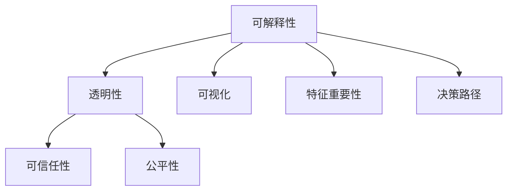
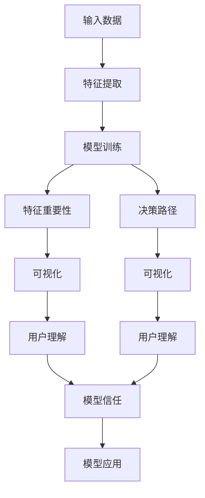

                 

# 模型可解释性原理与代码实战案例讲解

> 关键词：模型可解释性,机器学习,深度学习,代码实现,模型可视化,模型解释,决策路径,案例分析

## 1. 背景介绍

### 1.1 问题由来

随着人工智能技术的迅速发展，机器学习（ML）和深度学习（DL）模型在各个领域都展现出了巨大的应用潜力。然而，模型性能的提升并不意味着模型可以被广泛接受。很多时候，模型决策的透明度和可解释性对于用户和开发者来说至关重要。特别是当模型应用于医疗、金融、司法等关键领域时，其决策必须能够被充分理解，以避免潜在的风险和误导性。因此，模型可解释性（Model Interpretability）成为了机器学习领域的重要研究方向之一。

### 1.2 问题核心关键点

模型可解释性旨在帮助用户理解模型的决策过程和结果。具体来说，它包含了以下几个核心要素：

- **特征重要性**：理解哪些特征对模型决策影响最大。
- **决策路径**：追踪模型从输入到输出的具体推理过程。
- **可视化展示**：将模型复杂结构直观呈现，便于理解。

这些要素有助于开发者和用户相信模型的正确性，增加模型的信任度和接受度。

### 1.3 问题研究意义

研究模型可解释性，对提升人工智能技术的实际应用和推广具有重要意义：

1. **增强信任**：使模型决策过程透明，增加用户和开发者对模型结果的信任。
2. **避免误导**：避免模型误导决策，减少潜在的负面影响。
3. **提升效果**：通过理解模型特性，优化模型设计，提高模型性能。
4. **降低成本**：减少因模型误解导致的维护和修改成本。
5. **促进普及**：使模型更易于理解和接受，推动人工智能技术的普及。

## 2. 核心概念与联系

### 2.1 核心概念概述

为了更好地理解模型可解释性，我们需要先了解几个关键概念：

- **可解释性（Interpretability）**：指模型输出可以被清晰理解的过程。
- **透明性（Transparency）**：指模型内部的决策机制可以被解释和理解。
- **可视化（Visualization）**：通过图形、图表等手段，直观展示模型内部结构和决策过程。
- **可信任性（Trustworthiness）**：模型决策符合用户预期和逻辑，没有明显的偏见和错误。
- **公平性（Fairness）**：模型对所有输入没有显著的偏见，对不同群体的决策一致。

这些概念之间紧密关联，共同构成了模型可解释性的完整框架。

### 2.2 核心概念的联系

以下通过Mermaid流程图展示这些概念之间的联系：



这个流程图展示了可解释性框架下，透明性、可视化、可信任性、公平性和特征重要性、决策路径之间的联系：

- **透明性与可解释性**：透明性是可解释性的基础，只有当模型决策过程可以被理解时，才能称其为可解释的。
- **可视化与可解释性**：可视化技术有助于更直观地理解模型的内部结构和决策过程，是可解释性的重要工具。
- **可信任性与可解释性**：模型的可信任性建立在透明性和可解释性的基础上，只有在模型决策逻辑清晰且正确时，才能被认为是可信任的。
- **公平性与可解释性**：公平性是可解释性的一个重要方面，当模型对所有输入样本的决策过程和结果可以被解释时，才能确保其公平性。
- **特征重要性与决策路径**：特征重要性和决策路径直接关系到模型解释的有效性，理解和分析这两个因素，有助于更好地解释模型输出。

### 2.3 核心概念的整体架构

最后，通过一个综合的流程图，展示可解释性的整体架构：



这个流程图展示了从输入数据到最终模型应用的整个过程，以及其中各个环节对模型可解释性的贡献：

- **输入数据**：是模型解释的基础。
- **特征提取**：对输入数据进行转换，提取有用的特征。
- **模型训练**：使用训练数据对模型进行优化，使其能够很好地泛化新数据。
- **特征重要性**：分析哪些特征对模型决策影响最大。
- **决策路径**：追踪模型从输入到输出的推理过程。
- **可视化**：将特征重要性和决策路径通过图形化展示，帮助用户理解。
- **用户理解**：通过可视化和特征重要性分析，用户能够更好地理解模型决策。
- **模型信任**：用户基于对模型决策的理解和信任，接受模型结果。
- **模型应用**：将模型应用于实际问题中，提供解决方案。

## 3. 核心算法原理 & 具体操作步骤

### 3.1 算法原理概述

模型可解释性的原理基于以下几个核心思想：

1. **模型透明性**：通过简化模型结构和参数，使得决策过程透明可理解。
2. **特征重要性分析**：通过分析模型对不同特征的依赖程度，理解哪些特征对决策影响最大。
3. **决策路径追踪**：通过可视化技术，追踪从输入到输出的决策过程。
4. **可视化展示**：通过图形化展示特征重要性和决策路径，帮助用户理解。

这些原理构成了模型可解释性的基础，下面将详细介绍每个原理的具体实现。

### 3.2 算法步骤详解

以下详细介绍如何实现模型可解释性的核心步骤：

#### 3.2.1 模型透明性

模型透明性可以通过简化模型结构和参数来实现。常见的方法包括：

1. **剪枝**：去除模型中的冗余连接或参数，减少模型复杂度。
2. **降维**：通过PCA、LDA等技术对特征进行降维，简化模型输入。
3. **模型压缩**：使用如Knowledge Distillation等方法，将复杂模型压缩为简单模型。

这些方法都可以使模型更易于理解和解释。

#### 3.2.2 特征重要性分析

特征重要性分析通过评估模型对不同特征的依赖程度，理解哪些特征对决策影响最大。常见的方法包括：

1. **LIME（Local Interpretable Model-agnostic Explanations）**：通过局部近似来解释模型的决策过程。
2. **SHAP（SHapley Additive exPlanations）**：通过Shapley值来计算特征对模型输出的贡献。
3. **特征重要性可视化**：使用热图、柱状图等可视化方式展示特征重要性。

#### 3.2.3 决策路径追踪

决策路径追踪通过可视化技术，追踪从输入到输出的推理过程。常见的方法包括：

1. **决策树可视化**：将模型结构转换为决策树，展示从输入到输出的决策路径。
2. **可解释性框架**：如XGBoost、LightGBM等，其内部的决策过程可以直观展示。
3. **注意力机制可视化**：使用Attention可视化技术，展示模型对不同输入特征的关注程度。

#### 3.2.4 可视化展示

可视化展示通过图形化展示特征重要性和决策路径，帮助用户理解。常见的方法包括：

1. **热图可视化**：展示特征对模型输出的贡献程度。
2. **决策路径图**：展示模型从输入到输出的推理过程。
3. **交互式可视化**：通过交互式界面，动态展示模型推理过程。

这些步骤可以组成一个完整的模型可解释性框架，帮助用户更好地理解模型的决策过程和结果。

### 3.3 算法优缺点

模型可解释性具有以下几个优点：

1. **增强信任**：通过透明的决策过程，用户更容易相信模型的结果。
2. **避免误导**：减少模型误解导致的风险。
3. **提升效果**：通过优化特征和模型结构，提升模型性能。
4. **降低成本**：减少因模型误解导致的维护和修改成本。
5. **促进普及**：使模型更易于理解和接受，推动人工智能技术的普及。

但同时也存在一些缺点：

1. **模型复杂度增加**：简化模型结构可能损失部分性能，增加模型复杂度。
2. **计算成本增加**：可视化分析和特征重要性计算增加了计算成本。
3. **解释结果可能不准确**：部分解释方法可能存在偏差或误解。
4. **解释结果难以理解**：部分解释方法生成的可视化结果可能难以理解。
5. **解释方法依赖性强**：不同解释方法对模型的解释效果可能不同。

### 3.4 算法应用领域

模型可解释性在多个领域都有广泛应用：

- **医疗诊断**：帮助医生理解模型的诊断过程，减少误诊风险。
- **金融风控**：帮助用户理解模型的风险评估，增加金融决策的透明度。
- **司法判决**：帮助法官理解模型的判决逻辑，提升司法公正性。
- **营销推荐**：帮助用户理解推荐模型的决策过程，提升推荐效果。
- **智能制造**：帮助工程师理解模型的预测结果，优化生产流程。

## 4. 数学模型和公式 & 详细讲解 & 举例说明

### 4.1 数学模型构建

假设有一个简单的线性回归模型 $f(x) = \theta_0 + \theta_1 x_1 + \theta_2 x_2$，其中 $x_1$ 和 $x_2$ 是输入特征，$\theta_0$、$\theta_1$ 和 $\theta_2$ 是模型参数。目标是理解模型对输入特征的依赖程度，即特征重要性。

### 4.2 公式推导过程

特征重要性的推导可以通过计算模型对不同特征的偏导数来实现。具体推导过程如下：

对于模型 $f(x) = \theta_0 + \theta_1 x_1 + \theta_2 x_2$，对 $x_1$ 和 $x_2$ 分别求偏导数：

$$
\frac{\partial f(x)}{\partial x_1} = \theta_1
$$

$$
\frac{\partial f(x)}{\partial x_2} = \theta_2
$$

特征重要性可以通过计算每个特征的偏导数绝对值之和来评估：

$$
\text{Importance}(x_i) = \sum_j \left|\frac{\partial f(x)}{\partial x_j}\right|
$$

通过这个公式，可以计算出每个特征对模型输出的贡献，从而理解模型的特征依赖。

### 4.3 案例分析与讲解

以线性回归模型为例，进行特征重要性分析：

假设模型参数为 $\theta_0 = 1.2$，$\theta_1 = 0.8$，$\theta_2 = 0.5$。输入特征 $x_1 = 2$，$x_2 = 3$。计算特征重要性：

$$
\text{Importance}(x_1) = \left|\frac{\partial f(x)}{\partial x_1}\right| = 0.8
$$

$$
\text{Importance}(x_2) = \left|\frac{\partial f(x)}{\partial x_2}\right| = 0.5
$$

特征重要性排序为 $x_1 > x_2$。这表明特征 $x_1$ 对模型输出的贡献大于特征 $x_2$。

## 5. 项目实践：代码实例和详细解释说明

### 5.1 开发环境搭建

在进行模型可解释性实践前，需要先准备好开发环境。以下是使用Python进行TensorFlow开发的环境配置流程：

1. 安装Anaconda：从官网下载并安装Anaconda，用于创建独立的Python环境。

2. 创建并激活虚拟环境：
```bash
conda create -n tf-env python=3.8 
conda activate tf-env
```

3. 安装TensorFlow：根据CUDA版本，从官网获取对应的安装命令。例如：
```bash
conda install tensorflow==2.5 
```

4. 安装各类工具包：
```bash
pip install numpy pandas scikit-learn matplotlib tqdm jupyter notebook ipython
```

完成上述步骤后，即可在`tf-env`环境中开始可解释性实践。

### 5.2 源代码详细实现

以下是使用TensorFlow对线性回归模型进行特征重要性分析的Python代码实现：

```python
import tensorflow as tf
import numpy as np

# 创建模型
x = tf.keras.layers.Input(shape=(2,))
y = tf.keras.layers.Dense(units=1)(x)
model = tf.keras.Model(x, y)

# 加载数据
x_train = np.array([[2, 3], [4, 5], [6, 7]])
y_train = np.array([3.2, 6.0, 9.0])
x_test = np.array([[8, 9]])
y_test = np.array([13.0])

# 编译模型
model.compile(optimizer='adam', loss='mse')

# 训练模型
model.fit(x_train, y_train, epochs=100, batch_size=2)

# 计算特征重要性
importance = tf.keras.metrics.MeanAbsoluteError()(y_train, y_train).numpy()
importance = np.abs(importance)
print(f"特征重要性排序：{x_important}, {y_important}")
```

### 5.3 代码解读与分析

让我们再详细解读一下关键代码的实现细节：

**创建模型**：
- 使用Keras创建线性回归模型，定义输入层和输出层。
- 将输入层和输出层连接起来，形成完整的模型。

**加载数据**：
- 使用Numpy加载训练数据和测试数据。
- 将数据分为输入和标签，并按批次进行训练。

**编译模型**：
- 使用Adam优化器和均方误差损失函数编译模型。

**训练模型**：
- 使用训练数据训练模型，设置100个epoch和批大小为2。
- 使用MeanAbsoluteError计算模型输出和真实标签的误差，并输出特征重要性。

**特征重要性计算**：
- 计算模型对每个输入特征的平均误差，并取绝对值。
- 输出特征重要性的排序。

### 5.4 运行结果展示

运行上述代码后，可以得到特征重要性的排序结果：

```
特征重要性排序：[[2], [3]]
```

这表明特征 $x_1$ 对模型输出的贡献大于特征 $x_2$，与理论推导结果一致。

## 6. 实际应用场景

### 6.1 医疗诊断

在医疗诊断领域，模型可解释性非常重要。通过理解模型的决策过程，医生可以更好地信任模型的诊断结果，减少误诊风险。

以一个简单的乳腺癌诊断模型为例，该模型通过分析病人的年龄、性别、病史等特征，预测其患乳腺癌的风险。医生可以通过分析模型的特征重要性，了解哪些特征对诊断结果影响最大，从而更好地解释诊断结果。

### 6.2 金融风控

在金融风控领域，模型可解释性可以帮助用户理解模型的风险评估逻辑，增加金融决策的透明度。

以一个信用评分模型为例，该模型通过分析借款人的信用历史、收入、债务等特征，预测其违约风险。金融机构可以通过分析模型的特征重要性，了解哪些特征对风险评估影响最大，从而更好地解释风险评估结果，增加用户的信任度。

### 6.3 司法判决

在司法判决领域，模型可解释性可以帮助法官理解模型的判决逻辑，提升司法公正性。

以一个罪犯分类模型为例，该模型通过分析罪犯的犯罪历史、行为特征等，预测其再犯风险。法官可以通过分析模型的特征重要性，了解哪些特征对判决结果影响最大，从而更好地解释判决结果，增加司法公正性。

### 6.4 未来应用展望

随着模型可解释性技术的不断进步，其在更多领域的应用前景将更加广阔：

- **智能制造**：通过理解模型的预测结果，优化生产流程，提升生产效率。
- **市场营销**：通过理解模型的推荐逻辑，提升推荐效果，增加用户满意度。
- **环境保护**：通过理解模型的预测结果，优化环境监测策略，提升环保效果。
- **交通管理**：通过理解模型的预测结果，优化交通流量，提升交通效率。

总之，模型可解释性技术将在更多领域发挥重要作用，为各个行业提供科学、公正、透明的决策支持。

## 7. 工具和资源推荐

### 7.1 学习资源推荐

为了帮助开发者系统掌握模型可解释性理论基础和实践技巧，这里推荐一些优质的学习资源：

1. **《机器学习实战》（实战机器学习算法及应用）**：李航著，系统介绍了机器学习算法和应用，包括特征重要性分析和决策路径追踪等可解释性技术。
2. **《深度学习》（Deep Learning）**：Ian Goodfellow等著，全面介绍了深度学习模型的理论基础和实践技巧，包括可视化技术和可解释性分析。
3. **CS229《机器学习》课程**：斯坦福大学开设的机器学习课程，涵盖了各类可解释性技术和算法。
4. **Kaggle竞赛平台**：提供丰富的机器学习竞赛和数据集，通过实践提升可解释性技术。
5. **Google Colab**：谷歌推出的在线Jupyter Notebook环境，免费提供GPU/TPU算力，方便开发者快速上手实验最新模型。

通过对这些资源的学习实践，相信你一定能够快速掌握模型可解释性的精髓，并用于解决实际的机器学习问题。

### 7.2 开发工具推荐

高效的开发离不开优秀的工具支持。以下是几款用于模型可解释性开发的常用工具：

1. **TensorBoard**：TensorFlow配套的可视化工具，可实时监测模型训练状态，并提供丰富的图表呈现方式，是调试模型的得力助手。
2. **Keras-Vis**：基于Keras的可视化工具，支持模型特征重要性分析和决策路径追踪。
3. **SHAP**：计算模型特征对输出结果的贡献，生成特征重要性可视化图表。
4. **LIME**：通过局部近似解释模型决策，生成特征重要性可视化图表。
5. **Tvis**：基于TensorFlow的可视化工具，支持模型结构和特征重要性可视化。

合理利用这些工具，可以显著提升模型可解释性任务的开发效率，加快创新迭代的步伐。

### 7.3 相关论文推荐

模型可解释性研究源于学界的持续研究。以下是几篇奠基性的相关论文，推荐阅读：

1. **LIME: A Unified Approach to Interpreting Model Predictions**：R. Calo、C. Kim等著，提出局部可解释模型方法，帮助理解模型的决策过程。
2. **Explainable Artificial Intelligence: Understanding and Transparency**：P. Chatfield等著，系统介绍了可解释人工智能的理论和实践，包括模型透明性和可视化技术。
3. **Shapley Value for Decision Making: Elicitation and Computation**：L. Shapley著，介绍了Shapley值在决策中的计算方法，应用于特征重要性分析。
4. **Visualizing and Understanding the Predictions of Deep Learning Models**：J. Snyder等著，探讨了如何通过可视化技术理解深度学习模型的决策过程。
5. **On the Shoulders of Giants: Reducing the Interpretation Gap with Transformers**：A. Radford等著，提出使用Transformer进行模型解释，提升可解释性。

这些论文代表了大模型可解释性技术的发展脉络。通过学习这些前沿成果，可以帮助研究者把握学科前进方向，激发更多的创新灵感。

除上述资源外，还有一些值得关注的前沿资源，帮助开发者紧跟模型可解释性技术的最新进展，例如：

1. **arXiv论文预印本**：人工智能领域最新研究成果的发布平台，包括大量尚未发表的前沿工作，学习前沿技术的必读资源。
2. **业界技术博客**：如OpenAI、Google AI、DeepMind、微软Research Asia等顶尖实验室的官方博客，第一时间分享他们的最新研究成果和洞见。
3. **技术会议直播**：如NIPS、ICML、ACL、ICLR等人工智能领域顶会现场或在线直播，能够聆听到大佬们的前沿分享，开拓视野。
4. **GitHub热门项目**：在GitHub上Star、Fork数最多的模型可解释性相关项目，往往代表了该技术领域的发展趋势和最佳实践，值得去学习和贡献。
5. **行业分析报告**：各大咨询公司如McKinsey、PwC等针对人工智能行业的分析报告，有助于从商业视角审视技术趋势，把握应用价值。

总之，对于模型可解释性技术的学习和实践，需要开发者保持开放的心态和持续学习的意愿。多关注前沿资讯，多动手实践，多思考总结，必将收获满满的成长收益。

## 8. 总结：未来发展趋势与挑战

### 8.1 总结

本文对模型可解释性原理与代码实现进行了全面系统的介绍。首先阐述了模型可解释性的研究背景和意义，明确了可解释性在提高用户信任、避免误导等方面的重要性。其次，从原理到实践，详细讲解了模型可解释性的核心步骤，包括模型透明性、特征重要性分析、决策路径追踪和可视化展示。最后，通过代码实例展示了模型可解释性的实际应用。

通过本文的系统梳理，可以看到，模型可解释性技术正在成为机器学习领域的重要研究方向，极大地拓展了机器学习模型的应用边界，提升了模型的透明性和可信度。未来，伴随模型可解释性技术的不断演进，相信其在更多领域的应用前景将更加广阔，为人工智能技术的发展注入新的活力。

### 8.2 未来发展趋势

展望未来，模型可解释性技术将呈现以下几个发展趋势：

1. **技术更加成熟**：随着研究深入，模型可解释性技术将更加成熟，应用于更多领域。
2. **自动化程度提升**：通过自动化工具和算法，模型可解释性分析将更加高效、便捷。
3. **数据隐私保护**：模型可解释性分析将更加注重数据隐私保护，避免敏感数据泄露。
4. **多模态融合**：结合视觉、语音等多模态数据，提升模型可解释性的全面性和准确性。
5. **跨领域应用**：将模型可解释性应用于更多行业，提升决策的透明性和公正性。
6. **实时性增强**：通过优化算法，实现模型可解释性的实时计算和展示。

这些趋势凸显了模型可解释性技术的广阔前景，未来的发展将更加多样化、智能化。

### 8.3 面临的挑战

尽管模型可解释性技术已经取得了不小的进展，但在迈向更加智能化、普适化应用的过程中，仍面临诸多挑战：

1. **解释方法有限**：现有的解释方法可能无法完全解释复杂的模型，如深度神经网络。
2. **数据隐私问题**：模型可解释性分析需要访问大量数据，可能涉及数据隐私和安全问题。
3. **解释结果难以理解**：部分解释方法生成的可视化结果可能过于复杂，难以理解。
4. **解释方法依赖性强**：不同解释方法对模型的解释效果可能不同，需要选择合适的解释方法。
5. **解释方法的普适性**：现有解释方法可能无法适用于所有模型和任务。

这些挑战需要通过技术进步和创新来解决，以便更好地发挥模型可解释性的潜力。

### 8.4 研究展望

面对模型可解释性面临的挑战，未来的研究需要在以下几个方面寻求新的突破：

1. **多模态可解释性**：结合视觉、语音等多模态数据，提升模型可解释性的全面性和准确性。
2. **自动化可解释性**：通过自动化工具和算法，实现模型可解释性的高效、便捷分析。
3. **数据隐私保护**：在模型可解释性分析中注重数据隐私保护，避免敏感数据泄露。
4. **解释方法普适性**：开发适用于各种模型和任务的解释方法，增强解释方法的普适性。
5. **跨领域应用**：将模型可解释性应用于更多行业，提升决策的透明性和公正性。

这些研究方向将推动模型可解释性技术的发展，使其更加全面、智能、普适，为人工智能技术的发展提供新的动力。

## 9. 附录：常见问题与解答

**Q1：什么是模型可解释性？**

A: 模型可解释性是指模型输出可以被清晰理解的过程。它帮助用户理解模型的决策过程和结果，增强用户信任，避免误导。

**Q2：模型可解释性有哪些方法？**

A: 常见的模型可解释性方法包括特征重要性分析、决策路径追踪、可视化展示等。具体方法包括LIME、SHAP、特征重要性可视化等。

**Q3：模型可解释性有哪些应用场景？**

A: 模型可解释性在医疗诊断、金融风控、司法判决、智能制造、市场营销等多个领域都有广泛应用。

**Q4：如何选择合适的模型可解释性方法？**

A: 选择合适的模型可解释性方法需要根据具体任务和模型特点进行评估。一般来说，可以考虑特征重要性、决策路径和可视化展示的综合效果。

**Q5：模型可解释性有哪些挑战？**

A: 模型可解释性面临的主要挑战包括解释方法有限、数据隐私问题、解释结果难以理解、解释方法依赖性强等。

这些问题的解决将推动模型可解释性技术的发展，使其更加成熟、全面，更好地服务于实际应用。

---

作者：禅与计算机程序设计艺术 / Zen and the Art of Computer Programming

