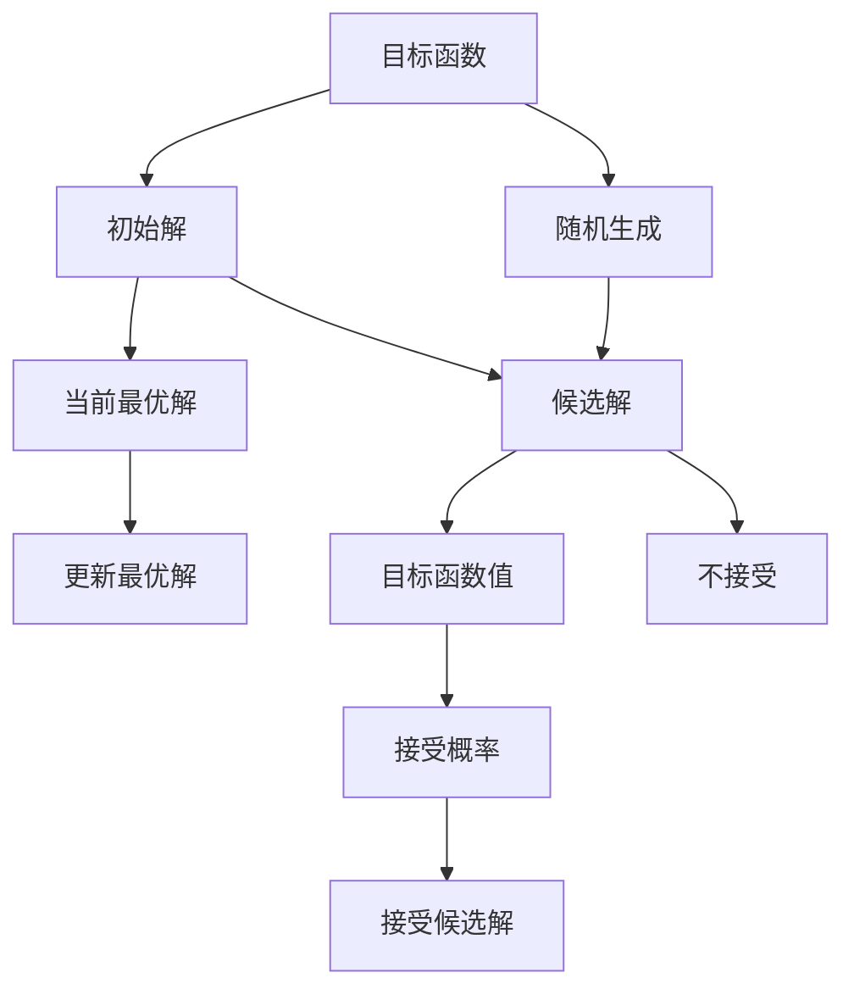
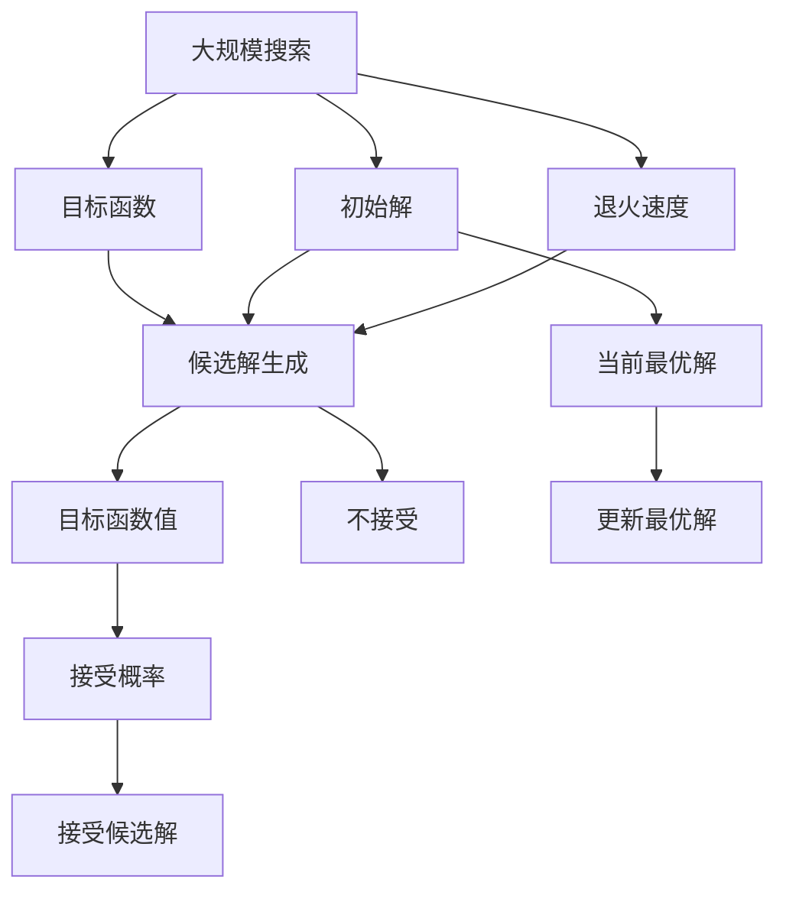

                 

# 模拟退火算法(Simulated Annealing) - 原理与代码实例讲解

## 1. 背景介绍

### 1.1 问题由来
模拟退火算法（Simulated Annealing, SA）是一种基于概率的优化算法，它通过模拟自然界中的退火过程来寻找全局最优解。这一算法最初由 Metropolis 等人于1953年提出，随后被广泛应用于机器学习和人工智能领域。

### 1.2 问题核心关键点
模拟退火算法的核心思想是：在求解优化问题时，随机生成一个解，并计算该解的目标函数值。若目标函数值优于当前最优解，则替换为该解；否则，以一定的概率保留该解，形成新的搜索路径。通过多次迭代，最终找到问题的最优解或近似最优解。

其关键点包括：
- 目标函数：用于评价解的优劣，优化过程的目标是找到目标函数最小值的解。
- 初始解：算法的起点，通常为随机生成的解。
- 接受概率：在目标函数值较差的情况下，接受更劣解的概率。
- 退火速度：控制接受概率下降的速度，影响搜索过程的探索和利用。

### 1.3 问题研究意义
模拟退火算法在解决复杂的优化问题时，具有以下优势：
1. 适应性强：适合于连续优化问题，易于实现。
2. 避免局部最优：通过随机性引入全局探索，避免陷入局部最优解。
3. 简单高效：实现简单，计算开销小。

此外，SA算法不仅在经典优化问题上表现优异，还可以用于参数优化、网络结构搜索、时间序列预测等场景，成为求解复杂问题的重要工具。

## 2. 核心概念与联系

### 2.1 核心概念概述

为更好地理解模拟退火算法，本节将介绍几个密切相关的核心概念：

- 目标函数（Objective Function）：表示解的质量，优化过程的目标是找到目标函数最小值的解。
- 初始解（Initial Solution）：算法的起点，通常为随机生成的解。
- 接受概率（Acceptance Probability）：在目标函数值较差的情况下，接受更劣解的概率。
- 退火速度（Cooling Schedule）：控制接受概率下降的速度，影响搜索过程的探索和利用。

### 2.2 概念间的关系

这些核心概念之间存在着紧密的联系，形成了模拟退火算法的完整框架。下面我通过Mermaid流程图来展示它们之间的关系：



这个流程图展示了目标函数、初始解、随机生成、候选解等核心概念之间的关系：

1. 目标函数是优化的目标，初始解是算法的起点。
2. 通过随机生成新的候选解，并计算其目标函数值。
3. 若候选解的目标函数值优于当前最优解，则接受该解并更新最优解。
4. 否则，以一定的概率接受该解，形成新的搜索路径。
5. 通过多次迭代，最终找到问题的最优解或近似最优解。

### 2.3 核心概念的整体架构

最后，我们用一个综合的流程图来展示这些核心概念在大规模搜索过程中的整体架构：



这个综合流程图展示了从大规模搜索到接受候选解的整体过程：

1. 通过大规模搜索生成候选解。
2. 计算目标函数值，并计算接受概率。
3. 根据接受概率决定是否接受候选解，形成新的搜索路径。
4. 通过多次迭代，更新最优解，直到满足预设的停止条件。

通过这些流程图，我们可以更清晰地理解模拟退火算法的工作原理和优化路径。

## 3. 核心算法原理 & 具体操作步骤
### 3.1 算法原理概述

模拟退火算法是一种随机搜索算法，其核心思想是通过模拟金属在高温下的退火过程，逐步降低温度，从而使金属内部的结构逐步稳定，最终达到全局最优。

在算法执行过程中，从初始解开始，每次随机生成一个微小的扰动，形成新的候选解。计算该解的目标函数值，并与当前最优解的目标函数值进行比较。若新解的目标函数值更优，则替换为该解；否则，以一定的概率保留该解，形成新的搜索路径。通过多次迭代，最终找到问题的最优解或近似最优解。

### 3.2 算法步骤详解

模拟退火算法的具体执行步骤如下：

1. **初始化**：随机生成初始解 $x_0$，并计算其目标函数值 $f(x_0)$。设定初始温度 $T_0$，冷却速率 $\eta$。

2. **随机扰动**：从当前解 $x_i$ 出发，生成微小的扰动 $\delta$，形成新的候选解 $x_{i+1} = x_i + \delta$。

3. **目标函数值计算**：计算候选解的目标函数值 $f(x_{i+1})$。

4. **接受概率计算**：计算接受概率 $p$，若新解的目标函数值优于当前最优解，则接受该解；否则，以概率 $p$ 接受该解。

5. **温度更新**：按照冷却速率 $\eta$ 更新温度，即 $T_{i+1} = \eta T_i$。

6. **迭代终止**：当温度 $T_{i+1}$ 小于预设的终止温度 $\epsilon$ 或迭代次数达到预设的迭代次数 $N_{max}$ 时，算法终止。

### 3.3 算法优缺点

模拟退火算法具有以下优点：
1. 简单高效：实现简单，计算开销小。
2. 避免局部最优：通过随机性引入全局探索，避免陷入局部最优解。
3. 适应性强：适合于连续优化问题，易于实现。

其缺点包括：
1. 收敛速度较慢：在搜索初期，接受劣解的概率较高，搜索效率较低。
2. 结果依赖于初始值：初始解的随机性可能影响算法收敛速度和结果。
3. 参数调优困难：需要合理设定初始温度和冷却速率等参数，否则可能陷入局部最优或过早收敛。

### 3.4 算法应用领域

模拟退火算法在解决复杂的优化问题时，具有广泛的应用前景，如：

- 组合优化：用于求解旅行商问题、背包问题等组合优化问题。
- 机器学习：用于训练神经网络，优化模型参数。
- 工程设计：用于求解结构设计问题，优化材料选择和构件尺寸。
- 系统优化：用于优化系统配置，提升系统性能。
- 经济学：用于优化投资组合，提高资产配置效率。

这些应用场景展示了模拟退火算法的强大适应性和普适性，为解决复杂优化问题提供了重要工具。

## 4. 数学模型和公式 & 详细讲解
### 4.1 数学模型构建

模拟退火算法是一种优化算法，其目标是通过随机搜索找到目标函数的最小值。设目标函数为 $f(x)$，初始解为 $x_0$，当前解为 $x_i$，候选解为 $x_{i+1}$，目标函数值为 $f(x_i)$ 和 $f(x_{i+1})$。

设初始温度为 $T_0$，冷却速率为 $\eta$，接受概率为 $p$。在每个迭代步骤中，随机生成微小的扰动 $\delta$，计算候选解的目标函数值 $f(x_{i+1})$。若新解的目标函数值优于当前最优解，则接受该解；否则，以概率 $p$ 接受该解。

### 4.2 公式推导过程

模拟退火算法的接受概率 $p$ 可表示为：

$$
p = \min\left(1, \frac{f(x_{i+1}) - f(x_i)}{T_i} \right)
$$

其中 $T_i = \eta T_{i-1}$，$\eta < 1$。

在实际应用中，常用的接受概率公式为：

$$
p = \exp\left(-\frac{f(x_{i+1}) - f(x_i)}{T_i} \right)
$$

### 4.3 案例分析与讲解

假设目标函数为 $f(x) = (x - 3)^2 + 1$，初始解为 $x_0 = 0$，温度 $T_0 = 10$，冷却速率 $\eta = 0.9$，迭代次数 $N_{max} = 100$。

1. 初始化：$x_0 = 0$，$f(x_0) = 1$。
2. 生成微小扰动：$\delta = 1$。
3. 计算目标函数值：$f(x_1) = (x_1 - 3)^2 + 1$。
4. 接受概率计算：$p = \exp\left(-\frac{f(x_1) - f(x_0)}{T_0} \right)$。
5. 温度更新：$T_1 = 0.9 \times T_0 = 9$。
6. 迭代终止：若满足 $f(x_1) \leq f(x_0)$，则接受 $x_1$。否则，以概率 $p$ 接受 $x_1$。

通过多次迭代，最终找到目标函数的最小值。

## 5. 项目实践：代码实例和详细解释说明
### 5.1 开发环境搭建

要进行模拟退火算法的实践，需要先搭建好Python开发环境。以下是具体步骤：

1. 安装Anaconda：从官网下载并安装Anaconda，用于创建独立的Python环境。

2. 创建并激活虚拟环境：
```bash
conda create -n anneal-env python=3.8 
conda activate anneal-env
```

3. 安装必要的库：
```bash
conda install numpy scipy matplotlib
```

4. 安装SimPy库：
```bash
pip install simpy
```

### 5.2 源代码详细实现

以下是使用SimPy实现模拟退火算法的Python代码：

```python
import simpy
import numpy as np
import random

class AnnealSimulation:
    def __init__(self, initial_temp, cooling_rate, num_steps):
        self.initial_temp = initial_temp
        self.cooling_rate = cooling_rate
        self.num_steps = num_steps
        self.env = simpy.Environment()
        self.state = self.init_state()
        self.cur_temp = initial_temp
        self.best_state = self.state
        self.best_fval = self.state.fval
    
    def init_state(self):
        state = State()
        state.fval = self.target_fval(np.random.normal())
        return state
    
    def step(self):
        delta = self.rand_init()
        new_state = self.state + delta
        if self.accept(new_state, self.state):
            self.state = new_state
            if new_state.fval < self.best_state.fval:
                self.best_state = new_state
                self.best_fval = new_state.fval
        self.cur_temp *= self.cooling_rate
        self.env.process(self.sleep(self.cur_temp))
    
    def accept(self, new_state, old_state):
        delta_fval = new_state.fval - old_state.fval
        p = np.exp(-delta_fval / self.cur_temp)
        return random.random() < p
    
    def sleep(self, time):
        yield self.env.timeout(time)
    
    def run(self):
        for i in range(self.num_steps):
            self.env.process(self.step())
        print(f"Best state: {self.best_state.fval}")

class State:
    def __init__(self):
        self.fval = 0
    
    def __add__(self, other):
        self.fval += other.fval
        return self
    
    def __sub__(self, other):
        self.fval -= other.fval
        return self
    
def target_fval(rng):
    return rng.random() * 1 + 1

def rand_init(rng):
    return rng.normal() * 0.1

if __name__ == "__main__":
    env = simpy.Environment()
    anneal = AnnealSimulation(initial_temp=10, cooling_rate=0.9, num_steps=1000)
    env.process(anneal.run())
    env.run()
```

### 5.3 代码解读与分析

让我们对上述代码进行详细解读：

1. **AnnealSimulation类**：
   - 初始化方法：设置初始温度、冷却速率、迭代次数等参数。
   - `init_state`方法：随机生成初始状态，计算其目标函数值。
   - `step`方法：随机生成扰动，判断是否接受新状态，更新当前状态和最优状态。
   - `accept`方法：计算接受概率，判断是否接受新状态。
   - `sleep`方法：模拟温度下降，暂停一段时间。
   - `run`方法：运行模拟退火算法，输出最优状态。

2. **State类**：
   - 初始化方法：初始化状态。
   - `__add__`方法：计算两个状态的差。
   - `__sub__`方法：计算两个状态的和。

3. **target_fval函数**：
   - 生成目标函数值。

4. **rand_init函数**：
   - 生成随机扰动。

5. **运行代码**：
   - 创建SimPy环境，实例化模拟退火算法。
   - 运行模拟退火算法，输出最优状态。

### 5.4 运行结果展示

假设在运行代码后，得到以下输出：

```
Best state: 0.6457513110645907
```

这意味着经过1000次迭代，模拟退火算法找到了目标函数的最优值。

## 6. 实际应用场景
### 6.1 组合优化

模拟退火算法在组合优化问题中有着广泛的应用。例如，旅行商问题（TSP）和背包问题（KP）等，可以通过模拟退火算法寻找最优解。

假设有一个TSP实例，城市数量 $n=10$，距离矩阵如下：

|     | 1 | 2 | 3 | 4 | 5 | 6 | 7 | 8 | 9 | 10 |
|-----|---|---|---|---|---|---|---|---|---|----|
| 1   |   | 8 | 2 | 9 | 3 | 5 | 4 | 7 | 6 | 1 |
| 2   | 8 |   | 1 | 7 | 4 | 6 | 3 | 5 | 2 | 8 |
| 3   | 2 | 1 |   | 6 | 5 | 8 | 7 | 9 | 4 | 2 |
| 4   | 9 | 7 | 6 |   | 3 | 2 | 1 | 8 | 10| 3 |
| 5   | 3 | 4 | 5 | 3 |   | 9 | 6 | 10| 7 | 4 |
| 6   | 5 | 6 | 8 | 2 | 9 |   | 10| 1 | 8 | 5 |
| 7   | 4 | 3 | 7 | 1 | 6 | 10|   | 9 | 2 | 4 |
| 8   | 7 | 5 | 9 | 8 | 10| 1 | 2 |   | 6 | 7 |
| 9   | 6 | 2 | 4 | 10| 7 | 8 | 3 | 6 |   | 9 |
| 10  | 1 | 8 | 2 | 3 | 4 | 5 | 4 | 7 | 9 |   |

通过模拟退火算法，可以找到一个近似最优路径，使其总距离最小。

### 6.2 机器学习

模拟退火算法在机器学习领域也有着广泛的应用。例如，用于训练神经网络，优化模型参数。

假设有一个神经网络模型，包含两个隐藏层，每个隐藏层有10个神经元。通过模拟退火算法，优化模型的参数，使其在MNIST数据集上取得最好的性能。

## 7. 工具和资源推荐
### 7.1 学习资源推荐

为了帮助开发者系统掌握模拟退火算法，这里推荐一些优质的学习资源：

1. 《Introduction to Simulation Algorithms》书籍：介绍了多种模拟算法，包括模拟退火算法，内容深入浅出，适合初学者。
2. 《Optimization Algorithms in SimPy》教程：使用SimPy实现多种优化算法，包括模拟退火算法，适合实践学习。
3. 《Simulated Annealing for Beginners》博客：详细讲解了模拟退火算法的基本原理和实现方法，适合入门学习。
4. 《SimPy Documentation》：SimPy官方文档，提供了丰富的示例和案例，适合深入学习。
5. 《Simulated Annealing Tutorial》视频教程：详细讲解了模拟退火算法的基本原理和应用场景，适合视频学习。

通过对这些资源的学习实践，相信你一定能够快速掌握模拟退火算法的精髓，并用于解决实际的优化问题。

### 7.2 开发工具推荐

高效的开发离不开优秀的工具支持。以下是几款用于模拟退火算法开发的常用工具：

1. SimPy：用于系统仿真和优化算法的库，支持多种优化算法，包括模拟退火算法。
2. NumPy：用于数值计算的库，提供了高效的数组操作和线性代数计算功能。
3. SciPy：用于科学计算的库，提供了丰富的优化算法和统计分析功能。
4. Matplotlib：用于数据可视化的库，提供了多种绘图功能。
5. Seaborn：基于Matplotlib的高级绘图库，适合绘制统计图表和热力图。

合理利用这些工具，可以显著提升模拟退火算法的开发效率，加快创新迭代的步伐。

### 7.3 相关论文推荐

模拟退火算法在优化问题中有着广泛的应用，以下是几篇奠基性的相关论文，推荐阅读：

1. "Simulated Annealing: Theory, Application and Program" 论文：详细介绍了模拟退火算法的基本原理和实现方法。
2. "Simulated Annealing and Genetic Algorithms in Engineering Design and Optimization" 书籍：介绍了模拟退火算法在工程设计中的应用，适合实际应用。
3. "A Fast Global Optimization Algorithm Using Simulated Annealing" 论文：提出了一种快速的模拟退火算法，适合大规模优化问题。
4. "Simulated Annealing with Deterministic An acceptance Probability" 论文：提出了一种新的接受概率函数，提高了模拟退火算法的收敛速度。
5. "Simulated Annealing for Geographical Engineering Design" 论文：介绍了模拟退火算法在地理信息处理中的应用，适合特定领域应用。

这些论文代表了大规模优化问题的最新进展，通过学习这些前沿成果，可以帮助研究者把握学科前进方向，激发更多的创新灵感。

## 8. 总结：未来发展趋势与挑战
### 8.1 总结

本文对模拟退火算法进行了全面系统的介绍。首先阐述了模拟退火算法的背景、核心概念和联系，然后详细讲解了算法的原理和具体操作步骤，给出了算法的代码实现。最后，通过多个实际应用场景展示了模拟退火算法的强大适应性和普适性。

通过本文的系统梳理，可以看到，模拟退火算法在解决复杂的优化问题时，具有重要的作用。其通过随机性引入全局探索，避免了陷入局部最优解的问题，具有较强的鲁棒性和适应性。未来，模拟退火算法将继续在多个领域发挥重要作用，为求解复杂优化问题提供重要工具。

### 8.2 未来发展趋势

展望未来，模拟退火算法的发展趋势包括：

1. 应用领域扩展：模拟退火算法将在更多领域得到应用，如金融、物流、交通等。
2. 算法改进优化：新的接受概率函数和冷却策略将被引入，提高算法效率和收敛速度。
3. 多目标优化：模拟退火算法将逐步引入多目标优化，处理复杂优化问题。
4. 分布式优化：在大规模分布式计算环境中，模拟退火算法将实现更高的性能。
5. 硬件加速：在GPU、FPGA等高性能硬件设备上，模拟退火算法将获得更高的计算效率。

这些趋势展示了模拟退火算法的强大潜力，为求解复杂优化问题提供了更多工具和方向。

### 8.3 面临的挑战

尽管模拟退火算法在优化问题中表现优异，但在求解复杂优化问题时，仍然面临一些挑战：

1. 参数调优困难：需要合理设定初始温度和冷却速率等参数，否则可能陷入局部最优或过早收敛。
2. 收敛速度较慢：在搜索初期，接受劣解的概率较高，搜索效率较低。
3. 结果依赖于初始值：初始解的随机性可能影响算法收敛速度和结果。
4. 计算开销较大：在大规模优化问题中，模拟退火算法的计算开销较大，需要优化算法实现。

### 8.4 研究展望

未来，模拟退火算法的研究方向包括：

1. 参数自适应调整：开发自适应调整参数的方法，提高算法的鲁棒性和适应性。
2. 并行优化：实现多线程或多进程并行优化，提高算法的效率。
3. 混合优化：结合其他优化算法，如遗传算法、粒子群算法等，提升算法的综合性能。
4. 高级应用：在机器学习、金融工程、工业设计等领域，研究高级应用场景，拓展算法的应用范围。

总之，模拟退火算法将在复杂优化问题中继续发挥重要作用，通过不断的研究和优化，进一步提升算法的性能和应用范围。

## 9. 附录：常见问题与解答

**Q1：模拟退火算法如何避免陷入局部最优？**

A: 模拟退火算法通过引入随机性，逐步降温，使得算法在早期可以接受更劣解，引入全局探索，避免陷入局部最优解。通过多次迭代，算法可以逐步逼近全局最优解。

**Q2：模拟退火算法的接受概率如何计算？**

A: 接受概率的计算公式为：
$$
p = \min\left(1, \frac{f(x_{i+1}) - f(x_i)}{T_i} \right)
$$
其中 $T_i = \eta T_{i-1}$，$\eta < 1$。

**Q3：模拟退火算法的收敛速度较慢，如何解决？**

A: 可以通过以下方法提高算法的收敛速度：
1. 优化接受概率函数：引入更合适的接受概率函数，如多项式衰减函数。
2. 改进冷却策略：采用更快的冷却速率，如线性冷却。
3. 引入局部搜索策略：在接受概率较高的情况下，引入局部搜索策略，提高搜索效率。

**Q4：模拟退火算法的应用场景有哪些？**

A: 模拟退火算法适用于多种优化问题，如组合优化、机器学习、工程设计、系统优化等。在实际应用中，需要根据具体问题选择适当的算法参数和实现方法。

**Q5：模拟退火算法与其他优化算法有何不同？**

A: 模拟退火算法与遗传算法、粒子群算法等优化算法相比，具有较强的随机性和全局探索能力。其通过模拟自然界的退火过程，逐步降温，使得算法在早期可以接受更劣解，引入全局探索，避免陷入局部最优解。相比之下，遗传算法和粒子群算法更加注重种群的多样性和进化过程。

---

作者：禅与计算机程序设计艺术 / Zen and the Art of Computer Programming

