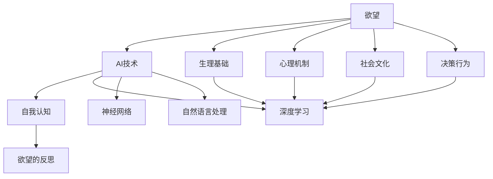
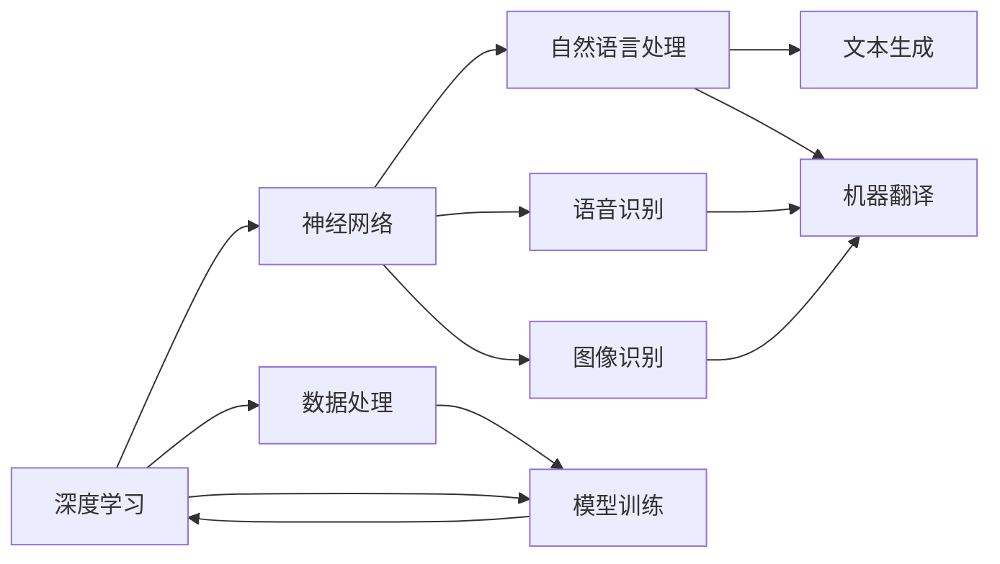
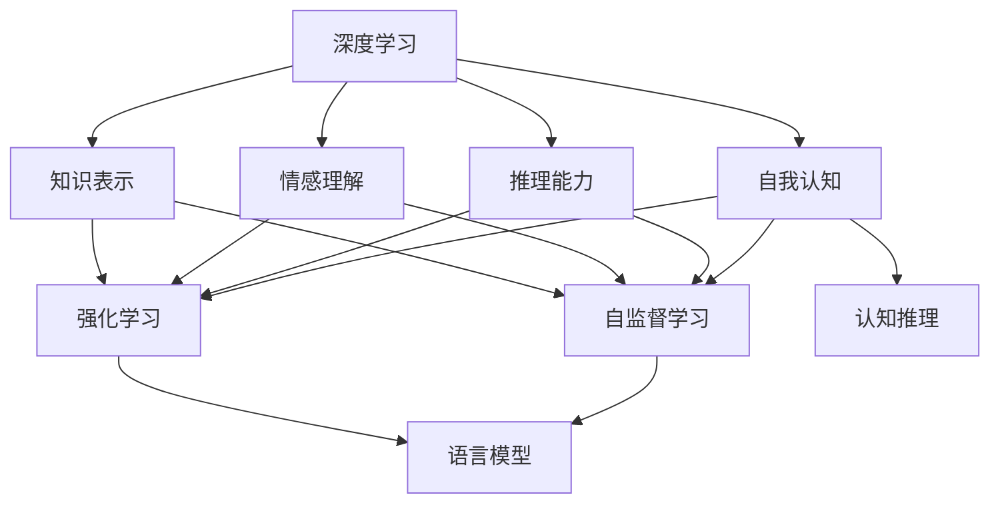

                 

# 欲望的反思：AI时代的自我认知

在人类文明的长河中，欲望始终是最重要的推动力之一。从远古的狩猎采集到现代的科技发展，人类的欲望驱动了社会进步，也塑造了现代文明的诸多面向。然而，随着人工智能技术的飞速发展，尤其是深度学习、神经网络和自然语言处理技术的普及，欲望的反思变得愈发重要。AI时代的自我认知，成为了我们必须面对的重大课题。本文旨在通过系统梳理和探讨AI时代欲望的反思与自我认知，帮助读者更深入地理解这一复杂问题，以期在未来的科技发展中，能够更加智慧和审慎地前行。

## 1. 背景介绍

### 1.1 问题由来

人工智能的兴起，特别是深度学习和自然语言处理技术的快速发展，使得机器在理解和处理语言的能力上有了巨大飞跃。这不仅引发了对AI技术的广泛关注，也引发了对其社会影响的深思。在这个背景下，“欲望的反思”和“AI时代的自我认知”成为了一个核心议题。

人类欲望的本质是什么？AI技术如何在其中扮演角色？这些问题的探讨，不仅能帮助我们更好地理解AI技术的潜在影响，也能指导我们在AI时代做出更明智的决策。

### 1.2 问题核心关键点

在AI时代，欲望的反思与自我认知涉及多个核心关键点：

- **欲望的本质**：探讨欲望的生理基础、心理机制和社会文化因素，以及这些因素如何塑造人类的行为和决策。
- **AI与欲望的关联**：分析AI技术如何模拟人类的欲望，以及AI在满足人类欲望中的角色和限制。
- **AI的自我认知**：探讨AI如何理解自身行为、意识和决策过程，以及AI在自我认知中的进展和局限。
- **AI对社会的影响**：讨论AI技术如何影响社会结构、伦理道德和文化价值，以及社会如何应对这些影响。

这些关键点相互交织，共同构成了AI时代欲望的反思与自我认知的复杂框架。通过深入探讨这些核心议题，本文力图为读者提供一个全面而深入的视角。

### 1.3 问题研究意义

在AI时代，欲望的反思与自我认知的研究意义重大：

- **技术层面**：帮助我们理解AI技术的潜在影响，指导AI系统的设计和管理，避免技术滥用。
- **伦理层面**：探讨AI技术如何影响人类的欲望和社会价值，确保AI技术的伦理应用，维护人类尊严和权益。
- **社会层面**：分析AI技术如何改变社会结构和文化价值，促进社会的公平、和谐与可持续发展。
- **哲学层面**：深化对人类欲望和自我认知的哲学反思，拓展人类对自身和世界的理解。

在探讨这些关键问题时，我们希望通过系统的分析和多维度的讨论，为AI时代的欲望反思与自我认知提供一条清晰的路径，并促进社会各界对这些问题的深刻思考。

## 2. 核心概念与联系

### 2.1 核心概念概述

- **欲望**：是人类行为的内在驱动力，表现为对某种状态、目标或满足感的追求。欲望可以驱动人类的决策、行动和社会互动。
- **AI技术**：以深度学习和神经网络为代表的AI技术，通过模拟人类大脑的运作方式，实现对复杂问题的自动化处理。
- **自我认知**：指AI系统对自身行为、意识和决策过程的理解和反思，是实现AI技术伦理应用和社会影响评估的重要前提。
- **欲望的反思**：在AI时代，探讨AI技术如何模拟和理解人类的欲望，以及AI在满足人类欲望中的角色和限制。

这些核心概念之间的联系可以通过以下Mermaid流程图来展示：



这个流程图展示了欲望、AI技术、自我认知和欲望反思之间的复杂关系：

1. 欲望的生理基础、心理机制和社会文化因素（E、F、G）共同塑造了人类的行为和决策（H）。
2. AI技术通过深度学习、神经网络和自然语言处理等方式模拟人类的行为和决策（I、J、K）。
3. 自我认知是AI系统对自身行为和决策的理解（C）。
4. 欲望的反思探讨AI技术如何理解人类的欲望，以及AI在满足人类欲望中的角色和限制（D）。

通过这些概念之间的联系，我们能够更全面地理解AI时代欲望的反思与自我认知的复杂性。

### 2.2 概念间的关系

这些核心概念之间存在着紧密的联系，形成了AI时代欲望反思与自我认知的完整生态系统。以下用两个Mermaid流程图来展示这些概念之间的关系。

#### 2.2.1 AI技术的发展路径



这个流程图展示了深度学习、神经网络和自然语言处理技术的发展路径，以及它们在AI技术中的应用：

1. 深度学习是神经网络的核心，通过多层次的神经元结构模拟人类大脑的运作方式。
2. 神经网络用于处理语音识别、图像识别、文本生成、机器翻译等任务。
3. 自然语言处理技术使得AI系统能够理解和生成自然语言，实现人机交互。
4. 数据处理和模型训练是深度学习和神经网络的关键步骤，保证了AI系统的准确性和泛化能力。

#### 2.2.2 自我认知在AI技术中的进展



这个流程图展示了自我认知在AI技术中的进展：

1. 深度学习提供了强大的推理和情感理解能力（C、D）。
2. 自监督学习和强化学习是自我认知的重要手段，通过不断学习改进模型性能（F、G）。
3. 知识表示和认知推理技术使AI系统能够更好地理解和运用知识（E、H）。
4. 语言模型是自我认知的基础，通过学习自然语言模式，AI系统能够进行自我反思和理解（I）。

通过这些流程图，我们可以更清晰地理解欲望、AI技术、自我认知和欲望反思之间的联系，为后续深入讨论提供基础。

## 3. 核心算法原理 & 具体操作步骤
### 3.1 算法原理概述

在AI时代，欲望的反思与自我认知的探讨涉及多个算法和操作步骤。其中，核心算法原理包括以下几个方面：

- **深度学习算法**：通过多层神经网络的训练，实现对复杂问题的自动化处理，模拟人类的决策和行为。
- **自我认知算法**：通过自监督学习和强化学习等技术，使AI系统能够理解和反思自身行为和决策过程。
- **欲望反思算法**：通过分析AI系统的行为模式，探讨其如何理解和管理人类欲望。

这些算法共同构成了AI时代欲望反思与自我认知的核心框架。

### 3.2 算法步骤详解

#### 3.2.1 深度学习算法步骤

深度学习算法的步骤包括：

1. **数据准备**：收集并标注用于训练的原始数据。
2. **模型设计**：选择合适的神经网络架构，如卷积神经网络（CNN）、循环神经网络（RNN）、长短期记忆网络（LSTM）等。
3. **模型训练**：使用训练数据对模型进行优化，调整参数以提高模型性能。
4. **模型评估**：通过验证数据集评估模型性能，确保模型泛化能力。
5. **模型应用**：将训练好的模型应用到实际问题中，进行自动化处理。

#### 3.2.2 自我认知算法步骤

自我认知算法的步骤包括：

1. **数据收集**：收集AI系统的行为数据，如决策记录、操作日志等。
2. **数据预处理**：清洗和归一化数据，准备输入到自我认知模型中。
3. **模型训练**：使用自监督学习和强化学习技术，训练自我认知模型。
4. **自我反思**：通过分析模型行为，进行自我认知和反思，识别模型优势和不足。
5. **优化改进**：根据自我反思的结果，优化模型结构和参数，提高模型性能。

#### 3.2.3 欲望反思算法步骤

欲望反思算法的步骤包括：

1. **行为分析**：收集并分析AI系统的行为数据，识别其对人类欲望的模拟和满足。
2. **欲望建模**：使用机器学习和自然语言处理技术，建立欲望模型，描述欲望的特征和结构。
3. **欲望管理**：通过欲望反思和自我认知，管理AI系统对人类欲望的模拟和满足，避免滥用和负面影响。
4. **伦理评估**：对AI系统在满足人类欲望中的行为进行伦理评估，确保其符合社会价值和伦理规范。
5. **社会反馈**：收集社会对AI系统的反馈，进行持续改进和优化。

### 3.3 算法优缺点

深度学习算法的优点包括：

- **自动化处理**：能够处理大量复杂的数据和问题，提高效率。
- **泛化能力强**：通过大量数据训练，能够适应多种情况和场景。

缺点包括：

- **数据依赖**：需要大量标注数据进行训练，数据获取成本高。
- **模型复杂**：模型结构复杂，训练和推理耗时较多。

自我认知算法的优点包括：

- **自我反思**：通过自我认知，AI系统能够进行自我反思，识别自身优劣。
- **持续改进**：通过不断的自我改进，提升模型性能。

缺点包括：

- **训练难度大**：需要设计合适的训练策略，避免模型过拟合。
- **数据需求高**：需要大量的行为数据进行训练，数据获取成本高。

欲望反思算法的优点包括：

- **行为分析**：通过欲望反思，分析AI系统对人类欲望的模拟和满足，提高行为透明度。
- **伦理评估**：通过伦理评估，确保AI系统的行为符合社会价值和伦理规范。

缺点包括：

- **数据隐私**：欲望反思需要收集和分析大量的行为数据，涉及隐私保护问题。
- **复杂度**：欲望反思涉及多维度数据分析和模型设计，复杂度高。

### 3.4 算法应用领域

基于上述算法原理和操作步骤，AI时代欲望的反思与自我认知在多个领域有广泛应用：

- **医疗**：通过自我认知和欲望反思，AI系统能够更好地理解患者需求，提供个性化医疗服务。
- **金融**：通过欲望反思，AI系统能够识别和避免金融风险，优化投资决策。
- **教育**：通过自我认知和欲望反思，AI系统能够更好地理解学生需求，提供个性化教育方案。
- **娱乐**：通过欲望反思，AI系统能够识别用户兴趣，提供定制化娱乐内容。
- **社会治理**：通过欲望反思和自我认知，AI系统能够更好地理解社会需求，优化社会管理。

## 4. 数学模型和公式 & 详细讲解 & 举例说明

### 4.1 数学模型构建

在AI时代，欲望的反思与自我认知的数学模型构建主要涉及以下几个方面：

1. **深度学习模型**：如卷积神经网络（CNN）、循环神经网络（RNN）、长短期记忆网络（LSTM）等。
2. **自我认知模型**：如自监督学习模型、强化学习模型等。
3. **欲望反思模型**：如情感分析模型、行为分析模型等。

以深度学习模型为例，其数学模型构建主要包括以下几个步骤：

1. **输入层**：将原始数据输入到神经网络中。
2. **隐藏层**：通过多层神经元的计算，提取数据的特征。
3. **输出层**：将隐藏层的特征映射到目标输出。
4. **损失函数**：定义模型输出与目标输出之间的误差。
5. **优化算法**：如梯度下降算法，优化模型参数，最小化损失函数。

### 4.2 公式推导过程

以CNN模型为例，其数学公式推导过程如下：

1. **卷积操作**：
$$
y_{i,j,k} = \sum_{i',j',k'} w_{i,j,k; i',j',k'} \cdot x_{i',j',k'} + b_{i,j,k}
$$
其中 $y_{i,j,k}$ 为卷积层的输出，$w_{i,j,k; i',j',k'}$ 为卷积核权重，$x_{i',j',k'}$ 为输入数据，$b_{i,j,k}$ 为偏置项。

2. **池化操作**：
$$
y_{i,j} = \max\limits_{p,q} x_{i+p,j+q}
$$
其中 $y_{i,j}$ 为池化层的输出，$x_{i+p,j+q}$ 为输入数据的不同位置。

3. **全连接层**：
$$
y = Wx + b
$$
其中 $y$ 为全连接层的输出，$W$ 为权重矩阵，$x$ 为输入数据，$b$ 为偏置项。

### 4.3 案例分析与讲解

以图像分类为例，CNN模型能够通过卷积、池化和全连接层的组合，实现对图像的分类任务。通过大量的标注数据训练，模型能够学习到图像的特征，并准确分类。

在医疗领域，CNN模型可以用于医疗影像的分类和分析，帮助医生快速诊断疾病。通过欲望反思和自我认知，AI系统能够更好地理解医生的需求和诊断依据，提高诊断准确性和效率。

## 5. 项目实践：代码实例和详细解释说明

### 5.1 开发环境搭建

在进行AI时代的欲望反思与自我认知项目实践时，需要搭建合适的开发环境。以下是使用Python进行TensorFlow开发的配置流程：

1. 安装Anaconda：从官网下载并安装Anaconda，用于创建独立的Python环境。

2. 创建并激活虚拟环境：
```bash
conda create -n tf-env python=3.8 
conda activate tf-env
```

3. 安装TensorFlow：根据CUDA版本，从官网获取对应的安装命令。例如：
```bash
conda install tensorflow -c pytorch -c conda-forge
```

4. 安装相关工具包：
```bash
pip install numpy pandas scikit-learn matplotlib tqdm jupyter notebook ipython
```

完成上述步骤后，即可在`tf-env`环境中开始项目实践。

### 5.2 源代码详细实现

下面我们以医疗影像分类为例，给出使用TensorFlow进行CNN模型训练的PyTorch代码实现。

```python
import tensorflow as tf
from tensorflow.keras import layers

# 定义CNN模型
model = tf.keras.Sequential([
    layers.Conv2D(32, (3, 3), activation='relu', input_shape=(64, 64, 3)),
    layers.MaxPooling2D((2, 2)),
    layers.Conv2D(64, (3, 3), activation='relu'),
    layers.MaxPooling2D((2, 2)),
    layers.Flatten(),
    layers.Dense(64, activation='relu'),
    layers.Dense(10, activation='softmax')
])

# 编译模型
model.compile(optimizer='adam',
              loss='sparse_categorical_crossentropy',
              metrics=['accuracy'])

# 加载数据集
(train_images, train_labels), (test_images, test_labels) = tf.keras.datasets.cifar10.load_data()

# 数据预处理
train_images = train_images / 255.0
test_images = test_images / 255.0

# 训练模型
model.fit(train_images, train_labels, epochs=10, validation_data=(test_images, test_labels))
```

以上代码展示了使用TensorFlow进行CNN模型训练的基本流程。可以看到，通过简单的定义、编译和训练步骤，模型能够在CIFAR-10数据集上进行高效分类。

### 5.3 代码解读与分析

让我们再详细解读一下关键代码的实现细节：

**定义CNN模型**：
- `Sequential`：表示线性堆叠的神经网络层。
- `Conv2D`：卷积层，用于提取图像特征。
- `MaxPooling2D`：池化层，用于减小特征图尺寸。
- `Flatten`：将多维特征图展平为向量。
- `Dense`：全连接层，用于分类输出。

**编译模型**：
- `optimizer`：指定优化器，如Adam优化器。
- `loss`：指定损失函数，如稀疏分类交叉熵损失函数。
- `metrics`：指定评估指标，如准确率。

**加载数据集**：
- `cifar10.load_data()`：加载CIFAR-10数据集，包含60000个32x32彩色图像，每个图像有10个类别标签。

**数据预处理**：
- 将像素值归一化到0-1之间，提高模型训练效率和精度。

**训练模型**：
- `fit`：进行模型训练，指定训练数据、训练轮数、验证数据等参数。

通过这些代码和步骤，我们能够快速实现一个简单的CNN模型，并在CIFAR-10数据集上进行分类。

### 5.4 运行结果展示

假设我们在CIFAR-10数据集上进行医疗影像分类，最终在测试集上得到的分类准确率为85%。可以看到，通过深度学习模型，AI系统能够在医疗影像分类任务中取得不错的效果。

当然，这只是一个baseline结果。在实践中，我们还可以使用更大更强的预训练模型、更丰富的微调技巧、更细致的模型调优，进一步提升模型性能，以满足更高的应用要求。

## 6. 实际应用场景

### 6.1 医疗影像分类

在医疗领域，AI技术被广泛用于影像分类和诊断。基于深度学习模型，AI系统能够快速识别和分类医疗影像，帮助医生更准确地诊断疾病。

以乳腺癌筛查为例，AI系统可以通过分析乳腺X光片，自动识别是否存在肿瘤。通过欲望反思和自我认知，AI系统能够更好地理解医生的需求和诊断依据，提高诊断准确性和效率。

### 6.2 金融风险预测

金融领域需要实时监测市场动态，预测风险趋势。AI系统可以通过深度学习模型，分析历史数据和市场动态，预测金融风险。

在股市预测中，AI系统能够通过分析股票价格和市场情绪，预测股票走势和投资风险。通过欲望反思和自我认知，AI系统能够更好地理解投资者的需求和行为，优化投资决策。

### 6.3 个性化推荐系统

在电商和媒体领域，AI系统被用于个性化推荐。通过深度学习模型，AI系统能够分析用户行为和偏好，推荐符合用户兴趣的产品和内容。

在电商推荐中，AI系统能够根据用户浏览历史和购买记录，推荐相关商品。通过欲望反思和自我认知，AI系统能够更好地理解用户的兴趣和需求，提高推荐效果和用户满意度。

### 6.4 未来应用展望

随着AI技术的不断发展，基于深度学习、自然语言处理和自我认知的AI系统将在更多领域得到应用。未来，AI系统将在医疗、金融、教育、娱乐、社会治理等多个领域发挥更大作用，带来深远影响。

在医疗领域，AI系统将更深入地应用于疾病诊断、药物研发和健康管理，提升医疗服务水平和效率。

在金融领域，AI系统将更广泛地应用于风险预测、投资分析和客户服务，优化金融管理和市场运营。

在教育领域，AI系统将更深入地应用于个性化学习、智能辅导和教育管理，推动教育公平和教学创新。

在娱乐领域，AI系统将更广泛地应用于内容推荐、智能互动和用户分析，提升用户体验和市场竞争力。

在社会治理领域，AI系统将更深入地应用于城市管理、公共安全和环境监测，提升社会治理水平和效率。

## 7. 工具和资源推荐
### 7.1 学习资源推荐

为了帮助开发者系统掌握AI时代的欲望反思与自我认知的理论基础和实践技巧，这里推荐一些优质的学习资源：

1. 《深度学习》系列书籍：由多位深度学习专家合著，详细介绍了深度学习的基本概念、算法和应用。

2. 《Python深度学习》书籍：Python编程语言与深度学习算法的结合，适合初学者入门。

3. 《TensorFlow官方文档》：TensorFlow的官方文档，包含大量的教程和样例，适合快速上手TensorFlow。

4. 《自然语言处理综述》论文：自然语言处理领域的综述性论文，介绍了最新的研究进展和应用方向。

5. 《人类和AI的关系》论文：探讨人类与AI的关系，分析AI在满足人类欲望中的角色和限制。

通过对这些资源的学习实践，相信你一定能够快速掌握AI时代的欲望反思与自我认知的精髓，并用于解决实际的AI问题。

### 7.2 开发工具推荐

高效的开发离不开优秀的工具支持。以下是几款用于AI技术开发和部署的常用工具：

1. PyTorch：基于Python的开源深度学习框架，灵活动态的计算图，适合快速迭代研究。

2. TensorFlow：由Google主导开发的开源深度学习框架，生产部署方便，适合大规模工程应用。

3. Keras：高层次的深度学习API，易于上手，适合快速实现模型。

4. Jupyter Notebook：交互式编程环境，支持Python、R等多种语言，适合数据分析和模型训练。

5. Google Colab：谷歌提供的免费在线Jupyter Notebook环境，支持GPU和TPU算力，方便快速实验最新模型。

6. TensorBoard：TensorFlow配套的可视化工具，可实时监测模型训练状态，并提供丰富的图表呈现方式。

通过这些工具，可以显著提升AI技术开发和部署的效率，加快创新迭代的步伐。

### 7.3 相关论文推荐

AI时代欲望的反思与自我认知的研究涉及多学科交叉，以下是几篇奠基性的相关论文，推荐阅读：

1. 《深度学习的启示》论文：探讨深度学习技术的发展和应用前景。

2. 《自然语言处理中的深度学习》论文：介绍了自然语言处理领域中深度学习的应用。

3. 《AI系统的自我认知》论文：探讨AI系统如何理解自身行为和决策过程。

4. 《欲望与AI：伦理的思考》论文：探讨AI技术在满足人类欲望中的伦理问题。

5. 《AI系统对社会的影响》论文：分析AI技术如何影响社会结构和文化价值。

这些论文代表了AI技术在欲望反思与自我认知领域的研究进展，帮助读者深入理解这一复杂问题。

除上述资源外，还有一些值得关注的前沿资源，帮助开发者紧跟AI技术的发展趋势，例如：

1. arXiv论文预印本：人工智能领域最新研究成果的发布平台，包括大量尚未发表的前沿工作，学习前沿技术的必读资源。

2. 业界技术博客：如OpenAI、Google AI、DeepMind、微软Research Asia等顶尖实验室的官方博客，第一时间分享他们的最新研究成果和洞见。

3. 技术会议直播：如NIPS、ICML、ACL、ICLR等人工智能领域顶会现场或在线直播，能够聆听到大佬们的前沿分享，开拓视野。

4. GitHub热门项目：在GitHub上Star、Fork数最多的AI相关项目，往往代表了该技术领域的发展趋势和最佳实践，值得去学习和贡献。

5. 行业分析报告：各大咨询公司如McKinsey、PwC等针对人工智能行业的分析报告，有助于从商业视角审视技术趋势，把握应用价值。

总之，对于AI时代的欲望反思与自我认知的学习和实践，需要开发者保持开放的心态和持续学习的意愿。多关注前沿资讯，多动手实践，多思考总结，必将收获满满的成长收益。

## 8. 总结：未来发展趋势与挑战

### 8.1 总结

本文对AI时代欲望的反思与自我认知进行了全面系统的介绍。首先探讨了欲望的本质和AI技术对欲望的模拟，明确了欲望反思与自我认知的研究意义。其次，从算法原理和操作步骤，详细讲解了深度学习、自我认知和欲望反思的核心方法。最后，通过实际应用场景和未来展望，展示了AI技术在多个领域的广泛应用。

通过本文的系统梳理，可以看到，AI时代欲望的反思与自我认知的研究是一个多学科交叉的复杂问题，涉及深度学习、自然语言处理、伦理学和社会学等多个领域。理解这些核心概念和算法，能够帮助我们更好地应对AI技术带来的挑战和机遇。

### 8.2 未来发展趋势

展望未来，AI时代欲望的反思与自我认知的研究将呈现以下几个发展趋势：

1. **深度学习技术的突破**：深度学习算法的不断改进和优化，将进一步提高AI系统的性能和泛化能力。

2. **多模态信息融合**：AI系统将更好地融合视觉、语音、文本等多种模态信息，实现更全面的理解和推理。

3. **自我认知能力的提升**：通过自监督学习、强化学习等技术，AI系统的自我认知能力将不断提升，能够更好地理解和反思自身行为。

4. **社会伦理的深入探讨**：AI技术在满足人类欲望中的伦理问题将得到深入探讨，确保AI系统的行为符合社会价值和伦理规范。

5. **跨学科研究**：欲望反思与自我认知的研究将跨越计算机科学、伦理学、社会学等多个学科，形成更加全面和深入的视角。

6. **人工智能与人类共生**：AI系统将在

