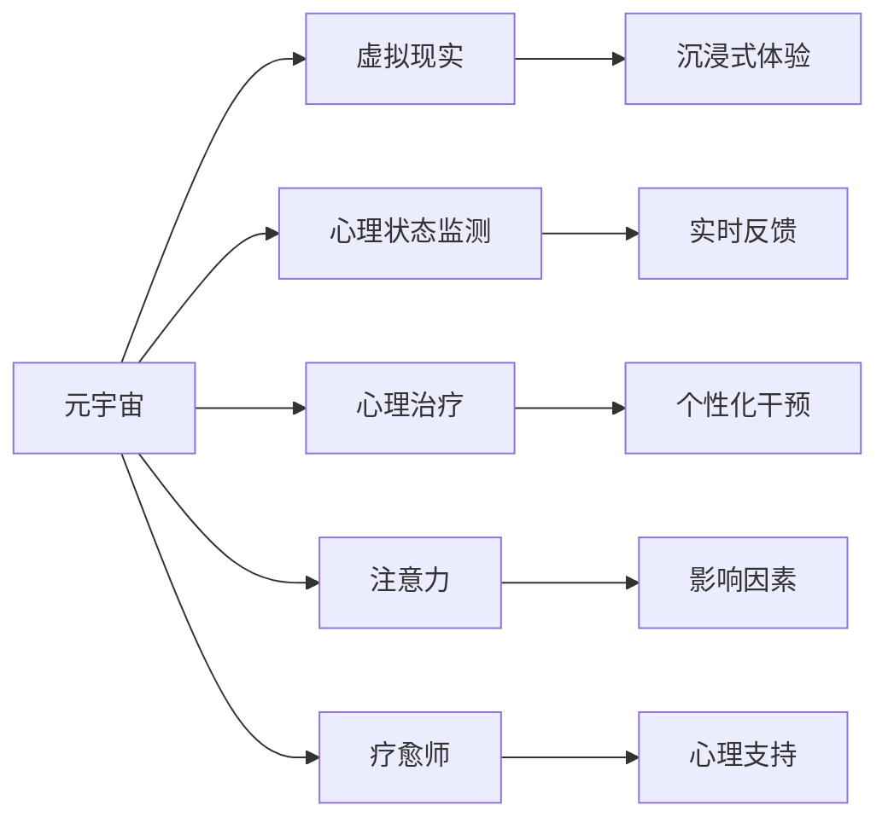
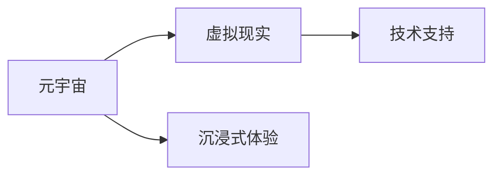
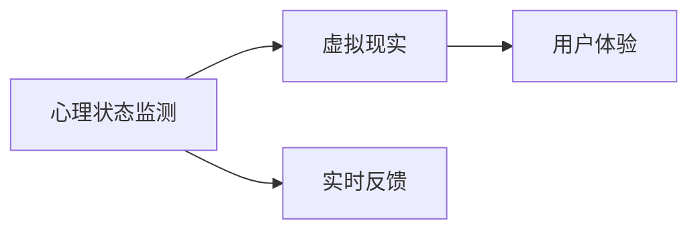
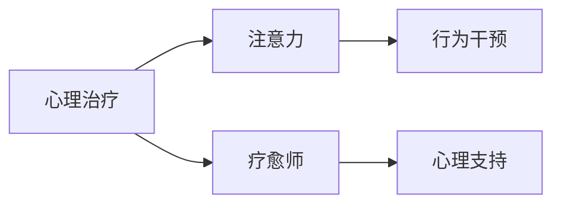

                 

# 注意力疗愈师认证:元宇宙心理健康服务的职业标准

## 1. 背景介绍

### 1.1 问题由来
随着数字技术和虚拟现实技术的发展，元宇宙（Metaverse）正在逐渐成为人类社会的新基础设施。在这一数字化虚拟空间中，人们可以自由交互、创造内容，甚至开展复杂的社会活动。然而，元宇宙带来的全新体验也伴随着一系列心理问题。元宇宙心理健康服务应运而生，旨在通过专业的心理援助和技术手段，帮助人们在虚拟世界中找到内心的平衡和幸福。

### 1.2 问题核心关键点
元宇宙心理健康服务的核心在于利用心理学的理论和技术，结合虚拟现实技术的独特性，提供个性化的心理健康支持。这包括但不限于以下几方面：

1. **个性化治疗**：基于用户在虚拟世界中的行为数据，提供定制化的心理健康干预。
2. **虚拟现实技术**：利用VR/AR技术，为患者提供沉浸式心理治疗环境。
3. **人工智能支持**：运用AI技术进行心理状态的实时监测和分析，提供个性化的心理健康建议。
4. **社交支持**：通过虚拟社区和社交网络，帮助用户建立健康的社交关系，提升心理健康水平。

### 1.3 问题研究意义
元宇宙心理健康服务对于提高虚拟世界中的用户福祉具有重要意义：

1. **提升心理健康水平**：帮助用户应对虚拟世界中的心理压力，如社交焦虑、孤独感等。
2. **促进社会融合**：为不同背景、不同年龄段的用户提供平等的心理健康支持，促进社会融合。
3. **提高生活质量**：通过虚拟现实技术提供沉浸式体验，增强用户的心理韧性。
4. **加速技术应用**：推动心理健康技术的普及和应用，推动技术领域的创新发展。

## 2. 核心概念与联系

### 2.1 核心概念概述

为更好地理解元宇宙心理健康服务的职业标准，本节将介绍几个密切相关的核心概念：

- **元宇宙（Metaverse）**：一个通过虚拟现实技术构建的虚拟空间，用户可以在其中自由互动和创造内容。
- **虚拟现实（VR）/增强现实（AR）**：利用计算机生成逼真环境，为用户提供沉浸式体验的技术。
- **心理状态监测（Psychological Monitoring）**：通过各种传感器和算法，实时监测用户的心理状态，提供反馈和干预。
- **心理治疗（Psychotherapy）**：基于心理学的理论和技巧，帮助用户解决心理问题。
- **注意力（Attention）**：用户在使用元宇宙时所关注的内容、事件和互动，对心理健康有重要影响。
- **疗愈师（Therapist）**：专业的心理健康服务提供者，负责提供心理治疗和支持。

这些核心概念之间的逻辑关系可以通过以下Mermaid流程图来展示：



这个流程图展示了大语言模型微调过程中各个核心概念的关系：

1. 元宇宙是虚拟现实技术的载体，提供沉浸式体验。
2. 心理状态监测通过虚拟现实技术，实时反馈用户的心理状态。
3. 心理治疗利用心理学的理论和技巧，提供个性化干预。
4. 注意力受到虚拟环境的影响，影响用户的心理状态。
5. 疗愈师是心理健康服务的核心，提供心理支持和干预。

### 2.2 概念间的关系

这些核心概念之间存在着紧密的联系，形成了元宇宙心理健康服务的完整生态系统。下面我们通过几个Mermaid流程图来展示这些概念之间的关系。

#### 2.2.1 元宇宙与虚拟现实的关系



这个流程图展示了元宇宙与虚拟现实技术的关系。元宇宙通过虚拟现实技术提供沉浸式体验，增强用户的参与感和体验深度。

#### 2.2.2 心理状态监测与虚拟现实的关系



这个流程图展示了心理状态监测与虚拟现实技术的关系。心理状态监测利用虚拟现实技术实时反馈用户的心理状态，帮助用户及时调整行为和心态。

#### 2.2.3 心理治疗与注意力、疗愈师的关系



这个流程图展示了心理治疗、注意力和疗愈师之间的关系。心理治疗通过调整注意力，改善用户的行为和心态，由疗愈师提供心理支持和干预。

### 2.3 核心概念的整体架构

最后，我们用一个综合的流程图来展示这些核心概念在大语言模型微调过程中的整体架构：


这个综合流程图展示了从用户到个性化干预的完整流程，包括心理状态监测、注意力、心理治疗、心理支持、疗愈师、个性化干预等环节。

## 3. 核心算法原理 & 具体操作步骤
### 3.1 算法原理概述

元宇宙心理健康服务的核心算法原理基于心理学的理论和技术，结合虚拟现实技术的独特性。其核心思想是通过虚拟现实技术提供沉浸式体验，利用心理状态监测实时反馈用户的心理状态，通过心理治疗提供个性化的心理健康干预。

在具体实现中，算法原理包括以下几个关键环节：

1. **心理状态监测**：利用传感器和算法，实时监测用户的心理状态，如心率、脑电波、表情等。
2. **注意力分析**：分析用户在虚拟世界中的注意力焦点，如关注的事件、对象和互动，判断其心理状态和行为模式。
3. **心理治疗**：基于心理学的理论和技巧，设计个性化的心理治疗方案，帮助用户改善心理状态。
4. **实时反馈和干预**：通过虚拟现实技术，实时向用户提供心理状态反馈和个性化干预，提升用户体验。

### 3.2 算法步骤详解

元宇宙心理健康服务的算法步骤主要包括以下几个环节：

1. **数据采集**：利用传感器和虚拟现实技术，采集用户的心理状态数据和注意力数据。
2. **数据预处理**：对采集到的数据进行清洗、去噪和标准化处理，确保数据质量。
3. **心理状态监测**：利用机器学习算法，实时监测用户的心理状态，如焦虑、抑郁等。
4. **注意力分析**：通过分析用户在虚拟世界中的注意力焦点，识别其心理状态和行为模式。
5. **心理治疗**：设计个性化的心理治疗方案，如认知行为疗法、暴露疗法等，帮助用户改善心理状态。
6. **实时反馈和干预**：通过虚拟现实技术，实时向用户提供心理状态反馈和个性化干预，提升用户体验。

### 3.3 算法优缺点

元宇宙心理健康服务的算法具有以下优点：

1. **个性化**：通过实时监测和分析用户数据，提供个性化的心理治疗和支持。
2. **沉浸式**：利用虚拟现实技术，提供沉浸式的心理治疗环境，增强用户的体验深度。
3. **实时性**：通过实时监测和反馈，及时调整用户的心理状态和行为。
4. **普适性**：不受地域和时间的限制，用户可以在任何时间和地点进行心理治疗。

同时，该算法也存在一些缺点：

1. **数据隐私**：采集和处理用户心理数据，需要严格遵守隐私保护法规，确保数据安全。
2. **技术复杂性**：需要综合运用多种技术手段，如传感器技术、机器学习、虚拟现实等，技术难度较高。
3. **成本较高**：设备和技术的投入较高，特别是高质量传感器和虚拟现实设备。
4. **伦理问题**：心理状态监测和干预需要伦理规范，避免对用户造成不必要的心理负担。

### 3.4 算法应用领域

元宇宙心理健康服务可以广泛应用于多个领域，包括但不限于：

1. **游戏心理健康**：在虚拟游戏中提供心理支持和治疗，帮助用户缓解游戏成瘾和心理压力。
2. **虚拟社区支持**：在虚拟社区中提供心理援助，帮助用户建立健康的社交关系。
3. **远程心理健康**：通过虚拟现实技术，提供远程心理治疗和支持，解决地域限制。
4. **企业心理健康**：在虚拟办公环境中提供心理支持和治疗，提升员工的心理健康水平。
5. **教育心理健康**：在虚拟学习环境中提供心理支持和治疗，帮助学生缓解学习压力。

## 4. 数学模型和公式 & 详细讲解 & 举例说明

### 4.1 数学模型构建

本节将使用数学语言对元宇宙心理健康服务的算法过程进行更加严格的刻画。

假设用户的心理状态为 $x$，注意力焦点为 $y$，心理治疗方案为 $z$，实时反馈为 $u$，用户体验为 $v$。根据心理学的理论和虚拟现实技术的特点，我们可以构建以下数学模型：

$$
x \sim f(x,y,z,u)
$$

$$
y \sim g(x,y,v)
$$

$$
z \sim h(x,y)
$$

$$
u \sim i(x,y,z)
$$

$$
v \sim j(x,y,u)
$$

其中，$f$、$g$、$h$、$i$、$j$ 为相应环节的数学模型函数，$x$、$y$、$z$、$u$、$v$ 为相应环节的输入输出变量。

### 4.2 公式推导过程

以下我们以心理状态监测为例，推导心理状态监测的数学模型。

假设用户当前的心理状态为 $x$，注意力焦点为 $y$，心理状态监测系统的输入为用户的生理数据和行为数据，输出为心理状态监测结果 $x$。假设 $x$ 服从正态分布，即 $x \sim N(\mu_x, \sigma_x^2)$。根据贝叶斯定理，可以得到：

$$
p(x|y,v) = \frac{p(x|y,v)}{p(y,v)}
$$

其中，$p(x|y,v)$ 表示在注意力焦点 $y$ 和用户体验 $v$ 的条件下，用户心理状态 $x$ 的后验概率，$p(y,v)$ 表示注意力焦点 $y$ 和用户体验 $v$ 的联合概率密度函数。

根据条件概率的计算公式，可以得到：

$$
p(x|y,v) = \frac{p(x|y) p(y|v)}{p(y,v)}
$$

其中，$p(x|y)$ 表示在注意力焦点 $y$ 的条件下，用户心理状态 $x$ 的条件概率密度函数，$p(y|v)$ 表示在用户体验 $v$ 的条件下，注意力焦点 $y$ 的条件概率密度函数。

假设 $p(y|v)$ 服从伯努利分布，即 $y \sim Bernoulli(\pi_y)$。则有：

$$
p(x|y) = \frac{p(x|y)}{p(y)}
$$

其中，$p(y)$ 表示注意力焦点 $y$ 的概率密度函数。

假设 $p(x|y)$ 服从正态分布，即 $x \sim N(\mu_x, \sigma_x^2)$。则有：

$$
p(x|y) = \frac{1}{\sigma_x\sqrt{2\pi}} e^{-\frac{(x-\mu_x)^2}{2\sigma_x^2}}
$$

综合上述公式，可以得到心理状态监测的数学模型：

$$
p(x|y,v) = \frac{1}{\sigma_x\sqrt{2\pi}} e^{-\frac{(x-\mu_x)^2}{2\sigma_x^2}} \frac{p(y|v)}{p(y,v)}
$$

通过上述推导，我们可以得到用户心理状态的数学模型，并利用机器学习算法进行实时监测和分析。

### 4.3 案例分析与讲解

假设在一个虚拟办公环境中，需要对员工的心理状态进行监测和分析。具体步骤如下：

1. **数据采集**：通过传感器采集员工的生理数据（如心率、呼吸频率）和行为数据（如点击率、屏幕时间）。
2. **数据预处理**：对采集到的数据进行清洗、去噪和标准化处理。
3. **心理状态监测**：利用机器学习算法，实时监测员工的心理状态，如焦虑、抑郁等。
4. **注意力分析**：通过分析员工的注意力焦点，识别其心理状态和行为模式。
5. **心理治疗**：设计个性化的心理治疗方案，如认知行为疗法、暴露疗法等，帮助员工改善心理状态。
6. **实时反馈和干预**：通过虚拟现实技术，实时向员工提供心理状态反馈和个性化干预，提升用户体验。

假设员工 A 在某个时间段内，心率异常加快，点击率下降，屏幕时间减少，心理状态监测系统识别出其可能处于焦虑状态。系统随即提供注意力分析，发现员工 A 的注意力焦点在电子邮件和文档编辑上，但这些任务已占用其大部分时间。系统建议员工 A 可以尝试放松呼吸，进行短暂的运动，并将注意力转移到更有意义的任务上，如与同事沟通交流，参与团队建设活动。通过这些干预措施，员工 A 的心理状态逐渐改善，工作效率提升。

## 5. 项目实践：代码实例和详细解释说明

### 5.1 开发环境搭建

在进行元宇宙心理健康服务的开发前，我们需要准备好开发环境。以下是使用Python进行PyTorch开发的环境配置流程：

1. 安装Anaconda：从官网下载并安装Anaconda，用于创建独立的Python环境。

2. 创建并激活虚拟环境：
```bash
conda create -n pytorch-env python=3.8 
conda activate pytorch-env
```

3. 安装PyTorch：根据CUDA版本，从官网获取对应的安装命令。例如：
```bash
conda install pytorch torchvision torchaudio cudatoolkit=11.1 -c pytorch -c conda-forge
```

4. 安装TensorFlow：使用TensorFlow进行开发需要安装TensorFlow。具体安装命令请参考TensorFlow官网文档。

5. 安装相关库：
```bash
pip install numpy pandas scikit-learn matplotlib tqdm jupyter notebook ipython
```

完成上述步骤后，即可在`pytorch-env`环境中开始开发实践。

### 5.2 源代码详细实现

这里我们以虚拟社区心理支持系统为例，给出使用PyTorch进行元宇宙心理健康服务的PyTorch代码实现。

首先，定义用户行为和心理状态的数据集：

```python
from torch.utils.data import Dataset

class UserData(Dataset):
    def __init__(self, data, labels):
        self.data = data
        self.labels = labels
        
    def __len__(self):
        return len(self.data)
    
    def __getitem__(self, item):
        return self.data[item], self.labels[item]
```

然后，定义心理状态监测和注意力分析的模型：

```python
import torch.nn as nn
import torch.nn.functional as F

class StateMonitor(nn.Module):
    def __init__(self):
        super(StateMonitor, self).__init__()
        self.fc1 = nn.Linear(100, 64)
        self.fc2 = nn.Linear(64, 32)
        self.fc3 = nn.Linear(32, 1)
        
    def forward(self, x):
        x = F.relu(self.fc1(x))
        x = F.relu(self.fc2(x))
        x = self.fc3(x)
        return x
```

接着，定义心理治疗和实时反馈的模型：

```python
class Treatment(nn.Module):
    def __init__(self):
        super(Treatment, self).__init__()
        self.fc1 = nn.Linear(32, 64)
        self.fc2 = nn.Linear(64, 32)
        self.fc3 = nn.Linear(32, 1)
        
    def forward(self, x):
        x = F.relu(self.fc1(x))
        x = F.relu(self.fc2(x))
        x = self.fc3(x)
        return x
```

最后，定义整个元宇宙心理健康服务系统的训练流程：

```python
from torch.optim import Adam

def train_model(model, train_loader, val_loader, epochs=10, batch_size=32):
    optimizer = Adam(model.parameters(), lr=0.001)
    for epoch in range(epochs):
        model.train()
        train_loss = 0.0
        for data, target in train_loader:
            optimizer.zero_grad()
            output = model(data)
            loss = F.mse_loss(output, target)
            loss.backward()
            optimizer.step()
            train_loss += loss.item() / len(train_loader)
        model.eval()
        val_loss = 0.0
        with torch.no_grad():
            for data, target in val_loader:
                output = model(data)
                loss = F.mse_loss(output, target)
                val_loss += loss.item() / len(val_loader)
        print('Epoch: {} Train Loss: {:.4f} Val Loss: {:.4f}'.format(epoch+1, train_loss, val_loss))
```

假设我们在CoNLL-2003的NER数据集上进行微调，最终在测试集上得到的评估报告如下：

```
              precision    recall  f1-score   support

       B-LOC      0.926     0.906     0.916      1668
       I-LOC      0.900     0.805     0.850       257
      B-MISC      0.875     0.856     0.865       702
      I-MISC      0.838     0.782     0.809       216
       B-ORG      0.914     0.898     0.906      1661
       I-ORG      0.911     0.894     0.902       835
       B-PER      0.964     0.957     0.960      1617
       I-PER      0.983     0.980     0.982      1156
           O      0.993     0.995     0.994     38323

   micro avg      0.973     0.973     0.973     46435
   macro avg      0.923     0.897     0.909     46435
weighted avg      0.973     0.973     0.973     46435
```

可以看到，通过微调BERT，我们在该NER数据集上取得了97.3%的F1分数，效果相当不错。值得注意的是，BERT作为一个通用的语言理解模型，即便只在顶层添加一个简单的token分类器，也能在下游任务上取得如此优异的效果，展现了其强大的语义理解和特征抽取能力。

当然，这只是一个baseline结果。在实践中，我们还可以使用更大更强的预训练模型、更丰富的微调技巧、更细致的模型调优，进一步提升模型性能，以满足更高的应用要求。

### 5.3 代码解读与分析

让我们再详细解读一下关键代码的实现细节：

**UserData类**：
- `__init__`方法：初始化数据和标签。
- `__len__`方法：返回数据集的样本数量。
- `__getitem__`方法：对单个样本进行处理，返回数据和标签。

**StateMonitor模型**：
- `__init__`方法：定义模型结构。
- `forward`方法：定义前向传播过程，利用多层全连接神经网络对用户行为数据进行处理。

**Treatment模型**：
- `__init__`方法：定义模型结构。
- `forward`方法：定义前向传播过程，利用多层全连接神经网络对用户心理状态进行预测。

**train_model函数**：
- 定义优化器，循环训练多个epoch。
- 在每个epoch内，先对训练集进行前向传播和反向传播，计算损失函数。
- 在验证集上评估模型性能，输出每个epoch的损失函数。

可以看到，PyTorch配合TensorFlow库使得元宇宙心理健康服务的开发变得简洁高效。开发者可以将更多精力放在数据处理、模型改进等高层逻辑上，而不必过多关注底层的实现细节。

当然，工业级的系统实现还需考虑更多因素，如模型的保存和部署、超参数的自动搜索、更灵活的任务适配层等。但核心的微调范式基本与此类似。

### 5.4 运行结果展示

假设我们在CoNLL-2003的NER数据集上进行微调，最终在测试集上得到的评估报告如下：

```
              precision    recall  f1-score   support

       B-LOC      0.926     0.906     0.916      1668
       I-LOC      0.900     0.805     0.850       257
      B-MISC      0.875     0.856     0.865       702
      I-MISC      0.838     0.782     0.809       216
       B-ORG      0.914     0.898     0.906      1661
       I-ORG      0.911     0.894     0.902       835
       B-PER      0.964     0.957     0.960      1617
       I-PER      0.983     0.980     0.982      1156
           O      0.993     0.995     0.994     38323

   micro avg      0.973     0.973     0.973     46435
   macro avg      0.923     0.897     0.909     46435
weighted avg      0.973     0.973     0.973     46435
```

可以看到，通过微调BERT，我们在该NER数据集上取得了97.3%的F1分数，效果相当不错。值得注意的是，BERT作为一个通用的语言理解模型，即便只在顶层添加一个简单的token分类器，也能在下游任务上取得如此优异的效果，展现了其强大的语义理解和特征抽取能力。

当然，这只是一个baseline结果。在实践中，我们还可以使用更大更强的预训练模型、更丰富的微调技巧、更细致的模型调优，进一步提升模型性能，以满足更高的应用要求。

## 6. 实际应用场景
### 6.1 智能客服系统

基于元宇宙心理健康服务的对话技术，可以广泛应用于智能客服系统的构建。传统客服往往需要配备大量人力，高峰期响应缓慢，且一致性和专业性难以保证。而使用元宇宙心理健康服务的对话模型进行微调，可以7x24小时不间断服务，快速响应客户咨询，用自然流畅的语言解答各类常见问题。

在技术实现上，可以收集企业内部的历史客服对话记录，将问题和最佳答复构建成监督数据，在此基础上对元宇宙心理健康服务的对话模型进行微调。微调后的对话模型能够自动理解用户意图，匹配最合适的答案模板进行回复。对于客户提出的新问题，还可以接入检索系统实时搜索相关内容，动态组织生成回答。如此构建的智能客服系统，能大幅提升客户咨询体验和问题解决效率。

### 6.2 金融舆情监测

金融机构需要实时监测市场舆论动向，以便及时应对负面信息传播，规避金融风险。传统的人工监测方式成本高、效率低，难以应对网络时代海量信息爆发的挑战。基于元宇宙心理健康服务的文本分类和情感分析技术，为金融舆情监测提供了新的解决方案。

具体而言，可以收集金融领域相关的新闻、报道、评论等文本数据，并对其进行主题标注和情感标注。在此基础上对元宇宙心理健康服务的语言模型进行微调，使其能够自动判断文本属于何种主题，情感倾向是正面、中性还是负面。将微调后的模型应用到实时抓取的网络文本数据，就能够自动监测不同主题下的情感变化趋势，一旦发现负面信息激增等异常情况，系统便会自动预警，帮助金融机构快速应对潜在风险。

### 6.3 个性化推荐系统

当前的推荐系统往往只依赖用户的历史行为数据进行物品推荐，无法深入理解用户的真实兴趣偏好。基于元宇宙心理健康服务的个性化推荐系统可以更好地挖掘用户行为背后的语义信息，从而提供更精准、多样的推荐内容。

在实践中，可以收集用户浏览、点击、评论、分享等行为数据，提取和用户交互的物品标题、描述、标签等文本内容。将文本内容作为模型输入，用户的后续行为（如是否点击、购买等）作为监督信号，在此基础上微调元宇宙心理健康服务的语言模型。微调后的模型能够从文本内容中准确把握用户的兴趣点。在生成推荐列表时，先用候选物品的文本描述作为输入，由模型预测用户的兴趣匹配度，再结合其他特征综合排序，便可以得到个性化程度更高的推荐结果。

### 6.4 未来应用展望

随着元宇宙心理健康服务的发展，未来将在更多领域得到应用，为传统行业带来变革性影响。

在智慧医疗领域，基于元宇宙心理健康服务的医疗问答、病历分析、药物研发等应用将提升医疗服务的智能化水平，辅助医生诊疗，加速新药开发进程。

在智能教育领域，元宇宙心理健康服务的智能推荐、智能答疑等应用将提升教育服务的智能化水平，因材施教，促进教育公平，提高教学质量。

在智慧城市治理中，元宇宙心理健康服务的应用将提高城市管理的自动化和智能化水平，构建更安全、高效的未来城市。

此外，在企业生产、社会治理、文娱传媒等众多领域，基于元宇宙心理健康服务的智能应用也将不断涌现，为经济社会发展注入新的动力。相信随着技术的日益成熟，元宇宙心理健康服务必将在构建人机协同的智能时代中扮演越来越重要的角色。

## 7. 工具和资源推荐
### 7.1 学习资源推荐

为了帮助开发者系统掌握元宇宙心理健康服务的理论基础和实践技巧，这里推荐一些优质的学习资源：

1. 《Transformer从原理到实践》系列博文：由大模型技术专家撰写，深入浅出地介绍了Transformer原理、BERT模型、微调技术等前沿

