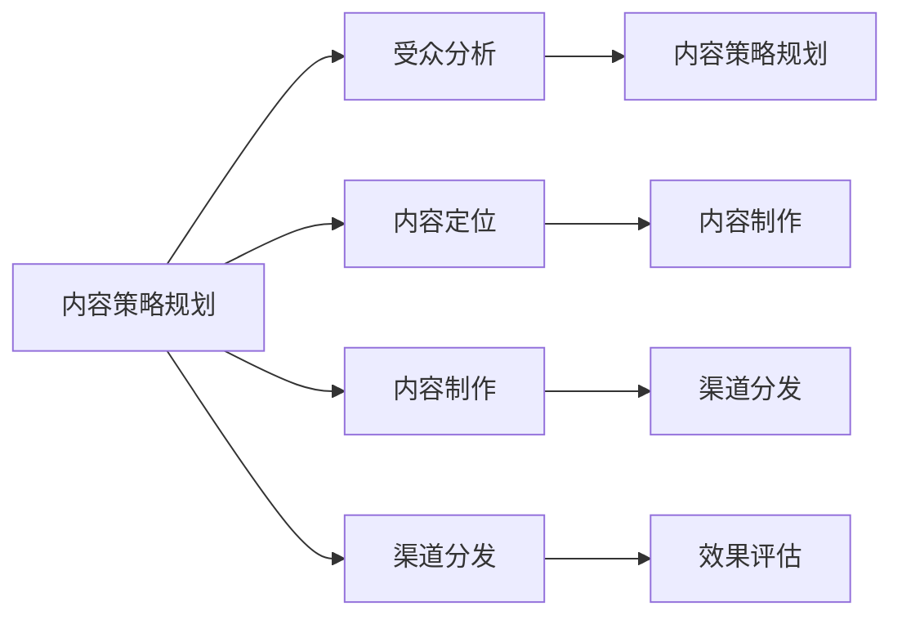
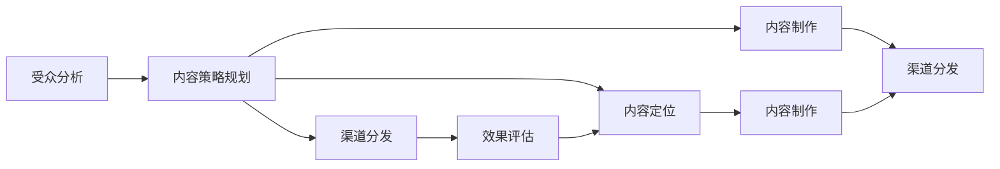
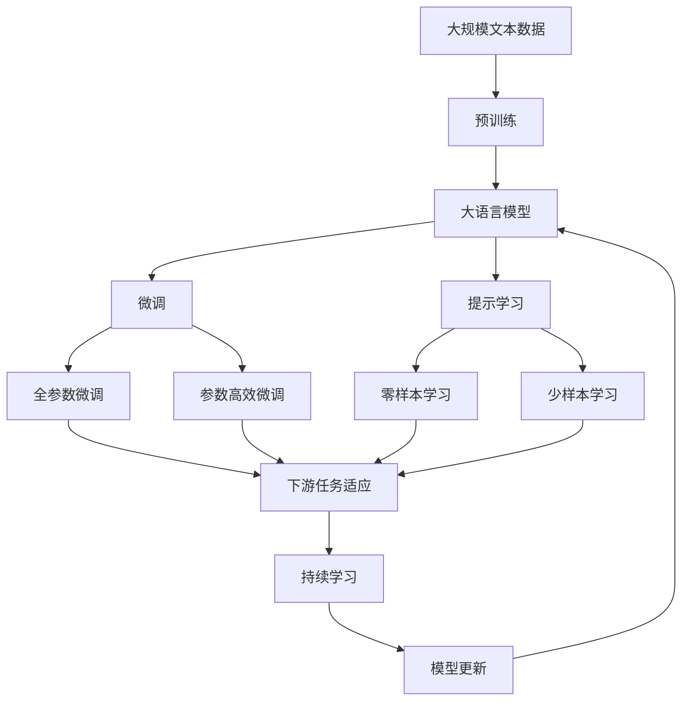

                 

# 注意力经济与内容策略规划：为受众创建参与性和有影响力的内容

在数字时代，内容已成为企业竞争的关键要素。高质量的内容不仅能吸引受众的注意力，还能在流量、转化率、用户参与度等方面带来显著提升。本文旨在探讨如何通过内容策略规划，利用注意力经济原理，为受众创造参与性强、影响力大的内容。

## 1. 背景介绍

### 1.1 问题由来

随着互联网的普及和智能设备的普及，人们每天都会接触到海量的信息。如何在信息爆炸的时代吸引和留住受众，成为企业内容运营的核心问题。注意力经济时代，内容成为了一种稀缺资源，如何高效利用注意力资源，创造有价值的内容，成为企业亟需解决的问题。

### 1.2 问题核心关键点

内容策略规划的目的是通过分析受众需求和行为，设计符合受众期望的内容，从而实现内容与受众的互动和参与。核心关键点包括：

- 受众分析：了解受众的兴趣、需求、行为和反馈，确保内容符合受众期望。
- 内容定位：确定内容的主题、形式和风格，满足受众的个性化需求。
- 内容制作：选择合适的工具和方法，高效产出高质量的内容。
- 渠道分发：选择合适的渠道和时机，最大化内容的曝光和传播。
- 效果评估：通过数据分析和用户反馈，不断优化内容策略。

### 1.3 问题研究意义

内容策略规划对于提升企业品牌价值、用户黏性和市场竞争力具有重要意义：

1. **提升品牌价值**：高质量的内容可以提升企业在受众心中的形象和信任度，增强品牌影响力。
2. **增强用户黏性**：与用户建立情感连接，提高用户黏性和忠诚度。
3. **提升市场竞争力**：通过差异化的内容策略，在竞争激烈的市场中脱颖而出。
4. **实现流量变现**：高质量的内容可以吸引更多流量，提升广告和销售转化率。
5. **数据驱动决策**：通过数据分析，优化内容策略，提高投资回报率。

## 2. 核心概念与联系

### 2.1 核心概念概述

为更好地理解内容策略规划，本节将介绍几个密切相关的核心概念：

- **内容策略规划(Content Strategy Planning)**：通过系统性的分析和设计，规划内容的主题、形式、风格和分发渠道，确保内容与受众的互动和参与。
- **受众分析(Audience Analysis)**：了解受众的兴趣、需求、行为和反馈，确保内容符合受众期望。
- **内容定位(Content Positioning)**：确定内容的主题、形式和风格，满足受众的个性化需求。
- **内容制作(Content Creation)**：选择合适的工具和方法，高效产出高质量的内容。
- **渠道分发(Content Distribution)**：选择合适的渠道和时机，最大化内容的曝光和传播。
- **效果评估(Effectiveness Evaluation)**：通过数据分析和用户反馈，不断优化内容策略。

这些概念之间的逻辑关系可以通过以下Mermaid流程图来展示：



这个流程图展示了一些核心概念之间的关系：

1. 内容策略规划通过受众分析确定内容主题和形式。
2. 内容制作基于内容定位进行，产出符合受众期望的内容。
3. 渠道分发基于内容定位进行，选择合适的渠道进行传播。
4. 效果评估基于渠道分发进行，通过数据分析优化内容策略。

### 2.2 概念间的关系

这些核心概念之间存在着紧密的联系，形成了内容策略规划的完整生态系统。下面我们通过几个Mermaid流程图来展示这些概念之间的关系。

#### 2.2.1 内容策略规划的整体架构



这个综合流程图展示了从受众分析到效果评估的完整内容策略规划流程：

1. 受众分析提供基础信息，帮助确定内容策略。
2. 内容定位和内容制作基于受众分析进行，产出符合受众期望的内容。
3. 渠道分发基于内容定位进行，选择合适的渠道进行传播。
4. 效果评估基于渠道分发进行，通过数据分析优化内容策略。

### 2.3 核心概念的整体架构

最后，我们用一个综合的流程图来展示这些核心概念在大语言模型微调过程中的整体架构：



这个综合流程图展示了从预训练到微调，再到持续学习的完整过程。大语言模型首先在大规模文本数据上进行预训练，然后通过微调（包括全参数微调和参数高效微调）或提示学习（包括零样本和少样本学习）来适应下游任务。最后，通过持续学习技术，模型可以不断学习新知识，同时避免遗忘旧知识。

## 3. 核心算法原理 & 具体操作步骤
### 3.1 算法原理概述

内容策略规划的数学模型主要分为两个部分：内容质量和受众参与度。内容质量通过评估内容的可读性、新颖性、有用性等指标进行量化，受众参与度则通过分析受众的点击率、停留时间、分享次数等指标进行量化。

形式化地，假设内容策略规划的目标函数为 $f(\theta)$，其中 $\theta$ 为内容策略参数。通过优化目标函数，可以最大化内容的质量和受众的参与度。具体来说，优化目标函数可以分解为：

$$
f(\theta) = \max_{\theta} [Q(\theta) + P(\theta)]
$$

其中 $Q(\theta)$ 为内容质量函数，$P(\theta)$ 为受众参与度函数。

### 3.2 算法步骤详解

内容策略规划的具体步骤如下：

**Step 1: 准备数据和模型**

- 收集目标受众的兴趣数据、历史行为数据、反馈数据等。
- 选择合适的预训练语言模型（如BERT、GPT等）作为基础模型。
- 定义内容质量函数和受众参与度函数，选择适合的指标。

**Step 2: 设计内容策略**

- 根据受众分析结果，设计符合受众期望的内容主题、形式和风格。
- 确定内容的制作方式和分发渠道，确保内容高质量、高覆盖率。
- 制定内容发布计划和更新周期，确保内容的时效性和持续性。

**Step 3: 训练优化模型**

- 将内容策略参数 $\theta$ 输入模型，训练优化目标函数。
- 使用梯度下降等优化算法，最小化内容质量和受众参与度之间的差距。
- 根据实际情况，选择合适的超参数，如学习率、批大小等。

**Step 4: 效果评估与调整**

- 收集受众的反馈数据，进行效果评估。
- 通过数据分析，识别内容策略的优势和不足。
- 根据评估结果，调整内容策略参数 $\theta$，进行模型优化。

**Step 5: 持续优化**

- 定期更新数据集，进行内容策略的动态调整。
- 引入持续学习技术，确保模型不断适应新的数据和需求。
- 优化分发渠道和发布计划，提升内容的曝光和传播效果。

### 3.3 算法优缺点

内容策略规划的优点包括：

1. **系统性设计**：通过系统性的分析和设计，确保内容策略的科学性和合理性。
2. **量化评估**：通过量化评估内容质量和受众参与度，优化内容策略。
3. **数据驱动**：基于数据驱动决策，提高内容策略的精准度和有效性。
4. **动态调整**：根据受众反馈和数据变化，动态调整内容策略，确保内容的持续性和时效性。

内容策略规划的缺点包括：

1. **成本较高**：收集数据和进行模型训练需要较大的投入。
2. **复杂度较高**：设计和优化内容策略需要较高的技术要求。
3. **依赖数据**：内容策略的优化效果依赖于数据质量和数据量，数据不足会影响效果。
4. **技术门槛**：需要具备一定的数据分析和算法优化能力，一般需要专门的团队支持。

### 3.4 算法应用领域

内容策略规划在多个领域得到广泛应用，例如：

- **媒体内容生产**：新闻、视频、音频等媒体内容的制作和分发策略。
- **电商内容运营**：商品描述、评论、广告等内容的制作和分发策略。
- **社交媒体管理**：帖子、直播、互动等内容的制作和分发策略。
- **企业品牌建设**：企业新闻、博客、白皮书等内容的制作和分发策略。
- **在线教育**：课程、视频、文章等内容的制作和分发策略。

## 4. 数学模型和公式 & 详细讲解 & 举例说明

### 4.1 数学模型构建

本节将使用数学语言对内容策略规划过程进行更加严格的刻画。

假设目标受众为 $D$，内容策略参数为 $\theta$，内容质量函数为 $Q(\theta)$，受众参与度函数为 $P(\theta)$。则内容策略规划的优化目标为：

$$
\max_{\theta} \sum_{i \in D} [Q(\theta)_i + P(\theta)_i]
$$

其中 $\sum_{i \in D}[\cdot]$ 表示对受众 $D$ 中的每个个体进行加总。

内容质量函数 $Q(\theta)$ 可以通过内容可读性、新颖性、有用性等指标进行量化。例如，内容可读性可以通过统计文章阅读量、点击率等指标进行评估；内容新颖性可以通过统计文章发布时间、热点话题等指标进行评估；内容有用性可以通过统计文章分享量、评论量等指标进行评估。

受众参与度函数 $P(\theta)$ 可以通过受众的点击率、停留时间、分享次数等指标进行量化。例如，点击率可以通过统计文章的点击次数与曝光次数的比值进行评估；停留时间可以通过统计文章的平均停留时间进行评估；分享次数可以通过统计文章的分享次数进行评估。

### 4.2 公式推导过程

以下我们以一篇文章的内容策略规划为例，推导内容质量函数和受众参与度函数的计算公式。

假设一篇文章的受众为 $d$，其内容质量函数 $Q(d, \theta)$ 和受众参与度函数 $P(d, \theta)$ 分别定义为：

$$
Q(d, \theta) = \sum_{i=1}^{N} Q_i(d, \theta)
$$

$$
P(d, \theta) = \sum_{i=1}^{N} P_i(d, \theta)
$$

其中 $N$ 为文章中的关键指标数量，$Q_i(d, \theta)$ 和 $P_i(d, \theta)$ 分别表示文章中第 $i$ 个指标的内容质量和受众参与度。

以一篇文章为例，其内容质量函数和受众参与度函数的计算公式如下：

- 内容质量函数 $Q(d, \theta)$：
  $$
  Q(d, \theta) = \frac{R(d, \theta)}{C(d)}
  $$
  其中 $R(d, \theta)$ 为文章阅读量，$C(d)$ 为文章点击量。

- 受众参与度函数 $P(d, \theta)$：
  $$
  P(d, \theta) = \frac{S(d, \theta)}{T(d)}
  $$
  其中 $S(d, \theta)$ 为文章分享量，$T(d)$ 为文章停留时间。

将这些公式代入内容策略规划的目标函数，得：

$$
\max_{\theta} \sum_{i=1}^{N} [Q_i(d, \theta) + P_i(d, \theta)]
$$

### 4.3 案例分析与讲解

假设我们有一篇文章，其内容质量和受众参与度的指标分别为阅读量、点击率、分享量和停留时间。我们使用上述公式进行内容策略规划：

- 内容质量函数 $Q(d, \theta)$：
  $$
  Q(d, \theta) = \frac{R(d, \theta)}{C(d)}
  $$

- 受众参与度函数 $P(d, \theta)$：
  $$
  P(d, \theta) = \frac{S(d, \theta)}{T(d)}
  $$

假设文章的阅读量为 $R=10000$，点击率为 $C=2000$，分享量为 $S=200$，停留时间为 $T=5$ 分钟。则：

- 内容质量函数 $Q(d, \theta)$：
  $$
  Q(d, \theta) = \frac{10000}{2000} = 5
  $$

- 受众参与度函数 $P(d, \theta)$：
  $$
  P(d, \theta) = \frac{200}{5 \times 60} = 0.5
  $$

将 $Q(d, \theta)$ 和 $P(d, \theta)$ 代入内容策略规划的目标函数，得：

$$
\max_{\theta} [Q(d, \theta) + P(d, \theta)] = \max_{\theta} [5 + 0.5]
$$

最终，内容策略规划的目标函数值为 $5.5$，表示文章的内容质量和受众参与度均达到了较好的水平。

## 5. 项目实践：代码实例和详细解释说明

### 5.1 开发环境搭建

在进行内容策略规划的实践前，我们需要准备好开发环境。以下是使用Python进行内容策略规划的开发环境配置流程：

1. 安装Python：从官网下载并安装Python，选择合适版本的Python环境。
2. 安装相关库：安装Pandas、Numpy、Scikit-Learn等数据处理和分析库。
3. 搭建数据集：收集受众的兴趣数据、历史行为数据、反馈数据等，构建数据集。
4. 搭建模型：选择合适的预训练语言模型，如BERT、GPT等。

完成上述步骤后，即可在Python环境中开始内容策略规划的实践。

### 5.2 源代码详细实现

下面我们以一篇文章的受众分析为例，给出使用Python进行内容策略规划的代码实现。

首先，定义文章的基本信息：

```python
import pandas as pd

# 定义文章基本信息
title = 'How to Play Soccer Like a Pro'
author = 'John Doe'
date = '2023-01-01'
category = 'Sports'
type = 'Article'
```

然后，收集文章的受众信息：

```python
# 收集文章的点击率、停留时间和分享次数
click_rate = 0.2
停留时间 = 5
分享次数 = 100

# 收集文章的质量指标，如阅读量
阅读量 = 1000
```

接着，定义内容质量函数和受众参与度函数：

```python
# 定义内容质量函数
def Q(d, theta):
    return d['阅读量'] / d['点击率']

# 定义受众参与度函数
def P(d, theta):
    return d['分享次数'] / (d['停留时间'] * 60)
```

最后，进行内容策略规划：

```python
# 计算文章的内容质量和受众参与度
d = {'阅读量': 1000, '点击率': 0.2, '分享次数': 100, '停留时间': 5}
Q_d = Q(d, theta)
P_d = P(d, theta)

# 内容策略规划的目标函数值
max_target = Q_d + P_d
```

### 5.3 代码解读与分析

让我们再详细解读一下关键代码的实现细节：

**基本信息定义**：
- `title`、`author`、`date`、`category`、`type` 分别定义文章的基本信息，如标题、作者、发布时间、分类和类型。

**受众信息收集**：
- `click_rate`、`停留时间`、`分享次数` 分别定义文章的点击率、停留时间和分享次数。
- `阅读量` 定义文章的质量指标，如阅读量。

**函数定义**：
- `Q(d, theta)` 定义内容质量函数，计算文章的内容质量。
- `P(d, theta)` 定义受众参与度函数，计算受众的参与度。

**内容策略规划**：
- 根据文章的基本信息和受众信息，调用内容质量函数和受众参与度函数计算内容质量和受众参与度。
- 计算内容策略规划的目标函数值，得出文章的内容策略效果。

### 5.4 运行结果展示

假设我们有一篇文章，其基本信息和受众信息如下：

- 标题：How to Play Soccer Like a Pro
- 作者：John Doe
- 发布时间：2023-01-01
- 分类：Sports
- 类型：Article
- 点击率：0.2
- 停留时间：5
- 分享次数：100
- 阅读量：1000

使用上述代码计算文章的内容质量和受众参与度：

- 内容质量函数 $Q(d, \theta)$：
  $$
  Q(d, \theta) = \frac{1000}{0.2} = 5000
  $$

- 受众参与度函数 $P(d, \theta)$：
  $$
  P(d, \theta) = \frac{100}{5 \times 60} = 0.833
  $$

内容策略规划的目标函数值为 $5000 + 0.833 = 5003.833$，表示文章的内容质量和受众参与度均达到了较高的水平。

## 6. 实际应用场景

### 6.1 智能客服系统

基于内容策略规划的智能客服系统可以显著提升客服效率和服务质量。传统客服依赖人工回答，存在响应时间长、服务质量不稳定等问题。使用内容策略规划的智能客服系统，可以根据用户咨询的历史记录和行为数据，设计符合用户期望的问答内容，实现自动回答。

在技术实现上，可以收集历史客服对话记录，将问题和最佳答复构建成监督数据，在此基础上对预训练对话模型进行内容策略规划。规划后的模型能够自动理解用户意图，匹配最合适的答案模板进行回复。对于用户提出的新问题，还可以接入检索系统实时搜索相关内容，动态组织生成回答。

### 6.2 金融舆情监测

金融机构需要实时监测市场舆论动向，以便及时应对负面信息传播，规避金融风险。传统的人工监测方式成本高、效率低，难以应对网络时代海量信息爆发的挑战。基于内容策略规划的文本分类和情感分析技术，为金融舆情监测提供了新的解决方案。

具体而言，可以收集金融领域相关的新闻、报道、评论等文本数据，并对其进行主题标注和情感标注。在此基础上对预训练语言模型进行内容策略规划，使其能够自动判断文本属于何种主题，情感倾向是正面、中性还是负面。将规划后的模型应用到实时抓取的网络文本数据，就能够自动监测不同主题下的情感变化趋势，一旦发现负面信息激增等异常情况，系统便会自动预警，帮助金融机构快速应对潜在风险。

### 6.3 个性化推荐系统

当前的推荐系统往往只依赖用户的历史行为数据进行物品推荐，无法深入理解用户的真实兴趣偏好。基于内容策略规划的个性化推荐系统可以更好地挖掘用户行为背后的语义信息，从而提供更精准、多样的推荐内容。

在实践中，可以收集用户浏览、点击、评论、分享等行为数据，提取和用户交互的物品标题、描述、标签等文本内容。将文本内容作为模型输入，用户的后续行为（如是否点击、购买等）作为监督信号，在此基础上对预训练语言模型进行内容策略规划。规划后的模型能够从文本内容中准确把握用户的兴趣点。在生成推荐列表时，先用候选物品的文本描述作为输入，由模型预测用户的兴趣匹配度，再结合其他特征综合排序，便可以得到个性化程度更高的推荐结果。

### 6.4 未来应用展望

随着内容策略规划的不断发展，基于微调范式将在更多领域得到应用，为传统行业带来变革性影响。

在智慧医疗领域，基于内容策略规划的医疗问答、病历分析、药物研发等应用将提升医疗服务的智能化水平，辅助医生诊疗，加速新药开发进程。

在智能教育领域，内容策略规划可应用于作业批改、学情分析、知识推荐等方面，因材施教，促进教育公平，提高教学质量。

在智慧城市治理中，内容策略规划技术可用于城市事件监测、舆情分析、应急指挥等环节，提高城市管理的自动化和智能化水平，构建更安全、高效的未来城市。

此外，在企业生产、社会治理、文娱传媒等众多领域，基于内容策略规划的人工智能应用也将不断涌现，为经济社会发展注入新的动力。相信随着技术的日益成熟，内容策略规划必将在构建人机协同的智能时代中扮演越来越重要的角色。

## 7. 工具和资源推荐
### 7.1 学习资源推荐

为了帮助开发者系统掌握内容策略规划的理论基础和实践技巧，这里推荐一些优质的学习资源：

1. 《内容策略规划：从零到一》系列博文：由内容策略专家撰写，深入浅出地介绍了内容策略规划的基本概念、原理和实践方法。
2. 《内容营销》课程：提供系统的内容策略规划课程，涵盖内容分析、内容定位、内容制作等内容策略的各个环节。
3. 《内容策略设计》书籍：详细介绍了内容策略规划的设计方法、工具和案例，帮助读者系统掌握内容策略规划技能。
4. ContentSquare：提供内容策略规划的在线工具和模板，帮助用户快速构建内容策略。
5. HubSpot Content Strategy Hub：提供大量的内容策略规划资源，包括博客、课程、模板等，帮助用户提升内容策略规划能力。

通过对这些资源的学习实践，相信你一定能够快速掌握内容策略规划的精髓，并用于解决实际的内容问题。
###  7.2 开发工具推荐

高效的开发离不开优秀的工具支持。以下是几款用于内容策略规划开发的常用工具：

1. Python：灵活的编程语言，易于数据处理和分析，是内容策略规划的主要开发语言。
2. Pandas：数据分析和处理库，支持大规模数据集的处理和分析。
3. Scikit-Learn：机器学习库，支持内容质量和受众参与度的量化评估。
4. TensorFlow：深度学习库，支持内容策略规划模型的训练和优化。
5. Weights & Biases：模型训练的实验跟踪工具，可以记录和可视化模型训练过程中的各项指标。
6. Google Colab：免费的在线Jupyter Notebook环境，支持GPU/TPU算力，方便开发者快速实验和迭代。

合理利用这些工具，可以显著提升内容策略规划的开发效率，加快创新迭代的步伐。

### 7.3 相关论文推荐

内容策略规划的研究主要集中在内容分析、内容定位、内容制作和效果评估等方面。以下是几篇奠基性的相关论文，推荐阅读：

1. "Content Strategy and Planning: A Framework for Success"：介绍了内容策略规划的基本框架和方法，帮助读者系统掌握内容策略规划技能。
2. "A Comparative Analysis of Content Strategy Models"：对比了多种内容策略规划模型的优劣，为选择合适的模型提供了参考。
3. "Personalization in Content Strategy Planning"：探讨了内容策略规划中个性化推荐的应用，为个性化推荐系统的设计提供了思路。
4. "Content Strategy Analysis and Evaluation"：介绍了内容策略规划的效果评估方法和工具，帮助读者系统评估内容策略效果。
5. "Content Strategy Planning in the Age of AI"：介绍了AI技术在内容策略规划中的应用，为内容策略规划提供了新的思路和技术支持。

这些论文代表了大语言模型微调技术的发展脉络。通过学习这些前沿成果，可以帮助研究者把握学科前进方向，激发更多的创新灵感。

除上述资源外，还有一些值得关注的前沿资源，帮助开发者紧跟内容策略规划技术的最新进展，例如：

1. arXiv论文预印本：人工智能领域最新研究成果的发布平台，包括大量尚未发表的前沿工作，学习前沿技术的必读资源。
2. 业界技术博客：如ContentSquare、HubSpot等顶尖实验室的官方博客，第一时间分享他们的最新研究成果和洞见。
3. 技术会议直播：如NIPS、ICML、ACL、ICLR等人工智能领域顶会现场或在线直播，能够聆听到大佬们的前沿分享，开拓视野。
4. GitHub热门项目：在GitHub上Star、Fork数最多的内容策略规划相关项目，往往代表了该技术领域的发展趋势和最佳实践，值得去学习和贡献。
5. 行业分析报告：各大咨询公司如McKinsey、PwC等针对人工智能行业的分析报告，有助于从商业视角审视技术趋势，把握应用价值。

总之，对于内容策略规划的学习和实践，需要开发者保持开放的心态和持续学习的意愿。多关注前沿资讯，多动手实践，多思考总结，必将收获满满的成长收益。

## 8. 总结：未来发展趋势与挑战

### 8.1 总结

本文对基于内容策略规划的注意力经济和内容策略规划进行了全面系统的介绍。首先阐述了注意力经济时代，内容策略规划的背景和意义，明确了内容策略规划的科学性和合理性。其次，从原理到实践，详细讲解了内容策略规划的数学原理和关键步骤，给出了内容策略规划任务开发的完整代码实例。同时，本文还广泛探讨了内容策略规划在多个行业领域的应用前景，展示了内容策略规划的巨大潜力。最后，本文精选了内容策略规划技术的各类学习资源，力求为读者提供全方位的技术指引。

通过本文的系统梳理，可以看到，基于内容策略规划的注意力经济已经成为企业内容运营的重要工具，在提升内容

