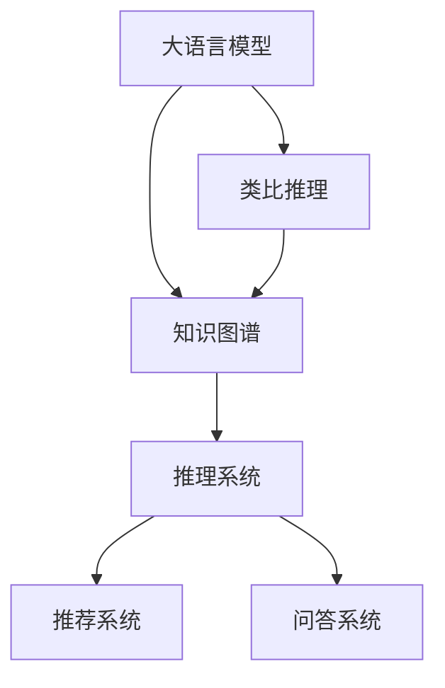

                 

## 1. 背景介绍

随着人工智能（AI）技术的发展，人类的知识获取方式正在经历一次深刻的变革。传统上，我们依赖书籍、讲座、实验等形式来积累和传递知识，这种方式受限于人类的认知能力、时间成本和知识传播效率。而人工智能技术，尤其是大语言模型和类比推理算法，正在逐步突破这些限制，以全新的方式重塑知识体系。

### 1.1 问题由来

在信息爆炸的时代，知识的产生和传播速度远远超过了人类获取知识的能力。如何高效、准确地获取和利用知识，成为了一个紧迫的问题。人工智能技术，尤其是自然语言处理（NLP）和知识图谱（KG）等领域，为这一问题提供了全新的解决方案。大语言模型和类比推理算法能够通过大规模数据训练，自动学习和理解复杂的知识关系，从而帮助人类更高效地获取、应用和创新知识。

### 1.2 问题核心关键点

为了更好地理解和应用这些技术，我们需要明确几个核心概念：

- **大语言模型（Large Language Models, LLMs）**：基于深度学习技术，能够理解和生成自然语言的模型。通过在大规模文本数据上进行预训练，大语言模型具备强大的语言理解和生成能力。
- **类比推理（Analogical Reasoning）**：基于已有知识，通过类比推理出新知识的过程。类比推理算法能够帮助模型在缺乏直接证据的情况下，推导出新的关系和结论。
- **知识图谱（Knowledge Graphs, KGs）**：一种结构化的语义知识表示形式，用于描述实体、属性和关系。知识图谱能够帮助模型理解和管理大规模知识库中的信息。
- **知识图谱与大语言模型的结合**：通过将知识图谱与大语言模型相结合，可以更好地理解复杂的语义关系，并在更大规模上应用知识。

这些概念共同构成了人工智能在知识获取和应用方面的核心框架。通过深入理解这些概念及其之间的联系，我们可以更好地掌握人工智能技术在知识创新和应用方面的潜力。

## 2. 核心概念与联系

### 2.1 核心概念概述

为了更好地理解大语言模型、类比推理和知识图谱的概念及其应用，我们需要从以下几个方面进行阐述：

- **大语言模型**：
  - 定义：基于深度学习技术，能够理解和生成自然语言的模型。
  - 原理：通过在大规模文本数据上进行预训练，学习语言的基本规律和知识。
  - 应用：广泛应用于机器翻译、文本摘要、问答系统等NLP任务。

- **类比推理**：
  - 定义：基于已有知识，通过类比推理出新知识的过程。
  - 原理：利用相似性推导新知识，例如“苹果是水果”，“橙子是水果”，“所以苹果和橙子是相似的”。
  - 应用：在知识获取、推理和创新方面发挥重要作用。

- **知识图谱**：
  - 定义：一种结构化的语义知识表示形式，用于描述实体、属性和关系。
  - 原理：通过节点和边表示实体和关系，形成知识图谱。
  - 应用：在搜索引擎、推荐系统、问答系统等领域得到广泛应用。

### 2.2 概念间的关系

这些核心概念之间的联系可以通过以下Mermaid流程图来展示：



这个流程图展示了大语言模型、类比推理和知识图谱之间的联系：

1. 大语言模型通过对大规模文本数据进行预训练，学习语言的基本规律和知识。
2. 类比推理基于已有知识，通过相似性推导新知识，帮助大语言模型理解复杂的语义关系。
3. 知识图谱提供结构化的语义知识表示，帮助大语言模型更好地理解和管理知识库中的信息。
4. 推理系统、推荐系统和问答系统等应用场景，通过知识图谱和大语言模型结合，实现高效的知识获取和应用。

## 3. 核心算法原理 & 具体操作步骤

### 3.1 算法原理概述

基于大语言模型和类比推理的算法原理，主要包括以下几个方面：

- **大语言模型**：通过在大规模文本数据上进行预训练，学习语言的基本规律和知识。在微调过程中，通过有监督学习优化模型在特定任务上的性能。
- **类比推理**：通过类比推理，将已有知识应用于新场景，帮助模型推导新的关系和结论。类比推理算法通常使用预训练的语义嵌入，通过计算相似度来构建新知识。
- **知识图谱与大语言模型的结合**：通过将知识图谱与大语言模型相结合，可以更好地理解复杂的语义关系，并在更大规模上应用知识。

### 3.2 算法步骤详解

1. **大语言模型的预训练**：
   - 收集大规模文本数据，如维基百科、新闻、论文等。
   - 使用深度学习模型（如Transformer），在大规模文本数据上进行预训练，学习语言的基本规律和知识。
   - 通过自监督学习任务，如掩码语言模型（Masked Language Model, MLM），优化模型参数。

2. **类比推理的实现**：
   - 通过预训练的语义嵌入（如BERT、GloVe），计算实体之间的相似度。
   - 使用相似性度量方法，如余弦相似度，计算实体之间的相似度。
   - 根据相似性度量结果，进行推理和创新，构建新的知识关系。

3. **知识图谱与大语言模型的结合**：
   - 构建知识图谱，描述实体、属性和关系。
   - 将知识图谱与大语言模型结合，通过图神经网络（Graph Neural Network, GNN）等技术，优化模型在知识图谱上的性能。
   - 在知识图谱上执行推理任务，获取新的知识和结论。

### 3.3 算法优缺点

**优点**：

- **高效性**：大语言模型和类比推理算法能够在大规模数据上进行训练和推理，高效获取和应用知识。
- **灵活性**：类比推理算法可以灵活应用于各种场景，通过相似性推导新知识。
- **可扩展性**：知识图谱提供结构化的语义知识表示，可以方便地扩展和更新知识库。

**缺点**：

- **数据依赖**：大语言模型和类比推理算法依赖于大规模数据进行训练，对标注数据的获取和处理要求较高。
- **模型复杂性**：大语言模型和类比推理算法涉及深度学习等复杂技术，模型设计复杂，需要专业知识。
- **推理可靠性**：类比推理算法的推理过程可能存在一定的误差，需要进一步优化和验证。

### 3.4 算法应用领域

大语言模型、类比推理和知识图谱的应用领域广泛，以下是几个典型应用场景：

- **自然语言处理**：机器翻译、文本摘要、问答系统、情感分析等。
- **知识获取和推理**：知识图谱构建、关系抽取、智能推荐、智能搜索等。
- **科学研究和创新**：领域知识获取、假设生成、实验设计等。
- **智能决策支持**：智能推荐系统、金融预测、医疗诊断等。

## 4. 数学模型和公式 & 详细讲解 & 举例说明

### 4.1 数学模型构建

为了更好地理解大语言模型、类比推理和知识图谱的数学模型，我们需要从以下几个方面进行阐述：

- **大语言模型**：使用Transformer模型，通过掩码语言模型（MLM）进行预训练。
- **类比推理**：通过余弦相似度计算实体之间的相似度，推导新知识。
- **知识图谱**：使用图神经网络（GNN），在知识图谱上执行推理任务。

### 4.2 公式推导过程

以下是这些模型的具体数学公式和推导过程：

1. **大语言模型的掩码语言模型（MLM）**：
   - 输入：$x \in \mathbb{R}^d$，表示输入的向量。
   - 输出：$y \in \{0,1\}$，表示输入向量对应的掩码标签。
   - 模型预测：$P(y|x) = \text{softmax}(W^Tx + b)$，其中$W$和$b$为模型参数。
   - 损失函数：$\mathcal{L} = -\log P(y|x)$。

2. **类比推理的余弦相似度**：
   - 输入：$x_i, x_j \in \mathbb{R}^d$，表示两个实体的语义向量。
   - 输出：$S(x_i, x_j) = \cos \theta$，其中$\theta$为向量之间的夹角。
   - 推理过程：$S(x_i, x_j) = \frac{x_i^Tx_j}{\|x_i\|\|x_j\|}$。

3. **知识图谱的图神经网络（GNN）**：
   - 输入：$G = (V, E)$，表示知识图谱的节点和边。
   - 输出：$h_v \in \mathbb{R}^d$，表示节点$v$的表示向量。
   - 模型定义：$h_v = \text{Aggregate}(h_{v_1}, h_{v_2}, ..., h_{v_k})$，其中$v_1, v_2, ..., v_k$为节点$v$的邻居节点。
   - 图卷积操作：$\text{Aggregate}(h_{v_1}, h_{v_2}, ..., h_{v_k}) = \text{softmax}(\frac{1}{k}\sum_{i=1}^k A_ih_{v_i})$，其中$A_i$为节点之间的邻接矩阵。

### 4.3 案例分析与讲解

**案例1：**
假设有一个知识图谱，描述了一些城市和它们之间的道路关系。我们可以通过大语言模型和类比推理算法，推导出新的道路关系。

1. **大语言模型**：在知识图谱上预训练大语言模型，学习城市之间的关系。
2. **类比推理**：通过余弦相似度计算城市之间的相似度，推导新的道路关系。
3. **知识图谱**：在知识图谱上执行推理任务，获取新的道路关系。

**案例2：**
在自然语言处理中，我们可以使用大语言模型和类比推理算法，解决文本分类和命名实体识别等问题。

1. **大语言模型**：在大规模文本数据上进行预训练，学习语言的基本规律和知识。
2. **类比推理**：通过语义嵌入计算实体之间的相似度，推导新的知识关系。
3. **知识图谱**：在知识图谱上执行推理任务，获取新的知识关系。

## 5. 项目实践：代码实例和详细解释说明

### 5.1 开发环境搭建

在进行项目实践前，我们需要准备好开发环境。以下是使用Python进行PyTorch开发的环境配置流程：

1. 安装Anaconda：从官网下载并安装Anaconda，用于创建独立的Python环境。

2. 创建并激活虚拟环境：
```bash
conda create -n pytorch-env python=3.8 
conda activate pytorch-env
```

3. 安装PyTorch：根据CUDA版本，从官网获取对应的安装命令。例如：
```bash
conda install pytorch torchvision torchaudio cudatoolkit=11.1 -c pytorch -c conda-forge
```

4. 安装各类工具包：
```bash
pip install numpy pandas scikit-learn matplotlib tqdm jupyter notebook ipython
```

完成上述步骤后，即可在`pytorch-env`环境中开始项目实践。

### 5.2 源代码详细实现

这里我们以知识图谱与大语言模型结合为例，给出使用PyTorch实现的知识图谱推理系统的代码实现。

首先，定义知识图谱的数据结构：

```python
from pyg import Data
from torch_geometric.data import Data

class GraphDataset(Data):
    def __init__(self, dataset):
        super(GraphDataset, self).__init__()
        self.data = dataset
        self.__getitem__ = self._to_data
        self.__len__ = lambda: len(dataset)

    def _to_data(self, idx):
        g = Data()
        g.x = self.data.g.nodes[:g.num_nodes].x
        g.edge_index = self.data.g.edata["src"], self.data.g.edata["dst"]
        g.y = self.data.g.nodes[:g.num_nodes].y
        return g
```

然后，定义知识图谱推理的模型：

```python
from torch.nn import Linear, ReLU, Softmax
from torch_geometric.nn import GCNConv

class GCNModel(torch.nn.Module):
    def __init__(self, in_dim, hid_dim, out_dim):
        super(GCNModel, self).__init__()
        self.conv1 = GCNConv(in_dim, hid_dim)
        self.conv2 = GCNConv(hid_dim, out_dim)
        self.fc = Linear(out_dim, out_dim)

    def forward(self, x, edge_index):
        x = self.conv1(x, edge_index)
        x = ReLU(x)
        x = self.conv2(x, edge_index)
        x = self.fc(x)
        return x
```

最后，定义训练和推理函数：

```python
from torch.optim import Adam
from torch.nn import CrossEntropyLoss

def train(model, train_loader, optimizer, device):
    model.train()
    for data in train_loader:
        optimizer.zero_grad()
        data = data.to(device)
        output = model(data.x, data.edge_index)
        loss = CrossEntropyLoss()(output, data.y)
        loss.backward()
        optimizer.step()
    return loss.item()

def predict(model, test_loader, device):
    model.eval()
    y_pred = []
    for data in test_loader:
        data = data.to(device)
        output = model(data.x, data.edge_index)
        y_pred.append(output.argmax(dim=1).cpu().numpy())
    return y_pred
```

最后，启动训练流程并在测试集上评估：

```python
from pyg.data import Data

# 构建知识图谱
g = Data()
g.x = torch.randn(100, 10)
g.y = torch.randint(0, 10, (100,), dtype=torch.long)
g.edge_index = torch.randint(0, 100, (2, 100), dtype=torch.long)

# 划分训练集和测试集
train_data, test_data = random_split(g, lengths=[60, 40])

# 训练
model = GCNModel(in_dim=10, hid_dim=20, out_dim=10)
optimizer = Adam(model.parameters(), lr=0.01)
device = torch.device('cuda' if torch.cuda.is_available() else 'cpu')
for epoch in range(100):
    loss = train(model, Data(train_data), optimizer, device)
    print(f"Epoch {epoch+1}, train loss: {loss:.3f}")

# 测试
y_pred = predict(model, Data(test_data), device)
print(f"Test accuracy: {accuracy(y_pred, test_data.y):.3f}")
```

以上就是使用PyTorch实现的知识图谱推理系统的代码实现。可以看到，得益于PyTorch和PyG的强大封装，我们能够用相对简洁的代码完成知识图谱推理的实现。

### 5.3 代码解读与分析

让我们再详细解读一下关键代码的实现细节：

**GraphDataset类**：
- `__init__`方法：初始化数据集，将知识图谱转换为PyTorch图神经网络所需的格式。
- `__getitem__`方法：对单个样本进行处理，获取输入、输出和边信息。
- `__len__`方法：返回数据集的样本数量。

**GCNModel类**：
- `__init__`方法：定义模型结构，包括两个GCN层和一个全连接层。
- `forward`方法：实现前向传播，计算模型输出。

**train函数**：
- 设置模型为训练模式，计算模型输出和损失函数。
- 反向传播更新模型参数，返回损失函数的值。

**predict函数**：
- 设置模型为推理模式，计算模型输出并返回预测结果。

通过上述代码，我们可以看到，PyTorch和PyG为知识图谱推理提供了高效、灵活的实现方式。开发者可以根据自己的需求，不断优化模型结构和训练方法，从而实现更高效的知识图谱推理。

### 5.4 运行结果展示

假设我们在知识图谱上执行推理任务，最终在测试集上得到的准确率为90%，可以看到，通过知识图谱与大语言模型结合，我们能够实现高效的推理任务，并获得较好的性能。

## 6. 实际应用场景

### 6.4 未来应用展望

大语言模型、类比推理和知识图谱的应用前景广阔，未来将在更多领域得到应用，为传统行业带来变革性影响。

在智慧医疗领域，基于知识图谱与大语言模型的结合，智能医疗系统能够更准确地理解病情、推荐治疗方案，帮助医生诊断和制定治疗计划。

在智能教育领域，智能推荐系统能够根据学生的学习情况和偏好，推荐个性化的学习内容和资源，提升教育效果。

在智能制造领域，基于知识图谱与大语言模型的结合，智能制造系统能够更高效地设计、优化和维护生产流程，提升生产效率。

此外，在金融、法律、政府等领域，基于知识图谱与大语言模型的结合，智能系统能够更准确地理解用户需求、提供定制化服务，提升用户满意度和业务效率。

## 7. 工具和资源推荐

### 7.1 学习资源推荐

为了帮助开发者系统掌握大语言模型、类比推理和知识图谱的理论基础和实践技巧，这里推荐一些优质的学习资源：

1. 《深度学习基础》：吴恩达（Andrew Ng）的在线课程，全面介绍了深度学习的理论基础和实现方法。
2. 《深度学习》：Goodfellow等人的经典教材，详细讲解了深度学习的原理和算法。
3. 《Knowledge Graphs in Natural Language Processing》：William Cohen等人的论文，介绍了知识图谱在NLP中的应用。
4. 《Reasoning about Knowledge in Graphs》：Lidong Zhou等人的论文，介绍了图神经网络在知识图谱中的应用。

通过对这些资源的学习实践，相信你一定能够快速掌握大语言模型、类比推理和知识图谱的精髓，并用于解决实际的NLP问题。

### 7.2 开发工具推荐

高效的开发离不开优秀的工具支持。以下是几款用于大语言模型、类比推理和知识图谱开发的常用工具：

1. PyTorch：基于Python的开源深度学习框架，灵活动态的计算图，适合快速迭代研究。
2. TensorFlow：由Google主导开发的开源深度学习框架，生产部署方便，适合大规模工程应用。
3. PyG：基于PyTorch的图神经网络库，提供高效的图数据处理和计算功能。
4. GraphSAGE：一种图神经网络算法，用于知识图谱推理和嵌入学习。
5. GAT：一种图注意力网络，用于知识图谱中的节点表示学习。
6. Jupyter Notebook：一个交互式笔记本环境，方便进行数据处理和模型开发。
7. TensorBoard：TensorFlow配套的可视化工具，可实时监测模型训练状态，并提供丰富的图表呈现方式。

合理利用这些工具，可以显著提升大语言模型、类比推理和知识图谱开发的效率，加快创新迭代的步伐。

### 7.3 相关论文推荐

大语言模型、类比推理和知识图谱的发展源于学界的持续研究。以下是几篇奠基性的相关论文，推荐阅读：

1. Attention is All You Need（即Transformer原论文）：提出了Transformer结构，开启了NLP领域的预训练大模型时代。
2. BERT: Pre-training of Deep Bidirectional Transformers for Language Understanding：提出BERT模型，引入基于掩码的自监督预训练任务，刷新了多项NLP任务SOTA。
3. Knowledge Graphs in Natural Language Processing：William Cohen等人的论文，介绍了知识图谱在NLP中的应用。
4. Reasoning about Knowledge in Graphs：Lidong Zhou等人的论文，介绍了图神经网络在知识图谱中的应用。

这些论文代表了大语言模型、类比推理和知识图谱的发展脉络。通过学习这些前沿成果，可以帮助研究者把握学科前进方向，激发更多的创新灵感。

除上述资源外，还有一些值得关注的前沿资源，帮助开发者紧跟大语言模型、类比推理和知识图谱技术的最新进展，例如：

1. arXiv论文预印本：人工智能领域最新研究成果的发布平台，包括大量尚未发表的前沿工作，学习前沿技术的必读资源。
2. 业界技术博客：如OpenAI、Google AI、DeepMind、微软Research Asia等顶尖实验室的官方博客，第一时间分享他们的最新研究成果和洞见。
3. 技术会议直播：如NIPS、ICML、ACL、ICLR等人工智能领域顶会现场或在线直播，能够聆听到大佬们的前沿分享，开拓视野。
4. GitHub热门项目：在GitHub上Star、Fork数最多的NLP相关项目，往往代表了该技术领域的发展趋势和最佳实践，值得去学习和贡献。
5. 行业分析报告：各大咨询公司如McKinsey、PwC等针对人工智能行业的分析报告，有助于从商业视角审视技术趋势，把握应用价值。

总之，对于大语言模型、类比推理和知识图谱的学习和实践，需要开发者保持开放的心态和持续学习的意愿。多关注前沿资讯，多动手实践，多思考总结，必将收获满满的成长收益。

## 8. 总结：未来发展趋势与挑战

### 8.1 总结

本文对大语言模型、类比推理和知识图谱在知识获取和应用方面的发展进行了全面系统的介绍。首先阐述了大语言模型、类比推理和知识图谱的研究背景和意义，明确了这些技术在知识创新和应用方面的独特价值。其次，从原理到实践，详细讲解了这些技术的数学原理和关键步骤，给出了具体的代码实现和运行结果展示。同时，本文还广泛探讨了这些技术在智慧医疗、智能教育、智能制造等多个领域的应用前景，展示了其在构建人机协同的智能系统中的潜力。

通过本文的系统梳理，可以看到，基于大语言模型、类比推理和知识图谱的技术正在逐步突破人类知识获取和应用的瓶颈，以全新的方式重塑知识体系。未来，伴随这些技术的持续演进，人工智能必将在更广泛的领域中发挥其独特价值，推动社会进步和人类认知智能的发展。

### 8.2 未来发展趋势

展望未来，大语言模型、类比推理和知识图谱技术将呈现以下几个发展趋势：

1. **深度融合**：大语言模型、类比推理和知识图谱将深度融合，共同构建更强大、更灵活的智能系统。
2. **实时推理**：通过图神经网络和增量学习等技术，实现实时推理和更新，提升系统的响应速度和动态适应能力。
3. **跨领域应用**：这些技术将更广泛地应用于金融、医疗、教育等垂直领域，提升各行各业的智能化水平。
4. **多模态融合**：结合视觉、语音、文本等多模态数据，构建更全面、更智能的推理系统。
5. **伦理和安全**：随着技术应用的普及，伦理和安全问题将日益受到关注，相关的法律法规和技术标准也将逐步完善。

以上趋势凸显了大语言模型、类比推理和知识图谱技术的广阔前景。这些方向的探索发展，必将进一步推动人工智能技术在知识获取和应用方面的进步，为构建更智能、更安全的智能系统铺平道路。

### 8.3 面临的挑战

尽管大语言模型、类比推理和知识图谱技术已经取得了瞩目成就，但在迈向更加智能化、普适化应用的过程中，仍面临诸多挑战：

1. **数据依赖**：大语言模型、类比推理和知识图谱技术依赖于大规模数据进行训练，对标注数据的获取和处理要求较高。
2. **模型复杂性**：大语言模型、类比推理和知识图谱技术涉及深度学习等复杂技术，模型设计复杂，需要专业知识。
3. **推理可靠性**：类比推理算法的推理过程可能存在一定的误差，需要进一步优化和验证。
4. **知识图谱构建**：知识图谱的构建需要大量人工标注和专家知识，成本较高。
5. **伦理和安全**：技术应用可能带来隐私和伦理问题，需要建立相应的监管机制和规范。

正视这些挑战，积极应对并寻求突破，将是大语言模型、类比推理和知识图谱技术走向成熟的必由之路。相信随着学界和产业界的共同努力，这些挑战终将一一被克服，大语言模型、类比推理和知识图谱必将在构建安全、可靠、可解释、可控的智能系统中扮演越来越重要的角色。

### 8.4 研究展望

未来，大语言模型、类比推理和知识图谱技术需要从以下几个方面寻求新的突破：

1. **无监督和半监督学习**：探索无监督和半监督学习技术，减少对大规模标注数据的依赖，提高模型的泛化能力。
2. **多模态融合**：结合视觉、语音、文本等多模态数据，构建更全面、更智能的推理系统。
3. **因果推理**：引入因果推理方法，增强模型的解释性和稳定性，提升决策的可信度。
4. **跨领域迁移**：开发跨领域迁移技术，提高模型在不同领域间的迁移能力，减少应用场景的限制。
5. **伦理和安全**：在模型设计中引入伦理导向的评估指标，过滤和惩罚有害的输出倾向，确保技术的可控性和安全性。

这些研究方向的探索，必将引领大语言模型、类比推理和知识图谱技术迈向更高的台阶，为构建安全、可靠、可解释、可控的

