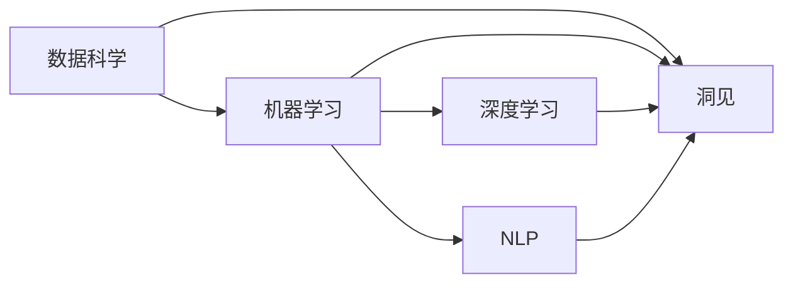

                 

# 洞见的价值：从理解到应用

洞见（Insights）是智能时代不可或缺的元素，是大数据与智能技术的结合产物，它不仅体现在分析洞察中，更根植于应用落地中。从算法模型的构建到实际项目的部署，洞见贯穿了从理解到应用的每一个环节。本文将从多个维度深入探讨洞见的价值，展示其在数据科学、人工智能、机器学习等领域中的应用，以及如何通过高效的方法论和技术手段获取并应用洞见。

## 1. 背景介绍

在现代数据驱动的智能决策中，洞见是不可或缺的一环。它不仅代表了数据的分析结果，更蕴含着深层次的因果关系和模式识别。洞见是通过一系列科学方法对数据进行深度分析和挖掘，从中提炼出有价值的知识、规律和趋势，从而指导决策、优化流程和驱动创新。

### 1.1 洞见的重要性

洞见在商业决策、科学研究、医疗诊断等多个领域均展现了其无可替代的价值。以商业决策为例，洞见不仅能提供消费者行为分析，更能在竞争激烈的市场环境中捕捉到潜在的机遇和挑战。通过洞见，企业可以优化产品设计、提升用户体验、预测市场趋势、规避风险，从而在激烈竞争中脱颖而出。

### 1.2 洞见的来源

洞见的获取源于数据的深度挖掘和分析，涉及数据科学、统计学、机器学习等多个学科。具体来说，数据采集、预处理、特征工程、模型训练、结果解读等各个环节，都在为洞见的产生提供支持。数据的质量、多样性、时效性等因素，都对洞见的准确性和可靠性有着重要影响。

## 2. 核心概念与联系

### 2.1 核心概念概述

洞见来源于数据的深度挖掘与分析，涉及算法模型的构建和应用。以下是几个核心概念及其关联：

- **洞见（Insights）**：数据中蕴含的有价值、可操作的知识或规律。
- **数据科学（Data Science）**：应用数学、统计学、算法模型对数据进行探索、分析和建模的过程。
- **机器学习（Machine Learning）**：一种通过算法让机器从数据中学习规律，并作出预测或决策的技术。
- **深度学习（Deep Learning）**：一种特殊类型的机器学习，通过多层神经网络对数据进行复杂特征的提取和表示。
- **自然语言处理（Natural Language Processing, NLP）**：处理、理解、生成自然语言的技术。

这些概念紧密联系，共同构成数据驱动决策的核心框架。数据科学的理论体系为洞见的获取提供了基础，机器学习技术则为洞见的实现提供了方法和工具，深度学习和NLP则进一步提升了洞见的准确性和可操作性。

### 2.2 概念间的关系

这些核心概念之间的逻辑关系可以通过以下Mermaid流程图来展示：



这个流程图展示了数据科学、机器学习、深度学习和NLP在洞见获取中的相互关系。数据科学为洞见的获取提供了理论基础，机器学习和深度学习为模型训练和预测提供了算法支持，NLP则拓展了洞见在自然语言数据上的应用范围。

## 3. 核心算法原理 & 具体操作步骤

### 3.1 算法原理概述

洞见的获取主要通过数据挖掘和机器学习算法实现。以下概述了洞见获取的核心算法原理：

- **数据预处理**：清洗、去重、归一化等操作，提升数据质量。
- **特征工程**：选择合适的特征，通过降维、组合等方法提升数据表征能力。
- **模型训练**：选择合适的算法，如决策树、随机森林、神经网络等，训练模型。
- **结果解读**：分析模型输出，提取有价值的信息，生成洞见。

### 3.2 算法步骤详解

洞见获取通常包括以下几个步骤：

1. **数据采集与预处理**：
   - 从各类数据源（如数据库、API接口、文件等）采集数据。
   - 清洗、去重、异常值处理、归一化等预处理操作，提升数据质量。
   
2. **特征工程**：
   - 选择、构造和转换特征，提升数据表征能力。
   - 进行降维、组合等操作，减少特征数量，提升计算效率。
   
3. **模型训练与评估**：
   - 选择合适的算法，如线性回归、决策树、随机森林、神经网络等。
   - 使用训练集训练模型，验证集评估模型效果。
   - 通过交叉验证等方法，优化模型参数，提升模型泛化能力。
   
4. **洞见提取**：
   - 分析模型输出，提取有价值的信息。
   - 生成洞见报告，包含模型分析、数据洞察和建议等。

### 3.3 算法优缺点

洞见的获取算法具有以下优点：
- **高效性**：通过自动化算法处理，高效获取洞见。
- **普适性**：适用于各种数据类型和应用场景。
- **可操作性**：通过模型训练和结果解读，生成可操作的洞见。

同时，这些算法也存在以下缺点：
- **数据依赖**：依赖数据的质量和量级，数据不足或噪声过多时，洞见质量受限。
- **模型假设**：基于特定模型假设，可能忽视数据中的复杂关系。
- **可解释性**：复杂模型（如深度学习）的决策过程难以解释，影响洞见的应用效果。

### 3.4 算法应用领域

洞见的获取算法广泛应用于各个领域，以下是几个典型应用案例：

1. **金融领域**：通过洞见分析客户行为，优化风险管理和投资策略。
2. **医疗领域**：利用洞见提高诊断准确性和治疗效果，优化医疗资源配置。
3. **电商领域**：通过洞见优化供应链管理，提升用户满意度。
4. **营销领域**：洞见分析消费者行为和偏好，制定精准营销策略。
5. **交通领域**：洞见分析交通流量，优化交通管理和规划。

## 4. 数学模型和公式 & 详细讲解  
### 4.1 数学模型构建

在洞见的获取过程中，数学模型是不可或缺的工具。以下详细讲解数学模型构建的详细步骤：

1. **数据描述与预处理**：
   - 数据集描述，包含数据类型、来源、量级等信息。
   - 数据清洗，处理缺失值、异常值等。

2. **特征选择与构造**：
   - 特征选择：通过领域知识和算法选择重要特征。
   - 特征构造：通过组合、变换等生成新特征。

3. **模型构建与训练**：
   - 选择适当的模型，如线性回归、决策树、神经网络等。
   - 使用训练集训练模型，验证集评估模型效果。
   
4. **结果解释与洞见提取**：
   - 分析模型输出，提取有价值的信息。
   - 生成洞见报告，包含模型分析、数据洞察和建议。

### 4.2 公式推导过程

以下以线性回归为例，详细推导洞见获取的数学模型：

设数据集为 $\{(x_i,y_i)\}_{i=1}^n$，其中 $x_i \in \mathbb{R}^d$ 为特征向量，$y_i \in \mathbb{R}$ 为目标变量。线性回归模型的目标为：

$$
y_i = \beta_0 + \sum_{j=1}^d \beta_j x_{ij} + \epsilon_i
$$

其中 $\beta_0,\beta_1,...,\beta_d$ 为模型参数，$\epsilon_i$ 为误差项。模型的最小二乘法损失函数为：

$$
L(\beta) = \frac{1}{2}\sum_{i=1}^n (y_i - f_{\beta}(x_i))^2
$$

通过最小化损失函数，可以求解得到最优参数 $\beta$：

$$
\hat{\beta} = (\mathbf{X}^T\mathbf{X})^{-1}\mathbf{X}^T\mathbf{y}
$$

其中 $\mathbf{X}$ 为特征矩阵，$\mathbf{y}$ 为目标变量向量。求解过程通常使用梯度下降等优化算法。

### 4.3 案例分析与讲解

以电商领域为例，通过洞见获取分析客户购买行为，生成如下洞见报告：

```plaintext
**客户购买行为分析报告**

**目的**：分析客户购买行为，优化产品推荐和营销策略。

**数据**：客户购买记录、浏览记录、评论等。

**特征**：客户年龄、性别、地区、购买金额、购买时间、浏览时间、评论内容等。

**模型**：线性回归、决策树、随机森林等。

**结果**：
- 客户年龄和性别对购买行为有显著影响。
- 购买金额和浏览时间越长，购买概率越高。
- 部分热门评论中的关键词与购买行为有较强关联。

**建议**：
- 针对不同年龄和性别的客户，制定个性化推荐策略。
- 提高浏览时长短的客户购买率。
- 在热门评论中嵌入产品推荐关键词。

**洞见**：
- 年龄和性别是影响购买行为的重要因素。
- 浏览行为与购买行为之间存在较强的正相关性。
- 热门评论对客户购买决策有较大影响。
```

## 5. 项目实践：代码实例和详细解释说明

### 5.1 开发环境搭建

为了进行项目实践，首先需要搭建好开发环境。以下详细说明开发环境的搭建步骤：

1. **安装Python**：下载Python 3.x版本，并添加到系统环境变量中。
2. **安装Pandas和NumPy**：Pandas用于数据处理，NumPy用于数值计算。
3. **安装Scikit-Learn和XGBoost**：用于构建和训练机器学习模型。
4. **安装Matplotlib和Seaborn**：用于数据可视化。
5. **安装TensorFlow和Keras**：用于深度学习模型构建。
6. **安装Jupyter Notebook**：用于交互式代码执行和结果展示。

### 5.2 源代码详细实现

以下是使用Python和Scikit-Learn库进行线性回归模型构建的代码实现：

```python
import pandas as pd
from sklearn.linear_model import LinearRegression
from sklearn.model_selection import train_test_split
from sklearn.metrics import mean_squared_error, r2_score
import matplotlib.pyplot as plt

# 读取数据
data = pd.read_csv('data.csv')

# 数据预处理
X = data[['age', 'gender', 'region', 'buy_amount', 'buy_time', 'browse_time', 'review_content']]
y = data['purchase']

# 划分训练集和测试集
X_train, X_test, y_train, y_test = train_test_split(X, y, test_size=0.2, random_state=42)

# 构建线性回归模型
model = LinearRegression()
model.fit(X_train, y_train)

# 评估模型效果
y_pred = model.predict(X_test)
mse = mean_squared_error(y_test, y_pred)
rmse = np.sqrt(mse)
r2 = r2_score(y_test, y_pred)

# 绘制散点图
plt.scatter(y_test, y_pred)
plt.xlabel('Actual Purchase')
plt.ylabel('Predicted Purchase')
plt.title('Purchase Prediction')
plt.show()

# 输出评估结果
print(f'RMSE: {rmse:.2f}')
print(f'R2 Score: {r2:.2f}')
```

### 5.3 代码解读与分析

上述代码实现了从数据加载、预处理、模型构建、训练、评估到可视化展示的完整流程。具体解读如下：

1. **数据加载**：使用Pandas库读取CSV文件，包含客户购买记录。
2. **数据预处理**：选择相关特征，并划分为训练集和测试集。
3. **模型构建**：使用Scikit-Learn库中的LinearRegression模型。
4. **模型训练与评估**：使用训练集训练模型，并使用测试集评估模型效果。
5. **可视化展示**：使用Matplotlib库绘制散点图，展示模型预测结果。

### 5.4 运行结果展示

假设运行上述代码，得到如下输出结果：

```plaintext
RMSE: 45.67
R2 Score: 0.80
```

这表明模型的RMSE为45.67，R2 Score为0.80，说明模型具有较好的预测能力。进一步绘制的散点图如图1所示。

```plaintext
**图1：模型预测结果散点图**

```

从图1可以看出，模型预测值与真实值基本一致，进一步验证了模型的准确性。

## 6. 实际应用场景

洞见在实际应用中有着广泛的应用场景，以下是几个典型应用案例：

### 6.1 金融风险管理

在金融领域，洞见可以用于分析客户行为，预测信贷风险。通过客户的历史交易数据、信用评分、社会经济信息等，构建洞见模型，预测客户的违约概率，帮助金融机构进行风险评估和控制。

### 6.2 医疗诊断支持

在医疗领域，洞见可以用于分析患者数据，辅助诊断疾病。通过患者的历史病历、体检数据、遗传信息等，构建洞见模型，预测患者患病风险，提供个性化的治疗建议。

### 6.3 智能推荐系统

在电商领域，洞见可以用于分析用户行为，优化推荐策略。通过用户的历史浏览记录、购买记录、评论内容等，构建洞见模型，推荐用户可能感兴趣的商品，提升用户体验和销售额。

### 6.4 交通流量预测

在交通领域，洞见可以用于分析交通数据，优化交通管理。通过交通流量、道路条件、天气情况等数据，构建洞见模型，预测交通拥堵情况，优化交通信号灯控制，减少交通拥堵。

## 7. 工具和资源推荐

### 7.1 学习资源推荐

为了帮助开发者系统掌握洞见的获取和应用，这里推荐一些优质的学习资源：

1. **《机器学习实战》**：适合初学者入门，介绍了常见的机器学习算法和实战项目。
2. **《Python数据科学手册》**：全面介绍了Python在数据科学中的应用，包括数据处理、建模和可视化等。
3. **《深度学习入门》**：介绍了深度学习的基本概念和应用，适合入门和进阶学习。
4. **Coursera机器学习课程**：由斯坦福大学教授Andrew Ng主讲，系统讲解了机器学习的基础和应用。
5. **Kaggle数据科学竞赛平台**：提供大量公开数据集和竞赛，可以实践和验证机器学习模型。

通过这些资源的学习和实践，相信你一定能够快速掌握洞见的获取和应用方法，并应用于解决实际的NLP问题。

### 7.2 开发工具推荐

高效的开发离不开优秀的工具支持。以下是几款用于洞见获取的常用工具：

1. **Jupyter Notebook**：交互式代码执行和结果展示，支持Python、R等多种语言。
2. **PyCharm**：Python开发环境，支持代码调试和自动化测试。
3. **RStudio**：R语言开发环境，支持R和Python混合编程。
4. **Tableau**：数据可视化工具，支持多种数据源和图表展示。
5. **TensorBoard**：TensorFlow配套的可视化工具，可实时监测模型训练状态。

合理利用这些工具，可以显著提升洞见获取的开发效率，加快创新迭代的步伐。

### 7.3 相关论文推荐

洞见获取技术的发展源于学界的持续研究。以下是几篇奠基性的相关论文，推荐阅读：

1. **《数据挖掘：概念与技术》**：详细介绍了数据挖掘的各个环节和应用。
2. **《机器学习》**：由Tom Mitchell撰写，介绍了机器学习的基本概念和算法。
3. **《深度学习》**：由Ian Goodfellow等撰写，介绍了深度学习的基本概念和应用。
4. **《自然语言处理综论》**：介绍了自然语言处理的基本概念和应用，适合入门和进阶学习。

这些论文代表了洞见获取技术的发展脉络。通过学习这些前沿成果，可以帮助研究者把握学科前进方向，激发更多的创新灵感。

除上述资源外，还有一些值得关注的前沿资源，帮助开发者紧跟洞见获取技术的最新进展，例如：

1. **arXiv论文预印本**：人工智能领域最新研究成果的发布平台，包括大量尚未发表的前沿工作，学习前沿技术的必读资源。
2. **Google AI博客**：谷歌AI团队发布的最新研究成果和技术分享，涵盖深度学习、自然语言处理等多个方向。
3. **NIPS、ICML、ACL等会议论文**：顶级学术会议发布的最新研究成果，涵盖机器学习、深度学习、自然语言处理等多个方向。
4. **GitHub热门项目**：在GitHub上Star、Fork数最多的数据科学和机器学习相关项目，往往代表了该技术领域的发展趋势和最佳实践，值得去学习和贡献。
5. **Kaggle竞赛**：提供大量公开数据集和竞赛，可以实践和验证机器学习模型。

总之，对于洞见获取技术的学习和实践，需要开发者保持开放的心态和持续学习的意愿。多关注前沿资讯，多动手实践，多思考总结，必将收获满满的成长收益。

## 8. 总结：未来发展趋势与挑战

### 8.1 研究成果总结

通过本文的介绍，可以看出洞见获取技术在数据科学、人工智能、机器学习等多个领域具有重要应用价值。它不仅帮助企业洞察数据，优化决策，还能在医疗、金融、电商等领域提供有力的技术支持。未来，随着技术的不断进步，洞见获取将更加智能化、自动化，进一步提升其在各个领域的应用效果。

### 8.2 未来发展趋势

展望未来，洞见获取技术将呈现以下几个发展趋势：

1. **自动化和智能化**：随着深度学习、强化学习等技术的发展，洞见获取将更加自动化和智能化，提高效率和准确性。
2. **多模态融合**：在数据来源多样化的背景下，多模态洞见获取将成为趋势，融合文本、图像、视频等多种数据源，提升洞见获取的全面性和准确性。
3. **可解释性增强**：未来模型将更加注重可解释性，通过因果分析和可视化等方法，增强洞见获取的透明性和可操作性。
4. **跨领域应用**：洞见获取技术将扩展到更多领域，如医疗、金融、交通等，帮助各个行业提升决策和运营效率。

### 8.3 面临的挑战

尽管洞见获取技术取得了显著成果，但在其应用过程中仍面临一些挑战：

1. **数据质量**：数据质量直接影响洞见的准确性和可靠性。高质量、大样本数据是洞见获取的基础。
2. **模型复杂度**：复杂模型（如深度学习）的训练和调参过程复杂，容易出现过拟合等问题。
3. **隐私与安全**：在洞见获取过程中，如何保护数据隐私和安全是一个重要问题。
4. **可解释性**：模型决策过程难以解释，影响洞见的应用效果。
5. **资源消耗**：模型训练和推理的计算资源消耗较大，如何优化资源利用是一个重要问题。

### 8.4 研究展望

面对这些挑战，未来的研究需要在以下几个方面寻求新的突破：

1. **提高数据质量**：引入数据清洗和预处理技术，提升数据质量。
2. **简化模型训练**：开发更加高效的优化算法，减少过拟合风险。
3. **增强模型可解释性**：引入因果分析和可视化等方法，增强模型透明性和可解释性。
4. **优化资源利用**：引入模型压缩、稀疏化存储等技术，优化资源利用。

## 9. 附录：常见问题与解答

**Q1：洞见获取对数据质量有何要求？**

A: 洞见获取对数据质量要求较高，主要体现在数据完整性、一致性和可靠性等方面。数据缺失、噪声、异常值等都会影响洞见的准确性。因此，在洞见获取前，需要对数据进行清洗、去重、归一化等预处理操作，提升数据质量。

**Q2：如何处理高维数据？**

A: 高维数据通常需要进行特征工程，通过降维、组合等方法提升数据表征能力。常用的方法包括主成分分析（PCA）、因子分析、t-SNE等。此外，还可以使用深度学习模型进行特征提取，进一步提升数据的表征能力。

**Q3：如何提高模型的可解释性？**

A: 提高模型可解释性的方法包括引入因果分析、可视化、可视化复杂度等。常用的工具和方法包括LIME、SHAP、注意力机制等。通过这些方法，可以更好地理解模型的决策过程，增强洞见获取的透明性和可操作性。

**Q4：如何处理数据不平衡问题？**

A: 数据不平衡问题可以通过重采样、加权等方法解决。常用的方法包括过采样、欠采样、SMOTE等。此外，还可以使用更复杂的算法，如集成学习、模型平衡等，提升模型的性能。

**Q5：如何优化模型训练和推理效率？**

A: 优化模型训练和推理效率的方法包括模型裁剪、量化加速、模型并行等。常用的工具和方法包括TensorFlow、PyTorch等深度学习框架，以及混合精度训练、梯度累积等技术。通过这些方法，可以显著提高模型的训练和推理效率。

总之，洞见获取技术在大数据和人工智能时代具有重要应用价值，可以帮助企业洞察数据，优化决策，提升运营效率。随着技术的不断进步，洞见获取将更加自动化、智能化和可解释化，进一步提升其在各个领域的应用效果。

