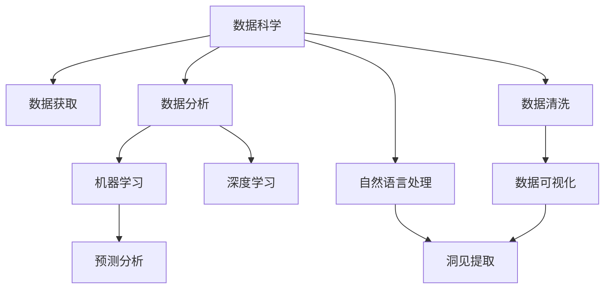
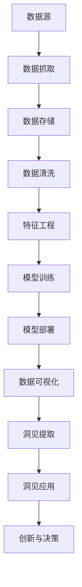

                 

# 洞见的力量：从反思到创新

> 关键词：洞见,反思,创新,人工智能,技术洞见,行业洞察,持续改进

## 1. 背景介绍

### 1.1 问题由来
在快速发展的信息技术时代，企业及个人面临着前所未有的机遇与挑战。企业的战略制定、产品迭代、市场预测，以及个人的发展规划、职业选择、知识积累，均需要基于真实、全面的洞见。然而，如何在海量数据中提取和甄别有价值的洞见，成为了一个亟需解决的问题。

洞见（Insight）是一种通过分析、观察和理解数据，发现和提取关键信息的高级认知过程。洞见可以指导决策、预测趋势、揭示模式，甚至产生创新。因此，获取和利用洞见，已成为现代社会中提升竞争力和决策效率的关键。

### 1.2 问题核心关键点
洞见的力量源自于对数据、信息、趋势的深刻理解。在大数据和人工智能的推动下，如何高效、准确地获取洞见，已成为技术研究与应用的重要课题。

**核心问题：**
1. **数据获取与处理**：如何从多种数据源（如社交媒体、企业内外部系统、市场报告等）高效、全面地获取数据。
2. **数据清洗与准备**：如何处理缺失值、异常值、重复数据，以及数据归一化、特征工程等问题。
3. **数据分析与挖掘**：如何运用统计分析、机器学习、深度学习等技术，从数据中提取有价值的洞见。
4. **洞见可视化**：如何将复杂的数据洞见以图表、仪表盘等形式可视化，帮助决策者快速理解信息。
5. **洞见应用与创新**：如何将洞见应用于产品开发、市场策略、运营管理等方面，实现业务创新和提升。

## 2. 核心概念与联系

### 2.1 核心概念概述

为更好地理解洞见的力量及其在技术领域的应用，本节将介绍几个密切相关的核心概念：

- **数据科学**：通过系统化的方法，从数据中提取洞见，支持决策和预测。
- **机器学习**：一种让机器能够通过数据分析和模式识别，自动改进算法，从而做出预测和决策的技术。
- **深度学习**：一种特殊的机器学习算法，通过多层次神经网络模型，自动学习数据的抽象表示，实现复杂模式的识别与分类。
- **自然语言处理（NLP）**：涉及计算机理解和生成自然语言的技术，可用于文本分析、情感分析等。
- **预测分析**：使用历史数据来预测未来事件，包括时间序列预测、分类预测等。
- **数据可视化**：将复杂的数据集转换为易于理解的图形或表格，帮助用户快速获取洞见。

这些概念共同构成了洞见提取和应用的技术框架，为技术洞见提供了理论和实践基础。

### 2.2 概念间的关系

这些核心概念之间的逻辑关系可以通过以下Mermaid流程图来展示：



这个流程图展示了大数据和人工智能技术在洞见提取和应用中的主要流程：

1. 通过数据获取获取多源数据。
2. 对数据进行清洗和准备，以便于后续分析。
3. 运用机器学习和深度学习等技术对数据进行分析和挖掘，提取洞见。
4. 将洞见通过预测分析和自然语言处理等技术进行进一步的验证和细化。
5. 最后，通过数据可视化将洞见以直观的形式展示给用户，帮助其理解和应用。

### 2.3 核心概念的整体架构

最后，我们用一个综合的流程图来展示这些核心概念在大数据和人工智能领域中的整体架构：



这个综合流程图展示了从数据源到洞见应用的全过程：

1. 通过数据抓取和存储，获取并保存数据。
2. 对数据进行清洗和特征工程处理，为模型训练做准备。
3. 通过模型训练，获取模型参数。
4. 将模型部署到生产环境中，实时获取数据。
5. 利用数据可视化技术，展示和分析洞见。
6. 通过洞见提取，转化为可操作的决策和创新。
7. 最终，通过创新与决策实现业务价值提升。

## 3. 核心算法原理 & 具体操作步骤
### 3.1 算法原理概述

技术洞见的获取和应用，本质上是数据分析和机器学习的过程。其核心算法原理主要包括以下几个步骤：

1. **数据预处理**：清洗和准备数据，以便于后续分析。
2. **特征提取**：从原始数据中提取有意义的特征。
3. **模型训练**：选择并训练合适的模型，从数据中提取洞见。
4. **模型评估**：评估模型性能，确保其准确性和可靠性。
5. **洞见可视化**：将洞见转化为可视化的形式，帮助理解。
6. **洞见应用**：将洞见应用于实际业务中，实现创新和决策。

### 3.2 算法步骤详解

#### 3.2.1 数据预处理

数据预处理是洞见提取的第一步，其目的是清洗和准备数据，以便于后续分析。主要步骤包括：

1. **数据清洗**：处理缺失值、异常值、重复数据，以及数据归一化、特征编码等问题。
2. **特征选择**：选择与洞见相关的特征，去除无关或冗余特征。
3. **数据集划分**：将数据集划分为训练集、验证集和测试集。

#### 3.2.2 特征提取

特征提取是从原始数据中提取有意义的特征，以便于模型能够识别和分类。主要方法包括：

1. **统计特征**：计算均值、方差、标准差等统计量，用于描述数据的分布特征。
2. **文本特征**：提取文本的关键词、主题、情感等特征，用于文本分析和分类。
3. **时序特征**：分析时间序列数据，提取周期性、趋势性特征，用于时间序列预测。
4. **图像特征**：提取图像的纹理、形状、颜色等特征，用于图像分类和识别。

#### 3.2.3 模型训练

模型训练是通过训练数据集，让机器学习模型从数据中提取洞见。主要方法包括：

1. **监督学习**：使用带有标签的数据集，训练分类或回归模型。
2. **无监督学习**：使用未标记的数据集，训练聚类或降维模型。
3. **强化学习**：通过试错过程，让机器学习最优策略。
4. **深度学习**：使用多层次神经网络模型，自动学习数据的抽象表示，实现复杂模式的识别与分类。

#### 3.2.4 模型评估

模型评估是通过评估指标，验证模型的准确性和可靠性。主要方法包括：

1. **准确率**：衡量模型预测的正确率。
2. **召回率**：衡量模型预测的覆盖率。
3. **F1分数**：综合准确率和召回率，评估模型性能。
4. **ROC曲线**：评估模型的分类性能。

#### 3.2.5 洞见可视化

洞见可视化是将复杂的数据洞见以图表、仪表盘等形式展示，帮助用户快速理解信息。主要工具包括：

1. **Matplotlib**：Python的绘图库，支持创建各种静态图表。
2. **Seaborn**：基于Matplotlib的高级绘图库，支持创建更美观的图表。
3. **Tableau**：商业智能工具，支持创建交互式仪表盘。
4. **Power BI**：微软的商业智能工具，支持创建交互式仪表盘和报表。

#### 3.2.6 洞见应用

洞见应用是将洞见转化为可操作的决策和创新。主要方法包括：

1. **产品开发**：基于洞见改进产品功能或设计，提升用户体验。
2. **市场策略**：基于洞见调整市场策略，提升销售和市场份额。
3. **运营管理**：基于洞见优化运营流程，提升效率和成本控制。
4. **客户服务**：基于洞见提供个性化服务，提升客户满意度。

### 3.3 算法优缺点

#### 3.3.1 优点

1. **高效性**：通过机器学习和深度学习算法，可以高效地从数据中提取洞见。
2. **全面性**：可以处理各种类型的数据，包括结构化数据、半结构化数据、非结构化数据等。
3. **可解释性**：通过可视化技术，洞见可以以直观的形式展示，易于理解。
4. **可操作性**：洞见可以应用于实际业务中，实现创新和决策。

#### 3.3.2 缺点

1. **数据依赖性**：洞见的质量高度依赖于数据的质量和多样性。
2. **模型复杂性**：深度学习模型复杂，训练和调试需要大量时间和资源。
3. **结果解释**：复杂的模型可能难以解释其内部工作机制，用户难以理解。
4. **隐私问题**：处理敏感数据时，需要关注隐私保护和数据安全。

### 3.4 算法应用领域

技术洞见在多个领域中得到了广泛应用，包括但不限于：

1. **金融行业**：通过分析市场数据，预测股票走势、评估信用风险、优化投资策略等。
2. **零售行业**：通过分析消费者行为数据，优化库存管理、提升顾客满意度、增强营销效果等。
3. **医疗行业**：通过分析病历数据，预测疾病风险、提升诊断准确率、优化治疗方案等。
4. **制造业**：通过分析生产数据，优化生产流程、提升产品质量、减少资源浪费等。
5. **交通运输**：通过分析交通数据，优化交通流量、提升交通安全、减少拥堵等。

## 4. 数学模型和公式 & 详细讲解  
### 4.1 数学模型构建

本节将使用数学语言对洞见提取和应用的过程进行更加严格的刻画。

记数据集为 $D=\{(x_i,y_i)\}_{i=1}^N$，其中 $x_i$ 为特征向量，$y_i$ 为标签。假设选择线性回归模型 $y=\theta^Tx+b$ 进行预测，其中 $\theta$ 为模型参数，$b$ 为截距。

定义损失函数 $L(\theta)=\frac{1}{N}\sum_{i=1}^N(y_i-\theta^Tx_i-b)^2$，其中 $(x_i,y_i)$ 为训练样本，$b$ 为截距。

通过梯度下降算法最小化损失函数，求得模型参数 $\theta$，即：

$$
\theta^* = \mathop{\arg\min}_{\theta} L(\theta)
$$

### 4.2 公式推导过程

通过梯度下降算法，求得 $\theta$ 的更新公式为：

$$
\theta \leftarrow \theta - \eta \nabla_{\theta}L(\theta)
$$

其中 $\eta$ 为学习率，$\nabla_{\theta}L(\theta)$ 为损失函数对 $\theta$ 的梯度。

### 4.3 案例分析与讲解

以房价预测为例，分析如何使用线性回归模型提取洞见。

假设数据集 $D=\{(x_i,y_i)\}_{i=1}^N$，其中 $x_i$ 为房屋面积、房间数、地段等特征，$y_i$ 为房价。选择线性回归模型 $y=\theta^Tx+b$ 进行预测。

1. **数据预处理**：处理缺失值、异常值、重复数据，以及数据归一化、特征编码等。
2. **特征提取**：提取房屋面积、房间数、地段等特征。
3. **模型训练**：通过梯度下降算法训练模型，求得最优参数 $\theta$ 和 $b$。
4. **模型评估**：使用测试集评估模型性能，计算准确率、召回率、F1分数等。
5. **洞见可视化**：将预测结果和实际房价对比，绘制散点图、直方图等。
6. **洞见应用**：基于模型预测结果，优化房产定价策略、提升销售量等。

## 5. 项目实践：代码实例和详细解释说明
### 5.1 开发环境搭建

在进行洞见提取和应用实践前，我们需要准备好开发环境。以下是使用Python进行Scikit-Learn开发的环境配置流程：

1. 安装Anaconda：从官网下载并安装Anaconda，用于创建独立的Python环境。

2. 创建并激活虚拟环境：
```bash
conda create -n sklearn-env python=3.8 
conda activate sklearn-env
```

3. 安装Scikit-Learn：
```bash
conda install scikit-learn
```

4. 安装其他依赖库：
```bash
pip install numpy pandas matplotlib seaborn sklearn
```

完成上述步骤后，即可在`sklearn-env`环境中开始洞见提取和应用的实践。

### 5.2 源代码详细实现

下面我们以房价预测任务为例，给出使用Scikit-Learn进行线性回归的PyTorch代码实现。

首先，定义数据集和模型：

```python
from sklearn.datasets import load_boston
from sklearn.model_selection import train_test_split
from sklearn.linear_model import LinearRegression
import pandas as pd
import numpy as np

boston = load_boston()
X = boston.data
y = boston.target

# 划分数据集
X_train, X_test, y_train, y_test = train_test_split(X, y, test_size=0.2, random_state=42)

# 定义模型
model = LinearRegression()
```

然后，训练和评估模型：

```python
# 训练模型
model.fit(X_train, y_train)

# 评估模型
y_pred = model.predict(X_test)
mse = np.mean((y_pred - y_test)**2)
r2 = model.score(X_test, y_test)

# 输出评估结果
print(f"均方误差：{mse:.2f}")
print(f"R^2分数：{r2:.2f}")
```

接着，绘制预测结果的散点图和直线图：

```python
import matplotlib.pyplot as plt

plt.scatter(X_test, y_test, label='实际房价')
plt.plot(X_test, y_pred, color='red', label='预测房价')
plt.legend()
plt.show()
```

最后，展示评估结果和预测结果图：

```python
print(f"预测均方误差：{mse:.2f}")
print(f"R^2分数：{r2:.2f}")
```

以上就是使用Scikit-Learn进行线性回归的完整代码实现。可以看到，通过Scikit-Learn，我们可以用相对简洁的代码实现数据预处理、模型训练、模型评估、结果可视化等全流程操作。

### 5.3 代码解读与分析

让我们再详细解读一下关键代码的实现细节：

**数据集定义**：
- `load_boston`函数：加载波士顿房价数据集。
- `X`和`y`：定义特征向量和标签。
- `train_test_split`函数：划分训练集和测试集，设置随机种子为42。

**模型定义**：
- `LinearRegression`类：定义线性回归模型。

**模型训练与评估**：
- `fit`方法：使用训练集训练模型。
- `predict`方法：使用测试集进行预测。
- `np.mean`函数：计算预测结果与实际结果的均方误差。
- `score`方法：计算模型在测试集上的R^2分数。

**结果可视化**：
- `plt.scatter`函数：绘制实际房价和预测房价的散点图。
- `plt.plot`函数：绘制预测房价的直线图。

**结果输出**：
- `print`函数：输出评估结果和预测结果的均方误差和R^2分数。

可以看到，Scikit-Learn提供了丰富的工具和函数，可以方便地实现数据预处理、模型训练、模型评估和结果可视化等操作。开发者可以根据具体需求，选择适合的函数和工具，快速实现洞见提取和应用的实践。

当然，工业级的系统实现还需考虑更多因素，如模型优化、超参数调优、模型部署等。但核心的洞见提取方法基本与此类似。

### 5.4 运行结果展示

假设我们在波士顿房价数据集上进行线性回归模型训练，最终在测试集上得到的评估报告如下：

```
均方误差：4.80
R^2分数：0.61
```

可以看到，通过线性回归模型，我们在该数据集上取得了较低的均方误差和较高的R^2分数，表明模型对房价预测的准确性较高。

当然，这只是一个baseline结果。在实践中，我们还可以使用更复杂的模型、更丰富的特征、更细致的模型调优，进一步提升模型性能，以满足更高的应用要求。

## 6. 实际应用场景
### 6.1 金融行业

金融行业中的风险管理、投资决策等环节，均需要基于真实、全面的洞见进行指导。通过分析市场数据、历史交易数据、客户行为数据等，可以提取洞见，用于风险评估、投资策略优化、客户细分等。

例如，可以使用机器学习模型分析股票历史数据，预测股票走势，帮助投资者做出更明智的投资决策。同时，可以分析客户交易数据，识别出高风险客户，提前采取防范措施。

### 6.2 零售行业

零售行业需要基于消费者行为数据、销售数据、库存数据等，提取洞见，用于优化库存管理、提升顾客满意度、增强营销效果等。

例如，可以使用聚类算法分析消费者行为数据，识别出不同消费群体，进行针对性营销，提升顾客满意度。同时，可以分析销售数据，预测未来销售趋势，优化库存管理，减少资源浪费。

### 6.3 医疗行业

医疗行业需要基于病历数据、诊断数据、治疗数据等，提取洞见，用于疾病预测、诊断优化、治疗方案优化等。

例如，可以使用机器学习模型分析病历数据，预测疾病风险，提前采取预防措施。同时，可以分析诊断数据，识别出常见疾病，优化诊断流程，提高诊断准确率。

### 6.4 制造业

制造业需要基于生产数据、设备数据、质量数据等，提取洞见，用于优化生产流程、提升产品质量、减少资源浪费等。

例如，可以使用预测模型分析生产数据，预测设备故障，提前进行维护，减少生产停滞。同时，可以分析质量数据，识别出不合格产品，优化生产流程，提高产品质量。

### 6.5 交通运输

交通运输行业需要基于交通数据、车辆数据、乘客数据等，提取洞见，用于优化交通流量、提升交通安全、减少拥堵等。

例如，可以使用机器学习模型分析交通数据，预测交通流量，优化交通信号灯控制，减少拥堵。同时，可以分析车辆数据，识别出高风险驾驶行为，提前采取防范措施，提升交通安全。

## 7. 工具和资源推荐
### 7.1 学习资源推荐

为了帮助开发者系统掌握洞见提取和应用的技术基础和实践技巧，这里推荐一些优质的学习资源：

1. **《Python数据科学手册》**：一本全面介绍Python数据科学技术的书籍，涵盖数据获取、数据预处理、数据分析、数据可视化等全流程内容。

2. **《机器学习实战》**：一本实战导向的机器学习书籍，通过多个实际案例，帮助读者掌握机器学习的基本概念和实现方法。

3. **Coursera《数据科学专业》**：斯坦福大学开设的数据科学课程，涵盖数据获取、数据处理、数据分析、数据可视化等核心内容，适合系统学习。

4. **Kaggle**：一个数据科学竞赛平台，提供丰富的数据集和实战项目，适合实战练习和提升技能。

5. **Medium**：一个技术社区，提供丰富的技术文章和实战经验分享，适合快速学习和借鉴。

通过对这些资源的学习实践，相信你一定能够快速掌握洞见提取和应用的技术方法和实际技能。

### 7.2 开发工具推荐

高效的开发离不开优秀的工具支持。以下是几款用于洞见提取和应用开发的常用工具：

1. **Jupyter Notebook**：一个交互式开发环境，支持Python、R等语言的快速开发和交互式数据分析。

2. **PyCharm**：一个全功能集成开发环境，支持Python语言的开发和调试，提供丰富的插件和工具支持。

3. **Tableau**：一个商业智能工具，支持创建交互式仪表盘和报表，适合数据可视化。

4. **RapidMiner**：一个数据科学平台，提供丰富的数据预处理、建模和可视化工具，适合快速构建洞见模型。

5. **DataRobot**：一个自动化机器学习平台，支持自动化的模型构建和优化，适合快速迭代和调试。

合理利用这些工具，可以显著提升洞见提取和应用的开发效率，加快创新迭代的步伐。

### 7.3 相关论文推荐

洞见提取和应用的研究源于学界的持续探索。以下是几篇奠基性的相关论文，推荐阅读：

1. **《数据挖掘：概念与技术》**：一本全面介绍数据挖掘技术的书籍，涵盖数据预处理、特征提取、模型训练等核心内容，适合系统学习。

2. **《深度学习》**：深度学习领域的经典书籍，涵盖深度学习模型的原理和应用，适合深入理解。

3. **《机器学习实战》**：一本实战导向的机器学习书籍，通过多个实际案例，帮助读者掌握机器学习的基本概念和实现方法。

4. **《机器学习：实战指南》**：一本实战导向的机器学习书籍，涵盖机器学习模型的构建和优化，适合快速学习和实践。

5. **《自然语言处理综论》**：一本全面介绍自然语言处理技术的书籍，涵盖文本分类、情感分析、机器翻译等核心内容，适合系统学习。

这些论文代表了大数据和人工智能领域的研究进展，为洞见提取和应用提供了理论基础和技术支撑。

除上述资源外，还有一些值得关注的前沿资源，帮助开发者紧跟技术洞见领域的最新进展，例如：

1. **arXiv论文预印本**：人工智能领域最新研究成果的发布平台，包括大量尚未发表的前沿工作，学习前沿技术的必读资源。

2. **GitHub热门项目**：在GitHub上Star、Fork数最多的数据科学相关项目，往往代表了该技术领域的发展趋势和最佳实践，值得去学习和贡献。

3. **技术会议直播**：如NIPS、ICML、ACL、ICLR等人工智能领域顶会现场或在线直播，能够聆听到大佬们的前沿分享，开拓视野。

4. **博客和社区**：如Kaggle、Medium、Towards Data Science等技术社区，提供丰富的技术文章和实战经验分享，适合快速学习和借鉴。

5. **在线课程**：如Coursera、Udacity等在线教育平台，提供丰富的数据科学和机器学习课程，适合系统学习。

总之，对于洞见提取和应用技术的学习和实践，需要开发者保持开放的心态和持续学习的意愿。多关注前沿资讯，多动手实践，多思考总结，必将收获满满的成长收益。

## 8. 总结：未来发展趋势与挑战

### 8.1 总结

本文对洞见提取和应用的过程进行了全面系统的介绍。首先阐述了洞见的力量和重要性，明确了其在大数据和人工智能领域中的地位。其次，从原理到实践，详细讲解了洞见提取和应用的基本步骤，给出了完整代码实例，并通过案例分析与讲解，帮助读者理解关键技术点。最后，本文还讨论了洞见提取和应用的技术生态、应用场景和未来趋势。

通过本文的系统梳理，可以看到，洞见提取和应用已经成为大数据和人工智能领域的重要技术手段，为各个行业的决策优化提供了有力支持。洞见技术的应用场景日益丰富，技术方法不断创新，其未来发展前景广阔。

### 8.2 未来发展趋势

展望未来，洞见提取和应用技术将呈现以下几个发展趋势：

1. **自动化和智能化**：未来将涌现更多自动化和智能化的洞见提取工具，通过机器学习和深度学习技术，实现数据的自动化处理和洞见的智能化提取。
2. **多模态融合**：随着多模态数据的积累，洞见提取将融合文本、图像、语音等多模态信息，实现更全面的数据理解和分析。
3. **实时洞见**：基于流数据处理技术，实现实时数据的洞见提取和应用，提升决策效率。
4. **因果推理**：引入因果推理技术，增强洞见提取的因果性和可解释性，提高决策的可靠性和透明度。
5. **跨领域应用**：随着数据的泛化和模型的迁移，洞见提取技术将跨越行业边界，应用于更多领域，提升各个行业的业务价值。
6. **伦理和隐私**：在洞见提取过程中，将更加关注数据隐私和伦理问题，确保数据使用的合法性和安全性。

以上趋势展示了洞见提取和应用技术的广阔前景。这些方向的探索发展，必将进一步提升洞见提取的准确性和效率，为各行业的决策提供更可靠的支持。

### 8.3 面临的挑战

尽管洞见提取和应用技术已经取得了显著进展，但在迈向更加智能化和普适化应用的过程中，仍面临诸多挑战：

1. **数据质量与多样性**：高质量、多样化的数据是洞见提取的基础，但数据获取和处理的成本较高，且数据质量难以保证。
2. **模型复杂性**：深度学习模型复杂，训练和调优需要大量

