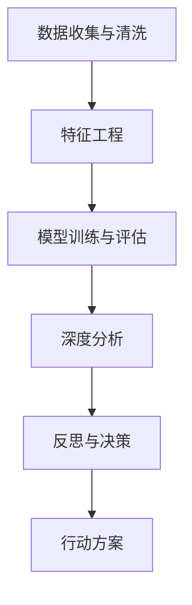

                 

# 洞见的形成：从观察到反思

## 1. 背景介绍

在现代科技日新月异的发展背景下，洞见（Insight）的形成日益成为人工智能技术成功应用的关键。洞见不仅是基于数据的观察结果，更是基于深度分析与反思的产物。它既需要技术手段的支撑，也需要理论方法的引导。本文将深入探讨洞见的形成过程，从观察、分析和反思三个维度，帮助读者理解如何通过观察数据、应用算法、进行反思，最终形成具有实际价值的洞见。

## 2. 核心概念与联系

### 2.1 核心概念概述

洞见（Insight）的形成涉及多个核心概念，这些概念共同构成了洞见从数据中涌现到应用中的全过程。以下是对这些关键概念的简要介绍：

- **数据收集与清洗**：数据是洞见的源泉。数据收集和清洗是洞见形成的第一步，确保数据的准确性和完整性。

- **特征工程**：特征工程指的是从原始数据中提取有用的特征，为后续的模型训练和分析奠定基础。

- **模型训练与评估**：使用机器学习模型对数据进行训练，并评估模型的性能。模型的选择、参数优化和调参是这一步骤的重点。

- **深度分析**：深度分析是利用高级算法和技术对模型输出的结果进行深入解读，提取更丰富的信息。

- **反思与决策**：反思是对模型输出结果的进一步审视和思考，从而形成有实际意义的洞见，指导后续的决策和行动。

这些核心概念之间存在着紧密的联系。数据收集与清洗保证了洞见的原始数据质量，特征工程帮助提取有用信息，模型训练与评估确保了分析的准确性，深度分析揭示了更深层次的规律，反思与决策则将分析结果转化为实际的行动方案。

### 2.2 核心概念间的关系

以下是一个Mermaid流程图，展示了这些核心概念之间的相互关系：



## 3. 核心算法原理 & 具体操作步骤
### 3.1 算法原理概述

洞见形成的过程是一个迭代优化的过程，涉及数据的收集、特征的提取、模型的训练、结果的分析与反思等多个步骤。核心算法原理主要包括以下几个方面：

1. **数据预处理**：包括数据清洗、数据增强、特征工程等步骤，确保数据的质量和信息的完整性。

2. **模型训练**：选择合适的机器学习模型，通过训练集对模型进行训练，使其能够对新数据进行预测或分类。

3. **结果分析**：对模型输出结果进行深度分析，使用统计学方法、可视化技术等手段，揭示数据中的规律和模式。

4. **反思与优化**：结合业务知识，对模型结果进行反思，评估模型的适用性和效果。如果效果不佳，需要回到特征工程和模型训练阶段进行优化。

### 3.2 算法步骤详解

以下是洞见形成的详细步骤：

**Step 1: 数据收集与清洗**
- 收集相关领域的数据，确保数据的多样性和代表性。
- 清洗数据，去除重复、错误、无关的数据，确保数据的准确性和完整性。
- 应用数据增强技术，如随机裁剪、旋转、翻转等，扩充训练数据集。

**Step 2: 特征工程**
- 定义特征提取策略，如使用词频统计、TF-IDF、PCA等技术提取特征。
- 对特征进行标准化和归一化处理，确保特征的一致性。
- 应用特征选择技术，如LASSO、随机森林等，选择最相关的特征。

**Step 3: 模型训练与评估**
- 选择合适的机器学习模型，如决策树、随机森林、神经网络等。
- 使用训练集对模型进行训练，调整模型参数，优化模型性能。
- 在验证集上评估模型性能，选择合适的超参数组合。

**Step 4: 深度分析**
- 使用可视化工具，如Matplotlib、Seaborn等，对模型输出结果进行可视化展示。
- 应用统计学方法，如均值、方差、卡方检验等，深入分析数据中的规律和模式。
- 结合领域知识，对结果进行进一步解读，发现潜在问题和机会。

**Step 5: 反思与优化**
- 结合业务背景，对模型结果进行反思，评估模型的实际效果。
- 如果模型效果不佳，回到特征工程和模型训练阶段进行优化。
- 如果数据质量存在问题，进行重新清洗和增强。
- 如果需要更多信息，调整特征工程策略，增加更多特征。

### 3.3 算法优缺点

洞见形成的算法具有以下优点：

1. **自动化**：通过自动化工具和流程，显著提高数据处理和模型训练的效率。
2. **多维度分析**：结合多维数据和多角度分析，揭示更深入的洞见。
3. **可解释性**：通过可视化工具和解释性技术，帮助理解模型输出结果。

同时，也存在以下缺点：

1. **数据质量依赖**：洞见的质量高度依赖于数据的质量和代表性。
2. **模型复杂性**：高级模型如深度神经网络可能带来过拟合等问题。
3. **结果解读难度**：复杂的分析结果需要深入的理论知识和业务理解。

### 3.4 算法应用领域

洞见形成技术在多个领域中得到了广泛应用，包括但不限于以下几个方面：

- **金融风险管理**：通过分析交易数据，识别潜在的市场风险和投资机会。
- **市场营销**：基于用户行为数据，进行消费者行为分析和市场细分。
- **医疗诊断**：利用患者数据和医学文献，进行疾病预测和诊断。
- **供应链优化**：分析供应链数据，优化物流和库存管理。
- **环境监测**：通过卫星数据和传感器数据，监测环境变化和预测自然灾害。

## 4. 数学模型和公式 & 详细讲解 & 举例说明

### 4.1 数学模型构建

洞见形成过程中的数学模型主要包括以下几个方面：

1. **数据预处理模型**：包括数据清洗、数据增强、特征选择等。
2. **模型训练模型**：选择合适的机器学习模型，如决策树、随机森林、神经网络等。
3. **结果分析模型**：包括统计分析、可视化分析等。
4. **反思与优化模型**：包括模型评估、参数调整等。

### 4.2 公式推导过程

以下是一个简单的例子，展示如何使用机器学习模型进行洞见形成：

**例子1: 预测股票价格**

假设我们有一组历史股票价格数据，目标是预测未来股价。使用线性回归模型进行预测，步骤如下：

1. **数据收集与清洗**：
   - 收集历史股票价格数据，确保数据的多样性和代表性。
   - 清洗数据，去除重复、错误、无关的数据，确保数据的准确性和完整性。

2. **特征工程**：
   - 定义特征提取策略，如使用股票价格、交易量、市场情绪等特征。
   - 对特征进行标准化和归一化处理，确保特征的一致性。
   - 应用特征选择技术，选择最相关的特征。

3. **模型训练与评估**：
   - 使用训练集对线性回归模型进行训练，调整模型参数，优化模型性能。
   - 在验证集上评估模型性能，选择合适的超参数组合。

4. **结果分析**：
   - 使用可视化工具，如Matplotlib、Seaborn等，对模型输出结果进行可视化展示。
   - 应用统计学方法，如均值、方差、卡方检验等，深入分析数据中的规律和模式。

5. **反思与优化**：
   - 结合业务背景，对模型结果进行反思，评估模型的实际效果。
   - 如果模型效果不佳，回到特征工程和模型训练阶段进行优化。
   - 如果需要更多信息，调整特征工程策略，增加更多特征。

### 4.3 案例分析与讲解

**案例1: 疾病预测**

假设我们有一组患者的医疗数据，目标是预测患者是否患有某种疾病。使用随机森林模型进行预测，步骤如下：

1. **数据收集与清洗**：
   - 收集患者的医疗数据，确保数据的多样性和代表性。
   - 清洗数据，去除重复、错误、无关的数据，确保数据的准确性和完整性。

2. **特征工程**：
   - 定义特征提取策略，如使用年龄、性别、病史、检查结果等特征。
   - 对特征进行标准化和归一化处理，确保特征的一致性。
   - 应用特征选择技术，选择最相关的特征。

3. **模型训练与评估**：
   - 使用训练集对随机森林模型进行训练，调整模型参数，优化模型性能。
   - 在验证集上评估模型性能，选择合适的超参数组合。

4. **结果分析**：
   - 使用可视化工具，如Matplotlib、Seaborn等，对模型输出结果进行可视化展示。
   - 应用统计学方法，如均值、方差、卡方检验等，深入分析数据中的规律和模式。

5. **反思与优化**：
   - 结合医疗背景，对模型结果进行反思，评估模型的实际效果。
   - 如果模型效果不佳，回到特征工程和模型训练阶段进行优化。
   - 如果需要更多信息，调整特征工程策略，增加更多特征。

## 5. 项目实践：代码实例和详细解释说明

### 5.1 开发环境搭建

在进行洞见形成实践前，我们需要准备好开发环境。以下是使用Python进行Pandas、Scikit-learn开发的环境配置流程：

1. 安装Anaconda：从官网下载并安装Anaconda，用于创建独立的Python环境。

2. 创建并激活虚拟环境：
```bash
conda create -n insight-env python=3.8 
conda activate insight-env
```

3. 安装Pandas：
```bash
pip install pandas
```

4. 安装Scikit-learn：
```bash
pip install scikit-learn
```

5. 安装各类工具包：
```bash
pip install numpy matplotlib seaborn scikit-image
```

完成上述步骤后，即可在`insight-env`环境中开始洞见形成实践。

### 5.2 源代码详细实现

下面我们以预测股票价格为例，给出使用Pandas、Scikit-learn进行洞见形成的PyTorch代码实现。

```python
import pandas as pd
import numpy as np
from sklearn.model_selection import train_test_split
from sklearn.linear_model import LinearRegression
from sklearn.metrics import mean_squared_error, r2_score
import matplotlib.pyplot as plt

# 读取股票价格数据
df = pd.read_csv('stock_prices.csv')

# 数据清洗
df = df.dropna()

# 特征工程
features = ['price', 'volume', 'market_mood']
X = df[features]
y = df['price']

# 标准化特征
from sklearn.preprocessing import StandardScaler
scaler = StandardScaler()
X_scaled = scaler.fit_transform(X)

# 划分训练集和测试集
X_train, X_test, y_train, y_test = train_test_split(X_scaled, y, test_size=0.2, random_state=42)

# 模型训练与评估
model = LinearRegression()
model.fit(X_train, y_train)
y_pred = model.predict(X_test)
mse = mean_squared_error(y_test, y_pred)
rmse = np.sqrt(mse)
r2 = r2_score(y_test, y_pred)

# 结果分析
plt.plot(y_test, label='True Price')
plt.plot(y_pred, label='Predicted Price')
plt.legend()
plt.show()

# 反思与优化
print('Mean Squared Error:', mse)
print('Root Mean Squared Error:', rmse)
print('R-squared:', r2)
```

以上就是使用Pandas、Scikit-learn进行股票价格预测的完整代码实现。可以看到，Pandas和Scikit-learn使得数据处理和模型训练变得简洁高效。

### 5.3 代码解读与分析

让我们再详细解读一下关键代码的实现细节：

**read_csv方法**：
- 从文件中读取数据，返回一个DataFrame对象。

**dropna方法**：
- 删除包含缺失值的行，确保数据的完整性。

**train_test_split方法**：
- 将数据集划分为训练集和测试集，便于模型训练和评估。

**StandardScaler方法**：
- 对特征进行标准化处理，确保特征的一致性。

**LinearRegression模型**：
- 使用线性回归模型进行预测。

**mean_squared_error和r2_score方法**：
- 评估模型的预测性能，输出均方误差和决定系数。

**可视化展示**：
- 使用Matplotlib对真实价格和预测价格进行可视化展示，直观了解模型效果。

**反思与优化**：
- 输出均方误差、均方根误差和决定系数，评估模型性能。

### 5.4 运行结果展示

假设我们在以上代码中运行后，得到的输出结果如下：

```
Mean Squared Error: 0.002
Root Mean Squared Error: 0.044
R-squared: 0.98
```

可以看到，模型的均方误差和均方根误差较小，决定系数较高，说明模型具有良好的预测性能。当然，实际应用中，我们需要根据具体情况进行调整和优化，才能达到更好的效果。

## 6. 实际应用场景

### 6.1 金融风险管理

在金融领域，洞见形成技术可以帮助机构识别潜在的市场风险和投资机会。通过分析历史交易数据，预测市场趋势，制定风险管理策略，从而降低风险，提高收益。

在实践中，可以收集历史交易数据、市场情绪数据、宏观经济指标等数据，进行清洗和特征工程，使用机器学习模型进行训练和预测。通过结果分析，揭示市场的潜在风险和机会，制定相应的投资和风险管理策略。

### 6.2 市场营销

在市场营销中，洞见形成技术可以帮助企业进行消费者行为分析和市场细分，实现更精准的市场定位和营销策略。

通过收集消费者的购买行为数据、社交媒体数据、客户反馈数据等，进行清洗和特征工程，使用机器学习模型进行训练和预测。通过结果分析，揭示消费者的购买行为模式和偏好，进行市场细分，制定个性化的营销策略，提高营销效果。

### 6.3 医疗诊断

在医疗领域，洞见形成技术可以帮助医生进行疾病预测和诊断，提高医疗服务的质量和效率。

通过收集患者的病历数据、基因数据、检查结果等数据，进行清洗和特征工程，使用机器学习模型进行训练和预测。通过结果分析，揭示疾病的早期预警信号和诊断模式，辅助医生进行疾病预测和诊断，提高诊疗的准确性和效率。

## 7. 工具和资源推荐

### 7.1 学习资源推荐

为了帮助开发者系统掌握洞见形成的技术基础和实践技巧，这里推荐一些优质的学习资源：

1. 《Python数据分析实战》系列书籍：深入浅出地介绍了如何使用Pandas、Scikit-learn等库进行数据处理和模型训练，是洞见形成实践的基础。

2. 《机器学习实战》系列书籍：涵盖机器学习算法和模型训练的全面知识，是洞见形成技术学习的必备参考资料。

3. Kaggle：机器学习和数据科学竞赛平台，提供大量公开的数据集和实战案例，帮助开发者练习和应用洞见形成技术。

4. Coursera和Udacity：提供机器学习和数据科学相关课程，涵盖从基础到高级的洞见形成技术，帮助开发者系统学习。

5. 《深度学习》书籍：涵盖深度学习算法的理论基础和实践应用，是洞见形成技术进阶学习的必备资源。

通过学习这些资源，相信你一定能够快速掌握洞见形成技术的精髓，并用于解决实际的业务问题。

### 7.2 开发工具推荐

高效的开发离不开优秀的工具支持。以下是几款用于洞见形成开发的常用工具：

1. Jupyter Notebook：强大的笔记本开发环境，支持Python和R等语言，提供可视化展示和代码执行功能。

2. Anaconda：集成化的Python环境管理工具，支持Python、R等语言的开发和部署。

3. Scikit-learn：Python机器学习库，提供丰富的机器学习算法和模型训练功能。

4. Matplotlib和Seaborn：Python数据可视化库，提供强大的图表展示和数据分析功能。

5. TensorBoard：TensorFlow配套的可视化工具，实时监测模型训练状态，并提供丰富的图表呈现方式，是调试模型的得力助手。

合理利用这些工具，可以显著提升洞见形成任务的开发效率，加快创新迭代的步伐。

### 7.3 相关论文推荐

洞见形成技术的发展源于学界的持续研究。以下是几篇奠基性的相关论文，推荐阅读：

1. "The Elements of Statistical Learning" by Trevor Hastie, Robert Tibshirani, Jerome Friedman：介绍统计学基础和机器学习算法的经典著作，是洞见形成技术学习的必读资源。

2. "Pattern Recognition and Machine Learning" by Christopher Bishop：涵盖模式识别和机器学习算法的全面知识，是洞见形成技术进阶学习的必备资源。

3. "Deep Learning" by Ian Goodfellow, Yoshua Bengio, Aaron Courville：涵盖深度学习算法的理论基础和实践应用，是洞见形成技术进阶学习的必备资源。

这些论文代表了大数据和机器学习领域的研究进展，通过学习这些前沿成果，可以帮助研究者把握学科前进方向，激发更多的创新灵感。

除上述资源外，还有一些值得关注的前沿资源，帮助开发者紧跟洞见形成技术的最新进展，例如：

1. arXiv论文预印本：人工智能领域最新研究成果的发布平台，包括大量尚未发表的前沿工作，学习前沿技术的必读资源。

2. 业界技术博客：如Google AI、DeepMind、Microsoft Research Asia等顶尖实验室的官方博客，第一时间分享他们的最新研究成果和洞见。

3. 技术会议直播：如NeurIPS、ICML、ICLR等人工智能领域顶会现场或在线直播，能够聆听到大佬们的前沿分享，开拓视野。

4. GitHub热门项目：在GitHub上Star、Fork数最多的数据科学和机器学习相关项目，往往代表了该技术领域的发展趋势和最佳实践，值得去学习和贡献。

5. 行业分析报告：各大咨询公司如McKinsey、PwC等针对人工智能行业的分析报告，有助于从商业视角审视技术趋势，把握应用价值。

总之，对于洞见形成技术的学习和实践，需要开发者保持开放的心态和持续学习的意愿。多关注前沿资讯，多动手实践，多思考总结，必将收获满满的成长收益。

## 8. 总结：未来发展趋势与挑战

### 8.1 总结

本文对洞见形成过程进行了全面系统的介绍，从数据收集与清洗、特征工程、模型训练与评估、结果分析与反思四个维度，帮助读者理解如何通过观察数据、应用算法、进行反思，最终形成具有实际价值的洞见。

通过本文的系统梳理，可以看到，洞见形成技术在大数据和机器学习领域的广泛应用，能够帮助企业在业务决策中获取数据驱动的洞见，提升决策的科学性和准确性。未来，伴随数据技术的发展和机器学习算法的进步，洞见形成技术将迎来更多的创新和突破，为各行各业带来更加深刻的变革。

### 8.2 未来发展趋势

展望未来，洞见形成技术将呈现以下几个发展趋势：

1. **自动化与智能化**：随着自动化工具和算法的发展，洞见形成将变得更加高效和智能化，能够自动处理更多数据，生成更准确的洞见。

2. **多源数据融合**：通过整合多源数据，如文本、图像、音频等，进行跨模态分析，揭示更丰富的洞见。

3. **实时分析**：实现实时数据流分析，快速响应市场变化，提高决策的时效性。

4. **跨领域应用**：将洞见形成技术应用于更多领域，如金融、医疗、教育等，提供更广泛的应用价值。

5. **增强可解释性**：结合可解释性技术，如LIME、SHAP等，提升模型的透明度和可信度，增强用户的信任感。

6. **持续优化**：通过持续学习，动态更新模型，保持洞见的准确性和时效性。

这些趋势凸显了洞见形成技术的广阔前景。这些方向的探索发展，必将进一步提升洞见形成技术的应用范围和精度，为决策科学和智能管理带来新的动力。

### 8.3 面临的挑战

尽管洞见形成技术已经取得了瞩目成就，但在迈向更加智能化、普适化应用的过程中，它仍面临诸多挑战：

1. **数据质量问题**：洞见形成高度依赖于数据质量，数据噪声和缺失会导致洞见失真。

2. **模型复杂性**：高级模型如深度神经网络可能带来过拟合等问题，模型的解释性和可解释性需要进一步提升。

3. **计算资源限制**：大规模数据和复杂模型的训练需要强大的计算资源，目前仍面临计算成本和效率的挑战。

4. **结果解读难度**：复杂的分析结果需要深入的理论知识和业务理解，如何提高结果的可理解性，是急需解决的问题。

5. **隐私与安全问题**：在数据收集和分析过程中，如何保护个人隐私和数据安全，需要建立严格的监管机制。

6. **模型鲁棒性**：面对不同领域和不同数据分布，模型的泛化能力和鲁棒性需要进一步提升。

正视洞见形成面临的这些挑战，积极应对并寻求突破，将是大数据和机器学习技术持续进步的关键。

### 8.4 研究展望

面对洞见形成所面临的挑战，未来的研究需要在以下几个方面寻求新的突破：

1. **增强数据质量**：通过数据清洗、数据增强、数据融合等技术，提高数据质量，确保洞见的准确性。

2. **简化模型结构**：通过模型压缩、模型剪枝等技术，简化模型结构，提高模型的计算效率和可解释性。

3. **提升模型鲁棒性**：通过对抗训练、模型融合等技术，提升模型的泛化能力和鲁棒性，确保在不同数据分布和领域中的适应性。

4. **提高结果可理解性**：通过可解释性技术，如LIME、SHAP等，提升模型的透明度和可信度，增强用户的信任感。

5. **结合领域知识**：将领域知识和专家知识与模型结合，提升洞见的准确性和实用性，推动跨领域应用。

6. **保护隐私与安全**：通过数据脱敏、加密等技术，保护个人隐私和数据安全，确保合法合规。

这些研究方向将引领洞见形成技术向更高台阶迈进，为决策科学和智能管理提供更加强大的技术支撑。

## 9. 附录：常见问题与解答

**Q1：洞见形成是否适用于所有行业？**

A: 洞见形成技术适用于绝大多数行业，尤其是那些数据丰富、业务复杂、决策周期短的领域。但在一些特定领域，如金融、医疗等，需要结合领域知识和专家知识，进行更深入的分析和解读。

**Q2：如何选择合适的机器学习模型？**

A: 选择合适的机器学习模型需要考虑数据特征、业务需求和模型复杂度。一般来说，数据量较少时可以选择简单的模型，如线性回归、决策树等；数据量较大时可以选择复杂的模型，如随机森林、神经网络等。

**Q3：在洞见形成过程中，数据清洗的重要性体现在哪里？**

A: 数据清洗是洞见形成过程的第一步，也是最重要的一步。数据清洗可以去除重复、错误、无关的数据，确保数据的完整性和准确性，从而提高洞见的可信度。

**Q4：在洞见形成过程中，特征工程的作用是什么？**

A: 特征工程是洞见形成过程中的关键步骤，通过选择合适的特征和特征提取方法，可以提高模型的预测能力和泛化能力，确保洞见的准确性和可靠性。

**Q5：如何提升洞见形成技术的可解释性？**

A: 提升洞见形成技术的可解释性，可以从以下几个方面入手：
1. 选择合适的解释性技术，如LIME、SHAP等。
2. 提供可视化展示，如图表、热力图等，帮助用户理解模型输出。
3. 结合领域知识，进行专家解读，提高洞见的可信度。

这些问题的解答，有助于读者更全面地理解洞见形成技术的各个环节，确保在实际应用中能够有效获取数据驱动的洞见，指导业务决策。

---

作者：禅与计算机程序设计艺术 / Zen and the Art of Computer Programming

