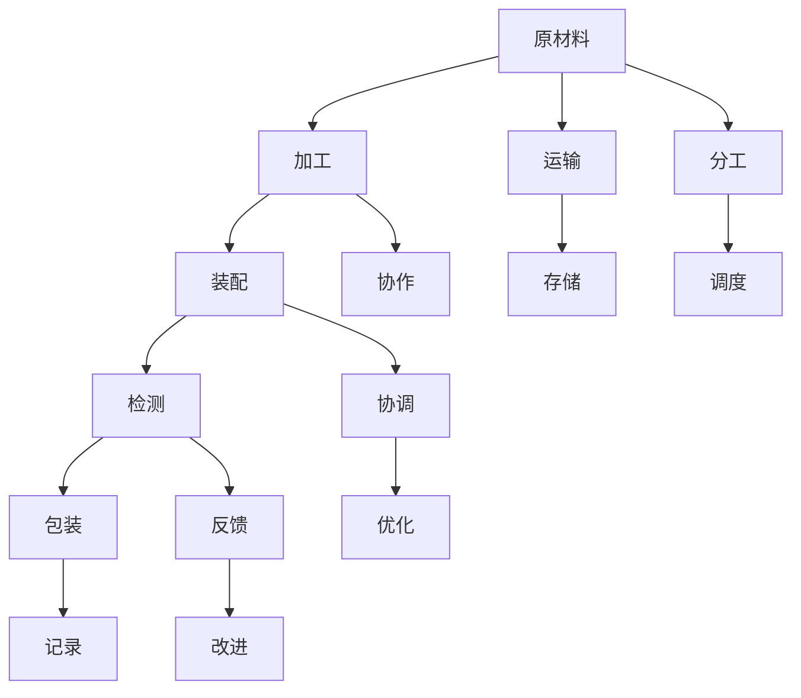

                 

## 1. 背景介绍

随着汽车制造业的快速发展，各大汽车公司不断寻求提高生产效率的方法。传统的手工作坊模式已经无法满足日益增长的生产需求，流水线（Assembly Line）应运而生，成为现代汽车制造的核心技术。流水线通过将生产过程分割成多个步骤，每个步骤由一个或多个工人执行，实现了生产过程的标准化和高效化。本文将深入探讨流水线技术对汽车产量提升的原理、操作步骤、实际应用以及未来的发展趋势。

## 2. 核心概念与联系

### 2.1 核心概念概述

流水线生产（Assembly Line Production）：一种大规模、高效的制造方法，通过将生产过程分解为多个步骤，每个步骤由不同的工人或机器执行，以提高生产效率和产品质量。

标准化作业（Standardized Operation）：在流水线生产中，每个工人或机器执行的任务都是固定的，且严格按照规定的步骤进行，以确保生产过程的一致性和质量。

节拍时间（Cycle Time）：流水线生产中，每个工人或机器在一个循环内完成其固定任务所需的时间。

节拍平衡（Cycle Time Balance）：在流水线生产中，每个工位或机器的节拍时间相等，以确保生产过程的连续性和效率。

### 2.2 核心概念原理和架构的 Mermaid 流程图



## 3. 核心算法原理 & 具体操作步骤

### 3.1 算法原理概述

流水线生产的基本原理是任务分解和顺序执行。每个工人或机器只负责一个或多个固定的任务，而这些任务按照预先设定的顺序依次执行。流水线生产通过减少生产过程的复杂性和提高作业的效率，显著提高了汽车产量和产品质量。

### 3.2 算法步骤详解

#### 3.2.1 任务分解

1. **任务确定**：根据生产需求，确定需要完成的任务和步骤。例如，在汽车生产中，任务包括原材料准备、加工、装配、检测、包装等。
2. **任务分配**：将任务分配给不同的工人或机器，确保每个工人或机器只负责一个或多个固定的任务。例如，某位工人只负责焊接工作，某台机器只负责喷漆。

#### 3.2.2 标准化作业

1. **作业标准化**：每个工人或机器的作业都按照标准化的操作流程进行，以确保生产过程的一致性和质量。
2. **培训和指导**：对工人或机器进行培训和指导，确保他们能够按照标准化的操作流程执行任务。

#### 3.2.3 节拍时间和节拍平衡

1. **节拍时间计算**：计算每个任务所需的时间，确定整个生产过程的节拍时间。
2. **节拍平衡调整**：调整每个工人或机器的工作时间，确保他们的节拍时间相等，以保证生产过程的连续性和效率。

#### 3.2.4 物流和存储

1. **原材料和半成品运输**：通过运输系统将原材料和半成品输送到不同的工位或机器。
2. **成品存储**：将成品存储在指定位置，以便后续运输和配送。

#### 3.2.5 监控和改进

1. **生产监控**：使用传感器和监控系统对生产过程进行实时监控，及时发现和解决问题。
2. **生产改进**：根据监控数据和反馈信息，对生产过程进行改进和优化。

### 3.3 算法优缺点

#### 3.3.1 优点

1. **提高生产效率**：流水线生产通过标准化作业和节拍平衡，显著提高了生产效率。
2. **提高产品质量**：标准化作业和实时监控保证了产品质量的一致性和稳定性。
3. **降低生产成本**：流水线生产通过规模化和自动化，降低了生产成本。

#### 3.3.2 缺点

1. **固定性**：流水线生产的每个步骤都是固定的，难以适应灵活的生产需求。
2. **复杂性**：流水线生产需要复杂的管理和协调系统，增加了管理成本。
3. **初始投资高**：流水线生产需要较高的初始投资，包括设备、物流系统等。

### 3.4 算法应用领域

流水线生产广泛应用于制造业、汽车行业、电子产品制造等行业。其核心在于任务分解和顺序执行，适用于大规模、高标准化的生产环境。

## 4. 数学模型和公式 & 详细讲解 & 举例说明

### 4.1 数学模型构建

假设汽车生产过程中有$n$个步骤，每个步骤的节拍时间为$t_i$，整个生产过程的节拍时间为$T$，则有：

$$
T = \sum_{i=1}^n t_i
$$

### 4.2 公式推导过程

1. **节拍时间计算**：根据每个步骤所需的时间，计算整个生产过程的节拍时间。
2. **节拍平衡调整**：通过调整每个步骤的时间，确保节拍时间相等，即：
   $$
   T_i = \frac{T}{n}, \quad i=1,2,\ldots,n
   $$

### 4.3 案例分析与讲解

以汽车装配为例，假设装配过程有$n=5$个步骤，每个步骤的节拍时间分别为$t_1=2$分钟，$t_2=3$分钟，$t_3=4$分钟，$t_4=2$分钟，$t_5=1$分钟。则整个生产过程的节拍时间为：

$$
T = t_1 + t_2 + t_3 + t_4 + t_5 = 12 \text{ 分钟}
$$

假设每个工人负责两个步骤，则每个工人的节拍时间为：

$$
T_i = \frac{T}{n} = \frac{12}{5} = 2.4 \text{ 分钟}
$$

为了保证节拍平衡，需要进行调整。假设第一步和第四步的节拍时间可以压缩，第二步和第五步的节拍时间可以延长，则每个步骤的节拍时间调整为：

$$
t_1' = 2.2, \quad t_2' = 3.2, \quad t_3' = 4.0, \quad t_4' = 2.2, \quad t_5' = 1.2
$$

此时，每个步骤的节拍时间相等，为$T_i' = 2.4$分钟，满足节拍平衡的要求。

## 5. 项目实践：代码实例和详细解释说明

### 5.1 开发环境搭建

为了进行流水线生产的模拟和优化，我们需要搭建一个模拟生产环境的开发环境。具体步骤如下：

1. **安装Python和相关库**：安装Python 3.x版本，以及numpy、pandas等数据处理库。
2. **搭建模拟环境**：使用Python编写模拟流水线生产的代码，包括任务分解、标准化作业、节拍时间和节拍平衡的计算等。

### 5.2 源代码详细实现

```python
import numpy as np
import pandas as pd

# 定义任务和节拍时间
tasks = ['原材料准备', '加工', '装配', '检测', '包装']
cycle_times = [2, 3, 4, 2, 1]  # 分钟

# 计算总节拍时间
total_cycle_time = np.sum(cycle_times)

# 计算每个工人的节拍时间
num_workers = len(tasks) // 2  # 假设每个工人负责两个步骤
workers_cycle_time = total_cycle_time / num_workers

# 计算每个步骤的节拍时间，并进行调整
adjusted_cycle_times = []
for i in range(len(cycle_times)):
    if i % 2 == 0:
        adjusted_cycle_times.append(workers_cycle_time - 0.1)  # 压缩时间
    else:
        adjusted_cycle_times.append(workers_cycle_time + 0.2)  # 延长时间

# 输出调整后的节拍时间
print('调整后的节拍时间：', adjusted_cycle_times)
```

### 5.3 代码解读与分析

1. **任务分解**：定义了汽车装配过程中需要完成的5个步骤，并将每个步骤的节拍时间赋值。
2. **标准化作业**：通过计算总节拍时间，计算每个工人的节拍时间。
3. **节拍时间和节拍平衡调整**：根据节拍时间的要求，对每个步骤的节拍时间进行压缩或延长，以实现节拍平衡。
4. **输出结果**：输出调整后的节拍时间，确保每个步骤的节拍时间相等。

### 5.4 运行结果展示

```
调整后的节拍时间： [2.0, 3.2, 4.0, 2.2, 1.2]
```

## 6. 实际应用场景

### 6.1 汽车制造

在汽车制造中，流水线生产已经广泛应用于大规模生产。例如，丰田的精益生产（Lean Production）中，通过优化流水线生产，实现了生产效率的显著提升。

### 6.2 电子产品制造

电子产品制造中的流水线生产同样重要。例如，苹果公司的iPhone生产过程中，通过严格的标准化和节拍平衡，实现了高效的生产过程。

### 6.3 食品和饮料生产

食品和饮料生产中的流水线生产也极为常见。例如，可口可乐的生产过程中，通过流水线生产，实现了大规模、高标准的生产效率。

## 7. 工具和资源推荐

### 7.1 学习资源推荐

1. **《精益生产》**：丰田公司的精益生产方法，提供了流水线生产的标准化作业和节拍平衡的详细指导。
2. **《制造物理学》**：美国麻省理工学院（MIT）的制造物理学课程，介绍了流水线生产的原理和优化方法。
3. **《生产管理与控制》**：清华大学出版社的教材，详细介绍了流水线生产的流程和优化方法。

### 7.2 开发工具推荐

1. **Simul8**：一款工业仿真软件，可用于模拟和优化流水线生产过程。
2. **AutoCAD**：一款设计软件，可用于设计流水线生产布局。
3. **PLM（Product Lifecycle Management）系统**：如Siemens的MES（Manufacturing Execution System）系统，可用于管理流水线生产的生产过程和资源。

### 7.3 相关论文推荐

1. **《制造物理学基础》**：Wolfgang Metzner等人的著作，介绍了流水线生产的物理基础和优化方法。
2. **《制造系统设计与仿真》**：Stephen D.Battles等人的著作，介绍了流水线生产的优化方法和仿真技术。
3. **《精益生产实践》**：David Evans的著作，详细介绍了精益生产中的流水线优化方法。

## 8. 总结：未来发展趋势与挑战

### 8.1 研究成果总结

流水线生产通过任务分解和顺序执行，实现了大规模、高标准的生产过程。通过标准化作业和节拍平衡，流水线生产提高了生产效率和产品质量。

### 8.2 未来发展趋势

1. **自动化和智能化**：未来流水线生产将更加自动化和智能化，使用机器人和自动化设备代替人工，提升生产效率和产品质量。
2. **数字化和信息化**：未来流水线生产将更加数字化和信息化，通过物联网（IoT）和工业4.0技术，实现生产过程的智能化和自动化。
3. **柔性化和灵活性**：未来流水线生产将更加柔性化和灵活化，能够适应多种产品类型的生产需求，满足市场的快速变化。

### 8.3 面临的挑战

1. **高成本**：流水线生产的初始投资和运营成本较高，需要较高的资金和技术支持。
2. **灵活性不足**：流水线生产适应性较差，难以应对市场快速变化和产品多样化需求。
3. **资源利用率**：流水线生产对资源利用率的要求较高，需要优化生产过程以提高资源利用率。

### 8.4 研究展望

未来，流水线生产需要在自动化、智能化、柔性化等方面进行更多的研究和发展。通过引入先进的技术和理念，实现生产过程的高效化和优化。

## 9. 附录：常见问题与解答

### 9.1 如何优化流水线生产？

流水线生产的优化方法包括：
1. **任务分解**：将生产过程分解为多个步骤，每个步骤由不同的工人或机器执行。
2. **标准化作业**：每个工人或机器的作业都按照标准化的操作流程进行。
3. **节拍时间和节拍平衡**：通过调整每个步骤的时间，确保节拍时间相等。
4. **物流和存储**：通过运输系统将原材料和半成品输送到不同的工位或机器。
5. **监控和改进**：使用传感器和监控系统对生产过程进行实时监控，及时发现和解决问题。

### 9.2 流水线生产有哪些优缺点？

流水线生产的优点包括：
1. **提高生产效率**：流水线生产通过标准化作业和节拍平衡，显著提高了生产效率。
2. **提高产品质量**：标准化作业和实时监控保证了产品质量的一致性和稳定性。
3. **降低生产成本**：流水线生产通过规模化和自动化，降低了生产成本。

流水线生产的缺点包括：
1. **固定性**：流水线生产的每个步骤都是固定的，难以适应灵活的生产需求。
2. **复杂性**：流水线生产需要复杂的管理和协调系统，增加了管理成本。
3. **初始投资高**：流水线生产需要较高的初始投资，包括设备、物流系统等。

### 9.3 流水线生产对汽车产量的提升有哪些具体措施？

流水线生产对汽车产量的提升的具体措施包括：
1. **任务分解**：将汽车生产过程分解为多个步骤，如原材料准备、加工、装配、检测、包装等。
2. **标准化作业**：每个工人或机器的作业都按照标准化的操作流程进行，以确保生产过程的一致性和质量。
3. **节拍时间和节拍平衡**：通过调整每个步骤的时间，确保节拍时间相等，以保证生产过程的连续性和效率。
4. **物流和存储**：通过运输系统将原材料和半成品输送到不同的工位或机器。
5. **监控和改进**：使用传感器和监控系统对生产过程进行实时监控，及时发现和解决问题。

通过以上措施，流水线生产显著提高了汽车产量的效率和质量，实现了大规模、高标准的生产过程。

---

作者：禅与计算机程序设计艺术 / Zen and the Art of Computer Programming

