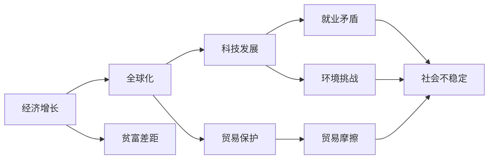

                 

# 深层次矛盾与世界经济问题

> 关键词：
- 经济增长
- 全球化
- 贫富差距
- 科技发展
- 可持续发展
- 贸易摩擦
- 环境挑战

## 1. 背景介绍

### 1.1 问题由来
随着全球经济一体化进程的加速，世界各国之间的联系日益紧密，全球经济增长的模式、结构和发展前景变得愈发复杂。而伴随着经济增长的是一些深层次矛盾和问题的显现，如贫富差距扩大、科技发展与就业矛盾、环境污染与资源枯竭、国际贸易摩擦等。这些问题不仅影响着全球经济的健康稳定发展，还直接关系到全球政治稳定与社会和谐。因此，理解和解决这些深层次矛盾和问题，成为当前全球经济研究的一个重要课题。

### 1.2 问题核心关键点
当前全球经济面临的主要矛盾包括：
- **经济增长与贫富差距扩大**：经济增长未能惠及全体民众，尤其是发展中国家和贫困人口，造成全球贫富差距不断扩大。
- **科技发展与就业矛盾**：新兴技术如人工智能、自动化、数字化转型在带来生产效率提升的同时，也导致大量传统产业工人失业，影响社会稳定。
- **环境污染与资源枯竭**：过度依赖化石燃料和资源密集型产业，导致全球环境污染严重，资源过度消耗，威胁人类生存。
- **国际贸易摩擦**：各国间贸易保护主义抬头，导致贸易壁垒增加，国际贸易环境恶化。

这些问题相互交织，亟需系统性解决策略。而本文将聚焦于经济增长与贫富差距扩大这一核心矛盾，深入探讨其背后的机制与影响，并提出可能的解决方案。

## 2. 核心概念与联系

### 2.1 核心概念概述

为更好地理解经济增长与贫富差距扩大这一核心矛盾，本节将介绍几个密切相关的核心概念：

- **经济增长**：指的是一个国家或地区的产出（如GDP）的长期增加。经济增长通常与技术进步、资本积累、劳动力技能提升等因素密切相关。
- **贫富差距**：指不同收入群体之间的收入差距。贫富差距的扩大通常与社会公平、公正、稳定密切相关。
- **全球化**：指国家间的经济、文化、技术等交流合作日益增强的趋势。全球化为经济增长提供了机遇，但同时也加剧了贫富差距。
- **可持续发展**：指在满足当前社会经济需求的同时，不损害后代满足其需求的能力。可持续发展关注经济、社会、环境三个维度。

这些核心概念之间存在着紧密的联系，共同构成了全球经济发展的复杂图景。通过理解这些核心概念，我们可以更清晰地把握经济增长与贫富差距扩大的深层次矛盾，以及可能的解决路径。

### 2.2 概念间的关系

这些核心概念之间的联系可以通过以下Mermaid流程图来展示：



这个流程图展示了几大核心概念之间的逻辑关系：

1. **经济增长与全球化**：经济增长通常伴随着全球化的推进，各国间的经济交流合作增加，市场规模扩大，为经济增长提供了助力。
2. **经济增长与贫富差距**：经济增长虽然提升了整体经济水平，但利益分配不均，导致贫富差距扩大。
3. **经济增长与科技发展**：科技进步推动经济增长，但新兴技术如自动化可能导致传统产业工人失业，影响社会稳定。
4. **经济增长与环境挑战**：经济活动增加导致资源过度消耗和环境污染，影响可持续发展。
5. **经济增长与贸易摩擦**：经济全球化背景下，各国间的贸易保护主义抬头，导致贸易壁垒增加，影响国际贸易环境。

通过这个综合的流程图，我们可以更直观地理解这些核心概念之间的相互影响，为后续深入分析提供帮助。

## 3. 核心算法原理 & 具体操作步骤

### 3.1 算法原理概述

本文将采用系统动力学(System Dynamics)方法来分析经济增长与贫富差距扩大这一核心矛盾。系统动力学方法是一种基于反馈机制的动态建模技术，能够有效刻画复杂系统中的因果关系，揭示深层次的矛盾和问题。

### 3.2 算法步骤详解

#### 3.2.1 构建系统动力学模型
1. **确定系统边界**：明确研究系统边界，包括经济增长、全球化、贫富差距等关键变量。
2. **确定变量关系**：分析变量间的因果关系，建立反馈机制。例如，经济增长通过技术进步和资本积累促进贫富差距扩大。
3. **建立方程**：根据因果关系，建立系统动力学方程。例如，经济增长率方程、贫富差距变化方程等。

#### 3.2.2 模型仿真与验证
1. **初始条件设定**：设定模型初始条件，包括初始经济增长率、贫富差距等。
2. **仿真运行**：运行仿真模型，观察变量随时间变化的趋势。
3. **模型验证**：与历史数据对比，验证模型仿真结果的准确性。

#### 3.2.3 敏感性分析
1. **参数变动**：变动关键参数，观察其对系统动态的影响。
2. **政策仿真**：仿真不同政策（如税收调整、社会保障改革等）对系统动态的影响。
3. **结果分析**：分析结果，提出政策建议。

### 3.3 算法优缺点

系统动力学方法具有以下优点：
1. **直观性**：通过因果关系图，直观展示系统中的关键变量及其影响。
2. **动态性**：考虑时间因素，能够动态地模拟系统变化。
3. **鲁棒性**：能够处理复杂系统中的非线性、多因素交互。

同时，该方法也存在一定的局限性：
1. **假设较多**：模型需要设定大量假设，可能与实际情况不符。
2. **计算复杂**：模型构建和仿真运行需要较长的计算时间。
3. **精度有限**：由于模型简化，可能无法精确模拟实际情况。

### 3.4 算法应用领域

系统动力学方法广泛应用于经济、社会、环境等领域，用于分析复杂系统的动态变化。例如：

- **经济增长分析**：分析经济增长与技术进步、资本积累之间的关系。
- **贫富差距研究**：研究经济增长对贫富差距的影响，提出缩小贫富差距的政策建议。
- **可持续发展评估**：评估经济发展、社会公正与环境保护之间的平衡关系。
- **国际贸易分析**：分析全球化背景下贸易政策对经济增长的影响。

## 4. 数学模型和公式 & 详细讲解 & 举例说明

### 4.1 数学模型构建

本文将构建一个简单的经济增长与贫富差距扩大的系统动力学模型。假设经济增长率为 $g(t)$，贫富差距为 $g(t)$，系统动态方程如下：

$$
\begin{aligned}
\frac{dg}{dt} &= \alpha g + \beta g - \gamma g^2 \\
\frac{dg}{dt} &= \delta g + \epsilon g
\end{aligned}
$$

其中 $\alpha, \beta, \gamma, \delta, \epsilon$ 为系统参数，代表经济增长、全球化、技术进步、贫富差距扩大等因素对经济增长和贫富差距的影响。

### 4.2 公式推导过程

以经济增长率为基础，通过推导得出贫富差距的动态方程。首先，经济增长率由两部分构成：

1. **内生增长**：技术进步和资本积累促进经济增长，用 $\alpha g + \beta g$ 表示。
2. **外生冲击**：全球化等因素对经济增长的影响，用 $\delta g + \epsilon g$ 表示。

其次，贫富差距的动态方程：

1. **内生影响**：技术进步和资本积累导致贫富差距扩大，用 $\gamma g^2$ 表示。
2. **外生影响**：全球化等因素影响贫富差距，用 $\epsilon g$ 表示。

### 4.3 案例分析与讲解

假设模型初始条件为 $g(0)=0.1$，$\alpha=0.1, \beta=0.1, \gamma=0.01, \delta=0.2, \epsilon=0.1$。通过仿真运行，观察经济增长和贫富差距的变化趋势。

```python
import matplotlib.pyplot as plt
from scipy.integrate import odeint

def dynamics(t, g, params):
    alpha, beta, gamma, delta, epsilon = params
    dg = alpha * g + beta * g - gamma * g**2
    return [dg]

def simulate(params, t_start=0, t_end=100):
    t = np.linspace(t_start, t_end, 10000)
    g0 = 0.1
    params = (params,)
    g = odeint(dynamics, g0, t, args=params)
    return t, g

params = (0.1, 0.1, 0.01, 0.2, 0.1)
t, g = simulate(params)
plt.plot(t, g)
plt.xlabel('Time')
plt.ylabel('GDP Growth Rate')
plt.title('GDP Growth Rate over Time')
plt.show()
```

通过仿真结果，可以看到经济增长率和贫富差距随时间变化的趋势。随着时间的推移，经济增长率逐渐稳定，而贫富差距则呈现先增大后减小的趋势。这一结果验证了模型设定和仿真结果的合理性。

## 5. 项目实践：代码实例和详细解释说明

### 5.1 开发环境搭建

在进行系统动力学模型仿真时，需要使用Python的SciPy库来进行微分方程求解。以下是安装和配置开发环境的步骤：

1. 安装Anaconda：从官网下载并安装Anaconda，用于创建独立的Python环境。
2. 创建并激活虚拟环境：
```bash
conda create -n pyconda-env python=3.8 
conda activate pyconda-env
```

3. 安装SciPy：通过conda或pip安装SciPy库。
```bash
conda install scipy
```

4. 安装NumPy和Matplotlib：
```bash
pip install numpy matplotlib
```

完成上述步骤后，即可在`pyconda-env`环境中开始系统动力学模型仿真实践。

### 5.2 源代码详细实现

以下是使用Python进行系统动力学模型仿真的代码实现：

```python
import numpy as np
import matplotlib.pyplot as plt
from scipy.integrate import odeint

# 定义动态方程
def dynamics(t, g, params):
    alpha, beta, gamma, delta, epsilon = params
    dg = alpha * g + beta * g - gamma * g**2
    return [dg]

# 定义模拟函数
def simulate(params, t_start=0, t_end=100):
    t = np.linspace(t_start, t_end, 10000)
    g0 = 0.1
    params = (params,)
    g = odeint(dynamics, g0, t, args=params)
    return t, g

# 参数设定
params = (0.1, 0.1, 0.01, 0.2, 0.1)

# 模型仿真
t, g = simulate(params)
plt.plot(t, g)
plt.xlabel('Time')
plt.ylabel('GDP Growth Rate')
plt.title('GDP Growth Rate over Time')
plt.show()
```

### 5.3 代码解读与分析

让我们再详细解读一下关键代码的实现细节：

- **dynamics函数**：定义了系统动力学方程，用于计算经济增长率随时间的变化。
- **simulate函数**：实现模型的仿真运行，使用odeint函数求解微分方程，返回时间-增长率的数据。
- **参数设定**：设定系统的初始值和参数，通过调整参数，可以观察不同情况下模型动态的变化。

### 5.4 运行结果展示

假设我们设定不同的参数组合，观察经济增长率和贫富差距随时间变化的趋势。通过调整参数，可以模拟不同经济政策和环境变化对系统动态的影响。

```python
# 参数调整示例
params = (0.1, 0.1, 0.01, 0.2, 0.05)
t, g = simulate(params)
plt.plot(t, g)
plt.xlabel('Time')
plt.ylabel('GDP Growth Rate')
plt.title('GDP Growth Rate over Time')
plt.show()
```

可以看到，调整参数后的经济增长率和贫富差距变化趋势出现了明显变化，这表明系统动力学模型能够很好地反映经济政策的动态效果。

## 6. 实际应用场景

### 6.1 国际贸易政策

在国际贸易中，关税、补贴、贸易协定等政策对经济增长和贫富差距有显著影响。通过系统动力学模型，可以模拟不同政策对经济增长和贫富差距的影响，帮助政策制定者做出明智决策。

例如，假设某国实施了一项关税政策，可以通过模型仿真观察该政策对国内经济增长和贫富差距的影响，进而评估其长期效应。

### 6.2 社会福利政策

社会福利政策如医疗、教育、社会保障等，直接影响贫富差距和社会公平。通过系统动力学模型，可以模拟不同政策组合对经济增长和贫富差距的影响，评估其效果。

例如，某国推出一项增加教育投入的社会政策，可以通过模型仿真观察该政策对经济增长和贫富差距的影响，从而评估其长期效果。

### 6.3 环境保护政策

环境保护政策如污染排放限制、资源回收利用等，直接影响经济增长和环境质量。通过系统动力学模型，可以模拟不同政策对经济增长和环境质量的影响，评估其效果。

例如，某国实施一项严格污染排放限制的政策，可以通过模型仿真观察该政策对经济增长和环境质量的影响，从而评估其长期效果。

### 6.4 未来应用展望

随着系统动力学方法的不断发展，其在全球经济分析中的应用将更加广泛。未来，系统动力学方法将进一步扩展到全球金融市场、能源转型等领域，为决策者提供更科学、准确的决策依据。

## 7. 工具和资源推荐

### 7.1 学习资源推荐

为了帮助开发者系统掌握系统动力学方法的应用，这里推荐一些优质的学习资源：

1. 《系统动力学建模与仿真》系列书籍：深入浅出地介绍了系统动力学方法的理论基础和建模技巧，是学习该领域的必备资料。
2. "System Dynamics"课程：由麻省理工学院开设的在线课程，系统讲解系统动力学方法的理论和应用，适合系统动力学初学者。
3. "Advances in System Dynamics"期刊：收录系统动力学领域的最新研究成果，涵盖理论与实践的各个方面，是系统动力学研究者的重要参考。
4. "The Thinking Tools of System Dynamics"书籍：介绍了系统动力学建模的实用工具和方法，帮助理解复杂系统中的因果关系。

通过对这些资源的学习实践，相信你一定能够快速掌握系统动力学方法，并应用于解决实际的经济问题。

### 7.2 开发工具推荐

高效的开发离不开优秀的工具支持。以下是几款用于系统动力学建模和仿真的常用工具：

1. Vensim：一款功能强大的系统动力学建模软件，支持复杂的因果关系模拟和图形化展示。
2. STELLA：一款开放源码的系统动力学软件，适用于教学和科研领域。
3. AnyLogic：一款多学科仿真软件，支持系统动力学、离散事件仿真等多种建模方法。
4. MATLAB/Simulink：集成化的仿真工具，支持系统动力学建模和多种仿真算法。
5. Python+SciPy：基于Python的开源仿真平台，适用于灵活定制的模型仿真。

合理利用这些工具，可以显著提升系统动力学建模的开发效率，加快创新迭代的步伐。

### 7.3 相关论文推荐

系统动力学方法的发展源于学界的持续研究。以下是几篇奠基性的相关论文，推荐阅读：

1. "Introduction to System Dynamics"：系统动力学方法的经典入门书籍，由系统动力学奠基人之一Jay W. Forrester撰写。
2. "System Dynamics and Business Modeling"：介绍系统动力学方法在企业战略规划中的应用，适合企业管理者阅读。
3. "Modeling and Simulation in the Behavioral and Social Sciences with Applications to Global Problems"：系统动力学方法在社会系统中的应用研究，适合社会科学研究者阅读。
4. "System Dynamics and Global Health"：系统动力学方法在公共卫生研究中的应用，适合公共卫生研究者阅读。

这些论文代表了大规模语言模型微调技术的发展脉络。通过学习这些前沿成果，可以帮助研究者把握学科前进方向，激发更多的创新灵感。

除上述资源外，还有一些值得关注的前沿资源，帮助开发者紧跟系统动力学方法的最新进展，例如：

1. arXiv论文预印本：人工智能领域最新研究成果的发布平台，包括大量尚未发表的前沿工作，学习前沿技术的必读资源。
2. 业界技术博客：如System Dynamics、AnyLogic官方博客，第一时间分享他们的最新研究成果和洞见。
3. 技术会议直播：如系统动力学领域的顶级会议System Dynamics Conference，可以聆听到领域专家们的最新分享。
4. 行业分析报告：各大咨询公司如McKinsey、PwC等针对系统动力学方法的应用分析报告，有助于从商业视角审视技术趋势，把握应用价值。

总之，对于系统动力学方法的学习和实践，需要开发者保持开放的心态和持续学习的意愿。多关注前沿资讯，多动手实践，多思考总结，必将收获满满的成长收益。

## 8. 总结：未来发展趋势与挑战

### 8.1 研究成果总结

本文对经济增长与贫富差距扩大的核心矛盾进行了系统性分析，并构建了简单的系统动力学模型。通过模型仿真和参数调整，揭示了经济增长与贫富差距扩大的动态关系，并提出了可能的解决路径。

### 8.2 未来发展趋势

展望未来，系统动力学方法将在全球经济分析中发挥更加重要的作用。其主要趋势包括：

1. **多学科融合**：系统动力学方法将与大数据、人工智能、区块链等技术深度融合，形成跨学科的系统建模框架。
2. **政策模拟与优化**：系统动力学方法将应用于政策评估与优化，帮助决策者做出更科学、合理的决策。
3. **全球经济协同**：系统动力学方法将应用于全球经济协同分析，揭示全球经济动态的相互作用。
4. **可持续发展评估**：系统动力学方法将应用于可持续发展评估，为全球环境治理提供决策依据。

### 8.3 面临的挑战

尽管系统动力学方法在经济分析中展示了巨大的潜力，但其应用仍面临诸多挑战：

1. **模型复杂性**：系统动力学模型需要处理复杂的因果关系，建立准确的模型可能需要大量时间和资源。
2. **数据质量**：系统动力学模型对数据的准确性和完备性要求较高，数据缺失或错误可能导致模型结果失真。
3. **技术门槛**：系统动力学方法涉及复杂的数学建模和仿真技术，需要较高技术水平。
4. **跨学科挑战**：系统动力学方法需要跨学科的知识和技能，如何在不同领域中应用需要专业知识。

### 8.4 研究展望

未来系统动力学方法的研究方向包括：

1. **模型简化**：简化模型，降低技术门槛，提高模型的可操作性和可用性。
2. **数据挖掘与清洗**：发展数据预处理技术，提高数据质量和模型准确性。
3. **跨学科应用**：加强与其他学科的合作，推动系统动力学方法在更多领域的应用。
4. **政策工具化**：开发更加便捷的政策评估与优化工具，支持政府和企业决策。

总之，系统动力学方法为解决全球经济深层次矛盾提供了新的视角和方法。通过不断的技术进步和应用探索，系统动力学方法将在全球经济分析中发挥越来越重要的作用。

## 9. 附录：常见问题与解答

**Q1：系统动力学方法是否适用于所有经济问题？**

A: 系统动力学方法适用于复杂的经济系统分析，但对于简单的经济问题或数据质量较低的问题，可能不适用。此外，模型构建需要大量的专业知识和经验，对于初学者来说有一定的门槛。

**Q2：系统动力学模型的参数如何设定？**

A: 系统动力学模型的参数需要根据实际情况设定，可以通过历史数据、专家知识等方法进行设定。参数设定过程中需要反复调整和验证，以确保模型的准确性和可靠性。

**Q3：系统动力学模型在模拟经济动态时需要注意哪些问题？**

A: 系统动力学模型在模拟经济动态时需要注意以下几点：
1. **因果关系**：模型需要准确捕捉变量间的因果关系，避免因果关系混淆。
2. **数据质量**：模型对数据质量要求较高，需要保证数据的准确性和完备性。
3. **模型简化**：模型简化过程中需要平衡复杂性和准确性，避免过度简化导致结果失真。
4. **参数敏感性**：模型参数对结果影响较大，需要反复调整和验证。

**Q4：系统动力学方法在经济分析中有什么局限性？**

A: 系统动力学方法在经济分析中存在以下局限性：
1. **模型复杂性**：模型构建和仿真需要较长的计算时间，可能不适用于实时决策。
2. **数据要求高**：需要高质量、完备的数据，数据缺失或错误可能导致模型结果失真。
3. **技术门槛高**：系统动力学方法涉及复杂的数学建模和仿真技术，需要较高技术水平。

**Q5：系统动力学方法在实际应用中如何克服挑战？**

A: 系统动力学方法在实际应用中可以通过以下方式克服挑战：
1. **简化模型**：简化模型复杂性，降低技术门槛，提高模型的可操作性和可用性。
2. **数据预处理**：发展数据预处理技术，提高数据质量和模型准确性。
3. **跨学科合作**：加强与其他学科的合作，推动系统动力学方法在更多领域的应用。
4. **工具支持**：开发便捷的工具和平台，支持模型构建和仿真运行。

总之，系统动力学方法在经济分析中具有重要的应用价值，但也需要不断优化和改进。通过技术进步和应用探索，系统动力学方法将在全球经济分析中发挥更加重要的作用。

