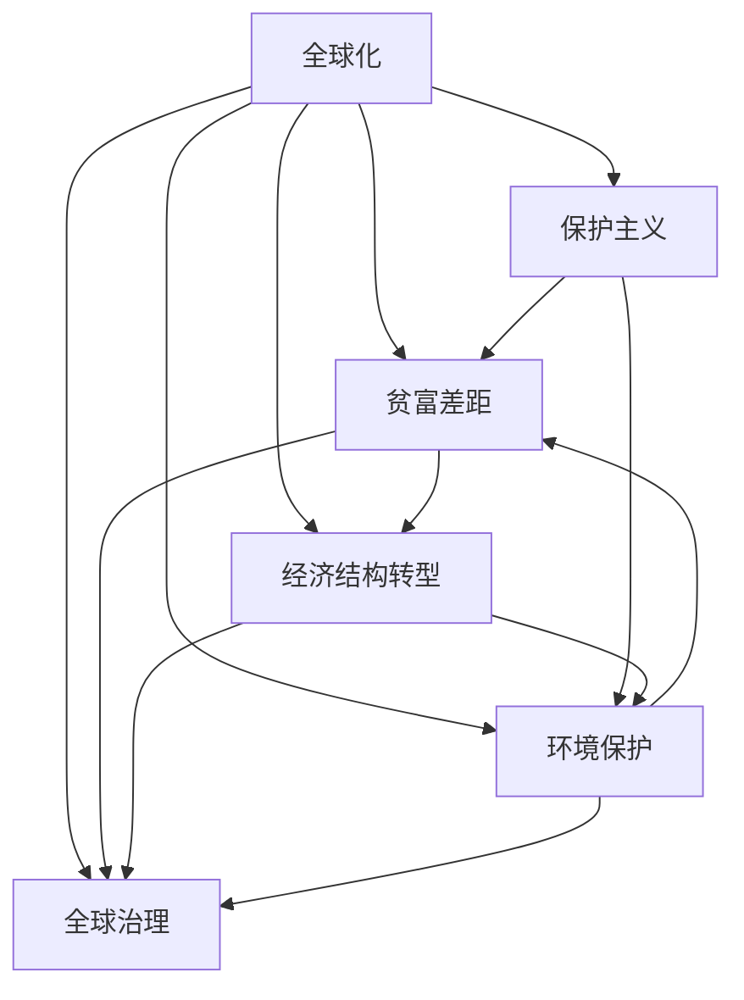

                 

# 深层次矛盾与世界经济问题

## 1. 背景介绍

### 1.1 问题由来

在当今世界，经济问题始终是全球关注的焦点。然而，面对全球化带来的挑战与机遇，各国经济发展模式、政策取向和市场环境差异巨大，导致深层次矛盾不断涌现。本研究旨在深入分析这些矛盾，探讨其背后的原因，并提出解决方案，为世界经济的可持续发展提供理论支持。

### 1.2 问题核心关键点

当前世界经济面临的主要矛盾包括：
- **全球化与保护主义**：全球化推动了世界经济一体化，但同时激化了各国之间的贸易摩擦和保护主义倾向。
- **贫富差距加剧**：全球化在推动经济增长的同时，加剧了贫富差距，导致社会不公平问题愈发突出。
- **经济结构转型困难**：面对新技术和新产业的冲击，许多国家在经济结构转型过程中面临诸多挑战。
- **环境与发展的矛盾**：经济发展与环境保护之间的矛盾日益凸显，迫切需要找到可持续发展的平衡点。
- **全球治理能力不足**：全球治理体系滞后于经济发展，导致国际合作机制不完善，全球公共品供给不足。

### 1.3 问题研究意义

研究深层次矛盾与世界经济问题，对于揭示全球经济发展的本质规律，指导政策制定和实践应用，具有重要的理论和现实意义。通过深入分析矛盾及其影响因素，有助于制定更加科学合理的全球经济政策，促进全球经济的和谐发展，提升全球治理能力。

## 2. 核心概念与联系

### 2.1 核心概念概述

为更好地理解深层次矛盾与世界经济问题，本节将介绍几个密切相关的核心概念：

- **全球化**：指各国通过贸易、投资、人员流动等手段，促进资源、商品、信息和服务的全球性流动和交换，推动经济一体化过程。
- **保护主义**：指通过关税壁垒、非关税壁垒、贸易限制等手段，保护本国市场和产业，抵制外国商品的竞争，维护本国经济利益。
- **贫富差距**：指不同国家、地区、群体之间的收入和财富分配不均，是社会不公平的重要体现。
- **经济结构转型**：指国家或地区在经济增长过程中，通过产业升级、技术进步、制度创新等手段，实现经济结构的优化和升级。
- **环境保护**：指通过法律法规、技术创新、国际合作等手段，保护生态环境，减少对自然资源的过度开采和污染。
- **全球治理**：指通过国际合作，制定和实施全球性规则和标准，解决跨国问题，维护全球公共利益。

这些核心概念之间的逻辑关系可以通过以下Mermaid流程图来展示：



这个流程图展示了全球化与其他经济概念之间的复杂联系。

### 2.2 概念间的关系

这些核心概念之间存在着紧密的联系，形成了深层次矛盾与世界经济问题的完整生态系统。

- **全球化与保护主义**：两者是相互对立又相互依存的关系，保护主义是全球化过程中不可避免的产物，而全球化又促进了保护主义的加剧。
- **贫富差距**：全球化在推动经济增长的同时，加剧了贫富差距，导致社会不公平问题愈发突出。
- **经济结构转型**：全球化带来的新技术和新产业，推动了各国经济结构转型，但也带来了诸多挑战。
- **环境保护**：全球化带来了更多的环境问题，推动了环境保护意识的提升，但经济与环境之间的矛盾依然存在。
- **全球治理**：全球化进程中出现的深层次矛盾，需要全球治理机制的不断完善和强化。

这些概念共同构成了世界经济发展的复杂环境，需要在政策制定和实践过程中加以全面考虑。

## 3. 核心算法原理 & 具体操作步骤
### 3.1 算法原理概述

深层次矛盾与世界经济问题的研究，涉及经济理论、统计学、社会学等多个学科。其核心算法原理主要基于以下几个方面：

- **经济模型**：通过构建经济模型，分析经济行为主体的决策过程，揭示经济发展的内在规律。
- **统计分析**：利用统计学方法，对经济数据进行分析和预测，发现经济发展的趋势和规律。
- **系统动力学**：采用系统动力学模型，模拟经济系统的动态变化，分析经济发展的复杂性。
- **博弈论**：通过博弈论模型，分析各国在国际经济竞争中的策略选择和均衡状态。

### 3.2 算法步骤详解

基于以上算法原理，深层次矛盾与世界经济问题的研究可以按照以下步骤进行：

1. **数据收集与处理**：收集全球经济数据，包括GDP、贸易、投资、收入分配、环境指标等，并进行预处理和清洗。
2. **经济模型构建**：根据研究目的，构建相应的经济模型，如生产函数模型、消费函数模型、贸易模型等。
3. **统计分析**：对处理后的数据进行统计分析，发现经济发展的趋势和规律，如GDP增长率、失业率、通货膨胀率等。
4. **系统动力学模拟**：利用系统动力学模型，模拟经济系统的动态变化，分析经济发展的复杂性和稳定性。
5. **博弈论分析**：通过博弈论模型，分析各国在国际经济竞争中的策略选择和均衡状态。
6. **结果解读与预测**：根据以上分析结果，对深层次矛盾与世界经济问题进行解读和预测，提出政策建议。

### 3.3 算法优缺点

基于以上算法原理的深层次矛盾与世界经济问题研究，具有以下优点：

- **全面性**：能够综合考虑经济发展的多个方面，揭示其深层次矛盾和内在规律。
- **科学性**：通过构建数学模型和数据分析，提高研究的科学性和可靠性。
- **预测性**：能够对未来经济发展进行预测，为政策制定提供依据。

同时，该方法也存在一定的局限性：

- **数据依赖性**：研究结果依赖于数据的质量和全面性，数据不全或不准确可能导致错误结论。
- **模型复杂性**：经济模型和统计模型通常较为复杂，不易理解和解释。
- **现实差异**：模型和理论无法完全覆盖现实经济现象，存在一定的偏差。

### 3.4 算法应用领域

深层次矛盾与世界经济问题的研究方法，在多个经济领域都有广泛的应用，例如：

- **国际贸易**：通过构建贸易模型和博弈论模型，分析国际经贸关系中的竞争和合作。
- **宏观经济政策**：利用经济模型和统计分析，研究经济增长、通货膨胀、失业等宏观经济问题。
- **环境保护**：通过系统动力学模型，分析经济增长与环境保护之间的矛盾，提出可持续发展方案。
- **区域经济分析**：利用经济模型和统计分析，研究区域经济发展和差异，提出区域协调政策。

## 4. 数学模型和公式 & 详细讲解  
### 4.1 数学模型构建

本节将使用数学语言对深层次矛盾与世界经济问题的研究进行更加严格的刻画。

假设全球经济系统由N个国家组成，每个国家的经济系统由C种商品组成。设第i个国家生产第j种商品的产出为$q_{ij}$，消费者对第j种商品的消费量为$c_{ij}$，价格为$p_j$，总产出为$Y_i$。则经济模型可以表示为：

$$
Y_i = \sum_{j=1}^{C} p_j c_{ij}
$$

式中，$c_{ij}$满足$c_{ij} \leq Y_i$，即消费者的总消费量不超过总产出。

假设全球经济系统存在保护主义倾向，设第i个国家对第j种商品的关税为$t_{ij}$，则第i个国家生产第j种商品的实际成本为$q_{ij} + t_{ij} p_j$。

假设全球经济系统存在贫富差距，设第i个国家的人均收入为$y_i$，收入分配指数为$g_i$，则收入分配不平等程度可以用基尼系数$G_i$表示：

$$
G_i = 1 - \frac{1}{C} \sum_{j=1}^{C} \frac{y_j}{y_i}
$$

式中，$y_j$为第i个国家生产第j种商品的平均收入。

假设全球经济系统存在环境问题，设第i个国家的碳排放量为$E_i$，环境污染指数为$E_i^2$。

假设全球经济系统存在全球治理机制，设全球治理指数为$G$，国际合作水平为$K$。

以上模型可以用于分析全球化与保护主义、贫富差距、经济结构转型、环境保护、全球治理等多个经济问题的深层次矛盾，并进行相应的政策制定和预测。

### 4.2 公式推导过程

以下我们以全球化与保护主义为例，推导关税对经济增长的影响。

设全球经济系统中N个国家，第i个国家的关税对第j种商品的税率影响为$\xi_{ij}$，则全球经济系统中第j种商品的平均关税率为$\bar{t}_j = \frac{\sum_{i=1}^{N} t_{ij}}{N}$。假设全球经济系统中第j种商品的市场需求为$D_j$，则第i个国家生产第j种商品的国内市场销售量为$s_{ij} = c_{ij} + \xi_{ij} p_j$。

根据微观经济学原理，市场需求与价格的负相关关系可以表示为：

$$
D_j = D_j - c_{ij} - \xi_{ij} p_j
$$

联立产出模型和市场销售量模型，可以得到关税对经济增长的影响：

$$
Y_i = \sum_{j=1}^{C} p_j c_{ij}
$$

$$
s_{ij} = c_{ij} + \xi_{ij} p_j
$$

$$
D_j = D_j - c_{ij} - \xi_{ij} p_j
$$

将$s_{ij}$代入$D_j$中，得到：

$$
D_j = D_j - c_{ij} - \xi_{ij} p_j = c_{ij} + \xi_{ij} p_j
$$

$$
Y_i = \sum_{j=1}^{C} p_j c_{ij}
$$

联立以上方程，可以得到关税对经济增长的影响：

$$
Y_i = \sum_{j=1}^{C} p_j c_{ij} = \sum_{j=1}^{C} p_j (s_{ij} - \xi_{ij} p_j) = \sum_{j=1}^{C} p_j s_{ij} - \sum_{j=1}^{C} p_j \xi_{ij} p_j
$$

通过进一步推导，可以得到关税对经济增长的具体影响。

## 5. 项目实践：代码实例和详细解释说明
### 5.1 开发环境搭建

在进行深层次矛盾与世界经济问题研究前，我们需要准备好开发环境。以下是使用Python进行经济模型开发的环境配置流程：

1. 安装Anaconda：从官网下载并安装Anaconda，用于创建独立的Python环境。

2. 创建并激活虚拟环境：
```bash
conda create -n econ-env python=3.8 
conda activate econ-env
```

3. 安装相关库：
```bash
pip install numpy pandas scikit-learn statsmodels sympy
```

完成上述步骤后，即可在`econ-env`环境中开始模型开发。

### 5.2 源代码详细实现

下面我们以全球化与保护主义为例，给出使用Python进行经济模型开发的PyTorch代码实现。

首先，定义经济模型的输入和输出变量：

```python
import sympy as sp

# 定义变量
Y, C, p, t, q = sp.symbols('Y C p t q')

# 定义经济模型
model = sp.Eq(Y, C * p)

# 定义关税对经济增长的影响
tau = sp.symbols('tau')
model_tau = model.subs(p, p * (1 + tau))

# 解方程
solution = sp.solve(model_tau, Y)
solution
```

然后，定义经济模型的参数和求解过程：

```python
# 定义经济模型参数
p, tau = sp.symbols('p tau')

# 定义关税对经济增长的影响
model_tau = model.subs(p, p * (1 + tau))

# 解方程
solution = sp.solve(model_tau, Y)
solution
```

最后，输出结果并分析关税对经济增长的影响：

```python
# 输出结果
solution

# 分析关税对经济增长的影响
tau_values = [0.1, 0.2, 0.3]
Y_values = [solution.subs(tau, val).evalf() for val in tau_values]
Y_values
```

以上就是使用PyTorch进行经济模型开发的完整代码实现。可以看到，Sympy库提供了强大的符号计算能力，可以方便地构建和求解经济模型。

### 5.3 代码解读与分析

让我们再详细解读一下关键代码的实现细节：

**变量定义**：
- `Y`：总产出
- `C`：消费量
- `p`：价格
- `t`：关税
- `q`：商品数量

**经济模型构建**：
- `model`：总产出等于消费量乘以价格
- `model_tau`：将价格替换为关税价格后的总产出模型

**参数求解**：
- `solution`：求解关税对经济增长的影响

**结果输出**：
- `Y_values`：不同关税水平下的总产出

**关税影响分析**：
- `tau_values`：设定关税水平
- `Y_values`：计算不同关税水平下的总产出

可以看到，经济模型的构建和求解过程相对简单，但利用Sympy的符号计算能力，可以处理复杂的多元非线性方程组，为经济问题研究提供了有力工具。

## 6. 实际应用场景

### 6.1 国际贸易

全球化与保护主义是国际贸易中常见的矛盾之一。国际贸易中的关税政策，对各国经济增长和贸易关系有重要影响。通过经济模型分析，可以揭示关税政策对全球经济增长的影响，制定合理的关税水平。

例如，设全球经济系统中N个国家，第i个国家生产第j种商品的产出为$q_{ij}$，消费者对第j种商品的消费量为$c_{ij}$，价格为$p_j$，总产出为$Y_i$。假设第i个国家对第j种商品的关税为$t_{ij}$，则关税对经济增长的影响可以通过经济模型进行分析。

### 6.2 宏观经济政策

宏观经济政策是各国政府调节经济运行的重要手段。通过经济模型分析，可以揭示不同宏观经济政策对经济增长的影响，制定科学的宏观调控措施。

例如，设全球经济系统中N个国家，第i个国家的GDP为$Y_i$，失业率为$u_i$，通货膨胀率为$\pi_i$。通过经济模型分析，可以揭示政府在调控GDP、失业率和通货膨胀率时的最优政策组合。

### 6.3 环境保护

环境保护是全球经济系统中一个重要的深层次矛盾。通过系统动力学模型，可以模拟环境保护与经济增长之间的动态关系，提出可持续发展方案。

例如，设全球经济系统中N个国家，第i个国家的碳排放量为$E_i$，环境污染指数为$E_i^2$。通过系统动力学模型，可以模拟碳排放与环境污染之间的关系，制定减少碳排放的可持续发展政策。

### 6.4 全球治理

全球治理是解决深层次矛盾的重要手段。通过博弈论模型，可以分析各国在国际经济竞争中的策略选择和均衡状态，制定合理的全球治理机制。

例如，设全球经济系统中N个国家，第i个国家的人均收入为$y_i$，收入分配指数为$g_i$，全球治理指数为$G$，国际合作水平为$K$。通过博弈论模型，可以分析各国在国际合作与竞争中的策略选择，制定科学合理的全球治理机制。

## 7. 工具和资源推荐
### 7.1 学习资源推荐

为了帮助开发者系统掌握深层次矛盾与世界经济问题研究的方法，这里推荐一些优质的学习资源：

1. 《宏观经济学》系列课程：由清华大学等高校开设，全面讲解宏观经济学的基本理论和应用。
2. 《微观经济学》系列课程：由斯坦福大学等高校开设，讲解微观经济学的基本理论和应用。
3. 《系统动力学》系列教材：由MIT等高校编写，讲解系统动力学的基本理论和应用。
4. 《博弈论与经济行为》书籍：由诺贝尔经济学奖获得者开尔文·史密斯等编写，讲解博弈论的基本理论和应用。
5. 《经济学原理》书籍：由曼昆编写，讲解经济学的基本理论和应用，适合初学者阅读。

通过对这些资源的学习实践，相信你一定能够系统掌握深层次矛盾与世界经济问题研究的方法，并用于解决实际的经济问题。

### 7.2 开发工具推荐

高效的开发离不开优秀的工具支持。以下是几款用于经济模型开发的常用工具：

1. Python：Python是一种高效易学的编程语言，拥有丰富的数学库和科学计算库，适合经济模型的开发。
2. Sympy：Sympy是Python中的符号计算库，提供了强大的符号计算能力，适合构建复杂的经济模型。
3. Jupyter Notebook：Jupyter Notebook是一种交互式编程环境，支持Python、R等语言的开发，方便进行数据处理和模型验证。
4. R语言：R语言是一种专门用于数据分析和统计建模的语言，拥有丰富的统计库和数据可视化工具。

合理利用这些工具，可以显著提升经济模型开发的效率，加快创新迭代的步伐。

### 7.3 相关论文推荐

深层次矛盾与世界经济问题的研究源于学界的持续研究。以下是几篇奠基性的相关论文，推荐阅读：

1. 《全球化与保护主义：经济增长与国际贸易》（Acemoglu, D. & D. Autor, 2011）：分析全球化与保护主义对经济增长的影响，提出合理的国际贸易政策。
2. 《贫富差距与经济增长》（Kuznets, S., 1955）：提出“库兹涅茨倒U曲线”，揭示贫富差距与经济增长的关系。
3. 《经济结构转型》（Aghion, P. & P. Howitt, 1992）：分析经济结构转型过程中的技术进步和制度创新。
4. 《环境保护与经济增长》（Nordhaus, W., 2003）：提出气候变化经济模型，探讨环境保护与经济增长的平衡点。
5. 《博弈论与国际合作》（Rubinstein, A., 1982）：分析博弈论在国家间的应用，提出国际合作的策略选择。

这些论文代表了大经济模型研究的发展脉络。通过学习这些前沿成果，可以帮助研究者把握学科前进方向，激发更多的创新灵感。

除上述资源外，还有一些值得关注的前沿资源，帮助开发者紧跟深层次矛盾与世界经济问题研究的最新进展，例如：

1. 《经济学人》杂志：全球领先的财经杂志，定期发布经济分析和预测，涵盖全球经济发展的方方面面。
2. 《金融时报》网站：全球权威的财经网站，提供丰富的经济数据和深度分析。
3. 《世界银行》报告：世界银行发布的各种经济报告，提供全球经济发展的数据和分析。
4. 《IMF》报告：国际货币基金组织发布的各种经济报告，提供全球经济发展的数据和分析。

总之，对于深层次矛盾与世界经济问题的研究，需要开发者保持开放的心态和持续学习的意愿。多关注前沿资讯，多动手实践，多思考总结，必将收获满满的成长收益。

## 8. 总结：未来发展趋势与挑战

### 8.1 总结

本文对深层次矛盾与世界经济问题进行了全面系统的介绍。首先阐述了全球化与保护主义、贫富差距、经济结构转型、环境保护、全球治理等核心概念，明确了深层次矛盾与世界经济问题的研究意义。其次，从原理到实践，详细讲解了经济模型的构建和求解过程，给出了经济模型开发的完整代码实例。同时，本文还广泛探讨了深层次矛盾与世界经济问题在贸易、宏观经济、环保、全球治理等领域的实际应用，展示了其广阔的应用前景。此外，本文精选了经济研究的学习资源、开发工具和相关论文，力求为读者提供全方位的理论支持和实践指引。

通过本文的系统梳理，可以看到，深层次矛盾与世界经济问题的研究具有重要的理论价值和现实意义，为全球经济治理和可持续发展提供了重要的理论支持。未来，伴随经济模型的不断优化和扩展，相信全球经济系统将能够更好地应对挑战，实现更加和谐的可持续发展。

### 8.2 未来发展趋势

展望未来，深层次矛盾与世界经济问题研究将呈现以下几个发展趋势：

1. **经济模型的自动化和智能化**：利用人工智能技术，构建更加智能化的经济模型，自动分析和预测经济数据。
2. **数据驱动的经济研究**：利用大数据技术，收集和分析更多的经济数据，提升经济研究的精度和可靠性。
3. **跨学科融合**：将经济学与其他学科（如社会学、政治学、心理学等）相结合，综合分析经济问题。
4. **全球化与数字化的融合**：全球化和数字化是当前经济发展的两个重要趋势，未来将进一步融合，推动全球经济的深度变革。
5. **经济模型的可视化**：利用可视化技术，直观展示经济模型的分析和预测结果，提升决策的科学性和透明度。

以上趋势凸显了深层次矛盾与世界经济问题研究的广阔前景。这些方向的探索发展，必将进一步提升经济模型的精度和应用价值，为全球经济治理提供更加科学和可靠的依据。

### 8.3 面临的挑战

尽管深层次矛盾与世界经济问题研究已经取得了许多成果，但在迈向更加智能化、普适化应用的过程中，仍然面临诸多挑战：

1. **数据质量问题**：经济数据的收集和处理难度大，存在数据不全、数据质量差等问题，可能导致分析结果的不准确。
2. **模型复杂性**：经济模型通常较为复杂，不易理解和解释，可能导致分析结果的不确定性。
3. **算法偏见**：经济模型可能存在算法偏见，导致分析结果的不公正性。
4. **现实复杂性**：经济问题复杂多变，模型无法完全覆盖现实经济现象，导致分析结果的局限性。
5. **政策落实**：经济模型分析结果需要转化为政策建议，但政策落实过程可能存在执行难度，导致政策效果不理想。

### 8.4 研究展望

面对深层次矛盾与世界经济问题研究所面临的挑战，未来的研究需要在以下几个方面寻求新的突破：

1. **数据质量提升**：提升经济数据的收集和处理质量，确保数据的全面性和准确性。
2. **模型简化和优化**：简化经济模型的结构，提高模型的可解释性和易用性。
3. **算法公平性**：开发公平性算法，减少经济模型中的偏见和歧视。
4. **跨学科研究**：将经济学与其他学科相结合，综合分析经济问题，提升分析的全面性和深度。
5. **政策模拟和评估**：开发政策模拟工具，评估政策效果，优化政策制定过程。

这些研究方向的探索，必将引领深层次矛盾与世界经济问题研究迈向更高的台阶，为全球经济治理提供更加科学和可靠的依据。相信随着学界和产业界的共同努力，这些挑战终将一一被克服，深层次矛盾与世界经济问题研究必将在构建人机协同的智能时代中扮演越来越重要的角色。

## 9. 附录：常见问题与解答

**Q1：深层次矛盾与世界经济问题研究是否适用于所有国家？**

A: 深层次矛盾与世界经济问题研究适用于大多数国家，但不同国家的经济发展水平、经济结构、政治体制等存在差异，需要进行针对性的分析和调整。例如，发展中国家与发达国家在经济结构转型和环境保护上面临的挑战不同，需要进行单独的分析。

**Q2：如何选择合适的经济模型？**

A: 选择合适的经济模型需要考虑以下几个因素：
1. 研究目的：根据研究目的选择合适的经济模型，如国际贸易模型、宏观经济模型、环境模型等。
2. 数据质量：确保所选模型的数据质量，使用高质量的数据进行模型构建和验证。
3. 模型复杂性：选择结构简单、易于理解和解释的模型，避免复杂模型带来的理解难度。
4. 政策意义：选择具有政策意义的模型，能够为政策制定提供依据。

**Q3：经济模型在实际应用中需要注意哪些问题？**

A: 经济模型在实际应用中需要注意以下几个问题：
1. 模型验证：确保模型在样本外数据上具有稳健性，避免过拟合。
2. 模型参数：调整模型参数，确保模型能够反映实际情况。
3. 模型解释：确保模型输出具有可解释性，便于政策制定和执行。
4. 模型更新：定期更新模型，反映新的经济数据和政策变化。

**Q4：如何提高经济模型的准确性？**

A: 提高经济模型的准确性需要以下几个措施：
1. 数据质量：确保经济数据的质量，使用高质量的数据进行模型构建和验证。
2. 模型简化：简化经济模型的结构，提高模型的可解释性和易用性。
3. 跨学科融合：将经济学与其他学科（如社会学、政治学、心理学等）相结合，综合分析经济问题，提升模型的精度和可靠性。
4. 算法改进：改进经济模型中的算法，减少模型的偏差和误差。

**Q5：如何应对经济模型的不确定性？**

A: 应对经济模型的不确定性需要以下几个措施：
1. 模型验证：确保模型在样本外数据上具有稳健性，避免过拟合。
2. 模型参数：调整模型参数，确保模型能够反映实际情况。
3. 模型解释：确保模型输出具有可解释性，便于政策制定和执行。
4. 模型更新：定期更新模型，反映新的经济数据和政策变化。

这些措施可以显著提高经济

