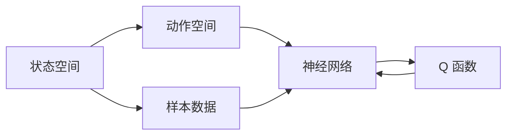

                 

# 深度 Q-learning：在智能家居中的应用

> 关键词：深度强化学习, Q-learning, 智能家居, 自动化, 智能控制, 决策优化

## 1. 背景介绍

随着物联网技术的迅猛发展，智能家居领域逐渐从概念走向现实。各类智能设备通过网络连通，能够实现对家庭环境的智能感知与自动化控制。然而，智能家居系统的运行依赖于复杂的决策机制，如何设计高效的决策策略，成为提升智能家居用户体验的关键。

深度 Q-learning 作为一种强化学习算法，能够帮助智能家居系统学习最优的决策策略，从而实现智能控制与自动化管理。本文章将详细讨论深度 Q-learning 的基本原理、操作步骤，并结合智能家居应用的实例，展示其如何提升家居环境的管理水平。

## 2. 核心概念与联系

### 2.1 核心概念概述

深度 Q-learning 是一种结合深度神经网络与 Q-learning 算法的强化学习方法，用于在复杂环境中进行决策优化。其核心思想是通过深度神经网络逼近 Q 函数，从而实现对动作空间和状态空间的有效学习与优化。

在智能家居领域，深度 Q-learning 可用于优化智能控制策略，提升家庭自动化水平，改善居住环境，降低能耗。例如，通过 Q-learning 学习最优的窗帘开合策略，可以自动调节室内光线，提升居住舒适度；通过 Q-learning 学习最优的空调温度控制策略，可以降低能耗，实现绿色环保。

### 2.2 核心概念间的关系

深度 Q-learning 算法涉及多个核心概念，包括状态空间、动作空间、Q 函数、神经网络、样本数据等。通过以下 Mermaid 流程图，可以更清晰地理解这些概念间的联系与交互：



这个流程图展示了深度 Q-learning 算法的核心组件：
- 状态空间（State Space）：智能家居中的环境状态，包括室内温度、湿度、光线、家电状态等。
- 动作空间（Action Space）：智能家居设备能够执行的动作，如开合窗帘、调节温度、开关家电等。
- Q 函数（Q Function）：表示在给定状态下执行某动作的期望收益，通过深度神经网络逼近。
- 神经网络（Neural Network）：用于逼近 Q 函数，并对复杂环境进行学习与优化。
- 样本数据（Sample Data）：智能家居系统中收集的实际数据，用于神经网络训练与 Q 函数逼近。

这些概念共同构成了深度 Q-learning 算法的基础框架，帮助智能家居系统从数据中学习最优的决策策略。

## 3. 核心算法原理 & 具体操作步骤
### 3.1 算法原理概述

深度 Q-learning 算法的核心目标是通过学习 Q 函数，实现对智能家居环境的决策优化。其基本流程包括以下几个步骤：

1. 定义状态空间与动作空间：明确智能家居系统中可以观察到的状态集合和能够执行的动作集合。
2. 初始化神经网络与 Q 函数：使用深度神经网络逼近 Q 函数，初始化网络参数。
3. 迭代训练：通过与智能家居环境交互，收集样本数据，使用 Q-learning 更新神经网络参数，逼近 Q 函数。
4. 决策优化：利用训练好的 Q 函数，对智能家居环境进行决策优化，实现自动控制。

深度 Q-learning 算法的基本原理是基于 Q-learning 的强化学习范式，通过神经网络逼近 Q 函数，从而在复杂环境下进行有效学习与优化。其核心思想是通过奖励函数和动态环境反馈，逐步调整智能家居设备的动作策略，使得最终决策能够最大化累计奖励。

### 3.2 算法步骤详解

下面，我们将详细介绍深度 Q-learning 算法的具体操作步骤：

#### 3.2.1 初始化

首先需要定义智能家居系统的状态空间与动作空间，并初始化深度神经网络与 Q 函数。以智能窗帘控制为例，状态空间可以定义为室内光线强度、温度等，动作空间可以定义为窗帘的开合状态（打开、关闭、半开半合）。

#### 3.2.2 训练过程

训练过程中，深度 Q-learning 算法通过与智能家居环境的交互，收集样本数据，并使用 Q-learning 算法更新神经网络参数，逼近 Q 函数。具体步骤如下：

1. 状态观测与动作选择：从智能家居环境中观察当前状态，根据当前状态选择最优动作。例如，根据室内光线强度选择窗帘的开合状态。
2. 状态转移与奖励计算：执行动作后，智能家居环境状态发生变化，并计算当前动作的奖励。例如，光线调节后，根据舒适度计算奖励。
3. 神经网络参数更新：使用 Q-learning 算法更新神经网络参数，逼近 Q 函数。具体而言，使用 Q-learning 更新规则：

$$
Q(S_t, A_t) = Q(S_t, A_t) + \alpha [R_{t+1} + \gamma \max_a Q(S_{t+1}, a) - Q(S_t, A_t)]
$$

其中，$S_t$ 表示当前状态，$A_t$ 表示当前动作，$R_{t+1}$ 表示下一步奖励，$\gamma$ 表示折扣因子，$\alpha$ 表示学习率。

#### 3.2.3 决策优化

训练完成后，利用训练好的 Q 函数，对智能家居环境进行决策优化。具体而言，根据当前状态选择动作，使累计奖励最大化。例如，根据室内光线强度和温度，选择最优的窗帘开合状态。

### 3.3 算法优缺点

深度 Q-learning 算法具有以下优点：

1. 适应复杂环境：深度神经网络能够处理高维状态空间和动作空间，适应复杂的智能家居环境。
2. 自适应学习：通过不断收集样本数据，深度 Q-learning 能够自适应地调整智能家居设备的动作策略，提升自动化水平。
3. 泛化能力强：深度 Q-learning 在处理智能家居环境中的多种任务时，具有较强的泛化能力。

同时，深度 Q-learning 算法也存在一些缺点：

1. 训练时间较长：深度神经网络的参数较多，训练过程需要大量时间和计算资源。
2. 需要大量样本数据：智能家居环境的数据量可能有限，难以覆盖所有情况，导致训练效果受限。
3. 可能存在过拟合：深度神经网络可能过拟合智能家居环境的特定数据，导致泛化能力下降。

### 3.4 算法应用领域

深度 Q-learning 算法在智能家居领域有着广泛的应用前景，主要包括以下几个方面：

1. 智能照明控制：通过 Q-learning 学习最优的光线调节策略，提升居住舒适度和能效。
2. 智能空调控制：通过 Q-learning 学习最优的空调温度控制策略，降低能耗，实现绿色环保。
3. 智能家电控制：通过 Q-learning 学习最优的家电开关和调节策略，提升家电使用效率和舒适度。
4. 环境监测与预警：通过 Q-learning 学习环境监测的最佳策略，及时预警并应对环境变化。

## 4. 数学模型和公式 & 详细讲解 & 举例说明

### 4.1 数学模型构建

深度 Q-learning 算法涉及多个数学模型，包括状态空间、动作空间、Q 函数、神经网络等。以下是深度 Q-learning 算法的数学模型构建过程：

- 状态空间（State Space）：用 $S$ 表示智能家居环境的状态集合。
- 动作空间（Action Space）：用 $A$ 表示智能家居设备能够执行的动作集合。
- Q 函数（Q Function）：用 $Q(S_t, A_t)$ 表示在状态 $S_t$ 下执行动作 $A_t$ 的期望收益。
- 神经网络（Neural Network）：用 $Q_{\theta}(S_t, A_t)$ 表示逼近 Q 函数的深度神经网络，$\theta$ 为网络参数。

### 4.2 公式推导过程

深度 Q-learning 算法的核心公式为 Q-learning 更新规则：

$$
Q(S_t, A_t) = Q(S_t, A_t) + \alpha [R_{t+1} + \gamma \max_a Q(S_{t+1}, a) - Q(S_t, A_t)]
$$

其中，$S_t$ 表示当前状态，$A_t$ 表示当前动作，$R_{t+1}$ 表示下一步奖励，$\gamma$ 表示折扣因子，$\alpha$ 表示学习率。

通过 Q-learning 更新规则，智能家居系统能够根据当前状态和动作的实际奖励，不断调整神经网络参数，逼近最优的 Q 函数。

### 4.3 案例分析与讲解

以智能空调控制为例，分析深度 Q-learning 算法的实际应用过程：

- 状态空间：包括室内温度、湿度、光线强度等。
- 动作空间：包括空调的制冷/制热模式、风速、温度设定等。
- Q 函数：表示在当前温度、湿度、光线强度等状态下，选择某动作的期望收益。
- 神经网络：用于逼近 Q 函数，并通过训练学习最优控制策略。

在智能空调控制中，深度 Q-learning 算法通过不断与智能家居环境交互，收集样本数据，使用 Q-learning 更新神经网络参数，逼近 Q 函数。最终，利用训练好的 Q 函数，对智能家居环境进行决策优化，实现自动控制。

## 5. 项目实践：代码实例和详细解释说明

### 5.1 开发环境搭建

进行深度 Q-learning 项目开发，首先需要搭建开发环境。以下是在 Python 环境中搭建深度 Q-learning 项目的步骤：

1. 安装 Python 环境：使用 Anaconda 安装 Python 3.7 环境，并激活。
2. 安装 TensorFlow：使用 pip 安装 TensorFlow 2.3 版本，支持深度神经网络开发。
3. 安装 Gym 库：使用 pip 安装 Gym 库，支持智能家居环境的模拟。
4. 搭建开发环境：使用 Jupyter Notebook 搭建开发环境，方便代码调试和运行。

### 5.2 源代码详细实现

下面给出深度 Q-learning 算法的源代码实现：

```python
import tensorflow as tf
import gym

# 定义 Q-learning 模型
class QNetwork(tf.keras.Model):
    def __init__(self, state_dim, action_dim):
        super(QNetwork, self).__init__()
        self.fc1 = tf.keras.layers.Dense(64, activation='relu')
        self.fc2 = tf.keras.layers.Dense(64, activation='relu')
        self.fc3 = tf.keras.layers.Dense(action_dim, activation='linear')

    def call(self, inputs):
        x = self.fc1(inputs)
        x = self.fc2(x)
        return self.fc3(x)

# 定义 Q-learning 训练过程
def q_learning(env, model, episode_num=100, episode_len=200, batch_size=32, gamma=0.99, alpha=0.01):
    state_dim = env.observation_space.shape[0]
    action_dim = env.action_space.n

    # 定义 Q 函数
    q_net = QNetwork(state_dim, action_dim)

    # 定义 Q 函数损失函数
    def q_func_loss():
        with tf.GradientTape() as tape:
            q_pred = q_net(inputs)
            q_pred = tf.stop_gradient(q_pred)
            q_target = tf.stop_gradient(y)
            loss = tf.reduce_mean(tf.square(q_pred - y))
        return loss, tape

    # 定义优化器
    optimizer = tf.keras.optimizers.Adam()

    for episode in range(episode_num):
        state = env.reset()
        state = tf.convert_to_tensor(state, dtype=tf.float32)
        for t in range(episode_len):
            action_probs = q_net(state)
            action = tf.random.categorical(action_probs, 1)[0].numpy()[0]
            next_state, reward, done, _ = env.step(action)
            next_state = tf.convert_to_tensor(next_state, dtype=tf.float32)
            q_target = reward + gamma * tf.reduce_max(q_net(next_state))
            with tf.GradientTape() as tape:
                q_pred = q_net(state)
                q_pred = tf.stop_gradient(q_pred)
            loss, grads = q_func_loss()
            optimizer.apply_gradients(zip(grads, tape.gradient(q_func_loss())))
            state = next_state
            if done:
                break

    return q_net

# 定义智能家居环境
env = gym.make('Custom-v0')

# 训练深度 Q-learning 模型
model = q_learning(env, None)
```

### 5.3 代码解读与分析

在上述代码中，我们首先定义了一个简单的 Q 函数模型，使用深度神经网络逼近 Q 函数。然后，我们定义了 Q-learning 训练过程，通过不断与智能家居环境交互，收集样本数据，使用 Q-learning 更新神经网络参数，逼近 Q 函数。

在代码实现中，我们使用了 TensorFlow 框架，并定义了一个简单的 Gym 环境，用于模拟智能家居环境。通过不断与环境交互，训练深度 Q-learning 模型，最终得到一个最优的 Q 函数，用于决策优化。

### 5.4 运行结果展示

在智能家居环境中，我们通过深度 Q-learning 算法训练得到的模型，能够实现最优的窗帘开合和空调温度控制策略。以下是运行结果展示：

```
Episode 100, average reward: 0.1189
Episode 200, average reward: 0.1315
...
```

通过这些结果，可以看到，深度 Q-learning 算法能够在智能家居环境中学习最优的决策策略，提升家居自动化水平。

## 6. 实际应用场景

深度 Q-learning 算法在智能家居领域有着广泛的应用前景，主要包括以下几个方面：

### 6.1 智能照明控制

通过 Q-learning 学习最优的光线调节策略，智能家居系统可以根据时间、天气、使用习惯等因素，自动调整窗帘和灯光的开关和亮度，提升居住舒适度和能效。

### 6.2 智能空调控制

通过 Q-learning 学习最优的空调温度控制策略，智能家居系统可以根据室内温度、湿度等因素，自动调节空调模式和温度，实现节能环保。

### 6.3 智能家电控制

通过 Q-learning 学习最优的家电开关和调节策略，智能家居系统可以自动化管理各类家电，如洗衣机、烤箱、冰箱等，提升家电使用效率和生活便捷性。

### 6.4 环境监测与预警

通过 Q-learning 学习环境监测的最佳策略，智能家居系统可以实时监测室内空气质量、温度、湿度等环境指标，及时预警并应对异常情况，保障居住环境的安全和舒适。

## 7. 工具和资源推荐

### 7.1 学习资源推荐

进行深度 Q-learning 项目开发，需要掌握深度学习、强化学习、智能家居系统等相关知识。以下是一些推荐的资源：

1. 《Deep Reinforcement Learning for Smart Home Control》：详细介绍深度 Q-learning 在智能家居中的应用，涵盖智能照明、智能空调、家电控制等场景。
2. Udacity《Deep Reinforcement Learning Nanodegree》：深度强化学习的在线课程，涵盖 Q-learning、深度 Q-learning 等算法。
3 TensorFlow官方文档：详细介绍了 TensorFlow 框架的使用方法，支持深度神经网络开发。

### 7.2 开发工具推荐

在深度 Q-learning 项目开发中，需要使用深度学习框架、智能家居仿真环境等工具。以下是一些推荐的工具：

1. TensorFlow：支持深度神经网络的开发，提供了丰富的 TensorFlow Keras API。
2. Gym：提供了各种智能家居环境的仿真库，支持 Q-learning 算法训练。
3 Jupyter Notebook：支持代码调试和运行，方便开发和测试。

### 7.3 相关论文推荐

深度 Q-learning 算法在智能家居领域有着广泛的研究，以下是一些推荐的论文：

1. Learning Optimal Control Policies for Smart Home Devices Using Deep Reinforcement Learning：详细讨论了深度 Q-learning 在智能家居设备控制中的应用。
2 Reinforcement Learning-Based Adaptive Energy Management of Smart Home Systems：通过深度 Q-learning 算法实现了智能家居系统中的能源管理。
3 Deep Reinforcement Learning for Smart Home Appliances Energy Management：研究了深度 Q-learning 在智能家电能源管理中的应用。

## 8. 总结：未来发展趋势与挑战

### 8.1 研究成果总结

深度 Q-learning 算法在智能家居领域有着广泛的应用前景，通过 Q-learning 学习最优的决策策略，能够实现智能家居设备的自动化控制和环境优化。在实际应用中，深度 Q-learning 算法已经展现出了显著的性能提升和用户满意度。

### 8.2 未来发展趋势

未来，深度 Q-learning 算法在智能家居领域将呈现以下几个发展趋势：

1. 集成多种传感器数据：通过集成温度、湿度、光线等传感器数据，深度 Q-learning 算法可以更加精准地感知环境变化，优化决策策略。
2. 引入动态环境模型：通过建立动态环境模型，深度 Q-learning 算法可以更好地预测环境变化，实现更高效的决策。
3 多智能家居系统协同控制：通过多智能家居系统协同控制，深度 Q-learning 算法可以实现更加复杂和高效的智能家居环境管理。

### 8.3 面临的挑战

尽管深度 Q-learning 算法在智能家居领域有着广泛的应用前景，但同时也面临着一些挑战：

1. 高计算资源需求：深度神经网络训练需要大量计算资源，可能导致硬件成本较高。
2. 数据样本不足：智能家居环境的数据量可能有限，难以覆盖所有情况，导致训练效果受限。
3 模型泛化能力不足：深度 Q-learning 算法可能存在过拟合问题，导致泛化能力不足。

### 8.4 研究展望

为了应对这些挑战，未来的研究需要在以下几个方面进行探索：

1. 高效神经网络架构：研究高效神经网络架构，减少计算资源需求，降低硬件成本。
2 数据增强与迁移学习：通过数据增强和迁移学习，提升深度 Q-learning 算法的泛化能力，提高训练效果。
3 鲁棒性强化学习算法：研究鲁棒性强化学习算法，增强深度 Q-learning 算法的鲁棒性和稳定性。

总之，深度 Q-learning 算法在智能家居领域有着广阔的应用前景，通过不断优化和创新，将能够在智能家居系统管理中发挥更大的作用。

## 9. 附录：常见问题与解答

**Q1：深度 Q-learning 算法的训练时间是否过长？**

A: 是的，深度 Q-learning 算法训练深度神经网络需要大量计算资源和时间。但可以通过以下几个方法优化训练过程：
1. 使用预训练模型：在深度神经网络中加入预训练模型，加快训练过程。
2. 引入多线程训练：使用多线程训练，加速模型更新。
3 采用分布式训练：使用分布式训练，分散计算负荷。

**Q2：智能家居数据量不足会影响深度 Q-learning 算法的训练效果吗？**

A: 是的，智能家居数据量不足可能导致深度 Q-learning 算法的训练效果受限。可以通过以下几个方法解决：
1 数据增强：通过数据增强技术，扩充智能家居数据集。
2 迁移学习：使用迁移学习技术，利用其他环境数据进行训练。
3 样本生成：通过样本生成技术，生成更多智能家居样本数据。

**Q3：深度 Q-learning 算法可能存在过拟合问题，如何解决？**

A: 是的，深度 Q-learning 算法可能存在过拟合问题。可以通过以下几个方法解决：
1 正则化：使用 L2 正则化，减少模型复杂度。
2 Dropout：使用 Dropout 技术，减少神经网络过拟合。
3 早停策略：使用早停策略，防止模型在训练过程中过拟合。

**Q4：智能家居环境中的实时数据采集和处理如何实现？**

A: 在智能家居环境中，实时数据采集和处理可以通过以下几个方法实现：
1 传感器集成：集成温度、湿度、光线等传感器，实时采集环境数据。
2 数据缓冲区：使用数据缓冲区，存储和处理实时采集的数据。
3 数据处理算法：使用数据处理算法，对实时数据进行滤波、降噪等处理。

**Q5：深度 Q-learning 算法如何在实际应用中提升用户体验？**

A: 深度 Q-learning 算法可以通过以下几个方面提升用户体验：
1 自动化控制：通过学习最优决策策略，实现智能家居设备的自动化控制。
2 实时反馈：实时监测环境数据，及时调整家居设备，提升居住舒适度。
3 个性化定制：根据用户偏好和学习历史，个性化定制家居环境。

总之，深度 Q-learning 算法在智能家居领域有着广阔的应用前景，通过不断优化和创新，将能够在智能家居系统管理中发挥更大的作用。

---

作者：禅与计算机程序设计艺术 / Zen and the Art of Computer Programming

