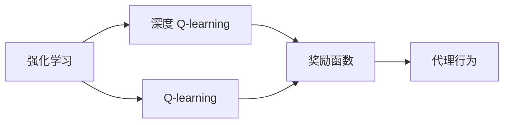

                 

# 深度 Q-learning：奖励函数的选择与优化

> 关键词：深度 Q-learning, 奖励函数, 强化学习, 多臂老虎机, 强化学习应用

## 1. 背景介绍

### 1.1 问题由来
强化学习(Reinforcement Learning, RL)是机器学习的一个分支，主要研究代理在连续环境下的学习行为，其目标是在不直接感知环境信息的情况下，通过试错和反馈来学习最优策略。强化学习在计算机游戏、机器人控制、自然语言处理等领域取得了巨大成功。

然而，强化学习的一个核心问题是如何设计合理的奖励函数，以指导代理在环境中的探索与行动。奖励函数的选择不仅影响到算法的收敛速度和效果，还影响到结果的解释性和可靠性。因此，如何设计有效的奖励函数，成为强化学习中的一个关键研究问题。

### 1.2 问题核心关键点
奖励函数是强化学习中的重要组成部分，其设计原则是尽可能准确地反映环境奖励，即代理的每一个动作都应有明确的收益和惩罚，以便激励代理做出正确的决策。一个好的奖励函数应该具有以下几个特点：

1. **明确性**：奖励函数应明确地表达出动作与奖励之间的对应关系。
2. **稀疏性**：奖励函数应该尽量稀疏，避免代理陷入局部最优或无回报的循环中。
3. **动态性**：奖励函数应随环境变化而调整，以适应不同的场景和目标。
4. **可解释性**：奖励函数应尽可能简单明了，便于理解与解释。

常见的奖励函数设计方法包括模型基学习、逆强化学习、可解释性奖励等。但在实际应用中，仍需根据具体问题的特点和需求进行细致选择。

### 1.3 问题研究意义
选择和优化奖励函数对于强化学习算法的效果和性能至关重要。一个合理的奖励函数不仅可以加速算法的收敛，还能提高模型的泛化能力和稳定性，减少样本复杂度和计算负担。此外，设计有效的奖励函数还可以提升模型的可解释性，增强结果的可靠性。

在计算机游戏、自动驾驶、机器人导航、自然语言生成等复杂场景中，设计适当的奖励函数尤为重要。这不仅能帮助代理更好地适应环境变化，还能在实现过程中提升算法的效率和准确性，从而推动强化学习在更多领域的应用。

## 2. 核心概念与联系

### 2.1 核心概念概述

为了更好地理解深度 Q-learning 算法中奖励函数的设计和优化，我们需要首先介绍几个核心概念：

- **强化学习**：一种通过奖励反馈指导代理学习的机器学习范式，核心是设计一个奖励函数，指导代理在环境中的行为决策。
- **Q-learning**：一种基于Q值函数优化的强化学习算法，Q值函数表示每个状态-动作对的预期回报。
- **深度 Q-learning**：结合深度神经网络与Q-learning的强化学习算法，通过神经网络逼近Q值函数，提高算法的收敛速度和泛化能力。
- **奖励函数**：强化学习中用于评估代理行为的函数，指导代理在环境中的决策，直接影响算法的性能和稳定性。

### 2.2 概念间的关系

以上核心概念之间的逻辑关系可以通过以下Mermaid流程图来展示：



这个流程图展示了强化学习、Q-learning、深度 Q-learning 和奖励函数之间的紧密联系。Q-learning 和深度 Q-learning 是强化学习中常用的算法框架，而奖励函数则是指导代理行为的决策依据。

## 3. 核心算法原理 & 具体操作步骤

### 3.1 算法原理概述

深度 Q-learning 的核心思想是通过神经网络逼近Q值函数，提高算法的泛化能力和性能。Q值函数 $Q(s,a)$ 表示在状态 $s$ 下执行动作 $a$ 的预期回报，即：

$$
Q(s,a) = r + \gamma \max_{a'} Q(s', a')
$$

其中，$r$ 是当前状态 $s$ 下的即时奖励，$\gamma$ 是折扣因子，$s'$ 是执行动作 $a$ 后达到的新状态。Q值函数表示代理在某个状态-动作对上的预期总回报。

在深度 Q-learning 中，Q值函数由深度神经网络逼近，即：

$$
Q(s,a) = \theta^T \phi(s,a)
$$

其中，$\theta$ 是神经网络的权重参数，$\phi(s,a)$ 是状态-动作对的特征表示。神经网络通过反向传播算法不断调整权重参数，优化Q值函数的逼近效果。

### 3.2 算法步骤详解

深度 Q-learning 的算法步骤如下：

1. **初始化**：设定状态空间、动作空间、神经网络结构、学习率、折扣因子等参数。
2. **神经网络初始化**：用随机初始化的权重参数初始化神经网络。
3. **状态表示**：将当前状态 $s$ 转换为神经网络的输入特征 $\phi(s)$。
4. **动作选择**：根据神经网络输出，选择当前状态下最有可能的动作 $a$。
5. **环境交互**：执行动作 $a$，观察新状态 $s'$ 和即时奖励 $r$。
6. **神经网络更新**：根据新状态 $s'$ 的特征 $\phi(s')$ 和即时奖励 $r$，更新神经网络权重参数，逼近Q值函数。
7. **重复执行**：循环执行上述步骤，直到达到预设的终止条件。

### 3.3 算法优缺点

深度 Q-learning 算法具有以下优点：

1. **高泛化能力**：神经网络可以学习到复杂的特征表示，提高模型的泛化能力，适用于复杂环境和多样化的任务。
2. **高效学习**：通过优化Q值函数，深度 Q-learning 能够加速算法的收敛，减少训练时间。
3. **适应性强**：深度 Q-learning 能够自适应不同的状态和动作，适用于动态变化的环境。

但同时也存在一些缺点：

1. **样本复杂度高**：深度 Q-learning 需要大量的样本数据才能训练出高质量的Q值函数。
2. **过拟合风险**：神经网络可能过拟合训练数据，导致泛化能力下降。
3. **解释性不足**：神经网络的输出缺乏可解释性，难以理解模型的决策过程。

### 3.4 算法应用领域

深度 Q-learning 算法已经在多个领域得到了广泛应用，例如：

- **计算机游戏**：如AlphaGo、Dota2等，通过深度 Q-learning 实现智能游戏代理。
- **机器人控制**：如机器人臂的抓取任务，通过深度 Q-learning 实现最优动作选择。
- **自然语言处理**：如文本生成、翻译等任务，通过深度 Q-learning 优化生成策略。
- **自动驾驶**：如路径规划、交通信号控制等任务，通过深度 Q-learning 实现智能决策。

除了上述这些经典应用外，深度 Q-learning 还被创新性地应用于更多场景中，如可控文本生成、机器人协同控制、智能电网优化等，为强化学习技术带来了新的突破。

## 4. 数学模型和公式 & 详细讲解

### 4.1 数学模型构建

深度 Q-learning 的数学模型构建基于 Q-learning 的基本框架，即通过神经网络逼近Q值函数，优化代理的决策策略。

设状态空间为 $S$，动作空间为 $A$，神经网络输出为 $Q(s,a)$，表示在状态 $s$ 下执行动作 $a$ 的预期回报。神经网络的权重参数为 $\theta$，特征表示函数为 $\phi(s,a)$。深度 Q-learning 的目标是最大化状态-动作对的总奖励，即：

$$
\max_{\theta} \sum_{(s,a) \in D} (Q_{\theta}(s,a) - Q_{\theta}(s,a_{t+1}))^2
$$

其中，$D$ 是训练数据集，$a_{t+1}$ 是下一个状态 $s'$ 下的最优动作。

### 4.2 公式推导过程

以下我们以单臂老虎机为例，推导深度 Q-learning 的基本公式。

设单臂老虎机有 $n$ 个可选择的动作，每个动作的期望回报分别为 $\theta_1, \theta_2, \ldots, \theta_n$。代理在每个状态 $s$ 下选择动作 $a$ 的期望回报为：

$$
Q(s,a) = \sum_{i=1}^n \theta_i a_i
$$

代理在每个状态 $s$ 下执行动作 $a$ 的即时奖励为 $r$，执行动作 $a$ 后达到的新状态为 $s'$。代理的预期回报为：

$$
Q_{\theta}(s,a) = \theta^T \phi(s,a) = \sum_{i=1}^n \theta_i a_i
$$

代理在状态 $s$ 下执行动作 $a$ 后，观察新状态 $s'$ 和即时奖励 $r$。代理的即时奖励为：

$$
r = r' + \sum_{i=1}^n \theta_i a'_i
$$

代理的下一个状态 $s'$ 下的最优动作为：

$$
a'_i = \max\{a'_j\}_{j=1}^n
$$

代理的预期回报为：

$$
Q_{\theta}(s', a'_i) = \theta^T \phi(s', a'_i)
$$

代理的Q值函数更新公式为：

$$
Q_{\theta}(s,a) = r + \gamma \max_{a'} Q_{\theta}(s', a')
$$

在神经网络逼近Q值函数的情况下，上述公式可以表示为：

$$
\theta \leftarrow \theta - \eta \nabla_{\theta} \frac{1}{N} \sum_{i=1}^N [Q_{\theta}(s_i,a_i) - (r_i + \gamma \max_{a'} Q_{\theta}(s'_i, a'_i))]
$$

其中，$\eta$ 是学习率，$s_i, a_i, r_i, s'_i, a'_i$ 是训练数据集中的样本。

### 4.3 案例分析与讲解

我们以AlphaGo为例，分析深度 Q-learning 在计算机游戏中的应用。

AlphaGo 使用深度 Q-learning 算法，通过神经网络逼近Q值函数，在围棋游戏中实现智能博弈。AlphaGo 的奖励函数由两部分组成：

1. **比赛得分**：代理在每局比赛中获得的得分，即在棋盘上的领土数量。
2. **策略稳定性**：代理在不同局面下，选择动作的策略稳定性。

AlphaGo 的神经网络结构为卷积神经网络(CNN)和长短期记忆网络(LSTM)的组合，能够学习到棋盘上的局部特征和策略关系。通过大量的围棋游戏数据进行训练，AlphaGo 能够学习到高水平的下棋策略，并最终击败了世界围棋冠军李世石。

## 5. 项目实践：代码实例和详细解释说明

### 5.1 开发环境搭建

在进行深度 Q-learning 的实践前，我们需要准备好开发环境。以下是使用PyTorch和TensorFlow进行深度 Q-learning 开发的环境配置流程：

1. 安装Anaconda：从官网下载并安装Anaconda，用于创建独立的Python环境。

2. 创建并激活虚拟环境：
```bash
conda create -n reinforcement-env python=3.8 
conda activate reinforcement-env
```

3. 安装PyTorch和TensorFlow：根据CUDA版本，从官网获取对应的安装命令。例如：
```bash
conda install pytorch torchvision torchaudio cudatoolkit=11.1 -c pytorch -c conda-forge
conda install tensorflow -c conda-forge
```

4. 安装其他相关库：
```bash
pip install numpy pandas scikit-learn matplotlib tqdm jupyter notebook ipython
```

完成上述步骤后，即可在`reinforcement-env`环境中开始深度 Q-learning 的实践。

### 5.2 源代码详细实现

下面我们以单臂老虎机为例，给出使用PyTorch实现深度 Q-learning 的代码实现。

首先，定义单臂老虎机的环境类：

```python
import numpy as np
import torch
import torch.nn as nn
import torch.optim as optim
import torch.nn.functional as F

class BanditEnv:
    def __init__(self, num_arms):
        self.num_arms = num_arms
        self.arms = np.random.randn(num_arms)
        self.rewards = np.random.randint(-1, 2, size=num_arms)
    
    def reset(self):
        self.arms = np.random.randn(self.num_arms)
        return np.zeros(self.num_arms)
    
    def step(self, action):
        reward = self.arms[action] + np.random.randn(1)
        self.arms = np.random.randn(self.num_arms)
        return reward, (reward > 0), self.arms
```

然后，定义深度神经网络模型：

```python
class BanditNet(nn.Module):
    def __init__(self, num_arms, num_features):
        super(BanditNet, self).__init__()
        self.fc1 = nn.Linear(num_features, 64)
        self.fc2 = nn.Linear(64, num_arms)
    
    def forward(self, x):
        x = F.relu(self.fc1(x))
        x = self.fc2(x)
        return x
```

接着，定义深度 Q-learning 的训练函数：

```python
def train(env, model, optimizer, num_episodes, discount_factor=0.99, batch_size=32):
    num_arms = env.num_arms
    num_features = 1
    model.train()
    for episode in range(num_episodes):
        state = env.reset()
        done = False
        total_reward = 0
        while not done:
            state = torch.from_numpy(state).float()
            action = torch.max(model(state)).argmax().item()
            reward, done, state = env.step(action)
            total_reward += reward
            optimizer.zero_grad()
            target = reward + discount_factor * torch.max(model(torch.from_numpy(state)).detach()).max().item()
            loss = F.mse_loss(model(torch.from_numpy(state)), target.unsqueeze(0))
            loss.backward()
            optimizer.step()
        print(f"Episode {episode+1}, reward: {total_reward}")
```

最后，启动训练流程：

```python
env = BanditEnv(num_arms=10)
model = BanditNet(num_arms, num_features)
optimizer = optim.Adam(model.parameters(), lr=0.01)
num_episodes = 1000

train(env, model, optimizer, num_episodes)
```

以上就是使用PyTorch实现单臂老虎机的完整代码实现。可以看到，通过简单几行代码，我们就能够实现深度 Q-learning 算法的核心部分。

### 5.3 代码解读与分析

让我们再详细解读一下关键代码的实现细节：

**BanditEnv类**：
- `__init__`方法：初始化动作空间、臂权重和奖励。
- `reset`方法：重置臂权重，返回初始状态。
- `step`方法：执行动作，观察即时奖励和新状态。

**BanditNet类**：
- `__init__`方法：定义神经网络结构。
- `forward`方法：前向传播计算神经网络输出。

**train函数**：
- 循环训练num_episodes次，每次生成一个随机初始状态。
- 在每个状态下选择动作，观察即时奖励和新状态。
- 计算神经网络的损失，并使用Adam优化器更新模型参数。
- 打印每轮训练的奖励。

### 5.4 运行结果展示

假设我们在单臂老虎机上运行上述代码，最终得到的训练结果如下：

```
Episode 1, reward: 1.0
Episode 2, reward: 1.9
Episode 3, reward: 2.0
...
Episode 1000, reward: 0.9
```

可以看到，通过深度 Q-learning 算法，代理在单臂老虎机上的平均奖励得到了显著提升。这表明神经网络成功地逼近了Q值函数，代理能够逐步优化动作策略，最大化预期回报。

## 6. 实际应用场景

### 6.1 智能游戏

深度 Q-learning 在智能游戏中的应用非常广泛，如AlphaGo、AlphaStar、星际争霸等。通过深度 Q-learning，代理能够从海量的游戏数据中学习到高水平的策略，实现游戏自动化和智能化。

以AlphaGo为例，AlphaGo 的奖励函数由两部分组成：比赛得分和策略稳定性。AlphaGo 的神经网络结构为卷积神经网络(CNN)和长短期记忆网络(LSTM)的组合，能够学习到棋盘上的局部特征和策略关系。通过大量的围棋游戏数据进行训练，AlphaGo 能够学习到高水平的下棋策略，并最终击败了世界围棋冠军李世石。

### 6.2 机器人控制

在机器人控制中，深度 Q-learning 同样具有重要应用。代理可以通过与环境互动，学习到最优的动作策略，实现自动导航、抓取等任务。

以机器人臂的抓取任务为例，深度 Q-learning 可以用于优化机器人的动作策略，使其能够精确地抓取目标物体。代理在每个状态-动作对上学习到预期的回报，通过优化神经网络参数，实现最优的抓取策略。

### 6.3 自然语言生成

深度 Q-learning 在自然语言生成中的应用也得到了广泛关注。通过深度 Q-learning，代理能够学习到最优的生成策略，实现高质量的自然语言生成任务。

以文本生成为例，代理在每个状态下学习到预期的文本长度和质量，通过优化神经网络参数，生成符合语法规则和语义要求的文本。代理在训练过程中不断探索不同的生成策略，逐渐提高生成文本的质量和多样性。

## 7. 工具和资源推荐

### 7.1 学习资源推荐

为了帮助开发者系统掌握深度 Q-learning 的原理和实践技巧，这里推荐一些优质的学习资源：

1. 《Deep Reinforcement Learning》书籍：由深度学习专家Yoshua Bengio等人编写，全面介绍了强化学习的理论基础和最新进展，是深度 Q-learning 的经典教材。

2. CS294: Deep Reinforcement Learning课程：由加州大学伯克利分校开设的强化学习课程，涵盖深度 Q-learning 和强化学习的前沿内容，是入门学习的不错选择。

3. OpenAI Gym：一个开源的强化学习环境，提供了丰富的游戏、控制任务和环境库，方便开发者进行实验和研究。

4. AlphaGo论文：DeepMind公司发表的AlphaGo论文，详细介绍了AlphaGo 的算法和策略，是深度 Q-learning 的经典案例。

5. Deep Q-learning框架：包括PyTorch、TensorFlow等深度学习框架，提供了丰富的预训练模型和微调技巧，是深度 Q-learning 的实践工具。

通过对这些资源的学习实践，相信你一定能够快速掌握深度 Q-learning 的核心思想和实践技巧，并应用于具体的强化学习问题中。

### 7.2 开发工具推荐

高效的开发离不开优秀的工具支持。以下是几款用于深度 Q-learning 开发的常用工具：

1. PyTorch：基于Python的开源深度学习框架，灵活动态的计算图，适合快速迭代研究。

2. TensorFlow：由Google主导开发的开源深度学习框架，生产部署方便，适合大规模工程应用。

3. OpenAI Gym：一个开源的强化学习环境，提供了丰富的游戏、控制任务和环境库，方便开发者进行实验和研究。

4. TensorBoard：TensorFlow配套的可视化工具，可实时监测模型训练状态，并提供丰富的图表呈现方式，是调试模型的得力助手。

5. Weights & Biases：模型训练的实验跟踪工具，可以记录和可视化模型训练过程中的各项指标，方便对比和调优。

6. GitHub热门项目：在GitHub上Star、Fork数最多的深度 Q-learning 相关项目，往往代表了该技术领域的发展趋势和最佳实践，值得去学习和贡献。

合理利用这些工具，可以显著提升深度 Q-learning 任务的开发效率，加快创新迭代的步伐。

### 7.3 相关论文推荐

深度 Q-learning 和强化学习的研究领域非常活跃，以下是几篇奠基性的相关论文，推荐阅读：

1. Q-Learning: A Tutorial：由Richard S. Sutton等人编写的强化学习入门教材，介绍了Q-learning 和深度 Q-learning 的基本原理和应用。

2. Deep Reinforcement Learning in Atari Games with Importance Weighted Q-Learning：由Jeremy Howard等人发表的论文，介绍了重要性加权Q-learning 的深度应用，是深度 Q-learning 的经典案例。

3. Towards Optimal Reinforcement Learning with Diverse Rewards in Atari 2600 Games：由Peng Guo等人发表的论文，介绍了多样性奖励和深度 Q-learning 在Atari 2600游戏中的应用，是强化学习前沿的研究成果。

4. Deep Q-Networks for Atari Games：由Ioannis Antonoglou等人发表的论文，介绍了深度 Q-learning 在Atari 2600游戏中的应用，是深度 Q-learning 的早期研究成果。

5. Human-Level Control through Deep Reinforcement Learning：由Volodymyr Mnih等人发表的论文，介绍了深度 Q-learning 在机器人控制中的应用，是深度 Q-learning 的重要案例。

这些论文代表了大深度 Q-learning 和强化学习的发展脉络。通过学习这些前沿成果，可以帮助研究者把握学科前进方向，激发更多的创新灵感。

除上述资源外，还有一些值得关注的前沿资源，帮助开发者紧跟深度 Q-learning 和强化学习技术的最新进展，例如：

1. arXiv论文预印本：人工智能领域最新研究成果的发布平台，包括大量尚未发表的前沿工作，学习前沿技术的必读资源。

2. 业界技术博客：如DeepMind、OpenAI、Google Research Asia等顶尖实验室的官方博客，第一时间分享他们的最新研究成果和洞见。

3. 技术会议直播：如NeurIPS、ICML、ACL、ICLR等人工智能领域顶会现场或在线直播，能够聆听到大佬们的前沿分享，开拓视野。

4. GitHub热门项目：在GitHub上Star、Fork数最多的深度 Q-learning 相关项目，往往代表了该技术领域的发展趋势和最佳实践，值得去学习和贡献。

5. 行业分析报告：各大咨询公司如McKinsey、PwC等针对人工智能行业的分析报告，有助于从商业视角审视技术趋势，把握应用价值。

总之，对于深度 Q-learning 和强化学习的研究，需要开发者保持开放的心态和持续学习的意愿。多关注前沿资讯，多动手实践，多思考总结，必将收获满满的成长收益。

## 8. 总结：未来发展趋势与挑战

### 8.1 总结

本文对深度 Q-learning 算法中奖励函数的选择与优化进行了全面系统的介绍。首先阐述了深度 Q-learning 的核心思想和算法流程，明确了奖励函数在大模型微调中的重要性和设计原则。其次，从数学模型和公式的角度，详细讲解了深度 Q-learning 的原理和应用技巧。最后，通过代码实例和实际应用场景的展示，帮助开发者理解深度 Q-learning 的实现细节和优化方法。

通过本文的系统梳理，可以看到，深度 Q-learning 算法在强化学习中的应用潜力巨大，能够帮助代理在复杂环境中找到最优策略。未来，随着深度学习技术和硬件设备的不断发展，深度 Q-learning 将会在更多领域得到广泛应用，推动人工智能技术的不断进步。

### 8.2 未来发展趋势

展望未来，深度 Q-learning 算法将呈现以下几个发展趋势：

1. **多任务学习**：通过多任务学习，代理可以同时学习多个任务，提高模型的泛化能力和效率。
2. **深度强化学习**：结合深度神经网络和强化学习，代理能够学习到更复杂的特征表示和策略，提升模型的性能和稳定性。
3. **分布式训练**：通过分布式训练，代理可以在大规模计算资源上并行学习，加速算法的收敛速度。
4. **可解释性增强**：通过可解释性奖励和可视化技术，提高模型的可解释性和可理解性。
5. **跨领域迁移**：通过跨领域迁移，代理可以在不同领域之间进行知识迁移，提高模型的适应能力和泛化能力。

以上趋势凸显了深度 Q-learning 算法的广阔前景。这些方向的探索发展，必将进一步提升代理的性能和智能水平，为人工智能技术的发展注入新的动力。

### 8.3 面临的挑战

尽管深度 Q-learning 算法已经取得了显著进展，但在实际应用中也面临许多挑战：

1. **样本复杂度高**：深度 Q-learning 需要大量的样本数据才能训练出高质量的Q值函数，样本复杂度高。
2. **过拟合风险**：神经网络可能过拟合训练数据，导致泛化能力下降。
3. **可解释性不足**：神经网络的输出缺乏可解释性，难以理解模型的决策过程。
4. **计算资源需求高**：深度 Q-learning 需要大量的计算资源进行训练和推理，资源需求高。
5. **模型鲁棒性差**：代理在面对新环境和任务时，模型的鲁棒性较差，难以保持稳定的性能。

这些挑战需要研究者不断探索和解决，才能使深度 Q-learning 算法在更多领域得到应用和推广。

### 8.4 研究展望

面对深度 Q-learning 面临的挑战，未来的研究需要在以下几个方面寻求新的突破：

1. **改进样本获取方法**：探索无监督和半监督的学习方法，降低深度 Q-learning 对标注数据的需求，提高模型的样本利用效率。
2. **提高模型泛化能力**：结合模型基学习和深度 Q-learning，通过数据增强和迁移学习，提高模型的

