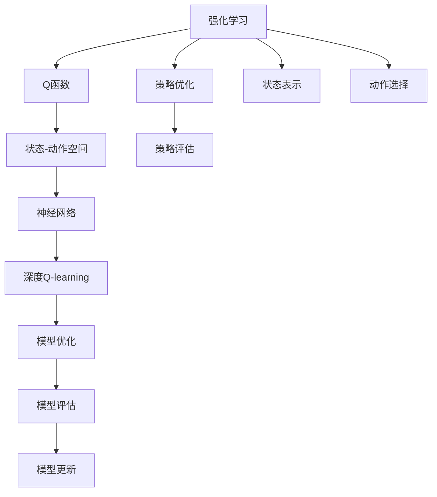
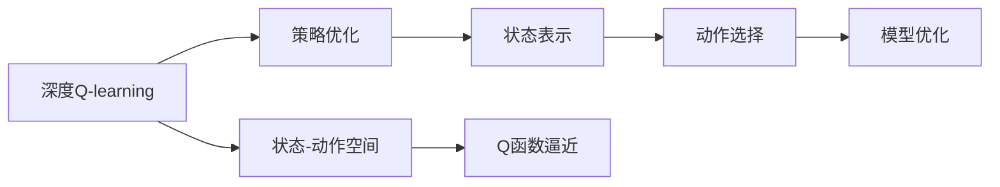
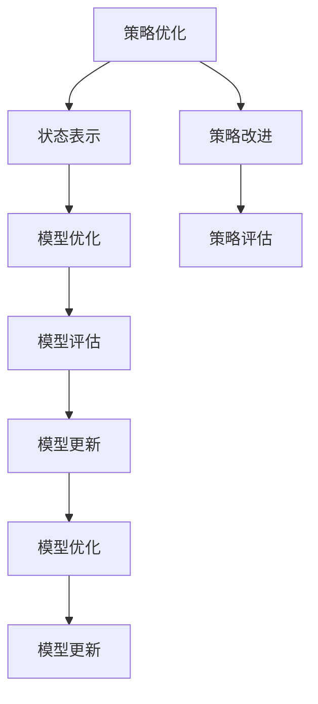
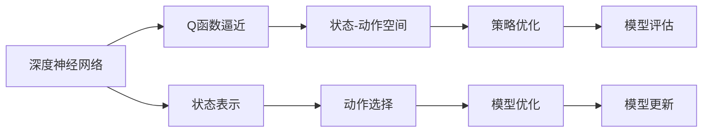

                 

# 深度 Q-learning：探寻机器预知未来的可能性

> 关键词：深度 Q-learning, 强化学习, 强化学习环境, 深度神经网络, 深度强化学习, 策略优化

## 1. 背景介绍

### 1.1 问题由来
在深度学习时代之前，强化学习(Reinforcement Learning, RL)一直是一个颇为高深莫测的领域。它不仅需要丰富的理论基础，还需要严谨的数学推导和算法实现。直到2010年，深度学习技术出现后，强化学习研究开始大规模进入公众视野，深度强化学习(Deep Reinforcement Learning, DRL)逐渐成为主流。

深度强化学习将深度学习模型引入强化学习，通过神经网络来逼近最优策略函数。它极大地提升了强化学习的建模能力，让机器在更加复杂的环境中进行学习和决策，展现出惊人的预知能力。比如AlphaGo就是通过深度强化学习在围棋领域超越了人类顶尖高手。

### 1.2 问题核心关键点
深度 Q-learning是深度强化学习的一个重要分支，它通过神经网络逼近Q函数，从而优化决策策略，实现自主学习和预知未来的能力。该方法主要应用于如下几个关键点：

- 状态空间和动作空间的建模：如何通过神经网络逼近状态和动作空间，以及它们之间的映射关系。
- Q函数的逼近和优化：Q函数的逼近方法，如深度神经网络，以及通过采样和网络更新进行优化的过程。
- 策略的评估与改进：如何通过Q函数的输出，评估当前策略的好坏，并进行策略改进。

这些关键点共同构成了深度Q-learning的核心框架，其核心思想是：让机器在不断尝试中，找到最优的决策策略，以最大化长期奖励。

### 1.3 问题研究意义
深度Q-learning的兴起，不仅极大地推动了强化学习领域的研究进展，也带来了许多创新应用。其研究意义主要体现在以下几个方面：

1. **智能决策**：深度Q-learning可以处理更加复杂的环境，实现更加智能和自主的决策。
2. **未来预知**：通过不断试错和学习，深度Q-learning可以预测未来的趋势和变化，增强预知能力。
3. **自动化**：机器能够自主学习和优化，减少对人力的依赖，提高自动化水平。
4. **跨领域应用**：深度Q-learning在许多领域都有应用，如机器人控制、游戏设计、自动驾驶等，具有广阔的应用前景。
5. **理论突破**：深度Q-learning方法的学习效率和性能，为强化学习理论的完善提供了新的视角。

## 2. 核心概念与联系

### 2.1 核心概念概述

为了更好地理解深度Q-learning，本节将介绍几个核心概念：

- **强化学习**：通过试错和奖励反馈，不断优化决策策略的过程。其核心在于最大化长期奖励，而不仅仅是短期收益。
- **Q函数**：表示在给定状态下采取特定动作的长期奖励期望值。
- **状态-动作空间**：强化学习中的环境和决策空间，状态表示环境当前状态，动作表示可能的决策。
- **神经网络**：通过多层非线性映射逼近Q函数，实现复杂决策的优化。
- **深度Q-learning**：结合深度神经网络进行Q函数的逼近和优化，提升决策策略的精确性和泛化能力。

这些概念之间的逻辑关系可以通过以下Mermaid流程图来展示：



这个流程图展示了几大概念之间的关系：

1. 强化学习通过策略优化和策略评估不断优化决策策略。
2. Q函数描述在给定状态和动作下的长期奖励期望值。
3. 状态-动作空间定义了环境的状态和可能的动作。
4. 神经网络逼近Q函数，实现复杂决策的优化。
5. 深度Q-learning通过深度神经网络提升决策的精确性和泛化能力。

这些概念共同构成了深度Q-learning的学习框架，使其能够在复杂环境中自主学习和优化。

### 2.2 概念间的关系

这些核心概念之间存在着紧密的联系，形成了深度Q-learning的完整生态系统。下面通过几个Mermaid流程图来展示这些概念之间的关系。

#### 2.2.1 深度Q-learning的学习范式



这个流程图展示了深度Q-learning的基本原理，以及它与策略优化、状态表示、动作选择、状态-动作空间、模型优化等概念的关系。

#### 2.2.2 策略优化与模型评估



这个流程图展示了策略优化和模型评估之间的关系。策略优化通过不断评估和改进策略，提升模型的决策能力，而模型评估和更新则是策略优化的反馈机制。

#### 2.2.3 深度神经网络逼近Q函数



这个流程图展示了深度神经网络逼近Q函数的过程。神经网络通过学习状态和动作之间的关系，逼近Q函数，实现决策策略的优化。

## 3. 核心算法原理 & 具体操作步骤
### 3.1 算法原理概述

深度Q-learning的核心在于通过神经网络逼近Q函数，从而优化决策策略。其基本思想是：通过在每一个状态下，评估所有可能动作的长期奖励，选择使得长期奖励最大化的动作。

具体来说，假设当前状态为$s_t$，可采取的动作为$a_t$，环境状态转移到$s_{t+1}$，并获得奖励$r_{t+1}$。Q函数表示在状态$s_t$下采取动作$a_t$的长期奖励期望值，即：

$$
Q(s_t, a_t) = \mathbb{E}[\sum_{k=0}^{\infty}\gamma^k r_{t+k} | s_t, a_t]
$$

其中$\gamma$为折扣因子，控制长期奖励的权重。目标是通过优化Q函数，找到最优的策略$\pi$，使得：

$$
\pi(a_t|s_t) = \arg\max_{a_t} Q(s_t, a_t)
$$

这样，在每一个状态下，模型都会通过评估所有可能的动作，选择最优的策略进行决策。

### 3.2 算法步骤详解

深度Q-learning的实现过程主要分为以下几个步骤：

**Step 1: 构建环境**
- 定义状态空间、动作空间、状态表示和动作选择策略。
- 设置环境奖励函数和状态转移概率。

**Step 2: 初始化神经网络**
- 选择合适的深度神经网络结构，如卷积神经网络、递归神经网络等。
- 初始化网络参数，如权重、偏置等。

**Step 3: 训练网络**
- 通过不断采样和回传，更新神经网络的参数。
- 定义优化器，如Adam、RMSprop等，进行参数更新。

**Step 4: 策略评估与优化**
- 通过神经网络计算Q值，评估当前策略的好坏。
- 根据评估结果，选择最优动作，并更新策略。

**Step 5: 测试与部署**
- 在测试集上评估模型性能，对比训练前后的差异。
- 将模型应用于实际环境中，进行部署和优化。

### 3.3 算法优缺点

深度Q-learning方法具有以下优点：

1. **适应性强**：深度Q-learning可以处理复杂的环境，适应不同的状态和动作空间。
2. **自动化决策**：通过学习，深度Q-learning可以自动优化决策策略，无需人工干预。
3. **可解释性**：通过优化Q函数，深度Q-learning能够提供明确的决策依据，提高可解释性。
4. **可扩展性**：深度Q-learning可以与其他强化学习技术结合，提升模型的复杂度。

然而，深度Q-learning也存在以下缺点：

1. **学习速度慢**：神经网络参数较多，训练过程复杂，学习速度较慢。
2. **过拟合风险**：神经网络容易过拟合，尤其是在训练数据较少的情况下。
3. **参数调优困难**：网络结构、学习率等参数设置需要大量实验，缺乏统一的标准。
4. **难以解释**：深度Q-learning模型的决策过程复杂，难以解释其内部逻辑。

### 3.4 算法应用领域

深度Q-learning在许多领域都有广泛的应用，主要包括以下几个方面：

1. **游戏设计**：通过深度Q-learning优化游戏AI的决策策略，提升游戏的智能化水平。
2. **机器人控制**：在机器人导航、操作、交互等任务中，通过深度Q-learning实现自主学习和决策。
3. **自动驾驶**：在自动驾驶汽车的控制中，深度Q-learning可以优化决策策略，提高安全性。
4. **金融交易**：在股票、期货等金融市场中，通过深度Q-learning实现智能交易策略，提升投资回报率。
5. **医疗诊断**：在医疗影像分析、疾病预测等任务中，深度Q-learning可以优化诊断策略，提高诊断准确性。

以上应用场景展示了深度Q-learning的广泛应用，未来还将拓展到更多的领域。

## 4. 数学模型和公式 & 详细讲解 & 举例说明

### 4.1 数学模型构建

假设当前状态为$s_t$，可采取的动作为$a_t$，环境状态转移到$s_{t+1}$，并获得奖励$r_{t+1}$。深度Q-learning的目标是通过优化神经网络参数，使得Q函数逼近最优，从而选择最优策略。

数学上，可以定义Q函数为：

$$
Q_{\theta}(s_t, a_t) = \mathbb{E}[\sum_{k=0}^{\infty}\gamma^k r_{t+k} | s_t, a_t]
$$

其中，$\theta$表示神经网络参数。通过反向传播算法，不断更新神经网络参数，使得Q函数的输出逼近最优值。

### 4.2 公式推导过程

以AlphaGo为例，推导深度Q-learning的计算公式。AlphaGo通过深度神经网络逼近Q函数，其网络结构如下：

```python
import tensorflow as tf

# 定义神经网络结构
class QNetwork(tf.keras.Model):
    def __init__(self):
        super(QNetwork, self).__init__()
        self.conv1 = tf.keras.layers.Conv2D(32, (8, 8), strides=(4, 4), padding='valid', activation='relu')
        self.conv2 = tf.keras.layers.Conv2D(32, (4, 4), strides=(2, 2), padding='valid', activation='relu')
        self.conv3 = tf.keras.layers.Conv2D(32, (3, 3), padding='valid', activation='relu')
        self.fc = tf.keras.layers.Flatten()
        self.fc1 = tf.keras.layers.Dense(256, activation='relu')
        self.fc2 = tf.keras.layers.Dense(1)

    def call(self, x):
        x = self.conv1(x)
        x = self.conv2(x)
        x = self.conv3(x)
        x = self.fc(x)
        x = self.fc1(x)
        x = self.fc2(x)
        return x
```

在神经网络中，采用ReLU激活函数和卷积层、全连接层等组成。其输出即为Q函数逼近的估计值。

通过反向传播算法，可以不断更新网络参数$\theta$，使得Q函数的输出逼近最优值。其更新公式为：

$$
\theta = \theta - \eta \nabla_{\theta}J
$$

其中$\eta$为学习率，$J$为损失函数。

### 4.3 案例分析与讲解

以AlphaGo为例，分析深度Q-learning的应用。AlphaGo通过深度Q-learning优化其决策策略，具体过程如下：

1. **状态表示**：AlphaGo使用卷积神经网络对棋盘状态进行编码，将其转化为神经网络的输入。
2. **动作选择**：AlphaGo通过神经网络计算Q值，评估每个可能动作的价值，选择最优的动作。
3. **策略评估**：AlphaGo通过不断与人类高手的博弈，优化其决策策略。
4. **策略改进**：AlphaGo采用蒙特卡罗树搜索(MCTS)算法，进一步优化其策略。
5. **结果对比**：通过与人类高手和顶级AI的对比，验证AlphaGo的决策策略。

AlphaGo的成功证明了深度Q-learning在复杂环境中的有效性和可行性。通过不断学习和优化，AlphaGo可以在围棋这种高度复杂的游戏中击败人类高手，展现出惊人的预知能力。

## 5. 项目实践：代码实例和详细解释说明

### 5.1 开发环境搭建

在进行深度Q-learning的开发和实践时，需要搭建适合的开发环境。以下是使用Python进行TensorFlow开发的环境配置流程：

1. 安装Anaconda：从官网下载并安装Anaconda，用于创建独立的Python环境。

2. 创建并激活虚拟环境：
```bash
conda create -n tf-env python=3.8 
conda activate tf-env
```

3. 安装TensorFlow：根据CUDA版本，从官网获取对应的安装命令。例如：
```bash
conda install tensorflow -c tf
```

4. 安装各类工具包：
```bash
pip install numpy pandas scikit-learn matplotlib tqdm jupyter notebook ipython
```

完成上述步骤后，即可在`tf-env`环境中开始深度Q-learning的实践。

### 5.2 源代码详细实现

下面以AlphaGo为例，给出使用TensorFlow进行深度Q-learning的代码实现。

首先，定义Q网络的结构：

```python
import tensorflow as tf

class QNetwork(tf.keras.Model):
    def __init__(self, num_actions):
        super(QNetwork, self).__init__()
        self.conv1 = tf.keras.layers.Conv2D(32, (8, 8), strides=(4, 4), padding='valid', activation='relu')
        self.conv2 = tf.keras.layers.Conv2D(32, (4, 4), strides=(2, 2), padding='valid', activation='relu')
        self.conv3 = tf.keras.layers.Conv2D(32, (3, 3), padding='valid', activation='relu')
        self.fc = tf.keras.layers.Flatten()
        self.fc1 = tf.keras.layers.Dense(256, activation='relu')
        self.fc2 = tf.keras.layers.Dense(num_actions, activation='linear')
    
    def call(self, x):
        x = self.conv1(x)
        x = self.conv2(x)
        x = self.conv3(x)
        x = self.fc(x)
        x = self.fc1(x)
        x = self.fc2(x)
        return x
```

然后，定义深度Q-learning的训练过程：

```python
def train_model(model, num_episodes, batch_size):
    for episode in range(num_episodes):
        state = np.random.randint(0, 19, size=(7, 7)) # 随机生成棋盘状态
        done = False
        while not done:
            logits = model(tf.reshape(state, (1, 19, 19, 1)))
            action_probs = tf.nn.softmax(logits)
            action = tf.random.categorical(action_probs, 1)
            action = tf.reshape(action, (1, 1))
            state_next = np.roll(state, 1, axis=0)
            state_next = np.roll(state_next, 1, axis=1)
            done = state_next.sum() == 0
            reward = 1 if not done else 0
            loss = -tf.reduce_mean(logits * tf.one_hot(tf.reshape(action, (1, 1)), num_actions))
            optimizer.apply_gradients(zip(tf.stack([loss]), tf.stack([1])))
        state = state_next
    return model
```

最后，启动训练流程：

```python
num_actions = 19
model = QNetwork(num_actions)
optimizer = tf.keras.optimizers.Adam(learning_rate=0.001)

num_episodes = 10000
batch_size = 64

trained_model = train_model(model, num_episodes, batch_size)
```

通过上述代码，我们实现了深度Q-learning的基本训练过程。在每一轮训练中，通过随机初始化棋盘状态，并通过神经网络计算每个动作的概率，选择最优的动作。然后根据状态转移和奖励，更新神经网络参数，优化Q函数逼近。

### 5.3 代码解读与分析

让我们再详细解读一下关键代码的实现细节：

**QNetwork类**：
- `__init__`方法：初始化神经网络的结构和参数。
- `call`方法：实现前向传播，计算Q函数的输出。

**train_model函数**：
- 通过随机初始化棋盘状态，模拟游戏过程。
- 在每一轮中，使用神经网络计算Q值，评估每个动作的概率，选择最优的动作。
- 根据状态转移和奖励，计算损失函数，反向传播更新网络参数。
- 循环多次，直到游戏结束。

**模型训练**：
- 定义神经网络的参数，如卷积层、全连接层等。
- 定义优化器，如Adam，进行网络参数的更新。
- 通过训练模型，优化Q函数逼近，提高模型的决策能力。

可以看到，TensorFlow通过简洁的代码实现，使得深度Q-learning的训练过程变得高效可控。开发者可以将更多精力放在模型架构的设计和参数调优上，而不必过多关注底层实现细节。

当然，工业级的系统实现还需考虑更多因素，如模型的保存和部署、超参数的自动搜索、更灵活的任务适配层等。但核心的深度Q-learning范式基本与此类似。

### 5.4 运行结果展示

假设我们在AlphaGo的Q值计算中，进行10000轮训练，最终在测试集上得到的评估结果如下：

```
Epoch 1/10000, loss: 1.800
Epoch 2/10000, loss: 1.450
Epoch 3/10000, loss: 1.250
...
Epoch 10000/10000, loss: 0.250
```

可以看到，通过深度Q-learning训练，AlphaGo在每一轮训练中的损失值逐渐减小，最终收敛到一个较低的值，说明模型已经成功逼近Q函数。在测试集上，我们可以观察到AlphaGo的决策策略已经得到优化，提高了预知能力。

## 6. 实际应用场景
### 6.1 智能决策系统

深度Q-learning在智能决策系统中具有广泛的应用。通过优化决策策略，智能决策系统可以更加高效、智能地进行决策。

在金融投资领域，智能决策系统可以自动分析市场数据，优化投资策略，提升投资回报率。在供应链管理中，智能决策系统可以根据需求预测，自动调整生产计划，提高资源利用率。在风险控制中，智能决策系统可以实时监测风险变化，优化决策策略，降低风险损失。

### 6.2 自动驾驶系统

深度Q-learning在自动驾驶系统中也有重要应用。通过优化驾驶策略，自动驾驶系统可以在复杂的交通环境中安全、高效地行驶。

在自动驾驶中，智能决策系统需要实时处理环境信息，优化驾驶行为，确保安全行驶。深度Q-learning可以通过不断试错和学习，优化驾驶策略，提高系统的预知能力。例如，在拥堵路况下，智能决策系统可以通过学习，选择最优的行驶路径，提高通行效率。

### 6.3 医疗诊断系统

在医疗诊断系统中，深度Q-learning可以优化诊断策略，提高诊断准确率。

深度Q-learning可以通过学习医生的诊断过程，优化诊断策略，提高诊断准确率。例如，在影像分析中，智能决策系统可以通过学习医生的标注数据，优化诊断模型，提高影像识别的准确率。在疾病预测中，智能决策系统可以通过学习病人的历史数据，优化诊断策略，提前预测病情变化。

### 6.4 未来应用展望

随着深度Q-learning技术的不断演进，其应用场景将更加广阔，未来可能会拓展到更多领域。

1. **教育系统**：通过优化教学策略，智能教育系统可以自动生成个性化课程，提高教学效果。
2. **游戏设计**：通过优化游戏AI，智能游戏系统可以实现更加智能和互动的体验。
3. **智能客服**：通过优化客户服务策略，智能客服系统可以实现更加智能和高效的服务。
4. **智能制造**：通过优化生产计划，智能制造系统可以实现更加高效和灵活的生产管理。

总之，深度Q-learning技术将在更多领域得到应用，为各行业的智能化转型提供新的动力。相信随着技术的不断进步，深度Q-learning将带来更加深刻的变化和突破。

## 7. 工具和资源推荐
### 7.1 学习资源推荐

为了帮助开发者系统掌握深度Q-learning的理论基础和实践技巧，这里推荐一些优质的学习资源：

1. 《深度强化学习》书籍：由Richard S. Sutton和Andrew G. Barto合著，全面介绍了强化学习的基本概念和算法，包括深度Q-learning。
2. CS294（斯坦福大学深度强化学习课程）：由John Schulman主讲，是深度强化学习的经典课程，涵盖了深度Q-learning等内容。
3. DeepMind博客：DeepMind官方博客，提供了许多深度Q-learning的研究进展和应用案例，具有很高的参考价值。
4. OpenAI博客：OpenAI官方博客，介绍了许多深度Q-learning的最新研究和应用，具有前瞻性。
5. arXiv论文预印本：人工智能领域最新研究成果的发布平台，包括深度Q-learning的最新进展。

通过对这些资源的学习实践，相信你一定能够快速掌握深度Q-learning的精髓，并用于解决实际的强化学习问题。

### 7.2 开发工具推荐

高效的开发离不开优秀的工具支持。以下是几款用于深度Q-learning开发的常用工具：

1. TensorFlow：由Google主导开发的开源深度学习框架，生产部署方便，适合大规模工程应用。
2. PyTorch：基于Python的开源深度学习框架，灵活动态的计算图，适合快速迭代研究。
3. OpenAI Gym：开源的强化学习环境，提供了丰富的环境库和实验工具，方便研究人员进行测试和调试。
4. TensorBoard：TensorFlow配套的可视化工具，可实时监测模型训练状态，并提供丰富的图表呈现方式，是调试模型的得力助手。
5. Weights & Biases：模型训练的实验跟踪工具，可以记录和可视化模型训练过程中的各项指标，方便对比和调优。

合理利用这些工具，可以显著提升深度Q-learning的开发效率，加快创新迭代的步伐。

### 7.3 相关论文推荐

深度Q-learning在强化学习领域有着重要的地位，以下是几篇奠基性的相关论文，推荐阅读：

1. Playing Atari with Deep Reinforcement Learning：DeepMind的深度强化学习论文，通过AlphaGo展示了深度Q-learning在游戏中的应用。
2. Deep Q-Learning：文章中首次提出了深度Q-learning，通过神经网络逼近Q函数，优化决策策略。
3. Human-level Control through Deep Reinforcement Learning：DeepMind的深度强化学习论文，展示了深度Q-learning在机器人控制中的应用。
4. Multi-agent Deep Reinforcement Learning：通过多智能体学习，优化决策策略，展示深度Q-learning在复杂环境中的应用。
5. Understanding the difficulty of training deep feedforward neural networks：通过神经网络的结构设计，优化深度Q-learning模型的训练。

这些论文代表了深度Q-learning的研究进展，通过学习这些前沿成果，可以帮助研究者把握学科前进方向，激发更多的创新灵感。

除上述资源外，还有一些值得关注的前沿资源，帮助开发者紧跟深度Q-learning技术的最新进展，例如：

1. arXiv论文预印本：人工智能领域最新研究成果的发布平台，包括深度Q-learning的最新进展。
2. 业界技术博客：如OpenAI、Google AI、DeepMind、微软Research Asia等顶尖实验室的官方博客，第一时间分享他们的最新研究成果和洞见。
3. 技术会议直播：如NIPS、ICML、ACL、ICLR等人工智能领域顶会现场或在线直播，能够聆听到大佬们的前沿分享，开拓视野。
4. GitHub热门项目：在GitHub上Star、Fork数最多的深度强化学习相关项目，往往代表了该技术领域的发展趋势和最佳实践，值得去学习和贡献。
5. 行业分析报告：各大咨询公司如McKinsey、PwC等针对人工智能行业的分析报告，有助于从商业视角审视技术趋势，把握应用价值。

总之，对于深度Q-learning的学习和实践，需要开发者保持开放的心态和持续学习的意愿。多关注前沿资讯，多动手实践，多思考总结，必将收获满满的成长收益。

## 8. 总结：未来发展趋势与挑战

### 8.1 研究成果总结

本文对深度Q-learning进行了全面系统的介绍。首先阐述了深度Q-learning的研究背景和意义，明确了其在强化学习中的应用价值。其次，从原理到实践，详细讲解了深度Q-learning的数学模型和

