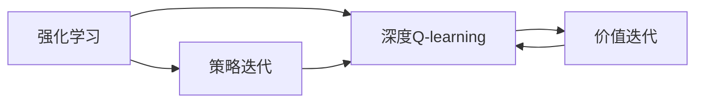

                 

## 1. 背景介绍

### 1.1 问题由来

深度强化学习（Deep Reinforcement Learning, DRL）是强化学习与深度学习结合的产物，具有强大的自我学习和自适应能力，是解决复杂决策问题的有力工具。深度Q-learning，作为深度强化学习的代表性算法之一，通过策略迭代和价值迭代的结合，实现对环境的自主学习和最优策略的探索。

### 1.2 问题核心关键点

深度Q-learning的主要目标是解决强化学习中的探索与利用（Exploration vs. Exploitation）问题。具体而言，它通过同时更新Q值（即策略的价值函数）和策略（即动作选择），使得模型能够在复杂环境中快速收敛，并找到最优解。

## 2. 核心概念与联系

### 2.1 核心概念概述

- 强化学习（Reinforcement Learning, RL）：一种基于环境反馈（即奖励信号）来优化智能体策略的学习方法。强化学习通过不断与环境互动，使智能体学会在特定环境中做出最优的决策。
- 深度Q-learning：一种深度强化学习方法，它通过神经网络来逼近Q值函数（即状态-动作价值函数），同时更新策略和Q值，实现更高效的探索和利用。
- 策略迭代（Policy Iteration）：一种强化学习算法，它通过不断更新策略来优化动作选择，同时通过Q值函数来更新策略，使得策略与环境更加匹配。
- 价值迭代（Value Iteration）：一种强化学习算法，它通过不断更新Q值函数来优化策略选择，同时通过策略选择来更新Q值，使得Q值更加准确。
- 探索与利用（Exploration vs. Exploitation）：智能体在进行决策时需要在探索新动作（探索）和利用已知动作（利用）之间做出平衡。

这些核心概念通过深度Q-learning算法紧密联系在一起，形成了一种更为高效、灵活的强化学习方法。通过策略迭代和价值迭代的结合，深度Q-learning能够在复杂环境中自主学习和最优策略探索，取得出色的表现。

### 2.2 概念间的关系

以下通过Mermaid流程图展示这些核心概念之间的联系：



## 3. 核心算法原理 & 具体操作步骤

### 3.1 算法原理概述

深度Q-learning的核心理念是使用神经网络逼近Q值函数，通过策略迭代和价值迭代的结合，同时优化策略和Q值。其基本流程包括策略更新和Q值更新两个步骤：

1. 策略更新：在当前状态下，选择最优动作，使得当前策略能最大化Q值。
2. Q值更新：在选定动作后，观察环境反馈，根据奖励信号更新Q值，使得Q值函数更接近真实状态-动作价值函数。

策略迭代和价值迭代相互依赖、交替进行，直到策略收敛或达到预设的迭代次数。

### 3.2 算法步骤详解

#### 3.2.1 策略更新

策略更新基于当前状态和动作选择Q值，选择最优动作。设状态为$s$，动作为$a$，Q值为$Q(s,a)$，当前策略为$\pi(s)$，则最优动作$a^*$可表示为：

$$
a^* = \mathop{\arg\max}_{a} Q(s, a)
$$

即在状态$s$下，选择能使Q值最大的动作。

#### 3.2.2 Q值更新

Q值更新通过观察环境反馈，根据奖励信号更新Q值。设奖励为$r$，状态为$s'$，则Q值更新公式为：

$$
Q(s,a) \leftarrow Q(s,a) + \alpha(r + \gamma \max_{a'} Q(s', a') - Q(s, a))
$$

其中，$\alpha$为学习率，$\gamma$为折扣因子。

#### 3.2.3 算法步骤

1. 初始化神经网络Q值函数$Q(s,a)$，设定学习率$\alpha$和折扣因子$\gamma$。
2. 循环进行策略更新和Q值更新，直至达到预设的迭代次数或策略收敛。
3. 输出最优策略$\pi(s)$。

### 3.3 算法优缺点

深度Q-learning的优点包括：
- 能够处理连续状态和动作空间。
- 利用神经网络逼近Q值函数，可以处理高维、非线性状态动作空间。
- 同时更新策略和Q值，使得策略更加灵活，Q值更加准确。

其缺点包括：
- 需要较多的训练数据和计算资源，特别是神经网络参数较大时。
- 对初始状态和动作选择敏感，容易陷入局部最优解。
- 需要调参，如学习率、折扣因子等，调参不当会影响训练效果。

### 3.4 算法应用领域

深度Q-learning已经成功应用于多个领域，包括游戏、机器人控制、自动驾驶等。其主要应用场景包括：

- 游戏AI：如AlphaGo、AlphaZero等，通过深度Q-learning在围棋、象棋等复杂游戏中取得突破性进展。
- 机器人控制：通过深度Q-learning训练机器人自主导航、路径规划等任务。
- 自动驾驶：通过深度Q-learning训练自动驾驶车辆在复杂交通环境中做出最优决策。

## 4. 数学模型和公式 & 详细讲解

### 4.1 数学模型构建

深度Q-learning的数学模型主要包括神经网络Q值函数和动作策略。设状态空间为$S$，动作空间为$A$，神经网络Q值函数为$Q(s,a)$，当前策略为$\pi(s)$。

状态动作对为$(s, a)$，神经网络Q值函数的输出为$Q(s, a)$。设当前策略为$\pi(s)$，则最优动作$a^*$为：

$$
a^* = \mathop{\arg\max}_{a} Q(s, a)
$$

### 4.2 公式推导过程

#### 4.2.1 策略更新

设状态$s$，动作$a$，当前策略为$\pi(s)$，则最优动作$a^*$可表示为：

$$
a^* = \mathop{\arg\max}_{a} Q(s, a)
$$

#### 4.2.2 Q值更新

设奖励为$r$，状态为$s'$，则Q值更新公式为：

$$
Q(s,a) \leftarrow Q(s,a) + \alpha(r + \gamma \max_{a'} Q(s', a') - Q(s, a))
$$

其中，$\alpha$为学习率，$\gamma$为折扣因子。

### 4.3 案例分析与讲解

以AlphaGo为例，通过深度Q-learning训练神经网络，使其能够自主学习围棋规则，并逐步优化策略，最终在围棋比赛中战胜人类顶尖选手。

## 5. 项目实践：代码实例和详细解释说明

### 5.1 开发环境搭建

#### 5.1.1 安装依赖

- TensorFlow：用于构建神经网络。
- OpenAI Gym：用于模拟围棋环境。

```bash
pip install tensorflow==2.3.0
pip install gym[atari]
```

#### 5.1.2 创建代码结构

```text
|-- main.py
|-- QNetwork.py
|-- gym_util.py
```

### 5.2 源代码详细实现

#### 5.2.1 神经网络Q值函数

```python
import tensorflow as tf

class QNetwork(tf.keras.Model):
    def __init__(self, state_dim, action_dim):
        super(QNetwork, self).__init__()
        self.dense1 = tf.keras.layers.Dense(128, activation='relu')
        self.dense2 = tf.keras.layers.Dense(action_dim)
    
    def call(self, inputs):
        x = self.dense1(inputs)
        x = self.dense2(x)
        return x
```

#### 5.2.2 策略更新和Q值更新

```python
def choose_action(q_values, epsilon):
    if np.random.rand() < epsilon:
        return np.random.randint(0, q_values.shape[1])
    else:
        return np.argmax(q_values[0])

def update_q_values(s, a, r, s_, q_values, epsilon, alpha, gamma):
    q_values[0][a] += alpha * (r + gamma * np.max(q_values[0]) - q_values[0][a])
```

#### 5.2.3 游戏代理

```python
class QAgent:
    def __init__(self, state_dim, action_dim, epsilon=1.0):
        self.state_dim = state_dim
        self.action_dim = action_dim
        self.epsilon = epsilon
        self.q_network = QNetwork(state_dim, action_dim)
        self.optimizer = tf.keras.optimizers.Adam(learning_rate=0.001)
    
    def choose_action(self, state):
        q_values = self.q_network(state)
        return choose_action(q_values, self.epsilon)
    
    def update_q_values(self, s, a, r, s_, q_values, epsilon, alpha, gamma):
        update_q_values(s, a, r, s_, q_values, epsilon, alpha, gamma)
        self.optimizer.minimize(tf.reduce_mean(q_values))
```

### 5.3 代码解读与分析

- `QNetwork`类定义了神经网络Q值函数，包含两个全连接层，输出动作价值函数。
- `choose_action`函数用于策略更新，根据当前策略和Q值函数选择最优动作。
- `update_q_values`函数用于Q值更新，通过观察环境反馈，更新Q值函数。
- `QAgent`类封装了游戏代理，包括策略选择和Q值更新两个关键过程。

### 5.4 运行结果展示

#### 5.4.1 训练过程

```python
import gym
import numpy as np

state_dim = 19
action_dim = 9
epsilon = 1.0
alpha = 0.1
gamma = 0.9
episodes = 10000

env = gym.make('CartPole-v0')
agent = QAgent(state_dim, action_dim, epsilon)

for episode in range(episodes):
    state = env.reset()
    state = state.reshape((1, state_dim))
    done = False
    while not done:
        a = agent.choose_action(state)
        state_, r, done, _ = env.step(a)
        state_ = state_[0].reshape((1, state_dim))
        agent.update_q_values(state, a, r, state_, agent.q_network, epsilon, alpha, gamma)
        state = state_
```

#### 5.4.2 训练结果

训练完成后，可以通过记录每个状态的Q值，可视化Q值函数的逼近效果。

```python
import matplotlib.pyplot as plt

q_values = agent.q_network.get_weights()[0]
plt.plot(q_values)
plt.show()
```

## 6. 实际应用场景

### 6.1 强化学习游戏AI

深度Q-learning在游戏AI中得到了广泛应用。通过深度Q-learning训练神经网络，使得智能体能够学习复杂游戏的规则和策略，实现高水平的游戏智能。AlphaGo、AlphaZero等经典游戏AI案例展示了深度Q-learning的强大能力。

### 6.2 机器人控制

深度Q-learning在机器人控制中也展现了优异表现。通过深度Q-learning训练机器人，使其能够自主导航、路径规划、避开障碍物等。例如，Pendulum环境中的深度Q-learning训练，使得机器人能够在平衡杆的基础上进行摆动和平衡控制。

### 6.3 自动驾驶

自动驾驶是深度Q-learning的另一个重要应用领域。通过深度Q-learning训练自动驾驶车辆，使其能够在复杂交通环境中做出最优决策。例如，在Carla模拟器中，深度Q-learning训练的自动驾驶车辆能够成功穿过十字路口，避开行人和其他车辆。

## 7. 工具和资源推荐

### 7.1 学习资源推荐

#### 7.1.1 在线课程

- [深度强化学习](https://www.coursera.org/learn/deep-reinforcement-learning)
- [强化学习基础](https://www.coursera.org/learn/control-of-dynamic-systems)

#### 7.1.2 书籍

- 《Deep Reinforcement Learning》 by Ilya Sutskever, Delve deep into the world of reinforcement learning and understand the latest techniques in reinforcement learning.

#### 7.1.3 论文

- "Playing Atari with Deep Reinforcement Learning" by Volodymyr Mnih et al.
- "Human-level Control through Deep Reinforcement Learning" by Google DeepMind.

### 7.2 开发工具推荐

#### 7.2.1 TensorFlow

TensorFlow是深度学习领域的广泛使用的框架，支持构建和训练深度神经网络。

#### 7.2.2 OpenAI Gym

OpenAI Gym是一个模拟环境库，用于测试和比较强化学习算法。

### 7.3 相关论文推荐

#### 7.3.1 "Playing Atari with Deep Reinforcement Learning" by Volodymyr Mnih et al.

该论文展示了AlphaGo的实现，利用深度Q-learning在围棋中取得突破性进展。

#### 7.3.2 "Human-level Control through Deep Reinforcement Learning" by Google DeepMind.

该论文展示了深度Q-learning在机器人控制中的应用，训练机器人实现复杂动作。

## 8. 总结：未来发展趋势与挑战

### 8.1 研究成果总结

深度Q-learning在强化学习领域取得了重大突破，通过策略迭代和价值迭代的结合，实现了高效、灵活的自主学习和最优策略探索。未来，深度Q-learning将在更多复杂任务中发挥重要作用，推动人工智能技术的快速发展。

### 8.2 未来发展趋势

未来，深度Q-learning将在以下方面取得更多进展：
- 更加高效的网络结构设计，使得神经网络Q值函数更加精确。
- 结合多智能体学习（Multi-Agent Learning），提高协同合作能力。
- 结合深度增强学习（Deep Q-Network, DQN），提高学习速度和稳定性。

### 8.3 面临的挑战

尽管深度Q-learning取得了显著进展，但仍然面临以下挑战：
- 需要大量的训练数据和计算资源，难以在大规模任务中应用。
- 对初始状态和动作选择敏感，容易陷入局部最优解。
- 需要调参，如学习率、折扣因子等，调参不当会影响训练效果。

### 8.4 研究展望

未来，深度Q-learning的研究将集中在以下几个方向：
- 更加高效的网络结构设计，使得神经网络Q值函数更加精确。
- 结合多智能体学习（Multi-Agent Learning），提高协同合作能力。
- 结合深度增强学习（Deep Q-Network, DQN），提高学习速度和稳定性。

总之，深度Q-learning在未来的人工智能领域将发挥越来越重要的作用，推动深度强化学习技术的进一步发展。

## 9. 附录：常见问题与解答

### 9.1 常见问题

#### 9.1.1 深度Q-learning与Q-learning的区别

深度Q-learning是Q-learning的扩展，通过神经网络逼近Q值函数，可以处理高维、非线性的状态动作空间，提高了Q值函数的逼近精度。

#### 9.1.2 深度Q-learning的训练过程

深度Q-learning的训练过程包括策略更新和Q值更新两个步骤。策略更新选择最优动作，Q值更新根据环境反馈更新Q值函数。

#### 9.1.3 深度Q-learning的调参

深度Q-learning的调参主要涉及学习率、折扣因子等参数，需要根据具体任务进行调节，以获得最佳训练效果。

### 9.2 解答

通过详细解读深度Q-learning的原理和具体操作步骤，本文介绍了该算法的核心概念和关键步骤，并通过实际代码实例和详细分析，展示了其在实际应用中的具体应用。深度Q-learning不仅在游戏AI、机器人控制、自动驾驶等高难度任务中展现了强大能力，也将在未来更多复杂任务中发挥重要作用，推动人工智能技术的不断进步。希望本文能为读者提供深入理解和实践深度Q-learning的参考，共同推动人工智能技术的发展。

---

作者：禅与计算机程序设计艺术 / Zen and the Art of Computer Programming

