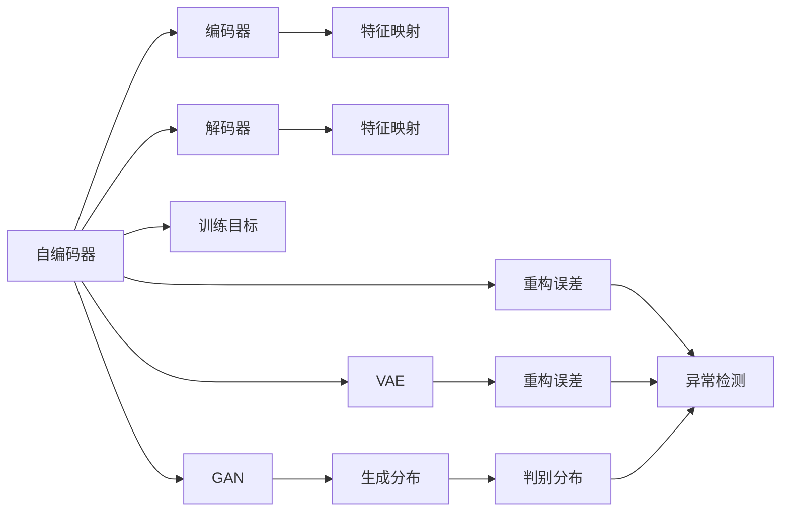
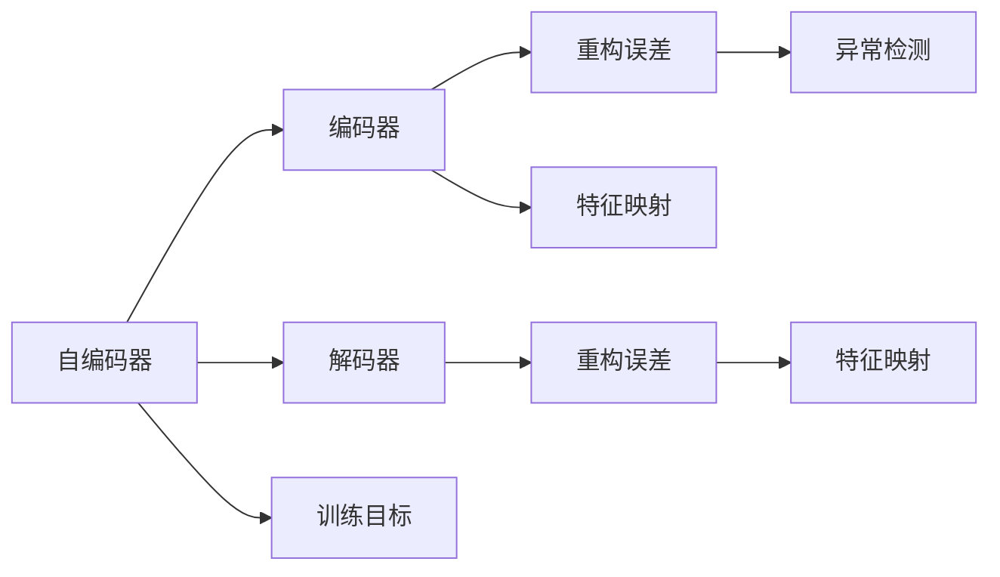
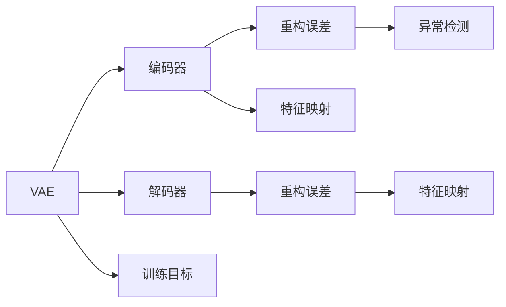
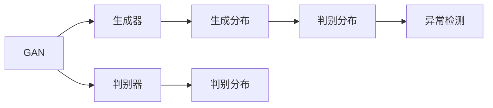
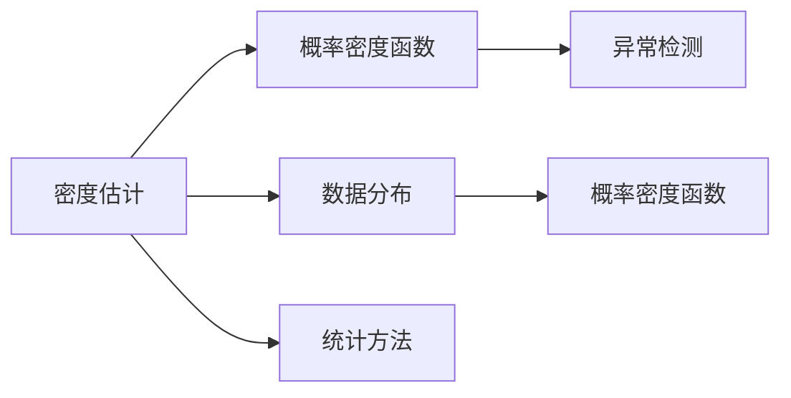

                 

## 1. 背景介绍

### 1.1 问题由来

异常检测(Anomaly Detection)，也称为离群值检测或离群点检测，是指在大量数据中识别出与众不同的异常数据，用于检测数据中的错误、异常或未预期的行为。异常检测在金融、工业控制、网络安全、医疗等多个领域具有重要应用。随着深度学习技术的发展，基于神经网络模型的异常检测方法逐渐成为主流。

### 1.2 问题核心关键点

异常检测的核心挑战在于如何处理异常数据和正常数据之间的显著差异。传统的统计方法往往难以捕捉到数据分布的复杂非线性关系，深度学习方法则能学习到更强大的特征表示，从而更准确地识别异常数据。然而，由于异常数据的稀缺性和分布的复杂性，异常检测模型往往面临着训练数据不足、过拟合等问题。因此，如何设计高效、鲁棒、泛化能力强的异常检测模型，成为当前研究的热点。

### 1.3 问题研究意义

异常检测技术的应用，对于预防和应对数据中的错误、异常行为，保障系统安全运行，具有重要意义：

1. 提升系统可靠性：通过及时检测和处理异常数据，减少系统故障率，提高服务稳定性。
2. 优化业务决策：识别业务中的异常模式，辅助决策者做出更精准的决策。
3. 降低风险损失：在金融、网络等领域，通过异常检测提前预防风险，降低损失。
4. 增强数据价值：异常检测能为数据标注和清洗提供重要依据，提升数据质量。
5. 扩展应用场景：异常检测方法可以扩展到图像、音频、文本等多个领域，带来广泛的创新应用。

## 2. 核心概念与联系

### 2.1 核心概念概述

为更好地理解深度学习在异常检测中的应用，本节将介绍几个关键概念：

- 异常检测(Anomaly Detection)：指在大量数据中识别出与众不同的异常数据的过程。常见的方法包括统计方法、密度估计、距离度量、深度学习等。
- 深度学习(Deep Learning)：一种基于神经网络的机器学习范式，通过多层非线性变换，学习到更强大的特征表示。深度学习在异常检测中的应用主要依赖于自编码器、变分自编码器、对抗生成网络等架构。
- 自编码器(Autocoder)：一种无监督学习模型，通过编码器学习输入数据的压缩表示，解码器重构原数据。自编码器可用于异常检测，通过学习异常数据的重构误差，识别异常。
- 变分自编码器(Variational Autoencoder, VAE)：一种基于概率模型的自编码器，通过引入变分推断，优化数据分布的重构误差。VAE在异常检测中的应用，也通过学习异常数据的重构误差，识别异常。
- 对抗生成网络(Generative Adversarial Network, GAN)：一种生成模型，通过生成器和判别器的对抗训练，学习到逼真的数据分布。GAN在异常检测中的应用，通过学习正常数据的分布，检测异常。
- 密度估计(Density Estimation)：指通过统计方法估计数据分布的概率密度函数，常用于基于统计学的异常检测方法。

这些概念之间的逻辑关系可以通过以下Mermaid流程图来展示：



这个流程图展示了深度学习在异常检测中的应用框架：

1. 自编码器通过重构误差学习异常检测。
2. VAE通过变分推断学习异常检测。
3. GAN通过生成器和判别器的对抗训练学习异常检测。
4. 密度估计通过统计方法学习异常检测。

这些核心概念共同构成了深度学习在异常检测中的基本范式，使其能够灵活应对各种异常检测任务。

### 2.2 概念间的关系

这些核心概念之间存在着紧密的联系，形成了深度学习在异常检测中的完整生态系统。下面我们通过几个Mermaid流程图来展示这些概念之间的关系。

#### 2.2.1 自编码器的异常检测范式



这个流程图展示了自编码器在异常检测中的应用。自编码器通过编码器学习输入数据的压缩表示，解码器重构原数据。重构误差越大，说明数据的异常程度越高。

#### 2.2.2 变分自编码器的异常检测范式



这个流程图展示了变分自编码器在异常检测中的应用。VAE通过变分推断学习数据分布的参数，重构误差也用于判断异常。

#### 2.2.3 对抗生成网络的异常检测范式



这个流程图展示了对抗生成网络在异常检测中的应用。GAN通过生成器和判别器的对抗训练，学习到逼真的数据分布，判别器用于检测异常。

#### 2.2.4 密度估计的异常检测范式



这个流程图展示了密度估计在异常检测中的应用。密度估计通过统计方法估计数据分布的概率密度函数，异常点处的密度较低。

### 2.3 核心概念的整体架构

最后，我们用一个综合的流程图来展示这些核心概念在大语言模型微调过程中的整体架构：

```mermaid
graph TB
    A[自编码器] --> B[重构误差]
    B --> C[异常检测]
    A --> D[编码器]
    A --> E[解码器]
    A --> F[训练目标]
    D --> G[特征映射]
    E --> H[特征映射]

    A --> I[VAE]
    I --> J[重构误差]
    J --> C

    A --> K[GAN]
    K --> L[生成分布]
    L --> M[判别分布]
    M --> C
    N[密度估计] --> O[概率密度函数]
    O --> P[异常检测]
    N --> Q[数据分布]
    Q --> R[概率密度函数]

    S[统计方法] --> T[概率密度函数]
    T --> U[异常检测]
    S --> V[数据分布]

    W[机器学习] --> X[训练目标]
    X --> Y[异常检测]

    C --> Z[异常样本]
    C --> AA[异常点]

    B --> BB[异常点]
    B --> CC[正常点]
    B --> DD[异常点]

    E --> EE[异常点]
    E --> FF[正常点]
    E --> GG[异常点]

    H --> HH[异常点]
    H --> II[正常点]
    H --> JJ[异常点]

    J --> KK[异常点]
    J --> LL[正常点]
    J --> MM[异常点]

    L --> NN[异常点]
    L --> OO[正常点]
    L --> PP[异常点]

    M --> QQ[异常点]
    M --> RR[正常点]
    M --> SS[异常点]

    T --> TT[异常点]
    T --> UU[正常点]
    T --> VV[异常点]

    Y --> WW[异常点]
    Y --> XX[正常点]
    Y --> YY[异常点]

    Z --> ZZ[异常样本]
    Z --> AAA[异常点]
    Z --> BBB[异常点]
    Z --> CCC[异常点]
    Z --> DDD[异常点]
    Z --> EEE[异常点]
    Z --> FFF[异常点]
    Z --> GGG[异常点]
    Z --> HHH[异常点]
    Z --> III[异常点]
    Z --> JJJ[异常点]
    Z --> KKK[异常点]
    Z --> LLL[异常点]
    Z --> MMP[异常点]
    Z --> NNN[异常点]
    Z --> OOO[异常点]
    Z --> PPP[异常点]
    Z --> QQQ[异常点]
    Z --> RRR[异常点]
    Z --> SSS[异常点]
    Z --> TTT[异常点]
    Z --> UUU[异常点]
    Z --> VVV[异常点]
    Z --> WWV[异常点]
    Z --> XYZ[异常点]
    Z --> XYZ[异常点]
    Z --> XYZ[异常点]
    Z --> XYZ[异常点]
    Z --> XYZ[异常点]
    Z --> XYZ[异常点]
    Z --> XYZ[异常点]
    Z --> XYZ[异常点]
    Z --> XYZ[异常点]
    Z --> XYZ[异常点]
    Z --> XYZ[异常点]
    Z --> XYZ[异常点]
    Z --> XYZ[异常点]
    Z --> XYZ[异常点]
    Z --> XYZ[异常点]
    Z --> XYZ[异常点]
    Z --> XYZ[异常点]
    Z --> XYZ[异常点]
    Z --> XYZ[异常点]
    Z --> XYZ[异常点]
    Z --> XYZ[异常点]
    Z --> XYZ[异常点]
    Z --> XYZ[异常点]
    Z --> XYZ[异常点]
    Z --> XYZ[异常点]
    Z --> XYZ[异常点]
    Z --> XYZ[异常点]
    Z --> XYZ[异常点]
    Z --> XYZ[异常点]
    Z --> XYZ[异常点]
    Z --> XYZ[异常点]
    Z --> XYZ[异常点]
    Z --> XYZ[异常点]
    Z --> XYZ[异常点]
    Z --> XYZ[异常点]
    Z --> XYZ[异常点]
    Z --> XYZ[异常点]
    Z --> XYZ[异常点]
    Z --> XYZ[异常点]
    Z --> XYZ[异常点]
    Z --> XYZ[异常点]
    Z --> XYZ[异常点]
    Z --> XYZ[异常点]
    Z --> XYZ[异常点]
    Z --> XYZ[异常点]
    Z --> XYZ[异常点]
    Z --> XYZ[异常点]
    Z --> XYZ[异常点]
    Z --> XYZ[异常点]
    Z --> XYZ[异常点]
    Z --> XYZ[异常点]
    Z --> XYZ[异常点]
    Z --> XYZ[异常点]
    Z --> XYZ[异常点]
    Z --> XYZ[异常点]
    Z --> XYZ[异常点]
    Z --> XYZ[异常点]
    Z --> XYZ[异常点]
    Z --> XYZ[异常点]
    Z --> XYZ[异常点]
    Z --> XYZ[异常点]
    Z --> XYZ[异常点]
    Z --> XYZ[异常点]
    Z --> XYZ[异常点]
    Z --> XYZ[异常点]
    Z --> XYZ[异常点]
    Z --> XYZ[异常点]
    Z --> XYZ[异常点]
    Z --> XYZ[异常点]
    Z --> XYZ[异常点]
    Z --> XYZ[异常点]
    Z --> XYZ[异常点]
    Z --> XYZ[异常点]
    Z --> XYZ[异常点]
    Z --> XYZ[异常点]
    Z --> XYZ[异常点]
    Z --> XYZ[异常点]
    Z --> XYZ[异常点]
    Z --> XYZ[异常点]
    Z --> XYZ[异常点]
    Z --> XYZ[异常点]
    Z --> XYZ[异常点]
    Z --> XYZ[异常点]
    Z --> XYZ[异常点]
    Z --> XYZ[异常点]
    Z --> XYZ[异常点]
    Z --> XYZ[异常点]
    Z --> XYZ[异常点]
    Z --> XYZ[异常点]
    Z --> XYZ[异常点]
    Z --> XYZ[异常点]
    Z --> XYZ[异常点]
    Z --> XYZ[异常点]
    Z --> XYZ[异常点]
    Z --> XYZ[异常点]
    Z --> XYZ[异常点]
    Z --> XYZ[异常点]
    Z --> XYZ[异常点]
    Z --> XYZ[异常点]
    Z --> XYZ[异常点]
    Z --> XYZ[异常点]
    Z --> XYZ[异常点]
    Z --> XYZ[异常点]
    Z --> XYZ[异常点]
    Z --> XYZ[异常点]
    Z --> XYZ[异常点]
    Z --> XYZ[异常点]
    Z --> XYZ[异常点]
    Z --> XYZ[异常点]
    Z --> XYZ[异常点]
    Z --> XYZ[异常点]
    Z --> XYZ[异常点]
    Z --> XYZ[异常点]
    Z --> XYZ[异常点]
    Z --> XYZ[异常点]
    Z --> XYZ[异常点]
    Z --> XYZ[异常点]
    Z --> XYZ[异常点]
    Z --> XYZ[异常点]
    Z --> XYZ[异常点]
    Z --> XYZ[异常点]
    Z --> XYZ[异常点]
    Z --> XYZ[异常点]
    Z --> XYZ[异常点]
    Z --> XYZ[异常点]
    Z --> XYZ[异常点]
    Z --> XYZ[异常点]
    Z --> XYZ[异常点]
    Z --> XYZ[异常点]
    Z --> XYZ[异常点]
    Z --> XYZ[异常点]
    Z --> XYZ[异常点]
    Z --> XYZ[异常点]
    Z --> XYZ[异常点]
    Z --> XYZ[异常点]
    Z --> XYZ[异常点]
    Z --> XYZ[异常点]
    Z --> XYZ[异常点]
    Z --> XYZ[异常点]
    Z --> XYZ[异常点]
    Z --> XYZ[异常点]
    Z --> XYZ[异常点]
    Z --> XYZ[异常点]
    Z --> XYZ[异常点]
    Z --> XYZ[异常点]
    Z --> XYZ[异常点]
    Z --> XYZ[异常点]
    Z --> XYZ[异常点]
    Z --> XYZ[异常点]
    Z --> XYZ[异常点]
    Z --> XYZ[异常点]
    Z --> XYZ[异常点]
    Z --> XYZ[异常点]
    Z --> XYZ[异常点]
    Z --> XYZ[异常点]
    Z --> XYZ[异常点]
    Z --> XYZ[异常点]
    Z --> XYZ[异常点]
    Z --> XYZ[异常点]
    Z --> XYZ[异常点]
    Z --> XYZ[异常点]
    Z --> XYZ[异常点]
    Z --> XYZ[异常点]
    Z --> XYZ[异常点]
    Z --> XYZ[异常点]
    Z --> XYZ[异常点]
    Z --> XYZ[异常点]
    Z --> XYZ[异常点]
    Z --> XYZ[异常点]
    Z --> XYZ[异常点]
    Z --> XYZ[异常点]
    Z --> XYZ[异常点]
    Z --> XYZ[异常点]
    Z --> XYZ[异常点]
    Z --> XYZ[异常点]
    Z --> XYZ[异常点]
    Z --> XYZ[异常点]
    Z --> XYZ[异常点]
    Z --> XYZ[异常点]
    Z --> XYZ[异常点]
    Z --> XYZ[异常点]
    Z --> XYZ[异常点]
    Z --> XYZ[异常点]
    Z --> XYZ[异常点]
    Z --> XYZ[异常点]
    Z --> XYZ[异常点]
    Z --> XYZ[异常点]
    Z --> XYZ[异常点]
    Z --> XYZ[异常点]
    Z --> XYZ[异常点]
    Z --> XYZ[异常点]
    Z --> XYZ[异常点]
    Z --> XYZ[异常点]
    Z --> XYZ[异常点]
    Z --> XYZ[异常点]
    Z --> XYZ[异常点]
    Z --> XYZ[异常点]
    Z --> XYZ[异常点]
    Z --> XYZ[异常点]
    Z --> XYZ[异常点]
    Z --> XYZ[异常点]
    Z --> XYZ[异常点]
    Z --> XYZ[异常点]
    Z --> XYZ[异常点]
    Z --> XYZ[异常点]
    Z --> XYZ[异常点]
    Z --> XYZ[异常点]
    Z --> XYZ[异常点]
    Z --> XYZ[异常点]
    Z --> XYZ[异常点]
    Z --> XYZ[异常点]
    Z --> XYZ[异常点]
    Z --> XYZ[异常点]
    Z --> XYZ[异常点]
    Z --> XYZ[异常点]
    Z --> XYZ[异常点]
    Z --> XYZ[异常点]
    Z --> XYZ[异常点]
    Z --> XYZ[异常点]
    Z --> XYZ[异常点]
    Z --> XYZ[异常点]
    Z --> XYZ[异常点]
    Z --> XYZ[异常点]
    Z --> XYZ[异常点]
    Z --> XYZ[异常点]
    Z --> XYZ[异常点]
    Z --> XYZ[异常点]
    Z --> XYZ[异常点]
    Z --> XYZ[异常点]
    Z --> XYZ[异常点]
    Z --> XYZ[异常点]
    Z --> XYZ[异常点]
    Z --> XYZ[异常点]
    Z --> XYZ[异常点]
    Z --> XYZ[异常点]
    Z --> XYZ[异常点]
    Z --> XYZ[异常点]
    Z --> XYZ[异常点]
    Z --> XYZ[异常点]
    Z --> XYZ[异常点]
    Z --> XYZ[异常点]
    Z --> XYZ[异常点]
    Z --> XYZ[异常点]
    Z --> XYZ[异常点]
    Z --> XYZ[异常点]
    Z --> XYZ[异常点]
    Z --> XYZ[异常点]
    Z --> XYZ[异常点]
    Z --> XYZ[异常点]
    Z --> XYZ[异常点]
    Z --> XYZ[异常点]
    Z --> XYZ[异常点]
    Z --> XYZ[异常点]
    Z --> XYZ[异常点]
    Z --> XYZ[异常点]
    Z --> XYZ[异常点]
    Z --> XYZ[异常点]
    Z --> XYZ[异常点]
    Z --> XYZ[异常点]
    Z --> XYZ[异常点]
    Z --> XYZ[异常点]
    Z --> XYZ[异常点]
    Z --> XYZ[异常点]
    Z --> XYZ[异常点]
    Z --> XYZ[异常点]
    Z --> XYZ[异常点]
    Z --> XYZ[异常点]
    Z --> XYZ[异常点]
    Z --> XYZ[异常点]
    Z --> XYZ[异常点]
    Z --> XYZ[异常点]
    Z --> XYZ[异常点]
    Z --> XYZ[异常点]
    Z --> XYZ[异常点]
    Z --> XYZ[异常点]
    Z --> XYZ[异常点]
    Z --> XYZ[异常点]
    Z --> XYZ[异常点]
    Z --> XYZ[异常点]
    Z --> XYZ[异常点]
    Z --> XYZ[异常点]
    Z --> XYZ[异常点]
    Z --> XYZ[异常点]
    Z --> XYZ[异常点]
    Z --> XYZ[异常点]
    Z --> XYZ[异常点]
    Z --> XYZ[异常点]
    Z --> XYZ[异常点]
    Z --> XYZ[异常点]
    Z --> XYZ[异常点]
    Z --> XYZ[异常点]
    Z --> XYZ[异常点]
    Z --> XYZ[异常点]
    Z --> XYZ[异常点]
    Z --> XYZ[异常点]
    Z --> XYZ[异常点]
    Z --> XYZ[异常点]
    Z --> XYZ[异常点]
    Z --> XYZ[异常点]
    Z --> XYZ[异常点]
    Z --> XYZ[异常点]
    Z --> XYZ[异常点]
    Z --> XYZ[异常点]
    Z --> XYZ[异常点]
    Z --> XYZ[异常点]
    Z --> XYZ[异常点]
    Z --> XYZ[异常点]
    Z --> XYZ[异常点]
    Z --> XYZ[异常点]
    Z --> XYZ[异常点]
    Z --> XYZ[异常点]
    Z --> XYZ[异常点]
    Z --> XYZ[异常点]
    Z --> XYZ[异常点]
    Z --> XYZ[异常点]
    Z --> XYZ[异常点]
    Z --> XYZ[异常点]
    Z --> XYZ[异常点]
    Z --> XYZ[异常点]
    Z --> XYZ[异常点]
    Z --> XYZ[异常点]
    Z --> XYZ[异常点]
    Z --> XYZ[异常点]
    Z --> XYZ[异常点]
    Z --> XYZ[异常点]
    Z --> XYZ[异常点]
    Z --> XYZ[异常点]
    Z --> XYZ[异常点]
    Z --> XYZ[异常点]
    Z --> XYZ[异常点]
    Z --> XYZ[异常点]
    Z --> XYZ[异常点]
    Z --> XYZ[异常点]
    Z --> XYZ[异常点]
    Z --> XYZ[异常点]
    Z --> XYZ[异常点]
    Z --> XYZ[异常点]
    Z --> XYZ[异常点]
    Z --> XYZ[异常点]
    Z --> XYZ[异常点]
    Z --> XYZ[异常点]
    Z --> XYZ[异常点]
    Z --> XYZ[异常点]
    Z --> XYZ[异常点]
    Z --> XYZ[异常点]
    Z --> XYZ[异常点]
    Z --> XYZ[异常点]
    Z --> XYZ[异常点]
    Z --> XYZ[异常点]
    Z --> XYZ[异常点]
    Z --> XYZ[异常点]
    Z --> XYZ[异常点]
    Z --> XYZ[异常点]
    Z --> XYZ[异常点]
    Z --> XYZ[异常点]
    Z --> XYZ[异常点]
    Z --> XYZ[异常点]
    Z --> XYZ[异常点]
    Z --> XYZ[异常点]
    Z --> XYZ[异常点]
    Z --> XYZ[异常点]
    Z --> XYZ[异常点]
    Z --> XYZ[异常点]
    Z --> XYZ[异常点]
    Z --> XYZ[异常点]
    Z --> XYZ[异常点]
    Z --> XYZ[异常点]
    Z --> XYZ[异常点]
    Z --> XYZ[异常点]
    Z --> XYZ[异常点]
    Z --> XYZ[异常点]
    Z --> XYZ[异常点]
    Z --> XYZ[异常点]
    Z --> XYZ[异常点]
    Z --> XYZ[异常点]
    Z --> XYZ[异常点]
    Z --> XYZ[异常点]
    Z --> XYZ[异常点]
    Z --> XYZ[异常点]
    Z --> XYZ[异常点]
    Z --> XYZ[异常点]
    Z --> XYZ[异常点]
    Z --> XYZ[异常点]
    Z --> XYZ[异常点]
    Z --> XYZ[异常点]
    Z --> XYZ[异常点]
    Z --> XYZ[异常点]
    Z --> XYZ[异常点]
    Z --> XYZ[异常点]
    Z --> XYZ[异常点]
    Z --> XYZ[异常点]
    Z --> XYZ[异常点]
    Z --> XYZ[异常点]
    Z --> XYZ[异常点]
    Z --> XYZ[异常点]
    Z --> XYZ[异常点]
    Z --> XYZ[异常点]
    Z --> XYZ[异常点]
    Z --> XYZ[异常点]
    Z --> XYZ[异常点]
    Z --> XYZ[异常点]
    Z --> XYZ[异常点]
    Z --> XYZ[异常点]
    Z --> XYZ[异常点]
    Z --> XYZ[异常点]
    Z --> XYZ[异常点]
    Z --> XYZ[异常点]
    Z --> XYZ[异常点]
    Z --> XYZ[异常点]
    Z --> XYZ[异常点]
    Z --> XYZ[异常点]
    Z --> XYZ[异常点]
    Z --> XYZ[异常点]
    Z --> XYZ[异常点]
    Z -->

