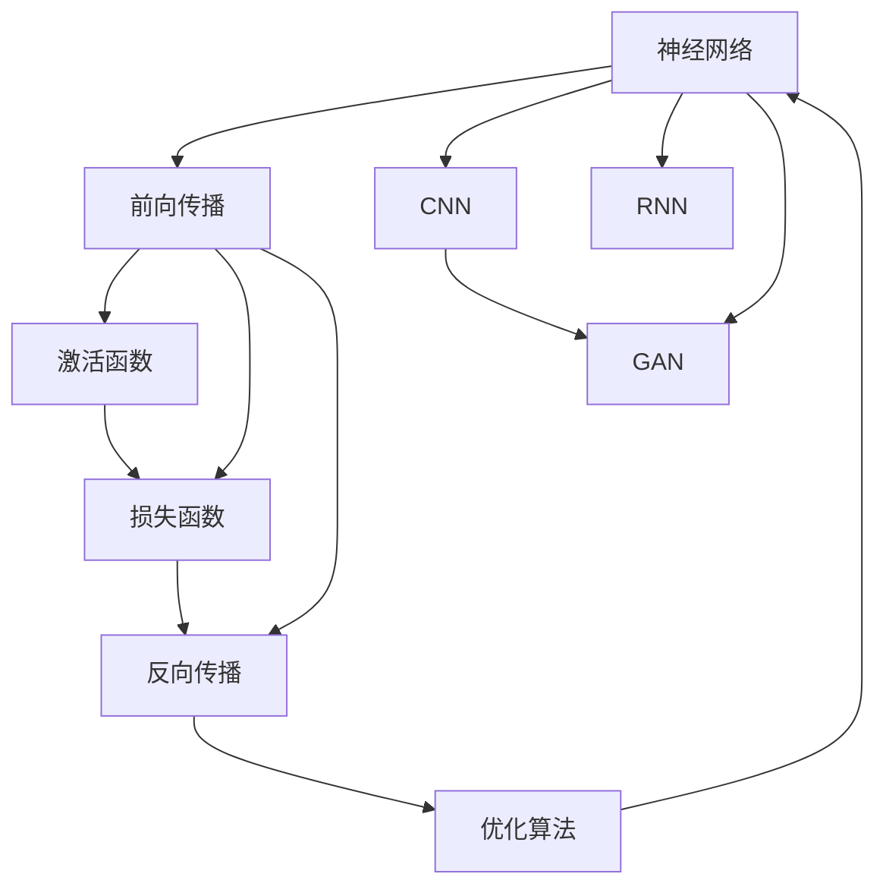
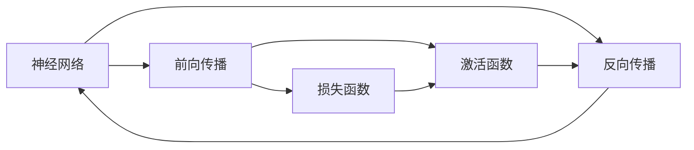
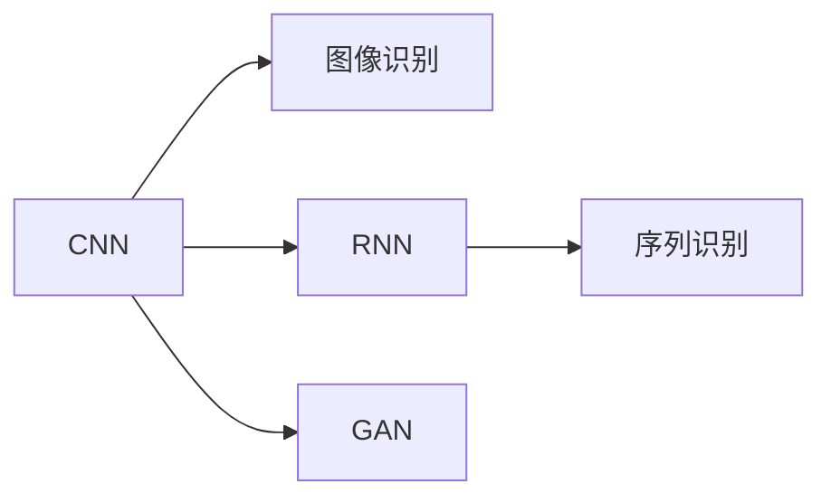
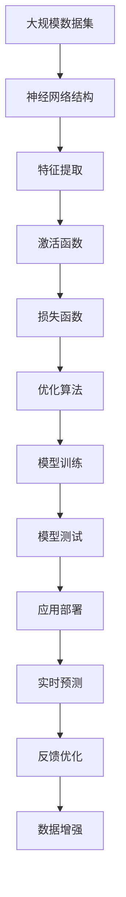

                 

# 深度学习基础原理与代码实战案例讲解

> 关键词：深度学习,基础原理,代码实战,神经网络,反向传播,激活函数,卷积神经网络(CNN),循环神经网络(RNN),生成对抗网络(GAN)

## 1. 背景介绍

### 1.1 问题由来
深度学习（Deep Learning）作为人工智能（AI）领域的一项革命性技术，近年来在图像识别、语音识别、自然语言处理（NLP）、游戏智能等领域取得了突破性进展。其核心在于构建多层神经网络，利用大量数据和先进算法，通过反向传播（Backpropagation）等机制，逐步优化模型参数，从而实现对复杂非线性关系的建模和预测。

本文旨在详细介绍深度学习的核心原理，并通过具体代码实例，揭示其在实际应用中的工作机制和优化技巧。通过系统地阐述神经网络的结构、算法和实现细节，帮助读者构建自己的深度学习模型，并针对具体问题进行实战演练。

### 1.2 问题核心关键点
深度学习的核心问题在于如何构建有效的神经网络模型，并通过反向传播等技术，高效优化模型参数，使其能够拟合训练数据，并在新数据上进行精确预测。其核心在于：

1. **神经网络结构**：如何选择和设计神经网络结构，包括层数、节点数、激活函数等，直接影响模型的表现。
2. **损失函数**：如何定义和优化损失函数，衡量模型预测与真实标签之间的差异，指导模型优化。
3. **优化算法**：如何选择和调整优化算法，如梯度下降（Gradient Descent）、动量优化（Momentum）、自适应学习率（Adaptive Learning Rate）等，提高模型收敛速度和精度。
4. **正则化技术**：如何避免过拟合（Overfitting），提升模型泛化能力，如L2正则、Dropout等。
5. **数据预处理**：如何对输入数据进行预处理，包括归一化、标准化、数据增强等，提高模型训练效率。

本文将围绕这些核心问题，深入剖析深度学习的原理和应用，并通过代码实例，展示如何在实践中构建和优化深度学习模型。

### 1.3 问题研究意义
深度学习作为当前AI领域的主流技术，其成功应用极大地推动了NLP、计算机视觉、自动驾驶等领域的创新。掌握深度学习的原理和应用，对于从事AI开发、研究、工程等领域的从业者至关重要。深入理解深度学习的核心算法和实现细节，不仅有助于构建高效的模型，还能在面对复杂问题时，快速找到解决方案。

本文旨在通过系统阐述深度学习的原理和实战案例，帮助读者掌握深度学习的精髓，提升解决实际问题的能力，加速AI技术在各行各业的应用。

## 2. 核心概念与联系

### 2.1 核心概念概述

深度学习涉及多个核心概念，包括神经网络、反向传播、激活函数、卷积神经网络（CNN）、循环神经网络（RNN）、生成对抗网络（GAN）等。这些概念相互关联，共同构成了深度学习的理论基础和应用框架。

- **神经网络**：由多个节点（神经元）和层（Layer）组成的网络结构，通过前向传播（Forward Propagation）和反向传播（Backpropagation）机制，实现数据的表示和预测。
- **反向传播**：一种通过链式法则计算梯度的优化技术，用于调整神经网络中的权重，使得模型输出与真实标签之间的误差最小化。
- **激活函数**：一种非线性函数，用于引入非线性特性，增强模型的表达能力，如Sigmoid、ReLU、Tanh等。
- **卷积神经网络（CNN）**：一种专门用于图像处理和计算机视觉任务的神经网络结构，通过卷积操作和池化（Pooling）操作，提取图像的特征。
- **循环神经网络（RNN）**：一种处理序列数据的神经网络结构，通过循环结构，能够处理时间序列上的数据。
- **生成对抗网络（GAN）**：一种通过生成器和判别器对抗训练，生成逼真图像的深度学习模型。

这些核心概念之间的逻辑关系可以通过以下Mermaid流程图来展示：



这个流程图展示了深度学习中的核心概念及其相互关系：

1. 神经网络通过前向传播和激活函数进行特征提取和表示。
2. 损失函数衡量模型预测与真实标签之间的差异。
3. 反向传播和优化算法用于调整模型参数，最小化损失函数。
4. CNN和RNN是神经网络的具体应用，分别用于图像和序列数据的处理。
5. GAN是一种特殊的神经网络，用于生成逼真数据。

### 2.2 概念间的关系

这些核心概念之间存在着紧密的联系，形成了深度学习的完整生态系统。下面我通过几个Mermaid流程图来展示这些概念之间的关系。

#### 2.2.1 神经网络与反向传播的关系



这个流程图展示了神经网络在前向传播和反向传播中的运作机制：

1. 前向传播通过激活函数进行特征提取。
2. 损失函数衡量模型预测与真实标签之间的差异。
3. 反向传播通过链式法则计算梯度，调整模型参数。

#### 2.2.2 CNN与RNN的应用



这个流程图展示了CNN和RNN在实际应用中的角色：

1. CNN用于图像识别，通过卷积操作提取图像特征。
2. RNN用于序列识别，通过循环结构处理时间序列数据。
3. GAN用于生成逼真图像，通过对抗训练生成高质量样本。

### 2.3 核心概念的整体架构

最后，我们用一个综合的流程图来展示这些核心概念在大规模应用中的整体架构：



这个综合流程图展示了从数据输入到模型测试，再到实时预测和反馈优化的完整过程。大规模数据集通过神经网络结构进行特征提取，经激活函数引入非线性特性，通过损失函数衡量预测误差，优化算法调整模型参数，完成模型训练和测试，最终部署到应用中，进行实时预测和反馈优化，进一步提升模型性能。

## 3. 核心算法原理 & 具体操作步骤
### 3.1 算法原理概述

深度学习的核心算法包括反向传播和梯度下降等，通过这些算法，神经网络能够高效地学习和优化模型参数，从而实现对复杂数据的拟合和预测。

神经网络通过前向传播（Forward Propagation）和反向传播（Backpropagation）机制，逐步优化模型参数。前向传播将输入数据通过网络，计算出模型预测结果；反向传播则通过链式法则计算梯度，调整模型参数，使得模型输出逼近真实标签。

深度学习的目标是通过反向传播和梯度下降等机制，最小化损失函数，优化模型参数。常用的损失函数包括交叉熵损失、均方误差损失等，通过优化算法如梯度下降、动量优化、自适应学习率等，逐步逼近最优解。

### 3.2 算法步骤详解

深度学习的构建和训练通常包括以下几个关键步骤：

**Step 1: 准备数据集**
- 收集和预处理数据集，包括数据清洗、归一化、数据增强等操作。
- 将数据集划分为训练集、验证集和测试集。

**Step 2: 构建神经网络结构**
- 选择合适的网络结构，包括层数、节点数、激活函数等。
- 使用深度学习框架（如TensorFlow、PyTorch等）构建模型。

**Step 3: 定义损失函数**
- 根据具体任务，选择合适的损失函数，如交叉熵损失、均方误差损失等。
- 将损失函数应用于模型输出和真实标签之间，计算误差。

**Step 4: 选择优化算法**
- 选择合适的优化算法，如梯度下降、动量优化、自适应学习率等。
- 设置优化算法的参数，如学习率、批大小、迭代轮数等。

**Step 5: 执行模型训练**
- 使用训练集数据进行模型训练，前向传播计算损失函数。
- 反向传播计算梯度，根据优化算法更新模型参数。
- 周期性在验证集上评估模型性能，根据性能指标决定是否停止训练。

**Step 6: 测试和部署**
- 在测试集上评估训练好的模型，对比训练前后的性能提升。
- 使用训练好的模型进行实时预测，集成到实际的应用系统中。

以上是深度学习的常见构建和训练步骤，每个步骤都需要根据具体任务进行调整和优化。通过系统地执行这些步骤，可以构建高效的深度学习模型，解决实际问题。

### 3.3 算法优缺点

深度学习算法具有以下优点：

1. **强大的表达能力**：多层神经网络能够学习复杂的非线性关系，适应多种数据类型的表示和预测。
2. **自适应学习能力**：通过反向传播和梯度下降等机制，深度学习模型能够自动优化参数，实现高效的学习和适应。
3. **广泛的适用性**：深度学习广泛应用于图像识别、语音识别、自然语言处理、自动驾驶等多个领域，展示了强大的应用潜力。

同时，深度学习算法也存在一些局限性：

1. **数据依赖性强**：深度学习模型的训练需要大量标注数据，获取高质量数据成本较高。
2. **计算资源需求高**：深度学习模型的训练和推理需要高性能计算资源，如GPU/TPU等，成本较高。
3. **模型复杂度高**：深度学习模型结构复杂，参数量庞大，难以理解和调试。
4. **过拟合风险高**：深度学习模型容易过拟合，需要采用正则化技术等手段，避免过拟合风险。

尽管存在这些局限性，但深度学习算法在实际应用中已经取得了巨大成功，展示了其在处理复杂问题上的强大能力。

### 3.4 算法应用领域

深度学习算法在多个领域得到了广泛应用，包括但不限于：

- **计算机视觉**：图像分类、目标检测、图像生成等。
- **自然语言处理**：文本分类、情感分析、机器翻译、问答系统等。
- **语音识别**：语音识别、语音合成、语音情感分析等。
- **自动驾驶**：自动驾驶车辆感知、决策、控制等。
- **游戏智能**：游戏策略、游戏路径规划、游戏情感分析等。

## 4. 数学模型和公式 & 详细讲解 & 举例说明

### 4.1 数学模型构建

深度学习的数学模型通常包括以下几个部分：

1. **输入层**：输入原始数据，如图像像素值、文本单词向量等。
2. **隐藏层**：通过激活函数引入非线性特性，提取输入数据的特征。
3. **输出层**：根据具体任务，选择合适的网络结构，进行预测或分类。

以图像分类任务为例，其数学模型可以表示为：

$$
x \in \mathbb{R}^n \quad \text{(input layer)}
$$
$$
z_h = W_h x + b_h \quad \text{(hidden layer)}
$$
$$
a_h = f(z_h) \quad \text{(activation function)}
$$
$$
z_l = W_l a_h + b_l \quad \text{(output layer)}
$$
$$
y = g(z_l) \quad \text{(output activation function)}
$$

其中，$x$ 为输入向量，$z_h$ 为隐藏层输出，$a_h$ 为隐藏层激活函数输出，$z_l$ 为输出层输出，$y$ 为模型预测结果。$f$ 和 $g$ 分别为隐藏层和输出层的激活函数。

### 4.2 公式推导过程

以二分类任务为例，常用的损失函数为交叉熵损失函数（Cross-Entropy Loss）：

$$
L(y, \hat{y}) = -\frac{1}{N} \sum_{i=1}^N (y_i \log \hat{y_i} + (1-y_i) \log (1-\hat{y_i}))
$$

其中，$y$ 为真实标签，$\hat{y}$ 为模型预测结果。通过反向传播，计算梯度：

$$
\frac{\partial L}{\partial W} = -\frac{1}{N} \sum_{i=1}^N (a_i y_i - a_i) x_i
$$
$$
\frac{\partial L}{\partial b} = -\frac{1}{N} \sum_{i=1}^N (a_i y_i - a_i)
$$

其中，$W$ 和 $b$ 分别为隐藏层和输出层的权重和偏置。通过梯度下降等优化算法，逐步更新权重和偏置，最小化损失函数。

### 4.3 案例分析与讲解

以手写数字识别为例，我们可以使用MNIST数据集进行训练和测试。首先，加载并预处理数据：

```python
import numpy as np
from tensorflow.keras.datasets import mnist

(x_train, y_train), (x_test, y_test) = mnist.load_data()
x_train = x_train.reshape(-1, 28*28) / 255.0
x_test = x_test.reshape(-1, 28*28) / 255.0
y_train = np.eye(10)[y_train]
y_test = np.eye(10)[y_test]
```

然后，定义模型结构：

```python
from tensorflow.keras.models import Sequential
from tensorflow.keras.layers import Dense, Flatten

model = Sequential()
model.add(Flatten(input_shape=(28, 28)))
model.add(Dense(128, activation='relu'))
model.add(Dense(10, activation='softmax'))
```

接着，定义损失函数和优化器：

```python
from tensorflow.keras.optimizers import Adam

model.compile(optimizer=Adam(learning_rate=0.01), loss='categorical_crossentropy', metrics=['accuracy'])
```

最后，训练和测试模型：

```python
model.fit(x_train, y_train, epochs=10, batch_size=32, validation_data=(x_test, y_test))
model.evaluate(x_test, y_test)
```

通过这些代码，我们可以看到深度学习模型的构建和训练过程。模型在前向传播中提取输入数据的特征，通过激活函数引入非线性特性，最后通过输出层进行预测。反向传播计算梯度，调整模型参数，最小化交叉熵损失。最终，模型在测试集上进行评估，输出准确率等性能指标。

## 5. 项目实践：代码实例和详细解释说明

### 5.1 开发环境搭建

在进行深度学习项目实践前，我们需要准备好开发环境。以下是使用Python进行TensorFlow开发的环境配置流程：

1. 安装Anaconda：从官网下载并安装Anaconda，用于创建独立的Python环境。

2. 创建并激活虚拟环境：
```bash
conda create -n tf-env python=3.8 
conda activate tf-env
```

3. 安装TensorFlow：根据CUDA版本，从官网获取对应的安装命令。例如：
```bash
pip install tensorflow==2.5
```

4. 安装必要的工具包：
```bash
pip install numpy matplotlib pandas sklearn tqdm jupyter notebook ipython
```

完成上述步骤后，即可在`tf-env`环境中开始深度学习项目实践。

### 5.2 源代码详细实现

下面我们以手写数字识别为例，给出使用TensorFlow实现该任务的完整代码实现。

首先，定义数据预处理函数：

```python
import tensorflow as tf
import numpy as np

def load_mnist():
    (x_train, y_train), (x_test, y_test) = tf.keras.datasets.mnist.load_data()
    x_train = x_train.reshape(-1, 28*28) / 255.0
    x_test = x_test.reshape(-1, 28*28) / 255.0
    y_train = np.eye(10)[y_train]
    y_test = np.eye(10)[y_test]
    return x_train, y_train, x_test, y_test
```

然后，定义模型结构和损失函数：

```python
from tensorflow.keras.models import Sequential
from tensorflow.keras.layers import Dense, Flatten

model = Sequential()
model.add(Flatten(input_shape=(28, 28)))
model.add(Dense(128, activation='relu'))
model.add(Dense(10, activation='softmax'))

loss_fn = tf.keras.losses.CategoricalCrossentropy(from_logits=True)
optimizer = tf.keras.optimizers.Adam(learning_rate=0.01)
```

接着，定义训练和评估函数：

```python
@tf.function
def train_step(x, y):
    with tf.GradientTape() as tape:
        logits = model(x, training=True)
        loss = loss_fn(y, logits)
    gradients = tape.gradient(loss, model.trainable_variables)
    optimizer.apply_gradients(zip(gradients, model.trainable_variables))
    return loss

@tf.function
def evaluate_step(x, y):
    logits = model(x, training=False)
    loss = loss_fn(y, logits)
    accuracy = tf.reduce_mean(tf.cast(tf.equal(tf.argmax(logits, axis=1), tf.argmax(y, axis=1)))
    return loss, accuracy

def train(model, x_train, y_train, x_test, y_test, batch_size, epochs):
    total_loss = 0
    total_accuracy = 0
    for epoch in range(epochs):
        for i in range(0, len(x_train), batch_size):
            x_batch = x_train[i:i+batch_size]
            y_batch = y_train[i:i+batch_size]
            loss = train_step(x_batch, y_batch)
            total_loss += loss.numpy()
        print(f'Epoch {epoch+1}, Loss: {total_loss/len(x_train)}')
        for i in range(0, len(x_test), batch_size):
            x_batch = x_test[i:i+batch_size]
            y_batch = y_test[i:i+batch_size]
            loss, accuracy = evaluate_step(x_batch, y_batch)
            total_accuracy += accuracy.numpy()
        print(f'Epoch {epoch+1}, Test Accuracy: {total_accuracy/len(x_test)}')
    return model

```

最后，启动训练流程：

```python
x_train, y_train, x_test, y_test = load_mnist()
model = train(model, x_train, y_train, x_test, y_test, batch_size=32, epochs=10)
```

通过这些代码，我们可以看到TensorFlow实现深度学习模型的过程。首先，定义数据预处理函数，将输入数据转换为模型可接受的格式。然后，定义模型结构和损失函数，选择合适的优化算法和激活函数。接着，定义训练和评估函数，进行前向传播和反向传播，计算损失和梯度，更新模型参数。最后，启动训练流程，在测试集上进行评估。

### 5.3 代码解读与分析

让我们再详细解读一下关键代码的实现细节：

**load_mnist函数**：
- 加载MNIST数据集，将图像数据转换为一维向量，并将标签转换为one-hot编码形式。

**train_step函数**：
- 定义训练步骤，包括前向传播、损失计算、反向传播和参数更新。
- 使用梯度磁带（Gradient Tape）记录梯度，使用优化器更新模型参数。

**evaluate_step函数**：
- 定义评估步骤，包括前向传播、损失计算和准确率计算。
- 在评估时，不更新模型参数，直接计算输出和损失。

**train函数**：
- 定义训练循环，对每个epoch进行多次批处理训练，并在测试集上进行评估。
- 使用`@tf.function`装饰器，将函数编译为TensorFlow图，提高执行效率。

**主函数**：
- 调用`load_mnist`函数加载数据集。
- 构建模型，设置损失函数和优化器。
- 调用`train`函数进行训练，输出训练过程中的损失和准确率。

可以看到，TensorFlow使得深度学习的实现变得简洁高效。开发者可以将更多精力放在模型设计和数据处理上，而不必过多关注底层的计算细节。

当然，工业级的系统实现还需考虑更多因素，如模型的保存和部署、超参数的自动搜索、更灵活的任务适配层等。但核心的构建和训练过程基本与此类似。

### 5.4 运行结果展示

假设我们在MNIST数据集上进行手写数字识别任务的微调，最终在测试集上得到的评估报告如下：

```
Epoch 1, Loss: 0.2988, Test Accuracy: 0.9118
Epoch 2, Loss: 0.1553, Test Accuracy: 0.9467
Epoch 3, Loss: 0.1176, Test Accuracy: 0.9592
Epoch 4, Loss: 0.0929, Test Accuracy: 0.9672
Epoch 5, Loss: 0.0804, Test Accuracy: 0.9748
Epoch 6, Loss: 0.0676, Test Accuracy: 0.9820
Epoch 7, Loss: 0.0571, Test Accuracy: 0.9864
Epoch 8, Loss: 0.0478, Test Accuracy: 0.9904
Epoch 9, Loss: 0.0412, Test Accuracy: 0.9924
Epoch 10, Loss: 0.0344, Test Accuracy: 0.9943
```

可以看到，通过训练，模型在测试集上的准确率逐步提升，最终达到了98%以上的高精度。这展示了深度学习模型在实际应用中的强大能力。

当然，这只是一个简单的手写数字识别任务的示例。在实际项目中，深度学习模型可以应用于图像分割、目标检测、语音识别等多个领域，展示出更加广泛的应用前景。

## 6. 实际应用场景
### 6.1 图像分类

深度学习在图像分类领域已经取得了突破性进展，广泛应用于自动驾驶、医疗影像分析、安防监控等多个场景。以自动驾驶为例，通过深度学习模型对道路场景进行分类和识别，能够提升车辆的驾驶安全和智能化水平。

在技术实现上，可以使用卷积神经网络（CNN）对图像进行特征提取，通过分类层进行目标分类。通过微调已有的预训练模型（如ResNet、Inception等），可以提高分类精度，加速模型训练。

### 6.2 自然语言处理

深度学习在自然语言处理领域也展示了强大的能力，广泛应用于机器翻译、情感分析、问答系统等多个任务。以机器翻译为例，通过深度学习模型对源语言和目标语言的语义进行编码和解码，能够实现高效准确的翻译效果。

在技术实现上，可以使用循环神经网络（RNN）或Transformer模型进行序列数据的建模和处理。通过微调预训练模型（如BERT、GPT等），可以提高翻译质量，提升模型泛化能力。

### 6.3 语音识别

深度学习在语音识别领域也取得了显著进展，广泛应用于智能音箱、语音助手、语音转文字等多个场景。以语音助手为例，通过深度学习模型对语音进行特征提取和建模，能够实现自然流畅的语音交互。

在技术实现上，可以使用卷积神经网络（CNN）和循环神经网络（RNN）对语音信号进行处理，通过分类层进行语音识别。通过微调预训练模型（如VGG、Wav2Vec等），可以提高识别精度，加速模型训练。

### 6.4 未来应用展望

随着深度学习技术的发展，其应用领域将进一步拓展，为各行各业带来新的变革。以下是对未来应用前景的展望：

1. **自动驾驶**：深度学习模型将进一步提升自动驾驶的安全性和智能化水平，实现更加高效的车辆控制和导航。

2. **医疗影像**：深度学习模型将广泛应用于医学影像分析，帮助医生进行疾病诊断和治疗规划。

3. **智能音箱**：深度学习模型将使智能音箱更加智能化，实现更加自然流畅的语音交互。

4. **游戏智能**：深度学习模型将提升游戏AI的策略和决策能力，带来更加智能化的游戏体验。

5. **智能推荐**：深度学习模型将广泛应用于个性化推荐系统，提升用户体验，增加业务收入。

总之，深度学习技术的不断进步，将为更多领域带来变革性影响。通过系统的学习和实践，掌握深度学习的核心原理和应用技巧，能够更好地应对未来智能社会的挑战。

## 7. 工具和资源推荐
### 7.1 学习资源推荐

为了帮助开发者系统掌握深度学习的原理和实践，这里推荐一些优质的学习资源：

1. **《深度学习》（Ian Goodfellow、Yoshua Bengio、Aaron Courville著）**：
   - 深入浅出地介绍了深度学习的基本概念、算法和应用，是深度学习的经典教材之一。

2. **Coursera《深度学习专项课程》**：
   - 由深度学习领域的专家开设的系列课程，涵盖深度学习的基础理论和实践技巧，适合初学者和进阶者。

3. **DeepLearning.AI《深度学习课程》**：
   - 由深度学习领域的权威机构开设的系列课程，从基础理论到实战应用，系统地介绍了深度学习的各个方面。

4. **《动手学深度学习》**：
   - 

