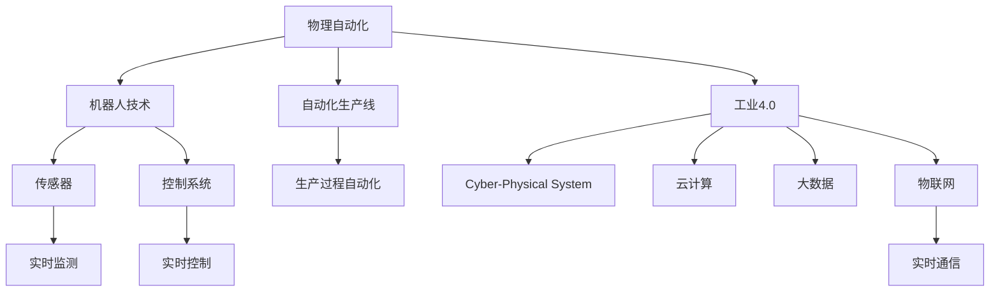

                 

# 物理实体自动化的技术发展

> 关键词：物理自动化, 机器人技术, 自动化生产线, 工业4.0, 人工智能与机器学习, 物联网(IoT)

## 1. 背景介绍

### 1.1 问题由来
随着信息技术的飞速发展，人类社会的各个方面都发生了翻天覆地的变化。在制造业领域，传统的生产方式已不能满足现代企业对效率、质量、成本等方面的要求。物理实体自动化，即通过机器人技术、自动化生产线等方式，使生产过程实现智能化和自动化，已成为制造业转型升级的必由之路。

近年来，随着人工智能(AI)和机器学习(ML)技术的迅速崛起，物理实体的自动化也迎来了新的技术突破。AI和ML技术通过算法优化、模型训练等方式，能够使物理实体自动化系统具有更高的智能性和适应性。本文将详细介绍物理实体自动化的技术发展历程和未来前景，并探讨其背后的核心算法原理与操作步骤。

## 2. 核心概念与联系

### 2.1 核心概念概述

在讨论物理实体自动化技术的发展之前，我们首先需要了解一些关键概念：

- **物理自动化(Physical Automation)**：指通过机器人、自动化设备等技术，对物理实体进行控制、搬运、装配等操作，实现生产过程的自动化和智能化。
- **机器人技术(Robotics)**：包括机器人本体、传感器、控制系统等，是物理自动化中的核心技术之一。
- **自动化生产线(Automatic Production Line)**：指利用自动化设备和机器人，实现从原材料输入到成品输出的全流程自动化。
- **工业4.0(Industry 4.0)**：指通过信息物理系统(Cyber-Physical System, CPS)、云计算、大数据、物联网(IoT)等技术，实现制造业的智能化和自动化。
- **人工智能与机器学习(AI/ML)**：指通过算法优化和模型训练，使机器人、自动化设备等物理实体具备更高的智能性和适应性。
- **物联网(IoT)**：指通过传感器、通信技术等，实现物理实体与互联网的互联互通，进而实现数据的实时采集、处理和应用。

这些概念之间存在着紧密的联系，共同构成了物理实体自动化的技术体系。以下是它们的联系关系：



### 2.2 概念间的关系

物理自动化技术的发展离不开机器人技术、自动化生产线、工业4.0、AI/ML和IoT等关键技术的支撑。以下是各概念间的关系：

- **机器人技术与物理自动化**：机器人技术是物理自动化的核心，能够实现对物理实体的精准控制和操作。
- **自动化生产线与物理自动化**：自动化生产线是物理自动化技术的具体应用，通过自动化设备和机器人，实现生产过程的自动化。
- **工业4.0与物理自动化**：工业4.0通过CPS、云计算、大数据和IoT等技术，使物理自动化系统具备更高的智能化和自动化水平。
- **AI/ML与物理自动化**：AI/ML通过算法优化和模型训练，使机器人、自动化设备等物理实体具备更高的智能性和适应性。
- **IoT与物理自动化**：IoT通过实时监测和通信技术，使物理自动化系统具备更高的实时性和灵活性。

这些概念之间的联系关系可以总结为：物理自动化是基础，机器人技术是核心，自动化生产线是应用，工业4.0是支撑，AI/ML是提升，IoT是连接。

## 3. 核心算法原理 & 具体操作步骤

### 3.1 算法原理概述

物理实体自动化的核心算法原理主要包括机器人路径规划、运动控制、任务调度等。这些算法需要结合机器学习技术，通过大量的数据训练和优化，使机器人具备更高的智能性和适应性。

- **机器人路径规划**：指通过算法计算机器人从起点到终点的最优路径，以避开障碍物，提高搬运效率。
- **运动控制**：指通过算法控制机器人关节、电机等执行器，实现精准的运动控制。
- **任务调度**：指通过算法对机器人进行任务分配和调度，以实现多机器人协同工作。

这些算法的优化需要结合机器学习技术，通过大量的数据训练和优化，使机器人具备更高的智能性和适应性。

### 3.2 算法步骤详解

物理实体自动化的核心算法步骤包括以下几个关键步骤：

1. **数据收集与预处理**：收集机器人操作相关的数据，包括传感器数据、环境数据、任务指令等。对数据进行清洗和预处理，去除噪声和不相关数据。

2. **模型训练**：使用机器学习算法，如深度学习、强化学习等，对数据进行模型训练，得到路径规划、运动控制、任务调度等算法模型。

3. **模型评估与优化**：对训练好的模型进行评估，通过交叉验证等方法进行优化，以提高模型的泛化能力和精度。

4. **算法实现与测试**：将训练好的模型应用到实际机器人系统中，进行模拟和测试，优化算法性能，提升机器人操作效率和精度。

5. **实际部署与监控**：将优化后的模型部署到实际生产环境中，实时监测系统性能，进行必要的调整和优化。

### 3.3 算法优缺点

物理实体自动化的核心算法具有以下优点：

- **提高生产效率**：通过路径规划、运动控制、任务调度等算法，能够大幅提高生产效率，降低人工成本。
- **提高产品质量**：通过优化机器人操作，减少人为失误，提高产品质量和一致性。
- **提高灵活性**：通过机器学习技术，使机器人具备更高的智能性和适应性，能够适应不同环境和任务需求。

同时，这些算法也存在以下缺点：

- **数据依赖性强**：算法效果很大程度上取决于数据质量和数量，数据收集和预处理工作量大。
- **模型复杂度高**：算法模型通常较为复杂，训练和优化需要较高的计算资源。
- **适应性不足**：算法对特定环境和任务有较强依赖，环境变化或任务复杂度增加可能导致算法失效。
- **安全性问题**：算法系统一旦出现故障，可能对生产设备和人员造成安全威胁。

### 3.4 算法应用领域

物理实体自动化的核心算法广泛应用于制造业、物流、仓储、自动化生产线等领域，以下是一些具体应用场景：

- **制造业**：通过自动化生产线，实现从原材料输入到成品输出的全流程自动化。
- **物流与仓储**：通过自动化搬运设备，实现货物的存储、分拣、搬运等操作。
- **自动化生产线**：通过机器人技术，实现自动化装配、焊接、切割等操作。
- **医疗**：通过机器人技术，实现手术操作、药品搬运等操作。
- **农业**：通过机器人技术，实现自动化播种、收割、施肥等操作。
- **服务业**：通过自动化服务机器人，实现客户服务、商品配送等操作。

## 4. 数学模型和公式 & 详细讲解 & 举例说明

### 4.1 数学模型构建

物理实体自动化的核心算法涉及大量的数学模型和公式。以下是一些常见的数学模型和公式：

- **机器人路径规划**：基于A*算法和Dijkstra算法，通过计算机器人从起点到终点的最优路径，以避开障碍物。
- **运动控制**：基于PID控制算法和模型预测控制算法，通过控制机器人关节、电机等执行器，实现精准的运动控制。
- **任务调度**：基于多智能体系统(Multi-Agent System, MAS)和蚁群算法，对机器人进行任务分配和调度，以实现多机器人协同工作。

### 4.2 公式推导过程

以机器人路径规划为例，假设机器人需要在平面上进行路径规划，避开障碍物。基于A*算法，计算路径规划的数学模型如下：

1. **状态表示**：将平面分为若干个网格，每个网格代表一个状态。
2. **动作表示**：定义机器人的四个基本动作：上、下、左、右。
3. **代价函数**：定义状态间的代价函数，包括机器人移动距离、障碍物障碍物避让距离等。
4. **启发函数**：定义启发函数，指引机器人向目标状态前进。

根据上述模型，可以推导出A*算法的基本公式：

$$
F(n) = G(n) + H(n)
$$

其中，$G(n)$为从起点到状态$n$的实际代价，$H(n)$为从状态$n$到目标状态的估计代价。具体推导过程如下：

1. 定义状态表示和动作表示，建立状态转移图。
2. 定义代价函数和启发函数，计算每个状态的最小代价。
3. 从起点开始，依次计算每个状态的最小代价，得到最优路径。

### 4.3 案例分析与讲解

以一个简单的路径规划案例为例，假设机器人需要在平面上进行路径规划，避开障碍物。以下是具体的计算过程：

1. **状态表示**：将平面分为若干个网格，每个网格代表一个状态。
2. **动作表示**：定义机器人的四个基本动作：上、下、左、右。
3. **代价函数**：定义状态间的代价函数，包括机器人移动距离、障碍物避让距离等。
4. **启发函数**：定义启发函数，指引机器人向目标状态前进。

根据上述模型，可以计算出最优路径。例如，下图展示了一个简单的路径规划案例：

```
    S     E
    |     |
    |     |
    |     |
    |     |
    |     |
    |     |
    |     |
    |     |
    |     |
    |     |
    |     |
    |     |
    |     |
    |     |
    |     |
    |     |
    |     |
    |     |
    |     |
    |     |
    |     |
    |     |
    |     |
    |     |
    |     |
    |     |
    |     |
    |     |
    |     |
    |     |
    |     |
    |     |
    |     |
    |     |
    |     |
    |     |
    |     |
    |     |
    |     |
    |     |
    |     |
    |     |
    |     |
    |     |
    |     |
    |     |
    |     |
    |     |
    |     |
    |     |
    |     |
    |     |
    |     |
    |     |
    |     |
    |     |
    |     |
    |     |
    |     |
    |     |
    |     |
    |     |
    |     |
    |     |
    |     |
    |     |
    |     |
    |     |
    |     |
    |     |
    |     |
    |     |
    |     |
    |     |
    |     |
    |     |
    |     |
    |     |
    |     |
    |     |
    |     |
    |     |
    |     |
    |     |
    |     |
    |     |
    |     |
    |     |
    |     |
    |     |
    |     |
    |     |
    |     |
    |     |
    |     |
    |     |
    |     |
    |     |
    |     |
    |     |
    |     |
    |     |
    |     |
    |     |
    |     |
    |     |
    |     |
    |     |
    |     |
    |     |
    |     |
    |     |
    |     |
    |     |
    |     |
    |     |
    |     |
    |     |
    |     |
    |     |
    |     |
    |     |
    |     |
    |     |
    |     |
    |     |
    |     |
    |     |
    |     |
    |     |
    |     |
    |     |
    |     |
    |     |
    |     |
    |     |
    |     |
    |     |
    |     |
    |     |
    |     |
    |     |
    |     |
    |     |
    |     |
    |     |
    |     |
    |     |
    |     |
    |     |
    |     |
    |     |
    |     |
    |     |
    |     |
    |     |
    |     |
    |     |
    |     |
    |     |
    |     |
    |     |
    |     |
    |     |
    |     |
    |     |
    |     |
    |     |
    |     |
    |     |
    |     |
    |     |
    |     |
    |     |
    |     |
    |     |
    |     |
    |     |
    |     |
    |     |
    |     |
    |     |
    |     |
    |     |
    |     |
    |     |
    |     |
    |     |
    |     |
    |     |
    |     |
    |     |
    |     |
    |     |
    |     |
    |     |
    |     |
    |     |
    |     |
    |     |
    |     |
    |     |
    |     |
    |     |
    |     |
    |     |
    |     |
    |     |
    |     |
    |     |
    |     |
    |     |
    |     |
    |     |
    |     |
    |     |
    |     |
    |     |
    |     |
    |     |
    |     |
    |     |
    |     |
    |     |
    |     |
    |     |
    |     |
    |     |
    |     |
    |     |
    |     |
    |     |
    |     |
    |     |
    |     |
    |     |
    |     |
    |     |
    |     |
    |     |
    |     |
    |     |
    |     |
    |     |
    |     |
    |     |
    |     |
    |     |
    |     |
    |     |
    |     |
    |     |
    |     |
    |     |
    |     |
    |     |
    |     |
    |     |
    |     |
    |     |
    |     |
    |     |
    |     |
    |     |
    |     |
    |     |
    |     |
    |     |
    |     |
    |     |
    |     |
    |     |
    |     |
    |     |
    |     |
    |     |
    |     |
    |     |
    |     |
    |     |
    |     |
    |     |
    |     |
    |     |
    |     |
    |     |
    |     |
    |     |
    |     |
    |     |
    |     |
    |     |
    |     |
    |     |
    |     |
    |     |
    |     |
    |     |
    |     |
    |     |
    |     |
    |     |
    |     |
    |     |
    |     |
    |     |
    |     |
    |     |
    |     |
    |     |
    |     |
    |     |
    |     |
    |     |
    |     |
    |     |
    |     |
    |     |
    |     |
    |     |
    |     |
    |     |
    |     |
    |     |
    |     |
    |     |
    |     |
    |     |
    |     |
    |     |
    |     |
    |     |
    |     |
    |     |
    |     |
    |     |
    |     |
    |     |
    |     |
    |     |
    |     |
    |     |
    |     |
    |     |
    |     |
    |     |
    |     |
    |     |
    |     |
    |     |
    |     |
    |     |
    |     |
    |     |
    |     |
    |     |
    |     |
    |     |
    |     |
    |     |
    |     |
    |     |
    |     |
    |     |
    |     |
    |     |
    |     |
    |     |
    |     |
    |     |
    |     |
    |     |
    |     |
    |     |
    |     |
    |     |
    |     |
    |     |
    |     |
    |     |
    |     |
    |     |
    |     |
    |     |
    |     |
    |     |
    |     |
    |     |
    |     |
    |     |
    |     |
    |     |
    |     |
    |     |
    |     |
    |     |
    |     |
    |     |
    |     |
    |     |
    |     |
    |     |
    |     |
    |     |
    |     |
    |     |
    |     |
    |     |
    |     |
    |     |
    |     |
    |     |
    |     |
    |     |
    |     |
    |     |
    |     |
    |     |
    |     |
    |     |
    |     |
    |     |
    |     |
    |     |
    |     |
    |     |
    |     |
    |     |
    |     |
    |     |
    |     |
    |     |
    |     |
    |     |
    |     |
    |     |
    |     |
    |     |
    |     |
    |     |
    |     |
    |     |
    |     |
    |     |
    |     |
    |     |
    |     |
    |     |
    |     |
    |     |
    |     |
    |     |
    |     |
    |     |
    |     |
    |     |
    |     |
    |     |
    |     |
    |     |
    |     |
    |     |
    |     |
    |     |
    |     |
    |     |
    |     |
    |     |
    |     |
    |     |
    |     |
    |     |
    |     |
    |     |
    |     |
    |     |
    |     |
    |     |
    |     |
    |     |
    |     |
    |     |
    |     |
    |     |
    |     |
    |     |
    |     |
    |     |
    |     |
    |     |
    |     |
    |     |
    |     |
    |     |
    |     |
    |     |
    |     |
    |     |
    |     |
    |     |
    |     |
    |     |
    |     |
    |     |
    |     |
    |     |
    |     |
    |     |
    |     |
    |     |
    |     |
    |     |
    |     |
    |     |
    |     |
    |     |
    |     |
    |     |
    |     |
    |     |
    |     |
    |     |
    |     |
    |     |
    |     |
    |     |
    |     |
    |     |
    |     |
    |     |
    |     |
    |     |
    |     |
    |     |
    |     |
    |     |
    |     |
    |     |
    |     |
    |     |
    |     |
    |     |
    |     |
    |     |
    |     |
    |     |
    |     |
    |     |
    |     |
    |     |
    |     |
    |     |
    |     |
    |     |
    |     |
    |     |
    |     |
    |     |
    |     |
    |     |
    |     |
    |     |
    |     |
    |     |
    |     |
    |     |
    |     |
    |     |
    |     |
    |     |
    |     |
    |     |
    |     |
    |     |
    |     |
    |     |
    |     |
    |     |
    |     |
    |     |
    |     |
    |     |
    |     |
    |     |
    |     |
    |     |
    |     |
    |     |
    |     |
    |     |
    |     |
    |     |
    |     |
    |     |
    |     |
    |     |
    |     |
    |     |
    |     |
    |     |
    |     |
    |     |
    |     |
    |     |
    |     |
    |     |
    |     |
    |     |
    |     |
    |     |
    |     |
    |     |
    |     |
    |     |
    |     |
    |     |
    |     |
    |     |
    |     |
    |     |
    |     |
    |     |
    |     |
    |     |
    |     |
    |     |
    |     |
    |     |
    |     |
    |     |
    |     |
    |     |
    |     |
    |     |
    |     |
    |     |
    |     |
    |     |
    |     |
    |     |
    |     |
    |     |
    |     |
    |     |
    |     |
    |     |
    |     |
    |     |
    |     |
    |     |
    |     |
    |     |
    |     |
    |     |
    |     |
    |     |
    |     |
    |     |
    |     |
    |     |
    |     |
    |     |
    |     |
    |     |
    |     |
    |     |
    |     |
    |     |
    |     |
    |     |
    |     |
    |     |
    |     |
    |     |
    |     |
    |     |
    |     |
    |     |
    |     |
    |     |
    |     |
    |     |
    |     |
    |     |
    |     |
    |     |
    |     |
    |     |
    |     |
    |     |
    |     |
    |     |
    |     |
    |     |
    |     |
    |     |
    |     |
    |     |
    |     |
    |     |
    |     |
    |     |
    |     |
    |     |
    |     |
    |     |
    |     |
    |     |
    |     |
    |     |
    |     |
    |     |
    |     |
    |     |
    |     |
    |     |
    |     |
    |     |
    |     |
    |     |
    |     |
    |     |
    |     |
    |     |
    |     |
    |     |
    |     |
    |     |
    |     |
    |     |
    |     |
    |     |
    |     |
    |     |
    |     |
    |     |
    |     |
    |     |
    |     |
    |     |
    |     |
    |     |
    |     |
    |     |
    |     |
    |     |
    |     |
    |     |
    |     |
    |     |
    |     |
    |     |
    |     |
    |     |
    |     |
    |     |
    |     |
    |     |
    |     |
    |     |
    |     |
    |     |
    |     |
    |     |
    |     |
    |     |
    |     |
    |     |
    |     |
    |     |
    |     |
    |     |
    |     |
    |     |
    |     |
    |     |
    |     |
    |     |
    |     |
    |     |
    |     |
    |     |
    |     |
    |     |
    |     |
    |     |
    |     |
    |     |
    |     |
    |     |
    |     |
    |     |
    |     |
    |     |
    |     |
    |     |
    |     |
    |     |
    |     |
    |     |
    |     |
    |     |
    |     |
    |     |
    |     |
    |     |
    |     |
    |     |
    |     |
    |     |
    |     |
    |     |
    |     |
    |     |
    |     |
    |     |
    |     |
    |     |
    |     |
    |     |
    |     |
    |     |
    |     |
    |     |
    |     |
    |     |
    |     |
    |     |
    |     |
    |     |
    |     |
    |     |
    |     |
    |     |
    |     |
    |     |
    |     |
    |     |
    |     |
    |     |
    |     |
    |     |
    |     |
    |     |
    |     |
    |     |
    |     |
    |     |
    |     |
    |     |
    |     |
    |     |
    |     |
    |     |
    |     |
    |     |
    |     |
    |     |
    |     |
    |     |
    |     |
    |     |
    |     |
    |     |
    |     |
    |     |
    |     |
    |     |
    |     |
    |     |
    |     |
    |     |
    |     |
    |     |
    |     |
    |     |
    |     |
    |     |
    |     |
    |     |
    |     |
    |     |
    |     |
    |     |
    |     |
    |     |
    |     |
    |     |
    |     |
    |     |
    |     |
    |     |
    |     |
    |     |
    |     |
    |     |
    |     |
    |     |
    |     |
    |     |
    |     |
    |     |
    |     |
    |     |
    |     |
    |     |
    |     |
    |     |
    |     |
    |     |
    |     |
    |     |
    |     |
    |     |
    |     |
    |     |
    |     |
    |     |
    |     |
    |     |
    |     |
    |     |
    |     |
    |     |
    |     |
    |     |
    |     |


