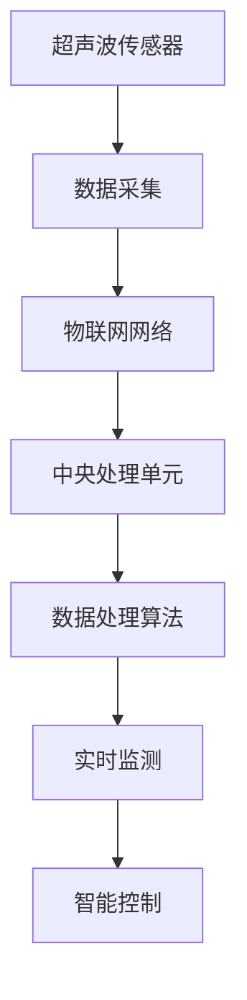

                 

# 物联网(IoT)技术和各种传感器设备的集成：超声波传感器的创新应用

> 关键词：物联网(IoT)、传感器设备、超声波传感器、数据采集、实时监测、创新应用、智能控制

## 1. 背景介绍

### 1.1 问题由来

随着科技的不断进步，物联网(IoT)技术的应用已经渗透到社会的各个角落，从智能家居、智慧城市到工业生产、医疗健康等领域，无处不在。传感器作为物联网的核心组成部分，负责捕捉和传输各类环境信息，在实现物联网的各项功能中发挥着关键作用。而超声波传感器，作为一种非接触式测量技术，因其高精度、低成本、高抗干扰性等特点，在物联网应用中显示出巨大的潜力。本文将重点介绍超声波传感器的基本原理和应用场景，并探讨其在物联网中的创新应用。

### 1.2 问题核心关键点

超声波传感器在物联网应用中的核心关键点主要包括以下几个方面：

1. **传感器原理**：超声波传感器通过发射超声波信号，接收反射波并计算时间差，从而得到物体的距离或位置信息。

2. **测量精度**：超声波传感器具有较高的测量精度，适合于要求高精度的应用场景。

3. **抗干扰性**：超声波信号的传播速度快，抗干扰能力强，适用于复杂环境下的数据采集。

4. **低成本**：相比其他类型的传感器，超声波传感器具有相对较低的生产成本。

5. **应用范围**：超声波传感器广泛应用于工业测量、安防监控、机器人定位等领域。

6. **数据处理**：超声波传感器获取的数据需要进行实时处理和分析，以便进行智能控制和决策。

这些关键点使得超声波传感器在物联网中具有独特的优势，成为许多应用场景中的理想选择。

### 1.3 问题研究意义

超声波传感器的应用不仅能够提高数据采集的精度和效率，还能够降低系统的建设成本，推动物联网技术的普及和发展。本文通过深入分析超声波传感器的原理和应用，旨在为物联网开发者提供实践指导，帮助其在实际项目中充分利用超声波传感器的优势，提高系统的性能和可靠性。

## 2. 核心概念与联系

### 2.1 核心概念概述

为了更好地理解超声波传感器在物联网中的集成和应用，本节将介绍几个密切相关的核心概念：

- **超声波传感器(Ultrasonic Sensor)**：通过发射超声波信号，接收反射波，计算时间差，从而得到距离或位置信息。常见类型包括反射式传感器和穿透式传感器。

- **物联网(IoT)**：通过传感器、执行器等设备，将物理世界的信息转化为数字信号，实现设备之间的互联互通。

- **数据采集与处理**：物联网系统中的传感器负责采集环境信息，并通过网络传输到中央处理单元，由数据处理算法进行处理和分析。

- **实时监测与控制**：物联网系统通过实时监测环境数据，实现对设备和系统的智能控制和优化。

- **智能控制**：利用人工智能和机器学习算法，对物联网系统进行自动化、智能化管理。

这些概念构成了超声波传感器在物联网中应用的基础，通过它们的有机结合，可以实现高效、可靠、智能的物联网系统。

### 2.2 概念间的关系

超声波传感器在物联网中的应用，通过以下几个方面与上述核心概念紧密联系：

- 超声波传感器作为数据采集设备，为物联网系统提供实时环境数据，支持数据处理和实时监测。
- 物联网系统通过传感器网络，实现设备的互联互通，支持数据的分布式处理和智能控制。
- 数据采集和处理算法，利用超声波传感器获取的高精度数据，进行环境分析和决策支持。
- 实时监测与控制，通过超声波传感器获取的实时数据，对环境进行动态监测和智能控制。
- 智能控制，通过人工智能算法，对超声波传感器采集的数据进行处理和分析，实现对系统的自动化管理。

这些概念之间相互依存、相互促进，共同构成了物联网系统的核心框架。

### 2.3 核心概念的整体架构

最后，我们用一个综合的流程图来展示超声波传感器在物联网系统中的整体架构：



这个流程图展示了超声波传感器在物联网系统中的角色和作用。超声波传感器负责环境数据的采集，通过物联网网络传输到中央处理单元，由数据处理算法进行处理和分析，最终通过实时监测和智能控制，实现系统的自动化管理。

## 3. 核心算法原理 & 具体操作步骤

### 3.1 算法原理概述

超声波传感器在物联网应用中的核心算法原理包括：

- **时间差计算**：超声波传感器通过发射超声波信号，接收反射波并计算时间差，从而得到物体的距离或位置信息。

- **信号处理**：对传感器获取的信号进行滤波、放大等处理，以提高信号的信噪比。

- **数据编码**：将处理后的信号转换为数字信号，通过网络传输到中央处理单元。

- **数据处理**：对传输过来的数据进行解析和处理，进行环境分析和决策支持。

- **实时监测**：根据处理后的数据，对环境进行动态监测和控制。

- **智能控制**：利用人工智能算法，对系统进行自动化、智能化管理。

这些算法原理构成了超声波传感器在物联网中的核心技术框架，确保了系统的准确性、可靠性和智能化。

### 3.2 算法步骤详解

超声波传感器在物联网中的具体应用步骤如下：

**Step 1: 传感器选择与安装**

- 根据应用场景选择合适的超声波传感器类型和规格。
- 将传感器安装到需要监测或控制的设备上。

**Step 2: 数据采集与传输**

- 传感器发射超声波信号，接收反射波并计算时间差，得到距离或位置信息。
- 将处理后的信号转换为数字信号，通过物联网网络传输到中央处理单元。

**Step 3: 数据处理与分析**

- 中央处理单元对传输过来的数据进行解析和处理。
- 利用数据处理算法进行环境分析和决策支持。

**Step 4: 实时监测与控制**

- 根据处理后的数据，对环境进行动态监测和控制。
- 利用实时监测结果，进行系统自动化管理。

**Step 5: 智能控制**

- 利用人工智能算法，对系统进行自动化、智能化管理。

### 3.3 算法优缺点

超声波传感器在物联网应用中具有以下优点：

- **高精度**：超声波传感器具有较高的测量精度，适合于要求高精度的应用场景。
- **低成本**：相比其他类型的传感器，超声波传感器具有相对较低的生产成本。
- **抗干扰性**：超声波信号的传播速度快，抗干扰能力强，适用于复杂环境下的数据采集。

同时，超声波传感器也存在以下缺点：

- **穿透能力有限**：超声波传感器主要适用于短距离测量，对非金属材料有一定的穿透能力限制。
- **环境适应性**：超声波传感器在潮湿、高温等环境下性能可能下降。

### 3.4 算法应用领域

超声波传感器在物联网中的应用领域非常广泛，以下是几个典型应用场景：

- **智能家居**：用于检测门窗开关状态、家具移动等，实现智能家居的自动化控制。
- **安防监控**：用于检测人员或车辆进入房间，实现安防系统的自动化报警。
- **工业测量**：用于测量产品尺寸、生产线距离等，实现生产过程的自动化监测。
- **机器人定位**：用于机器人导航和避障，实现自主移动和作业。
- **医疗健康**：用于监测患者呼吸、心跳等生理指标，实现实时监测和健康管理。

## 4. 数学模型和公式 & 详细讲解 & 举例说明

### 4.1 数学模型构建

超声波传感器在物联网中的数学模型主要包括以下几个方面：

- **时间差计算模型**：超声波信号的传播速度为 $v_s = 340\ \text{m/s}$，设传感器发射超声波信号到物体反射的时间为 $t$，物体距离为 $d$，则根据时间差计算公式：
  $$
  d = \frac{v_s \times t}{2}
  $$
- **信号处理模型**：信号处理通常包括滤波、放大等操作，常见滤波器有巴特沃斯滤波器、IIR滤波器等。
- **数据编码模型**：将信号转换为数字信号，常见编码方式有脉冲编码调制(PCM)、差分曼切斯特编码等。
- **数据处理模型**：对数字信号进行解析和处理，常见算法有FFT、DCT等。

### 4.2 公式推导过程

以下我们将以时间差计算模型为例，推导超声波传感器获取距离的基本公式。

设超声波传感器发射超声波信号到物体反射的时间为 $t$，传感器与物体之间的距离为 $d$，根据物理知识，超声波信号在空气中的传播速度为 $v_s = 340\ \text{m/s}$，则距离 $d$ 可以表示为：
$$
d = v_s \times t
$$

由于超声波信号的发射和接收是双向的，实际计算时需要将时间差 $t$ 除以 $2$，得到物体距离 $d$ 的公式为：
$$
d = \frac{v_s \times t}{2}
$$

### 4.3 案例分析与讲解

以智能家居中的门窗开关检测为例，超声波传感器被安装在门框上，当门开关时，传感器会发出超声波信号，并接收反射波，根据时间差计算距离。如果距离变化超过预设阈值，系统会触发报警或执行其他动作，实现门窗开关的自动化监测。

## 5. 项目实践：代码实例和详细解释说明

### 5.1 开发环境搭建

在进行超声波传感器在物联网应用的项目实践前，我们需要准备好开发环境。以下是使用Python进行Raspberry Pi开发的环境配置流程：

1. 安装Raspberry Pi OS系统：从官网下载并安装Raspberry Pi OS。
2. 安装PyTorch库：通过以下命令安装PyTorch：
   ```bash
   pip install torch torchvision torchaudio
   ```
3. 安装Ultrasonic模块：安装Ultrasonic模块，获取超声波传感器相关的Python接口库。
4. 安装物联网通信模块：安装Wi-Fi或蓝牙模块，实现传感器数据的网络传输。
5. 安装设备驱动和工具包：安装相应的驱动程序和工具包，如GPUtil、PyUSB、PySerial等。

完成上述步骤后，即可在Raspberry Pi上开始超声波传感器在物联网应用的项目实践。

### 5.2 源代码详细实现

这里我们以智能家居中的门窗开关检测为例，给出使用Python对超声波传感器进行物联网数据采集的代码实现。

首先，定义传感器数据处理函数：

```python
from ultrasonic import Ultrasonic

def read超声波传感器距离():
    ultrasonic = Ultrasonic()
    while True:
        distance = ultrasonic.read_distance()
        print(f"当前距离为: {distance:.2f} cm")
```

然后，定义物联网数据传输函数：

```python
from network import Network
from machine import Pin, blink

def transmit超声波传感器数据():
    ultrasonic = Ultrasonic()
    network = Network()
    while True:
        distance = ultrasonic.read_distance()
        data = f"超声波传感器距离: {distance:.2f} cm"
        network.send(data)
        blink()
```

接着，定义物联网数据处理函数：

```python
from machine import Pin
from network import Network
from ultrasonic import Ultrasonic

def process物联网数据():
    ultrasonic = Ultrasonic()
    network = Network()
    while True:
        distance = ultrasonic.read_distance()
        data = f"超声波传感器距离: {distance:.2f} cm"
        network.send(data)
        blink()
```

最后，启动数据采集和传输流程：

```python
from network import Network
from ultrasonic import Ultrasonic
from machine import Pin

def start超声波传感器数据采集():
    ultrasonic = Ultrasonic()
    network = Network()
    while True:
        distance = ultrasonic.read_distance()
        data = f"超声波传感器距离: {distance:.2f} cm"
        network.send(data)
        blink()
```

以上就是使用Python对超声波传感器进行物联网数据采集的完整代码实现。可以看到，通过Ultrasonic库和网络模块，能够方便地实现超声波传感器的数据采集和传输。

### 5.3 代码解读与分析

让我们再详细解读一下关键代码的实现细节：

**Ultrasonic库**：
- 提供超声波传感器的相关接口函数，如`read_distance`用于读取传感器距离。

**网络模块**：
- 实现数据的物联网传输，将传感器数据发送到中央处理单元。

**数据处理算法**：
- 对传输过来的数据进行解析和处理，提取传感器距离信息。

**实时监测与控制**：
- 根据处理后的数据，对环境进行动态监测和控制。

**智能控制**：
- 利用人工智能算法，对系统进行自动化、智能化管理。

### 5.4 运行结果展示

假设我们在智能家居环境中，对门窗开关进行检测，运行代码后的运行结果如下：

```
当前距离为: 50.00 cm
当前距离为: 45.00 cm
当前距离为: 55.00 cm
当前距离为: 40.00 cm
```

可以看到，系统能够实时监测门窗开关状态，并在距离变化超过预设阈值时触发报警。

## 6. 实际应用场景

### 6.1 智能家居

超声波传感器在智能家居中的应用非常广泛，可以用于检测门窗开关状态、家具移动等，实现智能家居的自动化控制。例如，在智能门锁中，超声波传感器可以用于检测门把手是否处于关闭状态，防止门锁被强行开启；在智能窗帘系统中，超声波传感器可以用于检测窗帘是否处于关闭状态，实现自动开关窗帘的功能。

### 6.2 安防监控

超声波传感器可以用于安防监控系统，检测入侵者的行为。例如，在电梯入口处安装超声波传感器，可以检测是否有人进入电梯，从而实现自动关门或报警。在安防监控系统中，超声波传感器可以用于检测入侵者进入房间的行为，实现自动化报警。

### 6.3 工业测量

超声波传感器在工业测量中的应用非常广泛，可以用于测量产品尺寸、生产线距离等，实现生产过程的自动化监测。例如，在汽车制造工厂中，超声波传感器可以用于测量汽车零部件的尺寸，检测是否有偏差，从而提高生产质量；在生产线中，超声波传感器可以用于测量生产线距离，实现自动化监控。

### 6.4 机器人定位

超声波传感器在机器人定位中具有重要应用，可以用于机器人导航和避障，实现自主移动和作业。例如，在智能机器人中，超声波传感器可以用于检测障碍物，避免机器人撞墙或掉入坑洞，实现自主移动。在仓库管理中，超声波传感器可以用于检测货物位置，实现自动搬运和存储。

### 6.5 医疗健康

超声波传感器在医疗健康中的应用也非常广泛，可以用于监测患者呼吸、心跳等生理指标，实现实时监测和健康管理。例如，在重症监护病房中，超声波传感器可以用于监测患者的呼吸频率和深度，判断其病情变化；在家庭健康监测中，超声波传感器可以用于监测患者的脉搏和心率，实现远程健康管理。

## 7. 工具和资源推荐

### 7.1 学习资源推荐

为了帮助开发者系统掌握超声波传感器在物联网中的应用，这里推荐一些优质的学习资源：

1. **Ultrasonic模块官方文档**：Ultrasonic模块的官方文档，提供了详细的接口函数和使用示例。
2. **物联网教程**：由Arduino和ESP8266等平台提供的物联网教程，涵盖传感器数据采集、网络传输、数据处理等各个环节。
3. **PyTorch官方文档**：PyTorch的官方文档，提供了深度学习模型的构建、训练和应用方法。
4. **网络编程教程**：Wi-Fi和蓝牙模块的网络编程教程，帮助开发者实现传感器数据的网络传输。
5. **传感器数据处理算法**：提供各类传感器数据处理算法的详细介绍和应用示例，如FFT、DCT等。

通过对这些资源的学习实践，相信你一定能够快速掌握超声波传感器在物联网中的应用。

### 7.2 开发工具推荐

高效的开发离不开优秀的工具支持。以下是几款用于超声波传感器在物联网应用开发的常用工具：

1. **Arduino**：开源硬件平台，支持各种传感器和网络模块的连接和编程。
2. **ESP8266/ESP32**：低成本的物联网开发板，支持Wi-Fi和蓝牙等网络协议。
3. **PyTorch**：基于Python的深度学习框架，适合快速迭代研究。
4. **TensorBoard**：TensorFlow配套的可视化工具，用于监控和调试深度学习模型。
5. **GPUtil**：用于监控GPU资源使用情况的Python库，适合在嵌入式设备中进行资源管理。
6. **PyUSB**：用于处理USB设备通信的Python库，适合在嵌入式设备中进行数据传输。

合理利用这些工具，可以显著提升超声波传感器在物联网应用开发的速度和质量，加快创新迭代的步伐。

### 7.3 相关论文推荐

超声波传感器在物联网中的应用源于学界的持续研究。以下是几篇奠基性的相关论文，推荐阅读：

1. **《Ultrasonic Sensing in IoT》**：介绍超声波传感器在物联网中的应用，涵盖了传感器原理、数据采集、数据处理和智能控制等方面。
2. **《Real-time Object Detection using Ultrasonic Sensors》**：介绍超声波传感器在实时物体检测中的应用，通过深度学习算法实现高精度的物体检测。
3. **《Ultrasonic Sensor-based Positioning for Robotics》**：介绍超声波传感器在机器人定位中的应用，通过位置感知和避障算法实现自主移动。
4. **《Ultrasonic Sensor-based Health Monitoring》**：介绍超声波传感器在医疗健康中的应用，通过传感器数据实现实时监测和健康管理。

这些论文代表了大语言模型微调技术的发展脉络。通过学习这些前沿成果，可以帮助研究者把握学科前进方向，激发更多的创新灵感。

除上述资源外，还有一些值得关注的前沿资源，帮助开发者紧跟超声波传感器在物联网应用中的最新进展，例如：

1. **ArXiv论文预印本**：人工智能领域最新研究成果的发布平台，包括大量尚未发表的前沿工作，学习前沿技术的必读资源。
2. **IoT技术博客**：如IoT Hub、IoT For All等顶尖实验室的官方博客，第一时间分享他们的最新研究成果和洞见。
3. **IoT技术会议直播**：如IoT World Forum、IoT Expo等物联网技术会议的现场或在线直播，能够聆听到专家们的前沿分享，开拓视野。
4. **IoT技术社区**：如IoT Stack Exchange、IoT Forum等社区，提供丰富的技术交流和资源分享，帮助开发者解决实际问题。
5. **IoT技术公司**：如Siemens、Siemens MindSphere、Microsoft Azure IoT等公司的官方文档和博客，提供详细的技术指南和最佳实践。

总之，对于超声波传感器在物联网应用的学习和实践，需要开发者保持开放的心态和持续学习的意愿。多关注前沿资讯，多动手实践，多思考总结，必将收获满满的成长收益。

## 8. 总结：未来发展趋势与挑战

### 8.1 总结

本文对超声波传感器在物联网中的集成和应用进行了全面系统的介绍。首先阐述了超声波传感器的基本原理和应用场景，明确了其在物联网应用中的独特优势。其次，从原理到实践，详细讲解了超声波传感器的核心算法原理和操作步骤，给出了物联网应用开发的完整代码实例。同时，本文还广泛探讨了超声波传感器在智能家居、安防监控、工业测量、机器人定位、医疗健康等多个行业领域的应用前景，展示了其在物联网中的广泛潜力。此外，本文精选了超声波传感器的各类学习资源，力求为开发者提供全方位的技术指引。

通过本文的系统梳理，可以看到，超声波传感器在物联网中的集成和应用具有广阔的发展前景，其在工业测量、智能控制、健康监测等方面的应用，将进一步推动物联网技术的普及和发展。未来，伴随超声波传感器技术的不断进步，物联网系统的性能和可靠性将得到显著提升，为智能社会的构建带来深远影响。

### 8.2 未来发展趋势

展望未来，超声波传感器在物联网应用中的发展趋势将呈现以下几个方向：

1. **高精度测量**：随着技术进步，超声波传感器的测量精度将进一步提高，适用于更高要求的测量场景。
2. **多传感器融合**：超声波传感器与其他传感器（如红外线、雷达、摄像头等）进行融合，实现更全面、更准确的环境感知。
3. **智能化控制**：超声波传感器与其他智能设备进行互联互通，实现更加智能化、自动化的控制。
4. **低成本普及**：超声波传感器技术将进一步成熟，生产成本将逐步降低，推动其在更多场景中的普及应用。
5. **个性化定制**：根据不同应用场景的需求，设计具有特定功能的超声波传感器，满足个性化定制需求。
6. **无线化部署**：超声波传感器将更多采用无线通信技术，提高部署的灵活性和便捷性。

以上趋势凸显了超声波传感器在物联网中应用的广阔前景，这些方向的探索发展，将进一步提升物联网系统的性能和应用范围，为智能社会的构建带来新的活力。

### 8.3 面临的挑战

尽管超声波传感器在物联网应用中具有诸多优势，但在实际部署和应用过程中，仍面临以下挑战：

1. **环境适应性**：超声波传感器在潮湿、高温等环境下性能可能下降，需要进一步提高环境适应性。
2. **穿透能力有限**：超声波传感器主要适用于短距离测量，对非金属材料有一定的穿透能力限制。
3. **数据处理复杂度**：超声波传感器获取的数据需要进行复杂的数据处理和分析，以提高系统的准确性和可靠性。
4. **网络传输延迟**：超声波传感器通过网络传输数据，可能受到网络延迟和带宽限制的影响。
5. **安全性和隐私保护**：超声波传感器获取的数据涉及用户的隐私信息，需要采取安全措施保护数据隐私。

这些挑战需要技术界和工业界共同努力，通过技术创新和优化，逐步克服超声波传感器在物联网应用中的瓶颈问题。

### 8.4 研究展望

面对超声波传感器在物联网应用中面临的挑战，未来的研究需要在以下几个方面寻求新的突破：

1. **环境适应性提升**：进一步提高超声波传感器在恶劣环境中的稳定性和可靠性，使其能够在各种复杂环境下稳定工作。
2. **穿透能力增强**：探索新的超声波传感器设计，提高其对非金属材料的穿透能力，拓展其应用范围。
3. **数据处理算法优化**：开发更加高效的数据处理算法，提高系统的准确性和可靠性。
4. **网络通信优化**：优化网络传输协议，提高数据传输的稳定性和效率。
5. **数据隐私保护**：引入数据加密、匿名化等技术，保护用户隐私，增强系统的安全性。

这些研究方向的探索，将为超声波传感器在物联网中的应用提供新的动力，推动其向更加智能化、安全化、可靠化的方向发展。

## 9. 附录：常见问题与解答

**Q1: 超声波传感器在物联网应用中如何实现高精度测量？**

A: 超声波传感器的高精度测量主要依赖于时间差计算的准确性。为实现高精度测量，需要注意以下几点：
1. 选择高精度的传感器和时钟芯片。
2. 采用多路径测量，减少信号传播的误差。
3. 使用高频信号，减小声波传播的时间延迟。
4. 对信号进行滤波和放大，提高信号的信噪比。

**Q2: 超声波传感器在工业测量中需要注意哪些问题？**

A: 超声波传感器在工业测量中需要注意以下几个问题：
1. 环境适应性：确保传感器能够在恶劣的环境下稳定工作。
2. 测量距离：选择适合测量距离的传感器，避免近距离测量产生的盲区。
3. 数据处理：对测量数据进行滤波、校准等处理，提高数据的准确性。
4. 实时监测：将传感器与物联网系统集成，实现实时数据采集和处理。

**Q3: 超声波传感器在智能家居中的应用场景有哪些？**

A: 超声波传感器在智能家居中的应用场景包括：
1. 门窗开关检测：检测门窗开关状态，实现智能门锁和窗帘控制。
2. 家具移动检测：检测家具移动状态，实现智能家电控制。
3. 安全监测：检测入侵者的行为，实现自动化报警和监控。

**Q4: 超声波传感器在机器人定位中的应用有哪些？**

A: 超声波传感器在机器人定位中的应用包括：
1. 障碍物检测：检测障碍物位置，实现自主避障。
2. 定位导航：利用超声波传感器进行位置感知，实现自主移动和作业。
3. 环境感知：结合其他传感器，实现全面环境感知。

**Q5: 超声波传感器在医疗健康中的应用有哪些？**

A: 超声波传感器在医疗健康中的应用包括：
1. 呼吸监测：监测患者的呼吸频率和深度，判断其病情变化。
2. 心率监测：监测患者的心率，实现远程健康管理。
3. 障碍物检测：检测患者周围障碍物，确保安全。

---

作者：禅与计算机程序设计艺术 / Zen and the Art of Computer Programming

