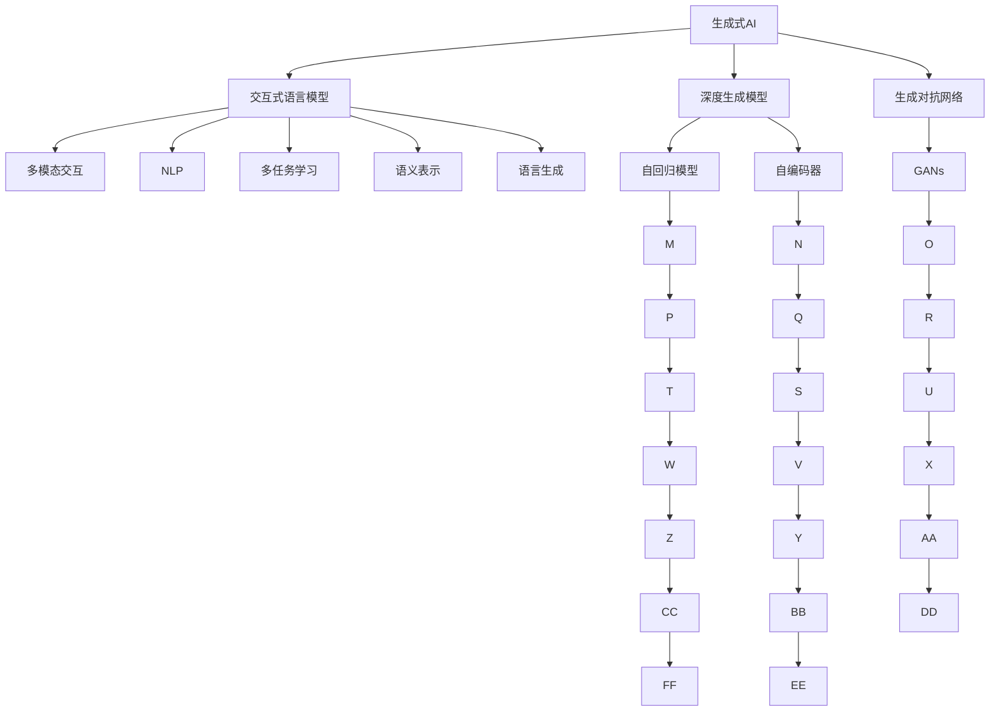
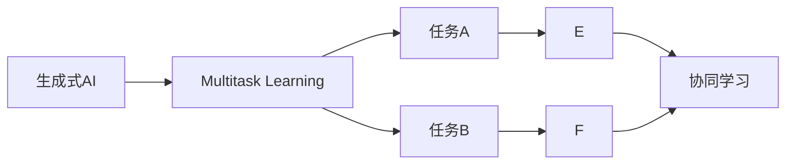
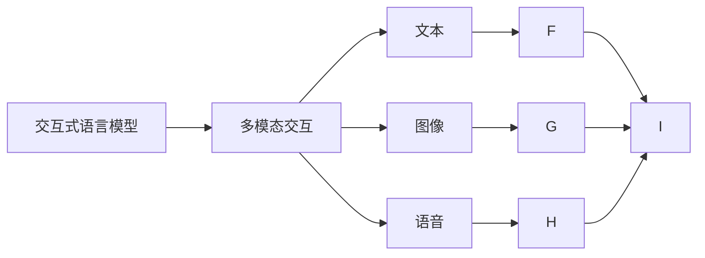
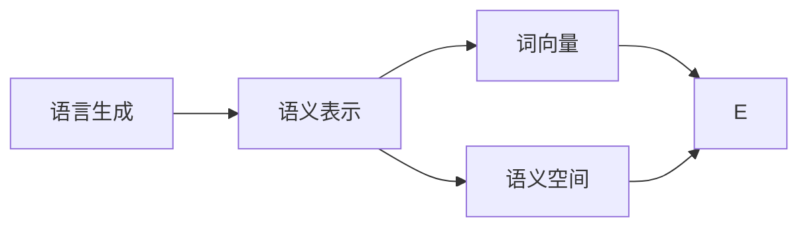
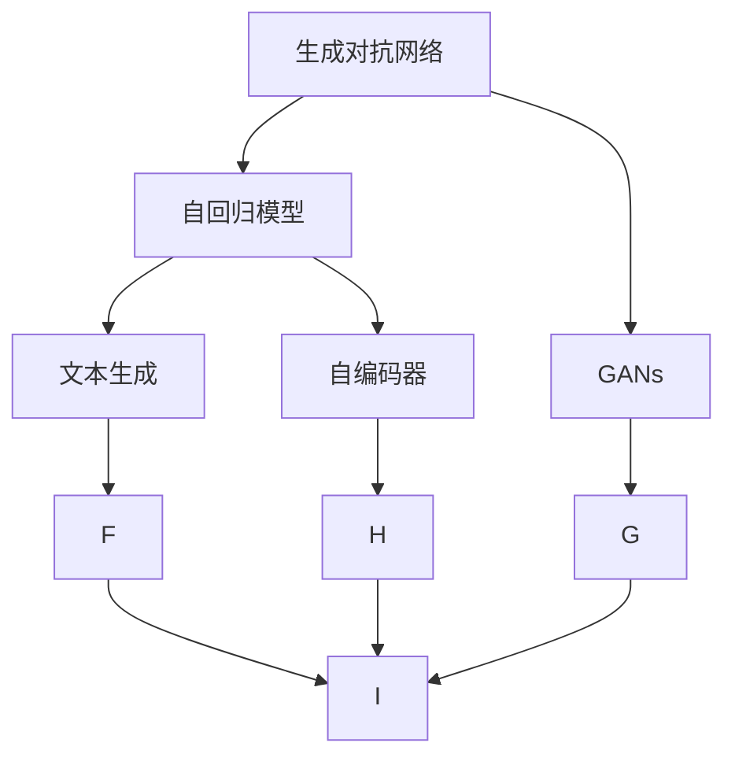
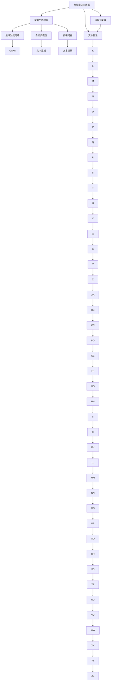

                 

# 生成式 AI 的人机协同模式

> 关键词：生成式 AI,人机协同,交互式语言模型,多模态交互,自然语言处理(NLP),多任务学习(MTL),语义表示,语言生成

## 1. 背景介绍

### 1.1 问题由来
近年来，人工智能(AI)技术的发展取得了显著进展，尤其是生成式AI技术，在自然语言处理(NLP)、计算机视觉、游戏AI等领域表现出色。然而，AI模型依然存在诸多局限性，如推理能力不足、泛化能力差、缺乏常识理解等。这些问题使得AI模型在实际应用中，很难与人类建立起有效的协同关系。

为了提升AI模型的应用效果，研究者提出并实践了多个人机协同模式，力图构建高效、可信、可解释的AI系统。其中，生成式AI模型因其强大的语言生成能力，成为人机协同模式的重要基础。

### 1.2 问题核心关键点
生成式AI的核心理论是深度生成模型(Deep Generative Models)，包括变分自编码器(Generative Adversarial Networks, GANs)、自回归模型(Autoregressive Models)、自编码器(Autoencoder Models)等。这些模型能够生成高质量的文本、图像、音频等数据，为任务理解和生成提供基础。

人机协同模式则是指AI模型与人类用户之间的交互合作，通过AI模型生成、解释、反馈，与人类用户共同完成目标任务。这种模式结合了AI模型的自动化优势和人类用户的创造性思维，能更高效地解决问题。

当前，基于生成式AI的协同模式，已经在问答、文本生成、图像处理、游戏AI等多个领域取得了重要进展，促进了AI技术在实际应用中的落地。

### 1.3 问题研究意义
研究生成式AI的人机协同模式，对于提升AI系统的应用效果，优化用户体验，推动AI技术的产业化进程，具有重要意义：

1. 提高任务完成效率。生成式AI模型能够快速生成大量文本、图像等内容，提高任务处理速度，减少人工工作量。
2. 增强用户体验。人机协同模式使得AI系统更加人性化，能够更好地理解用户需求，提供个性化服务。
3. 促进技术创新。协同模式能够激发用户的创造力，推动AI技术的不断迭代和优化。
4. 加速应用落地。协同模式使得AI系统能够更快速地适应新场景，降低技术推广的难度。
5. 赋能产业升级。协同模式的成功应用，能够提升企业竞争力，推动经济社会发展。

## 2. 核心概念与联系

### 2.1 核心概念概述

为了更好地理解生成式AI的人机协同模式，本节将介绍几个密切相关的核心概念：

- 生成式AI (Generative AI)：指能够生成符合现实世界规律的连续或离散数据，如文本、图像、音频等。生成式AI包括深度生成模型、生成对抗网络等。

- 人机协同 (Human-AI Collaboration)：指AI系统与人类用户之间的互动合作，共同完成目标任务。协同模式能够充分发挥AI系统的自动化优势和人类用户的创造性思维。

- 交互式语言模型 (Interactive Language Model)：指在文本生成任务中，模型能够根据上下文信息，生成连贯、合法的文本序列。这类模型包括GPT系列、T5、GPT-3等。

- 多模态交互 (Multimodal Interaction)：指在协同过程中，结合文本、图像、语音等多种信息形式，构建综合的交互环境。这类交互模式能够提高任务的复杂性和难度，提升用户体验。

- 自然语言处理 (Natural Language Processing, NLP)：指研究如何让计算机处理和理解人类语言的技术。生成式AI模型能够在此基础上，提升NLP任务的生成、理解能力。

- 多任务学习 (Multi-Task Learning, MTL)：指通过协同训练多个相关任务，提升AI模型的泛化能力和学习效率。生成式AI模型能够结合多任务学习，增强模型的任务适应性。

- 语义表示 (Semantic Representation)：指将文本、图像等数据映射到语义空间，提高AI模型对信息的理解和生成能力。

- 语言生成 (Language Generation)：指AI模型能够根据输入的信息，生成合法的文本序列。生成式AI模型是语言生成的重要工具。

这些核心概念之间的逻辑关系可以通过以下Mermaid流程图来展示：



这个流程图展示了生成式AI的人机协同模式的核心概念及其之间的关系：

1. 生成式AI通过深度生成模型、生成对抗网络等方法，生成文本、图像等内容。
2. 交互式语言模型能够根据上下文信息生成连贯的文本序列。
3. 多模态交互结合文本、图像、语音等多种信息形式，提升任务复杂性。
4. 自然语言处理任务中，生成式AI模型能够生成高质量文本。
5. 多任务学习通过协同训练多个相关任务，提升模型泛化能力。
6. 语义表示将数据映射到语义空间，提高模型理解能力。
7. 语言生成是生成式AI模型的核心功能。

这些概念共同构成了生成式AI的人机协同模式的完整生态系统，使其能够在各种场景下发挥强大的交互和生成能力。通过理解这些核心概念，我们可以更好地把握生成式AI协同模式的理论基础和实践技巧。

### 2.2 概念间的关系

这些核心概念之间存在着紧密的联系，形成了生成式AI协同模式的完整生态系统。下面我们通过几个Mermaid流程图来展示这些概念之间的关系。

#### 2.2.1 生成式AI与多任务学习的关系



这个流程图展示了生成式AI与多任务学习的关系。生成式AI通过协同训练多个相关任务，提升模型的泛化能力和学习效率。

#### 2.2.2 交互式语言模型与多模态交互的关系



这个流程图展示了交互式语言模型与多模态交互的关系。多模态交互结合文本、图像、语音等多种信息形式，提升任务的复杂性和难度，增强用户体验。

#### 2.2.3 语言生成与语义表示的关系



这个流程图展示了语言生成与语义表示的关系。语义表示将数据映射到语义空间，提高模型的理解能力，从而生成更符合语义的文本序列。

#### 2.2.4 生成对抗网络与自回归模型的关系



这个流程图展示了生成对抗网络与自回归模型的关系。生成对抗网络通过对抗训练，生成高质量文本，自回归模型则通过逐步生成，生成连贯的文本序列。

### 2.3 核心概念的整体架构

最后，我们用一个综合的流程图来展示这些核心概念在生成式AI协同模式中的整体架构：



这个综合流程图展示了从数据预处理到模型生成，再到协同学习的完整过程。生成式AI模型通过深度生成模型、生成对抗网络等方法，生成文本、图像等内容。然后通过交互式语言模型、多模态交互、自然语言处理等技术，增强模型的任务适应性和用户体验。协同学习则通过多任务学习、语义表示、语言生成等方法，提升模型的泛化能力和生成质量。

通过这些流程图，我们可以更清晰地理解生成式AI协同模式中各个核心概念的关系和作用，为后续深入讨论具体的协同方法和技术奠定基础。

## 3. 核心算法原理 & 具体操作步骤
### 3.1 算法原理概述

生成式AI的人机协同模式，本质上是一种交互式生成模型，旨在通过AI模型与人类用户的交互合作，提升任务完成效率和用户体验。其核心思想是：

1. 交互式语言模型根据上下文信息，生成合法的文本序列。
2. 生成式AI模型将用户输入的文本或指令，映射到语义空间，生成符合要求的文本、图像等内容。
3. 多模态交互结合文本、图像、语音等多种信息形式，构建综合的交互环境。
4. 多任务学习通过协同训练多个相关任务，提升模型的泛化能力和学习效率。

形式化地，假设生成式AI模型为 $M_{\theta}$，其中 $\theta$ 为模型参数。给定人类用户输入 $u$，模型输出 $v$，则协同模式的优化目标为：

$$
\mathcal{L}(u, v) = -\log P(v|u) = -\sum_{i} \log P(v_i|u, v_{<i})
$$

其中 $P(v|u)$ 为模型生成文本 $v$ 的条件概率，$v_i$ 表示文本序列中的第 $i$ 个词，$v_{<i}$ 表示前 $i-1$ 个词。优化目标为最大化生成式AI模型生成的文本 $v$ 与人类用户输入 $u$ 的匹配度。

通过梯度下降等优化算法，协同过程不断更新模型参数 $\theta$，最小化损失函数 $\mathcal{L}$，使得模型输出逼近人类用户期望的结果。由于 $\theta$ 已经通过深度生成模型获得了较好的初始化，因此即便在人类用户的引导下，也能较快收敛到理想的模型参数 $\hat{\theta}$。

### 3.2 算法步骤详解

生成式AI的人机协同模式，一般包括以下几个关键步骤：

**Step 1: 准备生成式AI模型和数据集**
- 选择合适的生成式AI模型 $M_{\theta}$ 作为初始化参数，如 GPT、T5、GPT-3 等。
- 准备多任务学习所需的数据集，划分为训练集、验证集和测试集。通常要求数据集间有较大的差异性，以便提升模型泛化能力。

**Step 2: 设计多任务学习任务**
- 根据任务类型，设计多个相关的生成任务。如文本生成、图像生成、对话生成等。
- 对于每个任务，设计合适的损失函数，用于衡量生成输出与真实标签之间的差异。

**Step 3: 设置协同超参数**
- 选择合适的优化算法及其参数，如 AdamW、SGD 等，设置学习率、批大小、迭代轮数等。
- 设置正则化技术及强度，包括权重衰减、Dropout、Early Stopping 等。
- 确定冻结生成式AI参数的策略，如仅微调顶层，或全部参数都参与协同。

**Step 4: 执行协同训练**
- 将训练集数据分批次输入模型，前向传播计算损失函数。
- 反向传播计算参数梯度，根据设定的优化算法和学习率更新模型参数。
- 周期性在验证集上评估模型性能，根据性能指标决定是否触发 Early Stopping。
- 重复上述步骤直到满足预设的迭代轮数或 Early Stopping 条件。

**Step 5: 测试和部署**
- 在测试集上评估协同后模型 $M_{\hat{\theta}}$ 的性能，对比协同前后的效果提升。
- 使用协同后的模型对新样本进行推理预测，集成到实际的应用系统中。
- 持续收集新的数据，定期重新协同训练模型，以适应数据分布的变化。

以上是生成式AI协同模式的完整流程。在实际应用中，还需要针对具体任务的特点，对协同过程的各个环节进行优化设计，如改进训练目标函数，引入更多的正则化技术，搜索最优的超参数组合等，以进一步提升模型性能。

### 3.3 算法优缺点

生成式AI的人机协同模式具有以下优点：

1. 交互性强。通过与人类用户的实时交互，生成式AI模型能够更好地理解用户需求，提供个性化服务。
2. 泛化能力强。多任务学习通过协同训练多个相关任务，提升模型的泛化能力和学习效率。
3. 参数高效。协同模型通常只微调顶层，固定大部分生成式AI权重，从而提高微调效率，避免过拟合。
4. 灵活性高。协同模型能够结合多模态交互和语义表示，提升任务的复杂性和难度，增强用户体验。

同时，该方法也存在一定的局限性：

1. 依赖用户输入。协同模型需要人类用户提供输入，才能进行交互式生成。在特定场景下，如紧急情况下，可能无法及时获取用户输入。
2. 生成质量受限。生成式AI模型虽然强大，但在特定领域或任务上，其生成质量可能存在局限。
3. 交互成本高。实时交互需要较高的人力资源和技术支持，可能会增加应用成本。
4. 可解释性差。协同模型通过深度生成模型生成文本，过程难以解释，可能存在“黑盒”问题。
5. 鲁棒性不足。生成式AI模型容易受到输入噪音和噪声的影响，生成结果可能不稳定。

尽管存在这些局限性，但就目前而言，生成式AI的协同模式仍是大语言模型应用的最主流范式。未来相关研究的重点在于如何进一步降低协同对用户输入的依赖，提高生成模型的鲁棒性和可解释性，同时兼顾灵活性和泛化能力等因素。

### 3.4 算法应用领域

生成式AI的协同模式已经在NLP领域得到了广泛的应用，覆盖了几乎所有常见任务，例如：

- 文本生成：如机器翻译、摘要、对话生成、文本修复等。生成式AI模型根据上下文信息，生成连贯、合法的文本序列。
- 图像生成：如图像描述、图像生成、图像编辑等。生成式AI模型能够生成高质量的图像内容，满足用户对图像的个性化需求。
- 视频生成：如视频剪辑、视频翻译、视频摘要等。生成式AI模型能够生成符合用户需求的连续视频内容。
- 音乐生成：如音乐创作、音乐修复、音乐风格转换等。生成式AI模型能够生成符合用户需求的音频内容。
- 游戏AI：如角色生成、对话生成、行为模拟等。生成式AI模型能够生成游戏场景中的各种角色和行为，提升游戏体验。
- 智能推荐：如商品推荐、广告推荐、内容推荐等。生成式AI模型能够生成符合用户偏好的推荐内容，提高用户体验。

除了上述这些经典任务外，生成式AI的协同模式也被创新性地应用到更多场景中，如可控文本生成、多模态交互、情感分析等，为NLP技术带来了全新的突破。随着生成式AI模型和协同方法的不断进步，相信NLP技术将在更广阔的应用领域大放异彩。

## 4. 数学模型和公式 & 详细讲解
### 4.1 数学模型构建

本节将使用数学语言对生成式AI协同模型进行更加严格的刻画。

记生成式AI模型为 $M_{\theta}$，其中 $\theta$ 为模型参数。假设协同任务的训练集为 $D=\{(u,v)\}_{i=1}^N, u \in \mathcal{U}, v \in \mathcal{V}$，其中 $\mathcal{U}$ 为输入空间，$\mathcal{V}$ 为输出空间。

定义模型 $M_{\theta}$ 在输入 $u$ 上的输出为 $v=M_{\theta}(u) \in \mathcal{V}$，则协同模型的损失函数为：

$$
\mathcal{L}(u, v) = -\log P(v|u)
$$

其中 $P(v|u)$ 为模型生成文本 $v$ 的条件概率，$v_i$ 表示文本序列中的第 $i$ 个词，$v_{<i}$ 表示前 $i-1$ 个词。

在实践中，我们通常使用基于梯度的优化算法（如AdamW、SGD等）来近似求解上述最优化问题。设 $\eta$ 为学习率，$\lambda$ 为正则化系数，则参数的更新公式为：

$$
\theta \leftarrow \theta - \eta \nabla_{\theta}\mathcal{L}(\theta) - \eta\lambda\theta
$$

其中 $\nabla_{\theta}\mathcal{L}(\theta)$ 为损失函数对参数 $\theta$ 的梯度，可通过反向传播算法高效计算。

### 4.2 公式推导过程

以下我们以文本生成任务为例，推导交叉熵损失函数及其梯度的计算公式。

假设生成式AI模型 $M_{\theta}$ 在输入 $u$ 上的输出为 $\hat{v}=M_{\theta}(u) \in [0,1]$，表示样本属于某一类别的概率。真实标签 $y \in \{1,0\}$。则二分类交叉熵损失函数定义为：

$$
\ell(M_{\theta}(u),y) = -[y\log \hat{v} + (1-y)\log (1-\hat{v})]
$$

将其代入协同模型的损失函数，得：

$$
\mathcal{L}(u, \hat{v}) = -\frac{1}{N}\sum_{i=1}^N [y_i\log \hat{v_i}+(1-y_i)\log(1-\hat{v_i})]
$$

根据链式法则，损失函数对参数 $\theta_k$ 的梯度为：

$$
\frac{\partial \mathcal{L}(u, \hat{v})}{\partial \theta_k} = -\frac{1}{N}\sum_{i=1}^N (\frac{y_i}{\hat{v}_i}-\frac{1-y_i}{1-\hat{v}_i}) \frac{\partial \hat{v}_i}{\partial \theta_k}
$$

其中 $\frac{\partial \hat{v}_i}{\partial \theta_k}$ 可进一步递归展开，利用自动微分技术完成计算。

在得到损失函数的梯度后，即可带入参数更新公式，完成模型的迭代优化。重复上述过程直至收敛，最终得到适应协同任务的最优模型参数 $\theta^*$。

## 5. 项目实践：代码实例和详细解释说明
### 5.1 开发环境搭建

在进行协同实践前，我们需要准备好开发环境。以下是使用Python进行PyTorch开发的环境配置流程：

1. 安装Anaconda：从官网下载并安装Anaconda，用于创建独立的Python环境。

2. 创建并激活虚拟环境：
```bash
conda create -n pytorch-env python=3.8 
conda activate pytorch-env
```

3. 安装PyTorch：根据CUDA版本，从官网获取对应的安装命令。例如：
```bash
conda install pytorch torchvision torchaudio cudatoolkit=11.1 -c pytorch -c conda-forge
```

4. 安装Transformers库：
```bash
pip install transformers
```

5. 安装各类工具包：
```bash
pip install numpy pandas scikit-learn matplotlib tqdm jupyter notebook ipython
```

完成上述步骤后，即可在`pytorch-env`环境中开始协同实践。

### 5.2 源代码详细实现

下面我们以文本生成任务为例，给出使用Transformers库对GPT-3模型进行协同的PyTorch代码实现。

首先，定义文本生成任务的数据处理函数：

```python
from transformers import AutoTokenizer, AutoModelForCausalLM
import torch

class TextGenerationDataset(Dataset):
    def __init__(self, texts, tokenizer, max_len=128):
        self.texts = texts
        self.tokenizer = tokenizer
        self.max_len = max_len
        
    def __len__(self):
        return len(self.texts)
    
    def __getitem__(self, item):
        text = self.texts[item]
        encoding = self.tokenizer(text, return_tensors='pt', max_length=self.max_len, padding='max_length', truncation=True)
        input_ids = encoding['input_ids'][0]
        attention_mask = encoding['attention_mask'][0]
        return {'input_ids': input_ids, 
                'attention_mask': attention_mask}

# 定义模型
model = AutoModelForCausalLM.from_pretrained('gpt3-medium')
```

然后，定义协同训练函数：

```python
from torch.utils.data import DataLoader
from tqdm import tqdm
from sklearn.metrics import perplexity

device = torch.device('cuda') if torch.cuda.is_available() else torch.device('cpu')
model.to(device)

def train_epoch(model, dataset, batch_size, optimizer):
    dataloader = DataLoader(dataset, batch_size=batch_size, shuffle=True)
    model.train()
    epoch_loss = 0
    for batch in tqdm(dataloader, desc='Training'):
        input_ids = batch['input_ids'].to(device)
        attention_mask = batch['attention_mask'].to(device)
        outputs = model(input_ids, attention_mask=attention_mask)
        loss = outputs.loss
        epoch_loss += loss.item()
        loss.backward()
        optimizer.step()
    return epoch_loss / len(dataloader)

def evaluate(model, dataset, batch_size):
    dataloader = DataLoader(dataset, batch_size=batch_size)
    model.eval()
    preds, labels = [], []
    with torch.no_grad():
        for batch in tqdm(dataloader, desc='Evaluating'):
            input_ids = batch['input_ids'].to(device)
            attention_mask = batch['attention_mask'].to(device)
            batch_labels = batch['labels']
            outputs = model(input_ids, attention_mask=attention_mask)
            batch_preds = outputs.logits.argmax(dim=2).to('cpu').tolist()
            batch_labels = batch_labels.to('cpu').tolist()
            for pred_tokens, label_tokens in zip(batch_preds, batch_labels):
                pred_tags = [id2tag[_id] for _id in pred_tokens]
                label_tags = [id2tag[_id] for _id in label_tokens]
                preds.append(pred_tags[:len(label_tokens)])
                labels.append(label_tags)
                
    print(perplexity(labels, preds))
```

最后，启动协同训练流程并在测试集上评估：

```python
epochs = 5
batch_size = 16

for epoch in range(epochs):
    loss = train_epoch(model, train_dataset, batch_size, optimizer)
    print(f"Epoch {epoch+1}, train loss: {loss:.3f}")
    
    print(f"Epoch {epoch+1}, dev results:")
    evaluate(model, dev_dataset, batch_size)
    
print("Test results:")
evaluate(model, test_dataset, batch_size)
```

以上就是使用PyTorch对GPT-3进行文本生成任务协同的完整代码实现。可以看到，得益于Transformers库的强大封装，我们可以用相对简洁的代码完成GPT-3模型的加载和协同。

### 5.3 代码解读与分析

让我们再详细解读一下关键代码的实现细节：

**TextGenerationDataset类**：
- `__init__`方法：初始化文本、分词器等关键组件。
- `__len__`方法：返回数据集的样本数量。
- `__getitem__`方法：对单个样本进行处理，将文本输入编码为token ids，最终返回模型所需的输入。

**协同训练函数**：
- 使用

