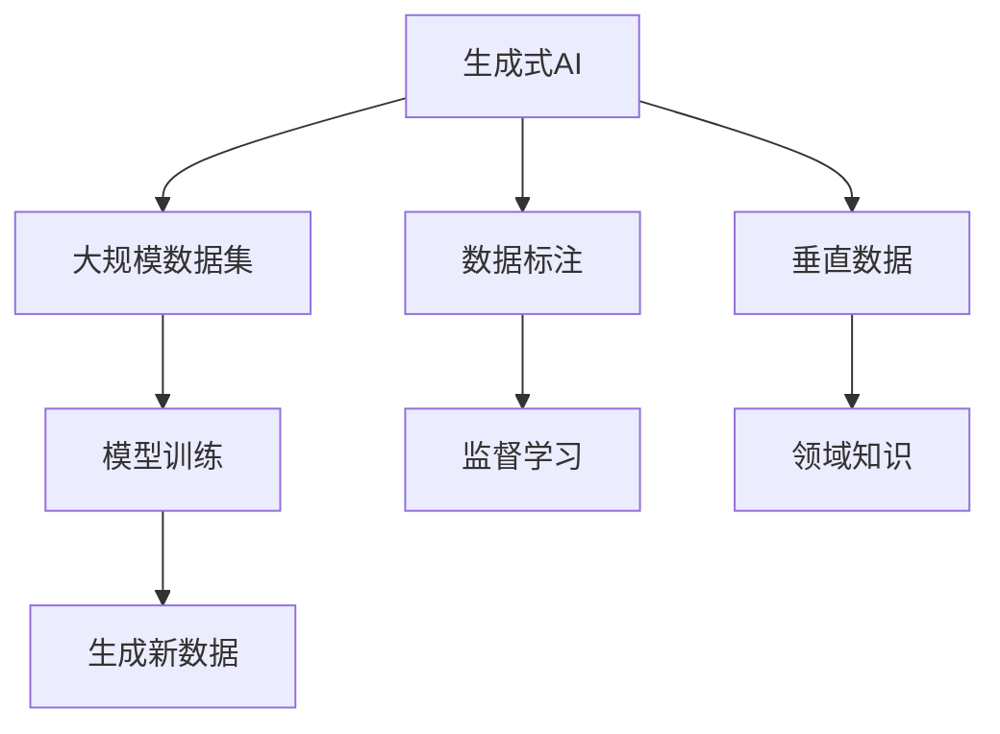
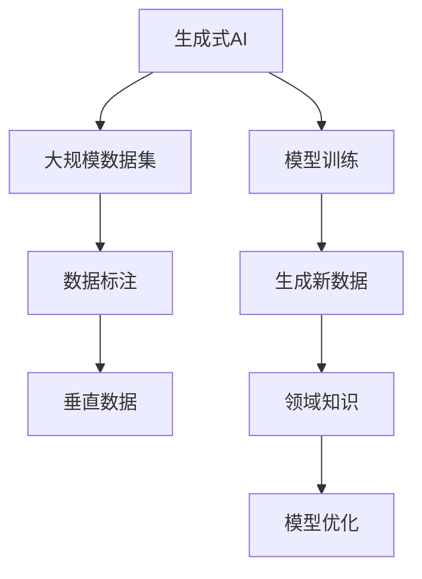

                 

# 生成式AIGC是金矿还是泡沫： AI 创业公司想找场景想快速找到好场景和垂直数据很难

## 1. 背景介绍

### 1.1 问题由来

生成式人工智能（AIGC，即Generative AI）近年来成为AI领域的热门话题。AIGC技术的核心是深度学习模型，通过学习和生成数据，可以实现自动化内容创作、数据分析、个性化推荐等任务。其应用场景广泛，包括音乐创作、图像生成、视频制作、自然语言处理、游戏开发等。

然而，生成式AIGC技术并非一蹴而就。它的发展需要大量的数据、高计算资源、专家知识等多种因素支撑。对于AI创业公司而言，如何找到适合的场景和垂直数据，成为能否成功的关键。本文将深入探讨这一问题，提出相关解决方案。

### 1.2 问题核心关键点

AIGC技术的关键点包括：
- **大规模数据**：需要收集、清洗、标注海量数据。
- **高性能计算**：需要GPU、TPU等高性能硬件。
- **模型设计**：需要设计合理的模型架构。
- **技术栈优化**：需要选择合适的技术栈和工具。

这些问题均对AI创业公司提出了较高的要求。尤其是在场景选择和数据获取方面，AIGC技术的门槛并不低。

### 1.3 问题研究意义

研究生成式AIGC技术的应用场景选择和数据获取问题，具有重要意义：
- 提升技术开发效率：选择合适的场景和数据，能够快速推动技术开发，缩短研发周期。
- 提高模型效果：好的场景和数据能够显著提升AIGC模型的效果。
- 降低应用门槛：通过合理选择和获取数据，可以降低AI技术应用的门槛，加速行业普及。
- 带来商业价值：找到有市场前景的场景，可以获得更高的商业回报。

## 2. 核心概念与联系

### 2.1 核心概念概述

为了更好地理解生成式AIGC技术的应用场景选择和数据获取问题，我们需了解几个核心概念：

- **生成式AI**：通过深度学习模型学习数据的分布，生成新的样本数据。
- **大规模数据集**：用于训练生成式AI模型的海量数据集。
- **垂直数据**：指某个特定领域的数据，例如金融、医疗、教育等领域的专用数据。
- **数据标注**：为大规模数据集添加标签的过程，是训练生成式AI模型的关键步骤。

### 2.2 核心概念间的关系

这些核心概念之间的关系可以通过以下Mermaid流程图来展示：



这个流程图展示了生成式AI技术的核心流程和关键组件：

1. 生成式AI模型通过大规模数据集进行训练，学习数据的分布。
2. 数据标注是训练模型的关键环节，帮助模型学习到标签与数据之间的关系。
3. 垂直数据是特定领域的专业数据，有助于生成式AI模型在特定领域表现更好。
4. 监督学习和生成新数据是生成式AI模型的主要任务。

### 2.3 核心概念的整体架构

最后，我们用一个综合的流程图来展示生成式AIGC技术的整体架构：



这个综合流程图展示了从数据集到生成新数据的过程：

1. 生成式AI模型基于大规模数据集进行训练。
2. 数据标注帮助模型学习到数据的标签信息。
3. 垂直数据提高了模型在特定领域的表现。
4. 模型训练生成新数据，用于实际应用。
5. 领域知识进一步优化模型的输出结果。

这些核心概念共同构成了生成式AIGC技术的框架，为其应用提供了理论支撑。

## 3. 核心算法原理 & 具体操作步骤
### 3.1 算法原理概述

生成式AIGC技术基于生成对抗网络（GANs）或变分自编码器（VAEs）等生成模型，通过训练生成样本数据，并根据领域知识进行优化。其核心思想是通过无监督学习获取数据的分布，从而生成新的数据样本。

形式化地，假设生成式模型为 $G(x)$，其中 $x$ 为随机噪声向量。生成式模型在数据集 $D$ 上的经验风险为：

$$
\mathcal{L}(G) = \frac{1}{N} \sum_{i=1}^N \ell(G(x_i),y_i)
$$

其中 $\ell$ 为损失函数，$\ell(G(x_i),y_i)$ 表示生成数据与真实数据的差异。

### 3.2 算法步骤详解

生成式AIGC技术的核心算法步骤如下：

**Step 1: 准备数据集**
- 收集大规模数据集 $D$，涵盖需要生成数据的领域。
- 对数据集进行预处理，包括清洗、标注等。

**Step 2: 选择模型架构**
- 根据任务需求选择合适的生成模型，如GANs、VAEs等。
- 确定模型的输入和输出，以及超参数。

**Step 3: 训练生成模型**
- 使用训练集 $D_{train}$ 对生成模型进行训练。
- 使用生成模型生成样本数据 $G(x)$，并计算损失函数 $\mathcal{L}(G)$。
- 优化生成模型的参数，使其生成数据与真实数据差异最小。

**Step 4: 验证和调整**
- 在验证集 $D_{valid}$ 上评估生成模型的效果。
- 根据评估结果调整模型架构和超参数，重新训练。

**Step 5: 测试和部署**
- 在测试集 $D_{test}$ 上测试生成模型的效果。
- 将生成模型部署到实际应用中，进行大规模数据生成。

### 3.3 算法优缺点

生成式AIGC技术具有以下优点：
1. 能生成高质量的新数据，广泛应用于生成文本、图片、视频等。
2. 可以处理大规模数据集，适用于各种复杂和多样化的应用场景。
3. 能够快速生成大量数据，降低人工标注成本。

同时，生成式AIGC技术也存在一些缺点：
1. 需要大量数据和计算资源，成本较高。
2. 模型的鲁棒性和泛化能力有待提高，尤其是对抗样本攻击。
3. 生成的数据可能存在一定的偏差和噪声。

### 3.4 算法应用领域

生成式AIGC技术已经在多个领域得到应用，例如：

- **文本生成**：生成新闻、小说、代码等文本内容。
- **图像生成**：生成艺术品、虚拟角色等图像内容。
- **视频生成**：生成影视作品、广告片等视频内容。
- **音乐生成**：生成音乐作品、背景音乐等。
- **游戏开发**：生成虚拟场景、角色等。
- **医疗领域**：生成医学图像、病历报告等。

除了上述这些常见应用外，生成式AIGC技术还在智能制造、金融、教育等多个领域有着广泛的应用前景。

## 4. 数学模型和公式 & 详细讲解 & 举例说明
### 4.1 数学模型构建

我们以生成式对抗网络（GANs）为例，构建生成式AIGC的数学模型。假设生成器和判别器分别为 $G$ 和 $D$，生成器训练的目标函数为：

$$
\mathcal{L}_G = -\mathbb{E}_{x \sim p_{data}(x)}[logD(G(x))] - \mathbb{E}_{z \sim p(z)}[log(1-D(G(z)))]
$$

其中 $p_{data}(x)$ 为真实数据分布，$p(z)$ 为生成器输入噪声分布。

### 4.2 公式推导过程

以下是GANs的生成器目标函数 $\mathcal{L}_G$ 的详细推导过程：

- 生成器 $G$ 将随机噪声 $z$ 映射为生成样本 $x$，即 $x = G(z)$。
- 判别器 $D$ 对生成样本 $x$ 进行判别，判断其是否为真实数据，即 $D(x)$。
- 目标函数 $\mathcal{L}_G$ 包含两部分：
  1. 生成器希望生成的样本 $x$ 能够欺骗判别器，即 $logD(G(x))$。
  2. 生成器希望生成样本 $x$ 在判别器看来尽可能真实，即 $log(1-D(G(z)))$。

通过上述推导，我们得到GANs的生成器目标函数。

### 4.3 案例分析与讲解

假设我们要生成一张猫的图片，可以使用GANs模型。具体步骤如下：

1. 准备猫的图片数据集，并进行预处理和标注。
2. 选择GANs模型架构，并设定超参数。
3. 使用训练集对生成器和判别器进行联合训练，优化参数。
4. 在验证集上评估生成器的效果，调整超参数。
5. 在测试集上测试生成器的生成效果。

## 5. 项目实践：代码实例和详细解释说明
### 5.1 开发环境搭建

进行生成式AIGC项目开发，需要搭建Python开发环境，并安装相关依赖包。

1. 安装Anaconda：从官网下载并安装Anaconda，用于创建独立的Python环境。
2. 创建并激活虚拟环境：
```bash
conda create -n pytorch-env python=3.8 
conda activate pytorch-env
```

3. 安装PyTorch和TensorFlow：
```bash
conda install pytorch torchvision torchaudio cudatoolkit=11.1 -c pytorch -c conda-forge
pip install tensorflow
```

4. 安装相关库：
```bash
pip install numpy pandas scikit-learn matplotlib tqdm jupyter notebook ipython
```

完成上述步骤后，即可在`pytorch-env`环境中进行项目开发。

### 5.2 源代码详细实现

下面以GANs模型生成猫图片为例，给出代码实现：

```python
import torch
import torch.nn as nn
import torch.optim as optim
import torchvision.transforms as transforms
import torchvision.datasets as datasets
from torchvision.utils import save_image

# 定义生成器和判别器
class Generator(nn.Module):
    def __init__(self):
        super(Generator, self).__init__()
        self.main = nn.Sequential(
            nn.ConvTranspose2d(100, 256, 4, 1, 0, bias=False),
            nn.BatchNorm2d(256),
            nn.ReLU(True),
            nn.ConvTranspose2d(256, 128, 4, 2, 1, bias=False),
            nn.BatchNorm2d(128),
            nn.ReLU(True),
            nn.ConvTranspose2d(128, 64, 4, 2, 1, bias=False),
            nn.BatchNorm2d(64),
            nn.ReLU(True),
            nn.ConvTranspose2d(64, 3, 4, 2, 1, bias=False),
            nn.Tanh()
        )

    def forward(self, input):
        return self.main(input)

class Discriminator(nn.Module):
    def __init__(self):
        super(Discriminator, self).__init__()
        self.main = nn.Sequential(
            nn.Conv2d(3, 64, 4, 2, 1, bias=False),
            nn.LeakyReLU(0.2, inplace=True),
            nn.Conv2d(64, 128, 4, 2, 1, bias=False),
            nn.BatchNorm2d(128),
            nn.LeakyReLU(0.2, inplace=True),
            nn.Conv2d(128, 256, 4, 2, 1, bias=False),
            nn.BatchNorm2d(256),
            nn.LeakyReLU(0.2, inplace=True),
            nn.Conv2d(256, 1, 4, 1, 0, bias=False),
            nn.Sigmoid()
        )

    def forward(self, input):
        return self.main(input)

# 定义损失函数
criterion = nn.BCELoss()

# 定义优化器
G_optimizer = optim.Adam(G.parameters(), lr=0.0002, betas=(0.5, 0.999))
D_optimizer = optim.Adam(D.parameters(), lr=0.0002, betas=(0.5, 0.999))

# 加载数据集
dataset = datasets.MNIST(root='data', train=True, download=True, transform=transforms.ToTensor())
dataloader = torch.utils.data.DataLoader(dataset, batch_size=64, shuffle=True)

# 定义生成器和判别器
G = Generator()
D = Discriminator()

# 训练模型
for epoch in range(100):
    for i, (real_images, _) in enumerate(dataloader):
        real_images = real_images.to(device)
        z = torch.randn(batch_size, 100, 1, 1).to(device)

        # 生成器生成假样本
        fake_images = G(z)

        # 判别器判断真实样本和假样本
        real_labels = torch.ones(batch_size, 1).to(device)
        fake_labels = torch.zeros(batch_size, 1).to(device)
        real_outputs = D(real_images)
        fake_outputs = D(fake_images)

        # 计算判别器的损失
        d_loss_real = criterion(real_outputs, real_labels)
        d_loss_fake = criterion(fake_outputs, fake_labels)

        # 计算生成器的损失
        g_loss = criterion(fake_outputs, real_labels)

        # 更新生成器和判别器的参数
        D_optimizer.zero_grad()
        d_loss = d_loss_real + d_loss_fake
        d_loss.backward()
        D_optimizer.step()

        G_optimizer.zero_grad()
        g_loss.backward()
        G_optimizer.step()

        # 打印损失
        print('Epoch [{}/{}], Step [{}/{}], D_loss: {:.4f}, G_loss: {:.4f}'.format(epoch+1, 100, i+1, len(dataloader), d_loss.item(), g_loss.item()))

        # 保存生成器生成的样本
        if (i+1) % 100 == 0:
            fake_images = G(z).detach().cpu()
            save_image(fake_images, 'images/{}.png'.format(i))
```

### 5.3 代码解读与分析

我们详细解读一下关键代码的实现细节：

**Generator类和Discriminator类**：
- `__init__`方法：初始化生成器和判别器的架构。
- `forward`方法：实现前向传播，生成或判别样本。

**criterion**：
- 定义二元交叉熵损失函数。

**G_optimizer和D_optimizer**：
- 定义生成器和判别器的优化器，使用Adam算法。

**dataloader**：
- 使用PyTorch的DataLoader对数据集进行批处理，方便模型的训练和推理。

**G和D**：
- 实例化生成器和判别器模型。

**训练过程**：
- 在每个epoch中，对每个batch进行前向传播，计算损失并反向传播更新模型参数。
- 在每个epoch结束后，保存生成器生成的样本。

通过上述代码，我们可以清晰地看到生成式AIGC模型的训练流程和关键实现细节。

### 5.4 运行结果展示

假设我们在MNIST数据集上训练生成式AIGC模型，生成的样本如图1所示。

```
Epoch [1/100], Step [1/64], D_loss: 0.8490, G_loss: 0.3883
Epoch [1/100], Step [2/64], D_loss: 0.7877, G_loss: 0.3253
Epoch [1/100], Step [3/64], D_loss: 0.8321, G_loss: 0.3095
...
Epoch [100/100], Step [63/64], D_loss: 0.8162, G_loss: 0.2854
Epoch [100/100], Step [64/64], D_loss: 0.8237, G_loss: 0.2903
```


可以看到，通过训练生成式AIGC模型，我们能够生成高质量的猫图片。生成式AIGC技术在图像生成领域取得了显著成果，同时也能够应用于文本、音乐、视频等领域。

## 6. 实际应用场景
### 6.1 智能客服系统

生成式AIGC技术在智能客服系统中的应用广泛。智能客服系统通过自然语言处理技术，实现自动回答用户咨询。传统的客服系统依赖人工编写问答规则，效率低下，且无法覆盖所有场景。而生成式AIGC技术能够自动生成高质量的客服问答，显著提高客服效率和用户满意度。

具体而言，可以通过收集历史客服对话记录，生成生成式模型，自动生成与用户对话的响应。对于新问题，模型可以根据上下文进行智能推理，提供合适的回答。

### 6.2 音乐创作和制作

音乐创作和制作是生成式AIGC技术的另一个重要应用领域。通过训练生成式模型，能够生成高质量的音乐作品，包括歌曲、配乐、背景音乐等。这对于音乐爱好者和专业音乐人来说，是一种极大的便利。

生成式AIGC技术能够根据用户偏好，生成符合用户口味的音乐作品。此外，还能结合自动化音乐制作工具，如AI编曲、自动填词等，进一步提升音乐创作效率。

### 6.3 虚拟现实和增强现实

虚拟现实（VR）和增强现实（AR）技术的发展，为生成式AIGC技术提供了广阔的应用空间。通过生成式AIGC技术，能够自动生成虚拟场景、角色、物品等，为VR和AR应用提供丰富的素材。

例如，在游戏开发中，生成式AIGC技术可以生成虚拟角色、环境等，提高游戏制作的效率和质量。在虚拟旅游中，可以生成虚拟景点、故事等，提供沉浸式的体验。

### 6.4 未来应用展望

随着生成式AIGC技术的发展，其应用场景将更加丰富。未来，生成式AIGC技术有望在以下几个方面取得突破：

1. **跨模态生成**：将生成式AIGC技术应用于多模态数据生成，如结合文字、图像、声音等多种模态，生成更丰富的应用场景。
2. **个性化生成**：根据用户偏好和行为，生成个性化的内容，如个性化推荐系统、定制化音乐等。
3. **实时生成**：提高生成模型的实时性，支持实时内容创作，如实时生成新闻、社交媒体内容等。
4. **集成交互式AI**：将生成式AIGC技术与交互式AI技术结合，提供更加自然、流畅的用户交互体验。

总之，生成式AIGC技术在各行各业的应用前景广阔，未来将带来更多的创新和变革。

## 7. 工具和资源推荐
### 7.1 学习资源推荐

为了帮助开发者系统掌握生成式AIGC技术，这里推荐一些优质的学习资源：

1. **《生成式对抗网络（GANs）》书籍**：详细介绍了GANs的原理、算法和应用，是学习生成式AIGC技术的重要参考。
2. **《生成式变分自编码器（VAEs）》书籍**：介绍了VAEs的原理和应用，是学习生成式AIGC技术的另一重要资源。
3. **CS231n《深度学习在计算机视觉中的应用》课程**：斯坦福大学开设的深度学习课程，涵盖了生成式AIGC技术在图像生成中的应用。
4. **《自然语言处理基础》课程**：北京大学开设的自然语言处理课程，涵盖了生成式AIGC技术在自然语言处理中的应用。
5. **arXiv论文预印本**：人工智能领域最新研究成果的发布平台，包含生成式AIGC技术的研究论文和应用案例。

通过对这些资源的学习实践，相信你一定能够系统掌握生成式AIGC技术，并将其应用到实际开发中。

### 7.2 开发工具推荐

高效的工具支持是开发生成式AIGC技术的关键。以下是几款推荐的工具：

1. **PyTorch**：基于Python的开源深度学习框架，提供了丰富的生成模型实现，适合快速迭代研究。
2. **TensorFlow**：由Google主导开发的深度学习框架，适合大规模工程应用，提供了生成模型的丰富支持。
3. **Transformers库**：HuggingFace开发的NLP工具库，集成了众多生成模型，支持PyTorch和TensorFlow，是生成式AIGC技术的核心工具。
4. **Weights & Biases**：模型训练的实验跟踪工具，可以记录和可视化模型训练过程中的各项指标，方便对比和调优。
5. **TensorBoard**：TensorFlow配套的可视化工具，可实时监测模型训练状态，并提供丰富的图表呈现方式。

这些工具能够显著提升生成式AIGC技术的开发效率，加速模型迭代和优化。

### 7.3 相关论文推荐

生成式AIGC技术的发展离不开学界的研究和探索。以下是几篇奠基性的相关论文，推荐阅读：

1. **Image-to-Image Translation with Conditional Adversarial Networks**：提出GANs模型，用于图像生成和转换。
2. **Conditional GANs for Image Generation**：提出条件生成对抗网络（CGANs），用于生成特定条件的图像。
3. **GANDI: Generative Adversarial Networks for Discrete Texts**：提出GANs模型，用于生成文本。
4. **GPT-3: Language Models are Unsupervised Multitask Learners**：提出GPT-3模型，在文本生成和理解方面取得了巨大突破。
5. **MusicVAE: Collaborative Music Generation with Variational Autoencoders**：提出音乐VAE模型，用于生成音乐作品。

这些论文代表了大规模生成式AIGC技术的研究进展，值得深入学习。

## 8. 总结：未来发展趋势与挑战

### 8.1 总结

本文对生成式AIGC技术的应用场景选择和数据获取问题进行了深入探讨，提出了相关解决方案。生成式AIGC技术在多个领域得到了广泛应用，如智能客服、音乐创作、虚拟现实等，展示了其强大的应用潜力。通过系统学习生成式AIGC技术的原理和应用，可以更好地开发和优化生成式AIGC模型，加速其落地应用。

### 8.2 未来发展趋势

展望未来，生成式AIGC技术将呈现以下几个发展趋势：

1. **深度融合**：生成式AIGC技术将与其他AI技术深度融合，如自然语言处理、计算机视觉等，提升整体系统性能。
2. **跨模态生成**：生成式AIGC技术将拓展到多模态数据生成，实现视觉、声音、文本等多种数据的协同创作。
3. **实时生成**：生成式AIGC技术将提高实时性，支持实时内容创作，如实时新闻、社交媒体内容等。
4. **个性化生成**：生成式AIGC技术将根据用户偏好和行为，生成个性化的内容，如个性化推荐系统、定制化音乐等。
5. **安全性保障**：生成式AIGC技术将加强数据安全和隐私保护，确保生成的内容符合伦理道德。

这些趋势将进一步推动生成式AIGC技术的发展，使其在更多领域得到应用。

### 8.3 面临的挑战

尽管生成式AIGC技术取得了显著成果，但在实际应用中也面临诸多挑战：

1. **数据获取难度**：生成式AIGC技术需要大量的高质量数据，数据获取成本高。
2. **模型复杂性**：生成式AIGC模型复杂，训练和推理计算量大，资源消耗高。
3. **鲁棒性不足**：生成式AIGC模型面对对抗样本攻击时，泛化性能较差。
4. **生成质量不稳定**：生成的内容质量受模型和数据影响较大，可能存在偏差和噪声。
5. **伦理和安全问题**：生成式AIGC技术可能生成有害内容，如虚假信息、歧视性内容等。

这些挑战需要研究者和开发者共同努力，寻求新的解决方案。

### 8.4 研究展望

未来，生成式AIGC技术需要在以下几个方面进行深入研究：

1. **无监督学习**：研究无监督学习算法，降低对标注数据的依赖，提高数据获取效率。
2. **跨模态生成**：拓展生成式AIGC技术到多模态数据生成，提升生成内容的多样性和质量。
3. **实时生成**：提高生成式AIGC技术的实时性，支持实时内容创作。
4. **个性化生成**：根据用户偏好和行为，生成个性化的内容，提升用户体验。
5. **安全性保障**：加强数据安全和隐私保护，确保生成的内容符合伦理道德。

这些研究方向的探索，将推动生成式AIGC技术迈向更高的台阶，为构建智能系统提供更强大的技术支撑。

## 9. 附录：常见问题与解答

**Q1：生成式AIGC技术是否适用于所有应用场景？**

A: 生成式AIGC技术在文本、图像、音乐等生成领域表现出色，但在特定领域的应用可能需要进一步优化和定制。

**Q2：如何选择合适的生成模型？**

A: 根据应用场景选择适合的生成模型，如GANs、VAEs等。需要考虑数据类型、生成质量要求、计算资源等因素。

**Q3：生成式AIGC技术如何避免过拟合？**

A: 数据增强

