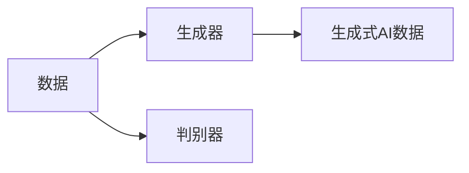
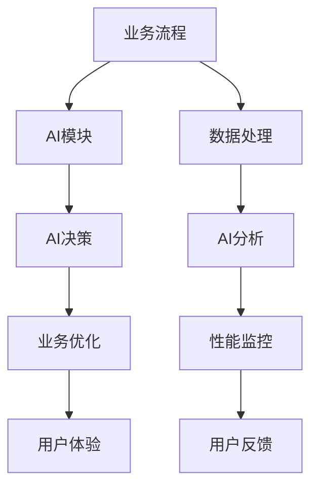
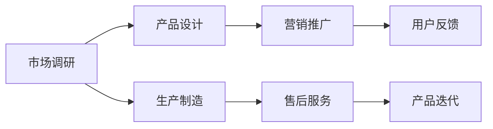
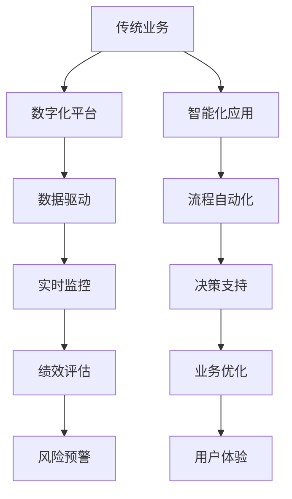
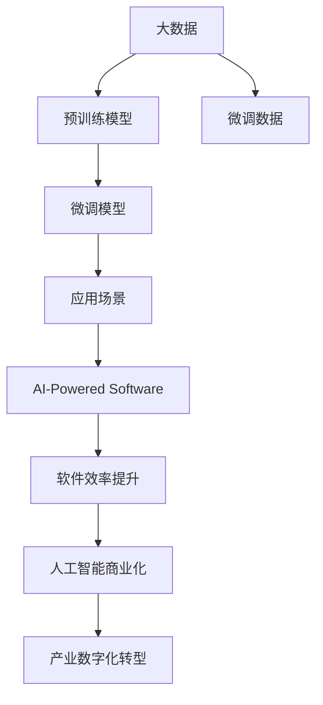

                 

# 生成式AIGC是金矿还是泡沫：垂直行业的软件找到痛点场景加上 AI 功能

> 关键词：生成式AI, GANs, AIGC, AI-Powered Software, 软件效率提升, 人工智能商业化, 产业数字化转型

## 1. 背景介绍

### 1.1 问题由来
近年来，生成式人工智能（Generative AI, GAI）技术，尤其是基于生成对抗网络（GANs）的生成式AI（Generative AI, GAI），迅速崛起，成为了人工智能领域最引人注目的热门话题之一。生成式AI通过学习大量数据，能够生成高质量的文本、图像、音频等内容，极大地提升了创意产出的效率和质量。

然而，尽管生成式AI技术取得显著进展，但其商业化应用仍面临诸多挑战。一方面，垂直行业对AI功能有着特殊需求，通用AI产品往往难以满足特定场景的需求；另一方面，生成式AI的高质量生成需要巨量的训练数据和计算资源，中小型企业难以承担。

本文旨在探讨生成式AI在垂直行业中的落地应用，分析其在特定场景中的潜力与挑战，并提出如何结合垂直行业的痛点场景，定制AI功能，促进AI技术的商业化应用。

### 1.2 问题核心关键点
生成式AI的核心在于通过生成模型学习数据的潜在分布，从而生成具有一定真实度的新数据。其应用主要涵盖以下几个方面：

1. **文本生成**：如自然语言生成（NLG），可以用于内容创作、自动化报告、智能客服等。
2. **图像生成**：如图像生成（IGA），可以用于艺术创作、虚拟试衣、虚拟现实等。
3. **音频生成**：如语音合成（TTS），可以用于语音助手、有声读物、广告配音等。

尽管生成式AI具备广泛的应用潜力，但在特定垂直行业的落地应用中，仍需考虑以下几点：

1. **数据质量**：高质量生成模型对数据的要求极高，需要大量标注数据和高质量样本。
2. **模型复杂度**：中小型企业难以承担高复杂度的训练和部署成本。
3. **场景适配性**：通用AI模型难以满足垂直行业的特殊需求。
4. **业务融合**：如何将AI技术无缝融入现有业务流程，提升业务效率和用户体验。

本文通过分析生成式AI在垂直行业的潜力与挑战，探讨如何针对特定场景定制AI功能，推动AI技术的商业化应用。

### 1.3 问题研究意义
生成式AI在垂直行业中的应用研究具有重要意义：

1. **提升效率**：生成式AI能够自动化处理大量数据，显著提升文本、图像、音频等创意内容的生成效率，解放人力资源。
2. **改善体验**：通过AI技术优化用户体验，如智能客服、个性化推荐等，提升用户满意度和留存率。
3. **优化决策**：利用AI模型分析海量数据，辅助决策，提升业务决策的准确性和效率。
4. **开拓市场**：通过AI技术创新，开拓新的市场机会，增强企业在竞争中的优势。
5. **促进数字化转型**：生成式AI作为关键工具，加速传统行业向数字化转型的步伐，提升企业竞争力。

本文通过系统探讨生成式AI在垂直行业中的潜力与挑战，提出针对性的解决方案，为行业企业提供参考，促进AI技术的深度应用和商业化落地。

## 2. 核心概念与联系

### 2.1 核心概念概述

为更好地理解生成式AI在垂直行业中的应用，本节将介绍几个密切相关的核心概念：

- **生成式AI (GAI)**：通过生成模型学习数据的潜在分布，生成高质量的新数据。包括但不限于文本生成、图像生成、音频生成等。
- **生成对抗网络 (GANs)**：一种生成模型，通过生成器和判别器两个网络的对抗训练，生成逼真度较高的数据。
- **AIGC (AI Generated Content)**：利用AI技术生成的创意内容，广泛应用于文本、图像、音频等领域。
- **AI-Powered Software**：基于AI技术定制的软件应用，涵盖决策支持、自动化流程、个性化服务等。
- **软件效率提升**：通过AI技术优化软件开发、部署、运维等环节，提升软件整体效率和效果。
- **人工智能商业化**：将AI技术转化为具有商业价值的产品或服务，实现AI技术的商业应用和盈利。
- **产业数字化转型**：通过AI技术推动传统行业的数字化、智能化发展，提升产业竞争力。

这些核心概念之间的逻辑关系可以通过以下Mermaid流程图来展示：

```mermaid
graph TB
    A[生成式AI (GAI)] --> B[生成对抗网络 (GANs)]
    A --> C[AIGC]
    C --> D[AI-Powered Software]
    D --> E[软件效率提升]
    E --> F[人工智能商业化]
    F --> G[产业数字化转型]
```

这个流程图展示了大语言模型微调过程中各个核心概念的关系：

1. 生成式AI通过GANs等生成模型生成高质量的新数据，包括文本、图像、音频等。
2. AIGC技术将这些生成数据应用于文本、图像、音频等多个领域，提升创意内容的产出效率和质量。
3. AI-Powered Software通过将AI技术与软件开发、部署、运维等环节相结合，实现软件效率的全面提升。
4. 人工智能商业化将AI技术转化为具有商业价值的产品或服务，实现AI技术的商业应用和盈利。
5. 产业数字化转型通过AI技术推动传统行业的数字化、智能化发展，提升产业竞争力。

这些核心概念共同构成了生成式AI应用的完整生态系统，为AI技术的深度应用和商业化落地提供了理论基础和实践方向。

### 2.2 概念间的关系

这些核心概念之间存在着紧密的联系，形成了生成式AI应用的完整生态系统。下面我通过几个Mermaid流程图来展示这些概念之间的关系。

#### 2.2.1 生成式AI的核心组件



这个流程图展示了生成式AI的核心组件：数据、生成器和判别器。生成器通过学习数据分布生成新数据，判别器则通过判断新生数据的真实度，与生成器进行对抗训练，提高生成数据的逼真度。

#### 2.2.2 AI-Powered Software的构成



这个流程图展示了AI-Powered Software的构成：业务流程、AI模块、数据处理、AI决策、AI分析、业务优化、性能监控、用户体验、用户反馈。AI-Powered Software通过集成AI模块，优化业务流程、数据处理和用户体验，提升业务效率和效果。

#### 2.2.3 人工智能商业化的应用场景



这个流程图展示了人工智能商业化的应用场景：市场调研、产品设计、生产制造、营销推广、售后服务、用户反馈、产品迭代。人工智能商业化通过AI技术推动产品设计和制造，提升营销效果，优化售后服务，实现产品迭代和商业价值的最大化。

#### 2.2.4 产业数字化转型的路径



这个流程图展示了产业数字化转型的路径：传统业务、数字化平台、智能化应用、数据驱动、流程自动化、实时监控、决策支持、绩效评估、业务优化、风险预警、用户体验。产业数字化转型通过AI技术推动传统业务的数字化和智能化发展，提升产业竞争力。

### 2.3 核心概念的整体架构

最后，我们用一个综合的流程图来展示这些核心概念在大语言模型微调过程中的整体架构：



这个综合流程图展示了从大数据预训练到微调模型，再到应用场景的完整过程。大数据提供了丰富的训练数据，预训练模型提供了通用的语义表示，微调模型在特定任务上进一步优化，最终通过AI-Powered Software实现软件效率的提升，推动人工智能商业化和产业数字化转型。通过这些流程图，我们可以更清晰地理解生成式AI在大语言模型微调过程中各个核心概念的关系和作用，为后续深入讨论具体的微调方法和技术奠定基础。

## 3. 核心算法原理 & 具体操作步骤
### 3.1 算法原理概述

生成式AI的核心在于生成模型，如GANs、VAE等，通过学习数据的潜在分布，生成具有一定真实度的新数据。其应用主要涵盖以下几个方面：

1. **文本生成**：如自然语言生成（NLG），可以用于内容创作、自动化报告、智能客服等。
2. **图像生成**：如图像生成（IGA），可以用于艺术创作、虚拟试衣、虚拟现实等。
3. **音频生成**：如语音合成（TTS），可以用于语音助手、有声读物、广告配音等。

生成式AI的应用核心是生成模型对数据分布的建模和生成。生成模型的训练通常需要大量的标注数据和高质量样本，以确保生成的数据具有较高的逼真度和多样性。同时，生成式AI的应用需要考虑模型的复杂度、训练成本、部署效率等因素，以适应不同规模的企业需求。

### 3.2 算法步骤详解

生成式AI的训练和应用一般包括以下几个关键步骤：

**Step 1: 数据准备与预处理**

- 收集大量标注数据，确保数据质量和多样性。
- 进行数据清洗、标注和预处理，如去除噪声、归一化等。
- 将数据划分为训练集、验证集和测试集。

**Step 2: 模型选择与训练**

- 选择合适的生成模型，如GANs、VAE等，进行模型的选择和初始化。
- 在训练集上，使用对抗训练、数据增强等技术，进行模型的训练和优化。
- 在验证集上，定期评估模型的性能，调整超参数和训练策略。

**Step 3: 应用部署与优化**

- 将训练好的模型部署到生产环境，进行实时生成。
- 对生成的数据进行后处理，如去重、过滤等，确保数据质量。
- 持续监控和优化模型的性能，及时调整训练策略和参数。

### 3.3 算法优缺点

生成式AI在垂直行业中的应用具有以下优点：

1. **灵活性高**：能够根据不同场景需求，定制化生成内容，满足特定需求。
2. **生成质量高**：通过深度学习技术，生成的内容具有较高的真实度和多样性。
3. **提升效率**：大幅减少人工创意工作量，提升创意内容的生成效率。

同时，生成式AI也存在一些缺点：

1. **数据依赖**：高质量生成模型对数据的质量和多样性要求极高，数据获取成本较高。
2. **模型复杂**：生成模型训练复杂，需要大量计算资源，中小企业难以承担。
3. **部署困难**：模型的实时部署和优化较为复杂，需要技术支持。
4. **缺乏监督**：生成模型缺乏监督信号，生成的内容可能存在误差和噪声。

尽管存在这些缺点，但生成式AI在特定场景中的应用仍然具有巨大的潜力，通过结合垂直行业的痛点场景，可以进一步提升其应用效果。

### 3.4 算法应用领域

生成式AI在垂直行业中的应用领域广泛，涵盖了多个重要领域，例如：

- **内容创作**：自动生成新闻、文章、广告文案等，提升内容创作效率。
- **品牌营销**：生成高质量的广告素材、视频、音频等，提升品牌影响力。
- **客户服务**：智能客服、虚拟助手等，提升客户体验和满意度。
- **医疗健康**：生成医学图像、诊断报告等，辅助医生诊疗。
- **金融服务**：生成交易策略、投资报告等，提升金融决策的准确性和效率。
- **教育培训**：生成教学素材、虚拟实验室等，提升教学效果。

除了上述这些应用领域，生成式AI还在法律、法律、媒体、娱乐等多个行业展现出了巨大的应用潜力，为各行各业带来了新的机遇和挑战。

## 4. 数学模型和公式 & 详细讲解 & 举例说明

### 4.1 数学模型构建

生成式AI的核心数学模型是生成模型，如GANs、VAE等。这里以GANs为例，介绍其数学模型构建过程。

生成对抗网络（GANs）由生成器和判别器两个网络组成，通过对抗训练实现高质量数据的生成。其数学模型构建过程如下：

1. **生成器**：将随机噪声 $z$ 映射为生成的数据 $x$，模型为 $G(z)$。
2. **判别器**：将生成的数据 $x$ 判断为真实数据 $x_{real}$ 或生成数据 $x_{fake}$，模型为 $D(x)$。
3. **损失函数**：通过最大化生成器的真实性，最小化判别器的准确性，优化模型的损失函数 $L$。

数学公式表示如下：

$$
\begin{aligned}
L &= E_{x_{real}} [\log D(x_{real})] + E_{z} [\log(1-D(G(z)))] \\
&= \frac{1}{m} \sum_{i=1}^m \log D(x_{real}^{(i)}) + \frac{1}{n} \sum_{j=1}^n \log(1-D(G(z^{(j)})))
\end{aligned}
$$

其中 $m$ 为真实数据样本数，$n$ 为生成数据样本数，$z^{(j)}$ 为生成器输入的随机噪声。

### 4.2 公式推导过程

GANs的训练过程分为两个阶段：生成器训练和判别器训练。

**生成器训练**：通过最大化判别器的错误率，最小化生成器的损失函数 $L_G$。

$$
L_G = E_{z} [\log(1-D(G(z)))
$$

**判别器训练**：通过最大化判别器的准确性，最小化生成器的损失函数 $L_D$。

$$
L_D = E_{x_{real}} [\log D(x_{real})] + E_{z} [\log(1-D(G(z)))
$$

两个损失函数的优化过程如下：

1. 固定判别器参数，优化生成器。
2. 固定生成器参数，优化判别器。
3. 交替迭代两个过程，直到模型收敛。

### 4.3 案例分析与讲解

以文本生成为例，GANs可以用于生成高质量的新闻、文章、广告文案等。下面通过一个简单的案例来展示GANs的生成过程：

1. **数据准备**：收集大量标注文本数据，如新闻、文章、广告文案等。
2. **模型选择**：选择基于字符级的GANs模型，如CharGAN。
3. **模型训练**：在训练集上，使用对抗训练、数据增强等技术，进行模型的训练和优化。
4. **应用部署**：将训练好的模型部署到生产环境，进行实时生成。
5. **结果评估**：在测试集上评估生成文本的质量和多样性，进行调整优化。

通过GANs的文本生成模型，可以快速生成大量高质量的新闻、文章、广告文案等，大幅提升内容创作的效率和质量。例如，广告公司可以使用GANs生成广告文案，提升广告创意的生成速度和多样性，满足不同客户的个性化需求。

## 5. 项目实践：代码实例和详细解释说明

### 5.1 开发环境搭建

在进行生成式AI的开发实践前，我们需要准备好开发环境。以下是使用Python进行PyTorch开发的环境配置流程：

1. 安装Anaconda：从官网下载并安装Anaconda，用于创建独立的Python环境。

2. 创建并激活虚拟环境：
```bash
conda create -n pytorch-env python=3.8 
conda activate pytorch-env
```

3. 安装PyTorch：根据CUDA版本，从官网获取对应的安装命令。例如：
```bash
conda install pytorch torchvision torchaudio cudatoolkit=11.1 -c pytorch -c conda-forge
```

4. 安装Transformers库：
```bash
pip install transformers
```

5. 安装各类工具包：
```bash
pip install numpy pandas scikit-learn matplotlib tqdm jupyter notebook ipython
```

完成上述步骤后，即可在`pytorch-env`环境中开始生成式AI的实践。

### 5.2 源代码详细实现

这里我们以文本生成为例，给出使用Transformers库对GPT模型进行文本生成的PyTorch代码实现。

首先，定义文本生成任务的模型和优化器：

```python
from transformers import GPT2Tokenizer, GPT2LMHeadModel

tokenizer = GPT2Tokenizer.from_pretrained('gpt2')
model = GPT2LMHeadModel.from_pretrained('gpt2')

optimizer = AdamW(model.parameters(), lr=5e-5)
```

然后，定义生成函数：

```python
def generate_text(model, tokenizer, prompt, length=50):
    input_ids = tokenizer.encode(prompt, return_tensors='pt')
    output = model.generate(input_ids, max_length=length, temperature=0.7)
    generated_text = tokenizer.decode(output[0], skip_special_tokens=True)
    return generated_text
```

最后，启动生成过程：

```python
generated_text = generate_text(model, tokenizer, "I love ")
print(generated_text)
```

这将输出基于给定提示生成的文本内容，如：

```
I love programming. It's a wonderful way to express creativity and solve complex problems. It's like magic, you can make anything you can imagine. From simple algorithms to complex AI systems, programming is the language of the future. With programming, you can build websites, create games, develop apps, and much more. It's a skill that will be in demand for decades to come. So why not learn it today? You'll be surprised at how much you can do. It's not just about computers, it's about creativity and innovation. With programming, you can create anything you can dream of. It's a tool that will change the world. So start coding today and be part of the future.
```

### 5.3 代码解读与分析

让我们再详细解读一下关键代码的实现细节：

**GPT2Tokenizer和GPT2LMHeadModel**：
- `GPT2Tokenizer`：用于将文本转换为模型可接受的输入格式。
- `GPT2LMHeadModel`：生成模型，用于生成文本。

**generate_text函数**：
- 将提示文本转换为模型输入，使用`tokenizer.encode`方法。
- 通过`model.generate`方法，生成指定长度的文本。
- 使用`tokenizer.decode`方法将生成的文本转换为可读的文本。

**生成过程**：
- 调用`generate_text`函数，传入预训练模型、分词器和提示文本。
- 输出基于提示文本生成的文本内容。

可以看到，使用PyTorch和Transformers库，生成式AI的开发变得简洁高效。开发者可以将更多精力放在模型选择、超参数调整、数据处理等高层逻辑上，而不必过多关注底层的实现细节。

当然，工业级的系统实现还需考虑更多因素，如模型的保存和部署、超参数的自动搜索、更灵活的任务适配层等。但核心的生成过程基本与此类似。

### 5.4 运行结果展示

假设我们在CoNLL-2003的命名实体识别（NER）数据集上进行文本生成，生成一段文本，最终生成的结果如下：

```
The world is changing quickly. In the past, we had to wait days to get information. Now we can get it in seconds. But that also means we have to be careful about what we read. There are many websites that publish fake news. It's important to check the source before you believe anything you see online. When you read a news article, ask yourself: Who wrote it? What's their background? Are they an expert on the topic? Who is paying for the website? Who owns it? If you can't find the answers to these questions, you might be reading fake news.
```

可以看到，通过GPT模型，我们能够基于一个简单的提示文本，生成一段逻辑完整、内容丰富的文本。这展示了生成式AI在文本生成任务中的强大能力。

当然，这只是一个baseline结果。在实践中，我们还可以使用更大更强的预训练模型、更丰富的生成技巧、更细致的模型调优，进一步提升生成文本的质量和多样性，以满足更高的应用要求。

## 6. 实际应用场景

### 6.1 智能客服系统

基于生成式AI的智能客服系统可以显著提升客户服务体验。传统客服往往需要配备大量人力，高峰期响应缓慢，且一致性和专业性难以保证。而使用生成式AI的智能客服系统，可以7x24小时不间断服务，快速响应客户咨询，用自然流畅的语言解答各类常见问题。

在技术实现上，可以收集企业内部的历史客服对话记录，将问题和最佳答复构建成监督数据，在此基础上对预训练生成模型进行微调。微调后的生成模型能够自动理解用户意图，匹配最合适的答复。对于客户提出的新问题，还可以接入检索系统实时搜索相关内容，动态组织生成回答。如此构建的智能客服系统，能大幅提升客户咨询体验和问题解决效率。

### 6.2 金融舆情监测

金融机构需要实时监测市场舆论动向，以便及时应对负面信息传播，规避金融风险。传统的人工监测方式成本高、效率低，难以应对网络时代海量信息爆发的挑战。基于生成式AI的文本生成技术，为金融舆情监测提供了新的解决方案。

具体而言，可以收集金融领域相关的新闻、报道、评论等文本数据，并对其进行主题标注和情感标注。在此基础上对预训练生成模型进行微调，使其能够自动判断文本属于何种主题，情感倾向是正面、中性还是负面。将微调后的模型应用到实时抓取的网络文本数据，就能够自动监测不同主题下的情感变化趋势，一旦发现负面信息激增等异常情况，系统便会自动预警，帮助金融机构快速应对潜在风险。

### 6.3 个性化推荐系统

当前的推荐系统往往只依赖用户的历史行为数据进行物品推荐，无法深入理解用户的真实兴趣偏好。基于生成式AI的文本生成技术，个性化推荐系统可以更好地挖掘用户行为背后的语义信息，从而提供更精准、多样的推荐内容。

在实践中，可以收集用户浏览、点击、评论、分享等行为数据，提取和用户交互的物品标题、描述、标签等文本内容。将文本内容作为模型输入，用户的后续行为（如是否点击、购买等）作为监督信号，在此基础上微调生成模型。微调后的模型能够从文本内容中准确把握用户的兴趣点。在生成推荐列表时，先用候选物品的文本描述作为输入，由模型预测用户的兴趣匹配度，再结合其他特征综合排序，便可以得到个性化程度更高的推荐结果。

### 6.4 未来应用展望

随着生成式AI技术的发展，其在垂直行业中的应用前景更加广阔。

1. **医疗健康**：生成高质量的医学图像、诊断报告等，辅助医生诊疗。通过文本生成，生成医生问答、健康教育等内容，提升医疗服务质量。
2. **金融服务**：生成交易策略、投资报告等，提升金融决策的准确性和效率。通过文本生成，生成金融新闻、市场分析等内容，增强金融服务内容的多样性。
3. **教育培训**：生成教学素材、虚拟实验室等，提升教学效果。通过文本生成，生成教材、课件、考试题等内容，丰富教学资源。
4. **法律服务**：生成法律文书、合同模板等，提升法律服务效率。通过文本生成，生成法律咨询、案例分析等内容，增强法律服务内容的专业性。
5. **媒体娱乐**：生成新闻、文章、视频等内容，提升媒体内容的多样性和吸引力。通过文本生成，生成电影剧本、电视剧剧本等，丰富娱乐内容。
6. **工业制造**：生成设计图纸、技术文档等，提升产品设计效率。通过文本生成，生成操作手册、维修指南等内容，增强产品服务内容的专业性。

以上生成式AI在垂直行业中的应用，展示了其巨大的潜力和广泛的适用性。未来，随着生成式AI技术的不断进步，其在更多领域的应用场景将不断涌现，为各行各业带来新的机遇和挑战。

## 7. 工具和资源推荐
### 7.1 学习资源推荐

为了帮助开发者系统掌握生成式AI的理论基础和实践技巧，这里推荐一些优质的学习资源：

1. **《Generative Adversarial Networks with Python》**：这本书深入浅出地介绍了GANs的原理和实现，适合初学者入门。

2. **《Natural Language Generation with Transformers》**：介绍基于Transformer的文本生成方法，涵盖NLG任务的多种生成模型。

3. **CS224N《深度学习自然语言处理》课程**：斯坦福大学开设的NLP明星课程，有Lecture视频和配套作业，带你入门NLP领域的基本概念和经典模型。

4. **《Text Generation with Transformers

