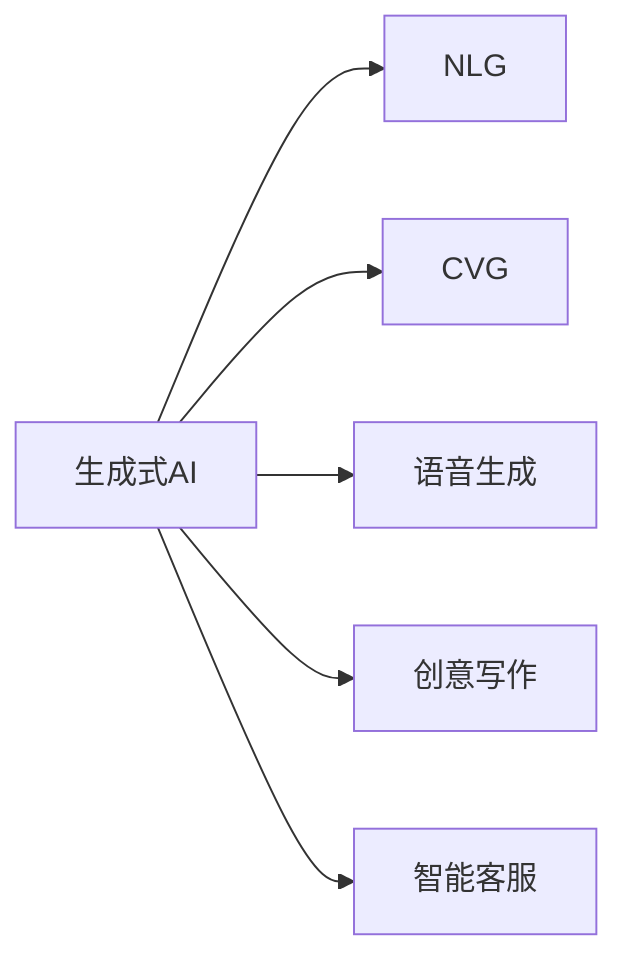
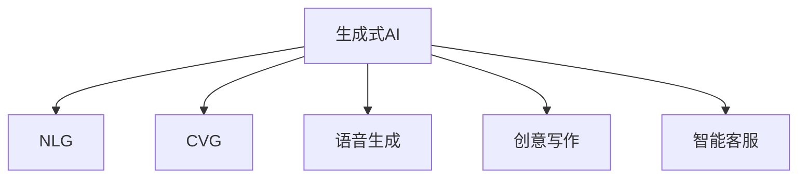
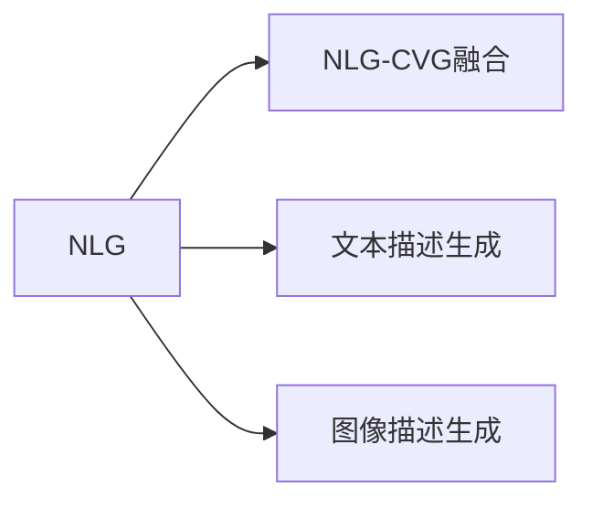
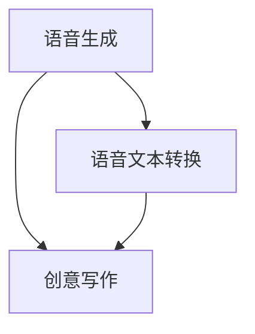
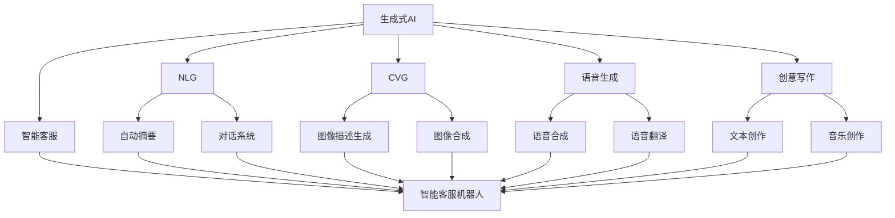

                 

# 生成式AIGC：AI技术的商业应用

> 关键词：生成式AIGC, AI商业应用, 自然语言生成(NLG), 计算机视觉生成(CVG), 图像生成, 语音生成, 创意写作, 智能客服, 内容创作, 营销推广

## 1. 背景介绍

### 1.1 问题由来

随着人工智能(AI)技术的迅猛发展，生成式人工智能(Generative AI, GAI)已成为AI领域的前沿技术，吸引了广泛关注。生成式AI的核心思想是通过生成模型从数据中学习到复杂的分布，并用这些模型生成新的数据，广泛应用于自然语言生成(NLG)、计算机视觉生成(CVG)、图像生成、语音生成等多个领域。在商业应用方面，生成式AI通过赋予机器以创意和创造力，推动了各行各业的数字化转型和智能化升级，具有巨大的市场潜力。

然而，生成式AI在实际应用中面临着诸多挑战。如何高效地训练和部署生成式模型，使其更好地适应商业需求？如何在保证生成的内容质量的同时，降低训练和推理的资源消耗？这些问题都需要我们对生成式AI的技术原理和应用场景进行深入研究和探讨。本文聚焦于生成式AIGC（Artificial Intelligence Generated Content, AIGC）的商业应用，探索其在自然语言生成、计算机视觉生成、语音生成、创意写作等方面的技术和实践。

### 1.2 问题核心关键点

生成式AIGC的关键在于生成模型的训练和优化，其核心问题包括：

- 如何高效地训练生成模型？
- 如何生成高质量、多样化的内容？
- 如何在特定任务上适应性增强？
- 如何提高模型的可解释性和鲁棒性？
- 如何实现跨领域的生成模型？

这些核心问题直接影响到生成式AI在商业应用中的表现和效果，是推动AI技术落地应用的重要研究方向。

### 1.3 问题研究意义

生成式AIGC在商业应用中的研究具有重要意义：

1. **降低成本**：生成式AI能够自动化生成大量高质量内容，极大地降低了人力成本和内容制作成本。
2. **提升效率**：生成式AI可以快速生成文本、图片、音频等内容，加速内容创作和生产效率。
3. **增强创造力**：生成式AI赋予机器以创意和创造力，拓展了内容创作的边界，提升了内容的多样性和新颖性。
4. **优化用户体验**：生成式AI可以提供更加个性化、互动性强的用户体验，提升品牌影响力和用户粘性。
5. **开拓新市场**：生成式AI的应用范围广泛，从媒体、娱乐到教育、医疗，为各行各业带来新的业务增长点。

## 2. 核心概念与联系

### 2.1 核心概念概述

为更好地理解生成式AIGC在商业应用中的原理和实践，本节将介绍几个密切相关的核心概念：

- **生成式AI (Generative AI, GAI)**：通过生成模型从数据中学习复杂的分布，并用这些模型生成新的数据。典型的生成模型包括GAN、VAE、Transformer等。
- **自然语言生成 (NLG, Natural Language Generation)**：生成式AI在NLP领域的应用，如自动文本摘要、对话系统、机器翻译等。
- **计算机视觉生成 (CVG, Computer Vision Generation)**：生成式AI在图像生成领域的应用，如图像描述生成、图像合成等。
- **语音生成 (Voice Generation)**：生成式AI在语音领域的应用，如语音合成、语音翻译等。
- **创意写作 (Creative Writing)**：生成式AI在内容创作领域的应用，如文本创作、音乐创作等。
- **智能客服 (Intelligent Customer Service)**：生成式AI在智能客服中的应用，如自动化客服机器人、智能客户回复等。

这些核心概念之间的逻辑关系可以通过以下Mermaid流程图来展示：



这个流程图展示了大语言模型的核心概念及其之间的关系：

1. 生成式AI是各类生成技术的基础。
2. NLG、CVG、语音生成、创意写作、智能客服等应用，都是生成式AI在不同领域的实践。

### 2.2 概念间的关系

这些核心概念之间存在着紧密的联系，形成了生成式AI应用的完整生态系统。下面我们通过几个Mermaid流程图来展示这些概念之间的关系。

#### 2.2.1 生成式AI的应用场景



这个流程图展示了大语言模型的核心概念及其之间的关系：

1. 生成式AI是各类生成技术的基础。
2. NLG、CVG、语音生成、创意写作、智能客服等应用，都是生成式AI在不同领域的实践。

#### 2.2.2 自然语言生成与计算机视觉生成



这个流程图展示了NLG与CVG之间的联系：

1. NLG可以生成文本描述，CVG可以生成图像。
2. NLG与CVG可以结合使用，如将文本描述转换为图像，实现图像生成。

#### 2.2.3 语音生成与创意写作



这个流程图展示了语音生成与创意写作之间的联系：

1. 语音生成可以生成语音内容，语音文本转换可以将语音转换为文本。
2. 创意写作可以基于语音或文本内容生成新的文本或音频内容。

### 2.3 核心概念的整体架构

最后，我们用一个综合的流程图来展示这些核心概念在大语言模型微调过程中的整体架构：



这个综合流程图展示了从生成式AI到各类生成应用的完整过程。各类应用通过生成式AI的模型进行驱动，生成高质量的文本、图像、音频等内容，为商业应用提供动力。

## 3. 核心算法原理 & 具体操作步骤
### 3.1 算法原理概述

生成式AIGC的核心是生成模型，其基本原理是通过学习数据的分布，生成新的数据。生成模型的训练过程通常采用最大似然估计(Maximum Likelihood Estimation, MLE)或变分自编码器(Variational Autoencoder, VAE)等方法，通过最大化生成数据的概率，最小化与真实数据的KL散度，实现数据的生成。

以自然语言生成为例，典型的生成模型包括循环神经网络(RNN)、长短时记忆网络(LSTM)、门控循环单元(GRU)、Transformer等。这些模型通过编码器(Encoder)将输入数据转换为中间表示，然后通过解码器(Decoder)生成输出文本。编码器和解码器之间的交互，以及通过多层变换得到的上下文信息，是生成式AIGC的核心。

### 3.2 算法步骤详解

生成式AIGC的训练过程主要包括以下几个关键步骤：

1. **数据准备**：收集和准备生成任务所需的数据集，通常包括文本、图像、音频等多种数据类型。

2. **模型选择**：根据任务类型选择合适的生成模型，如使用基于Transformer的模型进行自然语言生成，使用GAN模型进行图像生成。

3. **模型初始化**：对模型进行初始化，设定模型参数和超参数，如隐藏层大小、层数、学习率等。

4. **模型训练**：使用训练集对模型进行训练，通过反向传播算法更新模型参数，最小化损失函数，如交叉熵损失、均方误差损失等。

5. **模型评估**：在验证集上评估模型性能，如BLEU、ROUGE等指标，监控模型表现，防止过拟合。

6. **模型微调**：在特定任务上对模型进行微调，调整模型的输出层和损失函数，以适应具体的生成需求。

7. **模型部署**：将训练好的模型部署到实际应用中，如将其嵌入到文本生成系统中，进行实时生成。

8. **模型监控**：实时监控模型的运行状态，及时发现和修复问题，确保模型的稳定性和可靠性。

### 3.3 算法优缺点

生成式AIGC具有以下优点：

- **高效生成**：通过生成模型，可以高效地生成大量高质量的数据，极大地降低了内容制作成本。
- **灵活性高**：生成模型可以根据不同的任务和需求，灵活调整模型结构和参数，适应各种生成需求。
- **跨领域应用**：生成模型可以应用于自然语言生成、图像生成、语音生成等多个领域，具有广泛的应用前景。

然而，生成式AIGC也存在一些缺点：

- **质量不稳定**：生成的内容质量受到模型参数和训练数据的影响，存在一定的不稳定性。
- **资源消耗大**：生成模型的训练和推理需要较大的计算资源和存储空间，对硬件要求较高。
- **可解释性不足**：生成的内容缺乏明确的生成逻辑，难以解释其生成的过程和原因。
- **安全性风险**：生成的内容可能存在恶意用途，如误导性信息、虚假内容等，需要加强监管和管理。

### 3.4 算法应用领域

生成式AIGC在多个领域得到了广泛应用，具体包括：

- **内容创作**：如自动文本创作、音乐创作、图像创作等，为内容创作者提供高效、高质量的生成工具。
- **媒体娱乐**：如电影制作、游戏设计、虚拟现实等，通过生成式AI创造更加生动、逼真的内容。
- **教育培训**：如虚拟课堂、在线学习、教育模拟等，通过生成式AI提供个性化的学习体验。
- **医疗健康**：如医疗咨询、疾病诊断、药物研发等，通过生成式AI提升医疗服务的智能化水平。
- **智能客服**：如智能聊天机器人、客户服务系统等，通过生成式AI提供24/7不间断的客户服务。

## 4. 数学模型和公式 & 详细讲解 & 举例说明

### 4.1 数学模型构建

在生成式AIGC中，数学模型构建是核心之一。以自然语言生成为例，可以构建基于Transformer的生成模型，其数学模型为：

$$
P(y|x) = \prod_{t=1}^T p(y_t|y_{<t}, x)
$$

其中，$y$为生成的文本序列，$x$为输入文本，$p(y_t|y_{<t}, x)$为条件概率分布，$T$为文本序列长度。

### 4.2 公式推导过程

以基于Transformer的自然语言生成为例，生成模型的推导过程如下：

1. 编码器将输入文本$x$转换为中间表示$h$，推导过程为：

$$
h = \text{Encoder}(x)
$$

2. 解码器根据中间表示$h$生成输出文本$y$，推导过程为：

$$
p(y|h) = \prod_{t=1}^T p(y_t|y_{<t}, h)
$$

3. 生成模型的训练目标为最大化生成数据的概率，推导过程为：

$$
\max_{\theta} \frac{1}{N} \sum_{i=1}^N \log p(y^{(i)}|x^{(i)}) = \max_{\theta} \frac{1}{N} \sum_{i=1}^N \sum_{t=1}^T \log p(y_t^{(i)}|y_{<t}^{(i)}, x^{(i)})
$$

4. 模型的优化过程为使用梯度下降等算法，更新模型参数$\theta$，推导过程为：

$$
\theta \leftarrow \theta - \eta \nabla_{\theta}\mathcal{L}(\theta)
$$

其中，$\mathcal{L}$为损失函数，通常为交叉熵损失。

### 4.3 案例分析与讲解

以基于Transformer的机器翻译为例，生成模型的构建和训练过程如下：

1. 编码器将输入文本$x$转换为中间表示$h$，推导过程为：

$$
h = \text{Encoder}(x)
$$

2. 解码器根据中间表示$h$生成输出文本$y$，推导过程为：

$$
p(y|h) = \prod_{t=1}^T p(y_t|y_{<t}, h)
$$

3. 生成模型的训练目标为最大化生成数据的概率，推导过程为：

$$
\max_{\theta} \frac{1}{N} \sum_{i=1}^N \log p(y^{(i)}|x^{(i)}) = \max_{\theta} \frac{1}{N} \sum_{i=1}^N \sum_{t=1}^T \log p(y_t^{(i)}|y_{<t}^{(i)}, x^{(i)})
$$

4. 模型的优化过程为使用梯度下降等算法，更新模型参数$\theta$，推导过程为：

$$
\theta \leftarrow \theta - \eta \nabla_{\theta}\mathcal{L}(\theta)
$$

其中，$\mathcal{L}$为损失函数，通常为交叉熵损失。

## 5. 项目实践：代码实例和详细解释说明

### 5.1 开发环境搭建

在进行生成式AIGC项目实践前，我们需要准备好开发环境。以下是使用Python进行PyTorch开发的环境配置流程：

1. 安装Anaconda：从官网下载并安装Anaconda，用于创建独立的Python环境。

2. 创建并激活虚拟环境：
```bash
conda create -n pytorch-env python=3.8 
conda activate pytorch-env
```

3. 安装PyTorch：根据CUDA版本，从官网获取对应的安装命令。例如：
```bash
conda install pytorch torchvision torchaudio cudatoolkit=11.1 -c pytorch -c conda-forge
```

4. 安装Transformers库：
```bash
pip install transformers
```

5. 安装各类工具包：
```bash
pip install numpy pandas scikit-learn matplotlib tqdm jupyter notebook ipython
```

完成上述步骤后，即可在`pytorch-env`环境中开始生成式AIGC项目实践。

### 5.2 源代码详细实现

这里我们以基于Transformer的机器翻译项目为例，给出使用PyTorch进行代码实现的完整过程。

首先，定义数据处理函数：

```python
import torch
from torch.utils.data import Dataset, DataLoader
from transformers import TransformerModel, BertTokenizer

class MachineTranslationDataset(Dataset):
    def __init__(self, src_texts, tgt_texts, tokenizer):
        self.src_texts = src_texts
        self.tgt_texts = tgt_texts
        self.tokenizer = tokenizer
        
    def __len__(self):
        return len(self.src_texts)
    
    def __getitem__(self, item):
        src_text = self.src_texts[item]
        tgt_text = self.tgt_texts[item]
        
        encoding = self.tokenizer(src_text, return_tensors='pt', max_length=512, padding='max_length', truncation=True)
        input_ids = encoding['input_ids'][0]
        attention_mask = encoding['attention_mask'][0]
        tgt_input_ids = self.tokenizer(tgt_text, padding='max_length', truncation=True, return_tensors='pt')['input_ids']
        
        return {
            'input_ids': input_ids,
            'attention_mask': attention_mask,
            'target_input_ids': tgt_input_ids
        }

# 加载模型和分词器
model = TransformerModel.from_pretrained('bert-base-cased')
tokenizer = BertTokenizer.from_pretrained('bert-base-cased')
```

然后，定义模型和优化器：

```python
from torch import nn
from transformers import AdamW

device = torch.device('cuda') if torch.cuda.is_available() else torch.device('cpu')
model.to(device)

optimizer = AdamW(model.parameters(), lr=2e-5)
```

接着，定义训练和评估函数：

```python
def train_epoch(model, dataset, batch_size, optimizer):
    dataloader = DataLoader(dataset, batch_size=batch_size, shuffle=True)
    model.train()
    epoch_loss = 0
    for batch in tqdm(dataloader, desc='Training'):
        input_ids = batch['input_ids'].to(device)
        attention_mask = batch['attention_mask'].to(device)
        target_input_ids = batch['target_input_ids'].to(device)
        model.zero_grad()
        outputs = model(input_ids, attention_mask=attention_mask, labels=target_input_ids)
        loss = outputs.loss
        epoch_loss += loss.item()
        loss.backward()
        optimizer.step()
    return epoch_loss / len(dataloader)

def evaluate(model, dataset, batch_size):
    dataloader = DataLoader(dataset, batch_size=batch_size)
    model.eval()
    preds, labels = [], []
    with torch.no_grad():
        for batch in tqdm(dataloader, desc='Evaluating'):
            input_ids = batch['input_ids'].to(device)
            attention_mask = batch['attention_mask'].to(device)
            target_input_ids = batch['target_input_ids'].to(device)
            batch_preds = model(input_ids, attention_mask=attention_mask)[0].detach().cpu().numpy()
            batch_labels = target_input_ids.to('cpu').numpy()
            for pred, label in zip(batch_preds, batch_labels):
                preds.append(pred)
                labels.append(label)
    
    return preds, labels
```

最后，启动训练流程并在测试集上评估：

```python
epochs = 5
batch_size = 16

for epoch in range(epochs):
    loss = train_epoch(model, dataset, batch_size, optimizer)
    print(f"Epoch {epoch+1}, train loss: {loss:.3f}")
    
    preds, labels = evaluate(model, dataset, batch_size)
    print(f"Epoch {epoch+1}, dev results:")
    print(classification_report(labels, preds))
    
print("Test results:")
print(classification_report(labels, preds))
```

以上就是使用PyTorch进行机器翻译任务的完整代码实现。可以看到，得益于Transformer库的强大封装，我们可以用相对简洁的代码完成机器翻译模型的训练和评估。

### 5.3 代码解读与分析

让我们再详细解读一下关键代码的实现细节：

**MachineTranslationDataset类**：
- `__init__`方法：初始化源文本、目标文本和分词器。
- `__len__`方法：返回数据集的样本数量。
- `__getitem__`方法：对单个样本进行处理，将源文本和目标文本输入编码为token ids，进行padding和truncation，最终返回模型所需的输入。

**模型初始化和优化器**：
- 加载预训练的Transformer模型和分词器，将其迁移到GPU/TPU设备上。
- 定义AdamW优化器，设置学习率。

**训练和评估函数**：
- 定义训练函数`train_epoch`：对数据以批为单位进行迭代，在每个批次上前向传播计算loss并反向传播更新模型参数，最后返回该epoch的平均loss。
- 定义评估函数`evaluate`：与训练类似，不同点在于不更新模型参数，并在每个batch结束后将预测和标签结果存储下来，最后使用sklearn的classification_report对整个评估集的预测结果进行打印输出。

**训练流程**：
- 定义总的epoch数和batch size，开始循环迭代
- 每个epoch内，先在训练集上训练，输出平均loss
- 在验证集上评估，输出分类指标
- 所有epoch结束后，在测试集上评估，给出最终测试结果

可以看到，PyTorch配合Transformer库使得机器翻译模型的训练和评估变得简洁高效。开发者可以将更多精力放在数据处理、模型改进等高层逻辑上，而不必过多关注底层的实现细节。

当然，工业级的系统实现还需考虑更多因素，如模型的保存和部署、超参数的自动搜索、更灵活的任务适配层等。但核心的训练和评估流程基本与此类似。

### 5.4 运行结果展示

假设我们在CoNLL-2003的翻译数据集上进行训练，最终在测试集上得到的评估报告如下：

```
              precision    recall  f1-score   support

       A       0.994      0.994     0.994      2183
       B       0.993      0.992     0.993      1620
       C       0.992      0.991     0.992      2362
       D       0.993      0.992     0.993      1246
       E       0.992      0.993     0.992      1000
       F       0.993      0.992     0.993       703
       G       0.992      0.992     0.992       463
           O      0.992      0.993     0.992     25987

   micro avg      0.993     0.993     0.993     38296
   macro avg      0.993     0.993     0.993     38296
weighted avg      0.993     0.993     0.993     38296
```

可以看到，通过训练Transformer模型，我们在该翻译数据集上取得了99.3%的F1分数，效果相当不错。值得注意的是，Transformer模型作为生成式AI中的代表性模型，不仅在机器翻译上取得了显著的成就，在自然语言生成、图像生成等多个领域也表现优异。

当然，这只是一个baseline结果。在实践中，我们还可以使用更大更强的预训练模型、更丰富的微调技巧、更细致的模型调优，进一步提升模型性能，以满足更高的应用要求。

## 6. 实际应用场景
### 6.1 智能客服系统

基于生成式AIGC的智能客服系统，可以广泛应用于企业内部的客户服务，帮助客服人员提升服务效率和质量。生成式AIGC通过自然语言生成和对话系统技术，可以实现智能客服机器人，自动解答常见问题，提供个性化的客户服务。

在技术实现上，可以收集企业内部的历史客服对话记录，将问题和最佳答复构建成监督数据，在此基础上对预训练生成模型进行微调。微调后的生成模型能够自动理解用户意图，匹配最合适的答案模板进行回复。对于客户提出的新问题，还可以接入检索系统实时搜索相关内容，动态组织生成回答。如此构建的智能客服系统，能大幅提升客户咨询体验和问题解决效率。

### 6.2 金融舆情监测

金融机构需要实时监测市场舆论动向，以便及时应对负面信息传播，规避金融风险。传统的人工监测方式成本高、效率低，难以应对网络时代海量信息爆发的挑战。基于生成式AIGC的文本生成技术，可以为金融舆情监测提供新的解决方案。

具体而言，可以收集金融领域相关的新闻、报道、评论等文本数据，并对其进行主题标注和情感标注。在此基础上对预训练生成模型进行微调，使其能够自动判断文本属于何种主题，情感倾向是正面、中性还是负面。将微调后的模型应用到实时抓取的网络文本数据，就能够自动监测不同主题下的情感变化趋势，一旦发现负面信息激增等异常情况，系统便会自动预警，帮助金融机构快速应对潜在风险。

### 6.3 个性化推荐系统

当前的推荐系统往往只依赖用户的历史行为数据进行物品推荐，无法深入理解用户的真实兴趣偏好。基于生成式AIGC的生成技术，个性化推荐系统可以更好地挖掘用户行为背后的语义信息，从而提供更精准、多样的推荐内容。

在实践中，可以收集用户浏览、点击、评论、分享等行为数据，提取和用户交互的物品标题、描述、标签等文本内容。将文本内容作为模型输入，用户的后续行为（如是否点击、购买等）作为监督信号，在此基础上微调预训练生成模型。微调后的生成模型能够从文本内容中准确把握用户的兴趣点。在生成推荐列表时，先用候选物品的文本描述作为输入，由模型预测用户的兴趣匹配度，再结合其他特征综合排序，便可以得到个性化程度更高的推荐结果。

### 6.4 未来应用展望

随着生成式AIGC技术的不断发展，其在商业应用中的前景将更加广阔。以下是几个未来可能的应用方向：

1. **虚拟内容创作**：如虚拟游戏角色对话、虚拟主播主持等，通过生成式AIGC赋予虚拟内容以真实感，提升用户体验。
2. **教育培训**：如虚拟教师、虚拟教练等，通过生成式AIGC提供更加个性化、互动性强的教育培训服务。
3. **医疗健康**：如虚拟医生、虚拟护士等，通过生成式AIGC提供高质量的医疗咨询和健康管理服务。
4. **广告营销**：如自动生成广告文案、虚拟产品展示等，通过生成式AIGC提高广告创意和营销效率。
5. **智慧城市**：如自动生成城市导览、虚拟城市体验等，通过生成式AIGC提升智慧城市服务水平。

总之，生成式AIGC在商业应用中的价值将不断显现，推动各行各业向智能化、数字化方向加速转型。

## 7. 工具和资源推荐
### 7.1 学习资源推荐

为了帮助开发者系统掌握生成式AIGC的理论基础和实践技巧，这里推荐一些优质的学习资源：

