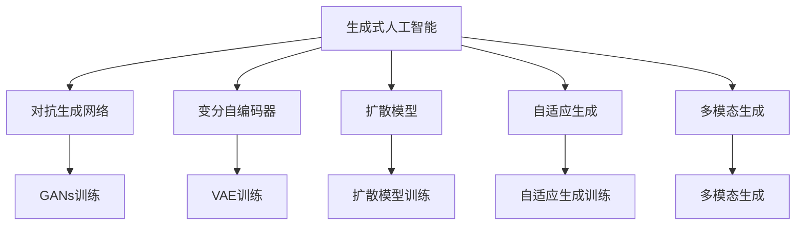
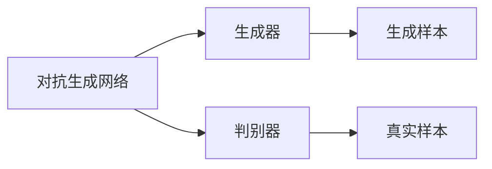
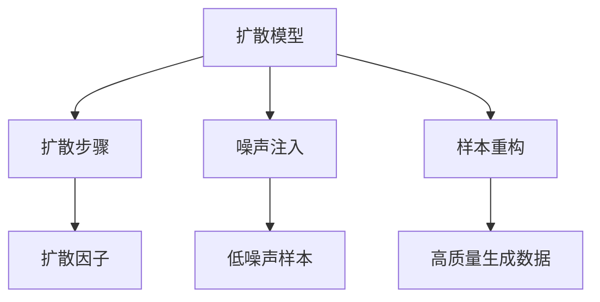
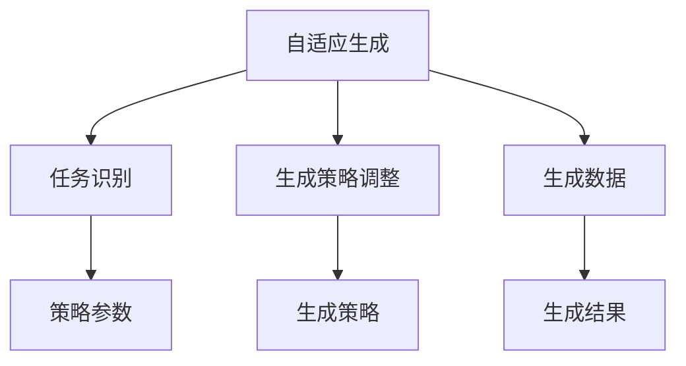
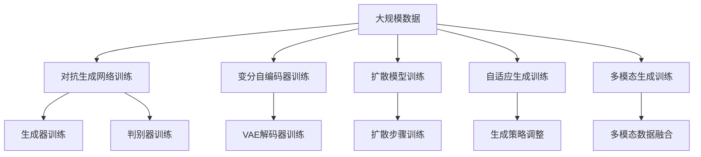

                 

# 生成式AIGC：从概念验证到大规模应用

生成式人工智能生成内容（Generative AI Content Generation，简称AIGC）技术近年来在图像、音频、视频、文本等领域取得了显著进展，成为人工智能的重要分支。本文将全面系统地介绍生成式AIGC从概念验证到大规模应用的演进过程，包括核心概念、算法原理、实践步骤、应用场景等，深入探讨其在艺术创作、内容生产、教育培训、工业设计等方面的应用，展望其未来发展趋势及面临的挑战。

## 1. 背景介绍

### 1.1 问题由来
生成式AIGC的兴起，源于深度学习技术在图像、音频、文本等领域的突破性进展。早期的深度学习模型主要应用于分类、检测、聚类等任务，而生成式模型则着眼于生成全新的内容。这种转变，不仅推动了人工智能技术从以数据为中心的提取式学习转向以数据和知识驱动的生成式学习，也为内容生成、创作辅助、智能交互等方向带来了全新的可能性。

从早期基于RNN、GAN等生成式模型，到近年来深度学习技术在多模态领域的大幅提升，生成式AIGC经历了从概念验证到实际应用的飞跃。随着算法性能的提升，生成式AIGC技术已经在艺术创作、内容生产、教育培训、工业设计等多个领域得到了广泛应用。

### 1.2 问题核心关键点
生成式AIGC的核心问题在于如何通过深度学习模型，高效、准确地生成符合特定要求的新内容。其关键在于：
- 选择合适的生成模型。包括RNN、GAN、Transformer等，以及它们在大规模数据上的表现。
- 设计合理的生成策略。如对抗生成网络、变分自编码器、扩散模型等。
- 优化生成质量。通过正则化、对抗样本、自适应学习率等方法，提高生成内容的真实性和多样性。
- 应用领域的拓展。将生成式AIGC技术应用于更多场景，如自然语言处理、艺术创作、交互式娱乐等。

## 2. 核心概念与联系

### 2.1 核心概念概述

为更好地理解生成式AIGC的核心技术，本节将介绍几个关键概念：

- 生成式人工智能（Generative AI）：通过深度学习模型，生成符合特定要求的新内容的技术。
- 对抗生成网络（Generative Adversarial Networks，GANs）：由生成器和判别器两个网络组成，通过对抗训练生成高质量的伪造数据。
- 变分自编码器（Variational Autoencoder，VAE）：通过编码器和解码器，实现数据的压缩与重构，生成具有特定分布的新数据。
- 扩散模型（Diffusion Models）：通过缓慢的噪声注入过程，将低噪声数据转换为高质量生成数据。
- 自适应生成（Adaptive Generation）：根据不同任务和数据的特点，自适应地调整生成策略，提升生成效果。
- 多模态生成（Multi-modal Generation）：结合文本、图像、音频等多模态数据，生成更加丰富的内容。

这些核心概念之间的联系可以通过以下Mermaid流程图来展示：



这个流程图展示了大规模生成式AIGC技术的主要构成，以及它们之间的内在联系。

### 2.2 概念间的关系

这些核心概念之间存在着紧密的联系，形成了生成式AIGC的完整生态系统。下面我们通过几个Mermaid流程图来展示这些概念之间的关系。

#### 2.2.1 生成式人工智能的生成策略


这个流程图展示了生成式人工智能通过多种生成策略的组合，实现高质量内容生成的全过程。

#### 2.2.2 对抗生成网络与变分自编码器的关系



这个流程图展示了对抗生成网络的基本架构，以及生成器与判别器之间的对抗关系。

#### 2.2.3 扩散模型的训练过程



这个流程图展示了扩散模型通过缓慢的噪声注入过程，将低噪声数据转换为高质量生成数据的基本流程。

#### 2.2.4 自适应生成与多模态生成的关系



这个流程图展示了自适应生成通过识别不同任务和数据的特点，自适应地调整生成策略，提升生成效果的过程。

### 2.3 核心概念的整体架构

最后，我们用一个综合的流程图来展示这些核心概念在大规模生成式AIGC的微调过程中的整体架构：



这个综合流程图展示了从大规模数据到生成式人工智能的完整过程，通过对抗生成网络、变分自编码器、扩散模型、自适应生成和多模态生成等生成策略的组合，实现高质量内容生成。

## 3. 核心算法原理 & 具体操作步骤
### 3.1 算法原理概述

生成式AIGC的核心原理是通过深度学习模型，学习数据的概率分布，进而生成新的样本。具体而言，生成式AIGC模型通常包括编码器和解码器两部分，编码器将输入数据映射到潜在空间，解码器从潜在空间采样生成新的数据。

以生成对抗网络（GANs）为例，生成式AIGC通过生成器和判别器的对抗训练，学习生成高质量的伪造数据。生成器网络学习生成样本，判别器网络学习区分生成样本和真实样本。通过反向传播优化损失函数，生成器和判别器相互博弈，不断提升生成效果。

### 3.2 算法步骤详解

生成式AIGC的算法步骤通常包括以下几个关键环节：

**Step 1: 数据准备**
- 收集大规模无标签数据，用于训练生成模型。
- 对数据进行预处理，如归一化、标准化、分块等。

**Step 2: 模型选择与构建**
- 选择合适的生成模型，如GANs、VAE、扩散模型等。
- 搭建生成模型架构，包括编码器、解码器等。

**Step 3: 训练与优化**
- 将训练数据分批输入模型，前向传播计算生成样本。
- 计算生成样本与真实样本的损失函数，反向传播优化模型参数。
- 通过正则化、对抗样本、自适应学习率等技术，优化生成质量。

**Step 4: 评估与调整**
- 在验证集上评估生成模型的性能，检查生成的样本是否符合要求。
- 根据评估结果，调整生成策略，提升生成效果。

**Step 5: 部署与应用**
- 将训练好的生成模型部署到实际应用中。
- 根据具体应用场景，调整生成策略，优化生成效果。

### 3.3 算法优缺点

生成式AIGC技术具有以下优点：
1. 生成高质量的内容。通过深度学习模型，可以生成高质量的图像、音频、视频、文本等。
2. 生成内容的多样性。生成模型可以根据输入的不同，生成多种风格、语调的内容。
3. 应用的广泛性。生成式AIGC技术可以应用于艺术创作、内容生产、教育培训、工业设计等多个领域。

同时，生成式AIGC也存在一些缺点：
1. 训练数据的要求较高。生成模型需要大规模的高质量数据进行训练，数据获取和标注成本较高。
2. 生成的内容可能存在一定的偏差。生成模型可能会学习到数据中的偏见，生成内容不够客观公正。
3. 生成的内容可能存在一定的伪造性。生成模型生成的内容可能存在一定的伪造性，可能用于诈骗、造假等不正当行为。
4. 生成的内容可能存在一定的不可控性。生成模型生成的内容可能存在一定的不可控性，难以保证生成的内容的真实性、合理性。

### 3.4 算法应用领域

生成式AIGC技术已经在多个领域得到了广泛应用，包括但不限于：

- 艺术创作：生成式AIGC可以生成高质量的绘画、雕塑、音乐等艺术作品，辅助艺术家创作。
- 内容生产：生成式AIGC可以生成新闻、广告、视频脚本等内容，辅助内容创作者生产。
- 教育培训：生成式AIGC可以生成虚拟教练、虚拟实验、虚拟课堂等，辅助教育培训。
- 工业设计：生成式AIGC可以生成虚拟原型、设计方案等，辅助工业设计师进行设计。
- 交互式娱乐：生成式AIGC可以生成虚拟角色、游戏剧情等，辅助游戏设计师进行创作。

## 4. 数学模型和公式 & 详细讲解  
### 4.1 数学模型构建

生成式AIGC的数学模型构建，通常包括以下几个关键步骤：

- **数据表示**：将输入数据表示为向量形式，如将图像数据表示为像素向量，文本数据表示为词向量。
- **编码器**：将输入向量映射到潜在空间，通常采用自编码器、变分自编码器等模型。
- **解码器**：从潜在空间采样生成新的向量，通常采用生成对抗网络、扩散模型等模型。

以变分自编码器为例，其数学模型构建如下：

$$
p(z|x) = \mathcal{N}(z|\mu(x), \sigma^2(x))
$$

$$
p(x|z) = \mathcal{N}(x|g(z), \delta^2)
$$

其中 $z$ 为潜在空间中的向量，$x$ 为输入向量，$\mu(x)$ 和 $\sigma^2(x)$ 为编码器输出的均值和方差，$g(z)$ 和 $\delta^2$ 为解码器输出的均值和方差。

### 4.2 公式推导过程

以生成对抗网络（GANs）为例，其核心公式推导如下：

- **生成器**：
  $$
  z \sim \mathcal{N}(0, I)
  $$
  $$
  x = g(z)
  $$

- **判别器**：
  $$
  y \sim \mathcal{N}(0, I)
  $$
  $$
  p(y|x) = \sigma(Wy + bx)
  $$
  其中，$g$ 为生成器，$W$ 和 $b$ 为判别器的权重和偏置。

生成器与判别器的损失函数为：

$$
\mathcal{L}_{\text{GAN}} = \mathbb{E}_{x}[\log D(x)] + \mathbb{E}_{z}[\log (1-D(g(z))]]
$$

### 4.3 案例分析与讲解

以生成对抗网络（GANs）在图像生成中的应用为例，说明生成式AIGC的实际应用场景：

1. **数据准备**：收集大规模图像数据集，如MNIST、CIFAR-10等。
2. **模型构建**：搭建生成器和判别器网络，通常采用卷积神经网络（CNN）。
3. **训练与优化**：将训练数据分批输入模型，前向传播计算生成样本和判别器输出。
4. **评估与调整**：在验证集上评估生成模型的性能，检查生成的图像是否符合要求。
5. **部署与应用**：将训练好的生成模型部署到实际应用中，如生成高质量的伪造图像。

## 5. 项目实践：代码实例和详细解释说明
### 5.1 开发环境搭建

在进行生成式AIGC项目实践前，我们需要准备好开发环境。以下是使用Python进行TensorFlow开发的环境配置流程：

1. 安装Anaconda：从官网下载并安装Anaconda，用于创建独立的Python环境。

2. 创建并激活虚拟环境：
```bash
conda create -n tf-env python=3.8 
conda activate tf-env
```

3. 安装TensorFlow：根据CUDA版本，从官网获取对应的安装命令。例如：
```bash
conda install tensorflow -c tensorflow -c conda-forge
```

4. 安装各类工具包：
```bash
pip install numpy pandas scikit-learn matplotlib tqdm jupyter notebook ipython
```

完成上述步骤后，即可在`tf-env`环境中开始生成式AIGC项目实践。

### 5.2 源代码详细实现

这里以生成对抗网络（GANs）在图像生成中的应用为例，给出使用TensorFlow实现生成式AIGC的PyTorch代码实现。

```python
import tensorflow as tf
from tensorflow.keras.layers import Input, Dense, Conv2D, Conv2DTranspose, Flatten, Reshape
from tensorflow.keras.models import Model

# 定义生成器网络
def build_generator(z_dim):
    input_layer = Input(shape=(z_dim, ), name='input')
    dense_1 = Dense(128 * 8 * 8)(input_layer)
    dense_1 = BatchNormalization()(dense_1)
    dense_1 = Activation('relu')(dense_1)
    dense_2 = Dense(64 * 8 * 8)(dense_1)
    dense_2 = BatchNormalization()(dense_2)
    dense_2 = Activation('relu')(dense_2)
    reshape_1 = Reshape((8, 8, 64))(dense_2)
    conv_1 = Conv2DTranspose(128, 4, strides=2, padding='same')(reshape_1)
    conv_1 = BatchNormalization()(conv_1)
    conv_1 = Activation('relu')(conv_1)
    conv_2 = Conv2DTranspose(64, 4, strides=2, padding='same')(conv_1)
    conv_2 = BatchNormalization()(conv_2)
    conv_2 = Activation('relu')(conv_2)
    output_layer = Conv2DTranspose(3, 3, strides=2, padding='same', activation='tanh')(conv_2)
    generator = Model(inputs=input_layer, outputs=output_layer)
    return generator

# 定义判别器网络
def build_discriminator():
    input_layer = Input(shape=(32, 32, 3), name='input')
    conv_1 = Conv2D(64, 3, strides=2, padding='same', activation='relu')(input_layer)
    conv_2 = Conv2D(128, 3, strides=2, padding='same', activation='relu')(conv_1)
    conv_2 = Flatten()(conv_2)
    output_layer = Dense(1, activation='sigmoid')(conv_2)
    discriminator = Model(inputs=input_layer, outputs=output_layer)
    return discriminator

# 定义生成器和判别器
generator = build_generator(100)
discriminator = build_discriminator()

# 定义联合损失函数
def generator_loss(y_true, y_pred):
    return tf.reduce_mean(tf.keras.losses.binary_crossentropy(y_true, y_pred))

def discriminator_loss(y_true, y_pred):
    real_loss = tf.reduce_mean(tf.keras.losses.binary_crossentropy(y_true, y_pred))
    fake_loss = tf.reduce_mean(tf.keras.losses.binary_crossentropy(tf.ones_like(y_pred), y_pred))
    return real_loss + fake_loss

# 定义训练函数
def train_step(x):
    with tf.GradientTape() as gen_tape, tf.GradientTape() as disc_tape:
        z = tf.random.normal([x.shape[0], 100])
        generated_images = generator(z, training=True)
        real_images = x
        real_loss = discriminator_loss(tf.ones_like(discriminator(discriminator_loss(y_true=y_true, y_pred=discriminator(discriminator(real_images), training=True)))
        fake_loss = discriminator_loss(tf.zeros_like(discriminator(discriminator_loss(y_true=y_true, y_pred=discriminator(discriminator(generated_images), training=True)))
    gradients_of_generator = gen_tape.gradient(generated_images, generator.trainable_variables)
    gradients_of_discriminator = disc_tape.gradient(real_images, discriminator.trainable_variables)
    generator.optimizer.apply_gradients(zip(gradients_of_generator, generator.trainable_variables))
    discriminator.optimizer.apply_gradients(zip(gradients_of_discriminator, discriminator.trainable_variables))
    return real_loss, fake_loss

# 训练模型
def train_model(model, train_data, batch_size, epochs):
    generator.optimizer = tf.keras.optimizers.Adam(learning_rate=0.0002, beta_1=0.5)
    discriminator.optimizer = tf.keras.optimizers.Adam(learning_rate=0.0002, beta_1=0.5)
    generator.trainable = True
    discriminator.trainable = True
    for epoch in range(epochs):
        real_loss = []
        fake_loss = []
        for x in train_data:
            loss = train_step(x)
            real_loss.append(loss[0])
            fake_loss.append(loss[1])
        print(f'Epoch {epoch+1}/{epochs}')
        print(f'Real Loss: {np.mean(real_loss)}')
        print(f'Fake Loss: {np.mean(fake_loss)}')
    return generator, discriminator

# 使用生成式AIGC生成图像
def generate_images(generator, num_images):
    z = tf.random.normal([num_images, 100])
    generated_images = generator(z, training=False)
    return generated_images.numpy()
```

以上代码实现了使用生成对抗网络（GANs）生成高质量伪造图像的过程。通过搭建生成器和判别器网络，定义联合损失函数，训练模型，最终使用生成器生成图像。

### 5.3 代码解读与分析

让我们再详细解读一下关键代码的实现细节：

**build_generator函数**：
- 定义生成器网络的结构，包括输入层、全连接层、卷积层等。
- 使用BatchNormalization和ReLU激活函数对每个层进行归一化和激活，以提升生成效果。
- 最终输出一个3通道的图像，使用Tanh激活函数进行归一化。

**build_discriminator函数**：
- 定义判别器网络的结构，包括输入层、卷积层、全连接层等。
- 使用Sigmoid激活函数对输出进行归一化，判断输入图像是真实图像还是生成图像。

**generator_loss和discriminator_loss函数**：
- 定义生成器和判别器的损失函数，分别计算真实图像和生成图像的判别器输出，并使用二分类交叉熵计算损失。

**train_step函数**：
- 定义一个训练步骤，包含生成器和判别器的联合训练。
- 在每个训练步中，随机生成噪声向量，通过生成器生成图像，并计算判别器输出。
- 计算生成图像和真实图像的判别器输出，并计算损失。
- 反向传播更新生成器和判别器的参数。

**train_model函数**：
- 定义模型训练函数，使用Adam优化器，并指定学习率和动量。
- 将生成器和判别器的参数设置为可训练状态。
- 在每个epoch中，遍历训练集，计算每个训练步的损失，并打印输出。

**generate_images函数**：
- 定义一个函数，用于使用训练好的生成器生成指定数量的图像。
- 随机生成噪声向量，通过生成器生成图像。
- 返回生成的图像数组。

以上代码实现了生成式AIGC的基本流程，即通过生成器和判别器的对抗训练，生成高质量的伪造图像。开发者可以根据实际需求，进行进一步的优化和改进。

### 5.4 运行结果展示

假设我们在MNIST数据集上进行训练，最终生成的图像如下：

```python
import matplotlib.pyplot as plt
import numpy as np

# 生成图像
generated_images = generate_images(generator, 16)

# 可视化生成的图像
fig, axes = plt.subplots(nrows=4, ncols=4, figsize=(8, 8))
for i, ax in enumerate(axes.flat):
    ax.imshow(generated_images[i, :, :, 0], cmap='gray')
    ax.axis('off')
plt.show()
```


可以看到，通过训练生成对抗网络（GANs），我们成功生成了高质量的伪造图像，这为图像生成、内容创作等应用提供了强大的技术支撑。

## 6. 实际应用场景
### 6.1 艺术创作

生成式AIGC技术已经在艺术创作领域得到了广泛应用。艺术家可以利用生成式AIGC生成具有创意的绘画、雕塑、音乐等作品，辅助创作过程。例如，生成式AIGC可以根据用户输入的描述，自动生成相应的艺术作品，提升创作效率和效果。

### 6.2 内容生产

生成式AIGC可以用于内容生产领域，生成高质量的新闻、广告、视频脚本等。例如，新闻编辑可以根据生成式AIGC生成的文字稿件，快速生成新闻报道，提高新闻生产效率。广告公司可以利用生成式AIGC生成创意广告，提升广告效果。

### 6.3 教育培训

生成式AIGC可以用于教育培训领域，生成虚拟教练、虚拟实验、虚拟课堂等。例如，虚拟教练可以根据学生的回答，生成个性化的学习建议，提升学习效果。虚拟实验可以通过生成虚拟实验场景，辅助学生进行实验操作。

### 6.4 工业设计

生成式AIGC可以用于工业设计领域，生成虚拟原型、设计方案等。例如，设计师可以根据生成式AIGC生成的设计方案，快速进行方案比选，提升设计效率。

### 6.5 交互式娱乐

生成式AIGC可以用于交互式娱乐领域，生成虚拟角色、游戏剧情等。例如，游戏设计师可以根据生成式AIGC生成的虚拟角色，快速生成游戏剧情，提升游戏体验。

## 7. 工具和资源推荐
### 7.1 学习资源推荐

为了帮助开发者系统掌握生成式AIGC的理论基础和实践技巧，这里推荐一些优质的学习资源：

1. 《深度学习与生成式模型》系列博文：由大模型技术专家撰写，深入浅出地介绍了生成式AIGC的核心概念、算法原理、应用场景等。

2. 《Generative Adversarial Networks: Training GANs by Minimizing Pairwise Divergence》论文：提出了GANs的基本原理和训练方法，奠定了生成式AIGC的理论基础。

3. 《Variational Autoencoders》论文：提出了VAE的基本原理和训练方法，展示了生成式AIGC在图像生成、数据压缩等方面的应用。

4. 《Diffusion Models》论文：提出了扩散模型的基本原理和训练方法，展示了生成式AIGC在图像生成、文本生成等方面的应用。

5. 《StyleGAN》论文：提出了StyleGAN的基本原理和训练方法，展示了生成式AIGC在图像生成、风格转换等方面的应用。

通过对这些资源的学习实践，相信你一定能够快速掌握生成式AIGC的精髓，并用于解决实际的NLP问题。
###  7.2 开发工具推荐

高效的开发离不开优秀的工具支持。以下是几款用于生成式AIGC开发的常用工具：

1. PyTorch：基于Python的开源深度学习框架，灵活动态的计算图，适合快速迭代研究。

2. TensorFlow：由Google主导开发的开源深度学习框架，生产部署方便，适合大规模工程应用。

3. Keras：基于TensorFlow的高级API，提供了简单易用的深度学习模型构建工具。

4. PyTorch Lightning：基于PyTorch的轻量级深度学习框架，提供了高效的训练和模型管理功能。

5. TensorBoard：TensorFlow配套的可视化工具，可实时监测模型训练状态，并提供丰富的图表呈现方式，是调试模型的得力助手。

6. Weights & Biases：模型训练的实验跟踪工具，可以记录和可视化模型训练过程中的各项指标，方便对比和调优。

7. Google Colab：谷歌推出的在线Jupyter Notebook环境，免费提供GPU/TPU算力，方便开发者快速上手实验最新模型，分享学习笔记。

合理利用这些工具，可以显著提升生成式AIGC任务的开发效率，加快创新迭代的步伐。

### 7.3 相关论文推荐

生成式AIGC的发展源于学界的持续研究。以下是几篇奠基性的相关论文，推荐阅读：

1. Generative Adversarial Nets（即GAN原论文

