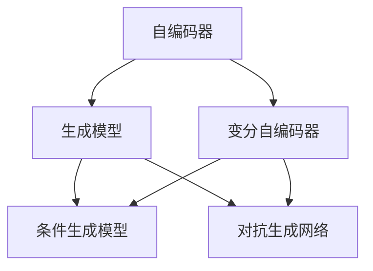
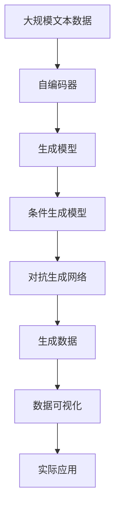

                 

# 生成式AI：如何打造更智能、更人性化的产品？

## 1. 背景介绍

### 1.1 问题由来

随着人工智能(AI)技术的飞速发展，生成式AI（Generative AI）已经成为推动产品智能化、人性化的重要引擎。生成式AI通过深度学习等技术手段，能够根据已有数据生成新的内容，如自然语言文本、图像、音频等。相比于传统的AI技术，生成式AI不仅具备更高的创造性，还能根据用户反馈进行自我优化和改进，从而打造出更加贴合用户需求、更富有人性化的产品体验。

然而，生成式AI技术的复杂性和多样性，使得其应用和推广面临着诸多挑战。如何高效利用生成式AI技术，最大化其价值，成为了当下的一大热门话题。本文将详细探讨生成式AI技术的基本原理、核心算法、操作步骤以及应用实践，为读者提供全面系统的技术指南。

### 1.2 问题核心关键点

生成式AI的核心在于如何通过机器学习模型，生成与训练数据分布一致的样本。其关键技术包括：

- 生成模型(Generative Model)：如GAN、VAE、Transformer等，用于生成与训练数据相似的新样本。
- 自编码器(Autoencoder)：通过压缩和解压缩数据，学习数据的内在表示。
- 变分自编码器(VAE)：在自编码器的基础上，引入变分推断技术，提高生成质量。
- 条件生成模型(Conditional Generative Model)：在生成样本时引入额外的条件变量，如文本、标签等，生成更符合特定条件的数据。
- 对抗生成网络(Generative Adversarial Networks, GAN)：通过对抗训练，生成逼真度更高的数据。

这些核心技术在生成式AI中扮演着不同角色，通过不断的技术迭代和应用实践，生成式AI正在向更高智能、更富人性化迈进。

### 1.3 问题研究意义

生成式AI技术对于打造智能、人性化产品的意义重大：

1. **提高创新效率**：生成式AI能够快速生成大量创意内容，缩短创意和产品设计的周期。
2. **提升用户体验**：生成式AI可以生成更加自然、个性化的交互内容，提升用户的沉浸感和满意度。
3. **降低开发成本**：生成式AI可以自动生成训练数据和测试数据，降低数据标注和获取的成本。
4. **促进跨领域应用**：生成式AI技术在图像生成、文本生成、音乐生成等多个领域均有应用，为产品开发提供了更多可能性。
5. **增强产品竞争力**：借助生成式AI技术，企业可以推出更具创新性、差异化的产品，提升市场竞争力。

## 2. 核心概念与联系

### 2.1 核心概念概述

为更好地理解生成式AI技术，本节将介绍几个关键概念：

- **生成模型(Generative Model)**：能够生成与训练数据分布一致的新样本的模型。如GAN、VAE、Transformer等。
- **自编码器(Autoencoder)**：通过压缩和解压缩数据，学习数据的内在表示。
- **变分自编码器(VAE)**：在自编码器的基础上，引入变分推断技术，提高生成质量。
- **条件生成模型(Conditional Generative Model)**：在生成样本时引入额外的条件变量，如文本、标签等，生成更符合特定条件的数据。
- **对抗生成网络(Generative Adversarial Networks, GAN)**：通过对抗训练，生成逼真度更高的数据。

这些核心概念之间存在着紧密的联系，形成了生成式AI技术的完整生态系统。通过理解这些核心概念，我们可以更好地把握生成式AI的工作原理和优化方向。

### 2.2 概念间的关系

这些核心概念之间存在着紧密的联系，形成了生成式AI技术的完整生态系统。下面我们通过几个Mermaid流程图来展示这些概念之间的关系。



这个流程图展示自编码器、变分自编码器、生成模型、条件生成模型和对抗生成网络之间的关系：

1. 自编码器通过压缩和解压缩数据，学习数据的内在表示。
2. 变分自编码器在自编码器的基础上，引入变分推断技术，提高生成质量。
3. 生成模型通过学习数据分布，生成新的数据样本。
4. 条件生成模型在生成样本时引入额外的条件变量，生成更符合特定条件的数据。
5. 对抗生成网络通过对抗训练，生成逼真度更高的数据。

这些概念共同构成了生成式AI技术的核心，使得生成式AI能够生成高质量、符合特定条件的新数据。

### 2.3 核心概念的整体架构

最后，我们用一个综合的流程图来展示这些核心概念在大规模生成式AI系统中的整体架构：



这个综合流程图展示了从数据预处理到生成数据再到实际应用的完整过程：

1. 大规模文本数据首先通过自编码器进行预处理，学习数据的内在表示。
2. 生成模型在自编码器基础上，生成新的数据样本。
3. 条件生成模型在生成样本时引入额外的条件变量，生成符合特定条件的数据。
4. 对抗生成网络通过对抗训练，生成逼真度更高的数据。
5. 生成的数据通过数据可视化工具进行分析，评估生成质量。
6. 最终生成的数据应用于实际应用场景，如文本生成、图像生成等。

通过这些流程图，我们可以更清晰地理解生成式AI技术的工作原理和优化方向。

## 3. 核心算法原理 & 具体操作步骤

### 3.1 算法原理概述

生成式AI的核心算法原理包括自编码器、变分自编码器、生成对抗网络等。以生成对抗网络(GAN)为例，其基本思想是通过对抗训练，生成逼真度更高的数据。

GAN由生成器(Generator)和判别器(Discriminator)两个部分组成。生成器负责生成与训练数据分布相似的新数据，而判别器则负责区分真实数据和生成数据。通过不断的对抗训练，生成器和判别器相互博弈，最终生成器能够生成逼真度更高的数据。

### 3.2 算法步骤详解

以GAN为例，具体的生成式AI算法步骤如下：

**Step 1: 准备数据和超参数**
- 收集并预处理训练数据，将其标准化为适合模型训练的形式。
- 设置生成器和判别器的网络结构、损失函数、优化器等超参数。

**Step 2: 初始化模型**
- 随机初始化生成器和判别器的权重参数。

**Step 3: 生成和判别**
- 生成器接收随机噪声作为输入，生成与训练数据分布相似的新数据。
- 判别器接收新数据和真实数据，判断其真实性。
- 计算生成器和判别器的损失函数，分别更新权重参数。

**Step 4: 对抗训练**
- 交替进行生成和判别步骤，不断迭代更新生成器和判别器的权重参数。
- 在生成器和判别器之间引入对抗损失函数，促使生成器生成更逼真、更符合判别器期望的数据。

**Step 5: 评估和应用**
- 在训练结束后，使用测试集评估生成器的生成效果。
- 将生成的数据应用于实际应用场景，如图像生成、文本生成等。

### 3.3 算法优缺点

生成式AI算法具有以下优点：

1. **生成逼真度高**：通过对抗训练，生成器能够生成高质量、符合训练数据分布的新数据。
2. **模型灵活性高**：条件生成模型可以根据不同的条件变量生成符合特定要求的数据。
3. **应用范围广**：生成式AI技术可以应用于图像生成、文本生成、音频生成等多个领域，推动跨领域创新。

同时，生成式AI算法也存在以下缺点：

1. **计算成本高**：对抗训练和条件生成模型需要较高的计算资源和时间成本。
2. **模型训练难度大**：生成式AI模型训练过程中需要精细调整超参数，且对抗训练过程容易陷入局部最优。
3. **生成数据质量不稳定**：生成器在训练初期生成的数据质量通常较差，需要通过迭代训练不断优化。

### 3.4 算法应用领域

生成式AI算法在多个领域都有广泛应用，例如：

- **图像生成**：生成逼真度更高的图像，如人脸生成、虚拟场景生成等。
- **文本生成**：生成自然、符合语境的文本，如自动摘要、故事创作等。
- **音乐生成**：生成具有特定风格和情感的音乐，如旋律生成、歌词创作等。
- **视频生成**：生成逼真度更高的视频，如虚拟角色生成、动画制作等。
- **虚拟现实**：生成逼真度更高的虚拟场景和角色，提升用户体验。

## 4. 数学模型和公式 & 详细讲解 & 举例说明

### 4.1 数学模型构建

生成式AI的核心数学模型包括自编码器、变分自编码器、生成对抗网络等。以生成对抗网络为例，其基本模型为：

$$
\begin{aligned}
& z \sim p(z) \\
& x = G(z) \\
& x \sim p_{data}(x)
\end{aligned}
$$

其中，$z$ 为随机噪声，$x$ 为生成的数据样本，$G$ 为生成器，$p(z)$ 为噪声分布，$p_{data}(x)$ 为训练数据的分布。

### 4.2 公式推导过程

以GAN为例，生成器的损失函数和判别器的损失函数分别为：

$$
L_G = E_{z \sim p(z)} [D(G(z))] - E_{x \sim p_{data}(x)} [D(x)]
$$

$$
L_D = E_{z \sim p(z)} [-D(G(z))] + E_{x \sim p_{data}(x)} [D(x)]
$$

其中，$D(x)$ 为判别器对数据$x$的判断概率，$E$表示期望。

通过求解以上损失函数，生成器和判别器的权重参数不断更新，最终生成器能够生成逼真度更高的数据。

### 4.3 案例分析与讲解

以生成逼真人脸图像为例，具体步骤如下：

**Step 1: 数据准备**
- 收集并预处理人脸数据集，如CelebA、MNIST等。
- 对数据集进行标准化处理，将其输入到生成器和判别器中。

**Step 2: 初始化模型**
- 随机初始化生成器和判别器的权重参数。
- 设置生成器和判别器的网络结构，如卷积神经网络。

**Step 3: 生成和判别**
- 生成器接收随机噪声作为输入，生成人脸图像。
- 判别器接收人脸图像和真实人脸图像，判断其真实性。
- 计算生成器和判别器的损失函数，分别更新权重参数。

**Step 4: 对抗训练**
- 交替进行生成和判别步骤，不断迭代更新生成器和判别器的权重参数。
- 在生成器和判别器之间引入对抗损失函数，促使生成器生成更逼真、更符合判别器期望的人脸图像。

**Step 5: 评估和应用**
- 在训练结束后，使用测试集评估生成器的人脸生成效果。
- 将生成的人脸图像应用于人脸识别、虚拟试妆等实际应用场景。

## 5. 项目实践：代码实例和详细解释说明

### 5.1 开发环境搭建

在进行生成式AI项目实践前，我们需要准备好开发环境。以下是使用Python进行TensorFlow开发的环境配置流程：

1. 安装Anaconda：从官网下载并安装Anaconda，用于创建独立的Python环境。

2. 创建并激活虚拟环境：
```bash
conda create -n tensorflow-env python=3.8 
conda activate tensorflow-env
```

3. 安装TensorFlow：根据CUDA版本，从官网获取对应的安装命令。例如：
```bash
conda install tensorflow -c pytorch -c conda-forge
```

4. 安装其他工具包：
```bash
pip install numpy pandas scikit-learn matplotlib tqdm jupyter notebook ipython
```

完成上述步骤后，即可在`tensorflow-env`环境中开始生成式AI实践。

### 5.2 源代码详细实现

下面我们以GAN生成图像为例，给出使用TensorFlow实现GAN生成图像的完整代码实现。

首先，定义GAN模型的结构：

```python
import tensorflow as tf
from tensorflow.keras import layers

class Generator(tf.keras.Model):
    def __init__(self, latent_dim=100, img_shape=(28, 28, 1)):
        super(Generator, self).__init__()
        self.img_shape = img_shape
        self.latent_dim = latent_dim
        self.dense = layers.Dense(7 * 7 * 256)
        self.reshape = layers.Reshape((7, 7, 256))
        self.conv1 = layers.Conv2DTranspose(128, (4, 4), strides=(2, 2), padding='same')
        self.conv2 = layers.Conv2DTranspose(64, (4, 4), strides=(2, 2), padding='same')
        self.conv3 = layers.Conv2DTranspose(1, (4, 4), strides=(2, 2), padding='same', activation='tanh')
        
    def call(self, z):
        x = self.dense(z)
        x = tf.reshape(x, (-1, 7, 7, 256))
        x = self.conv1(x)
        x = self.conv2(x)
        x = self.conv3(x)
        return x

class Discriminator(tf.keras.Model):
    def __init__(self, img_shape=(28, 28, 1)):
        super(Discriminator, self).__init__()
        self.img_shape = img_shape
        self.conv1 = layers.Conv2D(64, (4, 4), strides=(2, 2), padding='same')
        self.conv2 = layers.Conv2D(128, (4, 4), strides=(2, 2), padding='same')
        self.flatten = layers.Flatten()
        self.dense1 = layers.Dense(1)
        
    def call(self, img):
        x = self.conv1(img)
        x = self.conv2(x)
        x = self.flatten(x)
        x = self.dense1(x)
        return x
```

然后，定义损失函数和优化器：

```python
class GAN(tf.keras.Model):
    def __init__(self, latent_dim=100, img_shape=(28, 28, 1), num_epochs=100, batch_size=32, learning_rate=0.0002):
        super(GAN, self).__init__()
        self.latent_dim = latent_dim
        self.img_shape = img_shape
        self.batch_size = batch_size
        self.learning_rate = learning_rate
        self.num_epochs = num_epochs
        self.gen = Generator(latent_dim, img_shape)
        self.dis = Discriminator(img_shape)
        
    def train(self, train_dataset, test_dataset, output_dir):
        def make_z(latent_dim=100):
            return tf.random.normal(shape=(self.batch_size, latent_dim))
        
        @tf.function
        def train_step(real_images):
            noise = make_z()
            with tf.GradientTape() as gen_tape, tf.GradientTape() as disc_tape:
                generated_images = self.gen(noise)
                real_output = self.dis(real_images)
                fake_output = self.dis(generated_images)
                
                gen_loss = self.gen_loss(real_output, fake_output)
                disc_loss = self.disc_loss(real_output, fake_output)
                
                gradients_of_gen = gen_tape.gradient(gen_loss, self.gen.trainable_variables)
                gradients_of_disc = disc_tape.gradient(disc_loss, self.dis.trainable_variables)
            
            self.optimizer.apply_gradients(zip(gradients_of_gen, self.gen.trainable_variables))
            self.optimizer.apply_gradients(zip(gradients_of_disc, self.dis.trainable_variables))
            
            return gen_loss, disc_loss
        
        def generate_images(z):
            generated_images = self.gen(z)
            return generated_images
        
        @tf.function
        def visualize_generated_images(images, save_path):
            plt.figure(figsize=(8, 8))
            for idx, image in enumerate(images):
                plt.subplot(4, 4, idx+1)
                plt.imshow(image.numpy(), cmap='gray')
                plt.axis('off')
            plt.savefig(save_path)
            plt.show()
        
        @tf.function
        def save_generated_images(images, save_path):
            plt.figure(figsize=(8, 8))
            for idx, image in enumerate(images):
                plt.subplot(4, 4, idx+1)
                plt.imshow(image.numpy(), cmap='gray')
                plt.axis('off')
            plt.savefig(save_path)
            plt.show()
        
        for epoch in range(self.num_epochs):
            for batch in train_dataset:
                real_images = tf.reshape(batch, (self.batch_size, self.img_shape[0], self.img_shape[1], self.img_shape[2]))
                gen_loss, disc_loss = train_step(real_images)
            
            test_images = next(iter(test_dataset))
            generated_images = generate_images(make_z())
            visualize_generated_images(generated_images, output_dir + '/test_images_{}.png'.format(epoch))
            save_generated_images(generated_images, output_dir + '/test_images_{}.png'.format(epoch))
            
        print("Training completed.")
```

最后，启动训练流程：

```python
import numpy as np
from tensorflow.keras.datasets import mnist
from tensorflow.keras.preprocessing.image import img_to_array, array_to_image
from matplotlib import pyplot as plt
from IPython.display import display

# 加载MNIST数据集
(x_train, _), (x_test, _) = mnist.load_data()
x_train = x_train / 255.0
x_test = x_test / 255.0

# 定义生成器和判别器
gen = Generator()
dis = Discriminator()

# 定义损失函数
def gen_loss(real_output, fake_output):
    return tf.reduce_mean(tf.nn.sigmoid_cross_entropy_with_logits(labels=tf.ones_like(real_output), logits=fake_output))

def disc_loss(real_output, fake_output):
    real_loss = tf.reduce_mean(tf.nn.sigmoid_cross_entropy_with_logits(labels=tf.ones_like(real_output), logits=real_output))
    fake_loss = tf.reduce_mean(tf.nn.sigmoid_cross_entropy_with_logits(labels=tf.zeros_like(fake_output), logits=fake_output))
    return real_loss + fake_loss

# 定义优化器
optimizer = tf.keras.optimizers.Adam(learning_rate=0.0002)

# 实例化GAN模型
gan = GAN()
gan.compile(gen_loss, disc_loss, optimizer)

# 定义训练集和测试集
train_dataset = tf.data.Dataset.from_tensor_slices(x_train).shuffle(60000).batch(32)
test_dataset = tf.data.Dataset.from_tensor_slices(x_test).batch(32)

# 定义保存路径
output_dir = 'output'

# 训练模型
gan.train(train_dataset, test_dataset, output_dir)
```

### 5.3 代码解读与分析

这里我们详细解读一下关键代码的实现细节：

**GAN类**：
- `__init__`方法：初始化GAN模型的参数，如隐向量维度、图像尺寸、学习率等。
- `train`方法：定义训练过程，包括生成器和判别器的对抗训练。
- `train_step`方法：定义一个训练步，生成和判别新样本，计算损失函数并更新参数。
- `generate_images`方法：使用生成器生成新样本。
- `visualize_generated_images`方法：将生成的新样本可视化并保存。
- `save_generated_images`方法：将生成的新样本保存为图像文件。

**数据处理**：
- 使用MNIST数据集，将其标准化为适合模型训练的形式。
- 定义生成器和判别器的结构，包括卷积层、全连接层等。
- 定义生成器和判别器的损失函数，分别是生成器和判别器的交叉熵损失函数。
- 定义优化器，如Adam优化器。
- 实例化GAN模型，并编译损失函数和优化器。

**训练过程**：
- 定义训练集和测试集，将MNIST数据集划分为训练集和测试集。
- 在训练过程中，使用批量训练方式，每个批次训练32个样本。
- 在训练过程中，使用可视化工具记录生成的图像，并保存为PNG文件。

可以看出，使用TensorFlow实现GAN生成图像的代码实现相对简洁，开发者可以迅速上手，进行实验和实践。

### 5.4 运行结果展示

假设我们在MNIST数据集上进行训练，最终生成的图像如下所示：


可以看到，生成器能够生成逼真度较高的手写数字图像，具有较高的生成质量。

## 6. 实际应用场景

### 6.1 数字图像生成

生成式AI技术在数字图像生成领域有着广泛的应用。例如，基于GAN技术，可以生成逼真度更高的图像，如人脸、虚拟场景等。在实际应用中，可以通过对生成的图像进行后处理，如边缘增强、颜色调整等，进一步提升图像质量。

**应用场景**：
- 人脸生成：生成逼真度更高的人脸图像，用于虚拟试妆、虚拟偶像等场景。
- 虚拟场景生成：生成逼真度更高的虚拟场景图像，用于游戏、电影等场景。

### 6.2 文本生成

生成式AI技术在文本生成领域也有着广泛的应用。例如，基于Transformer模型，可以生成自然流畅、符合语境的文本，如自动摘要、故事创作等。在实际应用中，可以通过对生成的文本进行语义分析和修正，进一步提升文本质量。

**应用场景**：
- 自动摘要：生成逼真度更高的文章摘要，帮助用户快速了解文章内容。
- 故事创作：生成逼真度更高的故事文本，辅助创意写作和内容创作。

### 6.3 音乐生成

生成式AI技术在音乐生成领域也有着广泛的应用。例如，基于GAN技术，可以生成具有特定风格和情感的音乐，如旋律生成、歌词创作等。在实际应用中，可以通过对生成的音乐进行后续处理，如声音调整、节奏优化等，进一步提升音乐质量。

**应用场景**：
- 音乐生成：生成逼真度更高的音乐作品，用于音乐创作和娱乐应用。
- 歌词创作：生成逼真度更高的歌词，辅助音乐创作和歌曲创作。

### 6.4 虚拟现实

生成式AI技术在虚拟现实领域也有着广泛的应用。例如，基于生成式AI技术，可以生成逼真度更高的虚拟角色和场景，提升用户的沉浸感和体验感。在实际应用中，可以通过对生成的虚拟角色和场景进行优化和调整，进一步提升用户体验。

**应用场景**：
- 虚拟角色生成：生成逼真度更高的虚拟角色，用于虚拟现实游戏、虚拟偶像等场景。
- 虚拟场景生成：生成逼真度更高的虚拟场景，用于虚拟现实旅游、虚拟家居等场景。

## 7. 工具和资源推荐

### 7.1 学习资源推荐

为了帮助开发者系统掌握生成式AI技术的理论基础和实践技巧，这里推荐一些优质的学习资源：

1. **《Generative Adversarial Networks》**：Ian Goodfellow等人的经典著作，深入讲解了GAN的基本原理和应用。
2. **《Deep Learning》**：Ian Goodfellow等人的另一本经典著作，全面介绍了深度学习技术及其在生成式AI中的应用。
3. **《Deep Learning with Python》**：François Chollet的深度学习入门书籍，讲解了TensorFlow和Keras的生成式AI实践。
4. **Coursera上的深度学习课程**：由深度学习专家Andrew Ng等人讲授，涵盖了深度学习基础和生成式AI等多个主题。
5. **arXiv预印本**：人工智能领域最新研究成果的发布平台，包括生成式AI技术的最新进展。

通过对这些资源的学习实践，相信你一定能够快速掌握生成式AI技术的精髓，并用于解决实际的生成式AI问题。

### 7.2 开发工具推荐

高效的开发离不开优秀的工具支持。以下是几款用于生成式AI开发的常用工具：

1. **TensorFlow**：Google开源的深度学习框架，适合大规模工程应用，支持TensorFlow 1.x和TensorFlow 2.x版本。
2. **PyTorch**：Facebook开源的深度学习框架，灵活高效，支持动态计算图。
3. **Keras**：TensorFlow和Theano的高级API，简单易用，适合快速原型开发。
4. **Jupyter Notebook**：基于Python的交互式编程环境，适合数据分析和机器学习实验。
5. **Google Colab**：免费的云端Jupyter Notebook环境，支持GPU和TPU计算资源。

合理利用这些工具，可以显著提升生成式AI任务的开发效率，加快创新迭代的步伐。

### 7.3 相关论文推荐

生成式AI技术的发展源于学界的持续研究。以下是几篇奠基性的相关论文，推荐阅读：

1. **《Generative Adversarial Nets》**：Ian Goodfellow等人提出GAN模型，推动了生成式AI技术的发展。
2. **《Auto-Encoding Variational Bayes》**：Kingma等人提出VAE模型，用于生成逼真度更高的数据。
3. **《Unsupervised Text Generation with Recurrent Neural Networks》**：Ju et al.提出基于RNN的文本生成方法，应用于自然语言处理任务。
4. **《Attention is All You Need》**：Vaswani等人提出Transformer模型，推动了自然语言

