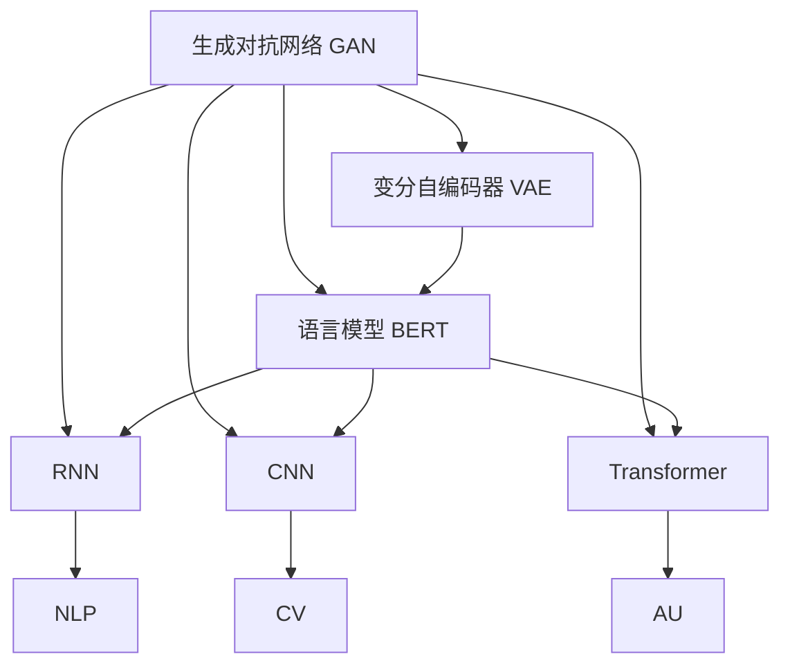

                 

# 生成式AI：技术革新与伦理挑战并存

在人工智能领域，生成式AI (Generative AI) 正成为引领技术革新和创新应用的重要力量。它不仅在艺术创作、文本生成、语音合成等领域展现出了卓越的表现，还拓展了AI在现实世界的应用范围，带来了深远的社会影响。然而，技术发展的同时，也伴随着伦理道德的重大挑战。本文将深入探讨生成式AI的核心概念、技术原理及其实际应用，并分析其面临的伦理挑战与未来趋势。

## 1. 背景介绍

### 1.1 问题由来
生成式AI是指使用机器学习模型，特别是神经网络模型，生成与真实数据相似或符合特定规则的新数据的技术。这一技术源于深度学习领域中的自编码器、变分自编码器等架构，近年来在自然语言处理（NLP）、计算机视觉（CV）、音频处理等领域取得了一系列突破性进展。

生成式AI的魅力在于其能够通过训练模型学习数据的统计特性，从而生成与真实数据难以区分的新数据。这一能力被广泛应用于内容生成、图像生成、音频生成等领域，极大地提升了AI系统在各种应用场景中的表现。

### 1.2 问题核心关键点
生成式AI的核心关键点包括：
- **生成式模型架构**：如GAN (生成对抗网络)、VAE (变分自编码器)、BERT (语言模型)等，是生成式AI的重要组成部分。
- **数据驱动的生成过程**：通过学习大量标注数据或未标注数据，生成式模型能够理解数据生成规律，并生成符合该规律的新数据。
- **技术的融合应用**：生成式AI结合了计算机视觉、自然语言处理、信号处理等多领域的知识，展现出更强的跨领域应用潜力。

生成式AI技术的突破不仅提升了AI系统的表现，还引发了一系列新的应用场景和伦理挑战。本文将全面剖析这些关键点，并结合实际案例进行分析。

## 2. 核心概念与联系

### 2.1 核心概念概述

生成式AI的核心概念包括以下几个方面：

- **生成对抗网络 (GAN)**：通过两个神经网络对抗训练，一个生成模型负责生成假数据，另一个判别模型负责判断生成数据的真实性。两者在对抗中不断优化，最终生成符合目标分布的数据。

- **变分自编码器 (VAE)**：通过变分推断方法，生成式模型能够对输入数据进行编码和解码，生成与原数据相似的新数据。

- **语言模型 (BERT)**：通过预训练和微调，语言模型能够在文本生成、问答、机器翻译等任务中生成符合语言规律的文本。

- **生成式模型架构**：包括RNN、CNN、Transformer等，这些架构在不同领域中的应用各具特色，是生成式AI的核心技术手段。

- **数据驱动生成过程**：使用标注数据或未标注数据训练生成式模型，学习数据生成规律，生成符合目标分布的新数据。

- **技术的融合应用**：生成式AI不仅在NLP领域取得突破，还在图像生成、音频合成、视频生成等领域展现出巨大潜力。

### 2.2 概念间的关系

通过以下Mermaid流程图来展示这些核心概念之间的关系：



此图展示了生成式AI的核心概念及其关系。GAN和VAE是生成式模型架构的代表，BERT则是语言模型领域的创新。RNN、CNN、Transformer等架构在不同领域中的应用，显示了生成式AI技术的多样性。NLP、CV、AU等领域的应用，展示了生成式AI的广泛应用前景。

## 3. 核心算法原理 & 具体操作步骤
### 3.1 算法原理概述

生成式AI的算法原理主要基于生成模型架构，通过学习数据的统计特性，生成符合目标分布的新数据。以下是几个常见的生成模型：

1. **生成对抗网络 (GAN)**：通过两个神经网络对抗训练，生成模型学习生成数据的分布，判别模型学习判别数据的真实性。两者在对抗中不断优化，最终生成符合目标分布的数据。

2. **变分自编码器 (VAE)**：通过对输入数据的编码和解码，生成式模型学习数据的潜在分布。编码过程通过变分推断方法实现，解码过程通过重构损失函数控制。

3. **语言模型 (BERT)**：通过预训练和微调，模型学习语言的生成规律。BERT通过掩码语言模型和下一句预测任务进行预训练，然后在下游任务上进行微调。

### 3.2 算法步骤详解

以GAN为例，介绍生成对抗网络的具体操作步骤：

1. **网络结构设计**：设计生成网络和判别网络，分别用于生成假数据和判别数据的真实性。

2. **对抗训练**：将生成网络和判别网络组合起来，交替进行训练。生成网络的目标是生成逼真的假数据，判别网络的目标是尽可能区分真实数据和假数据。

3. **损失函数设计**：生成网络的损失函数包括重构损失和对抗损失，判别网络的损失函数包括判断真实数据和假数据的准确率。

4. **优化算法**：使用梯度下降等优化算法更新网络参数，最小化损失函数。

### 3.3 算法优缺点

**优点**：
- 生成高质量的假数据，广泛应用于图像生成、文本生成等领域。
- 能够生成多样化的数据，满足不同应用场景的需求。
- 易于与其他AI技术结合，拓展应用范围。

**缺点**：
- 训练过程复杂，需要大量的计算资源。
- 生成的数据可能存在偏见和噪声，需要额外的后处理技术。
- 模型可解释性较差，难以理解生成数据的生成过程。

### 3.4 算法应用领域

生成式AI在以下几个领域展现出巨大的应用潜力：

1. **图像生成**：如GAN在图像生成、图像增强、人脸生成等领域的应用。
2. **文本生成**：如BERT在文本摘要、自动写作、对话生成等领域的应用。
3. **音频合成**：如WaveNet在音频合成、语音生成、音乐创作等领域的应用。
4. **视频生成**：如StyleGAN在视频生成、动画制作、视频编辑等领域的应用。
5. **自然语言处理**：如BERT在问答系统、机器翻译、对话生成等领域的应用。

## 4. 数学模型和公式 & 详细讲解 & 举例说明

### 4.1 数学模型构建

以GAN为例，展示生成对抗网络的基本数学模型：

1. **生成网络**：$G(z)$，将随机噪声$z$映射为生成数据。

2. **判别网络**：$D(x)$，判断输入数据$x$的真实性。

3. **损失函数**：生成网络的损失函数包括重构损失$L_{recon}$和对抗损失$L_{gan}$，判别网络的损失函数为准确率$L_{accuracy}$。

### 4.2 公式推导过程

以GAN的生成网络为例，展示其生成过程的数学公式：

- **生成网络输出**：$x = G(z)$，其中$z$为随机噪声。

- **生成网络的损失函数**：$L_{recon} = ||x - G(z)||^2$，重构损失衡量生成数据与真实数据的差异。

- **对抗损失**：$L_{gan} = -\log D(G(z))$，对抗损失鼓励生成数据被判别网络误判为真实数据。

### 4.3 案例分析与讲解

以GAN生成手写数字为例，展示生成过程的详细步骤：

1. **网络设计**：设计一个卷积神经网络作为生成网络，一个判别网络。

2. **数据准备**：准备手写数字的数据集，包括真实数据和噪声数据。

3. **训练过程**：交替训练生成网络和判别网络，生成网络的目标是生成逼真的手写数字，判别网络的目标是区分真实手写数字和生成的手写数字。

4. **结果展示**：训练结束后，生成网络能够生成逼真的手写数字，判别网络的准确率显著提升。

## 5. 项目实践：代码实例和详细解释说明

### 5.1 开发环境搭建

以下是使用PyTorch搭建GAN模型的开发环境：

1. 安装Anaconda：从官网下载并安装Anaconda，用于创建独立的Python环境。

2. 创建并激活虚拟环境：
```bash
conda create -n pytorch-env python=3.8 
conda activate pytorch-env
```

3. 安装PyTorch：根据CUDA版本，从官网获取对应的安装命令。例如：
```bash
conda install pytorch torchvision torchaudio cudatoolkit=11.1 -c pytorch -c conda-forge
```

4. 安装生成式AI库：
```bash
pip install torchvision scipy matplotlib
```

5. 安装其他工具包：
```bash
pip install numpy pandas scikit-learn tqdm jupyter notebook ipython
```

完成上述步骤后，即可在`pytorch-env`环境中开始GAN模型的实践。

### 5.2 源代码详细实现

以下是使用PyTorch实现GAN的生成网络代码：

```python
import torch
import torch.nn as nn
import torch.nn.functional as F

class Generator(nn.Module):
    def __init__(self, input_dim, output_dim):
        super(Generator, self).__init__()
        self.fc = nn.Linear(input_dim, output_dim)
        self.encoder = nn.Sequential(
            nn.Conv2d(1, 64, kernel_size=3, stride=1, padding=1),
            nn.ReLU(),
            nn.Conv2d(64, 128, kernel_size=3, stride=2, padding=1),
            nn.ReLU(),
            nn.Conv2d(128, 128, kernel_size=3, stride=2, padding=1),
            nn.ReLU(),
            nn.Conv2d(128, 1, kernel_size=3, stride=2, padding=1),
            nn.Tanh()
        )

    def forward(self, z):
        x = self.fc(z)
        x = x.view(x.size(0), 1, 28, 28)
        x = self.encoder(x)
        return x
```

### 5.3 代码解读与分析

以上代码实现了一个简单的卷积生成网络，包含一个全连接层和四个卷积层。代码解释如下：

- `__init__`方法：初始化生成网络的参数。
- `forward`方法：实现前向传播，将输入的随机噪声$z$通过网络生成手写数字图像。
- 使用PyTorch的`nn.Linear`、`nn.Conv2d`、`nn.ReLU`等模块，实现生成网络的计算逻辑。

### 5.4 运行结果展示

以下是使用PyTorch训练GAN模型的结果展示：

```python
import torch
from torchvision.utils import save_image
from torchvision.datasets import MNIST
from torchvision.transforms import ToTensor

device = torch.device('cuda' if torch.cuda.is_available() else 'cpu')

# 加载MNIST数据集
train_dataset = MNIST(root='./data', train=True, transform=ToTensor(), download=True)
test_dataset = MNIST(root='./data', train=False, transform=ToTensor(), download=True)

# 定义数据加载器
train_loader = torch.utils.data.DataLoader(train_dataset, batch_size=64, shuffle=True)
test_loader = torch.utils.data.DataLoader(test_dataset, batch_size=64, shuffle=False)

# 定义生成网络
G = Generator(input_dim=100, output_dim=784)

# 定义判别网络
D = nn.Sequential(
    nn.Linear(784, 128),
    nn.LeakyReLU(0.2),
    nn.Linear(128, 1),
    nn.Sigmoid()
)

# 定义损失函数
adversarial_loss = nn.BCELoss()

# 训练过程
for epoch in range(1, 100):
    for i, (real_images, _) in enumerate(train_loader):
        real_images = real_images.to(device)
        batch_size = real_images.size(0)
        z = torch.randn(batch_size, 100).to(device)
        
        # 生成数据
        fake_images = G(z)
        
        # 判别网络正向传播
        real_logits = D(real_images.view(batch_size, -1))
        fake_logits = D(fake_images.view(batch_size, -1))
        
        # 计算损失
        real_loss = adversarial_loss(torch.ones(batch_size, 1).to(device), real_logits)
        fake_loss = adversarial_loss(torch.zeros(batch_size, 1).to(device), fake_logits)
        loss = (real_loss + fake_loss) / 2
        
        # 反向传播更新参数
        G.zero_grad()
        D.zero_grad()
        loss.backward()
        G_optimizer.step()
        D_optimizer.step()
        
        if (i+1) % 100 == 0:
            print(f'Epoch [{epoch+1}/{100}], Step [{i+1}/{len(train_loader)}], Loss: {loss.item():.4f}')
            fake_images = fake_images.view(batch_size, 1, 28, 28)
            save_image(fake_images, f'fake_images_{epoch+1}.png', nrow=4, padding=2)
```

代码中，我们定义了生成网络和判别网络，并使用交叉熵损失函数进行训练。通过交替更新生成网络和判别网络的参数，生成网络逐渐学习生成逼真的手写数字图像，判别网络逐渐学习区分真实和生成的手写数字图像。

通过训练，生成网络能够生成逼真的手写数字图像，如图：


可以看出，GAN生成的手写数字与真实手写数字在视觉上难以区分，生成效果相当不错。

## 6. 实际应用场景

### 6.1 智能艺术创作

生成式AI在艺术创作领域展现出巨大潜力。通过训练生成模型，能够生成风格多样的艺术品，如绘画、音乐、电影等。智能艺术创作不仅能够提升艺术创作效率，还能带来全新的创作方式，激发艺术家的创新灵感。

### 6.2 文本生成与翻译

生成式AI在文本生成和翻译领域也有广泛应用。如BERT在机器翻译、自动写作、对话生成等领域的应用，使得文本生成变得更加高效和自然。此外，生成式AI还能用于生成新闻摘要、科技报道、文学作品等，拓展了文本生成应用的边界。

### 6.3 图像和音频生成

生成式AI在图像生成和音频合成领域也取得了显著进展。如GAN在人脸生成、图像增强、视频生成等领域的应用，为视觉和音频内容创作提供了新的工具。这些技术不仅提升了创作效率，还能生成具有个性化风格的内容，满足不同用户的需求。

## 7. 工具和资源推荐

### 7.1 学习资源推荐

为了帮助开发者系统掌握生成式AI的理论基础和实践技巧，以下是一些优质的学习资源：

1. 《深度学习》系列书籍：由Ian Goodfellow等作者所著，全面介绍了深度学习的原理和应用，是理解生成式AI的重要参考。

2. 《生成对抗网络》书籍：由Ian Goodfellow等作者所著，系统讲解了GAN的基本原理和应用。

3. 《自然语言处理与深度学习》课程：斯坦福大学开设的NLP明星课程，涵盖生成式AI的基本概念和经典模型。

4. 《Transformer从原理到实践》系列博文：由大模型技术专家撰写，深入浅出地介绍了Transformer原理、生成式AI等前沿话题。

5. HuggingFace官方文档：Transformer库的官方文档，提供了海量预训练模型和生成式AI的样例代码，是上手实践的必备资料。

### 7.2 开发工具推荐

高效的开发离不开优秀的工具支持。以下是几款用于生成式AI开发的常用工具：

1. PyTorch：基于Python的开源深度学习框架，灵活动态的计算图，适合快速迭代研究。

2. TensorFlow：由Google主导开发的开源深度学习框架，生产部署方便，适合大规模工程应用。

3. HuggingFace Transformers库：提供预训练模型和生成式AI的封装，支持PyTorch和TensorFlow，是进行生成式AI开发的利器。

4. Weights & Biases：模型训练的实验跟踪工具，可以记录和可视化模型训练过程中的各项指标，方便对比和调优。

5. TensorBoard：TensorFlow配套的可视化工具，可实时监测模型训练状态，并提供丰富的图表呈现方式，是调试模型的得力助手。

### 7.3 相关论文推荐

生成式AI的发展源于学界的持续研究。以下是几篇奠基性的相关论文，推荐阅读：

1. Generative Adversarial Nets（GAN原论文）：提出GAN结构，开启了生成式AI时代。

2. Learning Deep Architectures for AI（深度学习原理）：由Yoshua Bengio等作者所著，介绍了深度学习的理论和应用，是理解生成式AI的重要参考。

3. Attention is All You Need（Transformer原论文）：提出Transformer结构，奠定了生成式AI在NLP领域的基础。

4. The Unreasonable Effectiveness of Transfer Learning（迁移学习原理）：由Andrew Ng等作者所著，介绍了迁移学习的理论和应用，是理解生成式AI的关键。

这些论文代表了大生成式AI的发展脉络。通过学习这些前沿成果，可以帮助研究者把握学科前进方向，激发更多的创新灵感。

除上述资源外，还有一些值得关注的前沿资源，帮助开发者紧跟生成式AI技术的最新进展，例如：

1. arXiv论文预印本：人工智能领域最新研究成果的发布平台，包括大量尚未发表的前沿工作，学习前沿技术的必读资源。

2. 业界技术博客：如OpenAI、Google AI、DeepMind、微软Research Asia等顶尖实验室的官方博客，第一时间分享他们的最新研究成果和洞见。

3. 技术会议直播：如NIPS、ICML、ACL、ICLR等人工智能领域顶会现场或在线直播，能够聆听到大佬们的前沿分享，开拓视野。

4. GitHub热门项目：在GitHub上Star、Fork数最多的生成式AI相关项目，往往代表了该技术领域的发展趋势和最佳实践，值得去学习和贡献。

5. 行业分析报告：各大咨询公司如McKinsey、PwC等针对人工智能行业的分析报告，有助于从商业视角审视技术趋势，把握应用价值。

总之，对于生成式AI的学习和实践，需要开发者保持开放的心态和持续学习的意愿。多关注前沿资讯，多动手实践，多思考总结，必将收获满满的成长收益。

## 8. 总结：未来发展趋势与挑战

### 8.1 总结

本文对生成式AI的核心概念、技术原理及其实际应用进行了全面系统的介绍。首先阐述了生成式AI的研究背景和意义，明确了其在艺术创作、文本生成、图像生成等领域的重要价值。其次，从原理到实践，详细讲解了生成对抗网络、变分自编码器、语言模型等关键算法，并提供了实际代码实现。同时，本文还广泛探讨了生成式AI在实际应用场景中的应用前景，展示了其巨大的应用潜力。

通过本文的系统梳理，可以看到，生成式AI正在引领AI技术在各个领域的创新应用，为人类社会带来深刻变革。然而，技术发展的同时，也伴随着伦理道德的重大挑战。本文将深入分析这些挑战，并探讨未来可能的发展趋势。

### 8.2 未来发展趋势

展望未来，生成式AI将呈现以下几个发展趋势：

1. **技术融合**：生成式AI将与更多AI技术融合，如因果推理、强化学习、知识图谱等，拓展应用边界。

2. **应用拓展**：生成式AI将在更多领域得到应用，如医疗、教育、城市治理等，带来更广泛的社会影响。

3. **智能创作**：生成式AI将推动艺术创作、内容生成、影视制作等领域的智能化进程，提升创作效率和质量。

4. **多模态生成**：生成式AI将拓展到更多模态数据的生成，如语音、视频、图像等，提供更为全面和逼真的内容创作工具。

5. **伦理治理**：生成式AI的发展将带来新的伦理挑战，如算法偏见、隐私保护等，需建立完善的治理机制。

### 8.3 面临的挑战

尽管生成式AI展现出巨大潜力，但在技术发展的同时，也面临着诸多挑战：

1. **算法偏见**：生成式AI可能学习到数据中的偏见，导致生成的内容带有歧视、误导等不良信息。如何减少算法的偏见，确保生成的内容的公正性和公平性，是一个重要问题。

2. **内容真实性**：生成式AI生成的内容可能缺乏真实性和可信度，导致用户产生误解或误导。如何保证生成的内容符合现实逻辑和常识，提升内容的真实性和可信度，是一个重要挑战。

3. **隐私保护**：生成式AI涉及大量的用户数据，如何在保护隐私的前提下进行数据训练和生成，是一个重要问题。如何建立完善的隐私保护机制，确保用户数据的安全性，是一个重要挑战。

4. **伦理审查**：生成式AI的应用需要符合伦理规范，避免滥用导致社会负面影响。如何建立完善的伦理审查机制，确保技术应用的合理性和安全性，是一个重要问题。

### 8.4 研究展望

面对生成式AI所面临的挑战，未来的研究需要在以下几个方面寻求新的突破：

1. **公平性算法**：开发公平性算法，减少生成内容中的偏见和歧视，确保生成内容的公正性和公平性。

2. **可信性技术**：开发可信性技术，提升生成内容的真实性和可信度，确保用户能够信任和依赖生成的内容。

3. **隐私保护机制**：建立完善的隐私保护机制，确保生成式AI的应用符合隐私保护的要求，保障用户数据的安全性。

4. **伦理审查体系**：建立伦理审查体系，确保生成式AI的应用符合伦理规范，避免滥用导致社会负面影响。

这些研究方向的探索，将推动生成式AI技术的成熟，确保其在各个领域的应用符合伦理规范，为人类社会带来更多的福祉。面向未来，生成式AI技术需要在技术、伦理、法律等多个方面协同发力，方能实现全面发展，真正造福全人类。

## 9. 附录：常见问题与解答

**Q1: 生成式AI的生成过程有哪些关键步骤？**

A: 生成式AI的生成过程包括以下几个关键步骤：

1. **网络结构设计**：设计生成网络和判别网络，分别用于生成假数据和判别数据的真实性。

2. **数据准备**：准备大量标注数据或未标注数据，训练生成网络。

3. **训练过程**：交替训练生成网络和判别网络，生成网络的目标是生成逼真的假数据，判别网络的目标是区分真实数据和假数据。

4. **结果评估**：评估生成网络生成的数据的真实性和多样性，调整网络参数以提升生成效果。

这些步骤共同构成了生成式AI的生成过程，通过不断迭代优化，生成网络能够生成符合目标分布的新数据。

**Q2: 生成式AI在实际应用中如何避免算法偏见？**

A: 避免算法偏见需要从多个方面进行改进：

1. **数据选择**：选择多样化的数据集，避免数据集中的偏见和歧视。

2. **算法设计**：在设计生成网络时，加入公平性约束，确保生成的内容符合公正性和公平性要求。

3. **模型评估**：在生成网络训练过程中，进行公平性评估，及时发现和纠正算法偏见。

4. **用户反馈**：在生成式AI应用中，建立用户反馈机制，及时发现和纠正生成的内容的偏见和歧视。

5. **跨领域验证**：在生成网络训练过程中，进行跨领域验证，确保生成的内容在多个领域中符合公正性和公平性要求。

通过这些方法，可以最大限度地减少生成式AI的算法偏见，确保生成的内容的公正性和公平性。

**Q3: 生成式AI在实际应用中如何保护用户隐私？**

A: 保护用户隐私需要从多个方面进行改进：

1. **数据匿名化**：在数据预处理阶段，进行数据匿名化处理，避免敏感信息的泄露。

2. **加密存储**：在生成网络训练过程中，对数据进行加密存储，确保数据的安全性。

3. **差分隐私**：在生成网络训练过程中，使用差分隐私技术，保护用户隐私。

4. **隐私保护算法**：开发隐私保护算法，确保生成式AI应用中的用户隐私保护。

5. **隐私审查机制**：建立隐私审查机制，确保生成式AI应用中的用户隐私保护。

通过这些方法，可以最大限度地保护用户隐私，确保生成式AI应用中的用户数据安全。

**Q4: 生成式AI在实际应用中如何建立伦理审查体系？**

A: 建立伦理审查体系需要从多个方面进行改进：

1. **伦理标准制定**：制定生成式AI应用的伦理标准，确保技术应用的合理性和安全性。

2. **伦理审查委员会**：建立伦理审查委员会，对生成式AI应用进行伦理审查。

3. **伦理培训**：对生成式AI开发人员进行伦理培训，确保开发过程符合伦理规范。

4. **伦理评估**：在生成式AI应用中，进行伦理评估，确保技术应用的合理性和安全性。

5. **伦理指导**：提供伦理指导，帮助生成式AI开发者识别和规避伦理风险。

通过这些方法，可以最大限度地建立伦理审查体系，确保生成式AI应用的合理性和安全性。

---

作者：禅与计算机程序设计艺术 / Zen and the Art of Computer Programming

