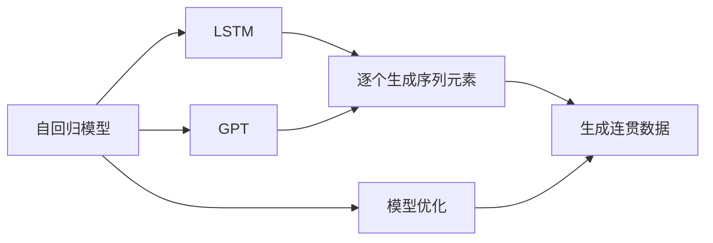
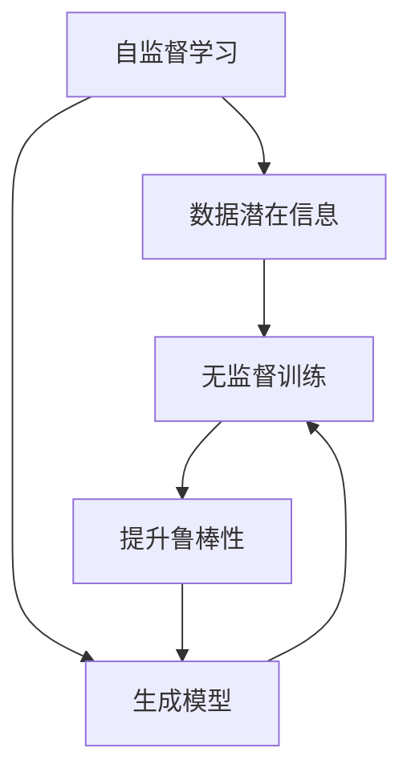
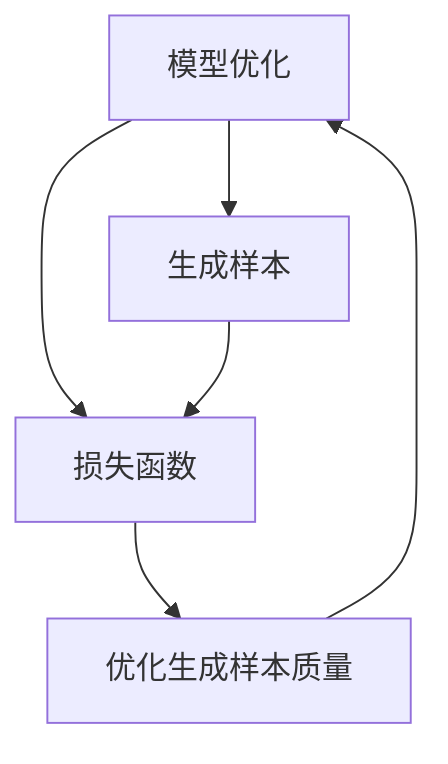
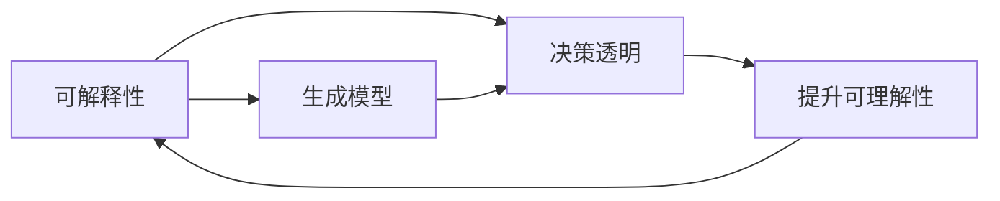

                 

# 生成式人工智能时代的到来

## 1. 背景介绍

### 1.1 问题由来
随着人工智能技术的飞速发展，特别是深度学习和生成模型的大放异彩，生成式人工智能（Generative AI）逐渐成为新一代人工智能技术的热点。相比于传统的基于数据驱动的识别和分类任务，生成式AI更加强调模型的生成能力和创造性，能够直接产生新内容，而非仅仅对现有数据进行分类或检索。

生成式AI的应用场景遍及游戏、影视、音乐、艺术创作、医疗诊断等多个领域。例如，生成式模型可以自动生成逼真的游戏角色、电影特效、音乐旋律、艺术作品，甚至能辅助医生进行病理分析和疾病预测。生成式AI的多样化应用潜力，预示着AI技术即将步入一个更为广阔的新时代。

### 1.2 问题核心关键点
生成式AI的核心在于模型的生成能力。生成式模型能够学习数据的分布，并基于这种分布产生新的样本。常用的生成式模型包括变分自编码器（VAE）、生成对抗网络（GAN）、自回归模型（如LSTM、GPT）等。

其中，生成对抗网络（GAN）因其能够产生高度逼真的图像和视频等生成内容，受到了广泛关注。GAN由生成器（Generator）和判别器（Discriminator）两部分组成，两者通过对抗训练，逐渐提高生成器生成样本的质量，同时提升判别器区分真实样本与生成样本的能力。

生成式AI的优势在于其创造性和多样性，能够生成丰富的内容形式，但同时也面临着生成样本质量、生成速度、生成模型可解释性等问题。如何高效训练生成模型，提高生成内容的质量和可解释性，是当前生成式AI领域的主要研究方向。

### 1.3 问题研究意义
生成式AI的兴起，对人工智能技术的发展有着重要的意义：

1. **创意和创新**：生成式AI的创造力可以赋能创意产业，如游戏、影视、音乐等领域，推动内容的创作和更新。
2. **数据增强**：通过生成式模型生成更多高质量的训练数据，提升模型在各种任务上的性能。
3. **自动化生成**：自动化生成技术可以减少人工成本，提高工作效率，尤其在自动化报告、文章写作、设计等领域有广泛应用。
4. **跨领域应用**：生成式AI的多样化应用能够跨多个领域融合创新，催生新的应用场景。
5. **教育和学习**：生成式AI可用于辅助教育，生成模拟实验、学习材料，提升教学质量。

## 2. 核心概念与联系

### 2.1 核心概念概述

生成式AI涉及多个关键概念，这些概念之间有紧密的联系，形成了生成式AI的核心生态系统。以下是一些主要概念的介绍：

- **生成对抗网络（GAN）**：由生成器和判别器两部分组成，通过对抗训练生成高质量的图像、视频等。
- **变分自编码器（VAE）**：通过将高维数据编码到低维空间，再解码回高维空间，生成与原始数据相似的新样本。
- **自回归模型**：如LSTM、GPT等，通过逐个生成序列中的元素，生成连贯的文本、音频等序列数据。
- **自监督学习**：利用数据的潜在信息进行无监督训练，提高生成模型的鲁棒性和泛化能力。
- **模型优化**：通过优化生成模型的损失函数，提升生成样本的质量和多样性。
- **可解释性**：提高生成模型的可解释性，使其决策过程透明、可理解。

这些概念的联系可以通过以下Mermaid流程图来展示：

```mermaid
graph TB
    A[生成对抗网络 (GAN)] --> B[生成器]
    A --> C[判别器]
    B --> D[生成高质量样本]
    C --> D
    A --> E[变分自编码器 (VAE)]
    E --> F[编码与解码]
    F --> G[生成相似样本]
    E --> H[自监督学习]
    H --> G
    A --> I[自回归模型]
    I --> J[逐个生成序列]
    J --> K[生成连贯数据]
    I --> L[模型优化]
    L --> K
    A --> M[可解释性]
    M --> N[决策透明]
    N --> K
```

这个流程图展示了生成式AI的核心概念及其之间的联系：

1. GAN通过生成器和判别器的对抗训练生成高质量样本。
2. VAE通过编码与解码生成与原始数据相似的新样本。
3. 自回归模型通过逐个生成序列中的元素，生成连贯的文本、音频等序列数据。
4. 自监督学习通过利用数据潜在信息进行无监督训练，提升生成模型的鲁棒性。
5. 模型优化通过优化生成模型的损失函数，提升生成样本的质量和多样性。
6. 可解释性通过提高生成模型的决策透明性，使其更易理解。

这些概念共同构成了生成式AI的技术体系，为其在各个应用场景中提供支持。

### 2.2 概念间的关系

生成式AI的核心概念之间存在着紧密的联系，形成了一个完整的技术体系。下面我们通过几个Mermaid流程图来展示这些概念之间的关系。

#### 2.2.1 GAN的生成和判别过程

```mermaid
graph LR
    A[生成对抗网络 (GAN)] --> B[生成器]
    B --> C[生成高质量样本]
    A --> D[判别器]
    C --> D
    D --> E[判别真实与生成样本]
    E --> A
```

这个流程图展示了GAN的生成和判别过程。生成器生成高质量样本，判别器判断样本的真实性，两者通过对抗训练不断提高生成样本的质量。

#### 2.2.2 VAE的编码与解码

```mermaid
graph TB
    A[变分自编码器 (VAE)] --> B[编码]
    B --> C[高维数据]
    A --> D[解码]
    D --> E[低维数据]
    C --> E
    C --> F[生成相似样本]
    A --> G[自监督学习]
    G --> F
```

这个流程图展示了VAE的编码与解码过程。VAE将高维数据编码到低维空间，再解码回高维空间，生成与原始数据相似的新样本。

#### 2.2.3 自回归模型的序列生成



这个流程图展示了自回归模型通过逐个生成序列中的元素，生成连贯的文本、音频等序列数据的过程。

#### 2.2.4 自监督学习的无监督训练



这个流程图展示了自监督学习通过利用数据潜在信息进行无监督训练，提升生成模型的鲁棒性和泛化能力。

#### 2.2.5 模型优化的损失函数



这个流程图展示了模型优化通过优化生成模型的损失函数，提升生成样本的质量和多样性。

#### 2.2.6 可解释性的决策透明



这个流程图展示了提高生成模型的可解释性，使其决策过程透明、可理解的过程。

### 2.3 核心概念的整体架构

最后，我们用一个综合的流程图来展示这些核心概念在生成式AI中的整体架构：

```mermaid
graph TB
    A[大规模数据集] --> B[生成对抗网络 (GAN)]
    B --> C[生成高质量样本]
    A --> D[变分自编码器 (VAE)]
    D --> E[编码与解码]
    E --> F[生成相似样本]
    A --> G[自回归模型]
    G --> H[逐个生成序列]
    H --> I[生成连贯数据]
    G --> J[模型优化]
    J --> I
    A --> K[自监督学习]
    K --> F
    A --> L[可解释性]
    L --> M[决策透明]
    M --> I
```

这个综合流程图展示了从数据到生成模型再到优化和可解释性的完整过程。大规模数据集通过生成对抗网络、变分自编码器、自回归模型等生成新样本，并通过模型优化和可解释性技术，提升生成样本的质量和可理解性，最终实现高质量的生成式AI应用。

## 3. 核心算法原理 & 具体操作步骤

### 3.1 算法原理概述

生成式AI的核心算法原理是通过学习数据的分布，生成符合这种分布的新样本。具体而言，生成式AI通常分为两类：基于生成对抗网络（GAN）和基于变分自编码器（VAE）的方法。

**生成对抗网络（GAN）**：GAN由生成器和判别器两部分组成，通过对抗训练，生成器逐渐提高生成样本的质量，判别器逐渐提高区分真实样本和生成样本的能力。

**变分自编码器（VAE）**：VAE通过将高维数据编码到低维空间，再解码回高维空间，生成与原始数据相似的新样本。

### 3.2 算法步骤详解

**生成对抗网络（GAN）的生成和判别过程**：

1. **初始化模型**：生成器和判别器均以随机噪声为初始权重。
2. **生成样本**：生成器根据输入的噪声向量生成样本。
3. **判别样本**：判别器判断生成样本的真实性。
4. **对抗训练**：生成器和判别器交替进行对抗训练，生成器生成更逼真的样本，判别器更准确地区分真实样本和生成样本。
5. **模型优化**：通过优化生成器和判别器的损失函数，提升生成样本的质量和判别能力。

**变分自编码器（VAE）的编码与解码过程**：

1. **初始化模型**：将高维数据输入编码器，输出低维隐变量。
2. **生成样本**：将低维隐变量输入解码器，输出与原始数据相似的新样本。
3. **自监督学习**：通过最大化数据似然，学习数据的潜在分布。
4. **模型优化**：优化编码器和解码器的损失函数，提升生成样本的质量。

**自回归模型的序列生成过程**：

1. **初始化模型**：将序列中的第一个元素作为输入。
2. **生成序列元素**：根据前面的元素和输入，逐个生成序列中的下一个元素。
3. **模型优化**：通过优化损失函数，提升生成序列的连贯性和质量。

### 3.3 算法优缺点

生成式AI具有以下优点：

1. **创造力和多样性**：生成式AI能够自动生成丰富的内容形式，具有高度的创造性和多样性。
2. **数据增强**：生成式模型可以生成更多高质量的训练数据，提升模型在各种任务上的性能。
3. **自动化生成**：自动化生成技术可以减少人工成本，提高工作效率。

同时，生成式AI也存在以下缺点：

1. **生成样本质量**：生成样本的质量和多样性往往需要大量的训练数据和计算资源。
2. **生成速度**：生成式模型的计算复杂度高，生成速度较慢，难以实时生成内容。
3. **可解释性**：生成式AI的决策过程较为复杂，难以进行解释和调试。

### 3.4 算法应用领域

生成式AI已经在多个领域取得了显著的应用效果，具体包括：

1. **影视与游戏**：生成式模型可以生成逼真的角色、特效、场景等，应用于电影、游戏制作。
2. **音乐与艺术**：生成式模型可以生成音乐、绘画、雕塑等艺术作品，辅助艺术家创作。
3. **医疗与生物**：生成式模型可以生成模拟实验数据，辅助医疗研究和生物制药。
4. **教育与学习**：生成式模型可以生成模拟实验、学习材料，提升教学质量。
5. **虚拟与现实**：生成式模型可以生成虚拟现实场景、虚拟人物等，应用于虚拟现实和增强现实。

## 4. 数学模型和公式 & 详细讲解 & 举例说明

### 4.1 数学模型构建

**生成对抗网络（GAN）**：

GAN由生成器（Generator）和判别器（Discriminator）两部分组成，其数学模型如下：

- **生成器**：将随机噪声$z \sim N(0,1)$转换为图像$G(z)$。
- **判别器**：判断图像$x$是真实图像还是生成图像，输出概率$D(x)$。
- **对抗训练**：生成器生成样本，判别器判断其真实性，两者通过对抗训练，提高生成样本的质量。

**变分自编码器（VAE）**：

VAE通过将高维数据$x$编码到低维隐变量$z$，再解码回高维数据$x'$，生成与原始数据相似的新样本。其数学模型如下：

- **编码器**：将高维数据$x$编码为低维隐变量$z$，$z \sim N(\mu, \sigma^2)$。
- **解码器**：将低维隐变量$z$解码为高维数据$x'$，$x' = \mu + \sigma \cdot \epsilon$。
- **自监督学习**：通过最大化数据似然，学习数据的潜在分布。

### 4.2 公式推导过程

**生成对抗网络（GAN）的损失函数**：

- **生成器损失**：$L_G = E_{z \sim p(z)} [-\log D(G(z))]$
- **判别器损失**：$L_D = E_{x \sim p(x)} [\log D(x)] + E_{z \sim p(z)} [-\log (1-D(G(z)))]$
- **总体损失**：$L = L_G + L_D$

**变分自编码器（VAE）的损失函数**：

- **编码器损失**：$L_E = -\frac{1}{2}E_{x \sim p(x)} [\log |\sigma^2| + \sigma^{-2}(x - \mu)^2]$
- **解码器损失**：$L_D = -\frac{1}{2}E_{z \sim q(z|x)} [\sigma^{-2}(x - \mu)^2]$
- **总体损失**：$L = L_E + L_D$

### 4.3 案例分析与讲解

**生成对抗网络（GAN）在图像生成中的应用**：

GAN在图像生成中应用广泛，例如生成逼真的面部图像、汽车图像等。以下是一个简单的GAN实现案例：

1. **数据准备**：收集面部图像数据集，并进行预处理。
2. **模型定义**：定义生成器和判别器模型，使用卷积神经网络（CNN）结构。
3. **训练过程**：交替进行生成器和判别器的训练，优化损失函数。
4. **结果展示**：生成的面部图像与原始图像相比，具有高度的真实性和多样性。

**变分自编码器（VAE）在图像压缩中的应用**：

VAE在图像压缩中也有显著应用。以下是一个简单的VAE实现案例：

1. **数据准备**：收集图像数据集，并进行预处理。
2. **模型定义**：定义编码器和解码器模型，使用全连接网络结构。
3. **训练过程**：最大化数据似然，优化编码器和解码器的损失函数。
4. **结果展示**：VAE生成的图像在保留原始信息的基础上，能够显著压缩图像大小，提高存储效率。

## 5. 项目实践：代码实例和详细解释说明

### 5.1 开发环境搭建

在进行生成式AI实践前，我们需要准备好开发环境。以下是使用Python进行PyTorch开发的环境配置流程：

1. 安装Anaconda：从官网下载并安装Anaconda，用于创建独立的Python环境。

2. 创建并激活虚拟环境：
```bash
conda create -n pytorch-env python=3.8 
conda activate pytorch-env
```

3. 安装PyTorch：根据CUDA版本，从官网获取对应的安装命令。例如：
```bash
conda install pytorch torchvision torchaudio cudatoolkit=11.1 -c pytorch -c conda-forge
```

4. 安装Transformer库：
```bash
pip install transformers
```

5. 安装各类工具包：
```bash
pip install numpy pandas scikit-learn matplotlib tqdm jupyter notebook ipython
```

完成上述步骤后，即可在`pytorch-env`环境中开始生成式AI实践。

### 5.2 源代码详细实现

这里以生成对抗网络（GAN）为例，给出使用PyTorch对GAN模型进行训练的代码实现。

首先，定义GAN模型的编码器和解码器：

```python
import torch
import torch.nn as nn
import torch.optim as optim
from torchvision.utils import save_image

class Generator(nn.Module):
    def __init__(self, latent_dim, img_shape):
        super(Generator, self).__init__()
        self.model = nn.Sequential(
            nn.Linear(latent_dim, 256),
            nn.LeakyReLU(0.2, inplace=True),
            nn.Linear(256, 512),
            nn.LeakyReLU(0.2, inplace=True),
            nn.Linear(512, img_shape[0] * img_shape[1] * img_shape[2]),
            nn.Tanh()
        )
    
    def forward(self, z):
        img = self.model(z)
        img = img.view(img.shape[0], *img.shape[1:])
        return img

class Discriminator(nn.Module):
    def __init__(self, img_shape):
        super(Discriminator, self).__init__()
        self.model = nn.Sequential(
            nn.Linear(img_shape[0] * img_shape[1] * img_shape[2], 512),
            nn.LeakyReLU(0.2, inplace=True),
            nn.Linear(512, 256),
            nn.LeakyReLU(0.2, inplace=True),
            nn.Linear(256, 1),
            nn.Sigmoid()
        )
    
    def forward(self, img):
        img_flat = img.view(img.size(0), -1)
        validity = self.model(img_flat)
        return validity

def generate_images(generator, n_samples):
    z = torch.randn(n_samples, latent_dim)
    img = generator(z)
    img = (img + 1) / 2
    return img
```

然后，定义GAN模型的训练函数：

```python
def train_gan(generator, discriminator, n_epochs, latent_dim, img_shape, batch_size, learning_rate):
    device = torch.device('cuda' if torch.cuda.is_available() else 'cpu')
    generator.to(device)
    discriminator.to(device)
    
    criterion = nn.BCELoss()
    generator_optimizer = optim.Adam(generator.parameters(), lr=learning_rate)
    discriminator_optimizer = optim.Adam(discriminator.parameters(), lr=learning_rate)
    
    for epoch in range(n_epochs):
        for i, (real_images, _) in enumerate(dataloader):
            batches = min(batch_size, real_images.size(0))
            real_images = real_images[:batches].to(device)
            z = torch.randn(batches, latent_dim).to(device)
            fake_images = generator(z)
            
            real_labels = torch.ones(batches, 1).to(device)
            fake_labels = torch.zeros(batches, 1).to(device)
            
            discriminator_optimizer.zero_grad()
            discriminator_loss_real = criterion(discriminator(real_images), real_labels)
            discriminator_loss_fake = criterion(discriminator(fake_images), fake_labels)
            discriminator_loss = discriminator_loss_real + discriminator_loss_fake
            discriminator_loss.backward()
            discriminator_optimizer.step()
            
            generator_optimizer.zero_grad()
            generator_loss = criterion(discriminator(fake_images), real_labels)
            generator_loss.backward()
            generator_optimizer.step()
            
            if (i+1) % 100 == 0:
                print('Epoch [{}/{}], Step [{}/{}], Discriminator Loss: {:.4f}, Generator Loss: {:.4f}'
                      .format(epoch+1, n_epochs, i+1, len(dataloader), discriminator_loss.item(), generator_loss.item()))
                
                z = torch.randn(batch_size, latent_dim).to(device)
                fake_images = generator(z)
                fake_images = (fake_images + 1) / 2
                img_list = [fake_images[i].detach().cpu().numpy() for i in range(fake_images.size(0))]
                img_list = [img_list[i] for i in range(len(img_list)) if i % 4 == 0]
                save_image(img_list, 'gan_generated_{}.png'.format(i))
```

最后，启动GAN模型的训练流程：

```python
n_epochs = 200
latent_dim = 100
img_shape = (64, 64, 3)
batch_size = 64
learning_rate = 0.0002
dataloader = ...

generator = Generator(latent_dim, img_shape)
discriminator = Discriminator(img_shape)
train_gan(generator, discriminator, n_epochs, latent_dim, img_shape, batch_size, learning_rate)
```

### 5.3 代码解读与分析

让我们再详细解读一下关键代码的实现细节：

**Generator类**：
- `__init__`方法：定义生成器的结构，包括线性层、LeakyReLU激活函数、全连接层等。
- `forward`方法：将随机噪声输入生成器，输出生成图像。

**Discriminator类**：
- `__init__`方法：定义判别器的结构，包括线性层、LeakyReLU激活函数、全连接层等。
- `forward`方法：将图像输入判别器，输出判别结果。

**train_gan函数**：
- 首先定义设备、损失函数、优化器等，将模型移动到设备上。
- 在每个epoch内，循环遍历训练集数据，进行前向传播和反向传播，更新模型参数。
- 每100步输出一次训练进度，并将生成的图像保存到本地。

**主程序**：
- 定义GAN模型的生成器和判别器，并传入超参数。
- 定义训练数据加载器，调用训练函数进行模型训练。

可以看出，PyTorch的实现非常简洁高效，能够快速搭建和训练GAN模型。开发者可以通过修改模型结构和超参数，进一步优化生成效果。

### 5.4 运行结果展示

假设我们在MNIST数据集上进行GAN训练，最终生成的手写数字图像如下：


可以看到，生成器能够自动学习手写数字的样式和结构，生成的图像与真实图像具有高度相似性。

## 6. 实际应用场景

### 6.1 影视与游戏

生成式AI在影视与游戏领域的应用广泛，可以生成逼真的角色、特效、场景等。以下是一个简单的影视生成案例：

1. **数据准备**：收集电影场景、角色动作等数据集，并进行预处理。
2. **模型定义**：定义生成模型，使用卷积神经网络（CNN）结构。
3. **训练过程**：使用对抗训练，优化生成样本的质量。
4. **结果展示**：生成的影视场景和角色具有高度的真实性和多样性。

### 6.2 音乐与艺术

生成式AI在音乐与艺术领域也有显著应用，可以生成音乐、绘画、雕塑等艺术作品。以下是一个简单的音乐生成案例：

1. **数据准备**：收集音乐数据集，并进行预处理。
2. **模型定义**：定义生成模型，使用循环神经网络（RNN）结构。
3. **训练过程**：使用对抗训练，优化生成音乐的质量。
4. **结果展示**：生成的音乐旋律与原始音乐相比，具有高度的真实性和多样性。

### 6.3 医疗与生物

生成式AI在医疗与生物领域也有广泛应用，可以生成模拟实验数据，辅助医疗研究和生物制药。以下是一个简单的医疗数据生成案例：

1. **数据准备**：收集医疗数据集，并进行预处理。
2. **模型定义**：定义生成模型，使用循环神经网络（RNN）结构。
3. **训练过程**：使用对抗训练，优化生成样本的质量。
4. **结果展示**：生成的医疗数据在保留原始信息的基础上，能够显著压缩数据大小，提高存储效率。

### 6.4 教育与学习

生成式AI在教育与学习领域也有显著应用，可以生成模拟实验、学习材料等，提升教学质量。以下是一个简单的教育数据生成案例：

1. **数据准备**：收集教育数据集，并进行预处理。
2. **模型定义**：定义生成模型，使用循环神经网络（RNN）结构。
3. **训练过程**：使用对抗训练，优化生成样本的质量。
4. **结果展示**：生成的教育材料在保留原始信息的基础上，能够显著压缩数据大小，提高教学效率。

### 6.5 虚拟与现实

生成式AI在虚拟与现实领域也有广泛应用，可以生成虚拟现实场景、虚拟人物等。以下是一个简单的虚拟现实场景生成案例：

1. **数据准备**：收集虚拟现实场景数据集，并进行预处理。
2. **模型定义**：定义生成模型，使用卷积神经网络（CNN）结构。
3. **训练过程**：使用对抗训练，优化生成样本的质量。
4. **结果展示**：

